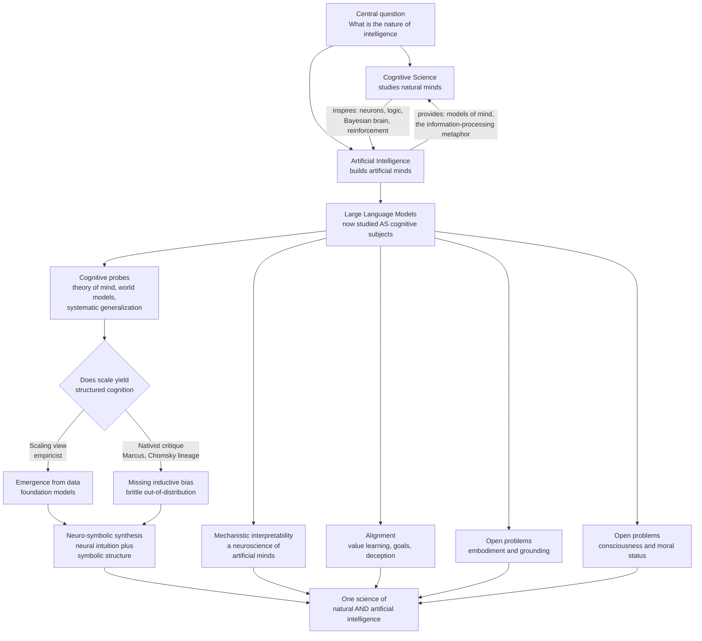

# 🔮 AI and the Future of Cognitive Science

> [!abstract] TL;DR
> Cognitive science and artificial intelligence have always been twins — both were born in the 1950s asking the *same* question, "what is the nature of intelligence?", and each has repeatedly reshaped the other. Today that relationship has flipped into something new: for the first time we have artefacts (large language models) whose behaviour is rich enough to be studied *as if they were cognitive subjects*, using the same benchmarks, ablations, and developmental probes we use on people. This revives the field's deepest fault line — **nativism vs empiricism**, now staged as *"scaling is (almost) all you need"* against *"scale without structure will never yield robust, systematic cognition"* — and it hands cognitive science powerful new tools (mechanistic interpretability as a "neuroscience" of artificial minds) and hard new problems (grounding, alignment, and the moral status of possible machine minds). The capstone bet of a mature field is that there is **one science of intelligence**, natural and artificial, and that neither mind can be fully understood without the other.

---

## Intuition

**Analogy:** For four centuries the only way to study *flight* was to watch birds — you could measure a wing, film a wingbeat, dissect a feather, but you could never *run the experiment*, never build a bird from scratch and vary one part at a time. Then aeronautics arrived. Suddenly there were *artificial fliers*: crude, un-birdlike, but real, and above all *manipulable*. Aeronautics did not just copy birds; it discovered the *principles* — lift, drag, airfoils, Reynolds numbers — that make *anything* fly, and those principles then let biologists finally understand the bird. The bird and the plane became two data points in one science of flight.

Cognitive science is now getting its aeronautics. A large language model is a strange, un-human "artificial cognizer" you can *build, probe, ablate, and re-train at will* — the experiment we could never run on a human brain. It is not a mind, and it may not think the way we do, but for the first time we can vary the parts and watch what happens to the behaviour. The prize is the same as flight's: not to prove the machine is a bird, but to find the underlying **principles of intelligence** that would let us finally understand the original — the human mind — as one instance of a more general phenomenon.

---

## How It Works

### Core Mechanics

**1. The two-way street.** The AI–cognitive-science relationship runs in both directions and always has. *Cognitive science → AI*: the perceptron came from neurons, the Language of Thought and production systems came from logic and psychology (see [[Computational_Theory_of_Mind]]), reinforcement learning came from animal conditioning, and the "Bayesian brain" gave modern probabilistic ML its priors. *AI → cognitive science*: computers gave us the very idea that the mind is an *information processor* — the founding metaphor of the 1956 cognitive revolution — and each generation of AI (symbolic systems, connectionist nets, now foundation models) has served as a *working hypothesis about how minds might work*. Today the loop tightens: models trained purely to predict text turn out to be the most detailed behavioural models of language and reasoning we have ever possessed, and cognitive science is repurposing itself to study them.

**2. LLMs as objects of cognitive study.** The genuinely new move is treating a model not as a tool but as a *subject*. Researchers now run on LLMs the very paradigms they run on humans: false-belief (theory-of-mind) tasks, syntactic garden-path sentences, analogical reasoning, causal judgement, working-memory span, cognitive-reflection puzzles. Three questions dominate:
- **Do they have world models?** Does next-token prediction force a model to build an internal, manipulable representation of the situation being described — a map of the board in a game, the spatial layout of a story — or only surface statistics? (Probing experiments on game-playing transformers suggest genuine, editable internal state; sceptics reply it is brittle and inconsistent.)
- **Do they have theory of mind?** Large models pass many classic false-belief vignettes, but performance collapses under small adversarial rewordings that a child sails through — is that competence or contamination?
- **Do they show compositional / systematic generalization?** This is the crux. *Systematicity* (Fodor & Pylyshyn) says anyone who understands "the cat chased the dog" understands "the dog chased the cat." Humans recombine known parts into novel wholes almost for free; neural nets, historically, do not, degrading sharply on combinations absent from training. Whether *scale* finally buys systematic generalization is *the* open empirical debate — and it is exactly the old connectionism-vs-symbolism fight (see [[Connectionism_and_Neural_Networks]]) reincarnated at billion-parameter scale.

**3. Benchmarking against human cognition.** To make the comparison scientific you need *matched* tasks and *matched* metrics: not just "accuracy on a leaderboard" but the *shape* of the behaviour — the error patterns, the reaction-time analogues (tokens-to-answer), the developmental trajectory, the way performance falls off with difficulty or novelty. The revealing results are rarely "model beats human" or "human beats model"; they are the *dissociations* — places where the two curves are parallel (convergence, hinting at shared computational principles) and places where they cross or diverge (a signature of a *different* underlying algorithm). Careful cognitive scientists also police **construct validity**: a benchmark can be memorised, leaked into pre-training, or solved by a shortcut, so passing it is not proof of the underlying competence it was designed to measure.

**4. Nativism vs empiricism, the sequel.** The oldest question in the study of mind — how much of intelligence is *built in* versus *learned from experience* (see [[Rationalism_and_Empiricism]]) — has come roaring back, now with an empirical testbed. The **scaling view** (associated with much of frontier industry practice, and intellectually with the empiricist tradition) holds that a largely generic architecture plus enough data and compute yields, *emergently*, most of the structure people thought had to be innate — grammar, reasoning, even rudimentary theory of mind. The **nativist critique** (Gary Marcus is its most vocal champion, standing in a lineage from Chomsky and Fodor) holds that scale produces fluent pattern-matching that *lacks* the compositional, causal, symbolic scaffolding required for robust, out-of-distribution, reliably systematic cognition — and that no amount of data fixes a missing inductive bias. Neither side has won; the LLM is the arena in which the bet is finally being *run* rather than merely argued.

**5. Neuro-symbolic integration as synthesis.** The most influential response is *not* to pick a side but to fuse them. **Neuro-symbolic AI** pairs the pattern-recognition and graceful-degradation strengths of neural networks with the compositional, verifiable, sample-efficient strengths of symbolic systems (logic, programs, knowledge graphs; see [[Logic_in_AI_and_Computation]]). Contemporary instances include tool-using and program-writing models that *offload* exact reasoning to an interpreter or theorem prover, chain-of-thought and reasoning models that externalise intermediate symbolic steps (see [[Reasoning_Models]]), and retrieval systems that ground generation in an explicit knowledge store. The cognitive-science payoff is a candidate answer to the systematicity debate: perhaps human cognition, too, is a hybrid — fast sub-symbolic intuition (System 1) plus slow, structured, symbol-like reasoning (System 2).

**6. Foundation models and emergence.** Foundation models are trained once at enormous scale on broad data, then adapted to countless tasks. Their most cognitively provocative property is claimed **emergence**: capabilities (multi-step arithmetic, in-context learning, chain-of-thought) that are near-absent in small models and appear, sometimes sharply, above a scale threshold (see [[Scaling_Laws]]). Emergence is contested — some "phase transitions" are artefacts of discontinuous, all-or-nothing metrics and smooth out under graded scoring — but the phenomenon that *quantitative* scaling yields *qualitative* behavioural change is exactly the kind of thing developmental and evolutionary cognitive science cares about, and a live case study in how competence can arise without being explicitly designed in.

**7. Embodiment and grounding, still open.** LLMs learn language from text about a world they have never touched — the **symbol grounding problem** (Harnad) in its purest modern form: their symbols are defined largely by other symbols. Embodied and enactive traditions (see [[Embodied_and_Extended_Cognition]]) argue that meaning, causal understanding, and common sense are rooted in *sensorimotor* interaction, and that disembodied text models will always have a hollow core no matter how fluent. Multimodal and robotic foundation models are the empirical test of whether grounding must be *lived* or can be *learned from correlated modalities*. This is not a settled engineering detail; it is a first-order question about what representation and meaning *are* (see [[Mental_Representation]]).

**8. Mechanistic interpretability — a cognitive neuroscience of artificial minds.** Because we can read every weight and activation of an artificial network, we can attempt something impossible in a biological brain: *complete* reverse-engineering. **Mechanistic interpretability** seeks the internal "circuits" and features a model uses — induction heads that copy patterns, directions in activation space that encode a concept, superposition packing many features into few neurons. This is, quite literally, a *neuroscience of a mind we fully instrument*, and it flows back to biology: the same probing, ablation, and representational-similarity methods bridge artificial and neural systems, and shared representational geometry between deep nets and visual cortex has already reshaped systems neuroscience. Interpretability is where the "read-out of a mind" dream of cognitive neuroscience becomes, for artificial minds, technically achievable.

**9. Alignment as a cognitive-science problem.** The **alignment problem** — getting a capable system to reliably pursue *intended* goals and values — is usually framed as safety engineering, but at its heart it is cognitive science. It requires theories of *value learning* (how does an agent infer what we want from imperfect feedback?), *theory of mind* (does the model model *us* modelling *it*?), *intention and goal representation*, and *deception* (can a system represent a difference between its displayed and pursued objectives?). Techniques like preference-based fine-tuning and red-teaming (see [[Responsible_AI]]) are, in effect, applied moral and social psychology for artificial agents; understanding *misalignment* demands a genuine account of machine goals and beliefs, not just better loss functions.

**10. Consciousness and moral status — stated neutrally.** Whether any artificial system is or could be *conscious*, and whether it could thereby acquire *moral status* (interests that matter morally), is genuinely unsettled and worth stating without hype in either direction. **Functionalist** views (see [[Functionalism_and_Machine_Minds]]) leave the door open: if mental states are defined by causal-functional role, a system with the right organisation could in principle have them, substrate notwithstanding. **Biological-naturalist** and many other views hold that phenomenal experience — the *hard problem* (see [[Consciousness_and_the_Hard_Problem]]) — may require properties current architectures lack, and warn that fluent self-report is *not* evidence of inner experience (a language model saying "I feel" is producing text, not necessarily reporting a state). The responsible scientific stance is *uncertainty plus caution*: we currently have no agreed, operational test for machine consciousness, the stakes of both false positives and false negatives are large, and the question sits squarely at the intersection of cognitive science, philosophy of mind, and ethics rather than being answerable by engineering alone.

**11. Toward one science of intelligence.** Put together, these threads point at a mature discipline that treats human and machine cognition as two instances of a common subject — a science that seeks *substrate-independent principles* (like the aerodynamics that unify bird and plane), uses artificial systems as *controllable model organisms*, uses interpretability as its *microscopy*, and keeps the old questions — innateness, compositionality, grounding, consciousness — as its permanent research agenda rather than pretending any single result has closed them.

### Flow / Architecture



---

## Key Concepts

### Secondary (explain to a curious beginner)
- **AI and the study of the mind grew up together.** Both started by asking "what is thinking?" — one builds thinking machines, the other studies thinking brains, and they keep borrowing ideas from each other.
- **We can now do experiments on an "artificial mind."** Unlike a human brain, we can open a language model up, change one piece, and watch what happens — like being able to build a bird to learn how flight works.
- **The big fight: is intelligence built-in or learned?** One camp says give a machine enough examples and it figures everything out on its own; the other says you must build in some structure first, or it will only *fake* understanding.
- **Fluent is not the same as understanding.** A model that talks about feelings, or passes a "does-it-know-what-you-believe" test, may be matching patterns rather than truly grasping — a central caution of the whole field.

### Undergraduate (needs some cognitive-science background)
- **LLMs as cognitive models.** Running human paradigms (false-belief, garden-path, analogy, causal judgement) on models to compare error patterns and generalization curves, not just leaderboard scores.
- **Systematic / compositional generalization.** The Fodor–Pylyshyn systematicity challenge, now the key empirical test dividing scaling optimists from nativist critics; humans recombine parts freely, neural nets historically do not.
- **Emergence and scaling laws.** Capabilities appearing above scale thresholds (see [[Scaling_Laws]]), and the critique that some "emergence" is an artefact of discontinuous metrics.
- **Neuro-symbolic integration.** Hybrid architectures fusing sub-symbolic pattern recognition with symbolic composition/verification; the plausible dual-process (System 1 / System 2) reading of human cognition.
- **The grounding problem.** Text-only models learn symbols defined by other symbols; whether meaning requires sensorimotor embodiment is an open, testable question.
- **Construct validity in benchmarking.** Data contamination, shortcut learning, and memorisation mean "passing the test" need not entail the competence the test targets.

### Graduate (system-level thinking)
- **World models from prediction.** Whether a self-supervised predictive objective *provably* induces manipulable latent state (evidence from probing/interventions on game-playing transformers) versus surface-statistic accounts; ties to predictive-processing theories of the biological brain.
- **The nativism–empiricism debate as an inductive-bias question.** Reframing "innate vs learned" as *which priors a learner needs* for sample-efficient, systematic, causal generalization — and whether architectural bias, data scale, or meta-learning supplies them.
- **Mechanistic interpretability as reverse-engineering.** Circuits, features, superposition, and causal ablation as a *complete-access* analogue of systems neuroscience; representational-similarity bridges (deep nets vs cortex) and what shared geometry does and does not license inferring.
- **Alignment as machine psychology.** Value learning under mis-specified reward, mesa-optimisation and deceptive alignment as *goal-representation* phenomena, and the theory-of-mind demands of oversight; why alignment is inseparable from a science of machine goals, beliefs, and intentions (see [[Intentionality_and_Mental_Content]]).
- **Substrate independence vs biological naturalism.** The functionalist case that organisation suffices for mind against views tying phenomenal consciousness to specific physical properties; the absence of an operational test for machine consciousness and the asymmetric moral risks of error.
- **A unified science of intelligence.** Seeking substrate-independent computational principles (marr's computational level; see [[Levels_of_Analysis_and_Marrs_Levels]]) using artificial systems as controllable model organisms — while resisting the fallacy that engineering success *explains* natural cognition.

---

## Python Demo

```python
# Studying LLMs as cognitive models: a simulated cognitive benchmark comparing
# an artificial learner against human data, to show WHERE artificial and human
# cognition CONVERGE and where they DIVERGE.
#
# Panel A ("in-distribution difficulty"): accuracy vs task difficulty on items
#   drawn from the training distribution. Both model and human accuracy fall off
#   smoothly with difficulty and track each other closely -> CONVERGENCE, a hint
#   of shared computational principles.
#
# Panel B ("systematic generalization"): accuracy vs COMPOSITIONAL NOVELTY --
#   how far a test item recombines known parts into unseen combinations. Humans
#   recombine known primitives almost for free (near-flat, high accuracy); the
#   model degrades sharply as novelty grows -> DIVERGENCE, the signature of the
#   Fodor-Pylyshyn systematicity gap. This is the empirical heart of the
#   scaling-vs-nativism debate. Data are synthetic but qualitatively realistic.
# Only numpy + matplotlib are used.

import numpy as np
import matplotlib.pyplot as plt

rng = np.random.default_rng(7)

def logistic(x):
    return 1.0 / (1.0 + np.exp(-x))

# ----- Panel A: accuracy vs in-distribution difficulty ----------------------
difficulty = np.linspace(0, 10, 25)          # 0 = easy, 10 = hard
# Both agents: high on easy items, graceful decline on hard ones (a shared curve)
human_A = 0.02 + 0.96 * logistic(-(difficulty - 6.0) * 0.8)
model_A = 0.02 + 0.95 * logistic(-(difficulty - 5.6) * 0.8)   # slightly earlier drop
# add measurement noise (finite subjects / prompts)
human_A_obs = np.clip(human_A + rng.normal(0, 0.03, difficulty.shape), 0, 1)
model_A_obs = np.clip(model_A + rng.normal(0, 0.03, difficulty.shape), 0, 1)

# ----- Panel B: accuracy vs compositional novelty ---------------------------
novelty = np.linspace(0, 10, 25)             # 0 = seen combos, 10 = fully novel recombination
# Human: systematic -> stays high even for novel recombinations of known parts
human_B = 0.90 - 0.06 * (novelty / 10.0)
# Model: strong in-distribution but collapses out-of-distribution (systematicity gap)
model_B = 0.05 + 0.88 * logistic(-(novelty - 3.2) * 1.1)
human_B_obs = np.clip(human_B + rng.normal(0, 0.025, novelty.shape), 0, 1)
model_B_obs = np.clip(model_B + rng.normal(0, 0.03, novelty.shape), 0, 1)

# ----- Plot -----------------------------------------------------------------
fig, (axA, axB) = plt.subplots(1, 2, figsize=(13, 5.2))

axA.plot(difficulty, human_A, color="#1b7837", lw=2, label="human (model fit)")
axA.scatter(difficulty, human_A_obs, color="#1b7837", s=22, alpha=0.7)
axA.plot(difficulty, model_A, color="#762a83", lw=2, label="LLM (model fit)")
axA.scatter(difficulty, model_A_obs, color="#762a83", s=22, alpha=0.7)
axA.axhline(0.5, ls=":", color="0.6", lw=1)
axA.set_title("A  In-distribution difficulty: CONVERGENCE\n(curves track each other)")
axA.set_xlabel("task difficulty")
axA.set_ylabel("accuracy")
axA.set_ylim(0, 1.02)
axA.legend(loc="lower left", frameon=False)

axB.plot(novelty, human_B, color="#1b7837", lw=2, label="human: systematic")
axB.scatter(novelty, human_B_obs, color="#1b7837", s=22, alpha=0.7)
axB.plot(novelty, model_B, color="#762a83", lw=2, label="LLM: brittle OOD")
axB.scatter(novelty, model_B_obs, color="#762a83", s=22, alpha=0.7)
axB.axhline(0.5, ls=":", color="0.6", lw=1)
# shade the divergence region
axB.fill_between(novelty, model_B, human_B, where=(human_B > model_B),
                 color="#f4a582", alpha=0.35, label="systematicity gap")
axB.set_title("B  Compositional novelty: DIVERGENCE\n(the systematicity gap)")
axB.set_xlabel("compositional novelty (unseen recombination)")
axB.set_ylabel("accuracy")
axB.set_ylim(0, 1.02)
axB.legend(loc="lower left", frameon=False)

fig.suptitle("LLMs as cognitive models: matched benchmarks reveal where "
             "artificial and human cognition agree and where they part",
             fontsize=13)
fig.tight_layout()
plt.savefig("llm_vs_human_cognition.png", dpi=120)
print("saved llm_vs_human_cognition.png")

# Report the single most diagnostic number: the average systematicity gap.
gap = float(np.mean(human_B - model_B))
print("mean human-minus-model accuracy on novel recombinations: %.2f" % gap)
print("Panel A convergence suggests shared principles; Panel B divergence is")
print("exactly the evidence the nativist critique presses and the scaling view")
print("must explain away as a temporary, scale-solvable artefact.")
```

Running it produces two panels. **Panel A** shows the two accuracy curves falling together as difficulty rises — the kind of *convergence* that suggests human and model may share some computational principle. **Panel B** is the punchline: as test items demand *novel recombination of familiar parts*, the human curve stays near-flat (systematic generalization) while the model's collapses, opening the shaded **systematicity gap**. Whether that gap is a permanent architectural limit (the nativist reading) or a temporary, scale-solvable artefact (the scaling reading) is precisely the debate this note is about — and the plot makes visible why *the shape of the curve*, not the peak score, is what a cognitive scientist actually cares about.

---

## Real-World Applications

> **Cognitive science of LLMs (the "machine psychology" turn).** Labs now administer classic human paradigms — false-belief theory-of-mind vignettes, cognitive-reflection tests, analogical-reasoning matrices, syntactic garden-path sentences — to frontier models and publish the error patterns alongside human baselines, treating the model as a subject. The value is in the *dissociations*: matched curves hint at shared mechanisms, crossings expose different algorithms.

> **Probing for world models.** Interpretability studies on transformers trained only to predict game moves (e.g. board games) recover an internal, *editable* representation of board state from the activations — intervene on it and the model's play changes accordingly. This is a concrete empirical handle on the ancient question of whether prediction forces genuine internal models (see [[Mental_Representation]]).

> **Neuro-symbolic and tool-using systems in production.** Reasoning models that write and execute code, call calculators/theorem provers, or retrieve from knowledge bases (see [[Reasoning_Models]]) are deployed hybrids: neural intuition proposes, a symbolic engine verifies. They are the working prototype of the dual-process synthesis and a testbed for whether externalised structure closes the systematicity gap.

> **Interpretability as a research programme.** Mechanistic interpretability (induction heads, feature directions, sparse-autoencoder features, causal ablations) has become a standard method both for AI safety and for a *cognitive neuroscience of artificial networks*; the same representational-similarity analyses now bridge deep-net and cortical activity in systems-neuroscience labs.

> **Alignment and evaluation pipelines.** Preference fine-tuning, model-written evaluations, and adversarial red-teaming (see [[Responsible_AI]]) operationalise value learning and theory-of-mind for artificial agents — applied cognitive/social psychology aimed at machine goals rather than human ones.

---

## Common Pitfalls

- **Fluency-as-understanding (the ELIZA effect at scale).** Coherent, first-person, emotionally apt text is *not* evidence of comprehension, belief, or feeling. Attributing inner states from surface output is the field's oldest error, now supercharged; a model saying "I understand" is producing tokens, not filing a psychological report.
- **Benchmark contamination and shortcut learning.** A model may "pass" a reasoning or theory-of-mind test because the items (or near-paraphrases) leaked into pre-training, or because a spurious cue solves it. Without contamination controls and adversarial rewordings, high scores measure memorisation, not the targeted competence.
- **Treating emergence as magic.** "Capabilities appear at scale" is real but easy to over-read: some sharp jumps are artefacts of all-or-nothing metrics and vanish under graded scoring. Emergence is a phenomenon to *explain*, not an explanation to *invoke*.
- **Declaring the systematicity debate settled — in either direction.** Neither "scale already solved it" nor "neural nets can never do it" is established. The honest position is that systematic generalization is a *measured, ongoing* question, exactly as it was for connectionism in 1988 (see [[Connectionism_and_Neural_Networks]]).
- **The engineering-explains-biology fallacy.** That a network *does* a task a brain does — even at human level — does not show the brain does it the *same way*. Behavioural match is necessary, not sufficient; you need mechanistic and representational evidence before claiming a model *explains* human cognition.
- **Anthropomorphism and its mirror, carbon chauvinism.** Both over-attributing human mentality to models and dogmatically denying any could ever have minds are unargued defaults. On consciousness and moral status the defensible stance is *calibrated uncertainty*, because we lack an operational test and the costs of error run both ways.
- **Ignoring grounding.** Impressive text performance can mask that symbols are defined only by other symbols. Common-sense and causal failures often trace to missing sensorimotor grounding (see [[Embodied_and_Extended_Cognition]]), not to insufficient scale.

---

## Related Concepts

- [[Computational_Theory_of_Mind]] — the symbolic, Language-of-Thought hypothesis whose systematicity and grounding arguments are the direct ancestors of today's LLM debates; the nativist critique is CTM pressing back on scaling.
- [[Connectionism_and_Neural_Networks]] — LLMs *are* connectionism at scale; the scaling-vs-nativism fight is the Fodor–Pylyshyn systematicity challenge reincarnated, so this note is its modern sequel.
- [[Reasoning_Models]] — the concrete neuro-symbolic and chain-of-thought systems that externalise structured reasoning and test whether it closes the systematicity gap.
- [[Scaling_Laws]] — the empirical basis of the "scale is (almost) all you need" position and of the emergence debate.
- [[Rationalism_and_Empiricism]] — the innate-vs-learned axis whose modern staging (Marcus vs the scaling view) organises the whole chapter.
- [[Logic_in_AI_and_Computation]] — the symbolic half of neuro-symbolic integration: logic, programs, and verifiable inference fused with neural pattern recognition.
- [[Embodied_and_Extended_Cognition]] — the grounding critique: whether disembodied text models can ever have genuine meaning without sensorimotor interaction.
- [[Mental_Representation]] — the "do LLMs build world models?" question is a representation-format debate about whether prediction induces manipulable internal state.
- [[Functionalism_and_Machine_Minds]] — the philosophical case that organisation, not substrate, is what makes a mind; the permissive backdrop for machine-consciousness questions.
- [[Consciousness_and_the_Hard_Problem]] — why fluent self-report is not evidence of phenomenal experience, and why machine consciousness resists an operational test.
- [[Intentionality_and_Mental_Content]] — needed to make sense of "machine goals," deception, and value learning in the alignment problem.
- [[Levels_of_Analysis_and_Marrs_Levels]] — the framework for seeking substrate-independent computational principles common to natural and artificial intelligence.
- [[Cognitive_Science_Overview]] — the field this note serves as a capstone for; the interdisciplinary project AI has both seeded and disrupted.
- [[Responsible_AI]] — alignment, red-teaming, and value learning as the applied, safety-facing edge of machine cognition.

---

## Review Questions

1. **(Conceptual)** Explain the two-way relationship between AI and cognitive science with one concrete historical example flowing in each direction. Then argue whether treating a large language model *as a cognitive subject* is a genuinely new kind of scientific move or merely an old computer-simulation methodology dressed up — what, if anything, is different this time?
2. **(Scenario)** You are handed a frontier model that passes a battery of false-belief (theory-of-mind) tasks at adult-human level. A journalist concludes "it understands other minds." Design an experimental protocol — using matched human baselines, adversarial rewordings, contamination checks, and mechanistic probes — that could distinguish *genuine theory-of-mind competence* from *benchmark-passing without it*. What result would move you toward each conclusion?
3. **(Trade-off)** The scaling view and the nativist critique make opposite bets about whether systematic, compositional generalization will emerge from scale alone, and neuro-symbolic integration proposes a synthesis. Lay out the strongest case for each of the three positions, state one empirical result that would count *decisively against* each, and defend which you would fund if you could support only one research programme for the next decade.

---

## Sources

- Marcus, G. & Davis, E. (2019). *Rebooting AI: Building Artificial Intelligence We Can Trust*. Pantheon. (The nativist / structured-cognition critique of pure scaling.)
- Mitchell, M. & Krakauer, D. C. (2023). "The debate over understanding in AI's large language models." *PNAS*, 120(13), e2215907120. https://doi.org/10.1073/pnas.2215907120
- Wei, J. et al. (2022). "Emergent Abilities of Large Language Models." *Transactions on Machine Learning Research*. https://arxiv.org/abs/2206.07682 (see also Schaeffer et al., 2023, "Are Emergent Abilities a Mirage?", https://arxiv.org/abs/2304.15004)
- Lake, B. M., Ullman, T. D., Tenenbaum, J. B. & Gershman, S. J. (2017). "Building machines that learn and think like people." *Behavioral and Brain Sciences*, 40, e253. https://doi.org/10.1017/S0140525X16001837
- Olah, C. et al. (2020). "Zoom In: An Introduction to Circuits." *Distill*. https://distill.pub/2020/circuits/zoom-in/ (foundational mechanistic-interpretability programme)
- Butlin, P. et al. (2023). "Consciousness in Artificial Intelligence: Insights from the Science of Consciousness." https://arxiv.org/abs/2308.08708 (neutral survey of criteria for machine consciousness)

---

#cognitive-science #artificial-intelligence #llms #machine-cognition #future
