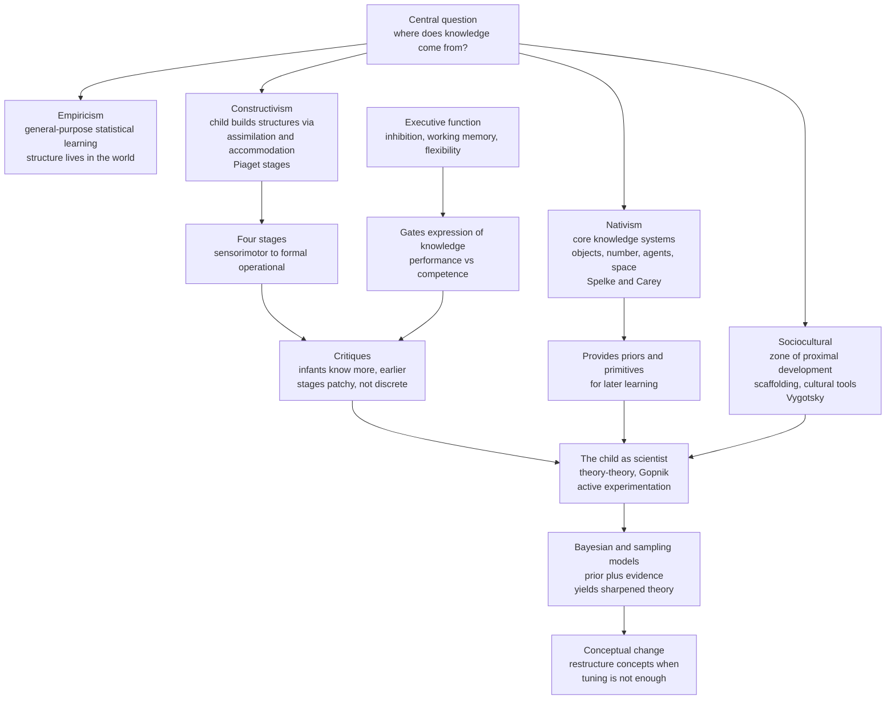

# 🧒 Cognitive Development

> [!abstract] TL;DR
> **Cognitive development** is the study of how thinking itself is built — how an infant who cannot yet track a hidden object becomes an adult who reasons about hypothetical worlds. The field is organized around one enduring question: **where does knowledge come from?** Four traditions answer differently. **Piaget** saw a lone child *constructing* logical structures through stages (sensorimotor, preoperational, concrete operational, formal operational). **Vygotsky** saw development as fundamentally **social**, driven by cultural tools and by adults *scaffolding* the child through a **zone of proximal development**. The **core knowledge** hypothesis (Spelke, Carey) argues that evolution front-loads a handful of **innate systems** — for objects, number, agents, and space — that give learning a running start. And the modern **"child as scientist"** view (Gopnik) recasts the developing mind as a **Bayesian learner** that forms intuitive theories, tests them against evidence, and *restructures* them through **conceptual change**. Clever infant methods — **habituation**, **violation-of-expectation**, **preferential looking** — let us read these theories off the surprised stares of pre-verbal babies.

---

## Intuition

**Analogy:** Watch a toddler with a new toy. She does not read the manual. She shakes it, drops it, puts it in her mouth, presses every button, and watches what happens — running a rapid-fire sequence of little experiments. When the toy does something unexpected, she pauses, stares, and tries again. She is behaving *exactly* like a scientist in a lab: she has a rough theory of how the toy works, she gathers evidence, and when the evidence violates her prediction she updates the theory. Multiply this over thousands of objects, people, and words, and you have childhood.

That single image — **the child as scientist** — reframes the whole field. Development is not a passive filling-up of an empty vessel, nor the mechanical unfolding of a genetic program. It is **active inference**: a learner equipped with some starting assumptions, immersed in a stream of evidence, revising its model of physics, number, minds, and language. The technical machinery of this note — Piaget's stages, core knowledge, sociocultural scaffolding, Bayesian models — are all attempts to specify *what the child starts with*, *what evidence it gets*, and *how it updates*.

---

## How It Works

### The central axis: nativism vs empiricism vs constructivism

Every theory of development takes a stance on the **origins of knowledge**, the oldest question in epistemology, imported into the lab:

- **Empiricism** — the mind starts as a general-purpose learner; knowledge is *extracted* from sensory experience by association and statistics. Structure lives in the world, and the child mirrors it.
- **Nativism** — evolution supplies **domain-specific** starting knowledge; learning fills in parameters within pre-structured systems. Structure lives partly in the child from birth.
- **Constructivism** (Piaget's synthesis) — knowledge is neither given by the world nor pre-installed, but *built* by the child through interaction, via **assimilation** (fitting new input to existing schemes) and **accommodation** (revising schemes when they fail).

Modern developmental cognitive science is largely a **rapprochement**: rich innate *starting points* plus powerful *statistical learning* plus *social* transmission, formalized in probabilistic models.

### Piaget's stage theory

Piaget proposed that children pass through four qualitatively distinct stages, each a reorganization of the previous logic:

1. **Sensorimotor** (birth to ~2 yrs) — intelligence is enacted through perception and action. The landmark achievement is **object permanence**: understanding that an object continues to exist when out of sight. Young infants fail the classic hiding task and commit the **A-not-B error** — reaching to the old hiding place even after watching the object hidden in a new one.
2. **Preoperational** (~2 to 7 yrs) — symbolic thought (language, pretend play) blooms, but reasoning is pre-logical. Two signatures: **egocentrism** (failing to represent another's spatial or mental viewpoint, as in the *three-mountains task*) and failure of **conservation** (believing that pouring water into a taller glass increases the amount).
3. **Concrete operational** (~7 to 11 yrs) — logical operations appear, but tied to concrete objects. The child now **conserves** quantity, understands reversibility, and can classify and seriate.
4. **Formal operational** (~11+ yrs) — abstract, hypothetical, and systematic reasoning; the child can reason about possibilities and run mental experiments, as in the pendulum task.

### The critiques of Piaget

Piaget's framework is foundational but was substantially revised:

- **He underestimated infants.** Non-reaching methods (looking time) reveal object permanence and numerical sensitivity *far earlier* than his reaching tasks implied. The A-not-B error looks more like an immature **executive/reaching** system than an absence of the object concept.
- **Stages are not as unified or discrete** as claimed. Competence is **domain-specific** and task-dependent — a child may "conserve" number before mass; development looks more continuous and patchy than staircase-like.
- **Performance vs competence.** Failures often reflect task demands (memory, inhibition, language) masking underlying knowledge, not its absence.
- **Formal operations are not universal** — many adults fail formal-operational tasks in unfamiliar domains, and the endpoint is culturally shaped.

### Vygotsky's sociocultural theory

Where Piaget's child is a lone scientist, Vygotsky's child is an **apprentice**. Higher cognition is *first* social and *then* internalized. Key constructs:

- **Zone of proximal development (ZPD)** — the gap between what a child can do alone and what they can do with a more capable partner's help. Learning happens *in* this zone.
- **Scaffolding** — the temporary, adjustable support a teacher provides, withdrawn as competence grows.
- **Cultural tools** — language, number systems, and notations are *cognitive technologies* inherited from the culture that reorganize thinking (e.g., counting words bootstrap exact number).

### Core knowledge

Spelke and Carey argue that infants are not blank slates but come equipped with a small set of **core knowledge systems** — evolutionarily ancient, encapsulated, and shared with other animals — that carve the world into privileged domains:

- **Objects** — cohesion, continuity, and contact; objects move as bounded wholes on continuous paths.
- **Number** — an approximate magnitude system (the **ANS**) plus a small-set object-tracking system, giving pre-verbal numerical discrimination.
- **Agents** — goal-directed, self-propelled entities whose actions are interpreted teleologically; the seed of **theory of mind**.
- **Space / geometry** — reorientation using geometric layout.

These systems provide the **priors** and the **conceptual primitives** that later learning builds on and, crucially, sometimes must *overturn* through conceptual change.

### Infant cognition methods

We infer pre-verbal knowledge from **where and how long babies look**:

- **Habituation** — repeated presentation of a stimulus lowers looking time; a novel stimulus **dishabituates** (recovers) attention, revealing discrimination.
- **Violation-of-expectation (VOE)** — infants look *longer* at physically impossible or expectation-violating events (an object passing through a solid wall), evidence that they *held* the violated expectation.
- **Preferential looking** — comparing looking time to two displays reveals discrimination and preference.

### The child as scientist, theory-theory, and the Bayesian child

Gopnik's **theory-theory** proposes that children's everyday knowledge is organized like **scientific theories** — coherent, causal, abstract, defeasible — and that development is **theory change** driven by evidence, including *active experimentation* (the toddler's relentless testing). Computationally, this is formalized as **Bayesian inference over structured hypotheses**: the child holds a *prior* over possible causal structures, computes the *likelihood* of observed evidence under each, and updates to a *posterior* that **sharpens with data**. The **"sampling child"** variant notes that children may not track full distributions but *sample* hypotheses — explaining their variability, exploration, and occasional systematic errors. **Conceptual change** is the hard case: sometimes new evidence cannot be accommodated by tuning parameters and forces a *restructuring* of the concepts themselves (e.g., building the integer concept, or revising a flat-earth intuitive physics).

### Executive function development

Cutting across every domain is the slow maturation of **executive function** — **inhibition**, **working memory**, and **cognitive flexibility** — anchored in prefrontal cortex. Much apparent conceptual failure (A-not-B, some conservation and false-belief errors) is really a failure to *inhibit* a prepotent response or *hold* task rules in mind. Executive function is a rate-limiting resource on the expression of knowledge.



---

## Key Concepts

### Secondary (intuition-level)
- **Kids are little scientists.** They form rough theories about how the world works and revise them when reality surprises them.
- **Object permanence**: young infants act as if a hidden toy stops existing; older ones search for it.
- **Conservation**: a preschooler thinks a tall thin glass holds *more* water than a short wide one, even after watching you pour.
- **Egocentrism**: young children struggle to take another person's point of view.
- **You learn faster with help**: a good teacher supports you at just the right level and then lets go — that is scaffolding.

### Undergraduate (mechanism-level)
- **Piaget's four stages** and their signatures: object permanence and the **A-not-B error** (sensorimotor); egocentrism and conservation failure (preoperational); conservation and reversibility (concrete operational); hypothetical-deductive reasoning (formal operational).
- **Assimilation vs accommodation** as the twin engines of constructivist change, driven by **disequilibrium**.
- **Vygotsky's ZPD, scaffolding, and cultural tools**; internalization of social speech into inner thought.
- **Core knowledge systems** (objects, number, agents, space) as innate, domain-specific starting points shared across species.
- **Infant methods**: habituation/dishabituation, violation-of-expectation (looking longer at impossible events), preferential looking — the logic that *longer looking reveals held expectations*.
- **Performance vs competence**: task demands (memory, inhibition, language) can mask real knowledge — the key to the Piaget critiques.

### Graduate (debate-level)
- **Nativism vs empiricism vs constructivism** as a formal tradeoff: how much structure is in the **prior** versus learned from **data**? Modern models make this quantitative rather than rhetorical.
- **Theory-theory** (Gopnik & Wellman) vs **modular / core-knowledge** accounts (Carey, Spelke): are children's concepts revisable *theories* or encapsulated *modules*? The truth is likely layered — core systems as priors, theories as the revisable overlay.
- **Bayesian models of development** (Tenenbaum, Gopnik, Xu): learning as inference over structured hypothesis spaces; the **"sampling child"** and **resource-rational** accounts explain exploration, variability, and why children sometimes *out-explore* adults.
- **Conceptual change** (Carey's *bootstrapping*): how a learner acquires concepts *not expressible* in its current representational vocabulary — the integer concept, the biological concept of "alive," a heliocentric intuitive astronomy. This is the deepest unsolved problem, because Bayesian updating within a fixed hypothesis space cannot, by itself, invent new hypotheses.
- **Numerical cognition development**: from the **approximate number system (ANS)** and small-set tracking to the **cardinal principle** — how the count list is bootstrapped into exact number, and the role of language and cultural number words.
- **Executive function as a mediator**: dissociating *conceptual* deficits from *performance* limits (inhibition, working memory) reframes many classic developmental "milestones."

---

## Python Demo

We model the **child as scientist** with a canonical developmental paradigm: Gopnik's **blicket detector**. A machine lights up when a "blicket" is placed on it; ordinary objects do nothing. The child must infer the **hidden causal structure** — *which* objects are blickets — from a stream of observations, exactly the inductive problem a real child solves for physics, biology, and other minds.

We give a **Bayesian learner** a uniform prior over the 8 possible causal hypotheses (each of 3 objects independently a blicket or not), a **noisy-OR** likelihood (the detector activates if any present object is a blicket, with a small lapse rate), and a growing sequence of trials. We then watch two things: (1) the learner's **marginal belief** that each object is a blicket, and (2) the **posterior entropy**, a measure of overall uncertainty. The point is developmental: *with more evidence the model sharpens* — beliefs converge to the truth and uncertainty collapses.

```python
# The "child as scientist": a Bayesian learner infers a hidden causal
# structure (which objects are "blickets") from blicket-detector evidence.
# We watch beliefs SHARPEN with more observations -> a model of development.
import numpy as np
import matplotlib.pyplot as plt

rng = np.random.default_rng(7)

# Ground truth: objects A, B, C. A and C are blickets; B is not.
n_obj = 3
true_blicket = np.array([1, 0, 1])          # hidden causal structure
lapse = 0.05                                 # detector noise (noisy-OR lapse)

# Hypothesis space: all 2**3 = 8 assignments of blicket / not-blicket.
H = np.array([[ (h >> k) & 1 for k in range(n_obj)] for h in range(2**n_obj)])
log_prior = np.log(np.full(len(H), 1.0 / len(H)))   # uniform prior
log_post = log_prior.copy()

def detector_prob(present, blicket):
    """P(detector activates) under a noisy-OR cause given which objects are present."""
    any_blicket = np.any(present & blicket)
    return (1 - lapse) if any_blicket else lapse

# Simulate a developmental stream of learning trials.
n_trials = 30
marginals = np.zeros((n_trials + 1, n_obj))   # P(object is a blicket) over time
entropy = np.zeros(n_trials + 1)

def record(t):
    post = np.exp(log_post - np.logaddexp.reduce(log_post))  # normalize
    marginals[t] = post @ H                                  # marginal per object
    entropy[t] = -np.sum(post * np.log(post + 1e-12))        # posterior uncertainty

record(0)  # beliefs before any evidence: everything at 0.5, max uncertainty

for t in range(1, n_trials + 1):
    # Present a random non-empty subset of objects on the detector.
    while True:
        present = rng.integers(0, 2, size=n_obj).astype(bool)
        if present.any():
            break
    # Observe the (noisy) outcome generated by the TRUE structure.
    p_on = detector_prob(present, true_blicket)
    lit = rng.random() < p_on

    # Bayesian update: likelihood of this observation under every hypothesis.
    for i, h in enumerate(H):
        p = detector_prob(present, h)
        log_post[i] += np.log(p if lit else (1 - p))
    log_post -= np.logaddexp.reduce(log_post)   # renormalize in log space
    record(t)

# ---- Visualize the belief trajectories and the sharpening of the model ----
fig, (ax1, ax2) = plt.subplots(1, 2, figsize=(12, 4.6))
trials = np.arange(n_trials + 1)
colors = ["#059669", "#dc2626", "#2563eb"]
names = ["A  (true blicket)", "B  (not a blicket)", "C  (true blicket)"]

for k in range(n_obj):
    ax1.plot(trials, marginals[:, k], color=colors[k], lw=2.2, marker="o",
             ms=3, label=names[k])
ax1.axhline(0.5, color="gray", ls="--", lw=1)
ax1.set_xlabel("learning trials (evidence accumulated)")
ax1.set_ylabel("belief: P(object is a blicket)")
ax1.set_title("Belief trajectories: the child infers the hidden causes")
ax1.set_ylim(-0.03, 1.03)
ax1.legend(loc="center right")

ax2.plot(trials, entropy, color="#7c3aed", lw=2.4, marker="s", ms=3)
ax2.set_xlabel("learning trials (evidence accumulated)")
ax2.set_ylabel("posterior entropy (nats)")
ax2.set_title("The model sharpens: uncertainty collapses with data")

plt.tight_layout()
plt.show()

final = np.exp(log_post - np.logaddexp.reduce(log_post)) @ H
print("Final beliefs P(blicket): A={:.2f} B={:.2f} C={:.2f}".format(*final))
print("True structure          : A=1.00 B=0.00 C=1.00")
```

**What it shows.** The learner starts at maximum uncertainty — every object at belief 0.5 and posterior entropy near its ceiling. As trials accumulate, the belief for the true blickets (A and C) climbs toward 1.0 while B's collapses toward 0.0, and the entropy curve decays as the posterior concentrates on the single correct causal structure. This is a computational cartoon of **development**: the *same* inference machinery, given *more evidence*, converges from a diffuse, all-possibilities-open state to a sharp, confident theory. It also exposes the boundary of the story — the learner can only *select among* the 8 pre-enumerated hypotheses. Real **conceptual change** (inventing a hypothesis the child could not previously represent) is precisely what a fixed hypothesis space cannot do, which is why bootstrapping remains the field's hardest problem.

---

## Real-World Applications

- **Education and curriculum design.** Vygotsky's ZPD is the theoretical backbone of **scaffolded instruction**, formative assessment, and mastery learning: pitch tasks just beyond independent ability and fade support. Piaget's stages inform *developmentally appropriate* sequencing (concrete manipulatives before abstract symbols).
- **Early math intervention.** The ANS-to-exact-number research directly shapes preschool numeracy programs; games that strengthen the approximate number system and the counting routine (cardinal principle) improve later arithmetic.
- **Developmental screening and clinical practice.** Violation-of-expectation and preferential-looking paradigms underpin infant assessments; delays in object permanence, joint attention, or false-belief understanding are early markers used in autism and developmental-delay screening.
- **Child-centered AI and curriculum learning.** The "child as scientist" and **curiosity-driven exploration** inspire machine-learning methods — **curriculum learning**, **active learning**, and intrinsic-motivation agents that, like children, choose maximally *informative* experiments rather than passively consuming data.
- **Ed-tech and intelligent tutoring systems.** Bayesian knowledge-tracing models a learner's belief state and adapts problems to the ZPD, a direct engineering descendant of the Bayesian-child framework.
- **Toy and interface design.** Understanding infant core knowledge (objects, agents, contact causality) guides the design of developmentally engaging toys, apps, and interfaces that exploit rather than fight innate expectations.

---

## Common Pitfalls

- **Reading Piaget's stages as rigid, universal, and discrete.** Development is domain-specific, continuous, and culturally shaped; a child who conserves number may not conserve mass. Treat stages as useful descriptions, not a fixed timetable.
- **Confusing performance with competence.** A child who fails a task may *know* the answer but lack the working memory, inhibition, or language to show it. The infant-methods revolution exists precisely because reaching tasks *underestimated* knowledge.
- **Assuming looking time reads out concepts transparently.** Violation-of-expectation is powerful but interpretively contested — longer looking can reflect low-level novelty or perceptual mismatch, not necessarily a rich conceptual expectation. Converging measures are essential.
- **Treating nativism and empiricism as a winner-take-all war.** The productive question is *quantitative*: how much structure sits in the prior versus the data? Modern Bayesian and neural-network models dissolve the dichotomy into a modeling choice.
- **Believing Bayesian updating explains conceptual change.** Standard Bayesian inference *selects among* hypotheses in a fixed space; it does not *invent* new concepts. Genuine conceptual change (bootstrapping the integer, revising intuitive physics) needs additional machinery — a live research frontier, not a solved problem.
- **Ignoring the social channel.** Purely individual accounts miss that much knowledge is *transmitted*, not rediscovered; cultural tools and testimony do enormous developmental work that a lone-scientist model omits.
- **Over-attributing failures to concepts rather than executive function.** The A-not-B error and some false-belief failures track *inhibitory control* maturation as much as conceptual understanding.

---

## Related Concepts

- [[Piagets_Cognitive_Development]] — the Psychology-vault treatment of Piaget's stages, schemes, and equilibration that this note situates within computational developmental science.
- [[Language_Development]] — the parallel developmental story for language; cultural tools, the ZPD, and bootstrapping all bear on how words are acquired.
- [[Moral_Development]] — Kohlberg's stage account is a direct descendant of Piaget's method applied to moral reasoning; same stage-theory strengths and critiques.
- [[Lifespan_Development]] — extends the developmental frame across the whole life course, beyond childhood cognition.
- [[Attachment_Theory]] — the social-emotional counterpart; the caregiver relationship is the substrate on which Vygotskian scaffolding and joint attention operate.
- [[Concepts_and_Categorization]] — conceptual change and the acquisition of categories are the developmental face of how concepts are structured and revised.
- [[Reasoning_and_Inference]] — formal-operational reasoning is where Piaget's endpoint meets the adult psychology of reasoning; the Bayesian-child view links the two.
- [[Research_Methods_in_Cognitive_Science]] — habituation, violation-of-expectation, and preferential looking are specialized cases of the field's inferential methods.
- [[Mental_Representation]] — what is being *built* over development; theories of representation ground the theory-theory debate.
- [[Knowledge_Representation]] — structured hypothesis spaces and causal graphs are how Bayesian-development models represent the child's evolving theories.
- [[Working_Memory_and_Cognitive_Load]] — executive-function development gates the *expression* of knowledge and drives the performance-versus-competence distinction.
- [[Computational_Theory_of_Mind]] — the computational-inference framing that lets us model the child as a Bayesian learner in the first place.
- [[Rationalism_vs_Empiricism]] — the philosophical origin of the nativism-empiricism debate that structures the entire field.

---

## Review Questions

1. **(Conceptual)** Explain how a single dissociation — infants *reaching* incorrectly in the A-not-B task but *looking* correctly in a violation-of-expectation version — supports the "performance versus competence" critique of Piaget. What does each method measure, and why do they diverge?
2. **(Scenario / applied)** You are designing a preschool program to build exact-number understanding. Using the approximate number system, the cardinal principle, and Vygotsky's zone of proximal development, describe two concrete activities and justify *why* each targets the mechanism the research implicates.
3. **(Trade-off / synthesis)** The Bayesian "child as scientist" elegantly models how beliefs *sharpen* with evidence, yet critics say it cannot explain **conceptual change**. State precisely what standard Bayesian updating can and cannot do, why bootstrapping a genuinely new concept (like the integer) escapes it, and what a satisfying account would need to add. How do core-knowledge and sociocultural theories each contribute to closing that gap?

---

## Sources

- Piaget, J. (1952). *The Origins of Intelligence in Children*. International Universities Press.
- Vygotsky, L. S. (1978). *Mind in Society: The Development of Higher Psychological Processes*. Harvard University Press.
- Spelke, E. S., & Kinzler, K. D. (2007). "Core knowledge." *Developmental Science*, 10(1), 89–96.
- Carey, S. (2009). *The Origin of Concepts*. Oxford University Press.
- Gopnik, A., & Wellman, H. M. (2012). "Reconstructing constructivism: Causal models, Bayesian learning mechanisms, and the theory theory." *Psychological Bulletin*, 138(6), 1085–1108.
- Xu, F., & Kushnir, T. (2013). "Infants are rational constructivist learners." *Current Directions in Psychological Science*, 22(1), 28–32.

---

#cognitive-science #cognitive-development #piaget #core-knowledge #developmental
