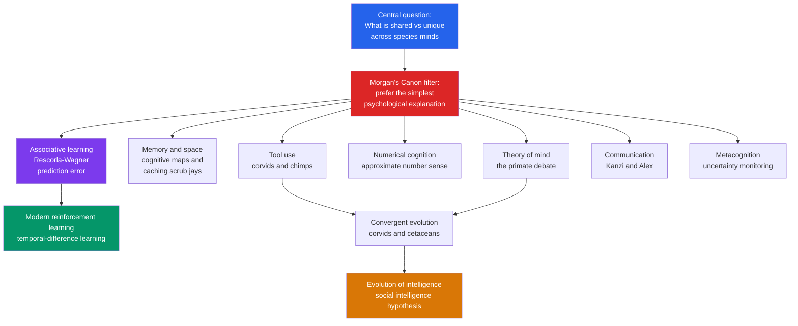

# 🦜 Comparative and Animal Cognition

> [!abstract] TL;DR
> Comparative cognition studies **what mental abilities are shared across species and what, if anything, is uniquely human**, by testing other animals on memory, learning, tool use, number, communication, and social reasoning. Its methodological backbone is **Morgan's Canon** — never invoke a higher mental faculty when a simpler one explains the behaviour. Its most influential formal result is the **Rescorla-Wagner model** of associative learning, whose core idea — that learning is driven by **prediction error**, the gap between expected and actual outcomes — anticipated modern **reinforcement learning** by decades. The field consistently finds that cognition is graded and often **convergent** (corvids and apes independently evolved similar smarts), forcing us to see human cognition as one branch of a much larger evolutionary tree rather than a separate kingdom.

---

## Intuition

**Analogy: reverse-engineering closed devices from behaviour alone.**

Imagine you are handed a dozen sealed electronic devices with no manuals and no way to open them. You can only press buttons and watch what happens. Some devices clearly share circuitry — press the same button, get the same beep — while others behave in ways nothing else can match. Your job is to infer the *internal machinery* of each purely from its input-output behaviour, and to figure out which parts were inherited from a common design and which were invented separately.

That is exactly the position a comparative psychologist is in with animal minds. You cannot ask a scrub jay what it remembers or interview a chimpanzee about its beliefs. You can only design clever tasks — press buttons — and infer the hidden cognitive machinery from responses. And crucially, when a device beeps, you must resist assuming it "wants" to beep: maybe it is just a simple reflex circuit, not a tiny conscious agent. That discipline of preferring the simplest wiring diagram that fits the data is **Morgan's Canon**, and it is the intellectual heart of the whole field.

---

## How It Works

### The comparative approach: shared vs unique

The field asks two entangled questions. First, **homology vs analogy**: is a shared ability inherited from a common ancestor (like the primate visual system) or independently evolved to solve a similar problem (**convergent evolution**, like flight in birds and bats)? Second, **continuity vs discontinuity**: are human abilities quantitatively enhanced versions of animal ones, or are some qualitatively new? Darwin argued the difference in mind between humans and higher animals is "one of degree and not of kind" — a claim the field has spent 150 years testing and qualifying.

### Morgan's Canon: parsimony as a razor

C. Lloyd Morgan's 1894 rule states: *"In no case may we interpret an action as the outcome of the exercise of a higher psychical faculty, if it can be interpreted as the outcome of one which stands lower in the psychological scale."* It is a species-specific Occam's razor that guards against naive **anthropomorphism** — projecting rich human mental states onto animals. A rat pressing a lever need not "believe" food is coming; a strengthened stimulus-response association suffices. The canon forces the burden of proof onto claims of complex cognition.

### Associative learning and the prediction-error revolution

The workhorse mechanism is **associative learning** (see [[Classical_Conditioning]]). The breakthrough insight, formalised by **Rescorla and Wagner in 1972**, is that animals do not learn from mere co-occurrence but from **surprise**. A cue only gains associative strength to the extent that the outcome was *not already predicted*. Formally, the change in a cue's strength on each trial is proportional to the **prediction error** — the difference between the outcome that occurred and the total outcome predicted by all cues present:

- If the outcome is fully predicted, prediction error is zero and *nothing new is learned*, even with continued pairing.
- **Blocking** (Kamin, 1969) is the signature demonstration: if cue A already predicts a shock, adding a redundant cue B to the compound A+B teaches the animal almost nothing about B — because A has already "used up" the available prediction error. Mere pairing of B with shock is not enough.

This prediction-error principle is the direct ancestor of **temporal-difference learning** in modern AI (see [[RL_Fundamentals]]), and dopamine neurons were later found to fire exactly like a Rescorla-Wagner error signal (see [[Decision_Making_and_Reward_Circuits]]).

### Beyond association: the higher-cognition frontier

Not everything reduces to association. Scrub jays remember *what* they cached, *where*, and *how long ago* — an **episodic-like memory** structure. Corvids and apes make and use tools, discriminate quantities, and — more controversially — may track what others can see and know. Each of these is a battleground between rich cognitive interpretations and lean associative ones, refereed by Morgan's Canon.



---

## Key Concepts

### Secondary Level

**The comparative approach.** We learn about the mind by comparing species. Similar brains and behaviours sometimes come from a *shared ancestor* and sometimes are *independently evolved* to solve the same problem. This is why studying a crow or an octopus tells us something general about how minds are built.

**Morgan's Canon (parsimony).** Prefer the simplest explanation. If a dog can find a hidden ball through simple learned association, do not claim it is "reasoning" like a person. The rule protects science from wishful anthropomorphism.

**Associative learning and blocking.** Animals learn which cues predict important events. But they do not learn about a cue that tells them nothing *new* — if a bell already predicts food, a light added alongside it is largely ignored. Learning tracks **surprise**, not mere pairing.

**Famous animal minds.** *Alex* the African grey parrot labelled colours, shapes, and quantities and answered novel questions. *Kanzi* the bonobo learned symbols and comprehends spoken English sentences. *Betty* and other New Caledonian crows bend wire into hooks to extract food. These cases anchor debates about how far animal cognition reaches.

### Undergraduate Level

**Cognitive maps and spatial cognition.** Tolman (1948) argued rats build an internal **cognitive map** rather than a chain of stimulus-response habits, shown by their ability to take novel shortcuts. This mental representation of space is neurally implemented by hippocampal **place cells** and entorhinal **grid cells** (O'Keefe; Moser & Moser), directly linking a behavioural construct to a brain mechanism (see [[Mental_Representation]]).

**Episodic-like memory in scrub jays.** Clayton and Dickinson (1998) showed western scrub jays remember *what* food they cached, *where*, and *when* — recovering perishable worms before they rot but switching to durable nuts once the worms would have spoiled. Because we cannot verify the accompanying subjective "mental time travel," it is called **episodic-*like*** memory, a careful nod to Morgan's Canon (contrast with human [[Long_Term_Memory_Systems]]).

**Tool use and physical cognition.** Chimpanzees fish for termites and crack nuts with stone hammers and anvils, transmitting techniques culturally. New Caledonian crows manufacture and even *metatool* (use one tool to get another). Weir & Kacelnik's wire-bending crow demonstrated innovation, not just imitation. Some corvids pass variants of the Aesop's-fable water-displacement task, showing folk-physical reasoning about volume and buoyancy.

**Numerical cognition.** Many species possess an **approximate number system** obeying Weber's law: discrimination depends on the *ratio* of quantities, not absolute difference. Rhesus monkeys order numerosities; Alex the parrot used number words; even fish and bees show quantity sensitivity. This suggests a phylogenetically ancient, non-verbal "number sense" that human symbolic mathematics is built on top of.

**Animal communication vs language.** Vervet monkeys give distinct alarm calls for leopards, eagles, and snakes — referential-*like* signals. But natural animal communication generally lacks the open-ended **generativity**, **syntax**, and **displacement** (referring to things not present) of human language. Ape sign-language and lexigram projects (Washoe, Kanzi) show impressive *comprehension* and symbol use but little productive grammar — the limits are as informative as the successes.

### Graduate Level

**Theory of mind: the primate debate.** Do chimpanzees attribute mental states? Premack & Woodruff (1978) posed the question; decades of work give a nuanced answer. Chimps track what conspecifics *can see* and *have seen* (Hare, Call & Tomasello's competitive paradigms) and Krupenye et al. (2016) showed apes anticipate an agent's actions based on a **false belief** using anticipatory looking. But whether this is genuine belief attribution or sophisticated **behaviour-reading** ("she will go where she last looked") remains contested — the **logical problem** of distinguishing mentalising from behavioural rules is deep and possibly unsolvable by any single experiment.

**Metacognition.** Some animals appear to monitor their own uncertainty. In Smith's density-discrimination and Hampton's memory tasks, macaques and dolphins selectively decline hard trials or take a "hint," behaving as if they know *that they do not know*. Skeptics argue low-level associative or reward-rate cues can mimic this without any second-order representation — again the interpretive razor cuts both ways.

**The evolution of intelligence.** Two major hypotheses compete and combine. The **social (Machiavellian) intelligence hypothesis** (Humphrey; Byrne & Whiten) holds that the computational demands of living in complex social groups — tracking alliances, deception, reciprocity — drove the evolution of large brains and flexible cognition, supported by the correlation between neocortex ratio and group size (Dunbar). The **ecological hypothesis** emphasises foraging challenges (extractive foraging, spatial memory for dispersed food). **Convergent evolution** is the strongest evidence that intelligence is a repeatedly discoverable solution: corvids and great apes, separated by ~300 million years and utterly different brain architectures (birds lack a layered neocortex), independently evolved comparable tool use, planning, and social cognition — as have cetaceans and elephants.

**Anthropomorphism vs anthropodenial (de Waal).** Frans de Waal argues the field's fear of anthropomorphism has bred an opposite error he calls **anthropodenial** — the a-priori rejection of humanlike traits in animals despite shared evolutionary heritage. Since humans *are* apes, cautiously assuming continuity ("we share a recent ancestor with chimps, so emotional and cognitive homologies are the null hypothesis") can be more parsimonious than assuming radical discontinuity. This reframes Morgan's Canon: parsimony must be measured against phylogeny, not against a human-exceptionalist prior.

**What it tells us about human cognition.** Comparative work identifies which human capacities are evolutionarily ancient and shared (associative learning, approximate number, spatial maps, basic emotion) and which are candidates for genuine human specialisation (recursive syntax, cumulative culture, robust false-belief reasoning, shared intentionality). It converts claims of "human uniqueness" from armchair assertions into empirical, falsifiable comparisons.

---

## Python Demo

```python
# Rescorla-Wagner model of associative learning, and the BLOCKING effect.
# numpy + matplotlib only.
#
# Core rule (per trial):  delta V_i = alpha_i * beta * (lambda - V_total)
#   V_i      = associative strength of cue i
#   V_total  = summed strength of ALL cues PRESENT on that trial
#   lambda   = maximum strength the outcome (US) can support (1.0 if US occurs)
#   (lambda - V_total) is the PREDICTION ERROR -- learning is driven by surprise.
#
# Blocking (Kamin 1969): pre-train cue A alone to predict the US, THEN present
# the compound A+B -> US. Because A already predicts the US, prediction error is
# near zero during the compound phase, so cue B learns almost nothing.
import numpy as np
import matplotlib.pyplot as plt

alpha_A = 0.30   # salience / learning rate of cue A
alpha_B = 0.30   # salience / learning rate of cue B
beta    = 1.00   # learning rate for the reinforced outcome
lam     = 1.00   # asymptote: the US is present on every trial here

n_phase1 = 15    # Phase 1: cue A alone  -> US
n_phase2 = 15    # Phase 2: compound A+B -> US

def rw_blocking():
    """Experimental group: A pre-trained, then A+B compound."""
    V_A, V_B = 0.0, 0.0
    hist_A, hist_B = [], []
    for t in range(n_phase1 + n_phase2):
        present_A = True                       # A is present the whole experiment
        present_B = t >= n_phase1              # B is added only in phase 2
        V_total = (V_A if present_A else 0.0) + (V_B if present_B else 0.0)
        pe = lam - V_total                     # prediction error shared by present cues
        if present_A:
            V_A += alpha_A * beta * pe
        if present_B:
            V_B += alpha_B * beta * pe
        hist_A.append(V_A)
        hist_B.append(V_B)
    return np.array(hist_A), np.array(hist_B)

def rw_control():
    """Control group: NO pre-training. A and B trained together from trial 1.
    Shows how much B *would* have learned if it were not blocked."""
    V_A, V_B = 0.0, 0.0
    hist_B = []
    for t in range(n_phase1 + n_phase2):
        V_total = V_A + V_B
        pe = lam - V_total
        V_A += alpha_A * beta * pe
        V_B += alpha_B * beta * pe
        hist_B.append(V_B)
    return np.array(hist_B)

hA, hB = rw_blocking()
hB_ctrl = rw_control()

print(f"Blocking group:  final V(A) = {hA[-1]:.3f}   final V(B) = {hB[-1]:.3f}")
print(f"Control  group:  final V(B) = {hB_ctrl[-1]:.3f}  (B learns normally when not blocked)")
print(f"Blocking ratio:  V(B)_blocked / V(B)_control = {hB[-1] / hB_ctrl[-1]:.2%}")

trials = np.arange(1, n_phase1 + n_phase2 + 1)
plt.figure(figsize=(9, 5))
plt.plot(trials, hA,      "o-", color="steelblue", label="V(A)  pre-trained cue")
plt.plot(trials, hB,      "s-", color="tomato",    label="V(B)  added redundant cue -- BLOCKED")
plt.plot(trials, hB_ctrl, "d--", color="seagreen", alpha=0.75,
         label="V(B)  control -- no pre-training")
plt.axvline(n_phase1 + 0.5, color="gray", ls="--", lw=1)
plt.text(n_phase1 * 0.30, 1.03, "Phase 1:  A -> US", fontsize=9)
plt.text(n_phase1 + n_phase2 * 0.10, 1.03, "Phase 2:  A+B -> US", fontsize=9)
plt.xlabel("Trial")
plt.ylabel("Associative strength  V")
plt.title("Rescorla-Wagner: learning is driven by prediction error (Blocking)")
plt.ylim(-0.05, 1.12)
plt.legend(loc="center right", fontsize=9)
plt.tight_layout()
plt.savefig("rescorla_wagner_blocking.png", dpi=150)
print("Saved rescorla_wagner_blocking.png")
```

**What the demo shows.** In Phase 1, `V(A)` climbs smoothly toward the asymptote of 1.0 as the pre-training cue comes to fully predict the US. When cue B is introduced in Phase 2, the prediction error `lambda - V_total` is already near zero — A has "explained" the outcome — so `V(B)` barely rises (it ends near 0.005). The control curve shows what B *would* have learned without pre-training: sharing the prediction error with A from the start, it climbs to roughly 0.5. The gap between the blocked and control B curves is **blocking** itself: proof that pairing alone does not drive learning — only *surprise* does. This single equation, `delta V = alpha * beta * (lambda - V_total)`, is the seed from which temporal-difference reinforcement learning grew.

---

## Real-World Applications

- **Reinforcement learning in AI.** The Rescorla-Wagner prediction-error rule generalised into **temporal-difference learning** (Sutton & Barto), the backbone of algorithms behind AlphaGo and modern RL agents. Comparative learning theory literally seeded a branch of machine learning (see [[RL_Fundamentals]]).
- **Computational neuroscience of dopamine.** Schultz's recordings showed midbrain dopamine neurons fire like a reward-prediction-error signal — an animal-learning model became a theory of a neurotransmitter system, now central to understanding reward, addiction, and Parkinson's (see [[Decision_Making_and_Reward_Circuits]]).
- **Animal welfare and cognitive enrichment.** Evidence for episodic-like memory, tool use, and emotion informs legislation on housing great apes, cetaceans, corvids, and octopuses, and drives enrichment design in zoos and labs.
- **Conservation behaviour.** Understanding spatial memory, social learning, and foraging cognition improves reintroduction programs (teaching predator avoidance) and predicts how species cope with habitat change.
- **Comparative models of disorder.** Blocking, extinction, and prediction-error deficits are studied in animal models of anxiety, PTSD, and schizophrenia, where aberrant salience and prediction-error signalling are implicated.
- **Detector and assistance animals.** Rats trained via associative learning detect landmines and tuberculosis; the efficiency of such training rests directly on contingency and prediction-error principles.

---

## Common Pitfalls

- **Naive anthropomorphism** — reading rich human intentions into behaviour that a simple associative or reflexive account fully explains. The "smart" pet finding food may be tracking your unconscious cues (the *Clever Hans* effect), not reasoning.
- **Anthropodenial** — de Waal's opposite error: reflexively denying humanlike cognition or emotion in animals despite shared ancestry, treating discontinuity as the default when continuity is often more parsimonious.
- **Confusing pairing with learning** — assuming any cue paired with an outcome must be learned. Blocking proves that a redundant, already-predicted cue is ignored; contingency and surprise matter, not co-occurrence.
- **The Clever Hans trap** — failing to control for inadvertent human cueing. Rigorous studies use double-blind procedures because animals are exquisitely sensitive to unintended signals.
- **Over-reading language projects** — treating an ape's symbol use or a parrot's labels as evidence of full human language. Comprehension and vocabulary are real; open-ended recursive *syntax* generally is not.
- **The false-belief interpretation gap** — inferring theory of mind from success on a single task. Behaviour-reading rules can mimic mentalising; converging evidence across paradigms is required.
- **Ignoring convergence vs homology** — assuming a shared ability implies a shared ancestor. Corvid and ape intelligence are largely *convergent*, built on non-homologous brains.

---

## Related Concepts

- [[Classical_Conditioning]] — the associative-learning substrate that Rescorla-Wagner formalises; blocking and contingency are refinements of Pavlovian theory.
- [[Operant_Conditioning]] — the consequence-driven learning that, with classical conditioning, underlies most animal training and the behaviourist tradition comparative cognition grew out of.
- [[RL_Fundamentals]] — modern reinforcement learning; temporal-difference learning is the computational descendant of the Rescorla-Wagner prediction-error rule.
- [[Decision_Making_and_Reward_Circuits]] — dopamine neurons encode a reward-prediction-error signal, the neural implementation of the Rescorla-Wagner term.
- [[Primatology_and_Primate_Societies]] — primate social complexity is the empirical basis of the social-intelligence hypothesis and theory-of-mind research.
- [[Human_Evolution_and_Paleoanthropology]] — situates which human cognitive traits are shared with other apes vs derived, framing the continuity debate.
- [[Natural_Selection_and_Adaptation]] — the evolutionary engine behind convergent intelligence and the adaptive tuning of learning mechanisms.
- [[Long_Term_Memory_Systems]] — human episodic and semantic memory, the benchmark against which scrub-jay episodic-*like* memory is compared.
- [[Language_and_Cognition]] — the human language faculty whose generativity and syntax mark a candidate discontinuity from animal communication.
- [[Mental_Representation]] — cognitive maps in rats and place/grid cells are concrete cases of internal representation in non-human minds.
- [[Concepts_and_Categorization]] — pigeons and primates form perceptual and abstract categories, extending category research beyond humans.

---

## Review Questions

**Tier 1 — Conceptual (can you explain it to a peer?)**
1. State Morgan's Canon in your own words and explain, with an example, how it guards against anthropomorphism. Then explain de Waal's counter-concept of *anthropodenial* and why he thinks strict parsimony can itself become a bias.
2. Using the Rescorla-Wagner rule, explain why "blocking" occurs. Why does a cue that is reliably paired with an outcome sometimes get learned barely at all?

**Tier 2 — Applied / scenario**
3. A scrub jay recovers worms before they spoil but switches to peanuts once the worms would have rotted. Design a control condition and argue what this behaviour does — and does not — license you to conclude about the bird's memory. Why is the term "episodic-*like*" chosen rather than "episodic"?
4. You read a headline: "Chimpanzees understand what others believe." Given the logical problem of distinguishing mentalising from behaviour-reading, what additional experiment or converging evidence would you demand before accepting a strong theory-of-mind claim?

**Tier 3 — Analytical / trade-off**
5. Corvids and great apes show comparable tool use and planning despite ~300 million years of separate evolution and radically different brain architectures. Explain what this convergence implies about the evolution of intelligence, and contrast the social-intelligence and ecological hypotheses as explanations. Which does convergence support more strongly, and why?
6. The Rescorla-Wagner prediction-error term reappears as temporal-difference learning in AI and as dopamine signalling in the brain. Argue what it means, methodologically and philosophically, that a model built to explain rat conditioning turned out to describe both a machine-learning algorithm and a neurotransmitter system. What does this convergence say about the relationship between behaviour, computation, and neural implementation?

---

## Sources

- Rescorla, R. A. & Wagner, A. R. (1972). "A theory of Pavlovian conditioning: Variations in the effectiveness of reinforcement and nonreinforcement." In *Classical Conditioning II*, Appleton-Century-Crofts, 64-99.
- Shettleworth, S. J. (2010). *Cognition, Evolution, and Behavior* (2nd ed.). Oxford University Press. The standard graduate text on comparative cognition.
- Clayton, N. S. & Dickinson, A. (1998). "Episodic-like memory during cache recovery by scrub jays." *Nature*, 395(6699), 272-274.
- de Waal, F. B. M. (2016). *Are We Smart Enough to Know How Smart Animals Are?* W. W. Norton. Source of the anthropodenial argument.
- Call, J. & Tomasello, M. (2008). "Does the chimpanzee have a theory of mind? 30 years later." *Trends in Cognitive Sciences*, 12(5), 187-192.
- Schultz, W., Dayan, P. & Montague, P. R. (1997). "A neural substrate of prediction and reward." *Science*, 275(5306), 1593-1599. Links Rescorla-Wagner error to dopamine.

---

#cognitive-science #comparative-cognition #animal-cognition #rescorla-wagner #evolution
