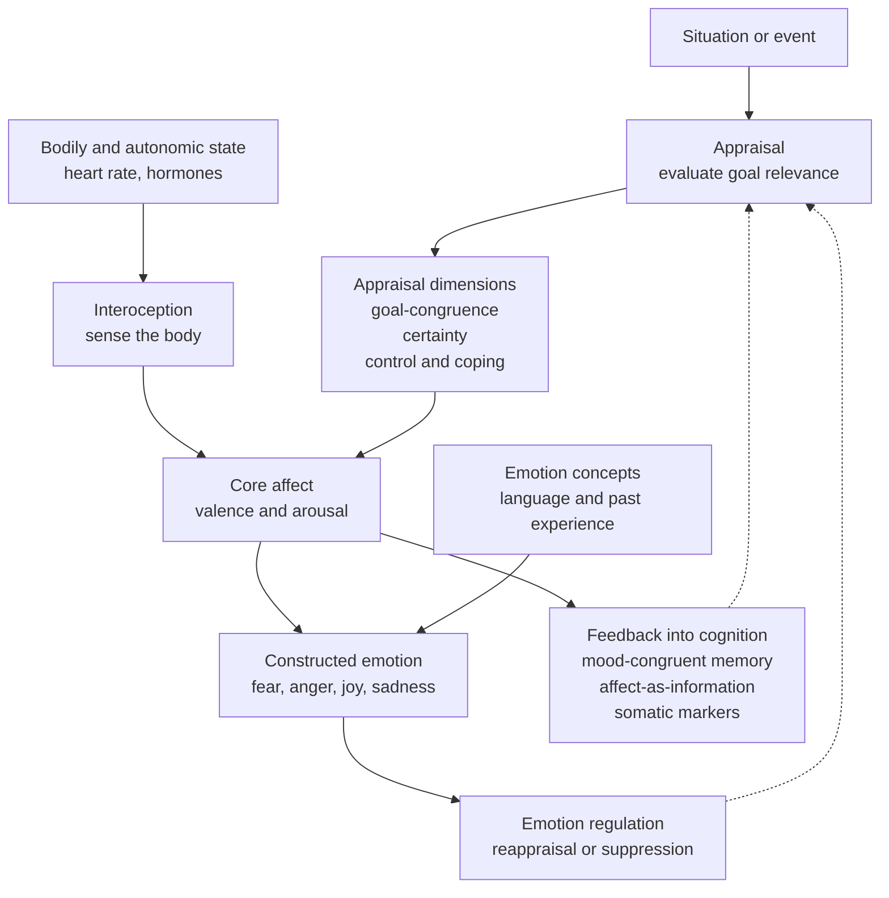

# 🎭 Emotion and Cognition

> [!abstract] TL;DR
> **Emotion and cognition are not two separate faculties** — one "hot" and irrational, the other "cold" and rational — but two deeply interwoven aspects of a single mind. The historical debate ran from **James-Lange** ("we are afraid because we tremble") through **Cannon-Bard** (body and feeling fire in parallel) to **Schachter-Singer's** two-factor theory (arousal plus a cognitive *label*). Modern **appraisal theory** (Arnold, Lazarus, Scherer) recasts emotion as the mind's *evaluation of a situation's relevance to one's goals*, computed along dimensions like goal-congruence, certainty, and control. How to *structure* the resulting states is still contested: **Russell's circumplex** places every feeling on two axes (valence and arousal), **Ekman** posits a small set of biologically basic emotions, and **Barrett's theory of constructed emotion** argues emotions are categories the brain *builds* from core affect plus concepts. Crucially, affect feeds *back* into cognition — biasing memory (mood-congruence), judgment (affect-as-information), and even good decision-making (Damasio's somatic markers). The frontier reframes all of this as **interoceptive inference**: emotion as the brain's predictive regulation of its own body.

---

## Intuition

**Analogy:** Your body is a car's engine and your appraising mind is the driver reading the dashboard. The engine can rev — heart pounding, palms sweating, adrenaline surging — but that raw *revving* is the same whether you are about to give a wedding toast or about to be mugged. What turns "high arousal" into the specific experience of **excitement** versus **terror** is the driver's reading of the situation: *Is this good or bad for my goals? Do I know what happens next? Can I do anything about it?* The engine supplies energy; the interpretation supplies meaning; the *emotion* is what emerges when the two are combined.

The everyday proof is real: on a swaying suspension bridge, people misread fear-driven arousal as romantic attraction (Dutton & Aron, 1974). Same engine, different dashboard reading, different felt emotion. This is why emotion cannot be walled off from cognition — the *thinking* about the situation is a constituent of the *feeling* itself, not a separate stage bolted on afterward.

---

## How It Works

### Core Mechanics

1. **A situation is appraised, not just sensed.** Appraisal theory (Magda Arnold coined "appraisal"; Richard Lazarus formalized it) holds that an emotion begins with an evaluation of *personal significance*. **Primary appraisal** asks "Is this relevant to my goals, and is it good or bad?"; **secondary appraisal** asks "Can I cope — what are my resources and options?" Klaus Scherer's **Component Process Model** decomposes this into a sequence of *stimulus evaluation checks* (novelty, intrinsic pleasantness, goal-congruence, coping potential, norm-compatibility) that run rapidly and can be unconscious.

2. **The body supplies arousal; interpretation supplies the label.** The autonomic nervous system produces a broadly *undifferentiated* activation (racing heart, altered breathing, hormone release). Schachter and Singer showed that when people were physiologically aroused by an injection but had no explanation, they *borrowed* an emotion label from the social context. Arousal is the fuel; appraisal is the ignition timing.

3. **States can be mapped in a low-dimensional affect space.** James Russell's **circumplex model** proposes that the felt "core affect" underlying every mood and emotion reduces to two continuous dimensions: **valence** (unpleasant to pleasant) and **arousal** (deactivated to activated). Fear and excitement share high arousal but differ in valence; contentment and depression share low arousal but differ in valence.

4. **Discrete emotions: given or built?** *Basic-emotion* theory (Ekman) says a handful of emotions — anger, fear, disgust, happiness, sadness, surprise — are evolutionarily hardwired with universal facial signatures and dedicated circuits. The *theory of constructed emotion* (Lisa Feldman Barrett) counters that the brain has no emotion-specific fingerprints; instead it *constructs* an emotion in the moment by categorizing core affect using learned **emotion concepts** and context, much as it constructs a color percept from wavelengths.

5. **Affect loops back into cognition.** Emotion is not a dead end. **Mood-congruent memory** biases recall toward material matching your current mood. The **affect-as-information** heuristic (Schwarz & Clore) means we read our momentary feelings as data about the object of judgment ("How's my life? Well, I feel good, so — good"). Damasio's **somatic marker hypothesis** goes further: bodily "gut feelings" tag options as good or bad and are *necessary* for sound real-world decisions — patients with ventromedial prefrontal damage reason fine on paper but choose disastrously.

6. **Emotion can be regulated.** James Gross's **process model** locates five families of regulation along the emotion-generation timeline: *situation selection*, *situation modification*, *attentional deployment*, *cognitive change* (reappraisal), and *response modulation* (suppression). Reappraisal — reframing the meaning of the situation — is cheap and effective; suppression masks the display while leaving the physiology and cognitive cost intact.

7. **The unifying frontier: interoceptive inference.** Predictive-processing accounts (Seth, Barrett) treat emotion as the brain's *prediction and control of its own bodily state* (allostasis). Core affect is your running summary of interoceptive prediction error — how well your body's budget is being managed — and emotions are the categorized, concept-laden interpretations of it.

### Flow / Architecture



---

## Key Concepts

### Secondary (intuition-level)
- **Feeling and thinking are woven together.** There is no "pure reason" untouched by affect and no emotion without some interpretation — the old split between a rational head and an emotional heart is a folk myth.
- **The same body state can be many emotions.** A pounding heart becomes fear, excitement, anger, or love depending on how you read the situation.
- **Two dials capture most of feeling.** How *pleasant* (valence) and how *worked-up* (arousal) you are locate nearly any mood on a simple 2D map.

### Undergraduate (mechanism-level)
- **The four classic theories.** *James-Lange*: emotion IS the perception of bodily change (body first). *Cannon-Bard*: brain sends signals to body and cortex in parallel (feeling and body are simultaneous, independent). *Schachter-Singer two-factor*: emotion = arousal + cognitive label. *Appraisal theory* (Lazarus): emotion = evaluation of the situation's meaning for one's goals.
- **Appraisal dimensions.** Different emotions correspond to different *appraisal patterns*: anger = other-caused, avoidable harm with some control; fear = uncertain, uncontrollable threat; sadness = irreversible loss; pride = self-caused goal attainment. Scherer's Component Process Model sequences these as rapid evaluation checks.
- **Structure of affect — three rival maps.** *Circumplex* (Russell): valence x arousal continuum. *Basic emotions* (Ekman): a small, universal, discrete set with facial signatures. *Constructed emotion* (Barrett): emotions are conceptual categories built from core affect, not natural kinds.
- **Affect shapes cognition.** *Mood-congruent memory*, the *affect heuristic*/affect-as-information, and the *somatic marker hypothesis* (Damasio; Iowa Gambling Task; vmPFC) all show feelings steering memory, risk perception, and choice.
- **Emotion regulation.** Gross's five families; the reliable finding that **cognitive reappraisal** beats **expressive suppression** because suppression leaves arousal and cognitive load untouched while adding social and physiological costs.

### Graduate (debate-level)
- **The cognition-emotion architecture debate.** Is emotion a *distinct system* with primacy that can precede cognition (Zajonc: "preferences need no inferences") or does it *require* appraisal (Lazarus: even fast, automatic emotion involves meaning analysis)? LeDoux's "low road" (thalamus to amygdala) vs "high road" (via cortex) partially reconciles this: crude, fast affective responses plus slower, appraisal-rich ones.
- **Natural kinds vs psychological construction.** Basic-emotion theory predicts emotion-specific *biomarkers* (autonomic, facial, neural). Large meta-analyses (Barrett; Lindquist) find **no consistent one-to-one mappings** — the amygdala is not "the fear center," and facial expressions are variable and context-dependent. Constructionism explains this by making emotions *emergent categories*, but critics charge it is hard to falsify and underweights evolved affect programs (Panksepp's subcortical emotional circuits).
- **Interoceptive/active inference and the free-energy view.** Emotion reframed as the brain minimizing interoceptive prediction error and maintaining allostasis (Seth's *interoceptive inference*; Barrett's EPIC and "theory of constructed emotion"). This ties affect directly to [[Predictive_Processing_and_Free_Energy]]: valence may track the *rate of change* of prediction error, arousal its *precision*.
- **Appraisal as computation.** Whether appraisal checks are literal computational operations, and whether they can be modeled as reinforcement-learning-style value and controllability estimates, is an active bridge between affective science and computational modeling.
- **Affective computing.** Rosalind Picard's program of giving machines the ability to recognize, model, and respond to emotion forces the theoretical choice into engineering practice: *dimensional* (valence-arousal regression) vs *categorical* (basic-emotion classification) models trade off differently for face, voice, text, and physiological signals.

---

## Python Demo

We implement a minimal **appraisal-to-core-affect** model. Each situation is described by three appraisal dimensions — **goal-congruence** (does it help or hinder my goals?), **certainty** (do I know the outcome?), and **control** (can I cope?) — and mapped onto **Russell's circumplex**: *valence* on the x-axis and *arousal* on the y-axis. We then plot where several appraised situations land, coloring each point by the *control* appraisal to reveal that a 2D affect map alone cannot separate, say, fear from anger — the hidden third dimension can.

```python
# Appraisal -> core affect: map (goal-congruence, certainty, control)
# onto Russell's valence x arousal circumplex, then plot the situations.
import numpy as np
import matplotlib.pyplot as plt

def core_affect(goal_congruence, certainty, control):
    """Map three appraisal dimensions onto 2D core affect, each in [-1, 1].

    valence : driven mainly by goal-congruence, nudged up by a sense of
              control (mastery feels good; helplessness feels bad).
    arousal : driven mainly by UNCERTAINTY (need to mobilize / stay ready),
              plus the stakes |goal_congruence| and low control.
              High certainty -> demobilization -> low arousal.
    """
    valence = 0.75 * goal_congruence + 0.25 * (2 * control - 1)
    arousal_raw = (0.60 * (1 - certainty)
                   + 0.25 * np.abs(goal_congruence)
                   + 0.15 * (1 - control))
    arousal = 2 * arousal_raw - 1
    return np.clip(valence, -1, 1), np.clip(arousal, -1, 1)

# Each situation: (label, goal_congruence, certainty, control)
situations = [
    ("Surprise job offer",         0.85, 0.40, 0.60),  # -> excited
    ("Vacation, goals met",        0.60, 0.90, 0.80),  # -> content / serene
    ("Car skids on ice",          -0.80, 0.30, 0.15),  # -> fear / panic
    ("Publicly wronged (can act)", -0.65, 0.45, 0.70),  # -> anger
    ("Waiting for test results",  -0.50, 0.20, 0.20),  # -> anxiety / dread
    ("Bereavement (irreversible)", -0.70, 0.95, 0.10),  # -> sadness
    ("Routine commute",           -0.05, 0.85, 0.50),  # -> calm / bored
]

labels = [s[0] for s in situations]
gc   = np.array([s[1] for s in situations])
cert = np.array([s[2] for s in situations])
ctrl = np.array([s[3] for s in situations])

val, aro = core_affect(gc, cert, ctrl)

fig, ax = plt.subplots(figsize=(8, 8))

# Circumplex boundary + axes through the origin
theta = np.linspace(0, 2 * np.pi, 200)
ax.plot(np.cos(theta), np.sin(theta), color="#cbd5e1", lw=1)
ax.axhline(0, color="#94a3b8", lw=1)
ax.axvline(0, color="#94a3b8", lw=1)

# Quadrant descriptions
ax.text( 0.55,  0.92, "HIGH AROUSAL\n+ pleasant\n(excited, elated)", ha="center", color="#059669")
ax.text(-0.55,  0.92, "HIGH AROUSAL\n- unpleasant\n(afraid, angry)", ha="center", color="#dc2626")
ax.text(-0.55, -0.92, "LOW AROUSAL\n- unpleasant\n(sad, bored)",     ha="center", color="#7c3aed")
ax.text( 0.55, -0.92, "LOW AROUSAL\n+ pleasant\n(calm, serene)",     ha="center", color="#2563eb")

# Points colored by CONTROL (the hidden third appraisal dimension)
sc = ax.scatter(val, aro, c=ctrl, cmap="viridis", s=170,
                edgecolor="black", zorder=3, vmin=0, vmax=1)
for x, y, lab in zip(val, aro, labels):
    ax.annotate(lab, (x, y), textcoords="offset points",
                xytext=(8, 6), fontsize=9)

cbar = fig.colorbar(sc, ax=ax, shrink=0.8)
cbar.set_label("appraised control / coping potential")

ax.set_xlim(-1.25, 1.25)
ax.set_ylim(-1.25, 1.25)
ax.set_xlabel("VALENCE   (unpleasant  ->  pleasant)")
ax.set_ylabel("AROUSAL   (deactivated  ->  activated)")
ax.set_title("Appraisal -> Core Affect on Russell's circumplex")
ax.set_aspect("equal")
plt.tight_layout()
plt.show()

for lab, v, a, c in zip(labels, val, aro, ctrl):
    print(f"{lab:30s} valence={v:+.2f}  arousal={a:+.2f}  control={c:.2f}")
```

**What it shows.** The seven situations spread across all four quadrants of the circumplex purely as a function of their appraisal profiles: an *unexpected* good outcome (low certainty, positive goal-congruence) lands high-arousal-pleasant (excitement), while a *certain* positive outcome lands low-arousal-pleasant (contentment). Crucially, "Car skids on ice" (fear) and "Publicly wronged" (anger) both sit in the negative, activated region — the 2D affect map *cannot* tell them apart. The color scale reveals the missing ingredient: fear has *low* control, anger has *high* control. That is exactly the argument for appraisal theory — valence and arousal are necessary but not sufficient; discrete emotions require the extra appraisal dimensions (here, control).

---

## Real-World Applications

- **Affective computing / emotion AI.** Sentiment analysis, empathic tutoring systems, driver-drowsiness and frustration monitoring, and call-center analytics all pick a *representation* straight out of this theory: dimensional (predict valence/arousal from voice, face, or physiology) or categorical (classify into basic emotions). The choice inherits all the basic-vs-constructed debate.
- **Clinical psychology and psychiatry.** Cognitive-behavioral therapy operationalizes **reappraisal**; emotion **dysregulation** is a transdiagnostic feature of mood and personality disorders; and **alexithymia** and blunted **interoception** are increasingly tied to anxiety and depression, motivating interoception-based interventions.
- **Behavioral economics and risk.** The **affect heuristic** and "risk-as-feelings" explain why vivid, emotionally charged low-probability events (plane crashes, shark attacks) are overweighted while abstract high-probability risks are ignored — a direct consequence of affect-as-information.
- **Decision support and neurology.** The somatic marker hypothesis reframes "gut feelings" as legitimate, learned value signals; vmPFC damage (and the Iowa Gambling Task) shows what happens when they are removed, informing both neurology and the design of human-in-the-loop decision systems.
- **UX, product, and marketing design.** Deliberately targeting a valence-arousal region — calm trust (low arousal, positive) for a banking app versus energizing delight (high arousal, positive) for a game — is core-affect engineering applied to experience design.

---

## Common Pitfalls

- **Treating emotion and reason as opposites.** The "passion versus reason" framing is false: Damasio's patients prove that *removing* emotion destroys, not sharpens, real-world judgment. Emotion is part of the cognitive machinery, not its enemy.
- **Assuming basic emotions have clean signatures.** Reverse inference ("the amygdala lit up, so the subject felt fear") is invalid; meta-analyses find no one-to-one autonomic, facial, or neural fingerprints for discrete emotions. Categories are more constructed and context-dependent than the folk view assumes.
- **Reifying valence-arousal as "the emotion."** Core affect is *necessary but not sufficient*. As the demo shows, fear and anger overlap on the 2D map; you cannot recover discrete emotion without appraisal dimensions like control. Dimensional emotion-recognition systems that ignore this systematically confuse activated negative states.
- **Confusing affect with emotion.** Core affect (valence/arousal) is always present and free-floating; an emotion is the *categorized, conceptualized* interpretation of it in context. Sloppy usage conflates a mood, a feeling, and a full emotion episode.
- **Believing suppression equals regulation.** Expressive suppression hides the display but leaves physiological arousal and cognitive cost intact — and impairs memory for the event. It is a poor default strategy compared with reappraisal.
- **Ignoring the body.** Purely cortical, "cold-cognition" models of emotion miss interoception and autonomic feedback. The predictive-processing turn insists emotion is fundamentally about regulating a *body*, not just processing a stimulus.

---

## Related Concepts

- [[Emotion_Theories]] — the Psychology companion note covering James-Lange, Cannon-Bard, two-factor, and appraisal theory in applied detail.
- [[Predictive_Processing_and_Free_Energy]] — reframes emotion as interoceptive inference and allostatic control; the frontier unification of affect and prediction.
- [[Limbic_System_and_Diencephalon]] — the amygdala, hypothalamus, and classic "emotional brain" circuitry that early theories localized emotion to.
- [[Decision_Making_and_Reward_Circuits]] — vmPFC and reward pathways underlying the somatic marker hypothesis and affect-driven choice.
- [[Autonomic_Nervous_System]] — the sympathetic/parasympathetic arousal that is the bodily substrate of the "arousal" axis.
- [[Embodied_and_Extended_Cognition]] — emotion as embodied cognition; somatic markers and interoception instantiate the embodiment thesis.
- [[Concepts_and_Categorization]] — Barrett's constructed emotion treats emotions as conceptual categories the brain applies to core affect.
- [[Long_Term_Memory_Systems]] — mood-congruent recall and emotional enhancement of memory show affect shaping storage and retrieval.
- [[Attention_and_Selection]] — affect biases what is attended; precision-weighting links attention and emotional salience.
- [[Reasoning_and_Inference]] — affect-as-information and dual-process effects show feelings steering judgment and inference.
- [[Stress_and_Coping]] — appraisal of threat and coping potential is the shared engine of the stress response and negative emotion.
- [[Consciousness_and_the_Hard_Problem]] — the felt, qualitative character of emotion is a central case of subjective experience.

---

## Review Questions

1. **(Conceptual / foundational)** Explain how Schachter-Singer's two-factor theory reconciles the disagreement between James-Lange and Cannon-Bard. Why does the theory imply that emotion and cognition cannot be cleanly separated into distinct faculties?
2. **(Scenario / applied)** You build a wearable that measures heart rate and skin conductance. It can estimate **arousal** reasonably well but struggles to distinguish fear from excitement — and anger from fear. Using the circumplex and appraisal theory, explain precisely why arousal alone is insufficient, and what additional signal (behavioral, contextual, or interoceptive) would let you separate these states.
3. **(Trade-off / synthesis)** Contrast Ekman's basic-emotion theory with Barrett's theory of constructed emotion on whether emotions are biologically given natural kinds. What empirical evidence (autonomic, neural, cross-cultural) would count *for* each side, and how does the predictive-processing / interoceptive-inference view reframe the whole dispute?

---

## Sources

- Lazarus, R. S. (1991). *Emotion and Adaptation*. Oxford University Press. (Cognitive appraisal theory.)
- Russell, J. A. (2003). "Core affect and the psychological construction of emotion." *Psychological Review*, 110(1), 145–172.
- Ekman, P. (1992). "An argument for basic emotions." *Cognition & Emotion*, 6(3-4), 169–200.
- Barrett, L. F. (2017). *How Emotions Are Made: The Secret Life of the Brain*. Houghton Mifflin Harcourt. (Theory of constructed emotion.)
- Damasio, A. R. (1994). *Descartes' Error: Emotion, Reason, and the Human Brain*. Putnam. (Somatic marker hypothesis.)
- Seth, A. K. (2013). "Interoceptive inference, emotion, and the embodied self." *Trends in Cognitive Sciences*, 17(11), 565–573.

---

#cognitive-science #emotion #affect #appraisal #emotion-cognition
