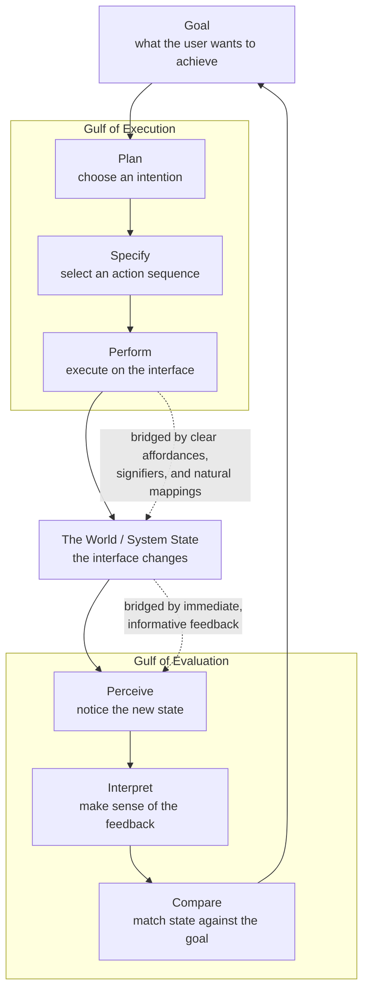

# 🖥️ Human-Computer Interaction and Applied Cognition

> [!abstract] TL;DR
> **Human-Computer Interaction (HCI)** is cognitive science turned into engineering: it takes the mind's measured limits — a tiny working memory, a bottlenecked attention, a motor system that trades speed for accuracy on a fixed logarithmic curve — and treats them as *design constraints* on interfaces. Its founding claim, from **Card, Moran, and Newell's** *Model Human Processor*, is that human performance at a screen is **predictable and quantifiable**: **Fitts's Law** predicts how long it takes to point at a target, the **Hick-Hyman Law** predicts how long it takes to choose from a menu, and **GOMS / the keystroke-level model** predict how long a whole task takes *before a single line of code is written*. Alongside this engineering strand runs **Don Norman's** cognitive account of *why* interfaces confuse people — mismatched **mental models**, invisible **affordances**, missing **feedback**, and the **gulfs of execution and evaluation** — and **James Reason's** taxonomy of *how* they fail (**slips vs mistakes**). Modern HCI extends the same discipline to AI and human-AI interaction, where the "system" now reasons, and calibrating the user's mental model of a fallible, confident model is the central problem.

---

## Intuition

**Analogy: designing a kitchen for a cook whose hands, eyes, and memory you already measured.**

Imagine you are designing a professional kitchen, and before you draw anything you are handed a precise dossier on the cook who will use it. You know their reach (how the time to grab a pan grows with distance *and* shrinks with how big the pan is), how long they take to *decide* which of N knives to pick up (longer for more knives, but only logarithmically), and — critically — that they can hold only about four things in their head at once before something gets dropped. A good kitchen designer does not blame the cook for fumbling; they put the most-used pan within easy reach, group the knives so the choice is fast, and label the burners so the cook never has to *remember* which dial is which. A bad designer scatters tools randomly, hides the oven controls behind a menu, and then writes "user error" on the incident report when the roast burns.

HCI is exactly this, for screens. The "cook" is a human whose motor, perceptual, and memory limits have been measured to the millisecond, and the "kitchen" is an interface. The radical move — Card, Moran, and Newell's — was to insist that you can **calculate** how the cook will perform in your kitchen before you build it, the way a structural engineer calculates whether a beam will hold before pouring concrete. Don Norman's complementary move was to explain *why* a badly designed kitchen feels confusing: the cook builds a **mental model** of how it works, and every burned roast is really a gap between that model and the kitchen's actual behavior — a gap the *designer*, not the cook, is responsible for closing.

---

## How It Works

### HCI as applied cognitive science

HCI inherited the **information-processing** framing of the cognitive revolution: treat the human as a system that perceives input, holds and transforms symbols in a limited store, and emits motor output. What HCI added was **engineering rigor** — the demand that these processes yield *numbers* usable in design. This is cognitive science pointed outward: instead of asking "how does memory work," it asks "given that memory holds ~4 chunks, how many items may a menu show before recall fails?" (See [[Research_Methods_in_Cognitive_Science]] for the reaction-time methodology this rests on.)

### The Model Human Processor (Card, Moran & Newell, 1983)

The **Model Human Processor (MHP)** models the human as three interacting subsystems, each with a characteristic cycle time and memory:

1. **Perceptual processor** (~100 ms/cycle) — encodes sensory input into short-term perceptual stores (visual and auditory image stores). Two stimuli within one cycle fuse into a single percept, which is why ~10 frames/second reads as continuous motion.
2. **Cognitive processor** (~70 ms/cycle) — recognizes, decides, and retrieves from working and long-term memory. Working memory holds ~3-7 chunks with rapid decay.
3. **Motor processor** (~70 ms/cycle) — issues movement commands in discrete "micro-movements," each corrected by feedback.

The MHP's power is *compositionality*: a task's time is the sum of its perceptual, cognitive, and motor cycles. This makes performance an **arithmetic** problem, the founding bet of the field.

### GOMS and the Keystroke-Level Model

**GOMS** decomposes skilled task performance into **Goals** (what the user wants), **Operators** (elementary perceptual/motor/cognitive acts), **Methods** (learned sequences of operators achieving a goal), and **Selection rules** (how the user chooses among methods). Given a GOMS description, you can *predict execution time and learning time* analytically.

The **Keystroke-Level Model (KLM)** is GOMS stripped to its simplest, most usable form: it lists a handful of operators with empirically fixed durations and sums them for a task —

- **K** = keystroke or button press (~0.2 s for an average typist)
- **P** = pointing to a target with the mouse (~1.1 s; *this is where Fitts's Law plugs in*)
- **H** = homing the hand between mouse and keyboard (~0.4 s)
- **M** = a mental preparation act (~1.35 s)
- **R** = system response time (measured, not modeled)

Predicting that "delete a word" takes, say, 2.3 s lets designers compare interface alternatives on a spreadsheet, no user study required. KLM is still used to justify shortcut keys and to expose needless homing.

### Fitts's Law — the speed-accuracy tradeoff of pointing

**Fitts's Law (1954)** is HCI's most robust quantitative law. The time to move to a target depends on the target's **distance** `D` and its **width** `W` through a single quantity, the **Index of Difficulty (ID)**, measured in *bits*:

- **Shannon formulation (MacKenzie, 1992):** `ID = log2(D / W + 1)`
- **Movement time:** `MT = a + b * ID`

The intercept `a` is fixed overhead (reaction, initiation); the slope `b` is inverse **throughput** — `1/b` is a device-independent measure of pointing performance in **bits per second**. The law captures the **speed-accuracy tradeoff**: to hit a smaller or farther target reliably, you must move slower, and the cost grows *logarithmically*, not linearly. Design corollaries are immediate: **big, close targets are fast**; screen **corners and edges are "infinitely wide"** in the movement direction (the pointer stops at the edge), which is why the macOS menu bar and Windows Start button live there; **pie/radial menus** beat linear menus because every item sits at equal, short distance.

### Hick-Hyman Law — the cost of choosing

Where Fitts's Law governs *movement*, the **Hick-Hyman Law (1952)** governs *decision*: the time to choose among N equally likely alternatives is

- `RT = a + b * log2(N + 1)`

Choice reaction time grows with the **information** (in bits) the choice conveys, not linearly with N. The practical lesson is subtle and often misread: a *deep* menu hierarchy (few choices per level, many levels) is not automatically better than a *broad* one, because each level adds its own Hick decision *plus* a Fitts pointing move *plus* a visual search. Well-organized broad menus, where structure lets the eye jump to a category, often win.

### Norman's model: mental models, gulfs, and the seven stages of action

**Donald Norman's** *The Design of Everyday Things* reframes usability around the user's **mental model**. Users act on their *own* model of how a system works, not the designer's. Norman's vocabulary:

- **Affordance** — a relationship between object and user that suggests a possible action (a flat plate *affords* pushing).
- **Signifier** — a perceivable cue that communicates where the action should occur (the word "PUSH", a visible handle). Affordances may be invisible; signifiers make them discoverable.
- **Mapping** — the correspondence between controls and effects. **Natural mappings** exploit spatial or cultural analogy (stove burner controls laid out like the burners).
- **Feedback** — immediate, informative confirmation that an action registered.
- **Constraints** — physical, logical, and cultural limits that prevent error.

Interaction fails across two **gulfs**:

- **Gulf of Execution** — the gap between the user's *intention* and the actions the system allows. "How do I even do this?"
- **Gulf of Evaluation** — the gap between the system's *state* and the user's ability to perceive and interpret it. "Did it work? What happened?"

Good design bridges both, across Norman's **seven stages of action**: form a goal, plan, specify, perform (execution side); then perceive, interpret, compare against the goal (evaluation side).

### Cognitive load, attention, and change blindness in the interface

Because working memory holds only ~4 chunks (see [[Working_Memory_and_Cognitive_Load]]), interfaces that force users to *remember* state across screens overload them; the fix is **recognition over recall** — show the options rather than requiring memorized commands. Attention is a bottleneck (see [[Attention_and_Selection]]), so visual salience is a scarce resource that must be *spent* on what matters. **Change blindness** — the failure to notice a large change when it coincides with a visual disruption (a page reload, a flash, an eye movement) — is a direct UI hazard: an error message that appears during a repaint, or a silently updated total, can go completely unseen. The remedy is animated transitions and persistent, attention-grabbing signifiers rather than instantaneous swaps.

### Reason's error taxonomy — slips vs mistakes

**James Reason** distinguishes two fundamentally different failures, which demand *different* design fixes:

- **Slips** — the *intention was correct*, but execution went wrong (clicking "Delete" when you meant "Deactivate" because they sit adjacent). Slips are failures of skilled, automatic action; fix them with constraints, spacing, confirmation for irreversible acts, and forgiving undo.
- **Mistakes** — the *intention itself was wrong*, formed from a faulty mental model (deleting the file believing it was a copy). Fix mistakes by communicating a correct conceptual model and better feedback, *not* by adding confirmations.

Blaming "human error" ends analysis exactly where it should begin: most operational errors are **designed-in**, and the slip/mistake distinction tells you where.

### Usability engineering, cognitive walkthroughs, and ecological interface design

**Usability engineering** (Nielsen) makes usability measurable and iterative: set quantitative targets (task time, error rate, learnability), evaluate with **heuristic evaluation** and **cognitive walkthroughs**, and iterate. A **cognitive walkthrough** is a theory-driven inspection that steps through each action asking four questions grounded in the gulfs: *Will the user try to achieve the right effect? Will they notice the correct control is available? Will they associate it with their goal? Will they see progress after acting?* **Ecological Interface Design (EID)** (Rasmussen & Vicente), used in safety-critical control rooms, maps the *work domain's constraints* directly into the display so that operators can act at the appropriate cognitive level — **skill-based** (perception-action), **rule-based** (if-then), or **knowledge-based** (deliberate problem solving) — the **SRK framework**.

### Norman's action cycle and the two gulfs



---

## Key Concepts

### Secondary (intuitive level)

- **HCI blames the design, not the user.** If people keep pulling a door that should be pushed, the door is wrong. The same holds for buttons, menus, and apps.
- **Fitts's Law:** big, close things are fast to click; small, far things are slow. That is why important buttons are large and why screen corners are prime real estate.
- **Hick's Law:** more choices take longer to pick from — so don't dump fifty options on one screen.
- **Mental model:** you build a picture in your head of how a gadget works and act on *that*. Confusion happens when the gadget behaves differently from your picture.
- **Affordance and signifier:** a handle *invites* pulling (affordance); a "PUSH" label *tells* you what to do (signifier). Good design makes the right action obvious.
- **Feedback:** a button should visibly react when pressed, so you know it worked.

### Undergraduate (mechanistic level)

- **Model Human Processor:** perceptual (~100 ms), cognitive (~70 ms), and motor (~70 ms) processors whose cycle times let you *sum* a task's duration.
- **GOMS / KLM:** decompose a task into Goals, Operators, Methods, Selection rules; KLM assigns fixed times (K, P, H, M, R) to predict task time analytically before building anything.
- **Fitts's Law:** `MT = a + b * log2(D/W + 1)`; slope `b` gives throughput `1/b` in bits/s; encodes the logarithmic speed-accuracy tradeoff.
- **Hick-Hyman Law:** `RT = a + b * log2(N + 1)`; choice time scales with information, informing menu breadth-vs-depth decisions.
- **Norman's gulfs and seven stages:** Gulf of Execution (intention → action) and Gulf of Evaluation (state → understanding), spanning goal, plan, specify, perform, perceive, interpret, compare.
- **Reason's slips vs mistakes:** execution error under a correct intention (slip) vs a wrong intention from a faulty model (mistake) — each needing a different remedy.
- **Usability engineering:** measurable targets plus discount methods (heuristic evaluation, cognitive walkthrough) in iterative cycles.

### Graduate (theoretical and system level)

- **Fitts's Law as an information channel:** the log term is not arbitrary — the human motor system behaves like a **Shannon-Hartley channel** transmitting positional "information" against noise, so throughput is a channel capacity. This unifies pointing with Hick-Hyman (both are `log2` information laws) and connects to the information-theoretic roots of cognitive science.
- **Beyond Fitts for 2D and steering:** the **Accot-Zhai steering law** (`MT` proportional to `A/W` for movement *through* a constrained tunnel, e.g., cascading menus) generalizes Fitts's discrete pointing to continuous trajectories; effective-width corrections (`We`) enforce a standardized 4 percent error rate for fair throughput comparison across devices.
- **The predictive-model program and its limits:** GOMS predicts *expert, error-free, routine* performance well but says nothing about learning, fatigue, emotion, or problem solving. This is a deliberate scoping choice — the field split into **predictive/engineering HCI** and **exploratory/design HCI** — and the persistent tension is whether cognition-as-calculation captures situated, embodied, socially distributed use.
- **Rasmussen's SRK and Ecological Interface Design:** map the work domain's **abstraction hierarchy** onto the display so operators can migrate down to efficient skill-based control while retaining the information to climb to knowledge-based reasoning during novel faults — a theory of *representation design* for safety-critical systems.
- **Distributed and embodied cognition in HCI:** Hutchins's *cognition in the wild* reframes the unit of analysis from the individual to the **human-artifact-environment system**; the interface is not a window onto a task but a *constituent* of the cognitive process (external memory, offloaded computation), linking HCI to [[Schemas_and_Mental_Models]] and extended-mind theory.
- **Human-AI interaction:** when the system itself reasons and errs *confidently*, the classical mental-model problem intensifies. Calibrating user **trust** to actual model reliability, designing for **appropriate reliance** (avoiding both over-trust and algorithm aversion), surfacing **uncertainty and explanations**, and preventing automation-induced complacency become the core design problems — HCI applied to a partner that hallucinates. This connects usability directly to [[Judgment_and_Decision_Making]] under uncertainty.

---

## Python Demo

```python
# Fitts's Law: model movement time to a target as a function of distance D
# and target width W, generate simulated pointing data, fit the regression,
# and plot movement time against the index of difficulty.
#
#   Index of Difficulty (Shannon form):  ID = log2(D / W + 1)   [bits]
#   Fitts's Law:                          MT = a + b * ID        [seconds]
#   Throughput:                           TP = 1 / b             [bits / second]
#
# The intercept a is fixed overhead (reaction + initiation); the slope b is
# the inverse throughput. Smaller/farther targets (higher ID) cost more time
# -- the logarithmic speed-accuracy tradeoff at the heart of HCI.

import numpy as np
import matplotlib.pyplot as plt

rng = np.random.default_rng(42)

# ---- Ground-truth motor parameters we will try to recover from noisy data ----
a_true = 0.045   # intercept  (s)
b_true = 0.145   # slope      (s per bit)  ->  throughput ~ 6.9 bits/s

# ---- Experimental design: a crossed grid of distances and widths (pixels) ----
distances = np.array([64, 128, 256, 512, 1024])   # D
widths    = np.array([8, 16, 32, 64, 128])         # W
trials_per_condition = 25

D_grid, W_grid = np.meshgrid(distances, widths)
D_flat = D_grid.ravel()
W_flat = W_grid.ravel()

ID = np.log2(D_flat / W_flat + 1.0)                # index of difficulty (bits)

# ---- Simulate movement times: linear in ID plus motor noise that grows -------
# ---- mildly with difficulty (harder aims are also more variable) -------------
ID_rep  = np.repeat(ID, trials_per_condition)
mt_mean = a_true + b_true * ID_rep
noise   = rng.normal(0.0, 0.020 + 0.010 * ID_rep)
MT      = np.clip(mt_mean + noise, 0.01, None)

# ---- Fit Fitts's Law by ordinary least squares:  MT = a + b * ID -------------
b_fit, a_fit = np.polyfit(ID_rep, MT, 1)

mt_pred = a_fit + b_fit * ID_rep
ss_res  = np.sum((MT - mt_pred) ** 2)
ss_tot  = np.sum((MT - MT.mean()) ** 2)
r2      = 1.0 - ss_res / ss_tot
throughput = 1.0 / b_fit                            # bits per second

# ---- Condition means for a clean overlay -------------------------------------
id_unique = np.unique(ID)
mt_cond_mean = np.array([MT[ID_rep == v].mean() for v in id_unique])

# ---- Plot --------------------------------------------------------------------
plt.figure(figsize=(8, 5))
plt.scatter(ID_rep, MT, s=12, alpha=0.20, color="#94a3b8", label="Simulated trials")
plt.scatter(id_unique, mt_cond_mean, s=70, color="#2563eb", zorder=3,
            edgecolor="white", label="Condition means")
xs = np.linspace(id_unique.min(), id_unique.max(), 100)
plt.plot(xs, a_fit + b_fit * xs, color="#dc2626", lw=2.5,
         label=f"Fit: MT = {a_fit:.3f} + {b_fit:.3f} x ID   R2 = {r2:.3f}")
plt.xlabel("Index of Difficulty   ID = log2(D / W + 1)   [bits]")
plt.ylabel("Movement Time   MT   [s]")
plt.title("Fitts's Law: movement time scales linearly with index of difficulty")
plt.legend(loc="upper left", fontsize=9)
plt.grid(alpha=0.3)
plt.tight_layout()
plt.show()

# ---- Console summary ---------------------------------------------------------
print(f"True    : a = {a_true:.3f} s,  b = {b_true:.3f} s/bit,  TP = {1/b_true:5.2f} bits/s")
print(f"Fitted  : a = {a_fit:.3f} s,  b = {b_fit:.3f} s/bit,  TP = {throughput:5.2f} bits/s")
print(f"R^2     = {r2:.4f}")
print()
print("Predicted movement time for a few targets (fitted model):")
for D, W in [(1024, 8), (256, 32), (128, 64)]:
    idv = np.log2(D / W + 1.0)
    print(f"  D={D:5d}px  W={W:3d}px  ID={idv:4.2f} bits  ->  MT = {a_fit + b_fit*idv:.3f} s")
```

**What the demo shows.** The 25 crossed distance-width conditions collapse onto a single straight line when plotted against `ID` — that collapse *is* Fitts's Law: two very different targets with the same `log2(D/W + 1)` take the same time. The least-squares fit recovers the ground-truth intercept and slope closely (high `R^2`), and inverting the slope yields the **throughput** in bits/second, the standard device-independent pointing metric used to compare a mouse against a trackpad against a stylus. The final printout demonstrates the practical payoff: given the fitted `a` and `b`, you can *predict* the time for any new target before building the interface — the KLM's `P` operator in action.

---

## Real-World Applications

> **Operating-system UI geography (Fitts's Law).** The macOS global menu bar and the Windows Start button sit at screen edges/corners precisely because an edge is effectively an infinitely wide target in the movement direction — the cursor cannot overshoot it — so acquisition time drops toward the intercept. Right-click radial/pie menus place every option at equal minimal distance for the same reason.

> **Predictive evaluation without users (GOMS / KLM).** Keystroke-level modeling has been used to redesign high-volume workflows — telephone-operator consoles, point-of-sale terminals, air-traffic and clinical data-entry — where shaving 0.3 s off a task repeated millions of times a year is a measurable business result. Designers compare interface variants on a spreadsheet before any code exists.

> **Safety-critical control rooms (Ecological Interface Design).** Nuclear power, aviation glass cockpits, and process-control HMIs use EID and the SRK framework so operators can run on fast perception-action loops in normal operation yet still have the domain information visible to reason through unfamiliar faults — a direct response to disasters (Three Mile Island) rooted in poor state visibility, i.e., a catastrophic Gulf of Evaluation.

> **Error-tolerant design (Reason's taxonomy).** Undo/redo, trash cans with delayed permanent deletion, "type the repository name to confirm" for destructive Git/GitHub actions, and spacing hazardous buttons away from routine ones are all engineered around the slip/mistake distinction — making slips reversible and mistakes less likely by communicating a correct model.

> **Human-AI interaction and modern UX.** Chat assistants, code copilots, and recommendation systems apply HCI to a system that reasons and errs confidently: uncertainty indicators, inline citations, editable/undoable AI actions, and confidence-calibrated phrasing all aim to align the user's mental model with the model's real reliability and prevent over-trust or automation complacency.

---

## Common Pitfalls

- **"User error" as an explanation.** Treating operational failures as the user's fault ends the analysis where it should start. Most errors are designed-in; classify them as slips or mistakes and fix the interface, not the person.
- **Confusing slips with mistakes.** Adding a confirmation dialog stops *slips* but not *mistakes* (a user with a wrong mental model happily confirms the wrong action) — and over-used confirmations breed reflexive click-through that *reintroduces* slips. Match the fix to the error type.
- **Misapplying Hick's Law to justify deep menus.** "Fewer choices per screen is faster" ignores that each extra level adds its own Hick decision *plus* a Fitts move *plus* a visual search. Deep hierarchies often lose to well-structured broad ones.
- **Ignoring effective width in Fitts measurements.** Reporting throughput without normalizing to the *effective* target width (the 4 percent error-rate standard) lets users trade accuracy for speed, inflating and invalidating device comparisons.
- **Recall-heavy interfaces.** Requiring users to *remember* commands, codes, or prior-screen state overloads a ~4-chunk working memory. Favor recognition: show the options (see [[Working_Memory_and_Cognitive_Load]]).
- **Silent state changes and change blindness.** Updating a total, showing an error, or changing mode during a repaint or without an animated transition can be completely unseen. Route important changes through salient, persistent signifiers.
- **Over-trusting GOMS predictions.** GOMS models *expert, error-free, routine* performance only. Using it to predict learnability, satisfaction, or first-time use conflates two different questions and mis-scopes the method.
- **Aesthetic minimalism that removes signifiers.** Flat design and gesture-only interfaces frequently strip the perceivable cues that reveal what is clickable or swipeable, widening the Gulf of Execution in the name of clean visuals.

---

## Related Concepts

- [[Working_Memory_and_Cognitive_Load]] — The ~4-chunk capacity limit and Cognitive Load Theory are the memory constraints that motivate recognition-over-recall, progressive disclosure, and chunked interface layouts.
- [[Attention_and_Selection]] — Attention is the bottleneck HCI must budget: visual salience is scarce, and change blindness (a selective-attention failure) is a direct UI hazard.
- [[Schemas_and_Mental_Models]] — Norman's "user mental model" and "conceptual model" are schema theory applied to devices; usability failures are gaps between the user's model and the system's behavior.
- [[Judgment_and_Decision_Making]] — Choice under the Hick-Hyman Law, and calibrating trust and appropriate reliance in human-AI interaction, are decision problems; biases shape how users interpret feedback and warnings.
- [[Research_Methods_in_Cognitive_Science]] — Reaction-time and mental-chronometry methods (the additive-factors and subtraction logic) are the empirical basis for the MHP, Fitts's Law, and Hick-Hyman timing.

---

## Review Questions

### Secondary (recall / comprehension)

1. Explain in your own words why a "Push" sign on a door is a *signifier* and the flat metal plate is an *affordance*. Which one tells you what to do, and which one merely makes an action possible?
2. Fitts's Law says some targets are faster to click than others. Give the two properties of a target that make it fast, and explain why the corner of a screen is an especially easy target to hit.
3. A user deletes the wrong file. Describe the difference between this being a *slip* and being a *mistake* in Reason's sense, and say why each would need a different fix.

### Undergraduate (application)

4. You are choosing between two toolbar layouts: (a) 20 large buttons in one visible row, and (b) a compact menu of 4 items each opening a submenu of 5. Using **Fitts's Law** and the **Hick-Hyman Law** together, argue which is likely faster for an expert performing a *known* command, and identify what additional cost layout (b) imposes that a naive "fewer choices is faster" reading of Hick's Law ignores.
5. A form submits successfully but the only confirmation is a small green text that appears while the page repaints. Using the concepts of the **Gulf of Evaluation** and **change blindness**, explain why users report "the button didn't work," and propose two design changes grounded in **feedback** and attention.
6. Given Fitts's Law `MT = a + b * log2(D/W + 1)` with a fitted `a = 0.05 s` and `b = 0.15 s/bit`, compute the predicted movement time to a target with `D = 512 px`, `W = 32 px`, and state what `1/b` represents.

### Graduate (analysis / synthesis)

7. GOMS and the Keystroke-Level Model predict *expert, error-free, routine* performance and nothing else. Argue whether this scoping makes them scientifically stronger or weaker, and design an evaluation in which relying on a GOMS prediction would lead to a *wrong* design decision — specifying exactly which human factor the model omits.
8. Reframe Fitts's Law and the Hick-Hyman Law as instances of a single information-theoretic principle. What does treating the motor system as a Shannon channel buy you conceptually, and where does the analogy break down (consider 2D targets and the Accot-Zhai steering law)?
9. In human-AI interaction, the "system" now reasons and errs confidently. Explain how Norman's gulfs and the mental-model framework transfer to this setting, and design two interface mechanisms that would promote *appropriate reliance* — calibrated to the model's true reliability — rather than over-trust or algorithm aversion. Justify each against a specific cognitive limit or bias.

---

## Sources

- [Card, S. K., Moran, T. P., & Newell, A. (1983). *The Psychology of Human-Computer Interaction*. Lawrence Erlbaum.](https://doi.org/10.1201/9780203736166)
- [Fitts, P. M. (1954). "The information capacity of the human motor system in controlling the amplitude of movement." *Journal of Experimental Psychology*, 47(6), 381-391.](https://doi.org/10.1037/h0055392)
- [MacKenzie, I. S. (1992). "Fitts' law as a research and design tool in human-computer interaction." *Human-Computer Interaction*, 7(1), 91-139.](https://doi.org/10.1207/s15327051hci0701_3)
- [Norman, D. A. (2013). *The Design of Everyday Things* (Revised and Expanded ed.). Basic Books.](https://mitpress.mit.edu/9780262525671/the-design-of-everyday-things/)
- [Reason, J. (1990). *Human Error*. Cambridge University Press.](https://doi.org/10.1017/CBO9781139062367)
- [Vicente, K. J., & Rasmussen, J. (1992). "Ecological interface design: theoretical foundations." *IEEE Transactions on Systems, Man, and Cybernetics*, 22(4), 589-606.](https://doi.org/10.1109/21.156574)

---

#cognitive-science #hci #fitts-law #usability #applied-cognition
