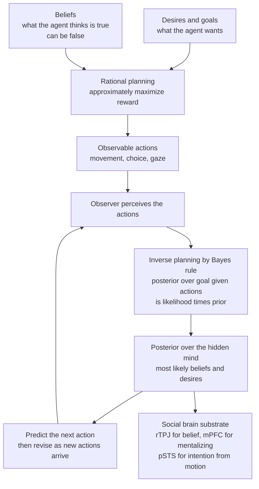

# 🧩 Social Cognition and Theory of Mind

> [!abstract] TL;DR
> **Theory of mind** (ToM), or **mentalizing**, is the capacity to treat other people not as physical objects but as agents with **hidden mental states** — beliefs, desires, and intentions — and to use those unobservable states to *explain* and *predict* behavior. Its signature test is the **false-belief task** (Sally-Anne): understanding that someone can act on a belief you *know* to be false, which most children pass around age 4. The field is organized around three deep questions. **How do we do it?** — the debate between **theory-theory** (we deploy a tacit causal theory of minds) and **simulation theory** (we run our own decision machinery offline as a model of yours), with the **mirror-neuron** hype as a cautionary tale of overreach. **How does it develop?** — from infant sensitivity to goals and gaze, through **joint attention** and **shared intentionality** (Tomasello), to explicit false-belief understanding. **How can we formalize it?** — the modern **Bayesian inverse-planning** account (Baker, Saxe & Tenenbaum): if agents are approximately **rational reward-maximizers**, then mindreading is running that generative model *backward* — Bayesian **inverse reinforcement learning** over goals — which is exactly Dennett's **intentional stance** made computational.

---

## Intuition

**Analogy:** You are watching someone through a café window. They walk up to a vending machine, press a button, nothing comes out, they frown, press it again harder, pause, then walk to a *different* machine across the room and buy the same drink. You did not read their mind telepathically — you *reconstructed* it. You inferred a **desire** (that specific drink), a **belief** (the first machine works), watched that belief get *violated*, and predicted the correction before it happened. In under two seconds you ran a tiny simulation of a rational agent and inverted it to recover the invisible causes of visible motion.

That backward inference — from **observed action** to **hidden goal and belief** — is the whole of theory of mind. The forward direction is easy and mechanical: *given* what you want and believe, a sensible plan follows. Mentalizing is the *hard inverse*: given only the plan you can see, recover the wants and beliefs you cannot. We do it so fluently that we forget the alternative — seeing other people as mere moving bodies, the way we see a rolling boulder — is what things look like when this machinery is absent or offline.

---

## How It Works

### What "having a theory of mind" actually requires

To mentalize is to build and manipulate **metarepresentations**: representations *of* someone else's representations. The critical leap is **decoupling** — holding "the marble is in the box" (reality) apart from "Sally *thinks* the marble is in the basket" (her belief), and letting the *false* belief, not reality, drive your prediction of her action. This is why belief attribution is the acid test: desires and perceptions can often be read straight off the world, but a **false belief** *contradicts* the world, so passing it proves the child is tracking a genuinely mental, representational state rather than reality itself.

### The false-belief task and its developmental trajectory

- **Wimmer & Perner (1983)** introduced the paradigm: Maxi puts chocolate in the green cupboard and leaves; his mother moves it to the blue one; *where will Maxi look?* Children under ~4 say "blue" (where it *really* is); older children say "green" (where Maxi *believes* it is).
- **Baron-Cohen, Leslie & Frith (1985)** streamlined it into the **Sally-Anne task** and used it to probe autism. Sally hides a marble in her basket and leaves; Anne moves it to a box; *where will Sally look for her marble?*
- **Trajectory:** robust **explicit** false-belief passing emerges around **age 4**, preceded by understanding of **desires** (age 2), **diverse beliefs**, and **knowledge access**, and followed later by **second-order** ToM ("Mary thinks that John thinks...", ~age 6-7) and **faux pas** / interpretive ToM in later childhood.

### Theory-theory vs simulation theory

Two rival accounts of *the mechanism* of mindreading:

- **Theory-theory** (Gopnik, Wellman, Perner): children hold a tacit, **theory-like** body of causal knowledge about how mental states cause behavior, and revise it like little scientists. Prediction comes from *applying rules* of a folk psychology.
- **Simulation theory** (Goldman, Gordon, Heal): we do not consult a theory; we **run our own** decision-making and emotional machinery **offline**, feeding in the other person's situation as pretend inputs, and read off what *we* would do or feel. Mindreading is *model reuse*, not model description.

The debate is partly a false dichotomy — hybrid views let a simulation supply the *engine* while a theory supplies the *inputs and corrections* — and the computational account below can be read as making the simulation literal and Bayesian.

### The mirror-neuron debate and its overreach

**Mirror neurons** — cells in macaque premotor area F5 that fire both when the monkey grasps and when it *watches* another grasp (di Pellegrino et al., 1992; Rizzolatti) — were hailed as the "neural basis of mind-reading," an automatic resonance that grounds understanding others in *doing*. The **overreach**: single-cell mirror data in humans is sparse and indirect, mirror responses track *motor* familiarity more than *intention*, and (as Hickok argues) they cannot explain how we read **beliefs**, which have no motor signature at all. Mirroring plausibly supports **low-level action matching and imitation**; it is not a theory of the *representational* ToM that false-belief tasks measure.

### Implicit vs explicit ToM (the two-systems debate)

**Onishi & Baillargeon (2005)** reported that **15-month-old** infants already *look longer* when an agent searches where an object is *not*, given the agent's false belief — an **implicit**, spontaneous belief sensitivity years before explicit passing. This motivates **two-systems** accounts (Apperly & Butterfill): an early, fast, efficient but **signature-limited** system, and a later, flexible, cognitively demanding **explicit** system. Caveat: several high-profile infant and adult "implicit ToM" effects have shown **replication difficulties**, so the strength and nature of System 1 mentalizing remains genuinely open.

### The computational account: theory of mind as inverse planning

The unifying modern frame (**Baker, Saxe & Tenenbaum, 2009, 2017**; Jara-Ettinger; Ullman): model an agent as an approximately **rational planner** that, given a goal and beliefs, chooses actions to **maximize expected reward** (a Markov decision process). This is the **forward** generative model. Mentalizing is the **Bayesian inverse**:

$$P(\text{goal} \mid \text{actions}) \;\propto\; P(\text{actions} \mid \text{goal}) \, P(\text{goal})$$

where the likelihood comes from the agent's rational **policy**. Recovering goals and utilities from behavior *is* **inverse reinforcement learning**; recovering beliefs adds a second latent layer. This formalizes Dennett's **intentional stance** — the strategy of predicting a system by *assuming it is rational* and asking what it must want and believe — turning a philosophical posture into a computable posterior. It also predicts the fine-grained way people trade off **cost** and **reward** in the "naïve utility calculus" of everyday judgment.



### The social brain

Mentalizing recruits a reliable network: the **right temporoparietal junction (rTPJ)**, selectively engaged by attributing **beliefs** (Saxe & Kanwisher); **medial prefrontal cortex (mPFC)** for reasoning about traits and self-versus-other mental states; the **posterior superior temporal sulcus (pSTS)** for reading **intention and animacy from biological motion**; plus the **precuneus** and **temporal poles**. This "mentalizing network" is distinct from (and often anticorrelated with) task-positive control networks, and distinct from the **mirror/action-observation** system.

---

## Key Concepts

### Secondary (intuition-level)
- **Other people have minds you cannot see.** Theory of mind is treating others as agents with **beliefs, desires, and intentions**, not just moving bodies.
- **The false-belief test:** Sally hides her marble and leaves; someone moves it; a child with ToM knows Sally will look where she *believes* it is, not where it *really* is. Passed around **age 4**.
- **We infer minds backward from behavior.** From what someone *does*, we reconstruct what they must *want* and *think* — usually without noticing we are doing it.
- **Joint attention:** babies and adults *share* a focus — following a point or gaze to look at the *same* thing *together* — the social glue that ToM is built on.

### Undergraduate (mechanism-level)
- **Metarepresentation and decoupling:** representing *someone else's representation*, held apart from reality — the core computational demand a false belief exposes.
- **Developmental sequence:** desires (age 2) → diverse beliefs → knowledge access → **false belief** (age 4) → second-order ToM (age 6-7) → faux pas / interpretive ToM.
- **Theory-theory vs simulation theory:** apply a tacit *theory* of minds, or *reuse* your own decision machinery offline. Hybrids combine a simulation engine with theory-supplied inputs.
- **Implicit vs explicit ToM (two systems):** early, fast, efficient, **signature-limited** tracking versus later, flexible, effortful reasoning — with active replication debate over the infant evidence.
- **The intentional stance (Dennett):** predict a system by *assuming rationality* and asking what it must want and believe — contrasted with the physical and design stances.
- **The social brain:** rTPJ (belief), mPFC (mentalizing/self-other), pSTS (intention from motion) — dissociable from the mirror system.

### Graduate (debate-level)
- **ToM as Bayesian inverse planning / inverse RL** (Baker, Saxe, Tenenbaum): forward model is a rational MDP planner; mindreading is the posterior over latent **goals and beliefs** given actions. Recovering utilities from behavior *is* inverse reinforcement learning; jointly recovering beliefs is a harder, partially observable inference.
- **The naïve utility calculus** (Jara-Ettinger, Tenenbaum): people assume agents maximize **reward minus cost**, and invert *both* to jointly infer competence, preference, and value from a single choice.
- **Autism and the ToM hypothesis — and its limits:** Baron-Cohen's "mindblindness" links autistic social difficulty to delayed/atypical ToM, but the account is **neither universal nor specific** — many autistic people pass false-belief tasks, deficits are confounded with **language and executive function**, and the **double-empathy problem** (Milton) reframes it as a *bidirectional* mismatch between neurotypes rather than a one-sided deficit.
- **Mirror-neuron overreach (Hickok's critique):** action-mirroring cannot ground **belief** attribution, is better explained as sensorimotor association, and was over-generalized from macaque motor cortex to human social cognition writ large.
- **Shared intentionality and cultural ratcheting (Tomasello):** the human-unique step is not just reading minds but *sharing* goals and attention — "we"-intentionality — which enables **cumulative culture** (the ratchet effect) that individual chimpanzee cognition lacks.
- **Machine theory of mind:** meta-learned ToM models (DeepMind's **ToMnet**, Rabinowitz et al.) that infer other agents' policies and false beliefs; and the contested question of whether **large language models** exhibit genuine ToM or merely pattern-match — Kosinski's "emergent ToM" claim versus Ullman's demonstrations that trivial task alterations collapse performance.

---

## Python Demo

We implement **Bayesian theory of mind as inverse planning** in a gridworld. An agent moves toward one of three candidate goals while navigating **around a wall**. A rational-agent model gives `P(action | state, goal)` as a **softmax over how much each move shrinks the optimal (BFS) distance-to-goal** — this is the *forward* planner. We then **invert** it with Bayes' rule, accumulating the log-likelihood of each observed step to update a **posterior over goals**, and watch that posterior converge as the trajectory bends around the obstacle (a genuinely *planning*-based inference, not mere heading detection).

```python
# Bayesian Theory of Mind as inverse planning:
# infer an agent's hidden GOAL from its observed movements by inverting a
# rational (reward-maximizing) action model, then watch the posterior update.
import numpy as np
import matplotlib.pyplot as plt
from collections import deque

rng = np.random.default_rng(7)

# ---- 1. The world: a 5x5 gridworld with a wall (planning must go around it) ----
R, C = 5, 5
walls = {(1, 2), (2, 2), (3, 2)}                    # vertical barrier, middle column
goals = {"A": (0, 4), "B": (4, 4), "C": (4, 0)}     # three candidate goals
goal_keys = list(goals)

moves = {"up": (-1, 0), "down": (1, 0), "left": (0, -1), "right": (0, 1), "stay": (0, 0)}
move_keys = list(moves)
move_vecs = [moves[k] for k in move_keys]

def in_bounds(cell):
    r, c = cell
    return 0 <= r < R and 0 <= c < C and cell not in walls

# ---- 2. Rational agent model: distance-to-goal via BFS = optimal plan length ----
def bfs_dist(goal):
    """Shortest-path distance from every cell to `goal`, respecting walls."""
    dist = np.full((R, C), np.inf)
    dist[goal] = 0.0
    q = deque([goal])
    while q:
        cur = q.popleft()
        for dr, dc in move_vecs[:4]:                # only real moves, skip "stay"
            nxt = (cur[0] + dr, cur[1] + dc)
            if in_bounds(nxt) and dist[nxt] == np.inf:
                dist[nxt] = dist[cur] + 1.0
                q.append(nxt)
    return dist

dist_to = {g: bfs_dist(pos) for g, pos in goals.items()}

BETA = 2.0   # rationality: high beta = near-optimal, low beta = noisy/random

def action_probs(state, goal):
    """P(action | state, goal): softmax over how much each action reduces the
    optimal distance-to-goal. This is the 'rational planning' model we invert."""
    qs = np.empty(len(move_keys))
    for i, (dr, dc) in enumerate(move_vecs):
        nxt = (state[0] + dr, state[1] + dc)
        qs[i] = -dist_to[goal][nxt] if in_bounds(nxt) else -np.inf  # prefer progress
    qs = BETA * qs
    qs -= np.max(qs[np.isfinite(qs)])
    p = np.where(np.isfinite(qs), np.exp(qs), 0.0)
    return p / p.sum()

# ---- 3. Generate an OBSERVED trajectory from a hidden TRUE goal ----
true_goal, start = "B", (2, 0)
state, traj = start, [start]
for _ in range(9):
    if state == goals[true_goal]:
        break
    a = rng.choice(len(move_keys), p=action_probs(state, true_goal))
    dr, dc = move_vecs[a]
    state = (state[0] + dr, state[1] + dc)
    traj.append(state)

# ---- 4. INVERSE PLANNING: infer the goal posterior step by step ----
log_post = np.log(np.ones(len(goal_keys)) / len(goal_keys))   # uniform prior
history = [np.exp(log_post - np.logaddexp.reduce(log_post))]
for t in range(1, len(traj)):
    s_prev, s_now = traj[t - 1], traj[t]
    taken = (s_now[0] - s_prev[0], s_now[1] - s_prev[1])
    a_idx = move_vecs.index(taken)
    for gi, g in enumerate(goal_keys):               # Bayes: accumulate log-likelihood
        log_post[gi] += np.log(action_probs(s_prev, g)[a_idx] + 1e-12)
    history.append(np.exp(log_post - np.logaddexp.reduce(log_post)))
history = np.array(history)
print("Final posterior over goals:",
      {g: round(float(history[-1, i]), 3) for i, g in enumerate(goal_keys)})

# ---- 5. Visualize: gridworld + trajectory, and posterior updating over time ----
fig, (axL, axR) = plt.subplots(1, 2, figsize=(12, 5))

grid = np.zeros((R, C))
for w in walls:
    grid[w] = 1.0
axL.imshow(grid, cmap="Greys", vmin=0, vmax=1)       # walls black, free cells white
for g, (gr, gc) in goals.items():
    axL.scatter(gc, gr, s=650, marker="*",
                color="green" if g == true_goal else "orange", zorder=3)
    axL.text(gc, gr - 0.45, f"goal {g}", ha="center", fontweight="bold")
xs, ys = [s[1] for s in traj], [s[0] for s in traj]
axL.plot(xs, ys, "-o", color="crimson", lw=2, zorder=2)
axL.scatter(xs[0], ys[0], s=220, marker="s", color="crimson", zorder=4, label="start")
axL.set_title(f"Observed path (true goal {true_goal} is hidden from the observer)")
axL.set_xticks(range(C)); axL.set_yticks(range(R)); axL.legend(loc="lower left")

for i, g in enumerate(goal_keys):
    axR.plot(range(len(history)), history[:, i], "-o", lw=2, label=f"P(goal {g})")
axR.set_xlabel("observation step"); axR.set_ylabel("posterior probability")
axR.set_ylim(0, 1); axR.set_title("Goal posterior updates via inverse planning")
axR.legend(); axR.grid(alpha=0.3)

plt.tight_layout(); plt.show()
```

**What it shows.** Early on, the start `(2,0)` is roughly compatible with several goals, so the posterior stays spread out. As the agent commits to going *around* the wall toward the bottom-right, each step is far more probable under a rational plan for **goal B** than for A or C, and the posterior sharpens onto B — reproducing the core empirical finding that people (and this model) infer goals from the *cost-sensitive shape* of a path, not just its instantaneous direction. Lowering `BETA` (a less rational, noisier agent) slows and softens the convergence, exactly as Bayesian ToM predicts: the more rational you *assume* the agent is, the more diagnostic each action becomes.

---

## Real-World Applications

- **Autism assessment and support.** False-belief and advanced-ToM measures (e.g., faux-pas tasks, "Reading the Mind in the Eyes") inform diagnosis and social-skills interventions — used with the strong caveat that ToM tasks are confounded with language and executive function and do not define autism.
- **Human-robot interaction and assistive AI.** Robots that model a user's *goals* by inverse planning can anticipate and help (handing the tool you are reaching for) or teach; this is the applied face of machine theory of mind (ToMnet-style agents).
- **Autonomous vehicles.** Predicting whether a pedestrian *intends* to cross, or whether a merging driver *believes* they have a gap, is inverse planning over other road users' latent goals under uncertainty — a safety-critical mentalizing problem.
- **Design, UX, and persuasion.** Anticipating what a user *believes* the interface will do (their mental model) versus what it does is a false-belief problem at scale; mismatches are where errors and frustration live.
- **Clinical and forensic contexts.** Altered mentalizing appears in schizophrenia (over-attribution of intent), personality disorders, and social-anxiety, making ToM a target for mentalization-based therapy.
- **LLM and agent evaluation.** ToM benchmarks probe whether language models genuinely track others' beliefs or merely surface-match — central to trustworthy conversational and multi-agent AI.

---

## Common Pitfalls

- **Equating "failing false belief" with "having no theory of mind."** False belief is a *high bar* requiring language, working memory, and inhibition; task failure can reflect those demands, and implicit measures often reveal earlier competence.
- **Over-reading mirror neurons.** Action-mirroring supports imitation and motor resonance, not belief attribution; "mirror neurons explain empathy and mind-reading" is a textbook case of neuro-overreach (Hickok).
- **Treating the ToM deficit as autism's essence.** The hypothesis is neither universal (many autistic people pass) nor specific (deficits appear in other conditions), is confounded with verbal ability, and ignores the bidirectional double-empathy problem.
- **Confusing goal-tracking with belief-tracking.** Reading a *desire* off the world is easy; the representational achievement is tracking a belief that *contradicts* the world. Demonstrations that omit false belief have not demonstrated full ToM.
- **Assuming perfect rationality in the inverse model.** Real agents are boundedly rational; an inference engine that assumes optimality (very high `BETA`) will over-commit and misread noisy or mistaken behavior. Good models infer the agent's *competence and rationality* too.
- **Mistaking behavioral prediction for mentalizing in AI.** A system (or LLM) that predicts the *next action* need not represent *beliefs*; passing a ToM script can reflect statistical shortcuts that break under trivial task changes (Ullman).
- **Ignoring the false-belief–reality confound in adults.** Even adults show egocentric "curse of knowledge" intrusions — our own knowledge leaks into our model of what others believe.

---

## Related Concepts

- [[Computational_Theory_of_Mind]] — the representational-computational framework that makes "inverting a generative model of a rational agent" a coherent, mechanistic claim.
- [[Mental_Representation]] — mentalizing is **metarepresentation**: representing another agent's representations, held decoupled from reality.
- [[Schemas_and_Mental_Models]] — our "model of another mind" is a structured mental model whose mismatches with reality drive false-belief and design errors.
- [[Intentionality_and_Mental_Content]] — the philosophical "aboutness" of the beliefs and desires that ToM attributes; what it *is* for a state to be *about* the world.
- [[The_Mind_Body_Problem]] — sits atop the classic **problem of other minds**: how we are entitled to attribute inner experience to bodies we only observe from outside.
- [[Functionalism_and_Machine_Minds]] — Dennett's intentional stance and functionalism license attributing minds by *role and rationality*, and ground the machine-theory-of-mind question.
- [[Multi_Agent_and_Inverse_RL]] — the technical core of computational ToM: recovering an agent's reward/goal from behavior is **inverse reinforcement learning**.
- [[Piagets_Cognitive_Development]] — the developmental backdrop (egocentrism, decentration) against which the false-belief trajectory is charted.
- [[Cognitive_Anthropology]] — shared intentionality and joint attention (Tomasello) as the substrate of **cumulative culture** and cross-cultural cognition.
- [[Prosocial_Behavior]] — reading others' goals and needs is a precondition for targeted helping, cooperation, and empathy.
- [[Motor_System_and_Motor_Control]] — the mirror/action-observation system whose role in social understanding was both discovered and overstated here.

---

## Review Questions

1. **(Conceptual)** Why is the *false*-belief task, rather than a task about desires or perceptions, treated as the definitive test of theory of mind? Explain what "metarepresentation" and "decoupling" mean and why a false belief specifically requires them.
2. **(Scenario / applied)** You observe a delivery robot leave a package, walk halfway to the elevator, then turn back to the desk it just left. Using the **Bayesian inverse-planning** framework, describe the latent variables you would infer and how a *rational-agent* likelihood updates your posterior over the robot's goal — and explain how your inference would change if you believed the robot were only *boundedly* rational (a lower rationality parameter).
3. **(Trade-off / synthesis)** The "autism = theory-of-mind deficit" hypothesis, the mirror-neuron account of mindreading, and the claim that large language models "have theory of mind" are each cited as overreach. For any two of them, state what the original evidence genuinely supported, where the generalization broke down, and what a more careful claim would be.

---

## Sources

- Baron-Cohen, S., Leslie, A. M., & Frith, U. (1985). "Does the autistic child have a 'theory of mind'?" *Cognition*, 21(1), 37-46.
- Wimmer, H., & Perner, J. (1983). "Beliefs about beliefs: Representation and constraining function of wrong beliefs in young children's understanding of deception." *Cognition*, 13(1), 103-128.
- Baker, C. L., Jara-Ettinger, J., Saxe, R., & Tenenbaum, J. B. (2017). "Rational quantitative attribution of beliefs, desires and percepts in human mentalizing." *Nature Human Behaviour*, 1, 0064. (See also Baker, Saxe & Tenenbaum, 2009, *Cognition*.)
- Saxe, R., & Kanwisher, N. (2003). "People thinking about thinking people: The role of the temporo-parietal junction in 'theory of mind'." *NeuroImage*, 19(4), 1835-1842.
- Tomasello, M. (2019). *Becoming Human: A Theory of Ontogeny*. Harvard University Press. (Shared intentionality; see also *Origins of Human Communication*, 2008.)
- Rabinowitz, N. C., et al. (2018). "Machine Theory of Mind." *Proceedings of the 35th International Conference on Machine Learning (ICML)*.

---

#cognitive-science #social-cognition #theory-of-mind #mentalizing #inverse-planning
