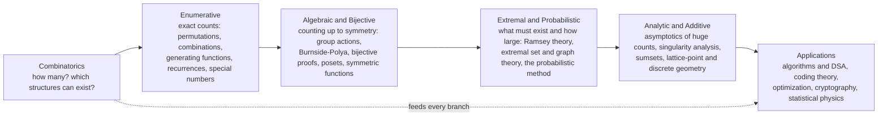

# 🧮 Combinatorics Overview

> [!abstract] TL;DR
> Combinatorics is the mathematics of **counting, arranging, and structuring discrete objects** — answering "how many ways can this happen?" without ever writing them all out. It splits into a handful of overlapping branches: **enumerative** (exact counts via permutations, combinations, generating functions, and recurrences), **algebraic and bijective** (counting up to symmetry with group actions, and proving identities by matching structures one-to-one), **extremal and probabilistic** (what *must* exist and how large or small a structure *can* be, via Ramsey theory and the probabilistic method), **analytic** (asymptotics of huge counts through generating-function analysis), and **additive and geometric** (sumsets and lattice-point counting). Its four recurring themes — *count without listing, bijections as proofs, existence without construction, and extremal bounds* — make it the silent engine under probability, algorithms, coding theory, cryptography, and statistical physics.

---

## Intuition

**Analogy — the impossible-to-list guest problem.** Suppose you are seating 15 guests around a round table and a friend asks, "How many different seatings are there?" You *could* try to list them. But there are over 87 billion of them (`14!`), so even at one arrangement per second you would still be listing when the Sun burns out. Nobody counts by listing. Instead you reason: fix one guest to break the rotational symmetry, then arrange the other 14 in `14!` orders. You never wrote down a single seating, yet you know exactly how many there are. **That leap — from "enumerate them all" to "reason out the number" — is the whole soul of combinatorics.**

Before you can find the shortest route, the fastest algorithm, or the odds of a full house in poker, someone has to answer a deceptively simple question first: **how many?** How many arrangements, how many selections, how many structures satisfy the rules? Combinatorics is the art of *clever counting* — of finding that number when brute-force listing would outlast the age of the universe. And because "how many?" hides inside almost every quantitative question, this small art quietly underpins probability, computer science, cryptography, and physics.

---

## How It Works

Combinatorics is less a single theory than a **federation of counting techniques**, unified by the objects they study — finite or discrete structures — and by a shared toolbox of principles. At the base sit two rules a child understands: the **addition principle** (mutually exclusive choices add) and the **multiplication principle** (independent stages multiply). Everything else is machinery for applying these rules cleverly when the objects get tangled.

### Core Mechanics

1. **Model the objects.** Translate a word problem into a precise set of discrete structures — arrangements, subsets, functions, graphs, lattice paths, partitions. Half the battle is deciding *what counts as the same object* (does order matter? are repeats allowed? are the items labeled?).
2. **Count without listing.** Apply the addition and multiplication principles, then correct for overcounting with the **inclusion-exclusion principle**, or fold in repetition with **stars and bars**. The goal is a closed form or a recurrence, never an explicit list.
3. **Prove by bijection.** To show two sets have the same size, exhibit a one-to-one correspondence between them. A clean bijection is often more illuminating than an algebraic identity — it *explains* why the counts are equal.
4. **Guarantee existence.** When you cannot construct an object, prove it must exist. The **pigeonhole principle** and the **probabilistic method** (if a random object has the property with positive probability, one such object exists) turn counting into existence proofs.
5. **Bound the extremes.** Ask not just "how many?" but "how large or small can a structure be before it is forced to contain a pattern?" This is extremal combinatorics — Turán-type and Ramsey-type theorems.
6. **Estimate the asymptotics.** Exact counts are often astronomically large; **analytic combinatorics** extracts how they *grow* (like `n!`, `2^n`, or `c^n / n^{3/2}`) directly from the singularities of a generating function.

### Branches of the Field



The arrow spine reads as **increasing sophistication, not strict prerequisite**: you can do extremal combinatorics without mastering analytic combinatorics. Enumerative counting is the ground floor everyone stands on; algebraic and bijective methods add *why* the counts hold; extremal and probabilistic methods flip the question to *existence and bounds*; analytic methods zoom out to *growth rates*; and applications draw on all of them at once.

---

## Key Concepts

Combinatorics scales gracefully from schoolroom puzzles to open research problems. Here is the same landscape at three altitudes.

### Secondary Level
- **The two counting rules** — the addition principle (`or` = add) and the multiplication principle (`and`, independent = multiply). Every count is built from these.
- **Factorials and permutations** — `n!` orderings of `n` distinct objects; `P(n, r) = n! / (n - r)!` ordered selections.
- **Combinations** — `C(n, r) = n! / (r! (n - r)!)` unordered selections; "choosing" a committee, a poker hand, a lottery ticket.
- **Pascal's triangle and the binomial theorem** — the coefficients of `(x + y)^n` are exactly `C(n, k)`; each entry is the sum of the two above it.
- **The pigeonhole principle** — if `n + 1` items go into `n` boxes, some box holds at least two. Obvious, yet it forces surprising conclusions.

### Undergraduate Level
- **Inclusion-exclusion (PIE)** — count unions by alternately adding and subtracting overlaps; the antidote to overcounting.
- **Stars and bars** — count multisets and non-negative integer solutions of `x_1 + ... + x_n = r` as `C(n + r - 1, r)`.
- **Recurrences and generating functions** — encode a counting sequence `a_n` as the coefficients of a formal power series; algebra on the series solves the recurrence.
- **Special numbers** — Catalan (balanced parentheses, binary trees), Stirling (set partitions, cycles), Bell (all set partitions), Fibonacci, and derangements `D_n ≈ n! / e`.
- **Bijective proofs** — establish `|A| = |B|` by an explicit correspondence rather than formula-crunching.
- **Burnside's lemma and Polya enumeration** — count distinct objects *up to symmetry* (necklaces, colorings) by averaging fixed points over a group of symmetries.
- **Introductory extremal and Ramsey ideas** — `R(3, 3) = 6`: any 2-coloring of the edges of a 6-vertex complete graph forces a monochromatic triangle.

### Graduate Level
- **Extremal set and graph theory** — Sperner's theorem (largest antichain in the Boolean lattice), Erdős–Ko–Rado (largest intersecting family), Turán's theorem (max edges with no `K_{r+1}`).
- **Ramsey theory in depth** — hypergraph Ramsey numbers, the Hales–Jewett and Van der Waerden theorems; "complete disorder is impossible."
- **The probabilistic method** — first- and second-moment methods, the Lovász Local Lemma, and alterations; existence proofs with zero explicit construction.
- **Analytic combinatorics** — the symbolic method turns object specifications into generating functions; **singularity analysis** reads off asymptotic growth from the nearest singularity.
- **Algebraic combinatorics** — symmetric functions, Young tableaux and the RSK correspondence, posets and Möbius inversion, matroids, and combinatorial species.
- **Additive combinatorics** — sumset inequalities (Plünnecke–Ruzsa), Szemerédi's theorem on arithmetic progressions, and the Freiman structure theory.
- **Topological and geometric combinatorics** — the Borsuk–Ulam route to Kneser's theorem, and lattice-point counting via Ehrhart polynomials.

---

## Python Demo

Two experiments make the field's central promise concrete. **(a) Combinatorial explosion** plots how `n!`, `2^n`, and the central binomial coefficient `C(n, n/2)` grow — so fast that listing is hopeless and *counting is the only option*. **(b) Formula versus brute force** verifies, by exhaustively enumerating every permutation and every subset for small `n`, that the closed-form counting formulas (`n!`, `2^n`, and the binomial identity `Σ_k C(n, k) = 2^n`) match reality exactly. Counting formulas are not approximations — they are the exact answer you would get if you had eternity to list.

```python
# The power of counting: reason out the number instead of listing it.
# (a) Combinatorial explosion: n!, 2^n, C(n, n//2) grow astronomically.
# (b) Verification: closed-form counting formulas == exhaustive enumeration.
import math
from itertools import permutations, combinations
import numpy as np
import matplotlib.pyplot as plt

# ---------- (a) Combinatorial explosion ----------
ns = np.arange(1, 21)
factorials = np.array([math.factorial(n) for n in ns], dtype=float)   # orderings of n objects
subsets    = np.array([2.0 ** n for n in ns])                         # subsets of an n-set
central    = np.array([math.comb(n, n // 2) for n in ns], dtype=float)  # largest binomial coeff

# ---------- (b) Closed form vs exhaustive enumeration ----------
check_ns = list(range(0, 9))           # keep small: 8! = 40320, 2^8 = 256
perm_enum, perm_formula = [], []
subset_enum, subset_formula = [], []
binom_sum, binom_pow = [], []
for n in check_ns:
    items = range(n)
    # count permutations by actually listing every one of them
    perm_enum.append(sum(1 for _ in permutations(items)))
    perm_formula.append(math.factorial(n))
    # count all subsets by listing every subset of every size k
    subset_enum.append(sum(1 for k in range(n + 1) for _ in combinations(items, k)))
    subset_formula.append(2 ** n)
    # binomial identity: sum_k C(n, k) == 2^n
    binom_sum.append(sum(math.comb(n, k) for k in range(n + 1)))
    binom_pow.append(2 ** n)

assert perm_enum == perm_formula,     "permutation enumeration must equal n!"
assert subset_enum == subset_formula, "subset enumeration must equal 2^n"
assert binom_sum == binom_pow,        "sum of binomial coefficients must equal 2^n"
print("All counting formulas verified against exhaustive enumeration.")
print(f"n=8: permutations enumerated = {perm_enum[-1]:,}  vs  8! = {math.factorial(8):,}")
print(f"n=20: 20! = {math.factorial(20):.3e}  (listing at 1/sec would take ~77,000 years)")

# ---------- Plot ----------
fig, (ax1, ax2) = plt.subplots(1, 2, figsize=(13, 5))

ax1.semilogy(ns, factorials, 'o-', label="n!  (orderings of n objects)")
ax1.semilogy(ns, subsets,    's-', label="2^n  (subsets of an n-set)")
ax1.semilogy(ns, central,    '^-', label="C(n, n//2)  (largest binomial)")
ax1.axhline(8e9, color='gray', ls=':', label="~ world population")
ax1.set_xlabel("n")
ax1.set_ylabel("count  (log scale)")
ax1.set_title("Combinatorial explosion: why we count, not list")
ax1.legend()
ax1.grid(True, which='both', alpha=0.3)

width = 0.38
x = np.array(check_ns)
ax2.bar(x - width / 2, perm_formula, width, label="n!  (closed form)")
ax2.bar(x + width / 2, perm_enum,    width, label="permutations enumerated", alpha=0.6)
ax2.set_yscale('log')
ax2.set_xlabel("n")
ax2.set_ylabel("number of permutations  (log scale)")
ax2.set_title("Formula equals brute force (bars overlap exactly)")
ax2.legend()
ax2.grid(True, which='both', axis='y', alpha=0.3)

plt.tight_layout()
plt.show()
```

**What you see:** In the left panel every curve rockets off the top of even a logarithmic axis — by `n = 20` the counts dwarf the human population, which is exactly why enumeration is off the table and a formula is indispensable. In the right panel the "closed form" and "enumerated" bars are indistinguishable at every `n`, and all three `assert`s pass silently: the formulas are not estimates but the exact count you would obtain by listing forever. That is the deal combinatorics offers — the certainty of exhaustive enumeration at the cost of a moment's cleverness.

---

## Real-World Applications

- **Algorithms and complexity (DSA)** — counting the size of a search space tells you whether brute force is feasible; combinatorial recurrences drive dynamic programming, backtracking enumerates structured possibilities, and Catalan/Stirling numbers count trees, parenthesizations, and partitions in contest and interview problems.
- **Probability and statistics** — discrete probability *is* counting favorable outcomes over total outcomes; the binomial, hypergeometric, and multinomial distributions are combinatorial identities in disguise, and gambling odds (poker, lotteries) are direct combination counts.
- **Coding theory and cryptography** — error-correcting codes are extremal combinatorial designs (maximizing minimum distance for a given size); key-space and password strength are literally counting arguments, and the birthday bound behind hash collisions is pure combinatorics.
- **Optimization and operations research** — the number of feasible solutions to scheduling, routing, and assignment problems is combinatorial; matroids and polytopes provide the structure that makes some of these tractable and explains why others are NP-hard.
- **Statistical physics** — the number of microstates consistent with a macrostate is a combinatorial count, and Boltzmann's entropy `S = k ln W` is the logarithm of that count; the Ising model and lattice gases are combinatorial enumeration problems.
- **Bioinformatics and chemistry** — counting sequence alignments, RNA secondary structures (Catalan-like recurrences), and distinct molecular isomers (Polya enumeration under molecular symmetry).
- **Networks and social science** — random graph models, degree-sequence counting, and the extremal thresholds at which giant components and unavoidable substructures appear.

---

## Common Pitfalls

- **Order confusion (permutations vs combinations)** — the single most common error: "choose 3 of 10" is `C(10, 3) = 120`, but "arrange 3 of 10" is `P(10, 3) = 720`. Always ask explicitly whether order matters *before* reaching for a formula.
- **Silent overcounting** — naively adding cases double-counts their overlaps. Counting integers `1`–`100` divisible by `2` *or* `3` is not `50 + 33`; you must subtract the `16` divisible by both. Inclusion-exclusion exists precisely to fix this.
- **Forgetting to divide out symmetry** — arrangements around a circle, necklaces that can be rotated or flipped, and labeled-vs-unlabeled objects all require dividing by the symmetry group (or using Burnside's lemma). Treating symmetric objects as distinct inflates the count.
- **Off-by-one in stars and bars** — the formula `C(n + r - 1, r)` counts multisets of size `r` from `n` types; mixing up which quantity is the "stars" and which is the "bars," or whether zeros are allowed, is a classic slip.
- **Confusing existence with construction** — the probabilistic method and pigeonhole prove that an object *exists* without ever building one. Expecting these arguments to hand you the object is a category error; finding it explicitly can be far harder than proving it exists.
- **Trusting asymptotics for small n** — an asymptotic formula like Stirling's `n! ≈ √(2πn) (n/e)^n` is superb for large `n` but can be wildly off for small `n`; use exact counts when `n` is tiny.
- **Ignoring log scale when reasoning about growth** — because counts explode, a linear intuition badly misleads. `2^n` versus `n!` looks like a tie at `n = 3` and a chasm at `n = 20`; always think multiplicatively.

---

## Related Concepts

- [[Mathematics/04_Discrete_Mathematics/Combinatorics|Combinatorics (Discrete Mathematics)]] — the seed note this vault expands; it covers the core toolkit (permutations, combinations, PIE, pigeonhole, Catalan) that every branch below builds on.
- [[Mathematics/04_Discrete_Mathematics/Generating_Functions_and_Recurrences|Generating Functions and Recurrences]] — the algebraic engine of enumerative and analytic combinatorics; power series that bookkeep counting sequences and solve their recurrences.
- [[Mathematics/04_Discrete_Mathematics/Graph_Theory|Graph Theory]] — many combinatorial objects *are* graphs; extremal and Ramsey theory live largely on graphs.
- [[Mathematics/04_Discrete_Mathematics/Set_Theory_and_Relations|Set Theory and Relations]] — combinations count subsets, and posets/equivalence relations are the structures algebraic combinatorics studies.
- [[Mathematics/04_Discrete_Mathematics/Number_Theory_Elementary|Elementary Number Theory]] — binomial coefficients modulo a prime (Lucas' theorem) and additive combinatorics sit on the boundary of the two fields.
- [[Mathematics/04_Discrete_Mathematics/Logic_and_Proof_Techniques|Logic and Proof Techniques]] — induction, bijection, pigeonhole, and the probabilistic method are the proof styles combinatorics leans on hardest.
- [[Mathematics/06_Probability_and_Statistics/Probability_Theory|Probability Theory]] — discrete probability is normalized counting, and the probabilistic method turns probability back into existence proofs.
- [[Mathematics/10_Abstract_Algebra/Groups_and_Subgroups|Groups and Subgroups]] — group actions underlie Burnside's lemma and Polya enumeration for counting up to symmetry.
- [[DSA/12_Competitive_Programming/Combinatorics|Combinatorics for Competitive Programming]] — the algorithmic counterpart: computing `nCr mod p`, factorial precomputation, and Catalan/Stirling numbers under contest constraints.
- [[DSA/09_Recursion_Backtracking/Backtracking|Backtracking]] — the systematic enumeration of a combinatorial search space, pruned as it goes.
- [[DSA/10_Dynamic_Programming/DP_Patterns|Dynamic Programming Patterns]] — counting DP evaluates combinatorial recurrences efficiently instead of re-enumerating.
- [[Information_Theory/01_Foundations_of_Information_Theory/Information_Theory_Overview|Information Theory Overview]] — entropy and coding bounds rest on counting "typical" sequences (the asymptotic equipartition property).

---

## Roadmap of the Combinatorics Vault

This overview is the entry point; the sections that follow deepen each branch. Enumerative foundations begin with *Permutations and Combinations* (the ordered/unordered counting core) and *The Binomial Theorem and Coefficients* (Pascal's triangle, identities, and the combinatorial meaning of `(x + y)^n`). The algebraic thread continues through *Generating Functions* (turning sequences into power series and reading off closed forms). The existence-and-bounds thread is carried by *Ramsey Theory* ("total disorder is impossible") and *The Probabilistic Method* (proving objects exist by showing a random one works). The asymptotic viewpoint is developed in *Analytic Combinatorics* (extracting growth rates from generating-function singularities). A closing survey, *The Reach and Future of Combinatorics*, traces the field's expanding ties to computer science, additive number theory, and statistical physics. Each note keeps the same rhythm as this one — analogy first, then mechanics, then a runnable demo.

---

## Review Questions

**Secondary**
1. A pizza shop offers 8 toppings. How many different pizzas can you make if a pizza is defined by *which subset* of toppings it carries (including the plain pizza with none)? Explain why the answer is `2^8` rather than `8!`, and connect it to the multiplication principle applied once per topping ("in or out").

**Undergraduate**
2. Count the number of ways to distribute 12 identical candies among 4 distinct children so that every child gets at least one. Set up the problem with stars and bars, adjust for the "at least one" constraint, and then re-derive the same count using inclusion-exclusion on the "some child gets zero" bad events. Why must the two methods agree?

**Graduate**
3. Using the probabilistic method, show that for large `n` the Ramsey number satisfies `R(k, k) > 2^{k/2}` — that is, there exists a 2-coloring of the edges of the complete graph on roughly `2^{k/2}` vertices with no monochromatic `K_k`. Sketch the first-moment argument (expected number of monochromatic `K_k` copies `< 1`), and explain in what sense this proves existence *without constructing* such a coloring — and why constructing one explicitly remains an open problem.

---

## Sources

- [Stanley, R. P. — *Enumerative Combinatorics*, Vols. 1 and 2 (Cambridge)](https://math.mit.edu/~rstan/ec/)
- [van Lint, J. H. & Wilson, R. M. — *A Course in Combinatorics* (2nd ed., Cambridge)](https://www.cambridge.org/9780521006019)
- [Graham, Knuth & Patashnik — *Concrete Mathematics* (2nd ed., Addison-Wesley)](https://www-cs-faculty.stanford.edu/~knuth/gkp.html)
- [Flajolet, P. & Sedgewick, R. — *Analytic Combinatorics* (free PDF, Cambridge)](https://algo.inria.fr/flajolet/Publications/book.pdf)
- [Alon, N. & Spencer, J. — *The Probabilistic Method* (4th ed., Wiley)](https://onlinelibrary.wiley.com/doi/book/10.1002/9781119061966)

---

#combinatorics #counting #enumeration #discrete-mathematics #foundations
