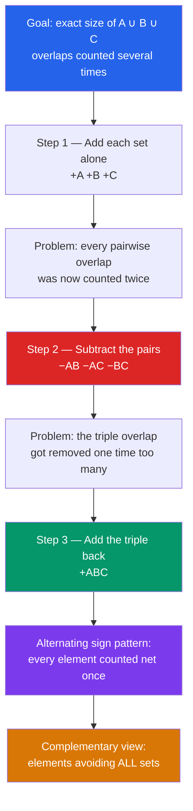

# 🎭 Inclusion-Exclusion Principle

> [!abstract] TL;DR
> To count a **union** of overlapping sets exactly, you cannot just add their sizes — shared elements get counted more than once. Inclusion-exclusion fixes the bookkeeping with an **alternating sum**: add the singletons, subtract the pairwise overlaps, add back the triple overlaps, and so on. It is the master tool behind **derangements**, **onto-function counts**, the **Euler totient**, and any "count things avoiding all bad properties" problem.

---

## Intuition

**Analogy:** To count the students who play soccer **or** basketball, you cannot just add the two team rosters — the kids on **both** teams got counted twice, so you must **subtract the overlap**. Now add a third sport. You subtract each pairwise overlap, but in doing so you have over-subtracted the students who play **all three**, so you must **add that triple-overlap back**. Inclusion-exclusion is exactly this alternating add-subtract dance, and it counts a union perfectly no matter how tangled the overlaps get.

Technically: each element of the union contributes to the count once for every subset of properties it satisfies. The alternating signs are engineered so that, when you total an element's contributions across all those subsets, they collapse to a **net of exactly one** — a telescoping cancellation driven by the binomial theorem.

---

## How It Works

### Core Mechanics

For finite sets $A_1, A_2, \dots, A_n$, the size of their union is:

$$
\left| \bigcup_{i=1}^{n} A_i \right| = \sum_{i} |A_i| - \sum_{i<j} |A_i \cap A_j| + \sum_{i<j<k} |A_i \cap A_j \cap A_k| - \cdots + (-1)^{n+1}\, |A_1 \cap \cdots \cap A_n|
$$

Compactly, summing over every **non-empty** subset $S \subseteq \{1,\dots,n\}$:

$$
\left| \bigcup_{i=1}^n A_i \right| = \sum_{\emptyset \ne S \subseteq [n]} (-1)^{|S|+1} \left| \bigcap_{i \in S} A_i \right|
$$

**Complementary form (the workhorse).** Usually the $A_i$ are "bad properties" and you want the count of elements in a universe $U$ having **none** of them:

$$
\left| \overline{A_1} \cap \cdots \cap \overline{A_n} \right| = \sum_{S \subseteq [n]} (-1)^{|S|} \left| \bigcap_{i \in S} A_i \right| = |U| - \sum_i |A_i| + \sum_{i<j}|A_i \cap A_j| - \cdots
$$

(the empty subset contributes $|U|$).

**Why it is exact — each element counted net once.** Take an element $x$ that lies in exactly $m \ge 1$ of the sets. In the union formula it is counted, over subsets of those $m$ properties, with net weight
$$
\sum_{k=1}^{m} (-1)^{k+1}\binom{m}{k} = 1 - \sum_{k=0}^{m}(-1)^k\binom{m}{k} + 1 = 1 - (1-1)^m = 1.
$$
So every element of the union is tallied exactly once, and elements in none of the sets contribute zero. That single binomial identity **is** the proof.

**Bonferroni inequalities.** Truncating the alternating series gives rigorous bounds: stopping after an **odd** number of terms **over-estimates** the union, stopping after an **even** number **under-estimates** it. These partial-sum bounds are heavily used in probability when the full series is intractable.

### Flow / Architecture



---

## Key Concepts

### Secondary (school level)
- **Two sets:** $|A \cup B| = |A| + |B| - |A \cap B|$. The subtraction removes the double-counted overlap.
- **Three sets:** add the three singles, subtract the three pairs, add back the one triple — the pattern you can draw on a Venn diagram.
- **Complement trick:** "how many avoid all of these?" $= \text{total} - |A \cup B \cup \cdots|$.

### Undergraduate
- **General formula** over all non-empty subsets with alternating signs $(-1)^{|S|+1}$, and the **complementary form** for "none of the properties."
- **Derangements** $D_n$: permutations with no fixed point. Let $A_i$ = permutations fixing position $i$; then $|A_{i_1}\cap\cdots\cap A_{i_k}| = (n-k)!$ and
  $$D_n = \sum_{k=0}^n (-1)^k \binom{n}{k}(n-k)! = n!\sum_{k=0}^n \frac{(-1)^k}{k!} \;\longrightarrow\; \frac{n!}{e}.$$
  In fact $D_n$ is the nearest integer to $n!/e$, and $D_n/n! \to 1/e \approx 0.3679$.
- **Surjections (onto functions).** The number of onto functions $[n] \to [m]$ (with $A_i$ = "value $i$ is missed"):
  $$\text{Surj}(n,m) = \sum_{k=0}^{m}(-1)^k\binom{m}{k}(m-k)^n = m!\,\genfrac\{\}{0pt}{}{n}{m},$$
  connecting I-E to the **Stirling numbers of the second kind**.
- **Euler's totient via the sieve.** With $A_p$ = multiples of prime $p$ dividing $n$:
  $$\varphi(n) = n\prod_{p \mid n}\left(1 - \tfrac{1}{p}\right) = \sum_{d \mid n}\mu(d)\,\tfrac{n}{d},$$
  the same "subtract multiples of each prime, add back multiples of products of primes" logic as counting primes with a sieve.
- **Hat-check / probabilistic version.** If $n$ guests randomly grab hats, $P(\text{no one gets their own}) = D_n/n! \to 1/e$ — a probability that famously **does not vanish** as $n \to \infty$.

### Graduate
- **Möbius inversion viewpoint.** Inclusion-exclusion is the special case of Möbius inversion over the **Boolean lattice** $2^{[n]}$, whose Möbius function is $\mu(S,T) = (-1)^{|T \setminus S|}$. Over the divisor lattice it becomes the number-theoretic Möbius function $\mu(d)$; the general machinery lives in the incidence algebra of a poset (foreshadowing `Mobius_Inversion_and_Incidence_Algebras`).
- **Chromatic polynomial.** The number of proper $k$-colorings of a graph, $P(G,k) = \sum_{S \subseteq E}(-1)^{|S|}k^{c(S)}$, is a signed sum over edge subsets — inclusion-exclusion over the "monochromatic-edge" bad events, and again a Möbius sum over the bond lattice.
- **Bonferroni / Boole bounds** formalize truncation error and underpin multiple-hypothesis correction and union-bound arguments in probability.
- **Sieve methods** in analytic number theory (Legendre, Brun, Selberg) generalize the alternating I-E series to estimate prime and almost-prime counts where the exact $2^n$-term sum is hopeless.

---

## Python Demo

```python
# Inclusion-exclusion in action, two classic applications, each verified
# against a brute-force ground truth, plus convergence visualizations.
import numpy as np
import matplotlib.pyplot as plt
from itertools import permutations, combinations
from math import factorial, e

# ---------------------------------------------------------------------------
# (a) DERANGEMENTS: permutations with NO fixed point.
#     Bad property A_i = "position i is fixed".  |intersection of k of them| = (n-k)!
#     Inclusion-exclusion:  D_n = sum_k (-1)^k * C(n,k) * (n-k)! = n! * sum_k (-1)^k / k!
# ---------------------------------------------------------------------------
def derangements_ie(n):
    # factorial(n)//factorial(k) == C(n,k)*(n-k)! and is an exact integer
    return sum((-1)**k * (factorial(n) // factorial(k)) for k in range(n + 1))

def derangements_brute(n):
    if n == 0:
        return 1
    return sum(1 for p in permutations(range(n)) if all(p[i] != i for i in range(n)))

print("n :  I-E   brute   ratio D_n/n!   1/e")
for n in range(1, 9):
    ie, bf = derangements_ie(n), derangements_brute(n)
    assert ie == bf, f"mismatch at n={n}: {ie} != {bf}"
    print(f"{n} : {ie:6d} {bf:6d}   {ie/factorial(n):.6f}     {1/e:.6f}")

# ---------------------------------------------------------------------------
# (b) COPRIME COUNT: integers in [1, N] divisible by NONE of a set of primes.
#     Complementary I-E:  sum over subsets S of (-1)^|S| * floor(N / product(S)).
#     When the primes are exactly the prime factors of N, this equals Euler's phi(N).
# ---------------------------------------------------------------------------
def count_none_divisible_ie(N, primes):
    total = 0
    for r in range(len(primes) + 1):
        for combo in combinations(primes, r):
            prod = int(np.prod(combo)) if combo else 1
            total += (-1)**r * (N // prod)
    return total

def count_none_divisible_direct(N, primes):
    return sum(1 for x in range(1, N + 1) if all(x % p for p in primes))

N, primes = 1000, [2, 3, 5, 7]
ie_count = count_none_divisible_ie(N, primes)
direct   = count_none_divisible_direct(N, primes)
assert ie_count == direct, "coprime count mismatch"
print(f"\nIntegers in [1,{N}] divisible by none of {primes}: "
      f"I-E={ie_count}, direct={direct}  (2^{len(primes)} = "
      f"{2**len(primes)} terms)")

# phi(30) sanity check: primes dividing 30 are {2,3,5}
print("phi(30) via I-E =", count_none_divisible_ie(30, [2, 3, 5]), "(expected 8)")

# ---------------------------------------------------------------------------
# Visualization 1: derangement ratio D_n/n! converging to 1/e
# Visualization 2: alternating partial sums of the I-E series (Bonferroni bounds)
# ---------------------------------------------------------------------------
ns     = np.arange(1, 13)
ratios = np.array([derangements_ie(n) / factorial(n) for n in ns])

# partial sums S_K = sum_{k=0}^{K} (-1)^k / k!  ->  1/e
K       = np.arange(0, 13)
terms   = np.array([(-1.0)**k / factorial(k) for k in K])
partial = np.cumsum(terms)

fig, ax = plt.subplots(1, 2, figsize=(12, 4.6))

ax[0].plot(ns, ratios, "o-", color="#2563eb", label=r"$D_n / n!$")
ax[0].axhline(1 / e, color="#dc2626", ls="--", label=r"$1/e \approx 0.3679$")
ax[0].set_xlabel("n"); ax[0].set_ylabel(r"$D_n / n!$")
ax[0].set_title("Derangement ratio -> 1/e")
ax[0].legend(); ax[0].grid(alpha=0.3)

barcolors = ["#059669" if t >= 0 else "#dc2626" for t in terms]
ax[1].bar(K, terms, color=barcolors, alpha=0.55, label="signed term")
ax[1].plot(K, partial, "o-", color="#7c3aed", label="partial sum")
ax[1].axhline(1 / e, color="#111827", ls="--", label=r"$1/e$")
ax[1].set_xlabel("k (terms included)"); ax[1].set_ylabel("value")
ax[1].set_title("Alternating add / subtract converges (Bonferroni)")
ax[1].legend(); ax[1].grid(alpha=0.3)

plt.tight_layout()
plt.savefig("inclusion_exclusion_convergence.png", dpi=130)
plt.show()
```

Expected output (abridged):

```
n :  I-E   brute   ratio D_n/n!   1/e
1 :      0      0   0.000000     0.367879
2 :      1      1   0.500000     0.367879
3 :      2      2   0.333333     0.367879
...
8 :  14833  14833   0.367882     0.367879

Integers in [1,1000] divisible by none of [2, 3, 5, 7]: I-E=228, direct=228  (2^4 = 16 terms)
phi(30) via I-E = 8 (expected 8)
```

The brute-force enumeration confirms the I-E formula exactly, the ratio locks onto $1/e$, and the coprime count matches direct sieving — while the right-hand plot shows the classic alternating overshoot/undershoot (Bonferroni bounds) tightening onto the limit.

---

## Real-World Applications

> **Example — the Euler totient in RSA.** `[[Euler_Totient]]` computes $\varphi(n) = n\prod_{p\mid n}(1-1/p)$, which is inclusion-exclusion over the prime factors: subtract multiples of each prime, add back multiples of each product of two primes, etc. RSA key generation needs $\varphi(n)$ (or the Carmichael $\lambda$) to derive the private exponent, so I-E sits at the heart of a cryptosystem.

- **Sieve of Eratosthenes & prime counting.** Legendre's formula counts primes up to $N$ via I-E over small primes; `[[Sieve_of_Eratosthenes]]` is the algorithmic cousin.
- **Probabilistic union bounds.** Estimating $P(A_1 \cup \cdots \cup A_n)$ (at least one failure, collision, or defect) uses I-E and its Bonferroni truncations when exact evaluation is infeasible.
- **Combinatorial enumeration in contests.** "Count integers in a range coprime to $m$," "count arrangements avoiding forbidden positions," and surjection counts are staple I-E problems, often paired with `[[Bit_Manipulation]]` to iterate the $2^n$ subsets.
- **The rencontres / hat-check problem.** Random matching failures (secret-Santa with no self-assignment, shuffled-deck no-match) all reduce to derangements and the $1/e$ limit.
- **Database query estimation.** Cardinality estimators for `OR`/`UNION` predicates lean on I-E-style corrections for overlapping selectivity.

---

## Trade-offs

| Aspect | Pro | Con |
|--------|-----|-----|
| Performance | Turns an impossible "count the union directly" into a finite formula of intersection sizes, which are often trivial (e.g. $(n-k)!$ or $\lfloor N/d\rfloor$). | Full evaluation needs $2^n$ terms — one per subset of properties — so it is exponential in the **number of sets**, not the universe size. |
| Complexity | Conceptually simple: one alternating-sign template solves derangements, surjections, totients, and colorings. | Sign/parity bookkeeping is error-prone by hand; forgetting a higher-order overlap silently corrupts the answer. |
| Scalability | Bonferroni truncation gives rigorous bounds when the full series is too large, and Möbius inversion generalizes it to arbitrary posets. | When properties are **independent**, I-E is overkill — a simple product $\prod(1-p_i)$ is exact and $O(n)$. |

---

## When to Use vs Avoid

**Use when:**
- You need the exact size of a **union** (or its complement) of sets with **non-trivial, structured overlaps**.
- The intersection sizes $|\bigcap_{i\in S} A_i|$ are easy to compute (symmetric problems where they depend only on $|S|$ are ideal).
- The number of "bad properties" $n$ is small (so $2^n$ subsets is tractable), or the series can be truncated with Bonferroni bounds.

**Avoid when:**
- The properties are **independent** — then multiply complementary probabilities/counts directly; no alternating sum needed.
- $n$ is large with **no structure** in the intersections, making $2^n$ terms both unevaluable and un-truncatable.
- A generating-function or recurrence approach (e.g. $D_n = (n-1)(D_{n-1}+D_{n-2})$) is simpler and avoids the exponential term count.

---

## Common Pitfalls

- **Sign / parity errors.** The sign is $(-1)^{|S|+1}$ for the union form but $(-1)^{|S|}$ for the complementary "avoid all" form. Mixing the two flips the answer. Anchor yourself on the $k=0$ term: the complementary form starts with $+|U|$.
- **Forgetting higher-order overlaps.** Subtracting pairs but omitting the triple-overlap correction is the classic three-set mistake — the answer is off by exactly the triple intersection. Always carry the alternation all the way to the $n$-fold intersection.
- **Using I-E when properties are independent.** If the events don't actually interact, I-E collapses to a product; reaching for the full alternating sum wastes effort and invites arithmetic slips.
- **Ignoring the $2^n$ blow-up.** With many distinct primes/properties, naively iterating all subsets is exponential. Exploit symmetry (terms depending only on $|S|$), factor structure, or truncate with **Bonferroni** bounds instead of enumerating every subset.
- **Off-by-one in floor terms.** In number-theoretic I-E, $\lfloor N/d \rfloor$ counts multiples of $d$ in $[1,N]$; forgetting whether the range includes $0$ or $N$ itself skews the totient/coprime count.

---

## Related Concepts

- [[Combinatorics]] — the parent counting toolkit; inclusion-exclusion is one of its three pillars alongside permutations/combinations and the pigeonhole principle.
- [[Set_Theory_and_Relations]] — supplies the union/intersection/complement algebra that I-E manipulates.
- [[Number_Theory_Elementary]] — coprimality and divisor structure make number-theoretic I-E (totients, prime counts) work.
- [[Euler_Totient]] — a direct, high-value application: $\varphi(n)$ **is** inclusion-exclusion over prime divisors.
- [[Sieve_of_Eratosthenes]] — the sieve viewpoint; Legendre's prime count is I-E in disguise.
- [[Probability_Theory]] — the probabilistic union formula and Bonferroni inequalities are the measure-theoretic face of I-E.
- [[Bit_Manipulation]] — bitmask subset enumeration is the standard way to iterate the $2^n$ terms when applying I-E in code.
- [[Generating_Functions_and_Recurrences]] — an alternative route to derangements and surjections that sidesteps the exponential term count.

Siblings in this vault (prose references): **The_Sum_and_Product_Rules** ground the additive logic I-E corrects; **Mobius_Inversion_and_Incidence_Algebras** generalize I-E to arbitrary posets; **Generating_Functions** give recurrence-based derivations of the same counts; **The_Pigeonhole_Principle** is the complementary existence tool to I-E's exact counting.

---

## Review Questions

1. **(Secondary/Undergraduate)** Explain, using the "counted net once" argument, why an element lying in exactly $m$ of the sets contributes weight $1$ to the union formula. Which single binomial identity makes the alternating contributions collapse to $1$?
2. **(Undergraduate — scenario)** You need to count permutations of $\{1,\dots,n\}$ with **no** fixed point. Set up the bad-property sets $A_i$, state $|A_{i_1}\cap\cdots\cap A_{i_k}|$, and derive $D_n = n!\sum_{k=0}^n (-1)^k/k!$. Why does $D_n/n!$ approach $1/e$ rather than $0$?
3. **(Graduate — trade-off)** You must count integers in $[1,N]$ coprime to a modulus $m$ with 30 distinct prime factors. Naive inclusion-exclusion needs $2^{30}$ terms. Give two ways to make this tractable, and explain when independence or Bonferroni truncation lets you avoid the full sum. How does the Möbius-function form $\sum_{d\mid m}\mu(d)\lfloor N/d\rfloor$ reduce the count of nonzero terms?

---

## Sources

- Stanley, R. P. *Enumerative Combinatorics, Volume 1* (2nd ed.), Ch. 2 — sieve methods and the Möbius-inversion viewpoint.
- Brualdi, R. A. *Introductory Combinatorics*, Ch. 6 — inclusion-exclusion, derangements, and applications.
- van Lint, J. H. & Wilson, R. M. *A Course in Combinatorics*, Ch. 10 — the principle and its number-theoretic ties.
- Graham, Knuth & Patashnik. *Concrete Mathematics*, §4.9 and the "hat-check" / derangement discussion.
- [Wikipedia — Inclusion–exclusion principle](https://en.wikipedia.org/wiki/Inclusion%E2%80%93exclusion_principle)

---

#combinatorics #inclusion-exclusion #derangements #counting #sieve
