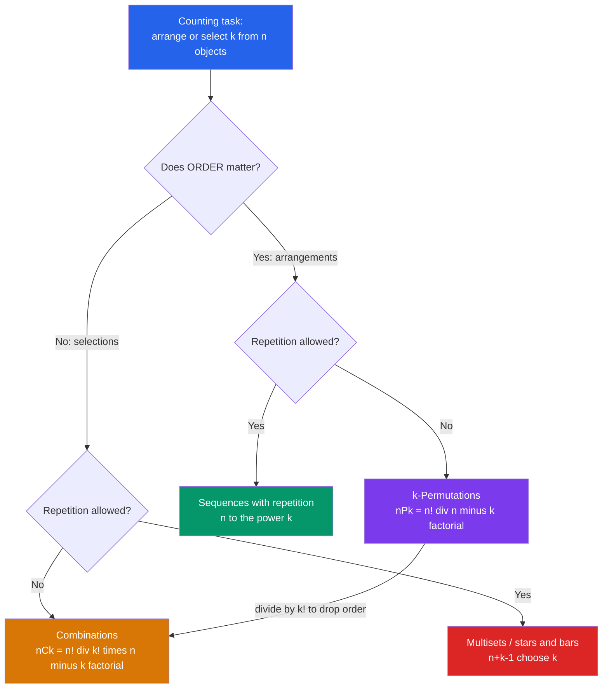

# 🔢 Permutations and Combinations

> [!abstract] TL;DR
> A **permutation** is an *ordered* arrangement ($n! $ for all objects, $nPk = n!/(n-k)!$ for $k$ of them); a **combination** is an *unordered* selection ($nCk = \binom{n}{k} = n!/(k!(n-k)!)$). The single organizing question of all counting is **"does order matter?"** — and the second is "is repetition allowed?" Together they generate the four counting formulas that underlie probability, algorithms, and error-correcting codes.

---

## Intuition

**Analogy:** Three runners cross the finish line. How many possible **podiums** (gold, silver, bronze) are there? Order matters — gold ≠ silver — so we count **permutations**: $3! = 6$ ways. Now instead pick 3 people from that same team to form a **committee**. Swapping two members gives the *same* committee, so order does *not* matter — we count **combinations**. The podium and the committee draw from identical people; only the question "does order matter?" separates them.

That one question is the most important distinction in all of counting. Everything else — the factorials, the "$n$ choose $k$", the stars-and-bars — flows from answering it, followed by a second question: *can I reuse an object (repetition)?* Answer both and the exact formula is determined.

---

## How It Works

### Core Mechanics

1. **Start from the product rule.** Filling $k$ ordered slots from $n$ distinct objects *without* reuse: the first slot has $n$ choices, the next $n-1$, down to $n-k+1$. That falling product is $nPk = n(n-1)\cdots(n-k+1) = \dfrac{n!}{(n-k)!}$. Using all $n$ objects gives $nPn = n!$.
2. **Remove the ordering to get combinations.** Every unordered $k$-subset can be arranged in $k!$ orders, so the $nPk$ ordered lists collapse in groups of $k!$:
   $$\binom{n}{k} = \frac{nPk}{k!} = \frac{n!}{k!\,(n-k)!}, \qquad \boxed{\,P = C \times k!\,}$$
   This division-by-$k!$ is the heart of the permutation-to-combination relationship.
3. **Allow repetition to get the other two cases.** If reuse is allowed and order matters, each of $k$ slots independently picks any of $n$ objects: $n^k$. If reuse is allowed but order does *not* matter, you count **multisets** via **stars and bars**: $\binom{n+k-1}{k}$.
4. **Divide out symmetries.** *Circular* permutations fix a rotation reference, giving $(n-1)!$ seatings around a table. *Identical objects* (letters of a word, say $n_1$ of one kind, ..., $n_r$ of another) divide out their internal reorderings, giving the **multinomial** coefficient $\dfrac{n!}{n_1!\,n_2!\cdots n_r!}$.

### Flow / Architecture



The four leaves are exactly the **order × repetition** table — the backbone that the sibling *Combinatorics_Overview* and *The_Sum_and_Product_Rules* notes build every later technique on top of.

---

## Key Concepts

### Secondary (high-school level)
- **Factorial:** $n! = n(n-1)\cdots 2\cdot 1$, with $0! = 1$ (the empty arrangement). Counts full orderings of $n$ distinct things.
- **Permutation of $k$ from $n$:** ordered, no reuse — $nPk = \dfrac{n!}{(n-k)!}$.
- **Combination of $k$ from $n$:** unordered, no reuse — $nCk = \binom{n}{k} = \dfrac{n!}{k!(n-k)!}$.
- **The litmus test:** ask *"if I swap two chosen items, is it a different answer?"* Yes → permutation. No → combination.

### Undergraduate
- **The four cases (order × repetition):**

  | | **No repetition** | **Repetition allowed** |
  |---|---|---|
  | **Order matters** | $k$-permutations $\dfrac{n!}{(n-k)!}$ | sequences $n^k$ |
  | **Order irrelevant** | combinations $\binom{n}{k}$ | multisets $\binom{n+k-1}{k}$ |

- **Stars and bars:** the number of non-negative integer solutions to $x_1 + \cdots + x_n = k$ equals $\binom{n+k-1}{k}$ — place $k$ stars and $n-1$ dividing bars (see sibling *Compositions_and_Multisets*).
- **Permutations with identical objects (multinomial):** arrangements of a multiset with counts $n_1,\dots,n_r$ summing to $n$ number $\dfrac{n!}{n_1!\cdots n_r!}$. "MISSISSIPPI" $= \dfrac{11!}{4!\,4!\,2!\,1!} = 34650$.
- **Circular permutations:** $(n-1)!$ arrangements around a table (rotations identified); $\tfrac{(n-1)!}{2}$ if reflections also coincide (a necklace).
- **Pascal's identity & symmetry:** $\binom{n}{k} = \binom{n-1}{k-1} + \binom{n-1}{k}$ and $\binom{n}{k} = \binom{n}{n-k}$ — the recurrence that builds Pascal's triangle and foreshadows *The_Binomial_Theorem_and_Coefficients*, where $\binom{n}{k}$ is the coefficient of $x^k y^{n-k}$ in $(x+y)^n$.

### Graduate
- **Bijective proofs:** identities like $\sum_k \binom{n}{k} = 2^n$ are proven by a bijection (each subset of an $n$-set ↔ a binary string), not algebra — the gold standard of combinatorial reasoning.
- **Lattice-path model:** $\binom{n}{k}$ counts monotone lattice paths from $(0,0)$ to $(k, n-k)$ using unit right/up steps; Pascal's identity is just "the last step was right or up."
- **The Twelvefold Way:** functions $f:[k]\to[n]$ classified by whether the domain/codomain are labeled and by injective/surjective/arbitrary — a single table unifying all of the above (Rota's framing; see Stanley).
- **$q$-analogs:** the **Gaussian binomial coefficient** $\binom{n}{k}_q$ deforms $\binom{n}{k}$ and counts $k$-dimensional subspaces of $\mathbb{F}_q^n$, linking counting to linear algebra over finite fields.
- **Symmetric-group connection:** the $n!$ permutations of $n$ symbols are exactly the elements of the symmetric group $S_n$ (see *Groups_and_Subgroups*); cycle structure refines the raw count of $n!$.
- **Asymptotics:** Stirling gives $n! \sim \sqrt{2\pi n}\,(n/e)^n$ and the central coefficient $\binom{2n}{n} \sim 4^n/\sqrt{\pi n}$, the growth rate behind many exponential-time algorithm analyses.

---

## Python Demo

```python
# Verify the counting formulas by brute-force enumeration, then visualize
# how binomial coefficients form Pascal's triangle and how the three
# "fixed n" families (permutations, combinations, multisets) grow.
import numpy as np
import matplotlib.pyplot as plt
from itertools import permutations, combinations, combinations_with_replacement
from math import factorial, comb, perm

# ---------- (a) Enumerate and VERIFY the formulas ----------
n, k = 5, 3
items = list(range(n))

perm_list  = list(permutations(items, k))                     # ordered, no reuse
comb_list  = list(combinations(items, k))                     # unordered, no reuse
multi_list = list(combinations_with_replacement(items, k))    # unordered, with reuse

nPk      = factorial(n) // factorial(n - k)
nCk      = factorial(n) // (factorial(k) * factorial(n - k))
multiset = comb(n + k - 1, k)

print(f"n={n}, k={k}")
print(f"  permutations enumerated = {len(perm_list):>4}   formula nPk = {nPk}")
print(f"  combinations enumerated = {len(comb_list):>4}   formula nCk = {nCk}")
print(f"  multisets    enumerated = {len(multi_list):>4}   formula     = {multiset}")

assert len(perm_list)  == nPk == perm(n, k)          # itertools == falling factorial
assert len(comb_list)  == nCk == comb(n, k)
assert len(multi_list) == multiset
assert nPk == nCk * factorial(k)                     # the core relationship P = C * k!
print("All counts verified.  P = C * k! confirmed.\n")

# ---------- (b) Visualize ----------
fig, axes = plt.subplots(1, 3, figsize=(16, 5))

# Left: Pascal's triangle of binomial coefficients (log scale for readability)
N = 14
tri = np.full((N + 1, N + 1), np.nan)
for r in range(N + 1):
    for c in range(r + 1):
        tri[r, c] = np.log10(comb(r, c) + 1)
axes[0].imshow(tri, cmap="viridis", aspect="auto")
axes[0].set_title("Pascal's triangle: log10 of (n choose k)")
axes[0].set_xlabel("k"); axes[0].set_ylabel("n")

# Middle: for fixed n, n-choose-k is symmetric and peaked at k = n/2
n_fixed = 30
ks    = np.arange(n_fixed + 1)
binom = np.array([comb(n_fixed, int(x)) for x in ks], dtype=float)
axes[1].bar(ks, binom, color="#2563eb")
axes[1].axvline(n_fixed / 2, color="red", ls="--", label="peak at k = n/2")
axes[1].set_title(f"(n choose k) is symmetric & peaked  (n={n_fixed})")
axes[1].set_xlabel("k"); axes[1].set_ylabel("count"); axes[1].legend()

# Right: growth of the three families for fixed n as k varies (log y-axis)
n_g = 10
kk = np.arange(0, n_g + 1)
p_counts = np.array([perm(n_g, int(x))            for x in kk], dtype=float)
c_counts = np.array([comb(n_g, int(x))            for x in kk], dtype=float)
m_counts = np.array([comb(n_g + int(x) - 1, int(x)) for x in kk], dtype=float)
axes[2].plot(kk, p_counts, "o-", label="k-permutations  nPk")
axes[2].plot(kk, c_counts, "s-", label="combinations   nCk")
axes[2].plot(kk, m_counts, "^-", label="multisets (with repetition)")
axes[2].set_yscale("log")
axes[2].set_title(f"Growth for fixed n = {n_g}")
axes[2].set_xlabel("k"); axes[2].set_ylabel("count (log scale)"); axes[2].legend()

plt.tight_layout()
plt.savefig("permutations_vs_combinations.png", dpi=120)
print("Saved figure: permutations_vs_combinations.png")
```

**Expected console output:**

```
n=5, k=3
  permutations enumerated =   60   formula nPk = 60
  combinations enumerated =   10   formula nCk = 10
  multisets    enumerated =   35   formula     = 35
All counts verified.  P = C * k! confirmed.
```

The plots show (1) Pascal's triangle as a heat map of $\binom{n}{k}$, (2) the symmetric bell-shaped row of coefficients that foreshadows the binomial (and Gaussian) distribution, and (3) how permutations outrun combinations, which in turn are outrun by multisets as $k$ approaches $n$.

---

## Real-World Applications

> **Example:** A **6-from-49 lottery** has $\binom{49}{6} = 13{,}983{,}816$ equally likely tickets — order of the drawn balls is irrelevant, so it is a *combination*, not a permutation. If order mattered it would be $49P6 \approx 10^{10}$, a $720\times$ ($=6!$) inflation. That factor of $k!$ is exactly $P = C\times k!$.

- **Poker hands:** the number of 5-card hands is $\binom{52}{5} = 2{,}598{,}960$; probabilities of flushes, full houses, etc. are counted with products of combinations (see *Probability_Theory* for the combinatorial-probability bridge).
- **Password / key entropy:** an 8-character alphanumeric password is $62^8 \approx 2\times10^{14}$ ordered sequences *with* repetition — the top-left $n^k$ leaf of the decision tree.
- **Error-correcting codes:** the number of weight-$w$ codewords of length $n$ is $\binom{n}{w}$; binomial coefficients determine a code's distance distribution.
- **Machine learning:** choosing $k$ features from $n$ ($\binom{n}{k}$ subsets) explains why exhaustive feature selection is intractable; $k$-fold cross-validation partitions likewise rest on combinations.
- **Anagrams & bioinformatics:** distinct arrangements of a word or DNA multiset use the multinomial $n!/(n_1!\cdots n_r!)$.
- **Round-robin seating & scheduling:** seating $n$ guests around a table is a *circular* permutation $(n-1)!$.

---

## Trade-offs

| Aspect | Pro | Con |
|--------|-----|-----|
| Performance | Closed-form formulas give exact counts in $O(k)$ multiplications — no enumeration needed | Values explode (factorial/exponential); require big integers or modular arithmetic |
| Complexity | One decision tree (order? repetition?) covers every basic counting problem | Misreading the two questions silently yields the wrong formula — errors are off by a factor of $k!$ |
| Scalability | $\binom{n}{k}$ computes fine even for astronomically large counts | *Generating* (not just counting) all arrangements is $O(n!)$ or $O(\binom{n}{k})$ and quickly infeasible |

---

## When to Use vs Avoid

**Use when:**
- You must count arrangements/selections and can cleanly answer "does order matter?" and "is repetition allowed?"
- You need an exact probability with equally likely outcomes (favorable count / total count).

**Avoid when:**
- Objects have complex constraints or overlaps — reach for inclusion-exclusion or generating functions instead of a single formula.
- You actually need to *enumerate* (not count) large sets — use algorithmic generation (*Backtracking*) and expect exponential cost.

---

## Common Pitfalls

- **Confusing order-matters vs not** — the #1 error. "Choose 3 of 10" is $\binom{10}{3}=120$, but "rank the top 3 of 10" is $10P3 = 720$. Always run the swap test before picking a formula.
- **With vs without repetition** — using $\binom{n}{k}$ when reuse is allowed (should be the multiset $\binom{n+k-1}{k}$) or using $n^k$ when order is irrelevant. Repetition changes *which* leaf of the tree you land on.
- **Off-by-a-factorial overcounting** — forgetting to divide $nPk$ by $k!$ when order is immaterial inflates the answer by exactly $k!$. This is the failure that turns a lottery count into a permutation count.
- **Circular permutations** — treating a round table as $n!$ instead of $(n-1)!$; rotations of the same seating are identical, so one seat must be fixed as a reference (and $/2$ more if reflections also coincide).
- **Identical objects** — counting arrangements of "BALLOON" as $7!$ instead of $\dfrac{7!}{2!\,2!}$; repeated letters must be divided out via the multinomial coefficient.

---

## Related Concepts

- [[Mathematics/04_Discrete_Mathematics/Combinatorics|Combinatorics (Discrete Math)]] — the broader counting toolkit (pigeonhole, PIE, Catalan) that this note anchors.
- [[Set_Theory_and_Relations]] — a combination is precisely a $k$-element **subset**; $\binom{n}{k}$ counts subsets of an $n$-set.
- [[Groups_and_Subgroups]] — the $n!$ permutations of $n$ symbols form the symmetric group $S_n$; permutation counting is group order counting.
- [[Probability_Theory]] — combinatorial probability = favorable arrangements / total arrangements, built directly on these counts.
- [[Common_Probability_Distributions]] — the **binomial distribution** $P(X=k)=\binom{n}{k}p^k(1-p)^{n-k}$ is a combination weighted by probabilities.
- [[Generating_Functions_and_Recurrences]] — encode permutation/combination/multiset counts as coefficients of formal power series (exponential vs ordinary GFs).
- [[Backtracking]] — the algorithmic way to *generate* (not just count) all permutations and combinations via choose → explore → unchoose.
- [[Backtracking_Patterns]] — subset, permutation, and combination generation templates for coding-interview problems.

---

## Review Questions

1. **(Secondary)** A club of 8 people elects a President, Vice-President, and Treasurer (all distinct roles). How many outcomes are there? Now they instead pick a 3-person committee. Which count is larger, by what factor, and *why*?
2. **(Undergraduate)** How many distinct arrangements of the letters in **MISSISSIPPI** are there? Then: how many non-negative integer solutions does $x_1 + x_2 + x_3 + x_4 = 10$ have, and which of the four counting cases does it belong to?
3. **(Graduate)** Prove **bijectively** that $\sum_{k=0}^{n}\binom{n}{k} = 2^n$, and separately give a **lattice-path** argument for Pascal's identity $\binom{n}{k} = \binom{n-1}{k-1} + \binom{n-1}{k}$. Which combinatorial object is each side counting?

---

## Sources

- Brualdi, *Introductory Combinatorics*, Ch. 2–3 (permutations, combinations, and the multinomial theorem).
- Rosen, *Discrete Mathematics and Its Applications*, Ch. 6 (counting, the four cases, stars and bars).
- Tucker, *Applied Combinatorics*, Ch. 5 (general counting methods and applications).
- Graham, Knuth & Patashnik, *Concrete Mathematics*, Ch. 5 (binomial coefficients and identities).
- Stanley, *Enumerative Combinatorics*, Vol. 1 (the Twelvefold Way, bijective methods).

---

#combinatorics #permutations #combinations #binomial-coefficients #counting
