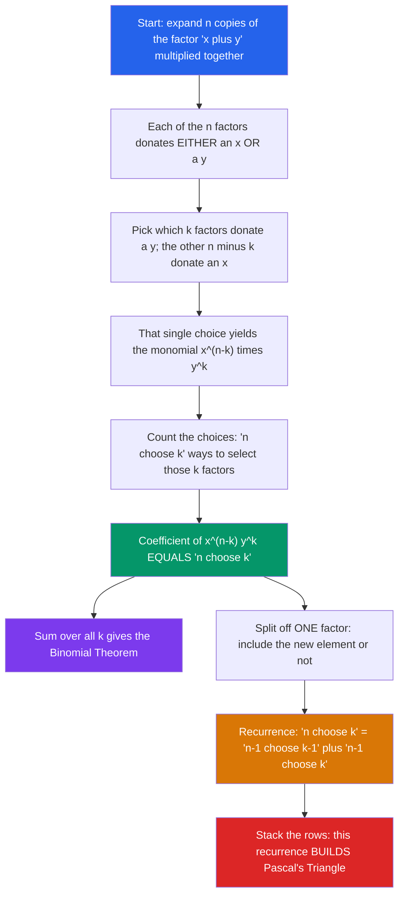

# 🔺 The Binomial Theorem and Coefficients

> [!abstract] TL;DR
> The binomial theorem says $(x+y)^n = \sum_{k=0}^{n} \binom{n}{k} x^{n-k} y^k$ — and its coefficients are *exactly* the counting numbers $\binom{n}{k}$, the entries of Pascal's triangle. Multiplying out a power is secretly a counting problem, which is why algebra, Pascal's recurrence, and combinatorial identities all describe the same object from different angles.

---

## Intuition

**Analogy:** Expand $(x+y)^4$ by brute force and watch a pattern crystallize out of the algebra:

$$(x+y)^4 = x^4 + 4x^3y + 6x^2y^2 + 4xy^3 + y^4$$

The coefficients are **1, 4, 6, 4, 1** — the *exact* same numbers as row 4 of Pascal's triangle, and the *exact* same numbers that count how many ways you can choose $k$ items out of 4. This is no coincidence. When you multiply $(x+y)(x+y)(x+y)(x+y)$, you form each product term by walking through the four factors and, from each one, grabbing either an $x$ or a $y$. The term $x^2y^2$ appears once for **every way to choose which 2 of the 4 factors donate their $y$** — and there are $\binom{4}{2}=6$ such ways.

So the binomial theorem is where two subjects turn out to be the same thing wearing two costumes: **expanding a product is counting subsets of factors**. The algebra never "computes" the coefficients so much as *tallies choices*, and that tally is the binomial coefficient.

---

## How It Works

### Core Mechanics

1. **Write the power as a product.** $(x+y)^n$ is $n$ identical factors of $(x+y)$ multiplied together.
2. **Every factor makes a binary choice.** To build one term of the expansion, each factor contributes *either* its $x$ *or* its $y$. There are $2^n$ such raw selections (foreshadowing $\sum_k \binom{n}{k} = 2^n$).
3. **Group by how many $y$'s you took.** If you take $y$ from exactly $k$ of the factors and $x$ from the other $n-k$, the product is $x^{n-k}y^k$.
4. **Count the groupings.** The number of ways to pick *which* $k$ factors donate a $y$ is $\binom{n}{k}$. That count *is* the coefficient. Hence

$$\boxed{(x+y)^n = \sum_{k=0}^{n} \binom{n}{k}\, x^{n-k} y^{k}}$$

5. **The recurrence falls out of one factor.** Split off the last $(x+y)$: a term $x^{n-k}y^k$ in $(x+y)^n$ is built either from an $x^{n-k}y^{k}$ in $(x+y)^{n-1}$ times the leftover $x$, or from an $x^{n-k}y^{k-1}$ times the leftover $y$. Counting both routes gives **Pascal's recurrence**:

$$\binom{n}{k} = \binom{n-1}{k-1} + \binom{n-1}{k}$$

This is a *combinatorial* proof — no factorials, just "does the new element get included or not?"

### Flow / Architecture



---

## Key Concepts

### Secondary (school algebra)
- **Binomial expansion:** $(x+y)^n$ expands into $n+1$ terms whose coefficients read off Pascal's triangle.
- **Pascal's triangle:** each entry is the sum of the two above it; edges are all $1$.
- **Binomial coefficient:** $\displaystyle\binom{n}{k} = \frac{n!}{k!\,(n-k)!}$ counts unordered selections of $k$ from $n$.
- **Signs in $(x-y)^n$:** replace $y$ with $-y$, so the term for $k$ carries $(-1)^k$: $(x-y)^n = \sum_k (-1)^k \binom{n}{k} x^{n-k} y^k$.

### Undergraduate (discrete math / analysis)
- **Combinatorial vs. algebraic proof.** The identity $\binom{n}{k} = \binom{n-1}{k-1} + \binom{n-1}{k}$ can be proven algebraically (add fractions) *or* combinatorially (condition on one element). Combinatorial "double-counting" proofs are often shorter and more illuminating.
- **Core identities:**
  - Symmetry: $\binom{n}{k} = \binom{n}{n-k}$.
  - Row sum: $\sum_{k=0}^{n}\binom{n}{k} = 2^n$ (set $x=y=1$).
  - Alternating sum: $\sum_{k=0}^{n}(-1)^k\binom{n}{k} = 0$ for $n\ge 1$ (set $x=1,y=-1$).
  - **Vandermonde:** $\sum_{k}\binom{m}{k}\binom{n}{p-k} = \binom{m+n}{p}$ (split a joint committee).
  - **Hockey-stick:** $\sum_{i=r}^{m}\binom{i}{r} = \binom{m+1}{r+1}$ (a diagonal sums to the entry below its end).
  - **Sum of squares:** $\sum_{k=0}^{n}\binom{n}{k}^2 = \binom{2n}{n}$ (Vandermonde with $m=n,\,p=n$).
- **Multinomial theorem (generalization):** for $m$ terms,
$$(x_1 + x_2 + \cdots + x_m)^n = \sum_{k_1 + \cdots + k_m = n} \binom{n}{k_1, k_2, \ldots, k_m}\, x_1^{k_1}\cdots x_m^{k_m}, \qquad \binom{n}{k_1,\ldots,k_m} = \frac{n!}{k_1!\cdots k_m!}.$$

### Graduate (generating functions & asymptotics)
- **Newton's generalized binomial.** For *any* real (or complex) exponent $\alpha$,
$$(1+x)^{\alpha} = \sum_{k=0}^{\infty} \binom{\alpha}{k} x^k, \qquad \binom{\alpha}{k} = \frac{\alpha(\alpha-1)\cdots(\alpha-k+1)}{k!},$$
a convergent power series for $|x|<1$. Negative and fractional exponents (e.g. $(1-x)^{-1}=\sum x^k$, $(1-4x)^{-1/2}=\sum \binom{2k}{k}x^k$) turn the binomial theorem into a **generating-function factory** — the gateway to encoding combinatorial sequences as coefficients.
- **de Moivre–Laplace / binomial → normal.** Normalizing row $n$ of Pascal's triangle gives $\text{Binomial}(n, \tfrac12)$; as $n\to\infty$ its shape converges to a Gaussian bell curve. More generally $\text{Binomial}(n,p) \approx \mathcal{N}\!\big(np,\; np(1-p)\big)$ — the historical seed of the central limit theorem.
- **Exact vs. approximate.** Binomial coefficients are exact integers with number-theoretic structure (Lucas' theorem, Kummer's theorem on prime powers dividing $\binom{n}{k}$), yet their *envelope* is smooth and analytic — the discrete and continuous shaking hands.

---

## Python Demo

```python
# Demonstrates: (a) build Pascal's triangle from the recurrence and verify it
# against the factorial formula, then verify the binomial theorem by polynomial
# expansion; (b) check the classic identities and watch normalized rows converge
# to a Gaussian (the binomial -> normal limit).
import numpy as np
import matplotlib.pyplot as plt
from math import comb

# ------------------------------------------------------------------
# (a) PASCAL'S TRIANGLE via C(n,k) = C(n-1,k-1) + C(n-1,k)
# ------------------------------------------------------------------
N = 12
pascal = [[1]]
for n in range(1, N + 1):
    prev = pascal[-1]
    row = [1] + [prev[k - 1] + prev[k] for k in range(1, n)] + [1]
    pascal.append(row)

# verify the recurrence-built triangle against the factorial formula
recurrence_ok = all(
    pascal[n][k] == comb(n, k) for n in range(N + 1) for k in range(n + 1)
)
print("Recurrence == factorial formula:", recurrence_ok)

# verify the BINOMIAL THEOREM by expanding (x+y)^n as a polynomial.
# Each multiply by (x+y) is a convolution of the coefficient list with [1, 1].
def expand_binomial(n):
    coeffs = [1]                                   # coeffs[k] = coeff of x^(n-k) y^k
    for _ in range(n):
        coeffs = [a + b for a, b in zip(coeffs + [0], [0] + coeffs)]
    return coeffs

for n in (4, 7, 10):
    coeffs = expand_binomial(n)
    assert coeffs == [comb(n, k) for k in range(n + 1)]     # coeffs ARE n-choose-k
    x, y = 2.0, 3.0                                          # numeric spot-check
    lhs = (x + y) ** n
    rhs = sum(comb(n, k) * x ** (n - k) * y ** k for k in range(n + 1))
    assert abs(lhs - rhs) < 1e-6
    print(f"(x+y)^{n}: coefficients = {coeffs}")

# ------------------------------------------------------------------
# (b) IDENTITIES  (all proven visually/numerically here)
# ------------------------------------------------------------------
for n in range(N + 1):
    assert sum(comb(n, k) for k in range(n + 1)) == 2 ** n                 # row sum = 2^n
    assert sum((-1) ** k * comb(n, k) for k in range(n + 1)) == (1 if n == 0 else 0)
    assert sum(comb(n, k) ** 2 for k in range(n + 1)) == comb(2 * n, n)    # squares = C(2n,n)
r, m = 3, 9
assert sum(comb(i, r) for i in range(r, m + 1)) == comb(m + 1, r + 1)      # hockey-stick
print("Row-sum=2^n, alternating-sum=0, squares=C(2n,n), hockey-stick: all verified")

# ------------------------------------------------------------------
# PLOTS: Pascal's-triangle heatmap + rows approaching a Gaussian
# ------------------------------------------------------------------
fig, (ax1, ax2) = plt.subplots(1, 2, figsize=(13, 5))

M = 20
tri = np.full((M + 1, M + 1), np.nan)
for n in range(M + 1):
    for k in range(n + 1):
        tri[n, k] = comb(n, k)
im = ax1.imshow(np.log10(tri + 1), origin="upper", cmap="viridis")
ax1.set(title="Pascal's Triangle  (log10 of C(n,k))", xlabel="k", ylabel="n")
fig.colorbar(im, ax=ax1, shrink=0.8, label="log10 C(n,k)")

# Normalized row n is Binomial(n, 1/2); standardize with mean n/2, std sqrt(n)/2.
for n in (4, 10, 30, 80):
    ks = np.arange(n + 1)
    probs = np.array([comb(n, k) for k in ks], dtype=float) / 2.0 ** n
    std = np.sqrt(n) / 2.0
    z = (ks - n / 2.0) / std
    ax2.plot(z, probs * std, marker="o", ms=3, lw=1, label=f"n={n}")
zz = np.linspace(-4, 4, 200)
ax2.plot(zz, np.exp(-zz ** 2 / 2) / np.sqrt(2 * np.pi), "k--", lw=2, label="N(0,1)")
ax2.set(title="Normalized Pascal rows -> Gaussian (de Moivre-Laplace)",
        xlabel="standardized k", ylabel="scaled probability")
ax2.legend()

plt.tight_layout()
plt.savefig("binomial_pascal.png", dpi=120)
print("Saved binomial_pascal.png")
```

Running it prints `Recurrence == factorial formula: True`, lists each expansion (`(x+y)^4: coefficients = [1, 4, 6, 4, 1]`), confirms every identity, and saves a figure: a log-scaled Pascal heatmap on the left and, on the right, the normalized rows visibly tightening onto the standard-normal curve as $n$ grows.

---

## Real-World Applications

> **Example — the binomial distribution.** Flip a biased coin $n$ times; the probability of exactly $k$ heads is $\binom{n}{k}p^k(1-p)^{n-k}$. The binomial coefficient is *literally* counting which of the $n$ trials came up heads, and $\sum_k$ of those probabilities equals $\big(p+(1-p)\big)^n = 1$ by the binomial theorem — a self-normalizing distribution that underpins A/B testing, quality control, and epidemiological modeling.

- **Fast modular exponentiation and hashing** rely on the same "choose from $n$ factors" structure that generates coefficients; Lucas' theorem computes $\binom{n}{k} \bmod p$ digit-by-digit.
- **Numerical analysis:** finite-difference operators and Newton's forward-difference interpolation formula are built from binomial coefficients; $(1+x)^{-1/2}$ and $(1+x)^{1/2}$ expansions give fast square-root and inverse-square-root series.
- **Physics and finance:** the binomial options-pricing model builds a lattice whose node probabilities are binomial coefficients; in statistical mechanics, $\binom{N}{k}$ counts microstates and its logarithm (via Stirling) yields entropy.
- **Error-correcting codes:** the number of binary strings within Hamming distance $r$ of a codeword is $\sum_{i=0}^{r}\binom{n}{i}$ — a hockey-stick-flavored sphere count that bounds code rates.

---

## Common Pitfalls

- **Sign errors in $(x-y)^n$.** The expansion is $\sum_k (-1)^k \binom{n}{k} x^{n-k} y^k$ — the sign *alternates* per term. Forgetting that $(x-y)^n$ carries $(-1)^k$ (not a global minus) is the single most common expansion mistake. Sanity check: $(x-y)^2 = x^2 - 2xy + y^2$.
- **Index bounds and which power goes where.** The sum runs $k=0$ to $n$ (that is $n+1$ terms, not $n$). Be consistent about whether it's $x^{n-k}y^k$ or $x^k y^{n-k}$; both are valid but mixing them mid-derivation scrambles coefficients. The exponents in each term must always sum to $n$.
- **Confusing the binomial *coefficient* with the binomial *distribution*.** $\binom{n}{k}$ is a pure count (an integer $\ge 1$); $\binom{n}{k}p^k(1-p)^{n-k}$ is a probability in $[0,1]$. The coefficient is one *factor* of the distribution, not the distribution itself.
- **Generalized / negative / fractional exponents.** For non–non-negative-integer $\alpha$, $(1+x)^{\alpha}$ is an *infinite* power series that only converges for $|x|<1$; it does **not** terminate and $\binom{\alpha}{k}$ uses the *falling-factorial* definition, not $\frac{\alpha!}{k!(\alpha-k)!}$ (there is no $\alpha!$ for fractional $\alpha$). Treating it like a finite polynomial gives nonsense.
- **Off-by-one in Pascal's recurrence at the edges.** $\binom{n}{0}=\binom{n}{n}=1$ are base cases; blindly applying $\binom{n-1}{k-1}+\binom{n-1}{k}$ without guarding $k<0$ or $k>n-1$ overruns the row. Define out-of-range coefficients as $0$.

---

## Related Concepts

- [[Combinatorics]] — parent toolkit; $\binom{n}{k}$ counts unordered selections, the foundation the binomial theorem is built on.
- [[Generating_Functions_and_Recurrences]] — the generalized binomial $(1+x)^\alpha=\sum\binom{\alpha}{k}x^k$ is the prototypical generating function; Pascal's recurrence is a two-index recurrence.
- [[Common_Probability_Distributions]] — the binomial distribution $\binom{n}{k}p^k(1-p)^{n-k}$ is the coefficient dressed as a probability; its normal limit is de Moivre–Laplace.
- [[Random_Variables]] — a $\text{Binomial}(n,p)$ variable is a sum of $n$ Bernoulli trials whose mass function carries $\binom{n}{k}$.
- [[Probability_Theory]] — the binomial → normal convergence is the historical seed of the central limit theorem.
- [[Sequences_and_Series]] — Newton's binomial series is a power (Taylor) series; convergence for $|x|<1$ is a series-analysis question.
- [[Polynomial_Rings_and_Factorization]] — the binomial theorem is the expansion law for powers of a linear polynomial in a commutative ring; the freshman's-dream $(x+y)^p \equiv x^p+y^p$ in characteristic $p$ comes from divisibility of $\binom{p}{k}$.

*Sibling notes in this vault (planned): Permutations_and_Combinations (where $\binom{n}{k}$ is first defined), Bijective_Proofs_and_Combinatorial_Identities (double-counting proofs of these identities), Generating_Functions (where the generalized binomial becomes a workhorse), and the Combinatorics_Overview map.*

---

## Review Questions

1. **(Secondary)** Expand $(2a - 3b)^3$ fully using the binomial theorem, being careful with the alternating signs. What are the four coefficients, and why do they *not* read $1, 3, 3, 1$?
2. **(Undergraduate)** Give a purely *combinatorial* (double-counting) proof that $\sum_{k=0}^{n}\binom{n}{k}^2 = \binom{2n}{n}$. Hint: count the ways to choose $n$ people from a group of $n$ men and $n$ women, splitting on how many are men.
3. **(Graduate)** Newton's series gives $(1-4x)^{-1/2} = \sum_{k\ge 0}\binom{2k}{k}x^k$. Explain how this connects the generalized binomial theorem to generating functions, and use it to argue why the central binomial coefficients $\binom{2k}{k}$ grow like $4^k/\sqrt{\pi k}$ — tying the algebra back to the Gaussian envelope of Pascal's triangle.

---

## Sources

- Graham, Knuth & Patashnik, *Concrete Mathematics*, Ch. 5 (Binomial Coefficients).
- Brualdi, *Introductory Combinatorics*, Ch. 5.
- Rosen, *Discrete Mathematics and Its Applications*, Ch. 6.4 (Binomial Coefficients and Identities).
- Stanley, *Enumerative Combinatorics*, Vol. 1, Ch. 1.
- Wilf, *generatingfunctionology* — for the generalized binomial as a generating function.

---

#combinatorics #binomial-theorem #pascals-triangle #binomial-coefficients #identities
