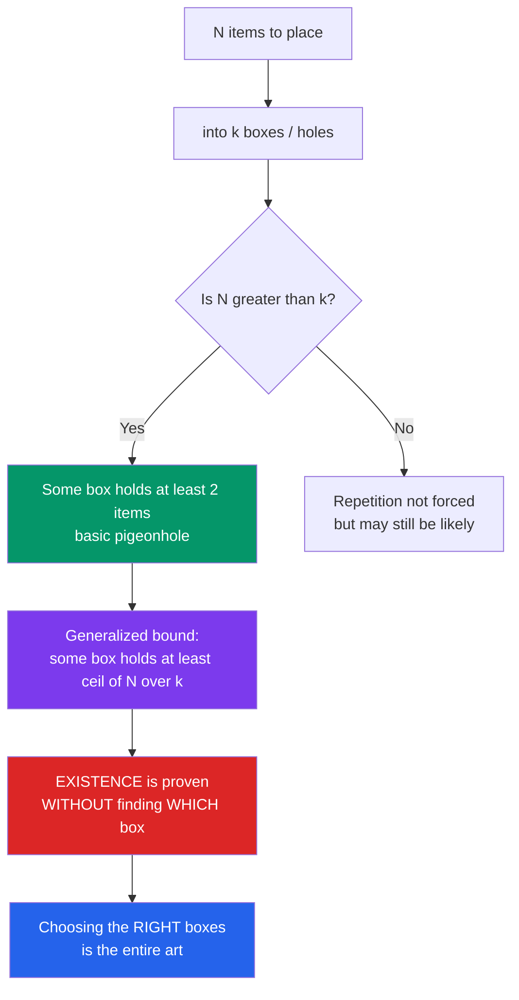

# 🕳️ The Pigeonhole Principle

> [!abstract] TL;DR
> If you put more objects into fewer boxes, some box must hold at least two — a fact so obvious it feels like a joke, yet it is one of mathematics' sharpest tools for **proving that something must exist without ever constructing it**. Its power comes from the *art* of choosing what the "pigeons" and "holes" secretly are.

---

## Intuition

**Analogy:** Take 10 pigeons and 9 boxes. However cleverly you arrange them, some box ends up with at least two pigeons. You do not need to know *which* box, or *how* the pigeons distributed themselves — the mere fact that there are more pigeons than boxes makes a double *unavoidable*.

This childishly obvious observation is a proof machine. It never tells you *where* the collision is; it only guarantees, with ironclad certainty, that one exists. That is exactly what makes it so useful: from "two people in London have the same number of hairs on their head," to "some two of these integers share a remainder," to deep theorems in number theory and geometry, the pigeonhole principle converts the plain statement *there are more things than slots* into a rigorous existence proof. It is the humblest member of the family of **non-constructive** arguments that also includes the probabilistic method and, at its most powerful, Ramsey theory.

---

## How It Works

### Core Mechanics

1. **Basic form.** If $n+1$ objects are placed into $n$ boxes, then at least one box contains **two or more** objects. Contrapositive of the obvious: if *every* box held at most one, you could account for at most $n$ objects — contradicting that there are $n+1$.
2. **Generalized form.** If $N$ objects are placed into $k$ boxes, then some box contains at least
   $$\left\lceil \frac{N}{k} \right\rceil \text{ objects.}$$
   (If every box held fewer than $\lceil N/k\rceil$, i.e. at most $\lceil N/k\rceil - 1$, the total would be strictly less than $N$.) The basic form is the case $N=n+1,\ k=n$, giving $\lceil (n+1)/n\rceil = 2$.
3. **The whole art is the encoding.** The principle is trivial; *the difficulty is deciding what the boxes are.* You design a function from a set of "pigeons" to a set of "holes" so that two pigeons landing in the same hole is exactly the conclusion you want (same remainder, same parity, close together, same colour…). Choosing that map cleverly is where all the mathematics lives.
4. **Non-constructive by nature.** The argument proves *existence*, not *location*. It says a repeated pigeon exists but gives no algorithm to find it faster than searching. This is a feature (short, clean proofs) and a limitation (no witness).
5. **Infinite version.** If infinitely many objects are placed into finitely many boxes, some box contains **infinitely many** objects. This drives compactness-style arguments (e.g. extracting monochromatic infinite subsequences).

### Flow / Architecture



---

## Key Concepts

### Secondary (school level)
- **Basic principle:** more items than boxes $\Rightarrow$ some box repeats. State it in words and apply to socks, months, days.
- **Haircount classic:** a human head has at most $\sim 150{,}000$ hairs, but London has $\sim 9$ million people; with more people than possible hair counts, at least two Londoners have *exactly* the same number of hairs.
- **Same-birth-month:** any 13 people $\Rightarrow$ two share a birth month (13 pigeons, 12 holes).

### Undergraduate
- **Generalized pigeonhole:** $N$ into $k$ forces a box with $\lceil N/k\rceil$. Among 100 people, some month holds at least $\lceil 100/12\rceil = 9$ birthdays.
- **Remainders and divisibility:** among any $n+1$ integers, two are congruent mod $n$ (their difference is divisible by $n$). Holes = residue classes $\{0,1,\dots,n-1\}$.
- **Coprime / consecutive pairs in $\{1,\dots,2n\}$:** choose any $n+1$ of them; pairing $\{1,2\},\{3,4\},\dots,\{2n-1,2n\}$ gives $n$ holes, so two chosen numbers are *consecutive* $\Rightarrow$ coprime.
- **Divisor pairs in $\{1,\dots,2n\}$:** write each chosen number as $2^a\cdot m$ with $m$ odd. There are only $n$ odd values in $\{1,\dots,2n\}$; with $n+1$ numbers, two share the same odd part $m$ $\Rightarrow$ one divides the other (Erdős).
- **Geometry:** among any 5 points in a unit square, two are within $\frac{\sqrt2}{2}$ of each other (cut the square into four sub-squares — the holes).

### Graduate
- **Erdős–Szekeres:** any sequence of $n^2+1$ distinct reals contains a monotone subsequence of length $n+1$. Assign each term the pair (longest increasing run ending here, longest decreasing run ending here); if all runs were $\le n$, only $n^2$ label-pairs exist for $n^2+1$ terms — pigeonhole forces a repeat, contradicting distinctness.
- **Dirichlet's approximation theorem:** for any real $\alpha$ and integer $Q$, there is a rational $p/q$ with $1\le q\le Q$ and $\left|\alpha - \frac{p}{q}\right| < \frac{1}{qQ}$. Holes = the $Q$ subintervals of $[0,1)$; pigeons = the fractional parts $\{q\alpha\}$ for $q=0,\dots,Q$. This is the historical birth of the principle as *Dirichlet's box argument* in number theory.
- **Ramsey theory (the ultimate generalization):** the pigeonhole principle is Ramsey's theorem for one colour class / $r=2$ in disguise — "colour enough objects and a large monochromatic structure is forced." $R(3,3)=6$ says any 2-colouring of $K_6$ has a monochromatic triangle; the proof *starts* by pigeonholing the 5 edges at a vertex into 2 colours.
- **The probabilistic method:** a sibling non-constructive tool — instead of "more pigeons than holes," it argues "the expected/average object has the property, so some object does." Both prove existence without exhibiting a witness.

---

## Python Demo

```python
# Two faces of the pigeonhole principle:
#   (a) collisions: as items n approach/exceed boxes k, a collision goes from
#       "likely" (birthday paradox) to GUARANTEED (n > k => probability exactly 1).
#   (b) a concrete guarantee: among any n+1 numbers from {1..2n}, two exist where
#       one divides the other -- verified to hold in 100% of random trials, while
#       choosing only n numbers can (and does) fail.
import numpy as np
import matplotlib.pyplot as plt

rng = np.random.default_rng(42)

# ---------- (a) collision probability vs number of items -------------------
k = 30                       # number of boxes / holes
ns = np.arange(1, 41)        # number of items placed

def analytic_collision_prob(n, k):
    if n > k:                # pigeonhole: more items than boxes => certain
        return 1.0
    idx = np.arange(n)
    return 1.0 - np.prod((k - idx) / k)   # 1 - P(all distinct)

analytic = np.array([analytic_collision_prob(n, k) for n in ns])

trials = 4000                # Monte-Carlo estimate of the same probability
empirical = []
for n in ns:
    draws = rng.integers(0, k, size=(trials, n))
    has_col = np.array([len(np.unique(row)) < n for row in draws])
    empirical.append(has_col.mean())
empirical = np.array(empirical)

cross = ns[np.argmax(analytic >= 0.5)]    # first n with >= 50% collision

# ---------- (b) guaranteed divisor pair among n+1 numbers from {1..2n} ------
def has_divisor_pair(subset):
    s = sorted(int(x) for x in subset)
    for i in range(len(s)):
        for j in range(i + 1, len(s)):
            if s[j] % s[i] == 0:
                return True
    return False

n = 20                                   # universe {1..40}
universe = np.arange(1, 2 * n + 1)
T = 10000
guaranteed = sum(has_divisor_pair(rng.choice(universe, size=n + 1, replace=False))
                 for _ in range(T))       # choose n+1 -> theory says ALWAYS
control    = sum(has_divisor_pair(rng.choice(universe, size=n,     replace=False))
                 for _ in range(T))       # choose n   -> not guaranteed

print(f"(n+1)={n+1} numbers: divisor pair in {guaranteed}/{T} trials "
      f"({guaranteed/T:.3f})")
print(f"    n ={n}   numbers: divisor pair in {control}/{T} trials "
      f"({control/T:.3f})")

# ---------- plot -----------------------------------------------------------
fig, ax = plt.subplots(1, 2, figsize=(13, 5))

ax[0].plot(ns, analytic, color="#2563eb", lw=2, label="analytic P(collision)")
ax[0].scatter(ns[::2], empirical[::2], s=20, color="#dc2626",
              zorder=3, label="Monte Carlo")
ax[0].axvline(k + 1, color="#059669", ls="--",
              label=f"n={k+1} > k: pigeonhole forces P=1")
ax[0].axhline(0.5, color="gray", ls=":")
ax[0].scatter([cross], [analytic[cross-1]], color="black", zorder=4)
ax[0].annotate(f"50% at n={cross}", (cross, 0.5),
               textcoords="offset points", xytext=(8, -22))
ax[0].set_xlabel("number of items n"); ax[0].set_ylabel("P(at least one collision)")
ax[0].set_title(f"Collision probability, k={k} boxes\nn>k => certainty (pigeonhole)")
ax[0].legend(); ax[0].grid(alpha=0.3)

labels = [f"choose n+1={n+1}\n(guaranteed)", f"choose n={n}\n(not guaranteed)"]
rates = [guaranteed / T, control / T]
bars = ax[1].bar(labels, rates, color=["#059669", "#d97706"])
for b, r in zip(bars, rates):
    ax[1].text(b.get_x() + b.get_width() / 2, r + 0.01, f"{r:.3f}", ha="center")
ax[1].axhline(1.0, color="#059669", ls="--", alpha=0.6)
ax[1].set_ylim(0, 1.12); ax[1].set_ylabel("fraction of trials with a divisor pair")
ax[1].set_title(f"Among n+1 numbers from {{1..{2*n}}},\ntwo always have one dividing the other")

plt.tight_layout()
plt.savefig("pigeonhole_demo.png", dpi=120)
plt.show()
```

Running it prints the guaranteed case at exactly `1.000` (every single trial contains a divisor pair, as the odd-part pigeonhole promises) while the control at $n$ numbers dips below 1 — and the left panel shows the collision probability sweeping smoothly up through the birthday-paradox 50% mark and then snapping to a hard **1.0** the instant $n$ exceeds $k$.

---

## Real-World Applications

> **Example:** **Hash tables.** A hash function maps a huge key space into a finite array of $k$ buckets. With more than $k$ keys, the pigeonhole principle *guarantees* a collision — no hash function can avoid it. This is precisely why every practical hash table ships with a collision-resolution strategy (chaining, open addressing). See [[Collision_Resolution]] and [[Hash_Table_Fundamentals]].

- **Lossless compression limits:** no algorithm can compress *every* input by at least one bit. The $2^n$ strings of length $n$ can map into only $2^n - 1$ shorter strings — pigeonhole forces two inputs to collide, breaking invertibility. This underlies the counting proof that "perfect universal compression" is impossible.
- **Cryptographic hash collisions:** a fixed-length digest (e.g. 256 bits) has finitely many outputs but infinitely many inputs, so collisions *must* exist; security rests on their being computationally *hard to find*, not nonexistent.
- **Fingerprint / birthday attacks:** the same collision math ($n$ items into $k$ slots) tells an attacker how many random tries make a hash collision *likely*, not just possible — the $\sqrt{k}$ birthday bound.
- **Scheduling & resource contention:** more tasks than CPU cores, or more flows than queues, guarantees at least one core/queue is doubly loaded — capacity planning is applied generalized pigeonhole ($\lceil N/k\rceil$).
- **Number theory & approximation:** Dirichlet's theorem (above) — the basis of continued-fraction approximation and results on how well irrationals can be approximated by rationals.

---

## Common Pitfalls

- **Choosing the wrong pigeons and holes.** The principle is trivial; the *encoding* is everything. If your boxes don't force the property you want when two pigeons collide, the argument proves nothing. Time spent on a pigeonhole problem is time spent designing the map — e.g. "residue classes," "odd parts," "sub-squares," not the counting itself.
- **Expecting a location, not just existence.** The principle is **non-constructive**: it certifies a repeat exists but never says *which* box or gives an efficient way to find it. Do not read "a collision exists" as "here is the collision."
- **Fumbling the ceiling in the generalized form.** $N$ objects in $k$ boxes forces $\lceil N/k\rceil$, *not* $N/k$ rounded down or "about $N/k$." With $N=100,\ k=12$ the bound is $\lceil 100/12\rceil = 9$, not 8. Off-by-one here silently weakens or breaks the claim.
- **Confusing "possible" with "certain."** Below $N=k+1$ a collision is merely *likely* (birthday paradox), not forced; at $N=k+1$ it becomes *unavoidable*. Mixing up the probabilistic regime with the guaranteed regime is the most common conceptual slip.
- **Miscounting the box set.** "Any 13 people share a birth *month*" needs 12 holes; using 365 (days) instead of 12 (months), or forgetting a class like residue 0, changes the threshold and invalidates the proof.

---

## Related Concepts

- [[Combinatorics]] — the pigeonhole principle is one of the three pillars of elementary counting alongside binomial coefficients and inclusion–exclusion.
- [[Number_Theory_Elementary]] — supplies the classic pigeons and holes: residue classes, divisibility, and Dirichlet's rational-approximation theorem.
- [[Mathematical_Proof_Strategies]] — pigeonhole is the archetypal *non-constructive existence* proof, a cousin of proof by contradiction.
- [[Set_Theory_and_Relations]] — formally, no injection exists from a larger finite set into a smaller one; that is the pigeonhole principle restated.
- [[Probability_Theory]] — the birthday-paradox collision curve quantifies *how likely* a collision is *before* pigeonhole makes it certain.
- [[Collision_Resolution]] — hash tables must resolve the collisions the pigeonhole principle guarantees.
- [[Hash_Table_Fundamentals]] — mapping many keys into few buckets is pigeonhole in production code.

*Siblings to be written in this vault (prose references):* **Ramsey Theory** (the ultimate generalization — "order forced in disorder"), **The Probabilistic Method** (existence via averaging), **Inclusion–Exclusion Principle** (its counting counterpart), and the **Combinatorics Overview**.

---

## Review Questions

1. **(Secondary)** A drawer holds 8 black and 8 white socks in the dark. What is the smallest number you must pull out to be *certain* of a matching pair, and why does the answer not depend on how many socks of each colour there are?
2. **(Undergraduate)** Prove that among any $n+1$ integers chosen from $\{1,2,\dots,2n\}$, there exist two such that one divides the other. Identify explicitly what the "pigeons" and the "holes" are — this identification *is* the proof.
3. **(Graduate)** Given the sequence-labelling idea behind Erdős–Szekeres, explain why any sequence of $n^2+1$ distinct reals must contain a monotone subsequence of length $n+1$, and describe how the *same* pigeonhole reflex reappears at the first step of proving $R(3,3)=6$ in Ramsey theory.

---

## Sources

- Brualdi, *Introductory Combinatorics*, Ch. 3 (The Pigeonhole Principle).
- van Lint & Wilson, *A Course in Combinatorics*, Ch. on Ramsey theory and pigeonhole.
- Aigner & Ziegler, *Proofs from THE BOOK* — pigeonhole and Erdős–Szekeres chapters.
- Engel, *Problem-Solving Strategies*, Ch. 4 (The Box Principle).
- Rosen, *Discrete Mathematics and Its Applications*, §6.2 (Pigeonhole Principle).

---

#combinatorics #pigeonhole-principle #existence #proofs #ramsey
