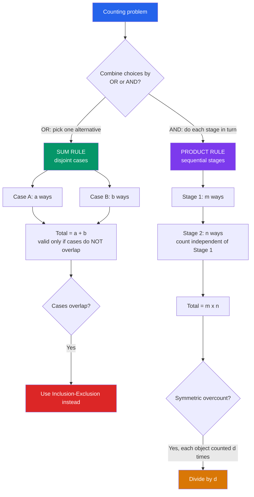

# 🧮 The Sum and Product Rules

> [!abstract] TL;DR
> The **sum rule** adds the sizes of *disjoint* alternatives ("either A or B"), and the **product rule** multiplies the number of choices at each *independent* sequential stage ("A and then B"). Every counting formula in combinatorics — permutations, combinations, the size of a power set — is just these two ideas chained together.

---

## Intuition

**Analogy — ordering lunch.** Suppose the menu offers 3 mains *or* 2 salads, and you must pick exactly **one item total**. You have `3 + 2 = 5` choices — that is the **sum rule** for mutually exclusive "either/or" options. Now suppose instead you build a meal from 3 mains **and** 2 drinks, taking one of each. You have `3 × 2 = 6` distinct meals — that is the **product rule** for sequential "and-then" choices.

That is genuinely the whole foundation. **Add independent alternatives; multiply sequential independent choices.** Master these two dead-simple moves and you can count almost anything — the rest of combinatorics (permutations, combinations, the pigeonhole principle, inclusion–exclusion) is just clever bookkeeping built on top of them. This note is the entry point to the broader `Combinatorics_Overview`; the sum and product rules are the atoms that `Permutations_and_Combinations` assembles into formulas.

---

## How It Works

### Core Mechanics

**Sum rule (addition / rule of sum).** If a task can be accomplished by one of two *methods*, where method A has `a` outcomes and method B has `b` outcomes, and **no outcome belongs to both methods**, then the task has `a + b` outcomes. In set language: if `A` and `B` are **disjoint** (`A ∩ B = ∅`), then `|A ∪ B| = |A| + |B|`. Generalizes to any finite family of pairwise-disjoint sets: `|A₁ ∪ … ∪ Aₙ| = |A₁| + … + |Aₙ|`. **Disjointness is the load-bearing hypothesis** — if the cases overlap, plain addition double-counts the overlap and you must fall back on `Inclusion_Exclusion_Principle`.

**Product rule (multiplication / rule of product).** If a procedure is a sequence of `k` stages, and stage `i` can be completed in `nᵢ` ways **regardless of how earlier stages were completed**, then the whole procedure can be completed in `n₁ × n₂ × … × nₖ` ways. In set language this counts a **Cartesian product**: `|A × B| = |A| · |B|`. **Independence of the branching count is the load-bearing hypothesis** — the *number* of options at each stage must not change based on earlier choices (the specific options may change, but not how many).

**Two derived rules that follow immediately:**

- **Subtraction rule (complementary counting).** To count a set `S`, count a larger universe `U` and subtract the unwanted part: `|S| = |U| − |Sᶜ|`. This is the sum rule rearranged for `U = S ∪ Sᶜ`. Often it is far easier to count the complement (e.g. "at least one" = total − "none").
- **Division rule (correcting symmetric overcount).** If a construction counts every target object exactly `d` times, the true count is `(product-rule count) / d`. Arranging `n` people around a round table gives `n! / n` because each seating is counted once per rotation. This is the seed of the combination formula.

**The bijection / counting-two-ways principle.** If you build a bijection between set `A` and set `B`, then `|A| = |B|` — so you may count whichever side is easier. Counting one quantity two different ways and equating the results proves identities for free. Example: subsets of an `n`-element set correspond bijectively to length-`n` binary strings (include/exclude each element), so there are `2ⁿ` subsets by the product rule — `2 × 2 × … × 2`.

### Flow / Architecture



---

## Key Concepts

### Secondary (intuitive level)
- **Sum rule = "OR" = add.** Counting the ways to do *one* thing chosen from separate non-overlapping piles.
- **Product rule = "AND" = multiply.** Counting the ways to make a sequence of choices, one after another.
- **Menu / outfit intuition.** 3 shirts and 2 pants → `3 × 2 = 6` outfits; 3 mains or 2 salads → `5` single dishes.

### Undergraduate (formal level)
- **Set formulation.** Sum rule ⇔ `|A ∪ B| = |A| + |B|` for disjoint `A, B`. Product rule ⇔ `|A × B| = |A|·|B|` for the Cartesian product.
- **Counting functions and strings.** The number of functions from an `m`-set to an `n`-set is `nᵐ` (each of `m` inputs independently maps to one of `n` outputs — product rule). Strings of length `L` over an alphabet of size `k` number `kᴸ`.
- **Counting subsets.** A power set has `2ⁿ` elements (product of `n` independent include/exclude decisions).
- **Subtraction rule** for complementary counting and the **division rule** for symmetric overcounting; these produce `P(n,r)` and `C(n,r)` when combined, the bridge to `Permutations_and_Combinations`.
- **When they fail:** overlapping cases require the `Inclusion_Exclusion_Principle`; stage counts that depend on earlier choices break the naive product rule (use a *sum over cases* or a decision tree instead).

### Graduate (structural level)
- **Bijective proofs / double counting.** Establishing `|A| = |B|` via an explicit bijection, or evaluating one quantity two ways, proves combinatorial identities (e.g. Pascal's rule, the hockey-stick identity) without algebra.
- **Generalized product rule.** Even when later stages *depend* on earlier ones, if the *number* of options is constant across all branches (e.g. permutations: `n`, then `n−1`, then `n−2`, …) the product still applies — the tree is not "square" but every node at a level has the same out-degree.
- **Categorical / algebraic view.** Sum ↔ disjoint union (coproduct) and product ↔ Cartesian product (product) are the two monoidal operations on finite sets; cardinality is a semiring homomorphism `(FinSet, ⊔, ×) → (ℕ, +, ×)`. This is exactly why generating functions and the "sum/product" of species work.
- **Probabilistic shadow.** In a product sample space of independent experiments, `P(A ∩ B) = P(A)·P(B)` mirrors the product rule, and the sum rule mirrors additivity over disjoint events — see `Probability_Theory`.

---

## Python Demo

```python
# Demonstrates the PRODUCT rule (multiply sequential independent choices)
# and the SUM rule (add disjoint alternatives), verifies both by brute-force
# enumeration, and visualizes the counting as a tree whose leaves = the product.
import numpy as np
import matplotlib.pyplot as plt
from itertools import product

# ---- A small configuration problem: build a meal = main AND side AND drink ----
stages = {
    "main":  ["burger", "salad", "pasta"],  # 3 options
    "side":  ["fries", "soup"],             # 2 options
    "drink": ["cola", "water"],             # 2 options
}
branchings = [len(v) for v in stages.values()]        # [3, 2, 2]

# ---- PRODUCT RULE: total meals = product of the per-stage branching counts ----
product_rule_count = int(np.prod(branchings))
print("Product rule:", branchings, "->", product_rule_count, "meals")

# ---- VERIFY by brute-force enumeration of the Cartesian product ----
all_meals = list(product(*stages.values()))
print("Brute-force enumeration:", len(all_meals), "meals")
assert len(all_meals) == product_rule_count           # they must match

# ---- SUM RULE: a DISJOINT union of cases (order exactly one item) ----
drinks = ["cola", "water", "juice"]   # menu A: 3 options
snacks = ["chips", "nuts"]            # menu B: 2 options
sum_rule_count = len(drinks) + len(snacks)            # 3 + 2 = 5
either_menu = [("drink", d) for d in drinks] + [("snack", s) for s in snacks]
print("Sum rule:", len(drinks), "+", len(snacks), "->", sum_rule_count)
assert len(either_menu) == sum_rule_count             # disjoint => just add

# Nodes per tree level = running product of branchings: [1, 3, 6, 12]
levels = [1]
for b in branchings:
    levels.append(levels[-1] * b)

# ---------------------------- VISUALIZATION ----------------------------
fig, (ax1, ax2) = plt.subplots(1, 2, figsize=(13, 5.5))

# (1) The counting tree: each level multiplies the number of partial configs
positions = [np.linspace(0, 1, n + 2)[1:-1] for n in levels]  # even x per level
colors = ["#2563eb", "#059669", "#7c3aed", "#dc2626"]

for L, b in enumerate(branchings):                     # draw edges parent->child
    parent_xs, child_xs = positions[L], positions[L + 1]
    for pi, px in enumerate(parent_xs):
        for c in range(b):
            cx = child_xs[pi * b + c]
            ax1.plot([px, cx], [-L, -(L + 1)], color="#94a3b8", lw=1, zorder=1)

for L, xs in enumerate(positions):                     # draw nodes + level labels
    ax1.scatter(xs, [-L] * len(xs), s=110, color=colors[L % len(colors)], zorder=2)
    label = "root" if L == 0 else list(stages.keys())[L - 1]
    ax1.text(-0.05, -L, f"{label}: {levels[L]}", ha="right", va="center", fontsize=9)

ax1.set_title("Counting tree: leaves = 3 x 2 x 2 = 12  (product rule)")
ax1.set_xlim(-0.25, 1.05)
ax1.axis("off")

# (2) Bar chart: each stage MULTIPLIES the running count
ax2.bar(range(len(levels)), levels, color="#0ea5e9")
for i, v in enumerate(levels):
    ax2.text(i, v + 0.25, str(v), ha="center", fontsize=11)
ax2.set_xlabel("Tree level / stage")
ax2.set_ylabel("Number of partial configurations")
ax2.set_title("Product rule growth:  x3 then x2 then x2")
ax2.set_xticks(range(len(levels)))
ax2.set_ylim(0, max(levels) + 2)

plt.tight_layout()
plt.savefig("sum_product_rules.png", dpi=120)
plt.show()
```

Running it prints matching counts for both rules (`12` meals by product and enumeration, `5` items by sum and enumeration) and renders the counting tree beside a bar chart showing how each stage multiplies the running total `1 → 3 → 6 → 12`.

---

## Real-World Applications

> **Example — password / key strength.** An 8-character password over the 62 alphanumerics has `62⁸ ≈ 2.18 × 10¹⁴` possibilities by the pure product rule (`62` independent choices per position). Doubling the alphabet or adding one character multiplies the keyspace, which is exactly why entropy is measured in `log₂` of a product. Cryptographic key-length arguments are the product rule at industrial scale.

- **License plates.** A format of 3 letters followed by 3 digits yields `26³ × 10³ = 17,576,000` plates — product rule across positions, and jurisdictions add capacity by adding a character (another factor).
- **IP addressing.** IPv4 has `2³²` addresses and IPv6 has `2¹²⁸`, each a product over independent bits — the sum/product framework explains address-space exhaustion.
- **Test / configuration explosion.** A feature with 4 independent boolean flags has `2⁴ = 16` states; combinatorial test design fights this product-rule blowup with pairwise coverage.
- **Recursion and enumeration.** The size of a backtracking search tree is a product of branching factors per level — see `Backtracking`; counting leaves of the recursion tree *is* the product rule.
- **Probability sample spaces.** Rolling two dice yields `6 × 6 = 36` equally likely outcomes (product), and "sum is 7 or 11" partitions into disjoint favorable cases (sum rule) — foundational to `Probability_Theory`.

---

## Common Pitfalls

- **Overlapping cases → double counting.** The sum rule requires *disjoint* cases. Counting integers in `1..100` divisible by 2 or 3 as `50 + 33 = 83` is wrong; you double-count multiples of 6. Subtract the overlap (`50 + 33 − 16 = 67`) — this is the `Inclusion_Exclusion_Principle` correcting a broken sum rule.
- **Dependent choices break the product rule.** The product rule needs the *number* of options at each stage to be independent of earlier choices. "Pick 2 distinct people from 5, order matters" is not `5 × 5`; the second stage has only 4 options, giving `5 × 4`. If the count varies across branches, split into disjoint cases (sum over branches) or draw the tree.
- **Ordered vs. unordered (over/undercounting by symmetry).** The product rule naturally counts *ordered* sequences. Selecting an unordered pair `{A, B}` as `n × (n−1)` counts each pair twice (`AB` and `BA`); divide by `2` (division rule). Forgetting this symmetry factor is the single most common combinatorics error, and it is exactly what separates `P(n,r)` from `C(n,r)`.
- **Mixing "and" with "or" carelessly.** Natural-language "and/or" does not map cleanly to `×/+`. Translate to sets first: *sequential construction* → product; *mutually exclusive alternatives* → sum. When in doubt, decompose into a decision tree.
- **Empty-choice and off-by-one traps.** A stage with `0` options makes the whole product `0` (the procedure is impossible), and including/excluding the empty selection shifts subset counts between `2ⁿ` and `2ⁿ − 1`.

---

## Related Concepts

- [[Mathematics/04_Discrete_Mathematics/Combinatorics|Combinatorics]] — the parent field; permutations, combinations, and binomial coefficients are all built by chaining the sum and product rules.
- [[Mathematics/04_Discrete_Mathematics/Set_Theory_and_Relations|Set Theory and Relations]] — the rules are cardinality statements about disjoint unions (`∪`) and Cartesian products (`×`).
- [[Mathematics/04_Discrete_Mathematics/Logic_and_Proof_Techniques|Logic and Proof Techniques]] — "or"/"and" case analysis and bijective/double-counting proofs formalize why the rules are valid.
- [[Mathematics/06_Probability_and_Statistics/Probability_Theory|Probability Theory]] — additivity over disjoint events mirrors the sum rule; independence-multiplication mirrors the product rule.
- [[DSA/09_Recursion_Backtracking/Backtracking|Backtracking]] — the size of a search/recursion tree is the product of per-level branching factors.
- [[DSA/05_Trees/Tree_Traversals|Tree Traversals]] — the counting-tree model here is the same rooted-tree structure that traversal algorithms walk.

---

## Review Questions

1. **(Secondary)** A café lets you order one drink *or* one pastry; there are 4 drinks and 6 pastries. How many single-item orders are possible, and which rule did you use? Now you order one drink *and* one pastry — how many combos?
2. **(Undergraduate)** How many functions are there from a 3-element set to a 5-element set, and how many of them are *injective*? Explain why the first is a pure product `5³` while the second is `5 × 4 × 3` — i.e. why the product rule still applies even though the choices are dependent.
3. **(Graduate)** Prove `|A ∪ B| = |A| + |B| − |A ∩ B|` from the sum rule by partitioning `A ∪ B` into three disjoint pieces, and explain why this shows the plain sum rule is the special case where `A ∩ B = ∅`. Then give a bijective (counting-two-ways) argument that an `n`-set has exactly `2ⁿ` subsets.

---

## Sources

- Rosen, K. H. *Discrete Mathematics and Its Applications*, 8th ed., Ch. 6 (The Basics of Counting).
- Graham, Knuth & Patashnik. *Concrete Mathematics*, Ch. 1–5.
- Tucker, A. *Applied Combinatorics*, Ch. 5 (General Counting Methods).
- Brualdi, R. A. *Introductory Combinatorics*, Ch. 2–3.

---

#combinatorics #counting #sum-rule #product-rule #foundations
