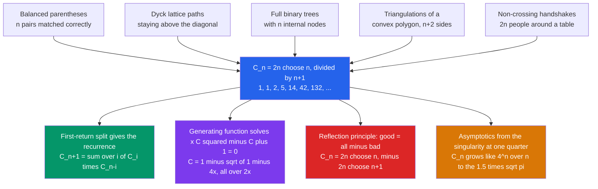

# 🧮 Catalan Numbers

> [!abstract] TL;DR
> The **Catalan numbers** $C_n = \dfrac{1}{n+1}\dbinom{2n}{n} = \dfrac{(2n)!}{(n+1)!\,n!} = 1, 1, 2, 5, 14, 42, 132, \dots$ are combinatorics' great "small world": *one* sequence secretly counts **dozens** of unrelated-looking families — balanced parentheses, lattice paths staying above a diagonal, full binary trees, polygon triangulations, non-crossing handshakes. The lesson is deep: when two families share a count, there is almost always a **bijection** explaining *why*, and the closed form falls out of the **reflection principle**.

---

## Intuition

**Analogy:** Imagine you learn a single secret handshake, and then discover — to your astonishment — that dozens of completely different clubs across town all use *exactly the same handshake*. The mountaineering club uses it, the accounting club uses it, the origami club uses it. You would rightly suspect these clubs are secretly connected. The Catalan numbers are that handshake. Count the ways to match $n$ pairs of parentheses correctly, the ways to triangulate a polygon, the ways to build a binary tree, the ways to walk a grid without crossing the diagonal — and you get the *same* answer every time: $1, 1, 2, 5, 14, 42, 132, \dots$

When one sequence answers so many different questions, mathematicians take notice. It signals a **hidden unity** — the objects are not merely equal in number by coincidence; each can be *transformed* into another. That transformation (a **bijection**) is the real prize, and the number $C_n$ is just its fingerprint. Intuition first, formula second: the Catalan numbers are less a formula than a *phenomenon*.

---

## How It Works

### Core Mechanics

1. **Pick any one Catalan family** — say **balanced parenthesis strings** of $n$ opening and $n$ closing brackets that are always valid (every prefix has at least as many `(` as `)`). For $n=3$ the valid strings are `((()))`, `(()())`, `(())()`, `()(())`, `()()()` — exactly $5 = C_3$.
2. **First-return decomposition gives the recurrence.** Every non-empty balanced string looks like `( A ) B`, where `A` is the balanced content *inside* the first bracket that closes it, and `B` is the balanced remainder. If `A` uses $i$ pairs then `B` uses $n-1-i$ pairs. Summing over the split point:
   $$C_{n+1} = \sum_{i=0}^{n} C_i \, C_{n-i}, \qquad C_0 = 1.$$
   This convolution is the engine — the *same* split builds the left/right subtrees of a binary tree, or the two halves of a Dyck path either side of its first return to the floor.
3. **The reflection principle gives the closed form.** Model a Dyck path as $n$ up-steps ($+1$) and $n$ down-steps ($-1$) that never dip below zero. Of the $\binom{2n}{n}$ total arrangements, the **bad** ones (that dip to $-1$) are in bijection — via reflecting the path after its first illegal step — with *all* paths having $n+1$ ups and $n-1$ downs, of which there are $\binom{2n}{n+1}$. Hence
   $$C_n = \binom{2n}{n} - \binom{2n}{n+1} = \frac{1}{n+1}\binom{2n}{n}.$$
4. **Generating functions package it all.** With $C(x) = \sum_{n\ge 0} C_n x^n$, the convolution recurrence becomes the quadratic $C(x) = 1 + x\,C(x)^2$, whose solution
   $$C(x) = \frac{1 - \sqrt{1 - 4x}}{2x}$$
   yields both the closed form (by the binomial series) and the **asymptotics** $C_n \sim \dfrac{4^n}{n^{3/2}\sqrt{\pi}}$ (by singularity analysis at $x = \tfrac14$).

### Flow / Architecture



The five leaf-objects are only a *sample* — Stanley's monograph catalogs over **200** distinct Catalan families, each connected to the others by an explicit bijection.

---

## Key Concepts

### Secondary (high-school level)
- **The sequence:** $C_0=1,\ C_1=1,\ C_2=2,\ C_3=5,\ C_4=14,\ C_5=42,\ C_6=132,\dots$ — memorable because $C_2$ through $C_5$ are $2, 5, 14, 42$.
- **The factorial formula:** $C_n = \dfrac{(2n)!}{(n+1)!\,n!}$. For $n=3$: $\dfrac{6!}{4!\,3!} = \dfrac{720}{24\cdot 6} = 5$.
- **The parentheses picture:** $C_n$ counts the ways to write $n$ pairs of brackets so they are always balanced — the friendliest way to *see* a Catalan number before any algebra.
- **The "$+1$" that everyone forgets:** $C_n$ is $\binom{2n}{n}$ *divided by* $n+1$. Drop that division and you get the wrong (much bigger) answer.

### Undergraduate
- **Closed form and its proof:** $C_n = \dfrac{1}{n+1}\binom{2n}{n} = \binom{2n}{n} - \binom{2n}{n+1}$, proven by the **reflection principle** (count all lattice paths, subtract the bad ones that touch the forbidden line).
- **The convolution recurrence:** $C_{n+1} = \sum_{i=0}^{n} C_i C_{n-i}$, from the **first-return decomposition** — the single most reused idea across every Catalan family.
- **The classic interpretations (all equal to $C_n$):**
  - **Balanced parentheses / Dyck words** — $n$ pairs, always valid.
  - **Dyck paths** — monotone lattice paths from $(0,0)$ to $(n,n)$ using right/up unit steps that never cross above the diagonal (equivalently up/down paths staying $\ge 0$).
  - **Full binary trees** with $n$ internal nodes (or **binary trees / BSTs** with $n$ nodes).
  - **Triangulations** of a convex polygon with $n+2$ sides (Euler's original 1751 problem).
  - **Non-crossing handshakes / chords** — $2n$ people around a table shaking hands with no crossings; non-crossing partitions.
  - **Ballot sequences**, **mountain ranges**, and **stack-sortable permutations** of $[n]$.
- **Ballot problem connection:** the number of ways candidate A stays strictly ahead of B is a ballot number; Catalan is the "tie-allowed above the diagonal" special case.

### Graduate
- **Generating function derivation:** the recurrence $\Leftrightarrow C(x) = 1 + xC(x)^2$; solving the quadratic and choosing the branch analytic at $0$ gives $C(x) = \dfrac{1-\sqrt{1-4x}}{2x}$. Extracting $[x^n]$ via the generalized binomial series $\sqrt{1-4x}$ re-derives the closed form — a template for **algebraic generating functions**.
- **Asymptotics by singularity analysis:** the dominant singularity at $x=\tfrac14$ (a square-root branch point) forces $C_n \sim \dfrac{4^n}{\sqrt{\pi}\,n^{3/2}}$. The $4^n$ is the exponential growth (radius of convergence); the $n^{-3/2}$ polynomial correction is the universal signature of a square-root singularity — shared by many tree- and path-counting sequences.
- **The bijective philosophy:** proving two Catalan families are equinumerous by *algebra* is unsatisfying; the gold standard is an explicit **bijection** (e.g. Dyck path $\leftrightarrow$ binary tree via first-return; triangulation $\leftrightarrow$ binary tree via the dual). The **cycle lemma** (Dvoretzky–Motzkin) gives a slick uniform proof that exactly $\frac{1}{n+1}$ of the cyclic rotations of any $\pm 1$ sequence with sum $1$ are "good."
- **Refinements and generalizations:**
  - **Narayana numbers** $N(n,k) = \frac1n\binom{n}{k}\binom{n}{k-1}$ refine $C_n = \sum_k N(n,k)$ by the number of peaks.
  - **Fuss–Catalan numbers** $\frac{1}{mn+1}\binom{mn+1}{n}$ count $(m+1)$-ary trees.
  - **Ballot numbers** $\frac{k+1}{n+1}\binom{2n-k}{n}$ generalize to paths ending above the diagonal.
  - **$q$-Catalan** numbers connect to the diagonal harmonics and $\mathrm{maj}$/area statistics.

---

## Python Demo

```python
# Catalan numbers "everywhere": compute C_n THREE independent ways and show they agree,
# verify the reflection-principle identity, then visualize the C_3 = 5 Dyck paths.
import numpy as np
import matplotlib.pyplot as plt
from math import comb

# ---------- (a) three independent computations of C_n ----------
def catalan_formula(n):
    """Closed form: C_n = C(2n, n) / (n+1)  -- integer division is exact."""
    return comb(2 * n, n) // (n + 1)

def catalan_recurrence(N):
    """Convolution recurrence C_{n+1} = sum_i C_i * C_{n-i}  (first-return split)."""
    C = [0] * (N + 1)
    C[0] = 1
    for n in range(N):
        C[n + 1] = sum(C[i] * C[n - i] for i in range(n + 1))
    return C

def dyck_paths(n):
    """ENUMERATE every Dyck path: 2n steps of +1 (up) / -1 (down), never below 0,
       ending at 0. Each path is one distinct Catalan object."""
    paths = []
    def build(seq, ups, downs):
        if ups == n and downs == n:
            paths.append(seq)
            return
        if ups < n:                 # an up-step is always allowed
            build(seq + [1], ups + 1, downs)
        if downs < ups:             # a down-step only if the path stays >= 0
            build(seq + [-1], ups, downs + 1)
    build([], 0, 0)
    return paths

N = 12
form = [catalan_formula(n) for n in range(N + 1)]   # method 1: formula
rec  = catalan_recurrence(N)                        # method 2: recurrence
enum = [len(dyck_paths(n)) for n in range(7)]       # method 3: brute-force enumeration

print(" n | formula | recurrence | enumerated Dyck paths")
for n in range(7):
    print(f"{n:2d} | {form[n]:7d} | {rec[n]:10d} | {enum[n]:d}")

assert form == rec,           "formula and recurrence disagree!"
assert enum == form[:7],      "enumeration disagrees with the formula!"
# Reflection principle:  C_n = C(2n, n) - C(2n, n+1)   (all paths minus the bad ones)
assert all(catalan_formula(n) == comb(2*n, n) - comb(2*n, n+1) for n in range(1, N)), \
    "reflection-principle identity failed!"
print("\nAll THREE methods agree; reflection-principle identity verified.")

# ---------- (b) visualize ----------
fig, axes = plt.subplots(1, 3, figsize=(17, 5))

# Left: the C_3 = 5 Dyck paths (up = '(' , down = ')'), stacked so they are distinct
paths3 = dyck_paths(3)
colors = plt.cm.viridis(np.linspace(0, 0.85, len(paths3)))
for k, (p, col) in enumerate(zip(paths3, colors)):
    heights = np.concatenate([[0], np.cumsum(p)]) + k * 0.12   # tiny offset to separate
    x = np.arange(len(heights))
    parens = "".join("(" if s == 1 else ")" for s in p)
    axes[0].step(x, heights, where="post", lw=2.2, color=col, label=parens)
axes[0].axhline(0, color="black", lw=1)
axes[0].set_title(f"The C_3 = {len(paths3)} Dyck paths for n=3\n(up-step = '(' , down-step = ')')")
axes[0].set_xlabel("step"); axes[0].set_ylabel("height above floor")
axes[0].legend(title="balanced parens", fontsize=9)

# Middle: reflection principle -- good paths = all paths minus bad paths
ns = np.arange(1, 7)
allp = np.array([comb(2 * n, n)     for n in ns], dtype=float)
badp = np.array([comb(2 * n, n + 1) for n in ns], dtype=float)
good = allp - badp
w = 0.35
axes[1].bar(ns - w / 2, allp, w, label="all paths  C(2n,n)",   color="#94a3b8")
axes[1].bar(ns - w / 2, badp, w, label="bad paths  C(2n,n+1)", color="#dc2626")
axes[1].bar(ns + w / 2, good, w, label="good = Catalan C_n",   color="#2563eb")
axes[1].set_yscale("log")
axes[1].set_title("Reflection principle\nCatalan = all paths minus bad paths")
axes[1].set_xlabel("n"); axes[1].set_ylabel("count (log scale)"); axes[1].legend(fontsize=9)

# Right: the three methods coincide, and Catalan growth vs the 4^n / n^1.5 asymptotic
ns2 = np.arange(N + 1)
asymp = 4.0 ** ns2 / (np.sqrt(np.pi) * np.maximum(ns2, 1) ** 1.5)
axes[2].plot(ns2, form, "o-", color="#2563eb", label="formula C(2n,n)/(n+1)")
axes[2].plot(ns2, rec, "x", ms=11, color="#059669", label="convolution recurrence")
axes[2].plot(range(7), enum, "s", ms=6, color="#d97706", label="enumerated Dyck paths")
axes[2].plot(ns2, asymp, "--", color="gray", label="asymptotic 4^n / (n^1.5 sqrt-pi)")
axes[2].set_yscale("log")
axes[2].set_title("Three methods agree\nand track the 4^n / n^1.5 growth")
axes[2].set_xlabel("n"); axes[2].set_ylabel("C_n (log scale)"); axes[2].legend(fontsize=9)

plt.tight_layout()
plt.savefig("catalan_numbers.png", dpi=120)
print("Saved figure: catalan_numbers.png")
```

**Expected console output:**

```
 n | formula | recurrence | enumerated Dyck paths
 0 |       1 |          1 | 1
 1 |       1 |          1 | 1
 2 |       2 |          2 | 2
 3 |       5 |          5 | 5
 4 |      14 |         14 | 14
 5 |      42 |         42 | 42
 6 |     132 |        132 | 132

All THREE methods agree; reflection-principle identity verified.
```

Three utterly different procedures — a factorial formula, a self-convolution, and raw enumeration of paths — land on the identical sequence. The middle plot shows the reflection principle at work (the blue bars, all minus bad, *are* the Catalan numbers), and the right plot confirms the $4^n/n^{3/2}$ asymptotic.

---

## Real-World Applications

> **Example:** A **compiler / expression parser** validates that brackets in source code are balanced using a **stack**, and the *number of distinct valid bracketings* of a length-$2n$ expression is exactly $C_n$. The same count governs how many ways a chain of $n+1$ matrices can be parenthesized for multiplication — the search space that **matrix-chain / interval dynamic programming** optimizes over.

- **Query optimizers & matrix-chain multiplication:** the number of ways to fully parenthesize a product of $n+1$ factors is $C_n$; a database join planner or a DP for optimal parenthesization is choosing the cheapest of these $C_n$ shapes.
- **Binary search trees:** the number of structurally distinct BSTs on $n$ keys is $C_n$ (LeetCode "Unique Binary Search Trees") — directly the full-binary-tree interpretation.
- **RNA secondary structure:** the non-crossing base-pairings of a strand are counted by Catalan-type numbers; the non-crossing-handshake model underlies folding algorithms in bioinformatics.
- **Computational geometry:** the number of triangulations of a convex polygon (mesh generation, GIS) is a Catalan number; Euler posed this in 1751.
- **Random walks & queueing:** paths that stay non-negative (a queue length that never goes empty prematurely, a gambler who never goes broke) are Dyck paths — the ballot/reflection machinery bounds first-passage probabilities.
- **Stack-sortable permutations:** exactly $C_n$ of the $n!$ permutations can be sorted by a single stack — a classic result linking data structures to enumeration.

---

## Common Pitfalls

- **Forgetting the $1/(n+1)$ factor** — writing $C_n = \binom{2n}{n}$ instead of $\frac{1}{n+1}\binom{2n}{n}$ overcounts by a factor of $n+1$ (it counts *all* lattice paths, including the ones that cross the diagonal). The whole point of Catalan is the paths you must *exclude*.
- **Off-by-one in the index** — is your "$n$" the number of pairs, the number of nodes, or the polygon's side count? A polygon with $n+2$ sides has $C_n$ triangulations, and a tree with $n$ internal nodes has $C_n$ shapes. Always pin down *which* size parameter indexes the sequence before quoting a value.
- **Assuming equal counts proves a bijection** — two families both counting $C_n$ are equinumerous, but that is *not* a construction. If a problem asks you to *transform* one Catalan object into another (e.g. tree $\to$ Dyck path), you must exhibit an explicit, invertible map; the shared count alone is only a hint, not a proof.
- **Confusing $C_n$ with the central binomial coefficient** — $\binom{2n}{n}$ and $C_n$ differ by the factor $n+1$ and count *different* things (all monotone paths vs. only the diagonal-respecting ones). They are cousins, not twins.
- **Integer overflow / non-exact division** — $C_n$ grows like $4^n$, so it overflows 64-bit integers around $n\approx 33$. Under a modulus, the $\frac{1}{n+1}$ must be a **modular inverse** ($\times\,(n+1)^{p-2} \bmod p$), never plain integer division.
- **Reflection principle applied to the wrong boundary** — the bad-path count is $\binom{2n}{n+1}$ because you reflect across the line *one below* the floor; using $\binom{2n}{n-1}$ or reflecting the wrong segment silently yields a wrong (but plausible-looking) formula.

---

## Related Concepts

- [[Permutations_and_Combinations]] — Catalan is built from the binomial coefficient $\binom{2n}{n}$; the "$P = C \times k!$" ordering logic is the same counting reflex applied to lattice paths.
- [[The_Sum_and_Product_Rules]] — the first-return decomposition is the sum rule (over split points) composed with the product rule (left part $\times$ right part) giving the convolution recurrence.
- [[Mathematics/04_Discrete_Mathematics/Combinatorics|Combinatorics (Discrete Math)]] — situates Catalan alongside pigeonhole, inclusion-exclusion, and derangements in the discrete-math toolkit.
- [[Generating_Functions_and_Recurrences]] — the recurrence $C(x)=1+xC(x)^2$ is solved by exactly the algebraic-generating-function method taught there; asymptotics follow from the singularity.
- [[DSA/12_Competitive_Programming/Combinatorics|Combinatorics (Competitive Programming)]] — practical modular computation of $C_n$ via precomputed factorials and modular inverses.
- [[Binary_Tree_Fundamentals]] — the number of shapes of a binary tree with $n$ nodes *is* $C_n$; the tree's left/right split is the recurrence.
- [[DP_on_Trees]] — "Unique BSTs" (LC 96) is the Catalan recurrence realized as a 1-D DP over subtree sizes.
- [[Interval_DP]] — matrix-chain multiplication and polygon triangulation optimize over the $C_n$ ways to parenthesize/triangulate.
- [[Stack]] — balanced-parenthesis validation and stack-sortable permutations are the algorithmic face of Dyck words.
- [[Backtracking]] — "generate all valid parentheses" enumerates the $C_n$ Dyck words by the choose/explore/unchoose template.
- [[Probability_Theory]] — the reflection principle and the ballot problem are the probabilistic origin of the closed form (first-passage of a random walk).

*Sibling notes referenced in prose (this section links only Glob-verified files): Generating_Functions, Recurrence_Relations_and_Counting, Bijective_Proofs_and_Combinatorial_Identities, Combinatorial_Geometry, and Asymptotic_Enumeration.*

---

## Review Questions

1. **(Secondary)** List all valid ways to arrange 3 pairs of parentheses, confirm there are 5, and then compute $C_3$ from the formula $\frac{1}{n+1}\binom{2n}{n}$. Which term in the formula is the one people most often forget, and what goes wrong without it?
2. **(Undergraduate)** Using the **first-return decomposition** of a Dyck path, derive the recurrence $C_{n+1} = \sum_{i=0}^{n} C_i C_{n-i}$ and use it to compute $C_4$. Separately, verify $C_4$ via the reflection identity $\binom{2n}{n} - \binom{2n}{n+1}$.
3. **(Graduate)** Given that full binary trees with $n$ internal nodes and Dyck paths of semilength $n$ are both counted by $C_n$, construct an explicit **bijection** between them and argue it is invertible. Then explain how the same first-return idea yields the generating-function equation $C(x) = 1 + xC(x)^2$, and how the square-root singularity at $x=\frac14$ produces the $4^n/n^{3/2}$ asymptotic. Why is exhibiting the bijection more valuable than merely noting the equal counts?

---

## Sources

- Richard P. Stanley, *Catalan Numbers* (Cambridge University Press, 2015) — the definitive catalog of 200+ interpretations and their bijections.
- Richard P. Stanley, *Enumerative Combinatorics, Vol. 2*, Exercise 6.19 and its solutions — the canonical list of Catalan families.
- Thomas Koshy, *Catalan Numbers with Applications* (Oxford University Press, 2008) — accessible, applications-focused treatment.
- Graham, Knuth & Patashnik, *Concrete Mathematics*, §7.5 and §5 — generating-function derivation and binomial identities.
- Philippe Flajolet & Robert Sedgewick, *Analytic Combinatorics*, Ch. I & VI — the singularity analysis behind the $4^n/n^{3/2}$ asymptotic.

---

#combinatorics #catalan-numbers #dyck-paths #bijections #enumeration
