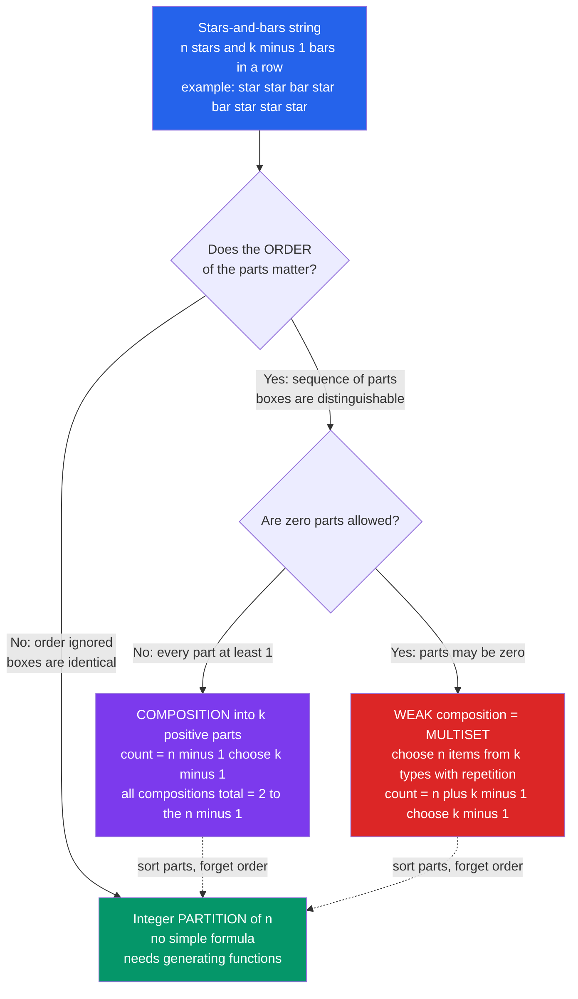

# 🍩 Compositions and Multisets

> [!abstract] TL;DR
> A **composition** of $n$ is an *ordered* sequence of positive integers that sum to $n$ (so $2+1 \ne 1+2$); there are $2^{n-1}$ of them, and $\binom{n-1}{k-1}$ into exactly $k$ parts. Allow zeros and you get **weak compositions** / **multisets** (unordered selections *with repetition*), counted by $\binom{n+k-1}{k-1}$. Every one of these formulas is a single picture — **stars and bars** — the master bijection that turns "distribute $n$ identical items into $k$ distinguishable boxes" into "arrange $n$ stars and $k-1$ bars in a row."

---

## Intuition

**Analogy:** You want to buy a **dozen donuts** from a shop with **4 flavors**. How many different orders are possible? You are **not arranging** the donuts in a line — a box of donuts has no order — you are only deciding **how many of each flavor**, and buying three of the same flavor is perfectly fine. So picture the dozen as **stars** and the flavor-dividers as **bars**:

```
* * * * | * * | | * * * * * *      →  4 glazed, 2 jelly, 0 chocolate, 6 sprinkle
```

Twelve stars, three bars ($4$ flavors need $3$ dividers). **Every distinct arrangement of those $12 + 3 = 15$ symbols is a distinct donut order**, and choosing *which* of the 15 slots hold the 3 bars gives $\binom{15}{3} = 455$ orders. That "stars and bars" trick is the workhorse for counting **multisets** and **compositions** — the humble but ubiquitous cousin of partitions, distinguished by one question: does **order matter** (compositions) or is **repetition allowed** (multisets)?

---

## How It Works

### Core Mechanics

1. **A composition is an ordered sum.** Write $n$ as $a_1 + a_2 + \cdots + a_k$ with each $a_i \ge 1$, and *keep track of order*. Model $n$ as $n$ ones in a row with $n-1$ gaps between them; **cutting** the row at some subset of those gaps splits it into parts. There are $n-1$ gaps, so $2^{n-1}$ subsets of cuts $\Rightarrow$ **$2^{n-1}$ compositions of $n$**. Choosing exactly $k-1$ of the $n-1$ gaps gives exactly $k$ parts: $\binom{n-1}{k-1}$.
2. **Weak compositions allow zero parts.** Now $a_i \ge 0$. Substitute $b_i = a_i + 1 \ge 1$; then $b_1 + \cdots + b_k = n + k$ with positive parts, which by rule (1) has $\binom{n+k-1}{k-1}$ solutions. Equivalently, lay out $n$ **stars** and $k-1$ **bars**: $\binom{n+k-1}{k-1}$.
3. **A multiset is that same count, re-read.** Choosing a size-$n$ multiset from $k$ types ("how many of each type") *is* a weak composition of $n$ into $k$ parts — so combinations **with repetition** of $k$ types taken $n$ at a time equal $\binom{n+k-1}{n} = \binom{n+k-1}{k-1}$. (Choosing $k$ items from $n$ types instead reads as $\binom{n+k-1}{k}$ — same bijection, roles swapped.)
4. **Contrast with a partition.** If the boxes become **indistinguishable** — order of the parts is ignored — then $2+1$ and $1+2$ collapse to the single partition $\{2,1\}$. Partition counts have **no simple closed form** (they need generating functions), which is exactly why order-sensitivity makes compositions and multisets so much easier to count.

### Flow / Architecture



The one branch **"does order matter?"** separates compositions/multisets (easy, closed-form) from partitions (hard). The sub-branch **"zeros allowed?"** shifts the binomial index from $n-1$ to $n+k-1$.

---

## Key Concepts

### Secondary (high-school level)
- **Composition = ordered sum.** $3 = 2+1$ and $3 = 1+2$ are **different** compositions. The compositions of $3$ are: $3;\ 2{+}1;\ 1{+}2;\ 1{+}1{+}1$ — that is $4 = 2^{3-1}$ of them.
- **Multiset = a "bag."** Repeats are allowed but there is **no order** — exactly the donut box. $\{A,A,B\}$ is the same multiset as $\{A,B,A\}$.
- **Stars and bars picture.** To split $n$ identical stars into $k$ groups, drop $k-1$ bars among them; count the arrangements. That single image answers a whole family of "how many ways to distribute" questions.

### Undergraduate
- **Total compositions:** $\displaystyle\sum_{k=1}^{n}\binom{n-1}{k-1} = 2^{n-1}$ (the cut-points bijection — compositions of $n$ correspond one-to-one with **subsets of** $\{1,\dots,n-1\}$).
- **Compositions into exactly $k$ positive parts:** $\displaystyle\binom{n-1}{k-1}$.
- **Weak compositions into $k$ non-negative parts:** $\displaystyle\binom{n+k-1}{k-1}$ (the $b_i = a_i+1$ shift).
- **Combinations with repetition / multisets:** choosing $k$ from $n$ types with repeats allowed $= \displaystyle\binom{n+k-1}{k}$ — the fourth cell of the *order × repetition* table (see the sibling *Permutations_and_Combinations*).
- **Restricted compositions** (parts bounded, e.g. each $a_i \le m$) are counted by **inclusion–exclusion** or by reading coefficients off a truncated generating function.

### Graduate
- **Generating-function view.** Each part is a formal series. A **positive** part contributes $x + x^2 + \cdots = \dfrac{x}{1-x}$; a **non-negative** part contributes $\dfrac{1}{1-x}$. Compositions into exactly $k$ positive parts are the coefficients of $\left(\dfrac{x}{1-x}\right)^{k}$, and *all* compositions of $n$ come from $\dfrac{1}{1 - \frac{x}{1-x}} = \dfrac{1-x}{1-2x}$, whose $x^n$ coefficient is $2^{n-1}$. Partitions instead use the **product** $\prod_{i\ge 1}\dfrac{1}{1-x^i}$ — order-ignoring makes the algebra multiplicative and much harder (link to the sibling *Generating_Functions*).
- **The Twelvefold Way (Rota).** All "balls-in-boxes" problems classified by two binary choices — balls distinguishable or not, boxes distinguishable or not — crossed with the map type (arbitrary / injective / surjective):

  | Balls → Boxes | arbitrary | injective | surjective |
  |---|---|---|---|
  | **dist → dist** | $k^n$ | $k^{\underline{n}}$ (falling factorial) | $k!\,S(n,k)$ |
  | **indist → dist** | $\binom{n+k-1}{n}$ **(multiset)** | $\binom{k}{n}$ | $\binom{n-1}{k-1}$ **(composition)** |
  | **dist → indist** | $\sum_{j\le k} S(n,j)$ | $[n\le k]$ | $S(n,k)$ (Stirling 2nd) |
  | **indist → indist** | $p_{\le k}(n)$ | $[n\le k]$ | $p_k(n)$ **(partition)** |

  Compositions and multisets are exactly the **indistinguishable-balls, distinguishable-boxes** row; the *surjective* column ("no empty box") is the strong composition $\binom{n-1}{k-1}$, the *arbitrary* column is the weak/multiset count $\binom{n+k-1}{n}$. This single table ties together permutations, combinations, compositions, partitions, and the **Stirling / Bell numbers** (see the sibling *Stirling_and_Bell_Numbers*).
- **Carlitz & cyclic compositions.** Compositions with no two adjacent parts equal (Carlitz), or considered up to rotation (cyclic), give richer generating functions — the frontier where compositions meet the theory of *Integer_Partitions*.

---

## Python Demo

```python
# Stars-and-bars, verified and visualized.
#   (a) Count compositions / weak compositions / multisets / partitions by
#       CLOSED FORM and cross-check each against BRUTE-FORCE enumeration.
#   (b) Exhibit the stars-and-bars bijection (multiset <-> star/bar string)
#       and plot the four case-counts side by side plus the picture itself.
import numpy as np
import matplotlib.pyplot as plt
from math import comb
from itertools import product, combinations_with_replacement

# ---------- brute-force enumerators (small n only) ----------
def compositions(n, k):
    """Ordered tuples of k POSITIVE ints summing to n."""
    return [t for t in product(range(1, n + 1), repeat=k) if sum(t) == n]

def weak_compositions(n, k):
    """Ordered tuples of k NON-NEGATIVE ints summing to n."""
    return [t for t in product(range(0, n + 1), repeat=k) if sum(t) == n]

def partitions(n, k):
    """Partitions of n into exactly k positive parts (order IGNORED)."""
    return [t for t in compositions(n, k)
            if all(t[i] >= t[i + 1] for i in range(k - 1))]

def multiset_to_stars_bars(multiset, k):
    """A size-n multiset drawn from k types -> (string, per-type counts)."""
    counts = [0] * k
    for typ in multiset:
        counts[typ] += 1
    return "|".join("*" * c for c in counts), counts

# ---------- (a) VERIFY closed forms against enumeration ----------
print("n  k | compositions        weak = multisets       partitions")
print("-" * 66)
for n, k in [(4, 2), (5, 3), (6, 3), (7, 4)]:
    comp   = len(compositions(n, k));        comp_f = comb(n - 1, k - 1)
    weak   = len(weak_compositions(n, k));   weak_f = comb(n + k - 1, k - 1)
    mult   = len(list(combinations_with_replacement(range(k), n)))  # size-n from k types
    part   = len(partitions(n, k))
    assert comp == comp_f, "composition formula mismatch"
    assert weak == weak_f == mult, "weak-composition = multiset mismatch"
    print(f"{n}  {k} | {comp:3d} = C({n-1},{k-1})={comp_f:<3d}   "
          f"{weak:3d} = C({n+k-1},{k-1})={weak_f:<3d}   {part:3d} (no formula)")

# total compositions of n = 2^(n-1)
for n in range(1, 8):
    total = sum(len(compositions(n, k)) for k in range(1, n + 1))
    assert total == 2 ** (n - 1)
print("\nTotal compositions of n = 2^(n-1) verified for n = 1..7")

# the donut order: a dozen from 4 flavors
n_d, k_d = 12, 4
print(f"\nDonuts: a dozen from {k_d} flavors "
      f"= C({n_d+k_d-1},{k_d-1}) = {comb(n_d + k_d - 1, k_d - 1)} orders")

# ---------- (b) show the bijection explicitly ----------
example = (0, 0, 1, 3, 3)          # a size-5 multiset drawn from 4 types
s, counts = multiset_to_stars_bars(example, k=4)
print(f"\nBijection example (5 items, 4 types):")
print(f"  multiset picked  : types {example}")
print(f"  per-type counts  : {counts}")
print(f"  stars-and-bars   : {s}")

# ---------- plots ----------
fig, ax = plt.subplots(1, 3, figsize=(17, 5))

# [0] four cases side by side for a fixed (n, k)
n0, k0 = 6, 3
cases  = ["compositions\n(order, positive)",
          "weak comps\n(order, zeros ok)",
          "multisets\n(no order, repeats)",
          "partitions\n(no order)"]
vals   = [comb(n0 - 1, k0 - 1),
          comb(n0 + k0 - 1, k0 - 1),
          comb(n0 + k0 - 1, k0 - 1),
          len(partitions(n0, k0))]
colors = ["#7c3aed", "#dc2626", "#dc2626", "#059669"]
bars = ax[0].bar(cases, vals, color=colors)
for b, v in zip(bars, vals):
    ax[0].text(b.get_x() + b.get_width() / 2, v + 0.4, str(v), ha="center", fontweight="bold")
ax[0].set_title(f"Four cases for n={n0}, k={k0}\n(weak comps = multisets: same count)")
ax[0].set_ylabel("number of ways")
ax[0].tick_params(axis="x", labelsize=8)

# [1] growth vs k for fixed n (log scale)
nG = 8
ks = np.arange(1, nG + 1)
comp_g = [comb(nG - 1, int(k) - 1)     for k in ks]
weak_g = [comb(nG + int(k) - 1, int(k) - 1) for k in ks]
part_g = [len(partitions(nG, int(k)))  for k in ks]
ax[1].plot(ks, comp_g, "o-", color="#7c3aed", label="compositions  C(n-1,k-1)")
ax[1].plot(ks, weak_g, "s-", color="#dc2626", label="weak / multisets  C(n+k-1,k-1)")
ax[1].plot(ks, part_g, "^-", color="#059669", label="partitions (order ignored)")
ax[1].set_yscale("log")
ax[1].set_title(f"Growth vs k  (n = {nG})")
ax[1].set_xlabel("number of parts k"); ax[1].set_ylabel("count (log scale)")
ax[1].legend(fontsize=8)

# [2] the stars-and-bars illustration itself
ax[2].set_title(f"Stars & bars: multiset {example} of 4 types\nstring  {s}")
x = 0.0
for i, c in enumerate(counts):
    for _ in range(c):
        ax[2].plot(x, 0, "o", ms=26, color="#f59e0b", zorder=3); x += 1
    if i < len(counts) - 1:
        ax[2].plot([x, x], [-0.35, 0.35], "-", lw=4, color="#111827", zorder=3); x += 1
ax[2].text(x / 2, 0.7, f"{sum(counts)} stars  +  {len(counts)-1} bars  =  "
                       f"choose {len(counts)-1} bar slots from {int(x)}", ha="center")
ax[2].set_xlim(-1, x); ax[2].set_ylim(-1.2, 1.2); ax[2].axis("off")

plt.tight_layout()
plt.savefig("compositions_and_multisets.png", dpi=120)
print("\nSaved figure: compositions_and_multisets.png")
```

**Expected console output:**

```
n  k | compositions        weak = multisets       partitions
------------------------------------------------------------------
4  2 |   3 = C(3,1)=3       5 = C(5,1)=5       2 (no formula)
5  3 |   6 = C(4,2)=6      21 = C(7,2)=21      2 (no formula)
6  3 |  10 = C(5,2)=10     28 = C(8,2)=28      3 (no formula)
7  4 |  20 = C(6,3)=20    120 = C(10,3)=120    3 (no formula)

Total compositions of n = 2^(n-1) verified for n = 1..7

Donuts: a dozen from 4 flavors = C(15,3) = 455 orders
```

The three panels show (1) that **weak compositions and multisets are literally the same count** while ordered-positive compositions and order-ignoring partitions sit on either side, (2) how each family grows with $k$ — multisets exploding, partitions crawling — and (3) the bijection made physical: stars are items, bars are dividers, and *counting bar-placements counts everything*.

---

## Real-World Applications

> **Example:** **Bose–Einstein statistics** in physics counts how $n$ **indistinguishable** photons can occupy $k$ energy states. Because photons carry no identity, a configuration is just "how many per state" — a **weak composition** of $n$ into $k$ parts — so the number of microstates is $\binom{n+k-1}{k-1}$, the exact stars-and-bars formula. (Distinguishable "Maxwell–Boltzmann" particles would instead give $k^n$; the first row vs second row of the Twelvefold Way is the difference between classical and quantum counting.)

- **Inventory & purchasing:** ways to buy $n$ units across $k$ product types (the donut problem) — pricing tiers, gift-box assortments, coin/denomination selections.
- **Integer solutions & occupancy:** the number of non-negative solutions to $x_1 + \cdots + x_k = n$ underlies **occupancy problems** in probability (see *Probability_Theory*) — balls into urns, hash-bucket loads, sampling with replacement.
- **Multinomial expansion:** the number of distinct terms in $(x_1 + \cdots + x_k)^n$ before collecting is a multiset of exponents — $\binom{n+k-1}{k-1}$ monomials (links to the **multinomial distribution**, *Common_Probability_Distributions*).
- **Compilers & type theory:** counting the shapes of tuples/records of total size $n$ over $k$ field-types is a composition count.
- **Algorithms:** **unbounded coin change** and **unbounded knapsack** are compositions/multisets in disguise — "how many ways to make $n$ from part sizes" is precisely restricted-composition counting, solved by the same DP recurrence.

---

## Common Pitfalls

- **Positive vs non-negative parts (the $n-1$ vs $n+k-1$ index).** Compositions into $k$ **positive** parts use $\binom{n-1}{k-1}$; allowing **zeros** (weak) uses $\binom{n+k-1}{k-1}$. Reach for the wrong one and you silently over- or under-count. Fix a "each part $\ge 1$" constraint by the substitution $b_i = a_i + 1$ *before* applying stars and bars.
- **Order-matters (composition) vs order-ignored (partition).** $2+1$ and $1+2$ are two compositions but one partition. If the boxes/positions are labeled, it is a composition; if they are interchangeable, it is a partition — and then **no clean binomial formula exists**.
- **Which quantity is $n$ and which is $k$.** "Multiset of size $k$ from $n$ types" gives $\binom{n+k-1}{k}$; "distribute $n$ items into $k$ boxes" gives $\binom{n+k-1}{k-1}$. They are the *same bijection* with the roles of items and types swapped — always name your stars and your bars explicitly.
- **Distinguishable vs identical boxes.** Stars-and-bars assumes the **boxes are distinguishable** (labeled). If the boxes are identical, you have crossed into *partition* territory and must switch tools (generating functions / recurrences), not adjust the binomial.
- **Non-empty constraint applied twice.** For "$k$ parts, none empty," subtract one item per box up front ($n \to n-k$), then count *weak* compositions — do not also demand positivity afterward, or you double-enforce it.

---

## Related Concepts

- [[Mathematics/04_Discrete_Mathematics/Combinatorics|Combinatorics (Discrete Math)]] — the parent toolkit; compositions and multisets are the "with repetition / order relaxed" corner of counting.
- [[Mathematics/04_Discrete_Mathematics/Set_Theory_and_Relations|Set Theory and Relations]] — a **multiset** generalizes a **set** by attaching a multiplicity to each element; the stars-and-bars count is the size of that multiset space.
- [[Mathematics/04_Discrete_Mathematics/Generating_Functions_and_Recurrences|Generating Functions and Recurrences]] — each part is a geometric series; compositions read off $(x/(1-x))^k$, partitions off $\prod 1/(1-x^i)$.
- [[Mathematics/06_Probability_and_Statistics/Common_Probability_Distributions|Common Probability Distributions]] — the **multinomial** coefficient counts labeled arrangements; its monomial count is a multiset.
- [[Mathematics/06_Probability_and_Statistics/Probability_Theory|Probability Theory]] — **occupancy** and **Bose–Einstein** counting are weak compositions; sampling *with replacement, unordered* is a multiset.
- [[DSA/12_Competitive_Programming/Combinatorics|Combinatorics (Competitive Programming)]] — the $O(n)$-precompute-then-$O(1)$-query implementation of $\binom{n+k-1}{k}$ for stars-and-bars problems.
- [[Coin_Change]] — counting ways to form $n$ from unlimited coin types is a restricted **multiset / composition** count, solved by DP.
- [[Knapsack_Unbounded]] — unbounded knapsack selects a multiset of items; the same "with repetition" structure drives its recurrence.

---

## Review Questions

1. **(Secondary)** List every composition of $4$ and every partition of $4$. How many of each are there, and *why* is the composition count exactly double-ish the partition count? Which everyday scenario (order matters vs not) matches each?
2. **(Undergraduate)** In how many ways can you buy 20 bagels from 5 varieties (repeats allowed, order irrelevant)? Now require **at least one** of each variety — redo the count and explain the substitution you used to reach it.
3. **(Graduate)** Using generating functions, prove that the total number of compositions of $n$ is $2^{n-1}$, and locate compositions, multisets, and partitions inside the Twelvefold Way (state the row/column of each). Why does removing the "order" assumption destroy the closed form?

---

## Sources

- Brualdi, *Introductory Combinatorics*, Ch. 3 & 8 (combinations with repetition, compositions, partitions).
- Stanley, *Enumerative Combinatorics*, Vol. 1, §1.2 & §1.9 (compositions, multisets, the Twelvefold Way).
- Graham, Knuth & Patashnik, *Concrete Mathematics*, Ch. 5 (binomial coefficients; stars-and-bars identities).
- Tucker, *Applied Combinatorics*, Ch. 5–6 (selections with repetition and distributions).
- Rosen, *Discrete Mathematics and Its Applications*, §6.5 (generalized permutations and combinations).

---

#combinatorics #stars-and-bars #compositions #multisets #counting
