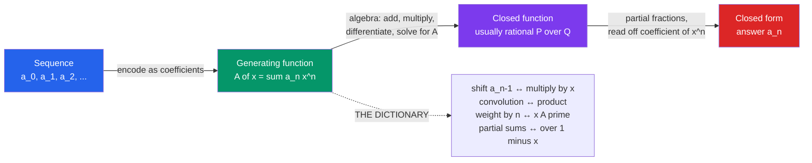

# 🧵 Generating Functions

> [!abstract] TL;DR
> A generating function encodes an entire infinite sequence $(a_0, a_1, a_2, \ldots)$ as the coefficients of a single power series $\sum_n a_n x^n$. Once the sequence lives inside one function, hard counting questions become routine algebra: adding, multiplying, and differentiating the function *is* operating on the sequence. Generating functions are the master tool of enumeration — they solve recurrences, count partitions, and unify Catalan numbers, coin change, and combinatorial identities under one method.

---

## Intuition

**Analogy:** Imagine you have an *infinite* list of answers — how many ways to make change for 1 cent, for 2 cents, for 3 cents, and so on forever. Writing them out one by one is hopeless. Instead, hang the whole sequence on a single "clothesline": a power series where the coefficient of $x^n$ is the $n$-th answer. Herbert Wilf described a generating function as exactly this — *"a clothesline on which we hang up a sequence of numbers for display."*

The magic is that questions about the **sequence** (recurrences, sums, convolutions) turn into questions about a single **function** you can add, multiply, differentiate, and factor with ordinary algebra and calculus. You stop chasing terms one at a time and start manipulating the whole infinite list at once. Solving a recurrence becomes solving an equation for a function; counting becomes reading off a coefficient.

---

## How It Works

### Core Mechanics

1. **Encode.** Given a counting sequence $a_n$, write its **ordinary generating function (OGF)** $A(x) = \sum_{n \ge 0} a_n x^n$. The variable $x$ is a formal bookkeeping symbol — it is a *marker* for "size $n$," never a number you plug in.
2. **The atom.** The single most useful series is the geometric one: $\dfrac{1}{1-x} = 1 + x + x^2 + x^3 + \cdots$ (the OGF of the all-ones sequence). Almost every closed form is built from this atom.
3. **Translate operations (the dictionary).** Every operation on the *sequence* has a mirror operation on the *function*:

   | Sequence operation | Function operation |
   |---|---|
   | Shift $a_{n-1}$ (prepend a $0$) | Multiply by $x$: $x\,A(x)$ |
   | Add sequences $a_n + b_n$ | Add functions $A(x) + B(x)$ |
   | Convolution $\sum_k a_k b_{n-k}$ | **Multiply** functions $A(x)\,B(x)$ |
   | Weight by $n$: $n\,a_n$ | Differentiate & scale: $x\,A'(x)$ |
   | Partial sums $\sum_{k \le n} a_k$ | Multiply by $\dfrac{1}{1-x}$ |

4. **Solve.** Turn the recurrence or combinatorial rule into an *equation for $A(x)$*, then solve algebraically. For linear recurrences the result is a **rational function** $P(x)/Q(x)$.
5. **Extract.** Recover $a_n = [x^n]\,A(x)$ (the coefficient of $x^n$). For rational $A(x)$, **partial fractions** split it into geometric pieces, giving a closed form (e.g. Binet's Fibonacci formula). For asymptotics, the location of the nearest singularity controls the growth rate.

The two flavors: **OGF** $\sum a_n x^n$ counts *unlabeled* structures (multiplication = "choose sizes that add up"); the **exponential generating function (EGF)** $\hat{A}(x) = \sum a_n \frac{x^n}{n!}$ counts *labeled* structures, where multiplication interleaves labels and $e^x$ plays the role $\frac{1}{1-x}$ plays for OGFs.

### Flow / Architecture



---

## Key Concepts

### Secondary — the idea
- A **generating function** is a "polynomial with infinitely many terms" (a *power series*) whose coefficients are the numbers you care about.
- The workhorse identity: $\dfrac{1}{1-x} = 1 + x + x^2 + \cdots$. Substituting gives friends like $\dfrac{1}{1-2x} = \sum 2^n x^n$ and $\dfrac{1}{1-x^5} = 1 + x^5 + x^{10} + \cdots$.
- **Reading a coefficient answers a counting question.** If a function's $x^n$ coefficient equals "ways to do something of size $n$," then expanding the function *is* solving all those problems at once.

### Undergraduate — the machinery
- **OGF vs EGF.** OGF $\sum a_n x^n$ for unordered/unlabeled selections; EGF $\sum a_n \frac{x^n}{n!}$ for labeled arrangements (permutations, set partitions). Choosing the wrong one yields wrong identities.
- **Product = convolution.** Multiplying two OGFs adds the exponents, so $[x^n]\,A(x)B(x) = \sum_k a_k b_{n-k}$. This is *why* a **product of geometric series counts coin change / partitions**: each factor $\frac{1}{1-x^c}$ contributes "use denomination $c$ any number of times."
- **Solving recurrences.** For $F_n = F_{n-1} + F_{n-2}$, algebra gives the OGF $\displaystyle F(x) = \frac{x}{1 - x - x^2}$. Factoring the denominator and applying **partial fractions** produces $F_n = \frac{\varphi^n - \psi^n}{\sqrt 5}$ (Binet). Extracting coefficients *is* solving the recurrence.
- **Formal vs analytic.** As a *formal* power series, convergence is irrelevant — $x$ is a symbol and all manipulations are legal term-by-term. Convergence only matters when you want to *evaluate* or extract *asymptotics*.

### Graduate — the unifying theory
- **The symbolic method** (Flajolet & Sedgewick, *Analytic Combinatorics*). Combinatorial *constructions* map directly to GF *operations*: disjoint union $\to$ sum, Cartesian product $\to$ product, sequence $\mathrm{SEQ} \to \frac{1}{1-A(x)}$, set/multiset/cycle constructions have their own translations. You write down the GF of a combinatorial class *without ever setting up a recurrence*.
- **Coefficient asymptotics.** Treat $A(x)$ as a complex-analytic function; its **dominant singularity** (nearest to the origin) dictates the exponential growth rate of $a_n$, and the *type* of singularity (pole, square-root, log) sets the sub-exponential factor — via **singularity analysis** and, for meromorphic cases, **residues** (Cauchy's coefficient formula $a_n = \frac{1}{2\pi i}\oint A(x)\,x^{-n-1}\,dx$).
- **Beyond OGF/EGF.** Dirichlet series $\sum a_n n^{-s}$ (multiplicative number theory), bivariate GFs (track two statistics, e.g. size *and* number of parts), and $q$-series (partitions, Rogers–Ramanujan).

---

## Python Demo

```python
# Generating functions turn counting into algebra on power series.
# Demo A: coin-change counts are the coefficients of a PRODUCT of geometric series,
#         and we VERIFY them against a dynamic-programming count.
# Demo B: Fibonacci numbers are the coefficients of the rational GF x / (1 - x - x^2),
#         matching both the recurrence and the Binet closed form.

import numpy as np
import matplotlib.pyplot as plt

# ---------- helper: multiply two power series (ascending coeffs), keep degrees 0..N-1 ----------
def truncate_mul(a, b, N):
    return np.convolve(a, b)[:N]        # np.convolve IS polynomial / power-series multiplication

# ---------- Demo A: coin change via generating functions ----------
# GF for a coin of denomination c used any number of times: 1 + x^c + x^(2c) + ... = 1/(1 - x^c)
# The PRODUCT over all coins has coefficient of x^n = number of ways to make n cents.
def geometric_series(c, N):
    g = np.zeros(N)
    g[::c] = 1.0                        # ones at exponents 0, c, 2c, ...
    return g

def coin_change_gf(coins, N):
    prod = np.zeros(N); prod[0] = 1.0   # the series "1" (empty product)
    for c in coins:
        prod = truncate_mul(prod, geometric_series(c, N), N)
    return np.rint(prod).astype(int)

# Ground-truth DP (classic unbounded coin-change COUNT)
def coin_change_dp(coins, N):
    ways = np.zeros(N, dtype=int); ways[0] = 1
    for c in coins:
        for n in range(c, N):
            ways[n] += ways[n - c]
    return ways

N = 61
coins = [1, 5, 10, 25]
gf_ways = coin_change_gf(coins, N)
dp_ways = coin_change_dp(coins, N)

assert np.array_equal(gf_ways, dp_ways), "GF coefficients must equal the DP counts!"
print("Coin change: GF coefficients == DP counts ->", np.array_equal(gf_ways, dp_ways))
print("Ways to make 50 cents:", gf_ways[50])

# ---------- Demo B: Fibonacci from its rational generating function ----------
# First N coefficients of num(x) / den(x) as a FORMAL power series (den[0] != 0).
def series_div(num, den, N):
    num = np.asarray(num, float); den = np.asarray(den, float)
    a = np.zeros(N)
    for n in range(N):
        s = num[n] if n < len(num) else 0.0
        for k in range(1, min(n, len(den) - 1) + 1):
            s -= den[k] * a[n - k]      # this recursion IS the recurrence hidden in the denominator
        a[n] = s / den[0]
    return a

M = 20
fib_gf = np.rint(series_div([0, 1], [1, -1, -1], M)).astype(int)   # x / (1 - x - x^2)

# ground truth from the recurrence F_n = F_{n-1} + F_{n-2}
fib_rec = [0, 1]
while len(fib_rec) < M:
    fib_rec.append(fib_rec[-1] + fib_rec[-2])
fib_rec = np.array(fib_rec)

# Binet closed form — this is exactly the partial-fraction expansion of the GF
phi = (1 + np.sqrt(5)) / 2; psi = (1 - np.sqrt(5)) / 2
binet = np.rint((phi**np.arange(M) - psi**np.arange(M)) / np.sqrt(5)).astype(int)

assert np.array_equal(fib_gf, fib_rec) and np.array_equal(fib_gf, binet)
print("Fibonacci from GF:", fib_gf[:12].tolist())

# ---------- plot ----------
fig, ax = plt.subplots(1, 2, figsize=(12, 4.5))
ax[0].bar(range(N), gf_ways, color="#059669", label="GF coefficient [x^n]")
ax[0].plot(range(N), dp_ways, "o", ms=3, color="#dc2626", label="DP count (check)")
ax[0].set(title="Coin change = [x^n] of 1 / prod(1 - x^c)",
          xlabel="amount (cents)", ylabel="number of ways")
ax[0].legend()

ax[1].semilogy(range(M), np.maximum(fib_gf, 1), "o-", color="#2563eb", label="GF coefficients")
ax[1].semilogy(range(M), np.maximum(binet, 1), "x", ms=8, color="#7c3aed", label="Binet closed form")
ax[1].set(title="Fibonacci = [x^n] of x / (1 - x - x^2)",
          xlabel="n", ylabel="F_n (log scale)")
ax[1].legend()
plt.tight_layout(); plt.show()
```

The two demos make the section's thesis concrete: **coefficient extraction is the counting answer.** In Demo A the *product* of geometric series (multiplication = convolution) reproduces the coin-change DP table exactly; in Demo B *dividing* one polynomial by another to extract coefficients is literally running the Fibonacci recurrence, and factoring the denominator hands you Binet's closed form.

---

## Real-World Applications

> **Example — DSP and the Z-transform:** The Z-transform $X(z) = \sum_n x[n]\,z^{-n}$ is a generating function of a discrete signal (with $z^{-1}$ playing the role of $x$). Convolution of signals becomes multiplication of transforms — the *same* dictionary entry — which is why linear time-invariant filters are analyzed as rational functions and designed by placing poles and zeros.

- **Algorithm analysis:** Average-case runtimes and the counts of combinatorial objects (trees, permutations with given cycle structure, tries) are read straight off generating functions via the symbolic method — the backbone of *Analytic Combinatorics*.
- **Probability:** The **probability generating function** $\sum p_n x^n$ and the **moment generating function** turn convolutions of independent random variables into products, giving instant sums, means, and variances (branching processes, queueing).
- **Statistical mechanics:** The **partition function** is a generating function over energy states; extracting the right coefficient (or derivative) yields thermodynamic quantities.
- **Coding & compression:** Enumerating strings avoiding a pattern, or codewords of a given length, reduces to a rational generating function whose growth rate gives channel capacity.

---

## Common Pitfalls

- **Formal vs convergent series** — In the *formal* world, $x$ is a symbol and every term-by-term manipulation is legal regardless of convergence; you only need a radius of convergence when you *evaluate* the function or extract *asymptotics*. Beginners waste effort worrying about convergence during purely algebraic derivations.
- **Choosing OGF when you need EGF (or vice versa)** — OGFs count *unlabeled* selections (products add sizes); EGFs count *labeled* arrangements (products interleave labels via the binomial convolution). Using the wrong flavor silently produces wrong identities — labeled structures like permutations and set partitions demand EGFs.
- **Botching coefficient extraction** — For a rational GF you *must* do **partial fractions** before reading off coefficients; expanding $\frac{P(x)}{Q(x)}$ term-by-term without factoring $Q$ is error-prone. Watch for **repeated roots**, which introduce polynomial-in-$n$ factors like $n\,r^n$.
- **Ignoring the radius of convergence for asymptotics** — When you switch from counting to *growth rate*, the nearest singularity to the origin sets the exponential base $a_n \sim C\,\rho^{-n}$. Treating the series as merely formal at this stage loses all asymptotic information.
- **Off-by-one in the marker** — Forgetting that "shift by one" corresponds to multiplying by $x$ (not $x^{-1}$), or mismatching initial terms $a_0, a_1$ when setting up the functional equation, quietly corrupts the whole derivation.

---

## Related Concepts

- [[Generating_Functions_and_Recurrences]] — the discrete-math treatment; this note **goes deeper** on OGF vs EGF, the symbolic method, and coefficient asymptotics, while that note covers the master theorem and characteristic-equation route.
- [[Sequences_and_Series]] — power series, Taylor series, and radius of convergence: the analytic substrate a GF lives on when you stop treating it formally.
- [[Laurent_Series_and_Singularities]] — the singularity structure of a GF (poles, branch points) controls its coefficients' growth; Laurent expansions handle the annular case.
- [[Residue_Theorem_and_Applications]] — Cauchy's coefficient formula $a_n = \frac{1}{2\pi i}\oint A(x)x^{-n-1}dx$ extracts coefficients as residues, the analytic engine behind asymptotics.
- [[Z_Transform]] — the signal-processing cousin: a generating function of a discrete signal where convolution again becomes multiplication.
- [[Coin_Change]] — the dynamic-programming counterpart of the coin-change GF; the DP table is exactly the product-of-geometric-series coefficients.
- [[Mathematics/04_Discrete_Mathematics/Combinatorics|Combinatorics (Discrete Math)]] — the counting principles (binomial coefficients, inclusion-exclusion) that generating functions systematize and automate.

---

## Review Questions

1. **(Secondary/Undergraduate)** Why does the coefficient of $x^n$ in the product $\frac{1}{(1-x)(1-x^5)(1-x^{10})(1-x^{25})}$ equal the number of ways to make $n$ cents in US coins? Explain in terms of what each factor contributes and why *multiplying* the series performs the count.
2. **(Undergraduate — scenario)** You must count *labeled* structures — say, the number of ways to seat $n$ distinguishable people into an arbitrary number of indistinguishable non-empty tables (set partitions). Would you reach for an OGF or an EGF, and why? What goes wrong if you pick the other one?
3. **(Graduate — trade-off)** You have a rational generating function $A(x) = P(x)/Q(x)$. Contrast extracting an *exact closed form* (partial fractions over the roots of $Q$) with extracting only the *asymptotic growth rate*. What information does each approach require, and when is the asymptotic route preferable even though it discards constants?

---

## Sources

- [Herbert Wilf, *generatingfunctionology* (free PDF)](https://www2.math.upenn.edu/~wilf/DownldGF.html) — the canonical, readable introduction ("a clothesline on which we hang up a sequence of numbers").
- [Flajolet & Sedgewick, *Analytic Combinatorics* (free PDF)](https://algo.inria.fr/flajolet/Publications/book.pdf) — the symbolic method and coefficient asymptotics.
- [Richard Stanley, *Enumerative Combinatorics, Vol. 1* (draft PDF)](https://math.mit.edu/~rstan/ec/ec1.pdf) — rigorous foundations of OGFs, EGFs, and the exponential formula.
- Graham, Knuth & Patashnik, *Concrete Mathematics*, Ch. 7 — generating functions as a problem-solving toolkit, with worked recurrences.

---

#combinatorics #generating-functions #power-series #enumeration #advanced-counting
