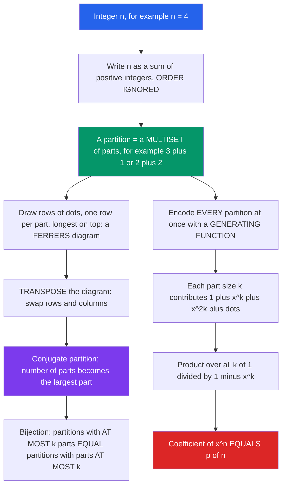

# 🧩 Integer Partitions

> [!abstract] TL;DR
> An **integer partition** of $n$ is a way to write $n$ as a sum of positive integers where **order does not matter** ($4 = 3+1 = 2+2 = 2+1+1 = 1+1+1+1$, so $p(4)=5$). The partition function $p(n)$ has **no simple closed form**, grows almost mystically fast, and its study — Ferrers diagrams, the generating function $\prod_k 1/(1-x^k)$, Euler's identities, the Hardy–Ramanujan asymptotic, and Ramanujan's congruences — turns elementary counting into deep number theory and even statistical physics.

---

## Intuition

**Analogy:** In how many ways can you write **4** as a sum of positive integers, ignoring order?

$$4,\quad 3+1,\quad 2+2,\quad 2+1+1,\quad 1+1+1+1$$

Five ways. That is the partition function $p(4)=5$. It sounds like child's play — a game a schoolchild can play with pennies — yet $p(n)$ grows with astonishing, almost mystical speed: $p(10)=42$, $p(100)$ is already $190{,}569{,}292$, and $p(1000)$ has 32 digits. Its study drew in **Euler**, **Ramanujan**, and **Hardy**, revealing jaw-dropping identities (the number of partitions into *distinct* parts secretly equals the number into *odd* parts) and deep links between pure counting, number theory, and even the physics of energy levels. Partitions are where elementary counting suddenly becomes profound.

The crucial contrast: a **partition** ignores order, so $3+1$ and $1+3$ are the *same* partition. If order *did* matter you would be counting **compositions** instead — and there are exactly $2^{n-1}$ of those, a clean closed form. Drop the ordering and the clean formula evaporates: no elementary formula for $p(n)$ exists. That single act of forgetting order is what makes partitions hard, and interesting.

---

## How It Works

### Core Mechanics

1. **A partition is a multiset of parts.** Formally, a partition of $n$ is a weakly decreasing sequence $\lambda_1 \ge \lambda_2 \ge \cdots \ge \lambda_\ell \ge 1$ with $\sum_i \lambda_i = n$. The $\lambda_i$ are the **parts**; $\ell$ is the number of parts. Writing parts in decreasing order is just bookkeeping to kill the ordering ambiguity.

2. **Draw it: the Ferrers diagram.** Stack $\lambda_1$ dots in the top row, $\lambda_2$ in the next, and so on — left-justified. This picture of the partition (dots for Ferrers, boxes for the **Young diagram**) is the geometric object that unlocks proofs.

3. **Conjugation = transpose.** Reflect the diagram across its main diagonal (swap rows and columns). The result is another partition $\lambda'$, the **conjugate**, whose $i$-th part counts how many original parts are $\ge i$. Conjugation is an involution ($\lambda'' = \lambda$) and instantly proves a symmetry: *the number of partitions of $n$ with **at most $k$ parts** equals the number with **all parts $\le k$***, because transposing turns "number of rows" into "length of the longest row." This is a **bijective proof** — no algebra, just flipping a picture.

4. **Encode all partitions at once: the generating function.** For each part size $k$, you may use it $0, 1, 2, \dots$ times, contributing the geometric series $1 + x^k + x^{2k} + \cdots = \dfrac{1}{1-x^k}$. Multiply over all part sizes:
   $$\sum_{n=0}^{\infty} p(n)\,x^n \;=\; \prod_{k=1}^{\infty} \frac{1}{1-x^k}.$$
   Picking the $x^n$ coefficient re-assembles every way to choose "how many 1's, how many 2's, ..." summing to $n$ — exactly a partition.

5. **Restrict the product, restrict the parts.** Swapping factors gives restricted counts for free: partitions into **distinct** parts use each size at most once, so their generating function is $\prod_k (1+x^k)$; partitions into **odd** parts use only odd sizes, giving $\prod_{k\ \text{odd}} \frac{1}{1-x^k}$. Euler's algebra shows these two products are *equal*, hence the counts are equal (see Key Concepts).

6. **Euler's pentagonal-number theorem gives a fast recurrence.** Expanding the *reciprocal* $\prod_k (1-x^k)$ collapses to a sparse alternating series over **generalized pentagonal numbers** $g_j = \tfrac{j(3j\mp 1)}{2}$, yielding
   $$p(n) = \sum_{j\ge 1} (-1)^{j-1}\Big[\,p\!\left(n - \tfrac{j(3j-1)}{2}\right) + p\!\left(n - \tfrac{j(3j+1)}{2}\right)\Big],$$
   which computes $p(n)$ in $O(n^{1.5})$ time — far faster than enumeration.

### Flow / Architecture



---

## Key Concepts

### Secondary (school-level)
- **Partition vs. composition.** A partition ignores order ($3+1 = 1+3$); a composition counts order ($3+1 \ne 1+3$). There are $2^{n-1}$ compositions of $n$ but only $p(n)$ partitions.
- **The partition function $p(n)$.** $p(0)=1$ (the empty sum), $p(1)=1$, $p(2)=2$, $p(3)=3$, $p(4)=5$, $p(5)=7$, $p(6)=11$. It is *not* $2^{n-1}$, not a polynomial, and has no elementary closed form.
- **Ferrers diagram.** Rows of dots, one per part, longest on top — a picture of the partition.

### Undergraduate (discrete math / generating functions)
- **Generating function.** $\displaystyle\sum_{n\ge 0} p(n)x^n = \prod_{k\ge 1}\frac{1}{1-x^k}$. Restricted variants: distinct parts $\prod_k(1+x^k)$; parts $\le m$ is $\prod_{k=1}^{m} \frac{1}{1-x^k}$; parts used $< m$ times, etc. This is the engine room of the whole theory.
- **Conjugation symmetry.** Transposing a Ferrers diagram is a bijection proving: (#partitions of $n$ with $\le k$ parts) $=$ (#partitions of $n$ with largest part $\le k$); and (#self-conjugate partitions) $=$ (#partitions into distinct *odd* parts).
- **Euler's distinct = odd identity.** The number of partitions of $n$ into **distinct** parts equals the number into **odd** parts. Algebraically, $\prod_k(1+x^k) = \prod_k \frac{1-x^{2k}}{1-x^k} = \prod_{k\ \text{odd}}\frac{1}{1-x^k}$ (the even factors telescope away). **Glaisher's** and **Franklin's** bijections give explicit combinatorial proofs.
- **Pentagonal-number theorem & recurrence.** $\prod_{k\ge 1}(1-x^k) = \sum_{j=-\infty}^{\infty} (-1)^j x^{j(3j-1)/2}$, which inverts into the sparse alternating recurrence for $p(n)$ above.

### Graduate (asymptotics & number theory)
- **Hardy–Ramanujan asymptotic.** Via the **circle method** on the generating function (a contour integral picking off $x^n$, dominated by singularities on the unit circle),
  $$p(n) \sim \frac{1}{4n\sqrt{3}}\,\exp\!\left(\pi\sqrt{\tfrac{2n}{3}}\right) \quad (n\to\infty).$$
  Rademacher later upgraded this to a **convergent exact series**. The $\exp(c\sqrt{n})$ growth is sub-exponential yet super-polynomial — the fingerprint of unrestricted partitions.
- **Ramanujan's congruences.** Astonishing arithmetic hidden in a counting function:
  $$p(5n+4)\equiv 0 \pmod 5,\quad p(7n+5)\equiv 0 \pmod 7,\quad p(11n+6)\equiv 0 \pmod{11}.$$
  These launched the theory of **modular forms** and **mock theta functions** applied to partitions.
- **Foreshadowing symmetric functions.** Filling a Young diagram with increasing entries gives **Young tableaux**, indexing bases of symmetric functions and irreducible representations of the symmetric group $S_n$ — partitions are the *labels* of an entire branch of algebraic combinatorics and representation theory.

---

## Python Demo

```python
# Demonstrates:
# (a) compute p(n) two ways -- the generating-function product  prod_k 1/(1-x^k)
#     AND Euler's pentagonal-number recurrence -- and VERIFY both against a
#     brute-force enumeration of partitions for small n;
# (b) verify Euler's identity  #(distinct parts) = #(odd parts)  by direct counting
#     AND at the generating-function level; visualize a Ferrers diagram + conjugate.
# Plots: p(n) growth vs Hardy-Ramanujan asymptotic, the distinct=odd check,
#        and a Ferrers diagram beside its transpose.
import numpy as np
import matplotlib.pyplot as plt

N = 60

# ------------------------------------------------------------------
# (a1) p(n) via the GENERATING FUNCTION product  prod_k 1/(1-x^k).
#      Multiplying the running series by 1/(1-x^k) = 1 + x^k + x^2k + ...
#      is exactly the "unbounded coin-change" DP:  gf[i] += gf[i-k].
# ------------------------------------------------------------------
gf = [0] * (N + 1)
gf[0] = 1
for k in range(1, N + 1):
    for i in range(k, N + 1):
        gf[i] += gf[i - k]          # exact Python big-ints, no overflow

# ------------------------------------------------------------------
# (a2) p(n) via EULER'S PENTAGONAL-NUMBER RECURRENCE (O(n^1.5)).
# ------------------------------------------------------------------
def partition_pentagonal(N):
    p = [0] * (N + 1)
    p[0] = 1
    for n in range(1, N + 1):
        total, j = 0, 1
        while True:
            g1 = j * (3 * j - 1) // 2          # generalized pentagonal numbers
            g2 = j * (3 * j + 1) // 2
            if g1 > n:
                break
            sign = 1 if j % 2 == 1 else -1
            total += sign * p[n - g1]
            if g2 <= n:
                total += sign * p[n - g2]
            j += 1
        p[n] = total
    return p

p_rec = partition_pentagonal(N)

# ------------------------------------------------------------------
# (a3) BRUTE-FORCE enumeration (ground truth) for small n.
# ------------------------------------------------------------------
def partitions(n, max_part=None):
    if max_part is None:
        max_part = n
    if n == 0:
        yield ()
        return
    for first in range(min(n, max_part), 0, -1):
        for rest in partitions(n - first, first):   # non-increasing -> unordered
            yield (first,) + rest

for n in range(0, 13):
    brute = sum(1 for _ in partitions(n))
    assert brute == gf[n] == p_rec[n], (n, brute, gf[n], p_rec[n])
print("p(n): generating function == pentagonal recurrence == brute force  (n=0..12)  OK")
print(f"p(4)={gf[4]}  p(10)={gf[10]}  p(50)={gf[50]}  p(60)={gf[60]}")

# Ramanujan congruence p(5n+4) == 0 (mod 5) -- exact ints make mod meaningful.
assert all(gf[5 * n + 4] % 5 == 0 for n in range((N - 4) // 5 + 1))
print("Ramanujan congruence p(5n+4) = 0 (mod 5): verified up to N")

# ------------------------------------------------------------------
# (b) EULER: #partitions into DISTINCT parts == #partitions into ODD parts.
# ------------------------------------------------------------------
def count_distinct_parts(n):                      # each size used at most once
    def gen(n, max_part):
        if n == 0:
            yield (); return
        for first in range(min(n, max_part), 0, -1):
            for rest in gen(n - first, first - 1):    # strictly decreasing
                yield (first,) + rest
    return sum(1 for _ in gen(n, n))

def count_odd_parts(n):                            # only odd sizes, repeats OK
    def gen(n, max_part):
        if n == 0:
            yield (); return
        start = min(n, max_part)
        if start % 2 == 0:
            start -= 1
        for first in range(start, 0, -2):
            for rest in gen(n - first, first):
                yield (first,) + rest
    return sum(1 for _ in gen(n, n))

assert all(count_distinct_parts(n) == count_odd_parts(n) for n in range(1, 21))
print("Euler's identity #distinct == #odd: verified by direct counting (n=1..20)")

# Same identity at the GENERATING-FUNCTION level, for ALL n up to N:
d = [0] * (N + 1); d[0] = 1                        # prod_k (1 + x^k): 0/1 knapsack
for k in range(1, N + 1):
    for i in range(N, k - 1, -1):
        d[i] += d[i - k]
o = [0] * (N + 1); o[0] = 1                        # prod_{k odd} 1/(1-x^k)
for k in range(1, N + 1, 2):
    for i in range(k, N + 1):
        o[i] += o[i - k]
assert d == o
print("Euler's identity confirmed via generating functions (all n up to N)")

# Ferrers diagram + its CONJUGATE (transpose).
def conjugate(lmb):
    if not lmb:
        return ()
    return tuple(sum(1 for p in lmb if p >= i) for i in range(1, lmb[0] + 1))

lam = (4, 3, 1)
print("lambda =", lam, " conjugate =", conjugate(lam),
      " (sums match:", sum(lam) == sum(conjugate(lam)), ")")

# ------------------------------------------------------------------
# PLOTS
# ------------------------------------------------------------------
fig, (ax1, ax2, ax3) = plt.subplots(1, 3, figsize=(16, 5))

# Panel 1: p(n) growth vs Hardy-Ramanujan asymptotic (log scale).
ns = np.arange(1, N + 1)
pn = np.array([gf[n] for n in ns], dtype=float)
hr = np.exp(np.pi * np.sqrt(2 * ns / 3)) / (4 * ns * np.sqrt(3))
ax1.semilogy(ns, pn, "o", ms=4, label="p(n) exact")
ax1.semilogy(ns, hr, "-", lw=2, label="Hardy-Ramanujan asymptotic")
ax1.set(title="Partition function p(n) growth", xlabel="n", ylabel="p(n)  [log scale]")
ax1.legend()

# Panel 2: distinct == odd identity as paired bars.
ms = np.arange(1, 21)
dcnt = np.array([count_distinct_parts(int(m)) for m in ms])
ocnt = np.array([count_odd_parts(int(m)) for m in ms])
w = 0.4
ax2.bar(ms - w / 2, dcnt, w, label="distinct parts")
ax2.bar(ms + w / 2, ocnt, w, label="odd parts")
ax2.set(title="Euler: #distinct = #odd", xlabel="n", ylabel="number of partitions")
ax2.legend()

# Panel 3: Ferrers diagram and its conjugate.
def draw_ferrers(ax, lmb, color, x0, label):
    for r, part in enumerate(lmb):
        for c in range(part):
            ax.plot(x0 + c, -r, "o", color=color, ms=12)
    ax.text(x0, 0.8, label, fontsize=11, color=color)

draw_ferrers(ax3, lam, "#2563eb", 0.0, f"lambda = {lam}")
draw_ferrers(ax3, conjugate(lam), "#dc2626", 6.0, f"conjugate = {conjugate(lam)}")
ax3.set_title("Ferrers diagram and its conjugate (transpose)")
ax3.set_aspect("equal"); ax3.axis("off")

plt.tight_layout()
plt.savefig("integer_partitions.png", dpi=120)
print("Saved integer_partitions.png")
```

Running it prints that all three methods for $p(n)$ agree (e.g. `p(50)=204226`, `p(60)=966467`), confirms Ramanujan's mod-5 congruence, verifies Euler's distinct=odd identity both by enumeration and via generating functions, and saves a three-panel figure: $p(n)$ hugging the Hardy–Ramanujan curve on a log axis, the distinct/odd bars sitting at identical heights, and the partition $(4,3,1)$ beside its conjugate $(3,2,2,1)$.

---

## Real-World Applications

> **Example — Bose–Einstein statistics and energy-level counting.** In quantum statistical mechanics, the number of ways to distribute a fixed amount of energy among indistinguishable bosonic quanta occupying equally spaced energy levels is *literally* a partition count: distributing $n$ energy units is the same as partitioning $n$. The thermodynamic **partition function** of such a system is the generating function $\prod_k 1/(1-x^k)$ evaluated at the Boltzmann weight $x = e^{-\beta\epsilon}$ — the exact object combinatorialists call the partition generating function. Hardy–Ramanujan's $\exp(\pi\sqrt{2n/3})$ growth reappears as the Cardy-formula entropy of a 2D gas of oscillators.

- **Symmetric functions & representation theory.** Partitions of $n$ index the irreducible representations of the symmetric group $S_n$ and a basis (Schur functions) of the ring of symmetric functions — foundational to algebraic combinatorics and to the analysis of random matrices.
- **Random-structure asymptotics.** The Hardy–Ramanujan/circle-method machinery is the template for counting many "unordered composite" structures (factorizations, set partitions, Young-tableau statistics), and the limit shape of a random partition (the Vershik curve) is a probabilistic analogue of the bell curve.
- **Dynamic programming benchmark.** The "coin change / subset-sum" DP that computes $p(n)$ is a canonical teaching example; restricted-partition generating functions model change-making, integer knapsack feasibility, and generating-function-based counting in competitive programming.
- **Cryptography and number theory.** Ramanujan's congruences and the modular-forms viewpoint on $p(n)$ feed into the arithmetic of $q$-series that underlies parts of analytic number theory.

---

## Common Pitfalls

- **Confusing partitions with compositions (order).** In a partition, order is irrelevant, so $3+1$ and $1+3$ are the *same*; in a composition they differ. Compositions of $n$ number $2^{n-1}$ (a clean closed form); partitions number $p(n)$ (no elementary formula). Accidentally counting ordered sums inflates your answer dramatically.
- **Expecting a closed form for $p(n)$.** There is no polynomial or simple product formula. Use the **pentagonal-number recurrence** (fast, exact) or the DP over the generating function; reach for the **Hardy–Ramanujan asymptotic** only for large-$n$ estimates, not exact values.
- **Forgetting the conjugation symmetry.** Many "restricted partition" identities (at most $k$ parts $\leftrightarrow$ parts at most $k$) are *free* once you transpose the Ferrers diagram. Re-deriving them algebraically when a one-line bijection exists wastes effort — and missing the symmetry leads to double-counting.
- **Mismatching restricted-partition generating functions.** Distinct parts use $\prod_k(1+x^k)$ (each factor a 0/1 choice — a *bounded* knapsack, iterate the DP index **downward**); repeats-allowed parts use $\prod_k \frac{1}{1-x^k}$ (unbounded — iterate **upward**). Swapping the loop direction silently computes the wrong count.
- **Off-by-one at $p(0)$.** The empty partition is a valid partition of $0$, so $p(0)=1$. Recurrences and DP base cases that set $p(0)=0$ break every downstream value.
- **Naive enumeration blowup.** Listing all partitions to *count* them is exponential; $p(200)$ already exceeds $10^{12}$. Count with the recurrence/generating function; only *enumerate* for tiny $n$ or when you truly need the list.

*Sibling notes planned in this vault: **Compositions_and_Multisets** (ordered sums, where $2^{n-1}$ lives), **Young_Tableaux_and_Symmetric_Functions** (fillings of these diagrams), **Asymptotic_Enumeration** (the circle method behind Hardy–Ramanujan), and **Stirling_and_Bell_Numbers** (the *set*-partition cousins of these *integer* partitions).*

---

## Related Concepts

- [[Combinatorics]] — parent toolkit; integer partitions are the canonical "unordered decomposition" counting problem beside permutations and combinations.
- [[Generating_Functions]] — sibling note; the product $\prod_k 1/(1-x^k)$ that encodes $p(n)$ is the flagship application of the generating-function method.
- [[Generating_Functions_and_Recurrences]] — the pentagonal-number theorem is a generating-function identity that inverts into the $p(n)$ recurrence.
- [[Recurrence_Relations_and_Counting]] — Euler's pentagonal recurrence is a sparse linear recurrence computing $p(n)$ in $O(n^{1.5})$.
- [[Number_Theory_Elementary]] — Ramanujan's congruences $p(5n+4)\equiv 0\ (\mathrm{mod}\ 5)$ are pure arithmetic hidden inside a counting function, the gateway to modular forms.
- [[Permutations_and_Combinations]] — partitions drop *both* order and the fixed-size constraint of combinations; contrasting them sharpens what "unordered" and "with repetition" really mean.
- [[Catalan_Numbers]] — a neighbouring advanced-counting sequence with its own generating function and rich bijective story.
- [[The_Binomial_Theorem_and_Coefficients]] — binomial coefficients count ordered/bounded selections with a closed form; partitions are the sibling problem where the closed form vanishes.
- [[Partition_Functions_and_Free_Energy_in_ML]] — the physics/ML "partition function" $Z$ is the same generating-function idea (a normalizing sum over states); this note is the pure-counting root of that concept.
- [[Quantum_Statistical_Mechanics]] — distributing energy quanta over oscillator levels *is* integer partitioning; the thermodynamic partition function is $\prod_k 1/(1-x^k)$ at $x=e^{-\beta\epsilon}$.
- [[Residue_Theorem_and_Applications]] — the Hardy–Ramanujan asymptotic comes from the **circle method**, a contour integral extracting $p(n)$ from the singularities of its generating function on the unit circle.
- [[Combinatorics_Overview]] — the map note placing partitions within the broader counting landscape.

---

## Review Questions

1. **(Secondary)** List every partition of $6$ and confirm $p(6)=11$. Then explain, using $3+2$ versus $2+3$, why the number of *compositions* of $6$ is much larger — and state that count.
2. **(Undergraduate)** Prove Euler's identity that the number of partitions of $n$ into distinct parts equals the number into odd parts, using generating functions: show $\prod_{k\ge 1}(1+x^k) = \prod_{k\ \text{odd}} \frac{1}{1-x^k}$. Then describe what the *conjugate* of the partition $(5,3,3,1)$ is by transposing its Ferrers diagram.
3. **(Graduate)** The generating function is $\sum_n p(n)x^n = \prod_k \frac{1}{1-x^k}$, which has its dominant singularity at $x=1$. Sketch how the **circle method** converts the local behavior near that singularity into the asymptotic $p(n)\sim \frac{1}{4n\sqrt3}\exp(\pi\sqrt{2n/3})$, and explain why unrestricted partitions grow like $\exp(c\sqrt n)$ rather than exponentially or polynomially in $n$.

---

## Sources

- G. E. Andrews, *The Theory of Partitions*, Cambridge University Press (Encyclopedia of Mathematics and Its Applications, 1976/1998).
- G. E. Andrews & K. Eriksson, *Integer Partitions*, Cambridge University Press, 2004.
- G. H. Hardy & S. Ramanujan, "Asymptotic formulae in combinatory analysis," *Proc. London Math. Soc.* (2) 17 (1918), 75–115.
- R. P. Stanley, *Enumerative Combinatorics*, Vol. 1 (2nd ed.), Cambridge University Press, 2011 — Ch. 1 (partitions and generating functions).
- G. Graham, D. Knuth & O. Patashnik, *Concrete Mathematics*, Ch. 7 (Generating Functions) — for the product-formula viewpoint.

---

#combinatorics #integer-partitions #partition-function #ferrers-diagrams #generating-functions
