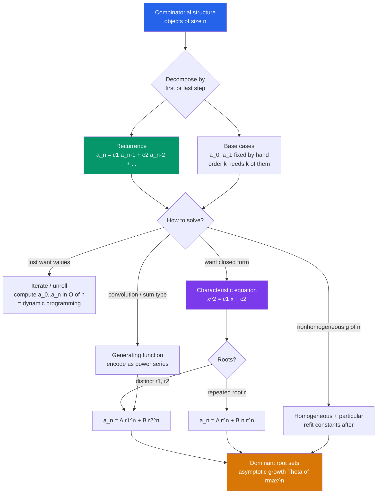

# 🔁 Recurrence Relations and Counting

> [!abstract] TL;DR
> A **recurrence relation** counts objects of size `n` by relating that count to the counts for smaller sizes plus a few hand-computed **base cases**. Setting up the recurrence — usually by a *first-step* or *last-step* decomposition of the combinatorial structure — is most of the work; solving it (by iteration, the **characteristic equation**, or generating functions) then yields a closed form and the asymptotic growth rate.

---

## Intuition

**Analogy — climbing a staircase.** How many ways can you climb a staircase of `n` steps if each move goes up either 1 step or 2 steps? Think about your *very last move*. It either landed you on step `n` from step `n-1` (a single step) or from step `n-2` (a double step). Those two possibilities never overlap and cover every route, so the number of ways to reach step `n` is exactly the number of ways to reach step `n-1` **plus** the number of ways to reach step `n-2`. That single sentence *is* a recurrence — and it produces the **Fibonacci numbers**.

This is the essence of counting with recurrences: **solve a big counting problem by relating it to smaller copies of itself.** You do not enumerate all routes; you notice that every route decomposes at one joint (the first or last move) into a smaller route of the same kind, then you add up the disjoint cases. Most things worth counting satisfy such a relation, and *finding* the relation is usually the entire battle — once you have `a_n` in terms of earlier terms plus base cases, the rest is machinery.

---

## How It Works

### Core Mechanics

**1. Set up the recurrence from structure.** Pick a *decomposition point* and split the objects of size `n` into disjoint cases based on one local choice, so each case reduces to a smaller instance of the same problem:

- **Last-step / first-step decomposition** (Fibonacci tilings, staircase): a `2×n` board tiled by dominoes either ends in one vertical domino (leaving a `2×(n-1)` board) or in two stacked horizontal dominoes (leaving a `2×(n-2)` board), so `a_n = a_{n-1} + a_{n-2}`. Binary strings of length `n` with **no two consecutive 1s** obey the same relation.
- **Remove-one-element decomposition** (subsets, derangements): a **derangement** of `n` items satisfies `D_n = (n-1)(D_{n-1} + D_{n-2})` by asking where element 1 goes and whether the swap is reciprocal.
- **Split-at-a-pivot decomposition** (Catalan): the number of ways to parenthesize, triangulate, or build binary trees gives the **Catalan** recurrence `C_n = Σ_{k=0}^{n-1} C_k · C_{n-1-k}` — a *convolution*, best handled with generating functions.
- **Move-a-tower decomposition** (Tower of Hanoi): moving `n` disks means moving `n-1` disks aside, moving the big disk, then moving `n-1` back, giving `T_n = 2·T_{n-1} + 1` — a **nonhomogeneous** linear recurrence.

**2. Nail the base cases.** A recurrence of *order* `k` (reaching back `k` terms) needs exactly `k` base cases; they anchor the whole sequence and are the number-one source of off-by-one bugs. Compute them by hand from the definition (e.g. `a_0 = 1` for the empty object).

**3. Solve it.** Three standard routes:

- **Iteration / unrolling** — just compute `a_0, a_1, …, a_n` in order (dynamic programming). Gives values in `O(n)` but no closed form.
- **Characteristic equation** (linear, constant-coefficient, homogeneous). For `a_n = c_1 a_{n-1} + … + c_k a_{n-k}`, guess `a_n = x^n`, divide by `x^{n-k}`, and get the **characteristic polynomial** `x^k = c_1 x^{k-1} + … + c_k`. For **distinct roots** `r_1,…,r_k` the general solution is `a_n = A_1 r_1^n + … + A_k r_k^n`; a **root of multiplicity m** contributes `(A_0 + A_1 n + … + A_{m-1} n^{m-1}) r^n`. Fix the constants from the base cases. For Fibonacci this yields **Binet's formula** with the golden ratio `φ`.
- **Nonhomogeneous** `a_n = (linear part) + g(n)`: solve as **homogeneous solution + a particular solution** guessed to match `g(n)` (a constant for constant `g`, a polynomial for polynomial `g`), then re-fit constants using the base cases *after* adding the particular part.

**4. Read off the growth.** The **dominant characteristic root** (largest `|r|`) sets the asymptotic growth: `a_n = Θ(r_max^n)` for exponential recurrences. Ratios `a_{n+1}/a_n → r_max`.

**Divide-and-conquer link.** Recurrences of the form `T(n) = a·T(n/b) + f(n)` (from splitting a problem into `a` pieces of size `n/b`) are solved by the **Master Theorem**, not the characteristic equation — a different, multiplicative flavor of recurrence covered in the DSA vault.

### Flow / Architecture



---

## Key Concepts

### Secondary (intuitive level)
- **A recurrence is a "count that leans on smaller counts."** To get `a_n`, combine `a_{n-1}`, `a_{n-2}`, etc., the way each Fibonacci number is the sum of the two before it.
- **Base cases are the seeds.** The first one or two values are computed by hand; everything else grows from them.
- **Staircase / tiling picture.** Ways to climb `n` steps (1 or 2 at a time) = ways to tile a `2×n` strip with dominoes = Fibonacci.

### Undergraduate (formal level)
- **Order and homogeneity.** A linear recurrence `a_n = c_1 a_{n-1} + … + c_k a_{n-k} + g(n)` has *order* `k`; it is **homogeneous** when `g(n)=0` and **constant-coefficient** when the `c_i` are constants.
- **Characteristic equation method.** Substitute `a_n = x^n` into the homogeneous relation to get the characteristic polynomial; **distinct roots** give `Σ A_i r_i^n`, a **root of multiplicity m** contributes the extra polynomial factors `n^0,…,n^{m-1}` times `r^n`. Constants come from the base cases.
- **Nonhomogeneous solutions** = general homogeneous solution + one particular solution matched to `g(n)`; resonance (when `g`'s form is already a homogeneous root) forces an extra factor of `n`.
- **Iteration = dynamic programming.** Bottom-up tabulation of a recurrence is exactly memoized recursion; the recurrence is the DP transition.
- **Growth from the dominant root.** The largest-modulus root controls the asymptotics; for Fibonacci, `F_n ≈ φ^n / √5`.

### Graduate (structural level)
- **Generating-function unification.** Encoding `(a_n)` as `A(x) = Σ a_n x^n` turns a linear recurrence into an algebraic equation; partial fractions of the resulting **rational** generating function *reproduce* the characteristic-root closed form, and the poles are exactly the reciprocals of the characteristic roots. Convolution recurrences (Catalan) that resist the characteristic method fall to this approach.
- **Matrix / transfer-matrix form.** A finite-order linear recurrence is `v_n = M v_{n-1}` with a companion matrix `M`; the characteristic polynomial of `M` *is* the recurrence's characteristic equation, and `a_n` is read from `M^n`. Solving is therefore **eigen-decomposition**: eigenvalues are the roots, and `M^n = P Λ^n P^{-1}` gives the closed form. This is the linear-algebra face of the same computation and yields `O(log n)` evaluation by fast matrix exponentiation.
- **Analogy with linear ODEs.** Constant-coefficient linear recurrences are the discrete twin of constant-coefficient linear ODEs: the "guess `e^{λt}`" of ODEs becomes "guess `x^n`", and both reduce to the *same* characteristic polynomial with the same distinct/repeated-root case split.
- **Asymptotic enumeration.** When only the growth rate matters, singularity analysis of the generating function (location and type of the dominant singularity) delivers `a_n`'s asymptotics directly — the analytic-combinatorics generalization of "dominant root."

---

## Python Demo

```python
# Recurrences as a counting tool, then solving via the characteristic equation.
# (a) COUNT binary strings of length n with NO two consecutive 1s by deriving the
#     recurrence a_n = a_{n-1} + a_{n-2}, and VERIFY it against brute-force enumeration.
# (b) SOLVE that linear recurrence with the CHARACTERISTIC EQUATION to get a closed
#     form (Binet-style), confirm it matches iteration, and read off the growth
#     rate = dominant characteristic root.
import numpy as np
import matplotlib.pyplot as plt
from itertools import product

# ---------- (a) set up the recurrence from the combinatorial structure ----------
# Last-symbol decomposition: a valid length-n string ends in '0' (prefix = any valid
# length n-1) OR ends in '1', which forces the previous symbol to be '0' (prefix =
# any valid length n-2 followed by '0'). Disjoint & exhaustive => a_n = a_{n-1}+a_{n-2}.
def count_iterative(n):
    a = [1, 2]                       # base cases: a_0 = 1 (""),  a_1 = 2 ("0","1")
    if n < 2:
        return a[n]
    for k in range(2, n + 1):
        a.append(a[-1] + a[-2])      # a_k = a_{k-1} + a_{k-2}
    return a[n]

def count_bruteforce(n):
    return sum("11" not in "".join(s) for s in product("01", repeat=n))

N = 12
iter_counts  = np.array([count_iterative(n)  for n in range(N + 1)])
brute_counts = np.array([count_bruteforce(n) for n in range(N + 1)])
assert np.array_equal(iter_counts, brute_counts)      # the recurrence matches reality
print("recurrence values :", iter_counts)
print("brute-force values:", brute_counts, " (match)")

# ---------- (b) solve via the CHARACTERISTIC EQUATION ----------
# Recurrence  a_n = a_{n-1} + a_{n-2}  ->  characteristic poly  x^2 - x - 1 = 0.
roots = np.roots([1, -1, -1])                         # the two roots: phi and psi
phi = roots.max()                                     # dominant root ~ 1.618 (golden ratio)
print("characteristic roots:", np.sort(roots), " dominant =", round(phi, 6))

# Closed form a_n = A*r0^n + B*r1^n; fit A,B to the base cases via the 2x2
# Vandermonde system  [[1, 1], [r0, r1]] @ [A, B] = [a_0, a_1] = [1, 2].
r0, r1 = roots
V = np.array([[1.0, 1.0], [r0, r1]])
A, B = np.linalg.solve(V, np.array([1.0, 2.0]))
ns = np.arange(N + 1)
closed_form = np.real(A * r0**ns + B * r1**ns)
assert np.allclose(closed_form, iter_counts)          # closed form == iterated values
print("closed form matches iteration:", np.allclose(closed_form, iter_counts))

# growth rate: successive ratios converge to the dominant root
ratios = iter_counts[1:] / iter_counts[:-1]

# ------------------------------- visualization -------------------------------
fig, (ax1, ax2) = plt.subplots(1, 2, figsize=(13, 5))

ax1.plot(ns, iter_counts, "o-", color="#2563eb", lw=2, label="iterated recurrence")
ax1.plot(ns, closed_form, "x", color="#dc2626", ms=9, mew=2,
         label="closed form  A*r0^n + B*r1^n")
ax1.set_yscale("log")
ax1.set_xlabel("string length n")
ax1.set_ylabel("count of valid strings (log scale)")
ax1.set_title("Counting sequence: recurrence == closed form")
ax1.legend(); ax1.grid(True, which="both", ls=":", alpha=0.5)

ax2.plot(ns[1:], ratios, "s-", color="#059669", lw=2, label="ratio a_(n+1)/a_n")
ax2.axhline(phi, color="#d97706", ls="--", lw=2, label=f"dominant root phi = {phi:.4f}")
ax2.set_xlabel("n"); ax2.set_ylabel("successive ratio")
ax2.set_title("Growth rate -> dominant characteristic root")
ax2.legend(); ax2.grid(True, ls=":", alpha=0.5)

plt.tight_layout()
plt.savefig("recurrence_counting.png", dpi=120)
plt.show()
```

Running it prints the sequence `1, 2, 3, 5, 8, 13, …` from **both** the recurrence and brute-force enumeration (they match, confirming the derived relation), reports the characteristic roots with dominant `φ ≈ 1.618034`, verifies the closed form reproduces every iterated value, and plots the exponentially growing count against its closed form plus the successive ratios converging to the golden ratio.

---

## Real-World Applications

> **Example — the Fibonacci recurrence in the wild.** Dynamic-programming problems such as "Climbing Stairs" and "House Robber" are *the counting-recurrence method applied directly*: the DP transition `dp[i] = dp[i-1] + dp[i-2]` is the last-step decomposition, computed by iteration. The characteristic-root view is what lets you evaluate the same sequence in `O(log n)` via fast matrix exponentiation of the companion matrix.

- **Algorithm analysis.** Running-time recurrences (`T(n) = 2T(n/2) + n` for merge sort, `T(n) = T(n-1) + T(n-2)` for naive Fibonacci) are solved to get complexity; the divide-and-conquer family uses the **Master Theorem** while the subtractive family uses the characteristic equation.
- **Population and finance models.** The original Fibonacci rabbit model, discrete population dynamics, and compound-interest-with-deposits balances (`b_n = (1+r)b_{n-1} + d`) are nonhomogeneous linear recurrences whose closed forms give the year-`n` value without simulating every step.
- **Combinatorial enumeration.** Counting lattice paths, non-crossing structures (Catalan), permutations avoiding patterns, and the number of ways to make change all reduce to recurrences; ways-to-make-change is a counting recurrence over coin denominations.
- **Signal processing and control.** Linear constant-coefficient **difference equations** (the recurrence's engineering name) define IIR digital filters; their stability is exactly whether the characteristic roots lie inside the unit circle.

---

## Common Pitfalls

- **Wrong or missing base cases.** An order-`k` recurrence needs exactly `k` seeds. Using `a_0 = 0` instead of `1` for "the empty object counts as one arrangement," or supplying only one base case for a second-order relation, silently shifts the *entire* sequence. Always re-derive base cases from the definition, not by pattern-matching.
- **Off-by-one in the index.** Deciding whether the empty configuration is `a_0` or `a_1`, and whether the recurrence starts at `n=2` or `n=3`, is the classic bug. Tabulate the first few terms by brute force and check them against the recurrence before trusting it.
- **Repeated characteristic roots handled as distinct.** A double root `r` does **not** give `A r^n + B r^n` (that is just one degree of freedom). It gives `(A + B n) r^n`. Forgetting the `n` factor makes the closed form unable to satisfy two independent base cases.
- **Nonhomogeneous term ignored or mis-guessed.** For `a_n = 2 a_{n-1} + 1` you must add a *particular* solution (here a constant) to the homogeneous part, and **refit the constants using the base cases only after** including the particular part. If the forcing term `g(n)` already matches a homogeneous root (resonance), multiply the trial particular solution by `n`.
- **Nonlinear recurrences treated as linear.** The characteristic-equation method applies *only* to linear, constant-coefficient recurrences. Convolution/product recurrences like Catalan's are nonlinear in the sequence and need generating functions instead — do not force a characteristic polynomial on them.
- **Confusing the recurrence with the count.** The recurrence is the *rule*; the sequence it generates is the *answer*. Deriving a correct relation is only half the job — you still owe correct base cases and a solve (or at least an iterated evaluation) to produce the actual number.

---

## Related Concepts

- [[Mathematics/04_Discrete_Mathematics/Generating_Functions_and_Recurrences|Generating Functions and Recurrences]] — the algebraic power tool that unifies the characteristic method and cracks convolution recurrences the characteristic equation cannot.
- [[Mathematics/04_Discrete_Mathematics/Combinatorics|Combinatorics]] — the parent field supplying the structures (subsets, strings, tilings, paths) that we decompose into recurrences.
- [[Mathematics/03_Linear_Algebra/Eigenvalues_and_Eigenvectors|Eigenvalues and Eigenvectors]] — the companion-matrix view where characteristic roots are eigenvalues and `a_n` is read from `M^n = P Λ^n P^{-1}`.
- [[Mathematics/07_Differential_Equations/Second_Order_Linear_ODEs|Second-Order Linear ODEs]] — the continuous twin: "guess `e^{λt}`" versus "guess `x^n`", the *same* characteristic polynomial and distinct/repeated-root split.
- [[DSA/00_Complexity_Analysis/Master_Theorem|Master Theorem]] — solves the divide-and-conquer recurrences `T(n) = a·T(n/b) + f(n)` that the characteristic method does not handle.
- [[DSA/09_Recursion_Backtracking/Divide_and_Conquer|Divide and Conquer]] — the algorithmic strategy whose cost is expressed as (and solved by) a recurrence.
- [[DSA/10_Dynamic_Programming/Memoization_vs_Tabulation|Memoization vs Tabulation]] — iterating a recurrence bottom-up *is* tabulation; memoized recursion is the same recurrence top-down.
- [[DSA/10_Dynamic_Programming/DP_Patterns|DP Patterns]] — the Fibonacci-style and interval-split DP transitions are counting recurrences in disguise.
- [[DSA/10_Dynamic_Programming/Coin_Change|Coin Change]] — counting ways to make change is a canonical counting recurrence over denominations.
- [[Combinatorics/01_Foundations_of_Counting/The_Sum_and_Product_Rules|The Sum and Product Rules]] — the sum rule (disjoint cases) is exactly what justifies adding the sub-counts in a recurrence's decomposition.
- [[Combinatorics/01_Foundations_of_Counting/Permutations_and_Combinations|Permutations and Combinations]] — derangements and constrained arrangements yield recurrences that refine these basic counts.

---

## Review Questions

1. **(Secondary)** You climb a staircase 1 or 2 steps at a time. Write the recurrence for the number of ways to reach step `n`, state the base cases, and compute the number of ways to reach step 6. Which everyday sequence does this reproduce?
2. **(Undergraduate)** Solve `a_n = 5 a_{n-1} - 6 a_{n-2}` with `a_0 = 1, a_1 = 4` using the characteristic equation. What are the roots, the closed form, and which root dominates the growth? Then explain what changes in the closed form if the two roots had been *equal*.
3. **(Graduate)** The Tower of Hanoi count obeys `T_n = 2 T_{n-1} + 1` with `T_0 = 0`. Solve it as *homogeneous + particular*, and separately confirm the same closed form by unrolling. Why can this nonhomogeneous relation not be solved by the bare homogeneous characteristic polynomial `x = 2`, and where does the `+1` reappear in the answer?

---

## Sources

- Graham, Knuth & Patashnik. *Concrete Mathematics*, 2nd ed., Ch. 1 (Recurrent Problems) and Ch. 7 (Generating Functions).
- Rosen, K. H. *Discrete Mathematics and Its Applications*, 8th ed., Ch. 8 (Advanced Counting Techniques: recurrence relations, characteristic equation, nonhomogeneous solutions).
- Brualdi, R. A. *Introductory Combinatorics*, 5th ed., Ch. 7 (Recurrence Relations and Generating Functions).
- Stanley, R. P. *Enumerative Combinatorics, Vol. 1*, Ch. 1 & 4 (linear recurrences and rational generating functions).

---

#combinatorics #recurrence-relations #fibonacci #counting #characteristic-equation
