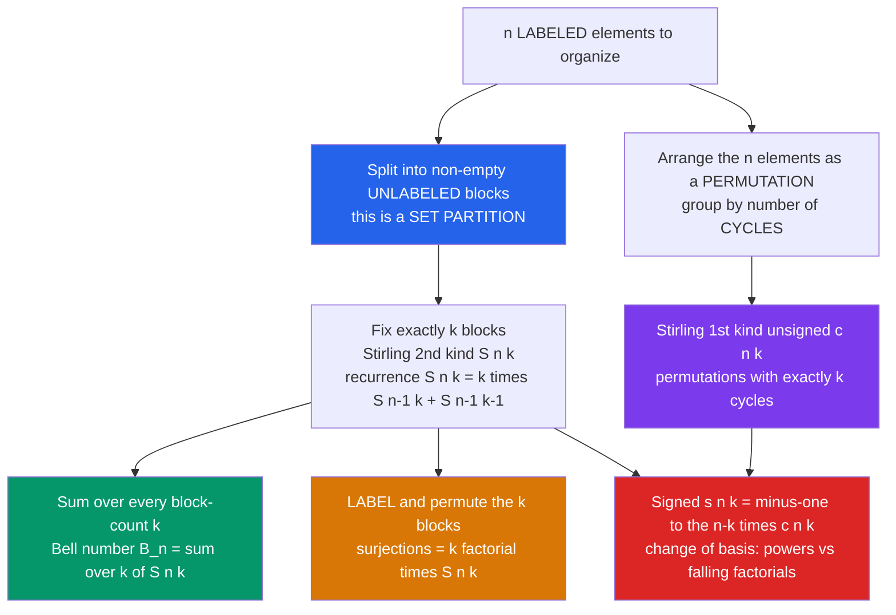

# 🧮 Stirling and Bell Numbers

> [!abstract] TL;DR
> **Stirling numbers of the second kind** $S(n,k)$ count the ways to split $n$ *labeled* elements into exactly $k$ non-empty *unlabeled* blocks (recurrence $S(n,k)=k\,S(n-1,k)+S(n-1,k-1)$); summing over all $k$ gives the **Bell number** $B_n=\sum_k S(n,k)$, the total number of ways to partition the set (equivalently, the number of equivalence relations on it). **Stirling numbers of the first kind** count permutations by their number of *cycles*, and the two kinds are inverse change-of-basis matrices between ordinary powers $x^n$ and falling factorials — which is why these numbers secretly govern how powers, factorials, and exponentials convert into one another.

---

## Intuition

**Analogy:** You have **5 distinct guests** and want to seat them at tables — but you do *not* fix how many tables. How many ways can you split the guests into non-empty groups? If the tables are **unlabeled** (only *who sits with whom* matters, not which table), the total over every possible number of tables is a **Bell number**. If you insist on **exactly $k$ tables**, the count is a **Stirling number of the second kind** $S(5,k)$. Add a twist — seat each table in a *circle* so seating order around it matters — and you are now counting *cycles*, which is a **Stirling number of the first kind**.

These numbers answer the single most fundamental question in enumeration: **"how many ways can I PARTITION a set?"** The surprise is that the same numbers reappear whenever an exponential, a factorial, or a power has to be re-expressed in another basis — they are the exchange rate between $x^n$ and the falling factorial $x(x-1)\cdots(x-k+1)$. Where the sibling *Permutations_and_Combinations* note asked "does order matter?", this note asks "how do the chosen objects *clump*?"

---

## How It Works

### Core Mechanics

1. **Set partition = grouping into unlabeled blocks.** A partition of $\{1,\dots,n\}$ is a set of non-empty, disjoint blocks whose union is the whole set. The blocks carry *no names* and have *no internal order* — $\{\{1,3\},\{2\}\}$ is the same partition as $\{\{2\},\{3,1\}\}$.
2. **$S(n,k)$ counts partitions into exactly $k$ blocks.** The recurrence has a one-line combinatorial proof: focus on element $n$. Either it forms **its own singleton block** — leaving a $k-1$ block partition of the remaining $n-1$ elements, giving $S(n-1,k-1)$ — or it **joins one of the $k$ existing blocks** of a $k$-block partition of the first $n-1$ elements, giving $k\,S(n-1,k)$. Hence
$$S(n,k)=k\,S(n-1,k)+S(n-1,k-1),\qquad S(0,0)=1,\ S(n,0)=0\ (n>0).$$
3. **Bell number = total over all block counts.** $B_n=\sum_{k=0}^{n}S(n,k)$ counts *every* partition of an $n$-set: $B_0,B_1,\dots = 1,1,2,5,15,52,203,877,4140,\dots$ It obeys the elegant recurrence $B_{n+1}=\sum_{k=0}^{n}\binom{n}{k}B_k$ (element $n+1$ shares its block with some $k$-subset of the rest).
4. **From blocks to surjections.** If you now *label* the $k$ blocks, you can arrange them in $k!$ ways, so the number of **onto functions** $[n]\twoheadrightarrow[k]$ is exactly $k!\,S(n,k)$. Inclusion–exclusion gives the closed form $k!\,S(n,k)=\sum_{j=0}^{k}(-1)^{j}\binom{k}{j}(k-j)^n$.
5. **First kind = counting cycles.** The **unsigned** Stirling number of the first kind $c(n,k)=\left[{n\atop k}\right]$ counts permutations of $n$ elements with exactly $k$ cycles, via $c(n,k)=(n-1)\,c(n-1,k)+c(n-1,k-1)$, and $\sum_k c(n,k)=n!$. The **signed** version is $s(n,k)=(-1)^{n-k}c(n,k)$.
6. **The change-of-basis punchline.** The two kinds are inverse triangular matrices connecting two natural bases of polynomials:
$$x^{n}=\sum_{k}S(n,k)\,x^{\underline{k}},\qquad x^{\underline{n}}=\sum_{k}s(n,k)\,x^{k},$$
where $x^{\underline{k}}=x(x-1)\cdots(x-k+1)$ is the falling factorial. Second kind turns **powers into falling factorials**; first kind turns them **back**.

### Flow / Architecture



---

## Key Concepts

### Secondary (high-school level)
- **Set partition:** a way to split a collection into non-empty groups where the groups are *unnamed*. The 5 partitions of $\{a,b,c\}$ are $abc$ / $ab\!\mid\!c$ / $ac\!\mid\!b$ / $bc\!\mid\!a$ / $a\!\mid\!b\!\mid\!c$, so $B_3=5$.
- **$S(n,k)$ in words:** the number of those partitions that use exactly $k$ groups. For $n=3$: $S(3,1)=1$ (all together), $S(3,2)=3$, $S(3,3)=1$ (all separate). They sum to $B_3=5$.
- **Bell number $B_n$:** just the grand total — add up $S(n,k)$ across every possible number of groups.
- **Litmus difference from earlier counting:** here you are not lining objects up or picking a fixed-size subset; you are asking *how they cluster together*.

### Undergraduate
- **The two recurrences and their proofs:** $S(n,k)=k\,S(n-1,k)+S(n-1,k-1)$ (new element is a singleton or joins an existing block); $c(n,k)=(n-1)c(n-1,k)+c(n-1,k-1)$ (new element starts its own 1-cycle or is inserted into one of $n-1$ gaps of an existing permutation).
- **Surjection bridge:** $k!\,S(n,k)=$ number of onto maps $[n]\to[k]=\sum_{j}(-1)^j\binom{k}{j}(k-j)^n$. Dividing by $k!$ "forgets" the labels on the blocks — the labeled-vs-unlabeled distinction in one equation.
- **Bell triangle (Aitken's array):** start a row with the last entry of the previous row, then each entry is the sum of the entry to its left and the entry diagonally above; both edges read off the Bell numbers. A hand-computable engine for $B_n$.
- **Exponential generating functions:** $\sum_{n\ge0}B_n\dfrac{x^n}{n!}=e^{\,e^{x}-1}$ and $\sum_{n\ge k}S(n,k)\dfrac{x^n}{n!}=\dfrac{(e^{x}-1)^k}{k!}$. The "$e^x-1$" is the EGF of a single non-empty block; exponentiating assembles blocks into a set — the **exponential formula** in action (see the sibling *Generating_Functions* material).
- **Twelvefold way placement:** distributing $n$ balls into $k$ boxes, the *labeled balls, unlabeled boxes* column is exactly set partitions — surjective gives $S(n,k)$, arbitrary gives $\sum_{j\le k}S(n,j)$.

### Graduate
- **Change-of-basis / connection coefficients:** $S$ and $s$ are the transition matrices between the monomial basis $\{x^n\}$ and the falling-factorial basis $\{x^{\underline{n}}\}$ of the polynomial ring; the umbral/**finite-difference calculus** makes $x^{\underline{k}}$ the analogue of $x^k$ under the difference operator $\Delta$.
- **Orthogonality:** $\sum_{k}s(n,k)\,S(k,m)=\sum_k S(n,k)\,s(k,m)=[n=m]$ — the two triangles are literal matrix inverses. This is the discrete analogue of "differentiate then integrate."
- **Dobinski's formula:** $B_n=\dfrac{1}{e}\sum_{k=0}^{\infty}\dfrac{k^n}{k!}$ — a partition count written as a Poisson moment: $B_n$ is the $n$-th moment of a $\mathrm{Poisson}(1)$ random variable.
- **Bell polynomials and cumulants:** the complete Bell polynomials $B_n(x_1,\dots,x_n)$ generalize Bell numbers ($B_n(1,\dots,1)=B_n$) and encode the **moment–cumulant** relations and **Faà di Bruno's formula** for higher derivatives of a composition — set partitions index the terms.
- **Asymptotics:** $B_n$ grows faster than any exponential; $\dfrac{\ln B_n}{n}=\ln n-\ln\ln n-1+o(1)$, obtained by a saddle-point analysis of $e^{e^x-1}$. The location of the peak block-count $k$ in $S(n,k)$ concentrates near $n/\ln n$.
- **Operator ordering:** in the Weyl algebra, $(a^{\dagger}a)^n=\sum_k S(n,k)\,(a^{\dagger})^k a^k$ — normal ordering of the number operator is literally a Stirling expansion, tying these numbers to quantum optics and statistical mechanics.

---

## Python Demo

```python
# Stirling & Bell numbers: build them from recurrences, PROVE them by
# enumerating set partitions, verify the surjection identity and the Bell
# triangle, then visualize the Stirling triangle and Bell-number growth.
import numpy as np
import matplotlib.pyplot as plt
from itertools import product
from math import factorial

# ---------- (a) Stirling 2nd kind via recurrence, then Bell numbers ----------
N = 12
S2 = np.zeros((N + 1, N + 1), dtype=object)   # object dtype -> exact big ints
S2[0, 0] = 1
for n in range(1, N + 1):
    for k in range(1, n + 1):
        S2[n, k] = k * S2[n - 1, k] + S2[n - 1, k - 1]   # k*S(n-1,k)+S(n-1,k-1)

Bell = [sum(S2[n, k] for k in range(n + 1)) for n in range(N + 1)]
print("Bell numbers B_0..B_12:")
print(Bell)   # 1,1,2,5,15,52,203,877,4140,21147,115975,678570,4213597

# ---------- Enumerate set partitions to VERIFY S(n,k) and B_n ----------
def set_partitions(collection):
    collection = list(collection)
    if len(collection) == 1:
        yield [collection]
        return
    first = collection[0]
    for rest in set_partitions(collection[1:]):
        for i, block in enumerate(rest):                 # add `first` to a block
            yield rest[:i] + [[first] + block] + rest[i + 1:]
        yield [[first]] + rest                           # `first` as a new block

print("\n n | enum-partitions | Bell | S(n,k) match | Bell match")
for n in range(1, 8):
    parts = list(set_partitions(range(n)))
    by_k = {}
    for p in parts:
        by_k[len(p)] = by_k.get(len(p), 0) + 1
    ok_S = all(by_k.get(k, 0) == S2[n, k] for k in range(1, n + 1))
    ok_B = (len(parts) == Bell[n])
    print(f"{n:2d} | {len(parts):15d} | {Bell[n]:4d} | {str(ok_S):>11} | {ok_B}")

# ---------- Verify  k! * S(n,k) = number of surjections [n] -> [k] ----------
def count_surjections(n, k):
    return sum(1 for f in product(range(k), repeat=n) if len(set(f)) == k)

n_chk, k_chk = 6, 3
surj = count_surjections(n_chk, k_chk)
assert surj == factorial(k_chk) * S2[n_chk, k_chk]
print(f"\nSurjections [{n_chk}]->[{k_chk}] = {surj} = {k_chk}! * S({n_chk},{k_chk}) : OK")

# ---------- Bell triangle (Aitken's array) reproduces the Bell numbers ----------
def bell_triangle(rows):
    tri = [[1]]
    for _ in range(1, rows):
        prev = tri[-1]
        row = [prev[-1]]                 # start with last entry of previous row
        for x in prev:
            row.append(row[-1] + x)      # left neighbour + entry above
        tri.append(row)
    return tri

tri = bell_triangle(8)
assert [row[0] for row in tri] == Bell[:8]
print("Bell triangle left edge reproduces Bell numbers: OK")

# ---------- Stirling 1st kind (unsigned): cycles of permutations ----------
c1 = np.zeros((N + 1, N + 1), dtype=object)
c1[0, 0] = 1
for n in range(1, N + 1):
    for k in range(1, n + 1):
        c1[n, k] = (n - 1) * c1[n - 1, k] + c1[n - 1, k - 1]
for n in range(N + 1):
    assert sum(c1[n, k] for k in range(n + 1)) == factorial(n)   # row sum = n!
print("Unsigned Stirling-1st row sums = n! : OK")

# ---------- (b) Visualize ----------
fig, axes = plt.subplots(1, 3, figsize=(17, 5))

heat = np.full((N + 1, N + 1), np.nan)
for n in range(N + 1):
    for k in range(n + 1):
        v = int(S2[n, k])
        if v > 0:
            heat[n, k] = np.log10(v)
im = axes[0].imshow(heat, cmap="magma", aspect="auto", origin="upper")
axes[0].set_title("Stirling triangle: log10 of S(n,k)")
axes[0].set_xlabel("k = number of blocks"); axes[0].set_ylabel("n")
fig.colorbar(im, ax=axes[0], shrink=0.85)

ns = np.arange(N + 1)
axes[1].semilogy(ns, [int(b) for b in Bell], "o-", color="#059669")
axes[1].set_title("Bell numbers grow super-exponentially")
axes[1].set_xlabel("n"); axes[1].set_ylabel("B_n (log scale)")
axes[1].grid(True, which="both", ls=":")

nn = np.arange(1, 8)
enum_counts = [len(list(set_partitions(range(n)))) for n in nn]
axes[2].plot(nn, enum_counts, "s-", label="enumerated partitions")
axes[2].plot(nn, [int(Bell[n]) for n in nn], "x", ms=13, label="Bell formula")
axes[2].set_title("Brute-force enumeration matches B_n")
axes[2].set_xlabel("n"); axes[2].set_ylabel("count"); axes[2].legend()

plt.tight_layout()
plt.savefig("stirling_and_bell.png", dpi=120)
print("\nSaved figure: stirling_and_bell.png")
```

**Expected console output (abridged):**

```
Bell numbers B_0..B_12:
[1, 1, 2, 5, 15, 52, 203, 877, 4140, 21147, 115975, 678570, 4213597]

 n | enum-partitions | Bell | S(n,k) match | Bell match
 1 |               1 |    1 |        True | True
 ...
 7 |             877 |  877 |        True | True

Surjections [6]->[3] = 540 = 3! * S(6,3) : OK
Bell triangle left edge reproduces Bell numbers: OK
Unsigned Stirling-1st row sums = n! : OK
```

The left plot is the Stirling triangle as a heat map (each row $n$ peaks at an interior $k$); the middle shows Bell numbers overtaking any exponential; the right confirms that *direct enumeration of set partitions* lands exactly on the Bell numbers produced by the recurrence.

---

## Real-World Applications

> **Example:** In **Bayesian nonparametric clustering**, the **Chinese Restaurant Process** (the Dirichlet-process prior used for clustering an unknown number of groups) assigns probability to *set partitions* of the data points. The number of possible clusterings of $n$ items into $k$ clusters is exactly $S(n,k)$, and the total number of clusterings is $B_n$ — which is *why* you cannot enumerate all clusterings and must sample instead. The CRP's "sit at an existing table with probability proportional to its size, or start a new one" rule is a probabilistic reading of the $S(n,k)$ recurrence.

- **Equivalence relations and databases:** a partition of a set *is* an equivalence relation, so $B_n$ counts equivalence relations on $n$ elements — and the distinct outcomes of a SQL `GROUP BY` over $n$ rows are set partitions.
- **Probability and statistics:** by Dobinski's formula, $B_n$ is the $n$-th moment of a $\mathrm{Poisson}(1)$ variable; more broadly, **moment–cumulant** conversions and the higher chain rule (**Faà di Bruno**) are indexed by set partitions via Bell polynomials.
- **Physics / quantum optics:** normal ordering the number operator gives $(a^{\dagger}a)^n=\sum_k S(n,k)(a^{\dagger})^k a^k$; **Wick's theorem** and Feynman-diagram bookkeeping sum over partitions into blocks (pairings are the 2-block case).
- **Poetry and design enumeration:** the number of possible **rhyme schemes** for an $n$-line stanza is $B_n$ (partition the lines into rhyme classes) — the historical origin of the Bell triangle in Motzkin's and Becker's work.
- **Compilers and register allocation / hashing:** counting distinct ways to coalesce $n$ items into groups, and the "birthday/occupancy" analyses of hashing, are surjection ($k!\,S(n,k)$) and partition counts.
- **Numerical analysis:** converting between derivative operators and finite-difference operators uses Stirling numbers as the exact change-of-basis coefficients between $x^n$ and $x^{\underline{k}}$.

---

## Trade-offs

| Aspect | Pro | Con |
|--------|-----|-----|
| Performance | The recurrence fills the whole triangle in $O(n^2)$ integer operations — no enumeration needed | The values are astronomically large; exact work needs big integers, and closed forms like Dobinski are infinite series |
| Complexity | One recurrence and one summation unify partitions, surjections, and moments | Four easily-confused variants (2nd vs 1st kind, signed vs unsigned, labeled vs unlabeled blocks) invite silent errors |
| Scalability | Counting scales fine; $B_n$ is a single number even for huge $n$ | *Generating* the $B_n$ partitions is infeasible ($B_{20}>5\times10^{13}$) — you can count but rarely list |

---

## When to Use vs Avoid

**Use when:**
- You are counting ways to **partition a set of distinguishable items into unlabeled groups**, with the number of groups either fixed ($S(n,k)$) or free ($B_n$).
- You need to count **surjections**, **equivalence relations**, or **clusterings**, or to convert between the power basis and the falling-factorial basis.

**Avoid when:**
- The items are **indistinguishable** — then you want *integer partitions* $p(n)$ (the sibling *Integer_Partitions*), not set partitions.
- **Order within or among groups matters** in a way not captured by cycles — you may need *Permutations_and_Combinations*, compositions, or ordered set partitions (Fubini/ordered Bell numbers) instead.

---

## Common Pitfalls

- **First-kind vs second-kind confusion** — the second kind $S(n,k)=\left\{{n\atop k}\right\}$ counts partitions into $k$ *blocks*; the first kind $c(n,k)=\left[{n\atop k}\right]$ counts permutations with $k$ *cycles*. They share notation habits but count different objects; only $S$ sums to the Bell number, only $c$ sums to $n!$.
- **Signed vs unsigned first kind** — the *unsigned* $c(n,k)$ is the combinatorial cycle count (always positive); the *signed* $s(n,k)=(-1)^{n-k}c(n,k)$ is what appears in the falling-factorial expansion. Plugging the signed value into a counting problem gives negative "counts."
- **Labeled vs unlabeled blocks** — $S(n,k)$ treats blocks as anonymous. The moment you name or order the $k$ blocks you must multiply by $k!$, turning partitions into **surjections** $k!\,S(n,k)$. Forgetting this over- or under-counts by exactly $k!$.
- **Set partition vs integer partition** — partitioning the *labeled* set $\{1,2,3\}$ into 2 blocks gives $S(3,2)=3$ ways ($12\!\mid\!3$, $13\!\mid\!2$, $23\!\mid\!1$), but partitioning the *integer* $3$ into 2 parts gives only $1$ way ($2+1$). Bell/Stirling count labeled elements; $p(n)$ counts unlabeled units.
- **Base-case slips** — $S(0,0)=1$ and $c(0,0)=1$ (the empty partition/permutation), while $S(n,0)=0$ for $n>0$. Getting the seed wrong shifts the entire triangle.

---

## Related Concepts

- [[Permutations_and_Combinations]] — the prior counting layer ("does order matter?"); Stirling/Bell add the orthogonal question of how chosen elements *clump into blocks*.
- [[Mathematics/04_Discrete_Mathematics/Combinatorics|Combinatorics (Discrete Math)]] — the broader enumeration toolkit (inclusion–exclusion, which yields the surjection formula $k!\,S(n,k)$).
- [[Set_Theory_and_Relations]] — a set partition is exactly an equivalence relation, so $B_n$ counts equivalence relations on an $n$-set.
- [[Generating_Functions_and_Recurrences]] — the EGFs $e^{e^x-1}$ (Bell) and $(e^x-1)^k/k!$ (second kind) package these numbers as power-series coefficients.
- [[Groups_and_Subgroups]] — Stirling numbers of the first kind count elements of the symmetric group $S_n$ by cycle number; row sums equal $|S_n|=n!$.
- [[Partition_Functions_and_Free_Energy_in_ML]] — shares the "partition function" language; normal ordering $(a^\dagger a)^n=\sum_k S(n,k)(a^\dagger)^k a^k$ links Stirling numbers to statistical-mechanics operator algebra.
- [[Backtracking]] — the algorithmic way to *generate* (not merely count) all set partitions, mirroring the "new block or join a block" recurrence.

---

## Review Questions

1. **(Secondary)** List all partitions of $\{a,b,c,d\}$ that use exactly two blocks and confirm the total equals $S(4,2)=7$. Then add up $S(4,k)$ over all $k$ — which Bell number do you get, and what does it count?
2. **(Undergraduate)** Give the combinatorial (not algebraic) proof of $S(n,k)=k\,S(n-1,k)+S(n-1,k-1)$ by tracking element $n$. Using it, explain why the number of *onto* functions from a 5-set to a 3-set is $3!\,S(5,3)$, and compute the value.
3. **(Graduate)** Show that $\sum_{k}s(n,k)\,S(k,m)=[n=m]$, i.e. the signed first-kind and second-kind triangles are matrix inverses, and interpret this as a change of basis between $\{x^n\}$ and $\{x^{\underline{n}}\}$. What operator plays the role that differentiation plays for ordinary monomials?

---

## Sources

- Graham, Knuth & Patashnik, *Concrete Mathematics*, Ch. 6 (Stirling numbers, both kinds, and the change-of-basis identities).
- Stanley, *Enumerative Combinatorics*, Vol. 1, Ch. 1 (set partitions, the Twelvefold Way, and exponential generating functions).
- Comtet, *Advanced Combinatorics*, Ch. 5 (Stirling and Bell numbers, Dobinski's formula, Bell polynomials).
- Brualdi, *Introductory Combinatorics*, Ch. 8 (Stirling numbers, surjections, and set partitions).
- Wilf, *generatingfunctionology*, Ch. 2 (the exponential formula and $e^{e^x-1}$).

---

#combinatorics #stirling-numbers #bell-numbers #set-partitions #enumeration
