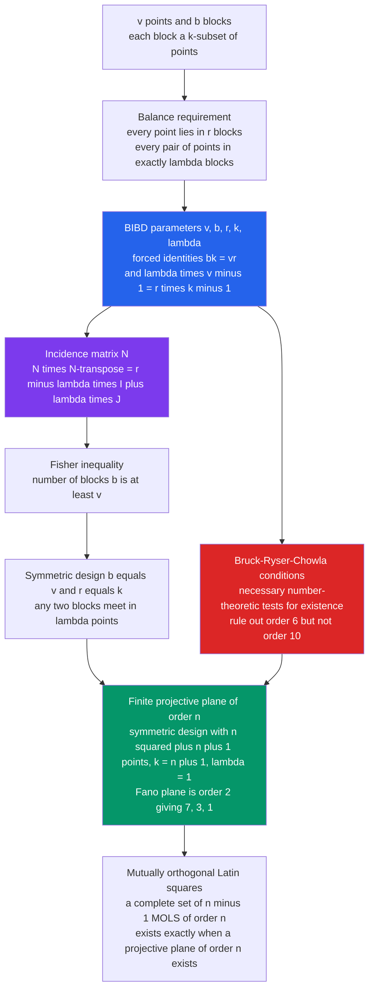

# 🎯 Combinatorial Designs

> [!abstract] TL;DR
> A **combinatorial design** arranges $v$ objects into **blocks** so that some property of *balance* holds exactly — most famously a **Balanced Incomplete Block Design** $(v, b, r, k, \lambda)$, where $b$ blocks each of size $k$ cover every point in exactly $r$ blocks and every *pair* of points in exactly $\lambda$ blocks. These "everything appears equally often" structures are governed by rigid arithmetic ($bk = vr$, $\lambda(v-1) = r(k-1)$) and a beautiful linear-algebra identity $NN^\top = (r-\lambda)I + \lambda J$. When $b = v$ the design is **symmetric**, and the smallest interesting one — the seven-point, seven-line **Fano plane** $(7,3,1)$ — is the projective plane of order 2. Design theory is the mathematics of perfect balance, and it quietly powers **experimental statistics**, **error-correcting codes**, **cryptography**, and **tournament scheduling**.

---

## Intuition

**Analogy — the perfectly fair tournament.** You are running a bridge tournament with a pool of players, and you want it to feel *scrupulously fair*: every pair of players should partner exactly once, every table should be equally busy, and nobody should sit idle more than anyone else. If you try to schedule this by hand you quickly discover it is maddeningly rigid — fix one constraint and three others snap out of place. The schedules that *do* satisfy every fairness rule at once are not lucky accidents; they are **combinatorial designs**, and whether one even *exists* for your number of players is a deep arithmetic question.

The same rigidity appears whenever "balance" is the goal. In a **drug trial** every treatment must be compared against every other the same number of times, so that no comparison is accidentally favoured. In a **round-robin sports league** every team should meet every other team an equal number of times. Each of these is a request for a structure where *every element, and every pair of elements, appears equally often*. The canonical toy example is the **Fano plane**: seven "points" and seven "lines," where each line contains exactly 3 points, each point lies on exactly 3 lines, and — the magic — **every pair of points lies on exactly one line**. That last sentence, "every pair exactly once," is the heartbeat of the entire subject. Designs are the mathematics of *forced, exact balance* — and, remarkably, the tools that certify or forbid such balance come from linear algebra, number theory, and finite geometry.

---

## How It Works

### Core Mechanics

1. **Fix the objects and the balance you demand.** Take a set of $v$ **points** and choose a collection of $b$ **blocks**, each a $k$-element subset of the points. Impose *regularity*: every point lies in exactly $r$ blocks, and every **pair** of points lies together in exactly $\lambda$ blocks. A collection meeting all of these is a **2-design** or **Balanced Incomplete Block Design (BIBD)** with parameters $(v, b, r, k, \lambda)$ — "incomplete" because $k < v$ (blocks are not the whole point set), "balanced" because every pair sees the same $\lambda$.

2. **The two counting identities are forced, not chosen.** Count point–block *incidences* two ways: each of the $b$ blocks contributes $k$ incidences, and each of the $v$ points sits in $r$ blocks, so
   $$bk = vr.$$
   Now fix a single point $x$. It lies in $r$ blocks; each such block pairs $x$ with $k-1$ other points; and every one of the $v-1$ other points must be paired with $x$ exactly $\lambda$ times. Counting those pairings two ways gives
   $$\lambda(v-1) = r(k-1).$$
   These two equations mean the five parameters have only **three degrees of freedom** — you cannot invent arbitrary balanced designs; the arithmetic constrains you hard.

3. **Encode the design as a matrix.** The **incidence matrix** $N$ is the $v \times b$ 0/1 matrix with $N_{ij} = 1$ iff point $i$ lies in block $j$. The whole balance condition collapses into one elegant equation:
   $$N N^\top = (r - \lambda)\,I + \lambda\,J,$$
   where $I$ is the identity and $J$ is the all-ones matrix. The diagonal entries are $r$ (each point is in $r$ blocks); every off-diagonal entry is $\lambda$ (each pair shares $\lambda$ blocks). This single identity is the engine behind almost every existence theorem.

4. **Fisher's inequality — you always need at least as many blocks as points.** Taking determinants of $NN^\top = (r-\lambda)I + \lambda J$ shows it is *nonsingular* (its eigenvalues are $rk$ once and $r-\lambda > 0$ with multiplicity $v-1$), so $N$ has rank $v$, which is impossible unless $b \ge v$. Thus **every nontrivial BIBD satisfies $b \ge v$** — a purely linear-algebraic fact about a combinatorial object.

5. **Symmetric designs and finite planes.** When equality $b = v$ holds (equivalently $r = k$), the design is **symmetric**: it has as many blocks as points, and any *two blocks* now meet in exactly $\lambda$ points — a perfect duality between points and blocks. The symmetric designs with $\lambda = 1$ are exactly the **finite projective planes**: a plane of **order $n$** is a symmetric $(n^2 + n + 1,\ n+1,\ 1)$-design. The Fano plane is order $n = 2$, giving $(7, 3, 1)$.

6. **Existence is the hard part.** The counting identities and Fisher's inequality are *necessary* but far from *sufficient*. The **Bruck–Ryser–Chowla theorem** adds deep number-theoretic obstructions (sums of two squares, solvability of a Diophantine equation), and even passing every known necessary test does not guarantee a design exists — the projective plane of order 10 was ultimately ruled out only by a massive computer search.

### Flow / Architecture



---

## Key Concepts

### Secondary (high-school level)
- **A design is a fair schedule.** Think of a **round-robin** where every pair of teams meets exactly once, or a **Sudoku-style grid** where every symbol appears once per row and column. Both are combinatorial designs in disguise.
- **The Fano plane in words:** 7 points, 7 lines, every line has 3 points, every point is on 3 lines, and *every pair of points is joined by exactly one line*. Draw it as a triangle with its three midpoints and center, plus one circle through the midpoints — that circle is the seventh "line."
- **Latin square:** an $n \times n$ grid filled with $n$ symbols so that each symbol occurs exactly once in every row and every column. A completed Sudoku is a $9\times 9$ Latin square with extra box constraints.
- **Why it is hard:** balance is *rigid*. Ask for "every pair together the same number of times" and most parameter choices simply have **no** valid arrangement at all.

### Undergraduate
- **BIBD $(v, b, r, k, \lambda)$** with the forced relations $bk = vr$ and $\lambda(v-1) = r(k-1)$; only 3 of the 5 parameters are free. A design is usually quoted compactly as a **$2\text{-}(v, k, \lambda)$ design**, with $b, r$ derived.
- **Incidence matrix and the master identity** $NN^\top = (r-\lambda)I + \lambda J$ — the algebraic fingerprint of balance, and the source of $\det(NN^\top) = rk\,(r-\lambda)^{v-1}$.
- **Fisher's inequality $b \ge v$:** you can never have fewer blocks than points in a nontrivial 2-design.
- **Symmetric designs ($b = v$, $r = k$):** dual balance, any two blocks meet in $\lambda$ points; parameters satisfy $\lambda(v-1) = k(k-1)$.
- **Finite projective plane of order $n$** = symmetric $(n^2 + n + 1,\ n+1,\ 1)$-design. Planes are known to exist for every **prime-power** order ($n = 2,3,4,5,7,8,9,\dots$) via finite fields; no plane of order 6 or 10 exists; order 12 is **open**.
- **Steiner triple system $S(2,3,n)$:** a $2\text{-}(n,3,1)$ design (blocks are triples, every pair in one triple). Exists **iff** $n \equiv 1$ or $3 \pmod 6$ (Kirkman, 1847); the Fano plane is $S(2,3,7)$.
- **Latin squares and orthogonality:** two Latin squares of order $n$ are **orthogonal** (an MOLS pair) if superimposing them produces all $n^2$ ordered symbol-pairs exactly once. A complete set of $n-1$ **mutually orthogonal Latin squares (MOLS)** exists **iff** a projective plane of order $n$ exists.

### Graduate
- **$t$-designs.** A $t\text{-}(v, k, \lambda)$ design has *every $t$-subset* of points in exactly $\lambda$ blocks; a BIBD is the $t=2$ case. Any $t$-design is also an $s$-design for all $s < t$ (with computable $\lambda_s$). Nontrivial $t$-designs with large $t$ (the Teirlinck / Keevash "designs exist" breakthrough) were a major open problem until the 2010s.
- **Bruck–Ryser–Chowla theorem.** For a symmetric $2\text{-}(v,k,\lambda)$ design: if $v$ is **even** then $k - \lambda$ must be a perfect square; if $v$ is **odd** the equation $z^2 = (k-\lambda)x^2 + (-1)^{(v-1)/2}\lambda\, y^2$ must have a nontrivial integer solution. For projective planes ($k-\lambda = n$), this forces: if $n \equiv 1$ or $2 \pmod 4$, then $n$ is a **sum of two squares** — instantly killing order 6, 14, 21, 22, …. BRC is *necessary, not sufficient*: order 10 passes BRC yet no plane exists (Lam–Thiel–Swiercz, 1989, by exhaustive computation).
- **Euler's 36 officers problem.** Euler asked for 2 orthogonal Latin squares of order 6 (arranging 36 officers of 6 ranks and 6 regiments in a square). None exist — proven by Tarry (1900). Euler *conjectured* no MOLS pair exists for any $n \equiv 2 \pmod 4$; this was **disproved** by Bose, Shrikhande & Parker (1959–60): a pair of MOLS exists for every order except $n = 2$ and $n = 6$.
- **Finite fields build designs.** From $\mathrm{GF}(q)$ ($q$ a prime power) one constructs the Desarguesian projective plane $PG(2,q)$ of order $q$, a complete set of $q-1$ MOLS via $L_a(i,j) = i + a\cdot j$, and difference-set / cyclic designs. This is *why* every known plane has prime-power order.
- **Hadamard matrices.** An $n \times n$ $\pm 1$ matrix with $HH^\top = nI$ (orthogonal rows) exists only for $n = 1, 2$ or $n \equiv 0 \pmod 4$. A Hadamard matrix of order $4m$ yields a symmetric $2\text{-}(4m-1,\ 2m-1,\ m-1)$ **Hadamard design** and underlies Reed–Muller codes; the **Hadamard conjecture** (one exists for every multiple of 4) is open.
- **Resolvable designs & Kirkman's schoolgirls.** A design is **resolvable** if its blocks partition into *parallel classes* each covering all points. Kirkman's 15 schoolgirls (walk in 5 rows of 3 for 7 days, no pair repeats) is a resolvable $2\text{-}(15,3,1)$ design — a Kirkman triple system.

---

## Python Demo

```python
# Combinatorial designs made concrete:
#   (a) Build the FANO PLANE -- the symmetric 2-(7,3,1) design / projective plane of order 2 --
#       from its 7 lines, then VERIFY every balance property via the incidence matrix N,
#       including the master identity  N N^T = (r - lambda) I + lambda J.
#   (b) Build a pair of ORTHOGONAL LATIN SQUARES of order 3 and verify Latin-ness + orthogonality.
# Then visualize: incidence matrix, N N^T, the Fano-plane diagram, and the MOLS overlay.
import numpy as np
import matplotlib.pyplot as plt
from itertools import combinations

# ---------- (a) The Fano plane: 7 points {0..6}, 7 lines (blocks), each a 3-subset ----------
# Geometric labelling: triangle corners 0,1,2 ; edge-midpoints 3,4,5 ; centre 6.
blocks = [
    [0, 3, 1],   # left edge      (corner 0 - mid 3 - corner 1)
    [1, 4, 2],   # bottom edge    (corner 1 - mid 4 - corner 2)
    [0, 5, 2],   # right edge     (corner 0 - mid 5 - corner 2)
    [0, 4, 6],   # median 0 -> mid 4 through centre 6
    [1, 5, 6],   # median 1 -> mid 5 through centre 6
    [2, 3, 6],   # median 2 -> mid 3 through centre 6
    [3, 4, 5],   # the inscribed circle through the three midpoints (the 7th "line")
]
v, b, k, lam = 7, len(blocks), 3, 1

# Incidence matrix N : v x b , N[i,j] = 1 iff point i lies on line j
N = np.zeros((v, b), dtype=int)
for j, blk in enumerate(blocks):
    for p in blk:
        N[p, j] = 1

col_sums = N.sum(axis=0)          # points per block  -> should all equal k = 3
row_sums = N.sum(axis=1)          # blocks per point  -> should all equal r
r = row_sums[0]
NNt = N @ N.T                     # the master matrix
target = (r - lam) * np.eye(v, dtype=int) + lam * np.ones((v, v), dtype=int)

# Directly recount how many blocks each PAIR of points shares -> should all equal lambda = 1
pair_counts = [int((N[a] * N[c]).sum()) for a, c in combinations(range(v), 2)]

print("=== Fano plane  =  symmetric 2-(7,3,1) design  =  projective plane of order 2 ===")
print(f"v (points) = {v},  b (blocks) = {b}   -> symmetric since b == v: {b == v}")
print(f"every block has k = 3 points?        {np.all(col_sums == k)}   (block sizes {col_sums.tolist()})")
print(f"every point is on r = {r} blocks?        {np.all(row_sums == r)}   (r = k, as required for symmetric)")
print(f"every PAIR of points on exactly lambda = 1 block?  {all(c == lam for c in pair_counts)}")
print(f"counting identity  bk = vr : {b*k} == {v*r}  -> {b*k == v*r}")
print(f"counting identity  lambda(v-1) = r(k-1) : {lam*(v-1)} == {r*(k-1)}  -> {lam*(v-1) == r*(k-1)}")
print(f"master identity  N N^T == (r-lambda) I + lambda J : {np.array_equal(NNt, target)}")
assert np.all(col_sums == k) and np.all(row_sums == r)
assert all(c == lam for c in pair_counts)
assert np.array_equal(NNt, target)

# ---------- (b) Two orthogonal Latin squares of order 3 ----------
n = 3
I, J = np.indices((n, n))
L1 = (I + J)     % n             # L1[i,j] = (i +   j) mod 3
L2 = (I + 2*J)   % n             # L2[i,j] = (i + 2 j) mod 3

def is_latin(L):                 # each row and each column a permutation of {0..n-1}
    ok_rows = all(sorted(L[i]) == list(range(n)) for i in range(n))
    ok_cols = all(sorted(L[:, j]) == list(range(n)) for j in range(n))
    return ok_rows and ok_cols

pairs = {(int(L1[i, j]), int(L2[i, j])) for i in range(n) for j in range(n)}
orthogonal = len(pairs) == n * n     # all n^2 ordered symbol-pairs appear exactly once

print("\n=== Orthogonal Latin squares of order 3 ===")
print("L1 is Latin:", is_latin(L1), " | L2 is Latin:", is_latin(L2))
print("orthogonal (all 9 ordered pairs occur once):", orthogonal, f"  ({len(pairs)} distinct pairs)")
assert is_latin(L1) and is_latin(L2) and orthogonal
print("\nAll design properties verified.")

# ---------- Visualization ----------
fig, ax = plt.subplots(2, 2, figsize=(13, 12))

# (1) incidence matrix N
ax[0, 0].imshow(N, cmap="Blues", vmin=0, vmax=1)
ax[0, 0].set_title("Fano incidence matrix N (7x7)\nrows = points, cols = lines; N[i,j]=1 if point on line")
ax[0, 0].set_xlabel("line (block)"); ax[0, 0].set_ylabel("point")
for i in range(v):
    for j in range(b):
        ax[0, 0].text(j, i, N[i, j], ha="center", va="center",
                      color="white" if N[i, j] else "gray", fontsize=9)

# (2) N N^T = 2 I + J
im = ax[0, 1].imshow(NNt, cmap="viridis")
ax[0, 1].set_title("N N^T = (r-lambda) I + lambda J = 2 I + J\ndiagonal = r = 3, off-diagonal = lambda = 1")
for i in range(v):
    for j in range(v):
        ax[0, 1].text(j, i, NNt[i, j], ha="center", va="center",
                      color="white", fontsize=9)
fig.colorbar(im, ax=ax[0, 1], fraction=0.046)

# (3) Fano-plane diagram matching the blocks above
s3 = np.sqrt(3)
pos = {0: (0.0, s3), 1: (-1.0, 0.0), 2: (1.0, 0.0),
       3: (-0.5, s3/2), 4: (0.0, 0.0), 5: (0.5, s3/2), 6: (0.0, s3/3)}
axf = ax[1, 0]
straight = [b for b in blocks if b != [3, 4, 5]]     # 6 straight lines
for blk in straight:
    pts = sorted(blk, key=lambda p: (pos[p][0], pos[p][1]))
    xs = [pos[p][0] for p in pts]; ys = [pos[p][1] for p in pts]
    axf.plot(xs, ys, "-", color="#94a3b8", lw=2, zorder=1)
circ = plt.Circle((0.0, s3/3), s3/3, fill=False, color="#94a3b8", lw=2, zorder=1)  # line {3,4,5}
axf.add_patch(circ)
for p, (x, y) in pos.items():
    axf.scatter([x], [y], s=420, color="#2563eb", zorder=3)
    axf.text(x, y, str(p), color="white", ha="center", va="center", fontsize=12, zorder=4)
axf.set_title("The Fano plane: 7 points, 7 lines\nevery pair of points on exactly one line")
axf.set_aspect("equal"); axf.axis("off"); axf.set_xlim(-1.4, 1.4); axf.set_ylim(-0.4, 2.0)

# (4) MOLS overlay: each cell shows the ordered pair (L1, L2); background = L1
axm = ax[1, 1]
axm.imshow(L1, cmap="Pastel1", vmin=0, vmax=n-1)
for i in range(n):
    for j in range(n):
        axm.text(j, i, f"{L1[i,j]},{L2[i,j]}", ha="center", va="center", fontsize=16)
axm.set_title("Orthogonal Latin squares of order 3\ncell = (L1, L2); all 9 pairs appear exactly once")
axm.set_xticks(range(n)); axm.set_yticks(range(n))
axm.set_xlabel("column j"); axm.set_ylabel("row i")

plt.tight_layout()
plt.savefig("combinatorial_designs.png", dpi=120)
print("Saved figure: combinatorial_designs.png")
```

**Expected console output:**

```
=== Fano plane  =  symmetric 2-(7,3,1) design  =  projective plane of order 2 ===
v (points) = 7,  b (blocks) = 7   -> symmetric since b == v: True
every block has k = 3 points?        True   (block sizes [3, 3, 3, 3, 3, 3, 3])
every point is on r = 3 blocks?        True   (r = k, as required for symmetric)
every PAIR of points on exactly lambda = 1 block?  True
counting identity  bk = vr : 21 == 21  -> True
counting identity  lambda(v-1) = r(k-1) : 6 == 6  -> True
master identity  N N^T == (r-lambda) I + lambda J : True
=== Orthogonal Latin squares of order 3 ===
L1 is Latin: True  | L2 is Latin: True
orthogonal (all 9 ordered pairs occur once): True   (9 distinct pairs)
All design properties verified.
```

The demo does more than *display* the Fano plane — it **proves** it is a design: the incidence matrix has constant column sums ($k=3$), constant row sums ($r=3$), and its Gram matrix $NN^\top$ equals exactly $2I + J$, which is precisely the statement "every point in 3 lines, every pair in 1 line." The Latin-square panel shows orthogonality visually: read off the nine cells and every ordered pair $(0,0), (0,1), \dots, (2,2)$ appears once.

---

## Real-World Applications

> **Example — the origin of the field, R. A. Fisher's agricultural trials.** At Rothamsted Experimental Station in the 1920s–30s, Fisher needed to test many fertilizer treatments across plots of land that varied in fertility. If treatment A always landed on the good soil it would look artificially strong. **Balanced incomplete block designs** solved this: arrange treatments into blocks (plots) so that *every pair of treatments is compared within the same block exactly $\lambda$ times*, cancelling out soil variation. This is literally why the acronym is **BIBD** and why "design of experiments" and **ANOVA** are named the way they are — combinatorial designs are the mathematical backbone of controlled experimentation.

- **Design of experiments & clinical trials.** Balanced and resolvable designs guarantee every treatment (or pair of treatments) is tested equally often, so estimated effects are unbiased and have minimum variance. Latin-square designs remove *two* nuisance factors (row and column) at once.
- **Error-correcting codes.** Designs and codes are deeply intertwined: the Fano plane's incidence structure yields the $[7,4]$ **Hamming code**, Hadamard designs give **Reed–Muller codes**, and Steiner systems like $S(5,8,24)$ underlie the extraordinary **binary Golay code**. Maximizing minimum distance *is* an extremal design problem.
- **Cryptography.** **Difference sets** (cyclic designs) generate sequences with ideal autocorrelation for spread-spectrum and stream ciphers; **combinatorial designs** structure threshold **secret-sharing** and **authentication codes** with provable, information-theoretic security guarantees.
- **Combinatorial software testing.** **Orthogonal arrays** and **covering arrays** (close cousins of MOLS) let testers cover every *pair* of parameter settings with a tiny fraction of the full Cartesian product — the basis of industrial **pairwise / t-wise testing** tools.
- **Tournament & timetable scheduling.** Round-robin schedules, the **social golfer** and **Kirkman schoolgirl** problems, and balanced sports fixtures are resolvable designs; the same math schedules exam timetables and distributed-storage layouts.
- **Optics & group testing.** Coded-aperture imaging uses designs (Hadamard masks) to multiplex signals; **pooling designs** screen large DNA/blood libraries by testing balanced pools instead of every individual sample.

---

## Common Pitfalls

- **Assuming the counting identities guarantee existence.** $bk = vr$, $\lambda(v-1) = r(k-1)$, and integer divisibility are only **necessary**. Parameters can satisfy all of them and still admit *no* design. Always treat the arithmetic as a filter, never a certificate.
- **Forgetting Fisher's inequality.** A proposed 2-design with $b < v$ is impossible, full stop. If your parameters give fewer blocks than points, stop looking — no linear-algebraic embedding exists.
- **Treating Bruck–Ryser–Chowla as sufficient.** BRC rules out symmetric designs (e.g., projective plane of order 6, since $6$ is not a sum of two squares) but *passing* BRC proves nothing. The plane of order **10** satisfies BRC yet was shown not to exist only after thousands of hours of computer search. Necessary $\ne$ sufficient.
- **Believing every order has a projective plane.** Planes exist for all **prime-power** orders via finite fields. It is a famous open problem whether **any non-prime-power order** has a plane; orders 6 and 10 are ruled out, and order **12** remains unresolved. Do not assume a plane of your favourite order exists.
- **The Euler MOLS trap.** Euler wrongly conjectured no orthogonal Latin-square pair exists for orders $\equiv 2 \pmod 4$. In fact a pair exists for *every* order except **2 and 6**. Order 6 (the 36 officers) is the lone exception above 2 — don't over-generalize from it.
- **Confusing the parameters.** $r$ (blocks per point) and $k$ (points per block) are distinct except in symmetric designs; $\lambda$ counts *pairs*, not points. Mislabeling $\lambda$ as "blocks per point" silently breaks every identity.
- **Ignoring resolvability.** A design existing is weaker than a *resolvable* design existing. Kirkman's schoolgirls ($2$-$(15,3,1)$, resolvable) is much harder to satisfy than merely finding some Steiner triple system on 15 points.

---

## Related Concepts

- [[Permutations_and_Combinations]] — designs are built from $k$-subsets of a $v$-set; block counts and the identities $bk=vr$, $\lambda(v-1)=r(k-1)$ are pure double-counting of combinations.
- [[The_Pigeonhole_Principle]] — Fisher's inequality and non-existence proofs are sophisticated "there is no room" arguments in the same spirit.
- [[Inclusion_Exclusion_Principle]] — used to count blocks avoiding given points and to derive the $\lambda_s$ parameters of a $t$-design.
- [[Combinatorics_Overview]] — situates design theory within the extremal/algebraic branches of the field, alongside coding theory and finite geometry.
- [[Mathematics/03_Linear_Algebra/Matrices_and_Determinants|Matrices and Determinants]] — the incidence matrix $N$, the identity $NN^\top=(r-\lambda)I+\lambda J$, and the determinant/rank argument behind Fisher's inequality live entirely here.
- [[Mathematics/10_Abstract_Algebra/Fields_and_Field_Extensions|Fields and Field Extensions]] — finite fields $\mathrm{GF}(q)$ construct projective planes $PG(2,q)$ and complete sets of MOLS, explaining the prime-power orders.
- [[Mathematics/10_Abstract_Algebra/Groups_and_Subgroups|Groups and Subgroups]] — difference sets and cyclic/automorphism-rich designs are built from group structure; the Fano plane's symmetry group is $\mathrm{PGL}(3,2)$.
- [[Mathematics/04_Discrete_Mathematics/Combinatorics|Combinatorics (Discrete Mathematics)]] — the seed note whose counting toolkit (subsets, double counting) underpins every design identity.
- [[Mathematics/04_Discrete_Mathematics/Number_Theory_Elementary|Elementary Number Theory]] — Bruck–Ryser–Chowla turns existence into sums-of-two-squares and Diophantine solvability questions.
- [[Mathematics/04_Discrete_Mathematics/Graph_Theory|Graph Theory]] — symmetric designs, strongly regular graphs, and incidence graphs (the Fano plane's Heawood graph) are two views of one structure.
- [[Mathematics/06_Probability_and_Statistics/Statistical_Inference|Statistical Inference]] — BIBDs are the "design" in *design of experiments*; balanced blocks give unbiased, minimum-variance ANOVA estimates.
- [[Information_Theory/03_Channel_Coding_and_Reliable_Communication/Error_Correcting_Codes_Fundamentals|Error-Correcting Codes]] — Hamming, Reed–Muller, and Golay codes arise directly from Fano, Hadamard, and Steiner designs.
- [[Information_Theory/03_Channel_Coding_and_Reliable_Communication/Linear_Block_Codes_and_Reed_Solomon|Linear Block Codes and Reed–Solomon]] — incidence matrices of designs are parity-check/generator matrices; extremal designs maximize minimum distance.
- [[Cryptography/01_Mathematical_Foundations/Groups_Rings_Fields_for_Cryptography|Groups, Rings, Fields for Cryptography]] — the same finite-field machinery builds difference sets, authentication codes, and secret-sharing schemes.

*Sibling notes referenced in prose (this section links only Glob-verified files): Enumerative_Graph_Theory, Matching_Theory_and_Halls_Theorem, Combinatorial_Coding_Theory, and Extremal_Set_Theory.*

---

## Review Questions

1. **(Secondary)** The Fano plane has 7 points and 7 lines, each line holding 3 points. Without listing them, explain why *every point* must lie on exactly 3 lines, and check the identity $bk = vr$. Then state in plain English what "$\lambda = 1$" means for the pairs of points.
2. **(Undergraduate)** A proposed $2$-design has $v = 16$ points, block size $k = 6$, and $\lambda = 2$. Use $\lambda(v-1) = r(k-1)$ to find $r$, then $bk = vr$ to find $b$. Verify Fisher's inequality $b \ge v$. Do all parameters come out as positive integers — and does that alone prove the design exists?
3. **(Graduate)** Using Bruck–Ryser–Chowla, prove that no projective plane of order 6 exists (hint: $6 \equiv 2 \pmod 4$, is 6 a sum of two squares?). Then explain precisely why the *same* theorem does **not** settle order 10, and what kind of argument was ultimately needed instead. How does the non-existence of two orthogonal Latin squares of order 6 relate to the same fact?

---

## Sources

- [Douglas R. Stinson — *Combinatorial Designs: Constructions and Analysis* (Springer, 2004)](https://link.springer.com/book/10.1007/b97564)
- [J. H. van Lint & R. M. Wilson — *A Course in Combinatorics*, 2nd ed. (Cambridge, 2001), chapters on designs, projective planes, and codes](https://www.cambridge.org/9780521006019)
- [Charles J. Colbourn & Jeffrey H. Dinitz (eds.) — *Handbook of Combinatorial Designs*, 2nd ed. (CRC Press, 2006)](https://www.routledge.com/The-CRC-Handbook-of-Combinatorial-Designs/Colbourn-Dinitz/p/book/9781584885061)
- [Marshall Hall Jr. — *Combinatorial Theory*, 2nd ed. (Wiley, 1986)](https://onlinelibrary.wiley.com/doi/book/10.1002/9781118032862)
- [C. W. H. Lam — "The Search for a Finite Projective Plane of Order 10," *American Mathematical Monthly* 98 (1991)](https://www.jstor.org/stable/2323798)

---

#combinatorics #combinatorial-designs #bibd #latin-squares #finite-geometry
