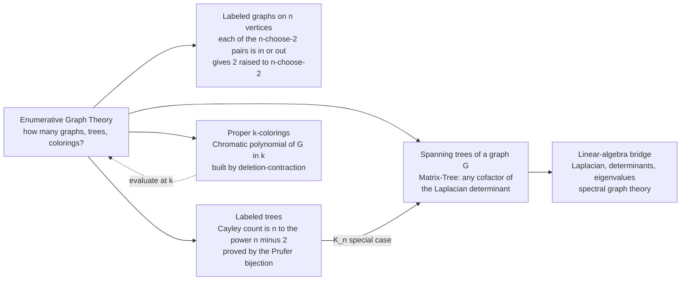

# 🌳 Enumerative Graph Theory

> [!abstract] TL;DR
> Enumerative graph theory is the branch of combinatorics that **counts graph-theoretic objects** — labeled graphs, trees, spanning trees, and proper colorings — rather than searching or traversing them. Three landmark results anchor it: **Cayley's formula** ($n^{n-2}$ labeled trees on $n$ vertices, proved bijectively by **Prüfer sequences**), the **Matrix-Tree theorem** (the number of spanning trees of any graph equals a cofactor of its **Laplacian** — a single determinant), and the **chromatic polynomial** (the number of proper $k$-colorings, a *polynomial* in $k$ built by deletion-contraction). Together they open a door from pure counting into linear algebra and set up the extremal, Ramsey, and probabilistic themes of this section.

---

## Intuition

**Analogy — how many road networks connect all your cities?** You have $n$ cities and want to lay roads so that every city is reachable, but with **no redundant loop** — a minimal, connected network. In graph language that is a **spanning tree**, and a natural question is: *how many different such networks exist?* For a modest map you might sketch a few by hand. But Arthur Cayley's answer for the fully-connected case is staggering: on $n$ labeled cities there are exactly $n^{n-2}$ trees. For just $10$ cities that is $10^8 = 100$ million; for $100$ cities it is a number with **196 digits** — more than the atoms in the observable universe. Nobody could ever draw them all, yet the count is known *exactly*, and it is astonishingly simple.

That is the whole spirit of enumerative graph theory: the objects being counted are **relationships themselves** — edges, trees, colorings — and the answers come out breathtakingly elegant. Where ordinary [[Combinatorics/01_Foundations_of_Counting/Permutations_and_Combinations|permutations and combinations]] count arrangements of things, here we count *structures* of connection, and the payoff is a bridge from raw counting straight into determinants and eigenvalues.

---

## How It Works

Enumerative graph theory asks "**how many?**" of four families of objects, and each has its own beautiful machine. What unifies them is that a graph on a fixed vertex set is a discrete object you can encode, so counting reduces to a clean combinatorial or algebraic identity.

### Core Mechanics

1. **Count labeled graphs directly.** On $n$ *labeled* vertices there are $\binom{n}{2}$ possible edges, and each is independently present or absent. By the multiplication principle there are exactly $2^{\binom{n}{2}}$ labeled graphs — and if you want a fixed number of edges $m$, it is $\binom{\binom{n}{2}}{m}$. Labeled counting is easy because there is **no symmetry to divide out**.

2. **Count labeled trees — Cayley's formula.** A tree on $n$ labeled vertices has exactly $n-1$ edges, is connected, and has no cycle. The number of such trees is $n^{n-2}$. The cleanest proof is a **bijection**: the **Prüfer sequence** encodes every labeled tree as a unique string of length $n-2$ over the alphabet $\{1,\dots,n\}$, and every such string decodes back to a unique tree. Since there are $n^{n-2}$ strings, there are $n^{n-2}$ trees. (Other proofs: double counting rooted forests, or the Matrix-Tree theorem applied to $K_n$.)

3. **Count spanning trees of a specific graph — the Matrix-Tree theorem.** Build the **Laplacian** $L = D - A$ (degree matrix minus adjacency matrix). Delete *any one* row $i$ and the matching column $i$; the **determinant of that reduced matrix** is exactly the number of spanning trees $\tau(G)$. One determinant replaces an exponential enumeration. Applied to the complete graph $K_n$ it recovers Cayley's $n^{n-2}$.

4. **Count proper colorings — the chromatic polynomial.** $P(G,k)$ is the number of ways to color the vertices with $k$ colors so that no edge joins two equal colors. Remarkably, $P(G,k)$ is always a **polynomial** in $k$, computed by **deletion-contraction**: $P(G,k) = P(G-e,k) - P(G/e,k)$ (color freely without edge $e$, then subtract the colorings that violate it). Evaluating the polynomial at a specific $k$ gives the count; its structure (roots, coefficients) encodes deep graph invariants.

5. **Mind the labeled/unlabeled divide.** Everything above counts **labeled** objects. Counting **unlabeled** graphs (isomorphism classes) requires dividing out the symmetries — the automorphisms — via Burnside's lemma and Pólya enumeration, which is genuinely harder and is foreshadowed later in this section.

### Flow / Architecture



---

## Key Concepts

### Secondary Level
- **Labeled vs. unlabeled.** Two triangles drawn with vertices named $\{1,2,3\}$ versus $\{a,b,c\}$ are *different labeled* graphs but the *same unlabeled* shape. Counting is much easier when labels are fixed.
- **Trees.** A connected graph on $n$ vertices with no cycles; it always has exactly $n-1$ edges and a unique path between any two vertices.
- **Cayley's formula (the headline).** The number of different trees on $n$ labeled vertices is $n^{n-2}$: $n=2 \to 1$, $n=3 \to 3$, $n=4 \to 16$, $n=5 \to 125$.
- **Spanning tree.** A subset of a graph's edges that reaches every vertex with no cycle — a minimal connected "skeleton" of the network.
- **Proper coloring.** Assigning colors to vertices so adjacent vertices differ; the chromatic number is the fewest colors that make this possible.

### Undergraduate Level
- **Prüfer sequences (the bijection).** An algorithm that repeatedly removes the smallest-labeled leaf and records its neighbor, producing a length-$(n-2)$ code; decoding reverses it. This *one-to-one* correspondence between trees and codes **is** the proof of Cayley's formula, and it lets you generate a uniformly random labeled tree in $O(n)$.
- **The graph Laplacian.** $L = D - A$ where $D$ is the diagonal degree matrix and $A$ the adjacency matrix. Rows sum to zero, so $L$ is singular (that is *why* we delete a row/column before taking the determinant).
- **Matrix-Tree theorem (Kirchhoff).** $\tau(G) = \det(L_0)$ where $L_0$ is $L$ with any one row and the corresponding column removed. Equivalently $\tau(G) = \frac{1}{n}\lambda_2 \lambda_3 \cdots \lambda_n$, the product of the nonzero Laplacian eigenvalues divided by $n$.
- **Chromatic polynomial mechanics.** $P(G,k)$ is a degree-$n$ polynomial; for the empty graph it is $k^n$, for a tree it is $k(k-1)^{n-1}$, for the complete graph $K_n$ it is $k(k-1)(k-2)\cdots(k-n+1)$. Deletion-contraction is the universal recursion.
- **Counting by degree sequence and edges.** The number of labeled graphs with a prescribed degree sequence, and $\binom{\binom{n}{2}}{m}$ for a fixed edge count, connect graph enumeration to [[Combinatorics/01_Foundations_of_Counting/The_Binomial_Theorem_and_Coefficients|binomial coefficients]].
- **Euler's formula (planar counting).** For a connected planar graph, $V - E + F = 2$, which bounds edges by $E \le 3V - 6$ and underlies the enumeration of planar maps and polyhedra.

### Graduate Level
- **Weighted / all-minors Matrix-Tree.** With edge weights, $\det L_0$ becomes the *generating function* $\sum_T \prod_{e \in T} w_e$ over spanning trees — a bridge to the Tutte polynomial and to electrical-network theory (effective resistance).
- **The Tutte polynomial $T(G;x,y)$.** A two-variable universal invariant specializing to the chromatic polynomial ($T(G;1-k,0)$ up to sign/factors), the number of spanning trees ($T(G;1,1)$), spanning forests, acyclic orientations, and the reliability and flow polynomials.
- **Spectral enumeration.** Because $\tau(G)$ is a symmetric function of the Laplacian eigenvalues, spanning-tree counts, mixing times of random walks, expansion (Cheeger), and synchronization all read off the **Laplacian spectrum** — the heart of spectral graph theory. See [[Mathematics/03_Linear_Algebra/Eigenvalues_and_Eigenvectors|eigenvalues and eigenvectors]].
- **Pólya / Burnside enumeration.** Counting *unlabeled* graphs, trees, and colored structures up to isomorphism averages fixed points over the automorphism/symmetry group — the exact-symmetry counterpart to the easy labeled counts here (foreshadowed as `Polya_Enumeration_Theory`).
- **Asymptotic and analytic graph counting.** The number of connected labeled graphs, the giant-component threshold, and tree/forest asymptotics come from exponential generating functions and singularity analysis, linking to [[Mathematics/04_Discrete_Mathematics/Generating_Functions_and_Recurrences|generating functions and recurrences]].
- **Chromatic roots and the deletion-contraction lattice.** The location of chromatic (and Tutte) polynomial roots connects to statistical physics (the $q$-state Potts model partition function is the Tutte polynomial) and to the four-color theorem.

---

## Python Demo

Two experiments make the counting concrete and *verify the theorems against brute-force reality*. **(a) Cayley via Prüfer:** we enumerate every Prüfer code, decode each to a labeled tree, and confirm the number of *distinct* trees equals $n^{n-2}$ for small $n$ — plus a round-trip check that encoding a decoded tree returns the original code (proving the bijection). **(b) Matrix-Tree:** we take a small concrete graph, compute a Laplacian cofactor determinant, and check it matches an exhaustive enumeration of spanning trees (and that $K_4$ gives Cayley's $16$). The figure draws several labeled trees with their Prüfer codes and a bar chart confirming both counts.

```python
# Enumerative graph theory: verify Cayley's formula and the Matrix-Tree theorem.
# (a) Cayley: #labeled trees on n vertices == n^(n-2), proved via the Prufer bijection.
# (b) Matrix-Tree: #spanning trees == a cofactor of the Laplacian (a determinant).
import heapq
from itertools import product, combinations
import numpy as np
import matplotlib.pyplot as plt

# ---------- Prufer bijection: tree <-> length-(n-2) code over {0,...,n-1} ----------
def prufer_decode(seq, n):
    """Decode a Prufer sequence into a labeled tree's edge list."""
    degree = [1] * n
    for x in seq:
        degree[x] += 1
    leaves = [i for i in range(n) if degree[i] == 1]
    heapq.heapify(leaves)
    edges = []
    for x in seq:
        leaf = heapq.heappop(leaves)         # smallest current leaf
        edges.append((leaf, x))
        degree[x] -= 1
        if degree[x] == 1:
            heapq.heappush(leaves, x)
    u, v = heapq.heappop(leaves), heapq.heappop(leaves)  # last edge
    edges.append((u, v))
    return edges

def prufer_encode(edges, n):
    """Encode a labeled tree (edge list) back into its Prufer sequence."""
    adj = {i: set() for i in range(n)}
    degree = [0] * n
    for u, v in edges:
        adj[u].add(v); adj[v].add(u)
        degree[u] += 1; degree[v] += 1
    leaves = [i for i in range(n) if degree[i] == 1]
    heapq.heapify(leaves)
    seq = []
    for _ in range(n - 2):
        leaf = heapq.heappop(leaves)
        nb = next(iter(adj[leaf]))
        adj[leaf].remove(nb); adj[nb].remove(leaf)
        degree[nb] -= 1
        seq.append(nb)
        if degree[nb] == 1:
            heapq.heappush(leaves, nb)
    return seq

def count_labeled_trees(n):
    """Enumerate ALL Prufer codes, decode to trees, count DISTINCT trees."""
    if n <= 2:
        return 1
    seen = set()
    for seq in product(range(n), repeat=n - 2):
        edges = prufer_decode(list(seq), n)
        key = frozenset(frozenset(e) for e in edges)   # unordered edge set
        seen.add(key)
        assert tuple(prufer_encode(edges, n)) == seq    # round-trip: true bijection
    return len(seen)

# ---------- (a) CAYLEY'S FORMULA verification ----------
ns = list(range(2, 8))
enumerated = [count_labeled_trees(n) for n in ns]
cayley = [n ** (n - 2) for n in ns]
assert enumerated == cayley, "Prufer enumeration must equal n^(n-2)"
print("Cayley's formula verified:")
for n, e, c in zip(ns, enumerated, cayley):
    print(f"  n={n}:  enumerated={e:>6}   n^(n-2)={c:>6}   match={e == c}")

# ---------- (b) MATRIX-TREE THEOREM verification ----------
def spanning_tree_count_bruteforce(n, edges):
    """Count spanning trees by trying every (n-1)-edge subset (union-find test)."""
    def find(p, x):
        while p[x] != x:
            p[x] = p[p[x]]; x = p[x]
        return x
    total = 0
    for subset in combinations(edges, n - 1):
        p = list(range(n)); comps = n; ok = True
        for u, v in subset:
            ru, rv = find(p, u), find(p, v)
            if ru == rv:               # a cycle -> not a tree
                ok = False; break
            p[ru] = rv; comps -= 1
        if ok and comps == 1:          # acyclic AND connected
            total += 1
    return total

def spanning_tree_count_matrixtree(n, edges):
    """Kirchhoff: delete row/col 0 of the Laplacian, take the determinant."""
    L = np.zeros((n, n))
    for u, v in edges:
        L[u, u] += 1; L[v, v] += 1
        L[u, v] -= 1; L[v, u] -= 1
    minor = L[1:, 1:]                  # cofactor: drop row 0 and column 0
    return round(np.linalg.det(minor))

# a concrete 5-vertex graph, plus K4 as a Cayley cross-check
G_n, G_edges = 5, [(0,1),(0,2),(1,2),(1,3),(2,3),(3,4),(2,4)]
K4_edges = [(a, b) for a in range(4) for b in range(a + 1, 4)]

mt  = spanning_tree_count_matrixtree(G_n, G_edges)
bf  = spanning_tree_count_bruteforce(G_n, G_edges)
mt4 = spanning_tree_count_matrixtree(4, K4_edges)
assert mt == bf, "Matrix-Tree must equal brute-force enumeration"
assert mt4 == 4 ** (4 - 2), "K4 must give Cayley's 4^2 = 16 spanning trees"
print(f"\nMatrix-Tree theorem verified:")
print(f"  5-vertex graph:  Laplacian cofactor det = {mt},  brute force = {bf}")
print(f"  K4:              Laplacian cofactor det = {mt4}  (Cayley 4^2 = 16)")

# ---------- Visualization ----------
def circ_pos(n):
    ang = np.linspace(0, 2 * np.pi, n, endpoint=False) + np.pi / 2
    return {i: (np.cos(a), np.sin(a)) for i, a in enumerate(ang)}

def draw_tree(ax, edges, pos, title):
    for u, v in edges:
        ax.plot([pos[u][0], pos[v][0]], [pos[u][1], pos[v][1]],
                '-', color='0.6', lw=1.8, zorder=1)
    for i, (x, y) in pos.items():
        ax.scatter([x], [y], s=340, color='#2563eb', zorder=2)
        ax.text(x, y, str(i), color='white', ha='center', va='center',
                fontweight='bold', zorder=3)
    ax.set_title(title, fontsize=9)
    ax.set_aspect('equal'); ax.axis('off')
    ax.set_xlim(-1.4, 1.4); ax.set_ylim(-1.4, 1.4)

layout = [["t0", "t1", "t2", "t3"],
          ["t4", "t5", "t6", "t7"],
          ["ver", "ver", "ver", "ver"]]
fig, ax = plt.subplot_mosaic(layout, figsize=(14, 9))

# draw the first 8 of the 16 labeled trees on n=4, titled by their Prufer code
n_draw, pos = 4, circ_pos(4)
codes = list(product(range(n_draw), repeat=n_draw - 2))[:8]
for j, seq in enumerate(codes):
    draw_tree(ax[f"t{j}"], prufer_decode(list(seq), n_draw), pos,
              f"Prufer {seq}")

x = np.arange(len(ns)); w = 0.38
ax["ver"].bar(x - w/2, enumerated, w, label="enumerated (Prufer decode)")
ax["ver"].bar(x + w/2, cayley, w, alpha=0.6, label="Cayley  n^(n-2)")
ax["ver"].set_yscale("log")
ax["ver"].set_xticks(x); ax["ver"].set_xticklabels([f"n={n}" for n in ns])
ax["ver"].set_ylabel("number of labeled trees (log)")
ax["ver"].set_title("Cayley's formula: enumeration == n^(n-2)  "
                    f"|  Matrix-Tree on 5-vertex graph = {mt} spanning trees")
ax["ver"].legend()
ax["ver"].grid(True, axis="y", alpha=0.3)

fig.suptitle("Enumerative graph theory: counting labeled trees and spanning trees",
             fontsize=13)
plt.tight_layout()
plt.savefig("enumerative_graph_theory.png", dpi=120)
print("\nSaved enumerative_graph_theory.png")
```

**What you see:** the console prints the Cayley table ($n=4 \to 16$, $n=5 \to 125$, $n=6 \to 1296$, $n=7 \to 16807$) with `enumerated == n^(n-2)` at every row, and every `assert` passes silently — including the Prüfer round-trip that *proves* the encoding is a genuine bijection, and the $K_4$ check that ties Matrix-Tree back to Cayley. The figure draws eight of the sixteen labeled trees on four vertices, each captioned by the exact Prüfer code that generates it, above a bar chart where the "enumerated" and "$n^{n-2}$" bars are indistinguishable. The count is not an estimate — it is the exact number you would get by drawing every tree, obtained instead from one bijection and one determinant.

---

## Real-World Applications

> **Example — network reliability at the electric grid and the internet backbone.** The number of spanning trees $\tau(G)$ is a core robustness measure: more spanning trees means more independent ways to keep every node connected if links fail. Utilities and ISPs compute $\tau(G)$ (and its weighted, all-minors generalization) directly from a Laplacian determinant — never by enumeration — to compare topologies and price redundancy.

- **Random tree generation.** The Prüfer bijection generates a uniformly random labeled tree in $O(n)$ by sampling a random code — used to seed test networks, phylogenetic simulations, and randomized algorithms.
- **Electrical networks and effective resistance.** The weighted Matrix-Tree theorem expresses currents and effective resistance as ratios of spanning-tree sums; Kirchhoff derived the theorem for exactly this purpose in 1847.
- **Register allocation and scheduling (chromatic polynomial / coloring).** Counting and finding proper colorings underlies compiler register allocation, exam timetabling, and frequency assignment in wireless networks — the chromatic polynomial says *how many* valid assignments exist for a given palette.
- **Statistical physics — the Potts model.** The partition function of the $q$-state Potts model is (up to a factor) the Tutte polynomial, which specializes to both the chromatic polynomial and the spanning-tree count; phase transitions correspond to chromatic-root accumulation.
- **Spectral network analysis.** Because $\tau(G)$ and random-walk mixing times are symmetric functions of the Laplacian spectrum, the same eigenvalues drive [[Systems_Thinking_and_Complexity/03_Networks_and_Connectivity/Network_Science_Fundamentals|network science]] measures of connectivity, clustering, and community structure.
- **Chemistry — counting isomers.** Cayley invented his tree count partly to enumerate the structural isomers of alkanes $C_nH_{2n+2}$; counting *unlabeled* chemical trees is the Pólya-theory sequel.

---

## Common Pitfalls

- **Labeled vs. unlabeled — a chasm, not a nuance.** There are $n^{n-2} = 125$ *labeled* trees on $5$ vertices but only $3$ *unlabeled* tree shapes. Almost every clean formula here (Cayley, the raw graph count $2^{\binom{n}{2}}$) counts **labeled** objects; switching to isomorphism classes requires dividing out automorphisms (Burnside/Pólya) and the elegant closed forms usually vanish. Always state which you mean.
- **Ignoring symmetry when it matters.** You cannot "just divide $n^{n-2}$ by $n!$" to get unlabeled trees, because different trees have different-sized automorphism groups. Orbit-counting must weight by each object's own symmetry — a frequent source of wrong answers.
- **Treating the chromatic polynomial as a single number.** $P(G,k)$ is a *polynomial in $k$*, not a fixed count. "The number of colorings" is only defined once you fix $k$; the object of study is the whole polynomial (its degree, coefficients, and roots), which carries far more information than any one evaluation.
- **Laplacian cofactor confusion.** The full Laplacian is singular (rows sum to zero, so $\det L = 0$) — you must delete one row *and its matching column* first. It does **not** matter *which* index you delete (all cofactors are equal, the Matrix-Tree guarantee), but you must delete a *paired* row and column, and use $L = D - A$ (degree minus adjacency), not $A$ alone.
- **Sign and rounding in the determinant.** Numerically, `np.linalg.det` returns a float; round it, since $\tau(G)$ is a nonnegative integer. For self-loops and multigraphs, define $L$ carefully (self-loops do not affect spanning trees; parallel edges do).
- **Prüfer edge cases.** The code has length $n-2$, so $n=1$ and $n=2$ are special (both have a single tree with an empty code). Off-by-one on the code length, or forgetting the final two-leaf edge, silently corrupts the bijection.

---

## Related Concepts

- [[Mathematics/04_Discrete_Mathematics/Graph_Theory|Graph Theory]] — the structural companion to this note: it defines trees, connectivity, planarity, and colorings; here we *count* those same objects rather than analyze a single one.
- [[Mathematics/04_Discrete_Mathematics/Combinatorics|Combinatorics (Discrete Mathematics)]] — the parent toolkit (multiplication principle, bijections, inclusion-exclusion) that every count on this page is built from.
- [[Mathematics/03_Linear_Algebra/Matrices_and_Determinants|Matrices and Determinants]] — the Matrix-Tree theorem *is* a determinant of a Laplacian cofactor; the whole subject leans on this bridge to linear algebra.
- [[Mathematics/03_Linear_Algebra/Eigenvalues_and_Eigenvectors|Eigenvalues and Eigenvectors]] — $\tau(G) = \frac{1}{n}\prod_{i \ge 2}\lambda_i$ turns the spanning-tree count into a product of Laplacian eigenvalues (spectral graph theory).
- [[Mathematics/04_Discrete_Mathematics/Generating_Functions_and_Recurrences|Generating Functions and Recurrences]] — the analytic route to asymptotic graph, tree, and connected-graph counts.
- [[DSA/07_Graphs/Minimum_Spanning_Tree|Minimum Spanning Tree]] — the *algorithmic* cousin: MST *finds one optimal* spanning tree, while the Matrix-Tree theorem *counts all* of them.
- [[DSA/07_Graphs/Graph_Representation|Graph Representation]] — adjacency and degree matrices are exactly the ingredients ($A$ and $D$) of the Laplacian used here.
- [[Systems_Thinking_and_Complexity/03_Networks_and_Connectivity/Network_Science_Fundamentals|Network Science Fundamentals]] — spanning-tree counts and Laplacian spectra are foundational connectivity and robustness measures for real networks.
- [[Systems_Thinking_and_Complexity/03_Networks_and_Connectivity/Small_World_and_Scale_Free_Networks|Small-World and Scale-Free Networks]] — random-graph *models* whose structural counts (edges, degree sequences, components) are enumerative questions at scale.
- [[Combinatorics/01_Foundations_of_Counting/Combinatorics_Overview|Combinatorics Overview]] — the vault map placing enumerative graph theory within the broader field.
- [[Combinatorics/01_Foundations_of_Counting/The_Binomial_Theorem_and_Coefficients|The Binomial Theorem and Coefficients]] — counting labeled graphs by edge count uses $\binom{\binom{n}{2}}{m}$, a binomial coefficient of a binomial coefficient.

*Sibling notes in this section (Graph and Extremal Combinatorics), referenced here in prose and to follow: **Extremal Combinatorics** (how many edges force a substructure — Turán-type bounds), **Ramsey Theory** ("complete disorder is impossible"), **The Probabilistic Method** (existence via random graphs), **Matching Theory and Hall's Theorem** (counting and certifying perfect matchings), and **Pólya Enumeration Theory** (the unlabeled/isomorphism sequel to the labeled counts above).*

---

## Review Questions

1. **(Secondary)** How many different trees are there on $4$ labeled vertices? List a few by hand and confirm the total against Cayley's formula $n^{n-2}$. Why does the same shape (say, a "path" $a$–$b$–$c$–$d$) count as several *labeled* trees?
2. **(Undergraduate)** Explain in your own words why the Prüfer sequence proves Cayley's formula. Then, given the graph on vertices $\{0,1,2,3\}$ with edges $\{01,02,03,12\}$, write down its Laplacian, delete row and column $0$, and compute the determinant — how many spanning trees does it have, and does the answer depend on *which* row/column you deleted?
3. **(Graduate)** The chromatic polynomial of a tree on $n$ vertices is $P(G,k)=k(k-1)^{n-1}$, while for $K_n$ it is $k(k-1)\cdots(k-n+1)$. Derive the tree case from deletion-contraction, and explain how the Tutte polynomial $T(G;x,y)$ unifies the chromatic polynomial, the spanning-tree count $\tau(G)=T(G;1,1)$, and the Potts-model partition function. What does the *location of the chromatic roots* tell you that a single evaluation cannot?

---

## Sources

- [Stanley, R. P. — *Enumerative Combinatorics*, Vols. 1 & 2 (Cambridge)](https://math.mit.edu/~rstan/ec/) — the definitive reference; trees, the Matrix-Tree theorem, and the Transfer/Tutte machinery.
- [Bollobás, B. — *Modern Graph Theory* (Springer GTM 184)](https://link.springer.com/book/10.1007/978-1-4612-0619-4) — spanning trees, the Tutte polynomial, and algebraic/spectral graph theory.
- [van Lint, J. H. & Wilson, R. M. — *A Course in Combinatorics* (2nd ed., Cambridge)](https://www.cambridge.org/9780521006019) — Cayley's formula, Prüfer sequences, and the Matrix-Tree theorem with clean proofs.
- [Harary, F. & Palmer, E. M. — *Graphical Enumeration* (Academic Press, 1973)](https://www.sciencedirect.com/book/9780123242457/graphical-enumeration) — the classic dedicated text on counting labeled and unlabeled graphs.
- [Aigner, M. & Ziegler, G. — *Proofs from THE BOOK*, "Cayley's formula for the number of trees"](https://link.springer.com/book/10.1007/978-3-662-57265-8) — four elegant proofs of Cayley's formula side by side.

---

#combinatorics #graph-theory #cayleys-formula #spanning-trees #enumeration
