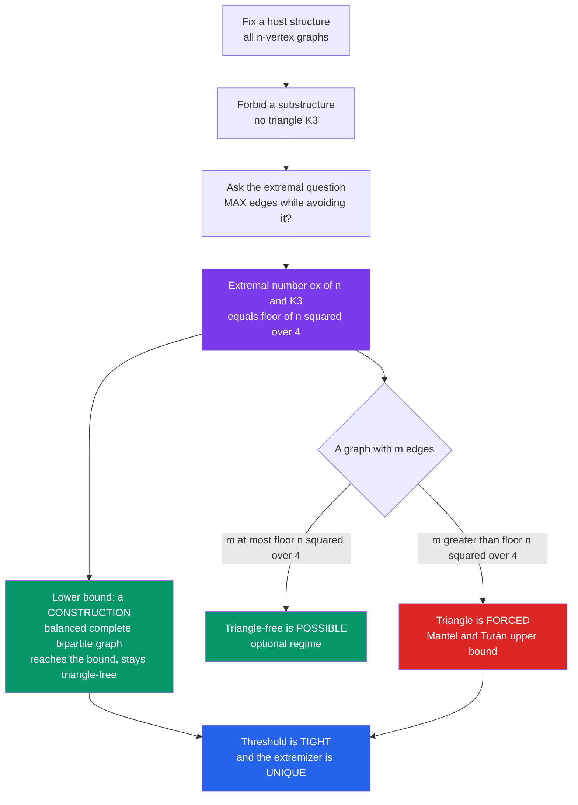

# 🏔️ Extremal Combinatorics

> [!abstract] TL;DR
> Extremal combinatorics asks a single sharp question — *how large (or small) can a discrete structure be while still **avoiding** a forbidden pattern, and exactly when does crossing that size **force** the pattern to appear?* Its flagship result, **Turán's theorem** (with its special case **Mantel's theorem**: a triangle-free graph on $n$ vertices has at most $\lfloor n^2/4\rfloor$ edges), turns "avoid a substructure" into a precise numerical threshold. Push a system one edge past that bound and the forbidden configuration is unavoidable.

---

## Intuition

**Analogy — friendships, roads, and unavoidable patterns.** Picture 100 people at a party and draw a line between any two who are friends. You can pack in an enormous number of friendships — but at some point a trio of three *mutual* friends becomes impossible to avoid: keep adding lines and eventually three of them must close into a triangle. Or picture a road map: you can lay down many roads between towns, but past a certain count a closed loop is forced. In both cases there is a hidden **tipping point** — a maximum you can reach while dodging the pattern, and one step beyond which the pattern *must* materialize.

Extremal combinatorics is the mathematics of exactly those tipping points. It never asks "how many structures are there?" (that is enumerative counting) — it asks "**how big can a structure be before it is forced to contain something?**" The answer is a threshold, and the two halves of every extremal theorem are (1) a **construction** showing the threshold is reachable, and (2) a **forcing proof** showing anything larger cracks. It is the discrete cousin of a phase transition: below the bound the forbidden pattern is optional; above it, inevitable.

---

## How It Works

### Core Mechanics

Every extremal problem is built from the same three moves:

1. **Fix a host and forbid a pattern.** Choose a family of structures (say all graphs on $n$ vertices) and declare one substructure off-limits (say the triangle $K_3$, or the clique $K_r$, or "three sets that pairwise intersect"). The goal is to maximize a size parameter — number of edges, number of sets, cardinality of a family — subject to *never* containing the forbidden pattern.
2. **Pin down the extremal number.** Define $\mathrm{ex}(n, F)$ = the maximum number of edges in an $n$-vertex graph with no copy of $F$. **Mantel (1907):** $\mathrm{ex}(n, K_3) = \lfloor n^2/4\rfloor$. **Turán (1941):** $\mathrm{ex}(n, K_{r+1}) = \big(1 - \tfrac{1}{r}\big)\tfrac{n^2}{2}$, attained by the balanced complete $r$-partite **Turán graph** $T(n,r)$.
3. **Prove both directions.** A **lower bound** exhibits one large object avoiding the pattern (the extremal example). A matching **upper bound** proves *every* larger object contains the pattern (the forcing half). Only when the two meet do you have the exact threshold — and often the extremal example is **unique**, so the bound is not just tight but rigid.

The forbidden pattern need not be a subgraph. In **extremal set theory** the host is the family of subsets of $\{1,\dots,n\}$: **Sperner's theorem** caps an *antichain* (no set contains another) at $\binom{n}{\lfloor n/2\rfloor}$, and **Erdős–Ko–Rado** caps a family of pairwise-*intersecting* $k$-subsets at $\binom{n-1}{k-1}$. Same paradigm, different universe.

The field sits between two poles. **Ramsey theory** proves patterns are forced once a structure is merely *large enough* (regardless of how you build it); extremal theory sharpens this to the *exact density* that forces them. The **probabilistic method** supplies the other half — random constructions often give the best-known lower bounds, proving a large pattern-avoiding object *exists* without building it by hand.

### Flow / Architecture



---

## Key Concepts

### Secondary Level
- **Mantel's theorem** — the entry point: among $n$ people, the most friendships you can have with *no* trio of mutual friends is $\lfloor n^2/4\rfloor$. One more friendship forces a triangle.
- **The extremal example** — split the $n$ vertices into two nearly equal halves and join *every* pair across the halves but *none* within. This balanced **complete bipartite graph** $K_{\lfloor n/2\rfloor,\,\lceil n/2\rceil}$ has exactly $\lfloor n^2/4\rfloor$ edges and, because it has no odd cycle, contains no triangle.
- **The two halves of a proof** — a *construction* shows the bound is reachable; a *forcing argument* shows nothing bigger avoids the pattern. An extremal theorem needs both.

### Undergraduate Level
- **Turán's theorem** — the general clique version: to forbid $K_{r+1}$, the densest graph is the **Turán graph** $T(n,r)$, the balanced complete $r$-partite graph, with $\big(1-\tfrac1r\big)\tfrac{n^2}{2}$ edges. Mantel is the case $r=2$.
- **The extremal number $\mathrm{ex}(n,F)$** — the central object: the max edge count of an $n$-vertex $F$-free graph. Computing or estimating it for various $F$ *is* extremal graph theory.
- **The forbidden-configuration paradigm** — one template ("maximize size subject to avoiding $F$") specializes to graphs, hypergraphs, and set systems. **Sperner's theorem** (largest antichain $=\binom{n}{\lfloor n/2\rfloor}$) and **Erdős–Ko–Rado** (largest intersecting $k$-family $=\binom{n-1}{k-1}$ for $n\ge 2k$) are the set-theory flagships.
- **Uniqueness and stability** — Turán's graph is not merely optimal; it is the *unique* extremizer, and *near*-extremal graphs must *look like* it (stability theorems).

### Graduate Level
- **The Erdős–Stone–Simonovits theorem** — the crown jewel that reduces *all* non-bipartite forbidden graphs to one parameter: $\mathrm{ex}(n,F) = \big(1 - \tfrac{1}{\chi(F)-1}\big)\tfrac{n^2}{2} + o(n^2)$, where $\chi(F)$ is the **chromatic number** of $F$. The extremal *density* is dictated purely by colorability.
- **The bipartite (degenerate) case** — when $\chi(F)=2$ the theorem only says $\mathrm{ex}(n,F)=o(n^2)$; pinning down the true order (e.g. $\mathrm{ex}(n,K_{s,t})$ via **Kővári–Sós–Turán**, the Zarankiewicz problem) is hard and largely open.
- **Density, counting, and supersaturation** — beyond "one copy is forced," *how many* copies appear past the threshold. The **triangle removal lemma** (a graph with $o(n^3)$ triangles can be made triangle-free by deleting $o(n^2)$ edges) powers Roth's theorem on arithmetic progressions.
- **Methods** — *counting/averaging* (double counting, convexity, Cauchy–Schwarz), *shifting and compression* (the standard route to Erdős–Ko–Rado), the *algebraic/polynomial method* (finite-field constructions, the cap-set breakthrough), and the *entropy method* (bounding structure size by the entropy of a random sample). These connect extremal theory to the probabilistic method (random lower bounds) and to Ramsey theory (avoid vs force).

---

## Python Demo

Two experiments make the Mantel/Turán threshold tangible. **(a)** We build the extremal graph — the balanced complete bipartite graph — and verify it hits exactly $\lfloor n^2/4\rfloor$ edges while staying triangle-free; then we generate random graphs with *one more edge* and confirm empirically that **every single one** contains a triangle. **(b)** We sweep the number of edges $m$ for a fixed $n$ and plot the probability a random graph contains a triangle: below the Turán bound it climbs smoothly, but the instant $m$ crosses $\lfloor n^2/4\rfloor$ the probability snaps to a hard **1.0** — the forbidden pattern is *forced*, a discrete phase transition.

```python
# Mantel/Turán threshold made empirical.
# (a) The balanced complete bipartite graph reaches floor(n^2/4) edges and is
#     triangle-free; random graphs with one MORE edge always contain a triangle.
# (b) P(triangle) vs edge count m for fixed n: smooth below the Turán bound,
#     a hard jump to 1.0 the moment m exceeds floor(n^2/4)  -> forcing.
import math
from itertools import combinations
import numpy as np
import matplotlib.pyplot as plt

rng = np.random.default_rng(7)

def turan_bound(n):
    return (n * n) // 4                     # floor(n^2 / 4)

def has_triangle(adj):
    # trace(A^3) counts closed 3-walks; > 0 iff at least one triangle exists
    return np.trace(np.linalg.matrix_power(adj, 3)) > 0

def balanced_bipartite(n):
    a = n // 2                              # split into halves of size a and n-a
    A = np.zeros((n, n), dtype=int)
    A[:a, a:] = 1                           # every cross-pair joined
    A[a:, :a] = 1                           # ... and none within a side
    return A

def random_graph_with_m_edges(n, m):
    all_edges = list(combinations(range(n), 2))
    picks = rng.choice(len(all_edges), size=m, replace=False)
    A = np.zeros((n, n), dtype=int)
    for k in picks:
        i, j = all_edges[k]
        A[i, j] = A[j, i] = 1
    return A

# ---------- (a) the extremal graph is tight AND triangle-free ----------
print("n :  bipartite edges  vs  floor(n^2/4)   triangle-free?")
for n in (6, 7, 10, 20, 51):
    A = balanced_bipartite(n)
    edges = int(A.sum() // 2)
    assert edges == turan_bound(n)          # construction meets the bound exactly
    assert not has_triangle(A)              # ... while avoiding the pattern
    print(f"{n:2d}:  {edges:5d}            {turan_bound(n):5d}         {not has_triangle(A)}")

# one edge past the bound => a triangle is forced (empirically 100%)
n = 20
tb = turan_bound(n)                          # = 100
trials = 400
forced = sum(has_triangle(random_graph_with_m_edges(n, tb + 1)) for _ in range(trials))
print(f"\nn={n}: random graphs with {tb + 1} edges containing a triangle: "
      f"{forced}/{trials}  ({forced / trials:.3f})")

# ---------- (b) forcing curve: P(triangle) vs number of edges ----------
ms = np.arange(1, math.comb(n, 2) + 1, 3)
reps = 200
prob = np.array([np.mean([has_triangle(random_graph_with_m_edges(n, int(m)))
                          for _ in range(reps)]) for m in ms])

# ---------- plot ----------
fig, ax = plt.subplots(1, 2, figsize=(13, 5))

nn = np.arange(2, 41)
ax[0].plot(nn, (nn * nn) // 4, color="#7c3aed", lw=2,
           label="Turán/Mantel bound  floor(n^2/4)")
ax[0].plot(nn, nn * (nn - 1) // 2, color="gray", ls=":",
           label="all possible edges  C(n,2)")
sample = np.array([6, 10, 16, 20, 30, 40])
ext = (sample // 2) * (sample - sample // 2)  # edges of balanced bipartite graph
ax[0].scatter(sample, ext, color="#059669", zorder=3, s=40,
              label="balanced complete bipartite (extremal)")
ax[0].set_xlabel("n vertices"); ax[0].set_ylabel("max triangle-free edges")
ax[0].set_title("Max edges with NO triangle grows like n^2 / 4")
ax[0].legend(); ax[0].grid(alpha=0.3)

ax[1].plot(ms, prob, color="#2563eb", lw=2, marker="o", ms=3,
           label=f"P(triangle present), n={n}")
ax[1].axvline(tb, color="#dc2626", ls="--", label=f"Turán bound = {tb} edges")
ax[1].axvspan(tb, math.comb(n, 2), color="#dc2626", alpha=0.08)
ax[1].annotate("triangle FORCED\nP = 1 guaranteed", (tb + 4, 0.45), color="#dc2626")
ax[1].set_xlabel("number of edges m")
ax[1].set_ylabel("P(random graph has a triangle)")
ax[1].set_title("Cross the Turán threshold -> a triangle is unavoidable")
ax[1].legend(loc="lower right"); ax[1].grid(alpha=0.3)

plt.tight_layout()
plt.savefig("extremal_turan_demo.png", dpi=120)
plt.show()
```

**What you see:** the left panel shows the extremal construction (green dots) sitting *exactly* on the $\lfloor n^2/4\rfloor$ curve — proof that the bound is reachable — well below the $\binom{n}{2}$ ceiling of all possible edges. The right panel is the forcing story: the triangle-probability rises through the "optional" regime, but the red line at $100$ edges marks the Turán bound, and every random graph to its right (the shaded zone) contains a triangle with probability exactly $1$. The console confirms `400/400` forced triangles one edge past the bound. That snap from "optional" to "inevitable" is extremal combinatorics in one picture.

---

## Real-World Applications

> **Example — network community structure and social triads.** A graph with more than $\lfloor n^2/4\rfloor$ edges *cannot* be triangle-free, so any sufficiently dense social or communication network is guaranteed closed triads (mutual-friend triangles). Analysts exploit the contrapositive: an unusually *triangle-sparse* dense graph must be close to bipartite (a two-sided structure), a fact stability theorems make quantitative and that underpins community-detection heuristics.

- **Coding theory and design** — error-correcting codes are extremal set systems: maximize the number of codewords subject to a minimum-distance constraint (a forbidden "too-close" configuration). Constant-weight codes and combinatorial designs are direct Turán-type optimizations.
- **Additive combinatorics and cryptography** — the **cap-set problem** (largest subset of $\mathbb{F}_3^n$ with no three-term arithmetic progression) is an extremal problem whose 2016 polynomial-method resolution reshaped the field; such structure/randomness thresholds inform pseudorandomness and cryptographic constructions.
- **Property testing and databases** — the **triangle removal lemma** yields sublinear-time algorithms that test whether a huge graph is *far* from triangle-free, letting systems audit relationships without scanning everything.
- **Extremal thresholds in random networks** — the density at which a giant component, or an unavoidable clique, appears mirrors the extremal bound; this is the combinatorial backbone of percolation and phase-transition analysis in large networks.
- **Computational biology and chemistry** — bounding the number of feasible interactions (RNA base-pairings, molecular contacts) subject to structural constraints is a forbidden-configuration count that limits search spaces.

---

## Common Pitfalls

- **Confusing an extremal example with a bound proof.** Exhibiting one large pattern-avoiding object proves only a *lower* bound ($\mathrm{ex}(n,F)\ge$ something). The theorem is not done until a matching *upper* bound shows *every* larger object contains $F$. Beginners stop after the construction and mistake it for the full result.
- **Assuming the extremal configuration is obvious or non-unique.** The Turán graph is not just *an* optimum — it is the *unique* extremizer, and near-optimal graphs must resemble it (stability). Guessing the wrong extremal shape (e.g. a near-regular graph instead of a balanced complete multipartite one) derails the whole argument.
- **Forbidding a subgraph vs an *induced* subgraph.** "$F$-free" almost always means *no copy of $F$ as a subgraph* (extra edges allowed). Forbidding $F$ as an *induced* subgraph is a completely different, far harder theory (think Erdős–Hajnal). Silently switching between them invalidates bounds.
- **Reading asymptotic results as exact.** Erdős–Stone–Simonovits gives $\mathrm{ex}(n,F)$ up to a $o(n^2)$ term — superb for non-bipartite $F$, but *useless* when $\chi(F)=2$, where the whole answer lives inside that error term. For bipartite forbidden graphs the exact order is often unknown; do not quote the asymptotic formula as if it settled the case.
- **Ignoring divisibility and floors.** The bound is $\lfloor n^2/4\rfloor$, achieved by the *balanced* split $\lfloor n/2\rfloor \cdot \lceil n/2\rceil$. Using $n^2/4$ for odd $n$, or an unbalanced partition, gives the wrong count and a non-extremal graph.

---

## Related Concepts

- [[Combinatorics/01_Foundations_of_Counting/Combinatorics_Overview|Combinatorics Overview]] — situates extremal combinatorics as the "existence and bounds" branch, alongside enumerative and probabilistic methods.
- [[Combinatorics/01_Foundations_of_Counting/The_Pigeonhole_Principle|The Pigeonhole Principle]] — the humblest forcing tool; many extremal upper bounds ultimately reduce to a clever pigeonhole or double-counting step.
- [[Combinatorics/01_Foundations_of_Counting/The_Binomial_Theorem_and_Coefficients|The Binomial Theorem and Coefficients]] — the extremal bounds of set theory (Sperner, Erdős–Ko–Rado) are stated in binomial coefficients, and $\binom{n}{\lfloor n/2\rfloor}$ is the largest antichain.
- [[Mathematics/04_Discrete_Mathematics/Graph_Theory|Graph Theory]] — supplies the host objects (cliques, bipartite graphs, chromatic number) on which extremal graph theory operates.
- [[Mathematics/04_Discrete_Mathematics/Combinatorics|Combinatorics (Discrete Mathematics)]] — the seed note whose extremal/Ramsey ideas this note deepens.
- [[Mathematics/04_Discrete_Mathematics/Set_Theory_and_Relations|Set Theory and Relations]] — antichains, intersecting families, and the Boolean lattice are the arena of extremal *set* theory.
- [[Systems_Thinking_and_Complexity/02_Complexity_and_Emergence/Criticality_and_Phase_Transitions|Criticality and Phase Transitions]] — the Turán threshold is a discrete phase transition: cross the density bound and the forbidden pattern condenses out.
- [[Systems_Thinking_and_Complexity/03_Networks_and_Connectivity/Small_World_and_Scale_Free_Networks|Small-World and Scale-Free Networks]] — real networks live near extremal density thresholds where clustering (triangles) becomes unavoidable.
- [[Information_Theory/01_Foundations_of_Information_Theory/Entropy_and_Information_Content|Entropy and Information Content]] — the *entropy method* bounds the size of extremal structures via the entropy of a uniformly random sample.
- [[DSA/07_Graphs/Bipartite_Matching|Bipartite Matching]] — the balanced complete *bipartite* graph is the Mantel extremizer, and matching theory shares the same bipartite backbone.

*Sibling notes to be written in this vault (prose references):* **Ramsey Theory** (patterns forced by size rather than density — the avoid-vs-force counterpart), **The Probabilistic Method** (random constructions giving extremal *lower* bounds), **Enumerative Graph Theory** (counting rather than bounding graphs), **Extremal Set Theory** (Sperner and Erdős–Ko–Rado in depth), and **Combinatorial Designs** (extremal set systems meeting equality in packing bounds).

---

## Review Questions

1. **(Secondary)** Explain in words why the balanced complete bipartite graph on $n$ vertices contains no triangle, and why splitting the vertices *unevenly* would give fewer edges. What is the maximum number of triangle-free friendships among 100 people?
2. **(Undergraduate)** State Turán's theorem and identify the Turán graph $T(n,3)$. A graph on 30 vertices has 305 edges. Is it necessarily forced to contain a $K_4$? Compute the relevant Turán bound and justify your answer, noting what the theorem does and does *not* guarantee at exactly the bound.
3. **(Graduate)** Using the Erdős–Stone–Simonovits theorem, explain why the asymptotic extremal number $\mathrm{ex}(n,F)$ depends *only* on the chromatic number $\chi(F)$, and why this makes the theorem nearly silent for bipartite $F$. Sketch how the probabilistic method supplies a lower bound for a case (such as $\mathrm{ex}(n,C_4)$) where the exact order is delicate, and contrast "avoid" (extremal) with "force" (Ramsey) framings of the same underlying tension.

---

## Sources

- [Bollobás, B. — *Extremal Graph Theory* (Dover reprint)](https://store.doverpublications.com/products/9780486435961)
- [Jukna, S. — *Extremal Combinatorics: With Applications in Computer Science* (2nd ed., Springer)](https://link.springer.com/book/10.1007/978-3-642-17364-6)
- [Alon, N. & Spencer, J. — *The Probabilistic Method* (4th ed., Wiley)](https://onlinelibrary.wiley.com/doi/book/10.1002/9781119061966)
- [van Lint, J. H. & Wilson, R. M. — *A Course in Combinatorics* (2nd ed., Cambridge)](https://www.cambridge.org/9780521006019)
- [Diestel, R. — *Graph Theory* (5th ed.), Ch. 7 "Extremal Graph Theory" (free online)](https://diestel-graph-theory.com/)

---

#combinatorics #extremal-combinatorics #turan-theorem #forbidden-structures #thresholds
