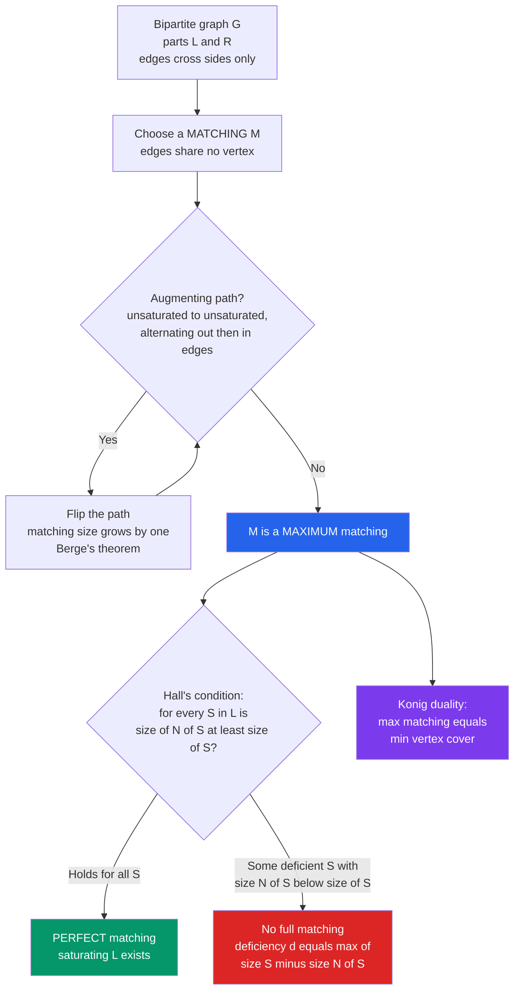

# 💍 Matching Theory and Hall's Theorem

> [!abstract] TL;DR
> A **matching** is a set of edges that share no endpoints — a way of pairing things up cleanly. In a **bipartite** graph (applicants on one side, jobs on the other), the central question is *how many pairings can we make, and when can we pair up everyone?* **Hall's Marriage Theorem** answers the second with one crisp condition: a matching saturating side $L$ exists **iff every subset $S \subseteq L$ collectively touches at least $|S|$ vertices on the other side** ($|N(S)| \ge |S|$). Behind it sit **Berge's augmenting-path** characterization of maximum matchings and **König's theorem** (in bipartite graphs, *max matching = min vertex cover*) — a min-max duality that is the combinatorial face of [[LP_Duality|linear-programming duality]] and [[Network_Flow|max-flow / min-cut]].

---

## Intuition

**Analogy:** You run a hiring desk. A room of **applicants** sits on the left; a board of **jobs** sits on the right. Draw an edge whenever an applicant is *qualified* for a job. You want to hire everyone into a job they can actually do, with no job given to two people and no person given two jobs. Can you always do it?

Greedy hiring gets stuck: applicant A grabs job 1, then applicant B — who is qualified for *only* job 1 — is left jobless, even though A was also qualified for job 2. The repair is to **bump**: send B toward job 1, kick A off it, and re-seat A in job 2. That alternating chain "jobless person → job → its current holder → another job → …" ending at a free job is an **augmenting path**; flipping it hires exactly one more person.

The deep surprise is Hall's theorem: whether *everyone* can be hired reduces to a single, checkable condition. If some group of $k$ applicants is *collectively* qualified for fewer than $k$ jobs, they are doomed — there simply are not enough jobs to go around for that clique, so no full assignment exists. Hall says this obvious obstruction is the **only** obstruction: **if every group of applicants qualifies for at least as many jobs as its own size, a full hiring always exists.** One messy combinatorial puzzle collapses to one clean inequality — and the same inequality quietly governs scheduling, resource assignment, Latin-square completion, and network routing.

---

## How It Works

### Core Mechanics

1. **Matchings.** In a graph $G=(V,E)$, a **matching** $M \subseteq E$ is a set of edges, no two sharing a vertex. A vertex touched by $M$ is *saturated*. Flavors:
   - **Maximal**: cannot add any edge without conflict (a local dead end — greedy stops here).
   - **Maximum**: largest possible $|M|$ (a global optimum). Maximal $\ne$ maximum.
   - **Perfect**: saturates *every* vertex ($|M| = |V|/2$). A perfect matching is maximum, but not conversely.
2. **Bipartite setting.** $V = L \cup R$ with edges only crossing sides. The "assignment / marriage" problem asks for a matching **saturating $L$** (every applicant hired). This needs $|M| = |L|$, so necessarily $|L| \le |R|$.
3. **Berge's theorem (augmenting paths).** An **augmenting path** for $M$ alternates non-matching / matching edges and starts *and ends* at unsaturated vertices. **A matching is maximum iff it admits no augmenting path.** Flipping (XOR-ing) $M$ with such a path increases $|M|$ by exactly one — this is the engine of every matching algorithm.
4. **Hall's Marriage Theorem.** For a bipartite graph, a matching saturating $L$ exists **iff Hall's condition holds**:
   $$|N(S)| \ge |S| \quad \text{for every subset } S \subseteq L,$$
   where $N(S) = \bigcup_{v \in S} N(v)$ is the joint neighborhood. **Deficiency version (Ore):** the maximum matching has size
   $$\nu(G) = |L| - \max_{S \subseteq L}\bigl(|S| - |N(S)|\bigr) = |L| - \mathrm{def}(G).$$
   The single worst *deficient set* $S$ measures exactly how many applicants must go unhired.
5. **König's theorem (min-max duality).** In a **bipartite** graph, the size of a maximum matching equals the size of a minimum **vertex cover** (a smallest set of vertices touching every edge):
   $$\nu(G) = \tau(G).$$
   Equivalently (complement) *max independent set $= |V| - \nu$*. Hall's theorem is the special case where $\tau(G) = |L|$.
6. **Algorithms.** Repeatedly find augmenting paths: **Kuhn / Hungarian-style DFS** in $O(V\cdot E)$; **Hopcroft–Karp** batches shortest augmenting paths for $O(E\sqrt{V})$. Both are unit-capacity [[Network_Flow|max-flow]] in disguise; the **Hungarian algorithm** solves the *weighted* assignment problem in $O(V^3)$.
7. **Beyond bipartite.** For general graphs, **Tutte's theorem** characterizes a perfect matching via odd-component counts, and **Edmonds' blossom algorithm** finds maximum matchings in polynomial time by contracting odd cycles ("blossoms"). König and Hall are bipartite-only.

### Flow / Architecture



---

## Key Concepts

### Secondary (school level)
- **Matching = pairing without conflict.** Think of pairing dance partners or matching gloves to hands — no hand gets two gloves.
- **Perfect matching:** everyone is paired, nobody left over. Needs equal-sized sides.
- **The marriage picture:** $n$ people on each side, "compatible" edges; can we marry everyone off so all couples are compatible? Hall's condition says yes exactly when *no group of people is collectively compatible with too few partners*.
- **Small obstruction:** if three applicants are all only qualified for the same two jobs, one must go unhired — three into two won't fit. This is a [[The_Pigeonhole_Principle|pigeonhole]]-flavored blockage.

### Undergraduate
- **Hall's condition, formally:** saturate $L$ iff $|N(S)| \ge |S|$ for all $S \subseteq L$. The *necessity* is trivial (a saturated $S$ needs $\ge |S|$ distinct partners); the *sufficiency* is the theorem, provable by induction on $|L|$ or via augmenting paths.
- **System of Distinct Representatives (SDR).** Given sets $A_1, \dots, A_n$, an SDR is distinct elements $x_i \in A_i$. An SDR exists **iff** every union of $k$ of the sets has $\ge k$ elements — this is *literally* Hall's theorem with $L = \{A_i\}$ and $R$ the ground set. Latin-square row completion is repeated SDR selection.
- **Berge's augmenting-path theorem** and the resulting **Kuhn algorithm**: reset "visited" once per left vertex, DFS for an augmenting path, augment. $O(V\cdot E)$.
- **König's theorem:** max matching $=$ min vertex cover in bipartite graphs; converts covering problems into matching problems and vice versa.
- **Deficiency formula:** $\nu(G) = |L| - \max_S(|S| - |N(S)|)$ tells you *how many* stay unmatched, not just *whether* a perfect matching exists.

### Graduate
- **König–Egerváry / LP view.** The bipartite matching polytope is defined by $x_e \ge 0$, $\sum_{e \ni v} x_e \le 1$; its constraint matrix is **totally unimodular**, so the LP relaxation has integral vertices. König's min-max is exactly **strong [[LP_Duality|LP duality]]** between fractional matching and fractional vertex cover — and, via unit capacities, **max-flow / min-cut** ([[Network_Flow]]).
- **Tutte's theorem (general graphs).** $G$ has a perfect matching iff for every $S \subseteq V$, the number of odd components of $G - S$ is $\le |S|$. The **Tutte–Berge formula** gives the general deficiency. Hall is the bipartite specialization.
- **Edmonds' blossom algorithm.** First polynomial-time maximum matching in general graphs; contracts odd cycles to sidestep the failure of naïve augmenting-path search when odd cycles exist.
- **Weighted assignment.** Minimize $\sum w_{ij} x_{ij}$ over perfect matchings — the **Hungarian algorithm** ($O(n^3)$) uses dual potentials (a primal-dual method mirroring [[Network_Flow|min-cost flow]]).
- **Extremal & design links.** Hall/SDR underpin **completing Latin rectangles to Latin squares**, **edge-colorings** (a bipartite graph of max degree $\Delta$ is $\Delta$-edge-colorable = a partition into $\Delta$ perfect matchings, Kőnig's edge-coloring theorem), and resolvable **combinatorial designs**. Defect Hall and expansion feed into **extremal combinatorics** (e.g. matchings in the hypercube, Erdős–Ko–Rado style problems).

---

## Python Demo

```python
# Bipartite matching & Hall's theorem, from scratch (numpy + matplotlib).
#   (a) maximum matching via augmenting-path DFS (Kuhn) on a small bipartite graph
#   (b) Hall's theorem in action:
#         G_ok  SATISFIES Hall  -> perfect matching exists (shown highlighted)
#         G_bad VIOLATES Hall   -> a deficient set S with |N(S)| < |S| (identified)
#       verifying Konig's theorem  max matching = min vertex cover  on each graph.
from itertools import combinations
from collections import deque
import numpy as np
import matplotlib.pyplot as plt

# ---------- (a) maximum bipartite matching: Kuhn's augmenting-path DFS -------
def max_matching(adj, n_left, n_right):
    """adj[u] = list of right-vertices adjacent to left u. Returns match_r."""
    match_r = [-1] * n_right                    # match_r[v] = left owner of right v
    def augment(u, seen):
        for v in adj[u]:
            if not seen[v]:
                seen[v] = True
                if match_r[v] == -1 or augment(match_r[v], seen):
                    match_r[v] = u              # (re)assign right v to left u
                    return True
        return False
    for u in range(n_left):
        augment(u, [False] * n_right)           # fresh "seen" per left vertex
    return match_r

def pairs(match_r):
    return [(u, v) for v, u in enumerate(match_r) if u != -1]

# ---------- Hall's condition: scan every subset S of L ----------------------
def neighborhood(adj, S):
    N = set()
    for u in S:
        N.update(adj[u])
    return N

def worst_hall_set(adj, n_left):
    """Return (S, deficiency) maximizing |S| - |N(S)|; deficiency>0 => Hall fails."""
    best = (set(), 0)
    for r in range(1, n_left + 1):
        for S in combinations(range(n_left), r):
            d = len(S) - len(neighborhood(adj, S))
            if d > best[1]:
                best = (set(S), d)
    return best

# ---------- Konig: minimum vertex cover from a maximum matching -------------
def min_vertex_cover(adj, n_left, n_right, match_r):
    match_l = [-1] * n_left
    for v, u in enumerate(match_r):
        if u != -1:
            match_l[u] = v
    visL = [False] * n_left
    visR = [False] * n_right
    dq = deque()
    for u in range(n_left):                     # start from UNMATCHED left vertices
        if match_l[u] == -1:
            visL[u] = True
            dq.append(('L', u))
    while dq:                                    # alternating BFS from U
        side, x = dq.popleft()
        if side == 'L':                          # follow NON-matching edges L->R
            for v in adj[x]:
                if match_l[x] != v and not visR[v]:
                    visR[v] = True
                    dq.append(('R', v))
        else:                                    # follow MATCHING edge R->L
            u = match_r[x]
            if u != -1 and not visL[u]:
                visL[u] = True
                dq.append(('L', u))
    cover_L = [u for u in range(n_left) if not visL[u]]     # Konig cover
    cover_R = [v for v in range(n_right) if visR[v]]
    return cover_L, cover_R

# ---------- two example graphs ----------------------------------------------
# G_ok: 4x4, a "cycle" of overlaps -> Hall holds, perfect matching exists
G_ok = {0: [0, 1], 1: [1, 2], 2: [2, 3], 3: [3, 0]}
# G_bad: applicants 0,1,2 are ALL only qualified for jobs 0,1  ->  |N({0,1,2})|=2 < 3
G_bad = {0: [0, 1], 1: [0, 1], 2: [0, 1], 3: [2, 3]}

def analyze(name, adj, nL, nR):
    mr = max_matching(adj, nL, nR)
    M = pairs(mr)
    S, d = worst_hall_set(adj, nL)
    cL, cR = min_vertex_cover(adj, nL, nR, mr)
    print(f"[{name}] max matching = {len(M)}  pairs={M}")
    print(f"         min vertex cover = {len(cL)+len(cR)}  "
          f"(L={cL}, R={cR})  -> Konig OK: {len(M)==len(cL)+len(cR)}")
    if d > 0:
        print(f"         HALL VIOLATED: S={sorted(S)} has |N(S)|="
              f"{len(neighborhood(adj,S))} < |S|={len(S)}  (deficiency {d})")
        print(f"         => max matching = |L| - deficiency = {nL} - {d} = {nL-d}\n")
    else:
        print(f"         HALL HOLDS for all S  =>  PERFECT matching saturating L\n")
    return mr, M, S, d

print("=== Kuhn max matching + Hall + Konig ===")
mr_ok,  M_ok,  S_ok,  d_ok  = analyze("G_ok ", G_ok,  4, 4)
mr_bad, M_bad, S_bad, d_bad = analyze("G_bad", G_bad, 4, 4)

# ---------- plot both bipartite graphs --------------------------------------
def draw(ax, adj, nL, nR, M, hall_S, title):
    posL = {u: (0.0, -u) for u in range(nL)}
    posR = {v: (1.0, -v) for v in range(nR)}
    matched = set(M)
    for u in adj:                                    # all edges (gray) then matching (bold)
        for v in adj[u]:
            xy = [posL[u][0], posR[v][0]], [posL[u][1], posR[v][1]]
            if (u, v) in matched:
                ax.plot(*xy, color="#059669", lw=3.2, zorder=2)
            else:
                ax.plot(*xy, color="#cbd5e1", lw=1.2, zorder=1)
    for u, (x, y) in posL.items():
        c = "#dc2626" if u in hall_S else "#2563eb"  # deficient set in red
        ax.scatter([x], [y], s=520, color=c, zorder=3, edgecolors="k")
        ax.text(x, y, f"a{u}", ha="center", va="center", color="w", fontweight="bold")
    for v, (x, y) in posR.items():
        ax.scatter([x], [y], s=520, color="#7c3aed", zorder=3, edgecolors="k")
        ax.text(x, y, f"j{v}", ha="center", va="center", color="w", fontweight="bold")
    ax.set_title(title); ax.axis("off"); ax.set_xlim(-0.35, 1.35)

fig, axes = plt.subplots(1, 2, figsize=(12, 5))
draw(axes[0], G_ok,  4, 4, M_ok,  set(),
     f"G_ok: Hall holds -> PERFECT matching  |M|={len(M_ok)}")
draw(axes[1], G_bad, 4, 4, M_bad, S_bad,
     f"G_bad: Hall VIOLATED  S={sorted(S_bad)}  |N(S)|=2<3  |M|={len(M_bad)}")
fig.suptitle("Bipartite matching (green) + Hall-violating set (red)", fontweight="bold")
plt.tight_layout()
plt.savefig("matching_hall_demo.png", dpi=120)
plt.show()
```

Running it prints a **size-4 perfect matching** for `G_ok` (Hall holds, König gives min cover $=4$) and a **size-3 maximum matching** for `G_bad`, where the scan pinpoints the deficient set $S=\{0,1,2\}$ with $|N(S)|=2<3$ — so exactly one applicant must go unhired, matching the deficiency formula $|L|-\mathrm{def}=4-1=3$, and König's min vertex cover is likewise $3$. The plot shows the matched edges in green and the doomed applicant clique in red.

---

## Real-World Applications

> **Example:** **Ride-hailing / driver dispatch (Uber, Lyft).** Riders on one side, nearby drivers on the other, edges = feasible pickups within time/ETA limits. Each dispatch cycle solves a **maximum (weighted) bipartite matching**: a driver serves one rider, a rider gets one driver, and the platform maximizes served requests (or minimizes total wait) via the **Hungarian algorithm / min-cost flow**. Hall's condition is the diagnostic for *supply deserts* — a batch of riders whose collective reachable-driver set is too small is provably un-servable, signaling where to surge or rebalance.

- **Job / task scheduling & cloud placement.** Assigning pods to nodes, jobs to machines, or interns to teams under eligibility constraints is bipartite matching; Hall's condition detects infeasible constraint sets before you attempt a schedule.
- **Kidney-exchange and stable-matching adjacents.** Compatibility graphs among donor–recipient pairs use **general-graph matching** (blossom/Edmonds) because compatibility is not bipartite; national exchange programs run maximum-weight matching to save the most lives per round.
- **Content / ad serving.** Impressions ↔ campaigns with budget and targeting edges: online bipartite matching (RANKING algorithm, $1-1/e$ competitive) is the theoretical backbone of display-ad allocation.
- **Networking & switching.** Input-queued switch fabrics schedule packets by computing a maximum matching between input and output ports every time slot (iSLIP); throughput guarantees rest on matching size.
- **Latin squares, timetables, and Sudoku completion.** Filling each new row/slot is choosing a **System of Distinct Representatives**; Hall guarantees a partial Latin rectangle always extends to a full Latin square.
- **Register allocation & assignment problems** in compilers, and **crew/gate assignment** in airlines, are weighted assignment (Hungarian) at their core.

---

## Common Pitfalls

- **Checking Hall's condition on too few subsets.** Hall requires $|N(S)| \ge |S|$ for **every** $S \subseteq L$ — all $2^{|L|}$ of them, not just singletons or the full set $L$. A graph can satisfy $|N(L)| \ge |L|$ globally yet fail on an internal clique (like $\{0,1,2\}$ above). *Don't verify Hall by hand for large $L$;* find the maximum matching and use the deficiency formula instead — checking all subsets is exponential, but computing a maximum matching is polynomial.
- **Bipartite-only theorems on general graphs.** König ($\nu=\tau$) and Hall are **false** for non-bipartite graphs. A triangle $K_3$ has max matching $1$ but min vertex cover $2$. For general graphs you need **Tutte's theorem** and **Edmonds' blossom algorithm** (odd cycles break naïve augmenting-path DFS).
- **Confusing maximal with maximum.** A *maximal* matching (greedy, can't extend) can be far from *maximum*. On a path of 3 edges, greedily picking the middle edge gives a maximal matching of size 1, while the maximum is 2. Berge's augmenting-path test is what certifies *maximum*.
- **Maximum ≠ perfect.** A maximum matching always exists; a *perfect* one need not. Reporting "found the maximum matching" does **not** mean everyone is matched — check whether $|M| = |L|$ (or $|V|/2$).
- **Cardinality vs weight.** Kuhn/Hopcroft–Karp maximize the *number* of pairs. If pairs have costs/values (the **assignment problem**), you must use the **Hungarian algorithm** or **min-cost max-flow** — maximizing count and minimizing cost are different objectives that generally pick different matchings.
- **Resetting `visited` at the wrong scope** in augmenting-path DFS: reset once *per left vertex*, not inside the recursion, or you either loop forever or miss augmenting paths.
- **Assuming $|L| \le |R|$ automatically.** Saturating $L$ is impossible if $|L| > |R|$; Hall's condition already encodes this via $S = L$.

---

## Related Concepts

- [[Graph_Theory]] — matchings, vertex covers, and independent sets are core graph-theoretic objects; this note is their combinatorial optimization story.
- [[Bipartite_Matching]] — the DSA/algorithms companion: Kuhn, Hopcroft–Karp, complexity, and LeetCode patterns for computing the matchings analyzed here.
- [[Network_Flow]] — bipartite matching is unit-capacity max-flow; König's min-max is the max-flow / min-cut theorem specialized, and the Hungarian algorithm is min-cost flow.
- [[LP_Duality]] — König/Hall is strong LP duality between the (totally unimodular, hence integral) fractional-matching and fractional-vertex-cover programs.
- [[Duality_Theory]] — the general convex-duality frame in which matching's min-max sits.
- [[The_Pigeonhole_Principle]] — the intuitive obstruction "$k$ applicants sharing fewer than $k$ jobs" is a pigeonhole argument; Hall says it is the *only* obstruction.
- [[Set_Theory_and_Relations]] — a System of Distinct Representatives is a transversal of a family of sets; Hall's theorem is the existence criterion for such transversals.
- [[Combinatorics]] — situates matching within discrete mathematics alongside counting and design theory.

*Siblings in this Combinatorics vault (prose references, to be written): **Enumerative Graph Theory** (counting matchings, permanents, and the matching polynomial), **Combinatorial Designs** (Latin squares and resolvable designs built from disjoint perfect matchings), **Combinatorial Optimization and Polytopes** (the matching polytope, total unimodularity, Edmonds' blossom inequalities), and **Extremal Combinatorics** (how large a graph forces a large matching, expansion, and Hall-type thresholds).*

---

## Review Questions

1. **(Secondary)** Four children each want a pet; the shelter has four pets, and each child likes only *some* of them. If three of the children collectively like only two of the pets, explain why not every child can go home with a pet they like. Which general condition does this violate?
2. **(Undergraduate)** State Hall's Marriage Theorem precisely and prove *necessity* (if a saturating matching exists then $|N(S)| \ge |S|$ for all $S$). Then explain the **deficiency formula** $\nu(G) = |L| - \max_S(|S| - |N(S)|)$ and use it to compute the maximum matching of `G_bad` from the demo without running any algorithm.
3. **(Graduate)** Prove König's theorem ($\nu = \tau$ in bipartite graphs) from the max-flow / min-cut theorem, and separately sketch how the same equality follows from **LP duality** given that the bipartite matching polytope's constraint matrix is totally unimodular. Why does the argument break for $K_3$, and what replaces König and Hall in the general (non-bipartite) case?

---

## Sources

- Lovász, L. & Plummer, M. D. — *Matching Theory* (the definitive monograph; Hall, König, Tutte, blossoms, and beyond).
- Bollobás, B. — *Modern Graph Theory*, Ch. III (Matchings, Hall's theorem, König, Tutte).
- Schrijver, A. — *Combinatorial Optimization: Polyhedra and Efficiency*, Vol. A (matching polytopes, TU matrices, min-max duality).
- van Lint, J. H. & Wilson, R. M. — *A Course in Combinatorics*, chapters on systems of distinct representatives and Hall's theorem.
- West, D. B. — *Introduction to Graph Theory*, §3.1–3.3 (matchings, augmenting paths, König, Hall).

---

#combinatorics #matching-theory #halls-theorem #bipartite #assignment
