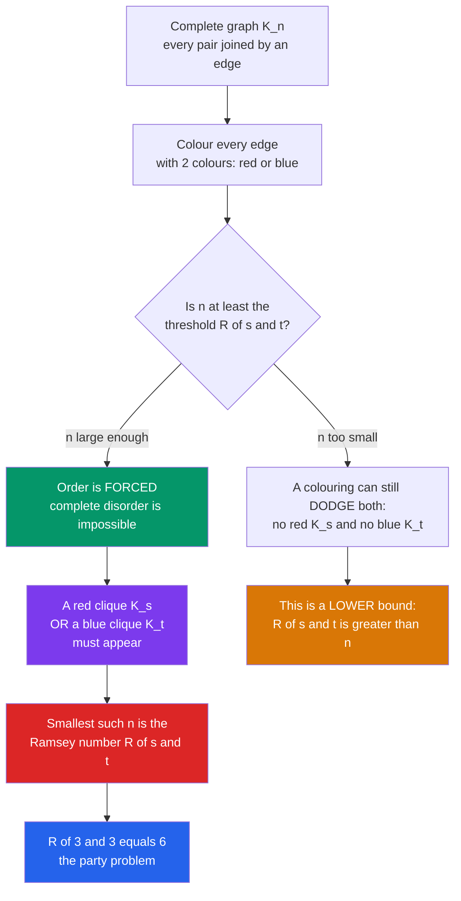

# 🎉 Ramsey Theory

> [!abstract] TL;DR
> **Complete disorder is impossible.** Any structure that is large enough — however randomly it is arranged — is *forced* to contain a highly ordered sub-pattern. The flagship result: at a party of just **six** people, it is mathematically guaranteed that either three of them all know each other or three are mutual strangers, no matter who you invite. Ramsey theory measures exactly *how big is big enough*, and the answer explodes so violently that the sixth such number, $R(5,5)$, is still unknown.

---

## Intuition

**Analogy:** Invite **six** people to a party. Draw a line between every pair: **red** if they already know each other, **blue** if they are strangers. Ramsey's theorem promises that no matter how the friendships fall, you *cannot avoid* creating either a red triangle (three mutual acquaintances) or a blue triangle (three mutual strangers). Try as hard as you like to arrange a "maximally mixed," patternless party — a monochromatic trio always slips through. With only *five* guests you can just barely dodge it; at *six* it becomes unavoidable.

That is the haunting slogan of the whole field: **"complete disorder is impossible."** Take any sufficiently large system — a graph, a coloured number line, a high-dimensional grid — and an ordered island *must* emerge from the chaos. Randomness cannot save you; scale defeats it. Ramsey theory is the mathematics of this inevitability, and its central difficulty is that *knowing* order must appear tells you almost nothing about *how large* the system has to be before it does.

---

## How It Works

### Core Mechanics

1. **The setup.** Take the complete graph $K_n$ — $n$ vertices with an edge between *every* pair. **Colour each edge** with one of two colours (red / blue). A "monochromatic clique" is a set of vertices all of whose internal edges share one colour.
2. **Ramsey's theorem (finite, 2-colour).** For any target sizes $s$ and $t$ there exists a threshold $n$ so large that **every** red/blue colouring of $K_n$ contains a **red $K_s$ or a blue $K_t$**. Existence is guaranteed; the colouring cannot escape.
3. **The Ramsey number.** $R(s,t)$ is the *smallest* such $n$. Below it, some clever colouring dodges both structures; at it and above, order is forced. By symmetry $R(s,t)=R(t,s)$, and $R(2,t)=t$ trivially.
4. **The party problem.** $R(3,3)=6$: every 2-colouring of $K_6$ has a monochromatic triangle, and $K_5$ has one (the pentagon/pentagram) that does not.
5. **Why order is forced — the pigeonhole seed.** Pick any vertex $v$ in $K_6$. It has 5 edges in 2 colours, so by the [pigeonhole principle](The_Pigeonhole_Principle) at least $\lceil 5/2\rceil = 3$ share a colour, say red, going to $a,b,c$. If *any* edge among $a,b,c$ is red, that edge plus $v$ makes a red triangle. If *none* is red, then $a,b,c$ form a blue triangle. Either way — done. Ramsey theory is pigeonhole with the volume turned all the way up.
6. **Growth.** The upper bound comes from an induction giving $R(s,t)\le\binom{s+t-2}{s-1}$, so $R(k,k)\le 4^{k}$; the matching *lower* bound $R(k,k)>2^{k/2}$ comes not by construction but from the **probabilistic method** — a random colouring almost surely avoids a large monochromatic clique. The exact value sits somewhere in this exponential canyon, and pinning it down is brutally hard.
7. **Generalizations.** More colours ($R(s_1,\dots,s_r)$), cliques replaced by edges of a hypergraph (hypergraph Ramsey), and — most strikingly — the theme escapes graphs entirely: van der Waerden (monochromatic arithmetic progressions), Schur, Hales–Jewett, and Rado's theorem all say *the same thing in different clothes*.

### Flow / Architecture



---

## Key Concepts

### Secondary (school level)
- **The party problem.** Among any 6 people, 3 are mutual friends or 3 are mutual strangers. Among only 5, this can fail.
- **Two colours, one guarantee.** Colour the edges of a big enough complete graph any way you like — a same-colour triangle is unavoidable.
- **The slogan.** "Complete disorder is impossible." Big systems always hide order.

### Undergraduate
- **Ramsey number $R(s,t)$.** Smallest $n$ so every 2-colouring of $K_n$ has a red $K_s$ or blue $K_t$. Symmetric: $R(s,t)=R(t,s)$.
- **The recursive upper bound.** $R(s,t)\le R(s-1,t)+R(s,t-1)$, which unrolls to $R(s,t)\le\binom{s+t-2}{s-1}$ and hence $R(k,k)\le 4^k$. Proof: fix a vertex, split its neighbours by edge colour, recurse via pigeonhole.
- **Lower bounds by the probabilistic method.** Colour $K_n$'s edges by independent coin flips; the *expected* number of monochromatic $K_k$'s is $\binom{n}{k}2^{1-\binom{k}{2}}$. If this is below 1, some colouring has *none*, proving $R(k,k)>n$. This yields $R(k,k)>2^{k/2}$ **without exhibiting a single colouring** — Erdős's 1947 birth of the probabilistic method.
- **Van der Waerden's theorem.** Colour the integers $1,2,\dots,N$ with $r$ colours; for $N$ large enough there is a monochromatic arithmetic progression of any desired length $k$. Same "order forced" flavour on the number line, not a graph.
- **Schur's theorem.** Any finite colouring of the positive integers has a monochromatic solution to $x+y=z$.

### Graduate
- **Infinite Ramsey theorem.** Colour the edges of the *infinite* complete graph on $\mathbb{N}$ with finitely many colours: there is an **infinite** monochromatic clique. (The finite version follows by a compactness / König's-lemma argument.) This is the cleanest statement of "order is unavoidable at scale."
- **Hypergraph Ramsey.** Colour the $k$-element subsets of an $n$-set; $R_k(s;r)$ thresholds grow as *towers* of exponentials in $k$ (Erdős–Rado stepping-up lemma), a qualitatively wilder growth than the graph case.
- **The probabilistic method, sharpened.** The Lovász Local Lemma and alteration/deletion arguments push lower bounds to $R(k,k)\ge (1+o(1))\frac{k}{e\sqrt2}2^{k/2}$; the 2023 breakthrough of Campos–Griffiths–Morris–Sahasrabudhe finally broke the $4^k$ upper barrier to $(4-\varepsilon)^k$, the first exponential improvement in ~75 years.
- **Hales–Jewett theorem.** The abstract "master theorem" behind van der Waerden: in a high-enough-dimensional combinatorial cube $[m]^n$, any $r$-colouring has a monochromatic combinatorial line. Density version (Furstenberg–Katznelson) underlies Szemerédi's theorem and links to **additive combinatorics** and ergodic theory.
- **Rado / Folkman–Rado–Sanders.** Classifies exactly which systems of linear equations are "partition regular" (always have monochromatic solutions), unifying Schur and van der Waerden. **Structural Ramsey theory** lifts all of this to categories of ordered structures, connecting to topological dynamics (KPT correspondence).
- **Computational reality.** Ramsey numbers are astronomically hard: $R(5,5)$ is only bracketed as $43\le R(5,5)\le 48$, and $R(6,6)$ merely $102\le R(6,6)\le 160$ — despite decades of massive computation. This is not laziness; the search space is hyper-exponential.

---

## Python Demo

```python
# Verifying R(3,3) = 6, and visualizing why Ramsey numbers are terrifyingly hard.
#   (a) K5 HAS a 2-colouring with NO monochromatic triangle (the pentagon +
#       pentagram) -> R(3,3) > 5. And EXHAUSTIVELY, K6 has NONE: every one of the
#       2^15 colourings contains a monochromatic triangle -> R(3,3) <= 6.
#       Together: R(3,3) = 6.
#   (b) The known Ramsey numbers explode exponentially; R(5,5) is still unknown.
import numpy as np
import matplotlib.pyplot as plt
from itertools import combinations, product

def edge_list(n):
    return list(combinations(range(n), 2))          # all unordered pairs i<j

def triangles(n):
    return list(combinations(range(n), 3))          # all 3-subsets

def has_mono_triangle(coloring, tris):
    # coloring maps edge (a,b) with a<b to 0(red)/1(blue)
    for a, b, c in tris:                             # a<b<c, so all pairs are sorted
        if coloring[(a, b)] == coloring[(a, c)] == coloring[(b, c)]:
            return True
    return False

# ---------- (a) EXHAUSTIVE proof that R(3,3) = 6 ---------------------------
def count_triangle_free_colorings(n):
    E, T = edge_list(n), triangles(n)
    free = 0
    for bits in product((0, 1), repeat=len(E)):     # every 2-colouring of K_n
        if not has_mono_triangle(dict(zip(E, bits)), T):
            free += 1
    return free, 2 ** len(E)

free5, total5 = count_triangle_free_colorings(5)    # 2^10 = 1024 colourings
free6, total6 = count_triangle_free_colorings(6)    # 2^15 = 32768 colourings
print(f"K5: {free5}/{total5} colourings avoid a mono triangle  ->  R(3,3) > 5")
print(f"K6: {free6}/{total6} colourings avoid a mono triangle  ->  R(3,3) <= 6")
print(f"=> R(3,3) = 6   (party problem)\n")

# The explicit K5 witness: pentagon = red, pentagram = blue
E6 = edge_list(6)
red5   = [(i, (i + 1) % 5) for i in range(5)]       # outer 5-cycle  (red)
blue5  = [(i, (i + 2) % 5) for i in range(5)]       # inner star     (blue)
red5   = [tuple(sorted(e)) for e in red5]
blue5  = [tuple(sorted(e)) for e in blue5]
witness = {e: (0 if e in red5 else 1) for e in edge_list(5)}
assert not has_mono_triangle(witness, triangles(5)), "pentagon witness broke!"
print("Explicit K5 witness (pentagon+pentagram) has NO monochromatic triangle: verified\n")

# ---------- (b) known Ramsey numbers explode; R(5,5) unknown ---------------
# Erdos's quip: if aliens demand R(5,5) or they destroy Earth, marshal every
# computer and mathematician to find it. But if they ask for R(6,6) -- better
# to attack the aliens.
ks   = np.array([2, 3, 4, 5, 6])
lo   = np.array([2, 6, 18, 43, 102], dtype=float)   # proven lower bounds
hi   = np.array([2, 6, 18, 48, 160], dtype=float)   # proven upper bounds
known = np.array([True, True, True, False, False])  # exact vs still a range
print("Diagonal Ramsey numbers R(k,k):")
for k, a, b, kn in zip(ks, lo, hi, known):
    tag = f"= {int(a)}" if kn else f"in [{int(a)}, {int(b)}]  (UNKNOWN)"
    print(f"   R({k},{k}) {tag}")

# ---------- plot ----------------------------------------------------------
def circle_coords(n):
    ang = np.linspace(0, 2 * np.pi, n, endpoint=False) + np.pi / 2
    return np.column_stack([np.cos(ang), np.sin(ang)])

def find_mono_triangle(coloring, tris):
    for a, b, c in tris:
        if coloring[(a, b)] == coloring[(a, c)] == coloring[(b, c)]:
            return (a, b, c), coloring[(a, b)]
    return None, None

RED, BLUE = "#dc2626", "#2563eb"
fig, ax = plt.subplots(1, 3, figsize=(16.5, 5.4))

# Panel 0: K5 witness -- no monochromatic triangle
P5 = circle_coords(5)
for u, v in red5:
    ax[0].plot([P5[u, 0], P5[v, 0]], [P5[u, 1], P5[v, 1]], color=RED,  lw=2.6, zorder=1)
for u, v in blue5:
    ax[0].plot([P5[u, 0], P5[v, 0]], [P5[u, 1], P5[v, 1]], color=BLUE, lw=2.6, zorder=1)
ax[0].scatter(P5[:, 0], P5[:, 1], s=320, color="#111", zorder=3)
for i, (x, y) in enumerate(P5):
    ax[0].text(x, y, str(i), color="white", ha="center", va="center", zorder=4, fontsize=11)
ax[0].set_title("K5: pentagon + pentagram\nNO mono triangle  =>  R(3,3) > 5")
ax[0].set_aspect("equal"); ax[0].axis("off")

# Panel 1: a random K6 colouring -- a mono triangle is FORCED, highlight it
rng = np.random.default_rng(7)
col6 = {e: int(rng.integers(0, 2)) for e in E6}
tri, tcol = find_mono_triangle(col6, triangles(6))
P6 = circle_coords(6)
for (u, v), c in col6.items():
    ax[1].plot([P6[u, 0], P6[v, 0]], [P6[u, 1], P6[v, 1]],
               color=RED if c == 0 else BLUE, lw=1.5, alpha=0.45, zorder=1)
for u, v in combinations(tri, 2):
    ax[1].plot([P6[u, 0], P6[v, 0]], [P6[u, 1], P6[v, 1]],
               color=RED if tcol == 0 else BLUE, lw=5.0, zorder=2)
ax[1].scatter(P6[:, 0], P6[:, 1], s=320, color="#111", zorder=3)
for i, (x, y) in enumerate(P6):
    ax[1].text(x, y, str(i), color="white", ha="center", va="center", zorder=4, fontsize=11)
ax[1].set_title("K6: every colouring is forced\nto contain a mono triangle  =>  R(3,3) <= 6")
ax[1].set_aspect("equal"); ax[1].axis("off")

# Panel 2: explosive growth of R(k,k), with theoretical bounds
mid, err = (lo + hi) / 2, (hi - lo) / 2
ax[2].errorbar(ks, mid, yerr=err, fmt="o", color="#7c3aed", capsize=6, ms=9,
               label="R(k,k): known value / proven range")
kk = np.linspace(2, 6.4, 100)
ax[2].plot(kk, 2 ** (kk / 2), "--", color="#059669",
           label="lower bound ~ 2^(k/2)  [probabilistic method]")
ax[2].plot(kk, 4 ** kk, "--", color="#d97706",
           label="upper bound ~ 4^k  [induction]")
ax[2].annotate("R(5,5) UNKNOWN\n[43, 48]", (5, 45.5), color="#7c3aed",
               fontsize=9, textcoords="offset points", xytext=(10, -6))
ax[2].set_yscale("log"); ax[2].set_xlabel("k"); ax[2].set_ylabel("R(k,k)  (log scale)")
ax[2].set_title("Ramsey numbers explode:\nR(5,5) is still unknown")
ax[2].legend(fontsize=8); ax[2].grid(alpha=0.3, which="both")

plt.tight_layout()
plt.savefig("ramsey_theory_demo.png", dpi=120)
plt.show()
```

Running it prints `K5: 12/1024` triangle-free colourings (the twelve pentagon labellings survive) but `K6: 0/32768` — **every single one of the 32 768 colourings of $K_6$ hides a monochromatic triangle** — closing the sandwich $5 < R(3,3) \le 6$ into the exact value $R(3,3)=6$. The bounds panel then shows $R(k,k)$ climbing between the $2^{k/2}$ and $4^{k}$ walls, with $R(5,5)$ marooned in the unknown interval $[43,48]$. This is the visceral content of **Erdős's aliens quip**: if extraterrestrials threatened Earth unless we computed $R(5,5)$, we should marshal every mathematician and computer on the planet; but if they demanded $R(6,6)$, we would do better to attack the aliens.

---

## Real-World Applications

> **Example:** **Lower-bound arguments in theoretical computer science.** Ramsey-type "order is unavoidable" reasoning proves that *no* algorithm or data structure can avoid a bad case. For instance, Ramsey theory underlies lower bounds for **communication complexity** and for the size of certain **Boolean circuits and sorting networks**: adversaries exploit the forced monochromatic sub-structure to defeat any strategy.

- **Fault-tolerant network design.** Because large graphs inevitably contain dense ordered substructures, Ramsey guarantees can certify that a network *must* contain a well-connected core no matter how edges (links) fail or are coloured by type.
- **Information retrieval & databases.** Ramsey and its density cousin (Szemerédi's regularity lemma) justify sampling and partitioning schemes: any large enough dataset can be approximated by a bounded number of "regular" blocks.
- **Number theory & additive patterns.** Van der Waerden and Szemerédi guarantee monochromatic / dense arithmetic progressions, feeding directly into the Green–Tao theorem that the primes contain arbitrarily long progressions — see **additive combinatorics** and [[Number_Theory_Elementary]].
- **Logic and model theory.** The infinite Ramsey theorem powers the Paris–Harrington theorem (a true statement unprovable in Peano arithmetic) and the construction of indiscernibles, a core tool in mathematical logic.
- **Geometry and the Happy Ending problem.** Erdős–Szekeres — any large enough set of points in general position contains a convex polygon of a prescribed size — is a geometric Ramsey statement, and one that launched the careers of Erdős and Szekeres.

---

## Common Pitfalls

- **Confusing existence with construction.** Ramsey theory proves an ordered substructure *must exist*; it almost never tells you *where it is* or *how to build the colouring that only barely avoids it*. The whole field is aggressively **non-constructive** — a cousin of [[The_Pigeonhole_Principle]] and the probabilistic method, not a recipe. See [[Mathematical_Proof_Strategies]].
- **Thinking Ramsey numbers are computable in practice.** $R(3,3)=6$ is an easy exhaustive check, but the search space is hyper-exponential: verifying even $R(5,5)$ exactly has resisted the world's computing power. Never assume "just brute-force it" scales — $2^{\binom{n}{2}}$ colourings crush any machine well before $n=20$.
- **Believing randomness produces the extremal example.** Lower bounds come from the **probabilistic method** (a random colouring *probably* avoids the structure), but that only proves *some* good colouring exists — it hands you no explicit construction, and de-randomizing it is a hard research problem in its own right.
- **Mistaking the party problem for the whole theory.** $R(3,3)=6$ is the friendly mascot, but Ramsey theory spans van der Waerden's arithmetic progressions, Schur sums, Hales–Jewett cubes, hypergraphs with tower-height thresholds, and the infinite theorem. The graph-triangle case is one leaf, not the tree.
- **Assuming the upper and lower bounds are close.** For diagonal $R(k,k)$ the proven gap is roughly $2^{k/2}$ versus $4^{k}$ — an exponential canyon. Reporting "$R(k,k)\approx$" a single number badly misrepresents how little is actually known.
- **Ignoring the number of colours.** $R(3,3;2)=6$ but $R(3,3,3)$ (three colours) jumps to $17$, and multicolour Ramsey numbers grow far faster; the "2-colour" assumption is doing heavy lifting.

---

## Related Concepts

- [[The_Pigeonhole_Principle]] — Ramsey theory is pigeonhole amplified; the proof of $R(3,3)=6$ *begins* by pigeonholing the five edges at a vertex into two colours. Ramsey is "the ultimate generalization" of the box principle.
- [[Graph_Theory]] — the natural home of Ramsey's theorem: complete graphs, edge-colourings, cliques, and monochromatic subgraphs are all graph-theoretic objects.
- [[Combinatorics]] — Ramsey theory is a pillar of modern combinatorics, sitting alongside enumeration, design theory, and extremal problems.
- [[Combinatorics_Overview]] — situates Ramsey theory within the broader map of counting, existence, and structure.
- [[Mathematical_Proof_Strategies]] — Ramsey results are archetypal **non-constructive existence** proofs; understanding them means understanding "exists without a witness."
- [[Number_Theory_Elementary]] — van der Waerden's and Schur's theorems are Ramsey statements about the integers, tying the field to arithmetic progressions and additive structure.
- [[The_Binomial_Theorem_and_Coefficients]] — the recursive upper bound $R(s,t)\le\binom{s+t-2}{s-1}$ is a binomial coefficient, and Pascal-style induction drives the proof.
- [[Permutations_and_Combinations]] — counting colourings ($2^{\binom{n}{2}}$) and cliques ($\binom{n}{k}$) is exactly the combinatorial arithmetic behind every Ramsey bound.
- [[Emergence_and_Self_Organization]] — Ramsey theory is the sharpest mathematical face of "order from chaos": ordered patterns emerge inevitably once a system is large enough.
- [[Chaos_Theory_and_Sensitive_Dependence]] — a philosophical foil: chaos studies unpredictability from simple rules, while Ramsey theory guarantees *inevitable* structure inside apparent disorder.

*Siblings to be written in this vault (prose references only):* **The Probabilistic Method** (existence via averaging — the engine of Ramsey *lower* bounds), **Extremal Combinatorics** (how many edges force a structure — the density cousin), and **Additive Combinatorics** (van der Waerden, Szemerédi, Green–Tao — Ramsey on the number line).

---

## Review Questions

1. **(Secondary)** Explain, using the friends-and-strangers picture, why a party of six *must* contain three mutual acquaintances or three mutual strangers, yet a party of five can avoid both. What single fact about the five edges leaving one person makes the six-person case unavoidable?
2. **(Undergraduate)** Prove the recursive bound $R(s,t)\le R(s-1,t)+R(s,t-1)$ by fixing a vertex and splitting its neighbours by edge colour. Then use it to show $R(3,3)\le 6$ and $R(4,4)\le 18$. Why does this method give an *upper* bound but no explicit colouring for the *lower* bound?
3. **(Graduate)** The probabilistic method shows $R(k,k)>2^{k/2}$ without exhibiting any colouring. State the expected-count argument precisely, explain in what sense it "proves existence without a witness," and contrast the resulting exponential lower bound with the $4^{k}$ upper bound — why is the gap between them still open after ~75 years, and what did the 2023 $(4-\varepsilon)^k$ result change?

---

## Sources

- Graham, Rothschild & Spencer, *Ramsey Theory*, 2nd ed. (Wiley) — the canonical monograph.
- Alon & Spencer, *The Probabilistic Method*, 4th ed. — Ramsey lower bounds and the alteration/Local-Lemma machinery.
- Aigner & Ziegler, *Proofs from THE BOOK* — the elegant $R(3,3)=6$ and probabilistic-lower-bound proofs.
- Radziszowski, "Small Ramsey Numbers," *Electronic Journal of Combinatorics* — the living survey of all known values and bounds (incl. $R(5,5)\in[43,48]$).
- Campos, Griffiths, Morris & Sahasrabudhe, "An exponential improvement for diagonal Ramsey" (2023) — first sub-$4^k$ upper bound.

---

#combinatorics #ramsey-theory #monochromatic #order-in-chaos #existence
