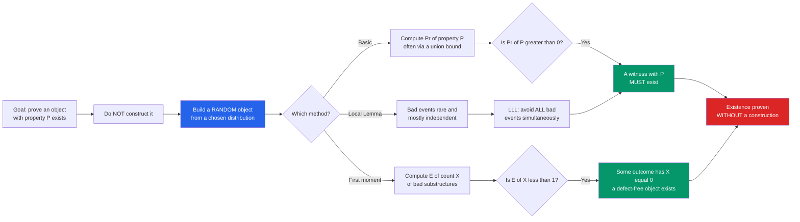

# 🎲 The Probabilistic Method

> [!abstract] TL;DR
> To prove a combinatorial object with some property **exists**, you do not have to build one — **build a *random* one and show the probability it has the property is greater than zero.** If a random object works with positive probability, at least one such object must exist. Pioneered by Paul Erdős, this trick converts the impossible task of *constructing* rare structures into the easy task of *computing an average*, and it delivers the best-known bounds on Ramsey numbers, colorings, codes, and far more — all without ever exhibiting a single example.

---

## Intuition

**Analogy — the needle in the haystack you never search.** Someone claims there is a needle hidden somewhere in an enormous haystack and dares you to prove it exists. You *could* search straw by straw until the Sun burns out. Or you could reach in **at random**, grab a handful, and reason like this: "If the *average* handful contains more than zero needles, then at least one handful — hence at least one spot in the haystack — must contain a needle." You never find *which* handful; you only prove, with certainty, that a good one is in there. **Chance proves existence.**

That is the whole revolution. Erdős's insight was that to show a graph coloring, a code, or a tournament with some delicate property *exists*, you should stop trying to design it by hand. Instead you define a **random** object drawn from a well-chosen distribution and prove that the probability it has your property is strictly positive — or that its *expected* quality already exceeds the threshold you need. A positive-probability event cannot be empty, so a witness must exist. The proof is often two lines long and yields objects nobody knows how to construct explicitly to this day.

---

## How It Works

### Core Mechanics

The method comes in a family of increasingly powerful moves, all resting on one deduction: **an event of positive probability is non-empty, and a random variable takes a value at least (and at most) its mean.**

1. **The basic method.** Define a random object $\omega$ over a sample space $\Omega$. If
   $$\Pr[\omega \text{ has property } P] > 0,$$
   then *some* $\omega \in \Omega$ has property $P$. Existence is proven. The art is choosing the distribution so the probability is provably positive — usually via a **union bound**: if the total probability of all the "bad" events (ways $P$ can fail) is $< 1$, some outcome avoids every bad event at once.
2. **The expectation / first-moment method.** Let $X$ count something (bad substructures, or the "score" of the object) with mean $\mathbb{E}[X] = \mu$. Then **some outcome has $X \le \mu$ and some has $X \ge \mu$** — you cannot always be above your own average. So if you want a large object, exhibit a random $X$ with large mean; if you want to *avoid* something, show $\mathbb{E}[X] < 1$, which forces an outcome with $X = 0$ (since $X$ is a non-negative integer, $X < 1 \Rightarrow X = 0$). **Linearity of expectation** — which needs no independence — makes $\mu$ trivial to compute even when the events are tangled.
3. **The alteration (deletion) method.** Build a random object that is *almost* good, then **surgically delete the few defects**. You lose a little, but you keep a guaranteed-clean core. This is how you get dense graphs with no short cliques, or large independent sets: take a random set, then remove one endpoint of every bad edge.
4. **The second-moment method.** The first moment tells you the average; the **variance** tells you whether the object is *typically* near that average. If $\mathrm{Var}[X]$ is small relative to $\mathbb{E}[X]^2$, then $X > 0$ *almost surely* (Chebyshev), not merely for one lucky outcome. This turns existence into **typical behavior** and pins down sharp **thresholds** in random graphs.
5. **The Lovász Local Lemma (LLL).** When there are *many* bad events, the union bound fails (their probabilities sum past 1). But if each bad event is **rare** and depends on only a **bounded number** of others, the LLL guarantees a positive probability that **none** of them occur — a scalpel where the union bound is a sledgehammer. Symmetric form: if each bad event has probability $\le p$, depends on $\le d$ others, and $e\,p\,(d+1) \le 1$, then all bad events can be avoided simultaneously.

### Flow / Architecture



---

## Key Concepts

### Secondary (school level)
- **Average implies existence.** If a class *averaged* 60 on a test, then *someone* scored at least 60 — you cannot have everyone below the mean. That single sentence is the engine of the whole method.
- **A random guess is often good enough.** Flip a fair coin for every edge of a network to "red/blue." On average, half the connections of any particular pattern break the wrong way — so a *typical* random plan already avoids that pattern most of the time, proving a good plan exists without hunting for it.
- **Positive chance means possible-and-real.** If the probability of an outcome is bigger than zero, that outcome genuinely occurs for *some* case. "It could happen" upgrades to "it does happen for at least one."

### Undergraduate
- **Basic method + union bound:** if $\sum \Pr[\text{bad}_i] < 1$, a random object avoids all bad events, so a good one exists.
- **Ramsey lower bound (Erdős 1947):** a random 2-coloring of $K_n$ has expected number of monochromatic $K_k$ equal to $\binom{n}{k} 2^{1-\binom{k}{2}}$; when this is $< 1$, a coloring with **no** monochromatic $K_k$ exists, giving $R(k,k) > 2^{k/2}$. This is the founding example (see the demo).
- **Large cuts (Max-Cut):** assign each vertex to a side by a coin flip; each edge is cut with probability $\tfrac12$, so $\mathbb{E}[\text{cut edges}] = m/2$. Hence **every** graph has a cut of size $\ge m/2$ — a one-line proof, and a $\tfrac12$-approximation algorithm.
- **Tournaments with the $S_k$ property:** in a random tournament on $n$ players, for $n$ large enough *every* set of $k$ players is beaten by someone — so such "no-king-is-safe" tournaments exist.
- **Alteration for independent sets / sum-free sets:** take a random subset, delete one endpoint per bad edge; the expected survivor count gives a guaranteed lower bound (e.g. $\alpha(G) \ge \sum_v \frac{1}{d(v)+1}$ Turán-type bound).

### Graduate
- **Second-moment method & thresholds:** in the Erdős–Rényi random graph $G(n,p)$, computing $\mathbb{E}[X]$ and $\mathrm{Var}[X]$ for a subgraph count $X$ locates the **sharp threshold** $p^\ast$ where the substructure appears with probability tending to 1 — the bridge from existence to *whp* (with high probability) behavior.
- **High-girth, high-chromatic graphs (Erdős 1959):** the crown jewel of the alteration method — graphs with **no short cycles** yet **arbitrarily large chromatic number**, showing colorability is *not* a local property. No explicit construction was known for decades.
- **Lovász Local Lemma:** the symmetric criterion $e\,p\,(d+1)\le 1$ and its use in hypergraph 2-coloring, $k$-SAT satisfiability, and Ramsey-type problems where the union bound is hopeless.
- **Algorithmic LLL / derandomization (Moser–Tardos 2010):** a stunningly simple "resample a violated bad event" procedure that *finds* the object the LLL only promised, in expected polynomial time — turning a non-constructive existence proof into an algorithm.
- **Concentration machinery:** Azuma–Hoeffding (martingales), Talagrand's inequality, and the entropy method, which sharpen "some outcome is good" into "almost every outcome is good," controlling the fluctuations of complex random structures.

---

## Python Demo

The two experiments below re-enact Erdős's 1947 birth of the method. **(a)** For a random 2-coloring of the complete graph $K_n$, the expected number of monochromatic $K_k$ is $\binom{n}{k}\,2^{1-\binom{k}{2}}$ by linearity of expectation; we find the largest $n$ for which this expectation drops below $1$ — at which point a coloring with **no** monochromatic clique is *forced* to exist ($R(k,k) > n$), even though we never build it. **(b)** We then randomly 2-color $K_n$ thousands of times *below* that bound and confirm that clique-free colorings are found easily — positive probability made concrete.

```python
# The Probabilistic Method: Erdos's 1947 lower bound for the Ramsey number R(k,k).
#
# Color each edge of the complete graph K_n red/blue independently at random.
# Let X = number of MONOCHROMATIC K_k (a k-clique whose edges are all one color).
# By LINEARITY OF EXPECTATION (no independence needed):
#     E[X] = C(n,k) * 2 * (1/2)^C(k,2) = C(n,k) * 2^(1 - C(k,2))
# since each of the C(n,k) cliques has C(k,2) edges, all-same-color with prob
# 2 * (1/2)^C(k,2).  If E[X] < 1 then SOME coloring has X = 0  =>  R(k,k) > n.
# Existence is proven WITHOUT constructing the coloring.
import math
from itertools import combinations
import numpy as np
import matplotlib.pyplot as plt

rng = np.random.default_rng(7)

# ---------- (a) expected monochromatic-K_k count vs n ----------
k = 4                                        # search for monochromatic K_4
def expected_mono(n, k):
    if n < k:
        return 0.0
    return math.comb(n, k) * 2.0 ** (1 - math.comb(k, 2))

ns = np.arange(k, 13)
E = np.array([expected_mono(n, k) for n in ns])

n_bound = int(ns[E < 1].max())               # largest n with E[X] < 1  => R(k,k) > n_bound
n_cross = int(ns[np.argmax(E >= 1)])          # first n where E[X] crosses 1

print(f"k = {k}:  E[X] = C(n,{k}) * 2^(1 - {math.comb(k,2)})")
for n, e in zip(ns, E):
    flag = "   <- E<1: a clique-free coloring MUST exist" if e < 1 else ""
    print(f"  n = {n:2d}   E[X] = {e:8.3f}{flag}")
print(f"=> guaranteed lower bound:  R({k},{k}) > {n_bound}")
print(f"   asymptotic Erdos form:   R(k,k) > 2^(k/2) = {2 ** (k / 2):.2f}  at k={k}\n")

# ---------- (b) empirical: random 2-colorings of K_n across the threshold ----------
def has_mono_clique(color, nodes, k):
    for clique in combinations(nodes, k):
        edges = list(combinations(clique, 2))
        c0 = color[edges[0]]
        if all(color[e] == c0 for e in edges):
            return True
    return False

def clique_free_rate(n, k, trials=600):
    nodes = list(range(n))
    all_edges = list(combinations(nodes, 2))
    good = 0
    for _ in range(trials):
        bits = rng.integers(0, 2, len(all_edges))
        color = {e: int(b) for e, b in zip(all_edges, bits)}
        if not has_mono_clique(color, nodes, k):
            good += 1
    return good / trials

test_ns = np.arange(k, n_cross + 2)           # sweep across the existence threshold
emp = np.array([clique_free_rate(n, k) for n in test_ns])
first_moment_lb = np.clip(1 - np.array([expected_mono(n, k) for n in test_ns]), 0, 1)

for n, r, lb in zip(test_ns, emp, first_moment_lb):
    print(f"  n = {n:2d}   empirical P(clique-free) = {r:5.3f}   "
          f"first-moment guarantee >= {lb:5.3f}")

# ---------- plot ----------
fig, (ax1, ax2) = plt.subplots(1, 2, figsize=(13, 5))

ax1.semilogy(ns, np.maximum(E, 1e-3), 'o-', color="#2563eb", lw=2,
             label="E[X] = C(n,k) * 2^(1 - C(k,2))")
ax1.axhline(1.0, color="#dc2626", ls="--", label="existence threshold  E[X] = 1")
ax1.axvline(n_bound + 0.5, color="#059669", ls=":", lw=2,
            label=f"guaranteed  R({k},{k}) > {n_bound}")
ax1.set_xlabel("n  (vertices of K_n)")
ax1.set_ylabel("expected # monochromatic K_k  (log scale)")
ax1.set_title(f"First-moment Ramsey bound (k={k})\nE[X] < 1  =>  a clique-free coloring exists")
ax1.legend(); ax1.grid(True, which="both", alpha=0.3)

ax2.plot(test_ns, emp, 'o-', color="#7c3aed", lw=2,
         label="empirical  P(no monochromatic K_k)")
ax2.plot(test_ns, first_moment_lb, 's--', color="#059669",
         label="first-moment guarantee  max(0, 1 - E[X])")
ax2.axvline(n_bound + 0.5, color="#059669", ls=":", lw=2)
ax2.set_xlabel("n  (vertices of K_n)")
ax2.set_ylabel("fraction of random colorings that are clique-free")
ax2.set_title(f"Below the bound, clique-free colorings\nare found with POSITIVE probability (k={k})")
ax2.set_ylim(-0.03, 1.05); ax2.legend(); ax2.grid(alpha=0.3)

plt.tight_layout()
plt.savefig("probabilistic_method_ramsey.png", dpi=120)
plt.show()
```

**What you see:** The left panel shows $\mathbb{E}[X]$ climbing steeply and slicing through the red $\mathbb{E}[X]=1$ line — to the left of the green marker every random coloring *averages* fewer than one monochromatic $K_k$, so a clique-free coloring is **forced to exist**. The right panel confirms it empirically: below the threshold, a large fraction of random colorings are already clique-free (positive probability, exactly as the first-moment bound $1-\mathbb{E}[X]$ guarantees), and — a subtle lesson — colorings can survive slightly *past* the threshold too, because $\mathbb{E}[X]>1$ forbids nothing about $\Pr[X=0]$. The method hands you existence and a lower bound while never printing a single "good" coloring.

---

## Real-World Applications

> **Example — Shannon's random coding (Information Theory).** To prove that codes achieving channel capacity **exist**, Shannon did not construct one; he picked a codebook **at random** and showed the *average* codebook has vanishing error probability below capacity. If the average code is good, a good code must exist. This is the probabilistic method wearing an engineering hat, and it underlies the whole existence half of the noisy-channel coding theorem — see the cross-vault link to channel capacity below.

- **Randomized algorithms & approximation.** The Max-Cut coin-flip argument *is* a $\tfrac12$-approximation algorithm; **randomized rounding** of linear-program relaxations (Raghavan–Thompson) and MAX-SAT solvers all descend from "a random assignment is good on average, so a good one exists — just sample it."
- **Coding theory bounds.** The **Gilbert–Varshamov bound** — the existence of good error-correcting codes with guaranteed minimum distance — is a first-moment/union-bound argument on random codes; extremal code parameters are proven achievable before any code is built.
- **Expander graphs & pseudorandomness.** Random regular graphs are excellent **expanders** with high probability, proving optimal expanders exist; this feeds derandomization, hashing, and network fault-tolerance long before explicit (Ramanujan) constructions were found.
- **Distributed symmetry-breaking via the LLL.** Frugal colorings, packet-routing schedules, and constraint-satisfaction assignments where local conflicts are rare are guaranteed by the Lovász Local Lemma — and the **Moser–Tardos** resampling algorithm turns that guarantee into fast distributed protocols.
- **Complexity & lower bounds.** Counting/probabilistic arguments show that *most* Boolean functions require exponential-size circuits, and that hard instances exist — existence proofs at the heart of complexity theory.

---

## Common Pitfalls

- **It is non-constructive — you get existence, not the object.** The proof certifies a good coloring/code/graph *exists* but hands you nothing to point at. Finding an *explicit* witness can be vastly harder (explicit Ramsey graphs matching $2^{k/2}$ remain open). Reading "a coloring exists" as "here is the coloring" is the cardinal error.
- **Confusing the first moment with existence of the structure.** $\mathbb{E}[X] > 0$ does **not** prove the structure $X$ counts exists — a non-negative $X$ with positive mean might still be $0$ on outcomes and huge on others. To *force* $X=0$ you need $\mathbb{E}[X] < 1$ (for integer $X$); to *force* $X>0$ you generally need the **second moment** (small variance), not just a positive mean going to infinity.
- **First moment vs second moment.** $\mathbb{E}[X]\to\infty$ alone does not imply $X>0$ whp — a lottery has enormous expected payoff yet is almost always zero. Only bounding $\mathrm{Var}[X]$ (Chebyshev / Paley–Zygmund) upgrades "exists" to "typical." Skipping the variance check is the classic threshold blunder.
- **Union bound too weak for rare, correlated bad events.** When bad events are many, $\sum \Pr[\text{bad}_i]$ blows past $1$ and the basic method dies — even though the events barely interact. That is precisely the regime for the **Lovász Local Lemma**; reaching for the union bound there proves nothing.
- **Assuming derandomization is free.** An existence proof is not automatically an algorithm. Turning it constructive needs work — the method of conditional expectations, pessimistic estimators, or Moser–Tardos resampling. Do not claim a polynomial-time construction just because a random object works in expectation.
- **Picking the wrong distribution.** As with pigeonhole's choice of boxes, the *entire difficulty* is choosing the random model (which $p$ in $G(n,p)$, uniform vs biased coins). A poorly chosen distribution gives a true-but-useless bound.

---

## Related Concepts

- [[Combinatorics/01_Foundations_of_Counting/Combinatorics_Overview|Combinatorics Overview]] — situates the probabilistic method within extremal/existence combinatorics, the branch that asks what *must* exist rather than *how many*.
- [[Mathematics/06_Probability_and_Statistics/Probability_Theory|Probability Theory]] — supplies the sample spaces, events, and the "positive probability implies non-empty" deduction the whole method rests on.
- [[Mathematics/06_Probability_and_Statistics/Random_Variables|Random Variables]] — expectation, linearity, and variance are the first- and second-moment tools that make the counts computable.
- [[Mathematics/06_Probability_and_Statistics/Common_Probability_Distributions|Common Probability Distributions]] — the binomial/Poisson behavior of subgraph counts drives the concentration and threshold arguments.
- [[Mathematics/04_Discrete_Mathematics/Graph_Theory|Graph Theory]] — colorings, cuts, cliques, and independent sets are where the method most famously earns its keep.
- [[Mathematics/04_Discrete_Mathematics/Combinatorics|Combinatorics (Discrete Mathematics)]] — the counting toolkit ($\binom{n}{k}$, union bounds) that the expectation calculations lean on.
- [[Mathematics/04_Discrete_Mathematics/Logic_and_Proof_Techniques|Logic and Proof Techniques]] — a canonical **non-constructive existence proof**, cousin to proof by contradiction and the pigeonhole principle.
- [[Systems_Thinking_and_Complexity/03_Networks_and_Connectivity/Small_World_and_Scale_Free_Networks|Small-World and Scale-Free Networks]] — the Erdős–Rényi random graph $G(n,p)$ underlying threshold arguments is the null model these network structures are measured against.
- [[Information_Theory/03_Channel_Coding_and_Reliable_Communication/Channel_Capacity_and_the_Noisy_Channel_Theorem|Channel Capacity and the Noisy-Channel Theorem]] — Shannon's random-coding existence proof is the information-theoretic twin of the probabilistic method.

*Siblings in this vault section (prose references, to be written):* **Ramsey Theory** (which the probabilistic method supplies *lower* bounds for, while extremal arguments give the *upper* bounds), **Extremal Combinatorics** (the two form a pincer — construction-free lower bounds meet forbidden-structure upper bounds), **Random Discrete Structures** (the $G(n,p)$ Erdős–Rényi model that second-moment thresholds live in), and **The Pigeonhole Principle** (the humblest non-constructive existence proof, of which this method is the probabilistic generalization).

---

## Review Questions

1. **(Secondary)** A quiz was taken by 30 students and the class *average* was 72. Explain, without seeing any individual score, why at least one student scored 72 or higher and at least one scored 72 or lower. How is this the same reasoning that lets a single random coin-flip plan prove a "good plan exists"?
2. **(Undergraduate)** Show that every graph with $m$ edges has a cut with at least $m/2$ edges by assigning each vertex to one of two sides with a fair coin. Where exactly is **linearity of expectation** used, and why does the argument need *no* independence between edges? Then explain why $\mathbb{E}[\text{cut}] = m/2$ guarantees a cut of size $\ge m/2$ **exists** but does not tell you how to find it.
3. **(Graduate)** In the Ramsey argument, $\mathbb{E}[X] = \binom{n}{k}2^{1-\binom{k}{2}} < 1$ forces the existence of a clique-free coloring. (a) Derive $R(k,k) > 2^{k/2}$ from this and identify where the union bound / first moment is doing the work. (b) Contrast this with proving a subgraph *appears* in $G(n,p)$ near its threshold: why does that require the **second moment**, and what goes wrong if you argue from $\mathbb{E}[X]\to\infty$ alone? (c) Give an example of bad events so numerous that the union bound fails but the **Lovász Local Lemma** succeeds.

---

## Sources

- [Alon, N. & Spencer, J. — *The Probabilistic Method* (4th ed., Wiley, 2016)](https://onlinelibrary.wiley.com/doi/book/10.1002/9781119061966) — the definitive text.
- [Erdős, P. — "Some remarks on the theory of graphs," *Bull. AMS* 53 (1947), 292–294](https://www.ams.org/journals/bull/1947-53-04/S0002-9904-1947-08785-1/) — the founding two-page Ramsey lower-bound proof.
- [Aigner, M. & Ziegler, G. — *Proofs from THE BOOK* (6th ed., Springer)](https://link.springer.com/book/10.1007/978-3-662-57265-8) — elegant chapters on the probabilistic method and Ramsey bounds.
- [Molloy, M. & Reed, B. — *Graph Colouring and the Probabilistic Method* (Springer, 2002)](https://link.springer.com/book/10.1007/978-3-642-04016-0) — deep treatment of the Lovász Local Lemma in coloring.
- [Moser, R. & Tardos, G. — "A constructive proof of the general Lovász Local Lemma," *J. ACM* 57 (2010)](https://dl.acm.org/doi/10.1145/1667053.1667060) — algorithmic derandomization of the LLL.

---

#combinatorics #probabilistic-method #erdos #existence-proofs #random-structures
