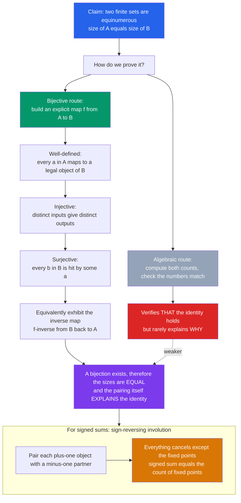

# 🔗 Bijective Proofs and Combinatorial Identities

> [!abstract] TL;DR
> Two finite sets have the same size **if and only if** there is a bijection between them — so you can prove a counting identity $\#A = \#B$ not by computing either count, but by building an explicit, invertible pairing $A \leftrightarrow B$. Its dual, **double counting**, counts *one* set two different ways and equates the answers. These techniques don't merely *verify* identities — they *explain* them, which is why combinatorialists prize them above algebra. This note opens the **Algebraic & Bijective Combinatorics** section and sets up Burnside/Pólya counting, Young tableaux, posets, and Möbius inversion to come.

---

## Intuition

**Analogy:** Suppose two auditoriums are packed and you want to prove they hold the *same* number of people. You could try to count each crowd — slow, error-prone, and it tells you nothing about *why* the counts match. Instead, ask everyone in Room A to walk next door and hold hands with exactly one person in Room B. If every hand finds a partner and nobody is left over on either side, you are **done**: a perfect pairing forces the two counts to be equal, and you never counted a soul.

That handshake is a **bijection**, and the picture *is* the proof. To show two families of combinatorial objects are equinumerous, you build a rule that turns each object of type A into exactly one object of type B — reversibly. No factorials, no algebra, just a clever correspondence that makes the identity *obvious*. And it does something a formula never can: it reveals **why** the two sides are equal, by showing they are secretly the *same* structure wearing two costumes. Intuition first, formula second.

---

## How It Works

### Core Mechanics

The **bijective principle** is the whole game: for finite sets, $\#A = \#B \iff$ there exists a bijection $f : A \to B$. A function is a bijection when it is both **injective** (distinct inputs give distinct outputs — no two A-objects collide onto one B-object) and **surjective** (every B-object is hit — nothing in B is left unpaired). Equivalently, and often more cleanly, you exhibit an explicit **inverse** map $f^{-1} : B \to A$ and check $f^{-1} \circ f = \mathrm{id}$. Existence of the inverse *is* bijectivity.

A bijective proof of an identity therefore has three obligations:

1. **Define the map.** Give a concrete rule sending each $a \in A$ to some $f(a) \in B$.
2. **Prove it is well-defined and lands in B.** Every output must actually be a legal object of type B (this is where sloppy proofs quietly fail).
3. **Prove it is a bijection.** Either show injective + surjective, or hand over an explicit inverse.

**Double counting** (a.k.a. *counting two ways* / *Fubini for finite sets*) is the same idea turned inward: instead of pairing two sets, you count **one** set two different ways and set the answers equal.

- **Handshake lemma.** Sum the degrees of every vertex in a graph; you have counted each edge exactly twice, so $\sum_v \deg(v) = 2|E|$ — hence the number of odd-degree vertices is even.
- **Committee-with-chair.** Count "a $k$-person committee with a designated chair" drawn from $n$ people. Pick the committee ($\binom{n}{k}$) then its chair ($k$), giving $k\binom{n}{k}$; or pick the chair first ($n$) then fill the remaining $k-1$ seats ($\binom{n-1}{k-1}$), giving $n\binom{n-1}{k-1}$. The same objects, two counts:
  $$k\binom{n}{k} = n\binom{n-1}{k-1}.$$
- **Row sum.** A set of size $n$ has $2^n$ subsets (each element is in or out); grouping subsets by size gives $\sum_{k=0}^n \binom{n}{k} = 2^n$.

**Involutions** are self-inverse maps ($f = f^{-1}$, i.e. $f(f(x)) = x$) and are the tool for **signed** identities. A **sign-reversing involution** pairs each object carrying $+1$ with a partner carrying $-1$; every matched pair cancels, so the signed sum collapses to a count of the **fixed points** the involution leaves unpaired. This is the beating heart of inclusion–exclusion and of alternating-sum identities like $\sum_k (-1)^k \binom{n}{k} = 0$ for $n \ge 1$.

### Flow / Architecture



---

## Key Concepts

### Secondary (high-school level)
- **The pairing idea:** to show two collections have the same size, match their members one-to-one. A perfect match means equal counts — no counting required.
- **Subsets ↔ yes/no lists:** every subset of $\{1,\dots,n\}$ is the same as a length-$n$ list of yes/no answers ("is element $i$ in?"). There are $2^n$ lists, so $2^n$ subsets.
- **Counting two ways:** count the same thing by two routes and the answers *must* agree. Counting the handshakes at a party by people vs. by pairs is the friendliest example.
- **Odd-degree vertices come in pairs:** total number of "hand-ends" is even (each handshake has two), so an odd number of people-with-odd-many-handshakes is impossible.

### Undergraduate
- **The bijective principle stated precisely:** for finite $A, B$, $\#A = \#B \iff \exists$ a bijection $A \to B$; a bijection $=$ injective $+$ surjective $=$ has a two-sided inverse.
- **Double counting / counting in two ways:** count a set $S$ by partitioning it two ways, or count a 0/1 incidence matrix by rows and by columns (finite **Fubini**). Yields the handshake lemma, $k\binom{n}{k} = n\binom{n-1}{k-1}$, and $\sum_k \binom{n}{k} = 2^n$.
- **Combinatorial vs. algebraic proofs of classic identities:**
  - **Pascal:** $\binom{n}{k} = \binom{n-1}{k-1} + \binom{n-1}{k}$ — condition on whether element $n$ is chosen.
  - **Symmetry:** $\binom{n}{k} = \binom{n}{n-k}$ — the bijection "choose $\leftrightarrow$ choose the complement."
  - **Vandermonde:** $\sum_k \binom{m}{k}\binom{n}{p-k} = \binom{m+n}{p}$ — split a size-$p$ committee across two departments.
  - **Hockey-stick:** $\sum_{i=r}^{m}\binom{i}{r} = \binom{m+1}{r+1}$ — classify size-$(r+1)$ subsets of $\{1,\dots,m+1\}$ by their largest element.
- **Classic bijections to know:**
  - **Subsets $\leftrightarrow$ binary strings $\leftrightarrow$ $2^n$** — the archetype.
  - **Partition conjugation** — transpose a Young diagram to prove "partitions of $n$ with largest part $k$" $=$ "partitions of $n$ into exactly $k$ parts."
  - **Compositions** — a composition of $n$ into $k$ parts $\leftrightarrow$ choosing $k-1$ of $n-1$ gaps (stars and bars).
- **Involution basics:** a self-inverse map; its orbits have size 1 (fixed points) or 2. Pairing off size-2 orbits proves parity and cancellation facts.

### Graduate
- **The involution principle (Garsia–Milne):** a general machine that, given sign-reversing involutions on two signed sets with a size-preserving bijection between their fixed points, manufactures an explicit bijection — the bijective backbone behind hard identities (Rogers–Ramanujan, the Jacobi triple product).
- **Sign-reversing involutions for signed sums:** a signed enumeration $\sum_{x} (-1)^{\mathrm{sgn}(x)} w(x)$ collapses to $\sum_{\text{fixed points}} w$. This *is* inclusion–exclusion (the involution toggles the least "bad" element), and it proves the **Lindström–Gessel–Viennot lemma** (non-intersecting lattice paths compute determinants by cancelling intersecting path tuples).
- **Landmark bijections that structure the field:**
  - **Prüfer codes:** labeled trees on $n$ vertices $\leftrightarrow$ strings in $\{1,\dots,n\}^{n-2}$, giving a one-line proof of **Cayley's formula** $n^{n-2}$.
  - **RSK correspondence:** permutations (or matrices) $\leftrightarrow$ pairs of standard Young tableaux of the same shape, the bijective engine of symmetric-function theory and the source of the identity $\sum_\lambda (f^\lambda)^2 = n!$.
  - **Catalan bijections:** Dyck paths $\leftrightarrow$ binary trees $\leftrightarrow$ triangulations $\leftrightarrow$ non-crossing partitions — dozens of families glued by explicit maps.
- **Where this section is heading:** counting *up to symmetry* needs **group actions** (Burnside/Pólya — average fixed points of a group); tableaux and the RSK map open **symmetric functions**; ordering objects by containment builds **posets**, whose signed incidence counting is **Möbius inversion** (the vast generalization of inclusion–exclusion). Bijective/double-counting reasoning is the connective tissue running through all of them.

---

## Python Demo

```python
# Bijective proofs in action:
#   (a) implement the concrete bijection  subsets of {1..n} <-> binary strings,
#       apply it, and VERIFY it is a perfect one-to-one correspondence
#       (this PROVES the identity  #subsets = 2^n, it does not merely check it).
#   (b) a "counting two ways" / double-counting proof, verified numerically:
#       k * C(n,k) = n * C(n-1,k-1)   (committee-with-a-chair).
import numpy as np
import matplotlib.pyplot as plt
from itertools import combinations
from math import comb

# ============================================================
# (a) A CONCRETE BIJECTION:  subsets of {1..n}  <->  binary strings of length n
#     Each subset S maps to its indicator string; each string decodes to a subset.
# ============================================================
def subsets(n):
    """All subsets of {1,...,n} as frozensets, enumerated by increasing size."""
    elems = range(1, n + 1)
    out = []
    for r in range(n + 1):
        for c in combinations(elems, r):
            out.append(frozenset(c))
    return out

def subset_to_bits(S, n):
    """Forward map f: subset -> binary string (the indicator vector)."""
    return "".join("1" if i in S else "0" for i in range(1, n + 1))

def bits_to_subset(b):
    """Inverse map f^{-1}: binary string -> subset."""
    return frozenset(i + 1 for i, ch in enumerate(b) if ch == "1")

n = 4
A = subsets(n)                                     # the subsets
B = [format(k, f"0{n}b") for k in range(2 ** n)]   # all length-n binary strings
images = [subset_to_bits(S, n) for S in A]         # apply the forward map

Bset = set(B)
well_defined = all(img in Bset for img in images)          # every image is a legal B-object
injective    = len(set(images)) == len(A)                  # no two subsets collide
surjective   = set(images) == Bset                         # every string is hit
invertible   = all(bits_to_subset(subset_to_bits(S, n)) == S for S in A)  # f^{-1} . f = id

print(f"n = {n}:  |A| = {len(A)} subsets,  |B| = {len(B)} binary strings,  2^n = {2**n}")
print("well-defined:", well_defined, "| injective:", injective,
      "| surjective:", surjective, "| invertible:", invertible)
assert well_defined and injective and surjective and invertible
print("=> f is a BIJECTION, so #subsets = 2^n is PROVEN (not merely checked).\n")

# ============================================================
# (b) DOUBLE COUNTING:  count (committee of size k, with a designated chair) two ways
#     way 1: choose committee C(n,k), then chair k       ->  k * C(n,k)
#     way 2: choose chair n, then the other k-1 members  ->  n * C(n-1,k-1)
#     Same set of (committee, chair) pairs => identity  k*C(n,k) = n*C(n-1,k-1).
# ============================================================
def committees_with_chair_bruteforce(n, k):
    """Enumerate every (committee, chair) pair directly and count them."""
    total = 0
    for committee in combinations(range(1, n + 1), k):
        total += len(committee)      # any of the k members can be the chair
    return total

print("  n  k | k*C(n,k) | n*C(n-1,k-1) | brute-force | agree")
for (nn, kk) in [(5, 2), (6, 3), (8, 4), (10, 5)]:
    lhs = kk * comb(nn, kk)
    rhs = nn * comb(nn - 1, kk - 1)
    bf  = committees_with_chair_bruteforce(nn, kk)
    print(f"  {nn:2d} {kk} | {lhs:8d} | {rhs:12d} | {bf:11d} | {lhs == rhs == bf}")
    assert lhs == rhs == bf
print("Double-count identity k*C(n,k) = n*C(n-1,k-1) verified.\n")

# ============================================================
# PLOTS: the bijection as a bipartite pairing + the double-count bars
# ============================================================
fig, (ax1, ax2) = plt.subplots(1, 2, figsize=(14, 6))

# --- Left: subsets of {1,2,3} <-> binary strings, drawn as a perfect matching ---
n3 = 3
A3 = sorted(subsets(n3), key=lambda S: int(subset_to_bits(S, n3), 2))
m = len(A3)
for row, S in enumerate(A3):
    y = m - 1 - row
    left = "{" + ",".join(str(x) for x in sorted(S)) + "}" if S else "{ }"
    bits = subset_to_bits(S, n3)
    ax1.text(0.02, y, left, ha="right", va="center", fontsize=12, family="monospace")
    ax1.text(0.98, y, bits, ha="left",  va="center", fontsize=12, family="monospace")
    ax1.plot([0.10, 0.90], [y, y], "-", color="#2563eb", lw=1.8, alpha=0.85)
    ax1.plot(0.10, y, "o", color="#059669", ms=8)
    ax1.plot(0.90, y, "o", color="#7c3aed", ms=8)
ax1.set_xlim(-0.55, 1.55)
ax1.set_ylim(-0.7, m - 0.3)
ax1.axis("off")
ax1.set_title("Bijection: subsets of {1,2,3}  <->  binary strings\n"
              f"{m} on each side  =  2^{n3}  =  {2 ** n3}", fontsize=12)

# --- Right: double-count identity across committee size k, fixed n ---
n_fixed = 8
ks  = np.arange(1, n_fixed + 1)
lhs = np.array([k * comb(n_fixed, k)         for k in ks], dtype=float)
rhs = np.array([n_fixed * comb(n_fixed - 1, k - 1) for k in ks], dtype=float)
w = 0.38
ax2.bar(ks - w / 2, lhs, w, label="k * C(n,k)   [committee, then chair]", color="#2563eb")
ax2.bar(ks + w / 2, rhs, w, label="n * C(n-1,k-1)  [chair, then rest]",
        color="#d97706", alpha=0.85)
ax2.set_xlabel("committee size k")
ax2.set_ylabel("number of (committee, chair) pairs")
ax2.set_title(f"Counting two ways (n = {n_fixed})\nbars coincide  =>  the identity holds")
ax2.set_xticks(ks)
ax2.legend(fontsize=9)

plt.tight_layout()
plt.savefig("bijective_proofs.png", dpi=120)
print("Saved figure: bijective_proofs.png")
```

**Expected console output:**

```
n = 4:  |A| = 16 subsets,  |B| = 16 binary strings,  2^n = 16
well-defined: True | injective: True | surjective: True | invertible: True
=> f is a BIJECTION, so #subsets = 2^n is PROVEN (not merely checked).

  n  k | k*C(n,k) | n*C(n-1,k-1) | brute-force | agree
   5 2 |       20 |           20 |          20 | True
   6 3 |       60 |           60 |          60 | True
   8 4 |      280 |          280 |         280 | True
  10 5 |     1260 |         1260 |        1260 | True
Double-count identity k*C(n,k) = n*C(n-1,k-1) verified.

Saved figure: bijective_proofs.png
```

The left panel draws the actual pairing — eight subsets on the left, their eight indicator strings on the right, each joined by exactly one line with no strays on either side: the *picture is the proof* that there are $2^n$ subsets. The right panel shows the two independent counts of "committee-with-chair" landing on identical bars for every $k$, which is the double-counting identity made visible.

---

## Real-World Applications

> **Example — indexing combinations (ranking / unranking).** The **combinatorial number system** is an explicit bijection between the integers $0, 1, \dots, \binom{n}{k}-1$ and the $k$-subsets of $\{0,\dots,n-1\}$. Databases, lottery systems, and combinatorial-search engines use it to store, address, or randomly sample a subset by a single integer index — *rank* turns a subset into its number, *unrank* inverts it. It works precisely because it is a proven bijection: every subset gets a unique address and every address decodes to a valid subset.

- **Random spanning trees & network design:** **Prüfer codes** biject labeled trees with strings, so generating a uniform random spanning tree reduces to generating a random string — used in network-topology sampling and Cayley's-formula-based counting.
- **Gray codes in hardware:** the reflected binary code is a bijection subsets $\leftrightarrow$ codewords that changes one bit per step (a Hamiltonian path on the hypercube). Rotary encoders, ADCs, and mechanical position sensors use it so that read errors at transitions differ by at most one bit.
- **Longest increasing subsequence:** **patience sorting** is the RSK bijection in disguise; the length of the first tableau row *is* the LIS length, an $O(n\log n)$ algorithm born from a combinatorial correspondence.
- **Reliability & inclusion–exclusion:** computing "probability at least one component works" is a signed sum evaluated by exactly the sign-reversing-involution logic that proves inclusion–exclusion — the same cancellation underpins fast subset-sum and Möbius-transform algorithms.
- **Compression & enumerative coding:** representing a chosen combinatorial object by its rank (an information-theoretically minimal integer) is bijective source coding — used in constrained-channel coding and succinct data structures.

---

## Common Pitfalls

- **Proving equal counts is not proving a bijection.** Two families both counting $C_n$ (or $2^n$, or anything) are equinumerous, but a shared count is a *hint*, not a *construction*. If the task is to *transform* one object into another, you must exhibit an explicit, invertible map — the numbers matching is the conclusion you already assumed.
- **Forgetting "well-defined."** A map is worthless if some input produces an *illegal* output. Always check that $f(a)$ is genuinely an object of type B (right size, satisfies all constraints) for **every** $a$ — this is where hand-wavy proofs silently break.
- **Injective *or* surjective is not enough — you need both.** An injection only gives $\#A \le \#B$; a surjection only gives $\#A \ge \#B$. For an *equality* you must have both directions, or (cleaner) an explicit two-sided inverse. On *infinite* sets even this can mislead, but for finite sets one direction genuinely leaves a gap.
- **Existence of a bijection vs. finding one.** Pigeonhole or a counting argument may *prove* a bijection exists without handing you the map. Some identities have a known bijective proof that is monstrously complicated (Rogers–Ramanujan), and constructing an *explicit* correspondence can be a deep research problem even when equality is elementary.
- **Signed identities need a sign-reversing involution, not a plain bijection.** For alternating sums like $\sum_k (-1)^k \binom{n}{k}$, pair each $+1$ object with a $-1$ partner so they cancel; the answer is the count of **fixed points** the involution leaves alone. Mistakes: an involution that isn't self-inverse, one that fails to reverse sign, or one whose fixed points you miscount.
- **Double counting the *wrong* set.** "Counting two ways" only yields an identity if both counts enumerate the *identical* set. A subtle mismatch — counting ordered vs. unordered objects, or over- or under-counting a symmetric case — produces a plausible-looking but false equation. Pin down the exact set before counting it either way.

---

## Related Concepts

- [[Permutations_and_Combinations]] — where $\binom{n}{k}$ and the ordered/unordered distinction are defined; every identity here is a statement about these counts, and the "choose the complement" bijection proves $\binom{n}{k}=\binom{n}{n-k}$.
- [[Inclusion_Exclusion_Principle]] — the flagship application of sign-reversing involutions; its alternating sum *is* a cancellation argument, and Möbius inversion (to come) is its poset-level generalization.
- [[Integer_Partitions]] — Young-diagram **conjugation** (transpose) is the cleanest nontrivial bijection: it proves largest-part $k$ partitions equal exactly-$k$-part partitions with no algebra at all.
- [[Combinatorics_Overview]] — the map of the vault; this note is the gateway to its algebraic/bijective wing.
- [[Generating_Functions]] — the *algebraic* counterpart to bijective proofs; an identity provable by a bijection usually also falls out of equating coefficients, and comparing the two viewpoints is deeply instructive.
- [[Mathematics/04_Discrete_Mathematics/Combinatorics|Combinatorics (Discrete Math)]] — situates double counting and bijections alongside pigeonhole and inclusion–exclusion in the broader discrete-math toolkit.
- [[Mathematics/04_Discrete_Mathematics/Set_Theory_and_Relations|Set Theory and Relations]] — the formal home of functions, injections, surjections, bijections, and cardinality that the bijective principle rests on.
- [[Mathematics/04_Discrete_Mathematics/Logic_and_Proof_Techniques|Logic and Proof Techniques]] — bijective and double-counting arguments are *constructive* proofs; this connects them to induction, contradiction, and the wider proof toolkit.
- [[Logic_and_Critical_Thinking/02_Deductive_Reasoning/Mathematical_Proof_Strategies|Mathematical Proof Strategies]] — the meta-view: why a constructive correspondence often *explains* better than a verification, and when each style of proof is appropriate.
- [[Mathematics/10_Abstract_Algebra/Groups_and_Subgroups|Groups and Subgroups]] — a group **isomorphism** is a structure-preserving bijection; counting-up-to-symmetry (Burnside/Pólya, next in this section) averages the fixed points of a group action.

*Sibling notes in this section, referenced in prose (this note links only Glob-verified files): The_Binomial_Theorem_and_Coefficients (the identities double-counted here), Catalan_Numbers (a whole zoo of bijections), Group_Actions_and_Burnsides_Lemma (counting up to symmetry), Young_Tableaux_and_Symmetric_Functions (where the RSK bijection lives), and Mobius_Inversion_and_Incidence_Algebras (inclusion–exclusion generalized to posets).*

---

## Review Questions

1. **(Secondary)** Explain, using the "two auditoriums holding hands" picture, why the subsets of $\{1,2,3\}$ and the length-3 strings of 0s and 1s must be equal in number — *without* computing that either count is 8. What is the explicit rule that pairs a subset with a string?
2. **(Undergraduate)** Give a **combinatorial (double-counting) proof** that $\sum_{k=0}^{n}\binom{n}{k}^2 = \binom{2n}{n}$. Hint: count the ways to choose $n$ people from a group of $n$ men and $n$ women, split by how many are men. Then contrast it with an algebraic proof — which one tells you *why* the identity is true?
3. **(Graduate)** The alternating identity $\sum_{k=0}^{n}(-1)^k\binom{n}{k} = 0$ (for $n\ge 1$) has a bijective proof via a **sign-reversing involution** on the subsets of $\{1,\dots,n\}$. Construct such an involution (hint: toggle the membership of element $1$), verify it reverses parity and has no fixed points, and explain how the vanishing sum drops out. How does this same mechanism power the inclusion–exclusion principle?

---

## Sources

- Richard P. Stanley, *Enumerative Combinatorics, Vol. 1 & 2* (Cambridge University Press) — the standard reference; bijections, sign-reversing involutions, and the Catalan/RSK correspondences.
- Martin Aigner, *A Course in Enumeration* (Springer) — clean development of double counting, bijections, and the involution principle.
- Nicholas A. Loehr, *Bijective Combinatorics* (CRC Press) — a full text built around explicit correspondences (Prüfer, RSK, lattice paths, tableaux).
- Arthur T. Benjamin & Jennifer J. Quinn, *Proofs that Really Count: The Art of Combinatorial Proof* (MAA) — the accessible manifesto for counting-two-ways proofs of binomial and Fibonacci identities.
- Aigner & Ziegler, *Proofs from THE BOOK* — the double-counting and Lindström–Gessel–Viennot chapters as exemplars of elegance.

---

#combinatorics #bijective-proofs #combinatorial-identities #double-counting #enumeration
