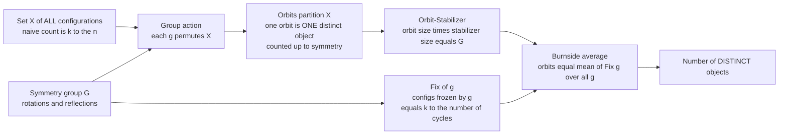

# 💠 Group Actions and Burnside's Lemma

> [!abstract] TL;DR
> **Burnside's lemma** (properly the **Cauchy-Frobenius lemma**) counts distinct objects **up to symmetry** without the impossible task of listing them all. When a symmetry group $G$ acts on a set $X$ of configurations, the truly different objects are the **orbits** — configurations that are equal after some rotation or reflection. The lemma says the number of orbits equals the **average number of configurations left unchanged (fixed) by each group element**: $\#\text{orbits} = \frac{1}{|G|}\sum_{g\in G}|\mathrm{Fix}(g)|$. It rests on the **orbit-stabilizer theorem** ($|\text{orbit}|\cdot|\text{stabilizer}| = |G|$) and, for a permutation group, each fixed count is $k^{\#\text{cycles}(g)}$ — the door into Pólya enumeration.

---

## Intuition

**Analogy — how many different bracelets can you make?** Take $6$ beads on a loop and $3$ colors of paint. Naively there are $3^6 = 729$ ways to color the six positions. But a **bracelet is a physical loop**: you can **rotate** it and **flip** it over, and a coloring that looks different on paper is often the *same bracelet* seen from another angle. Rotate "red-blue-blue-red-blue-blue" by one bead and you get a *new tuple* but the *same necklace*. So $729$ wildly overcounts the real answer — many of those $729$ tuples are secretly identical bracelets.

The trap is deciding **by how much you overcounted**. Your first instinct — "there are $12$ symmetries (6 rotations + 6 flips), so divide $729$ by $12$" — gives $60.75$, which is not even a whole number. That is nonsense, and the reason is subtle: **different bracelets have different amounts of symmetry** (an all-red bracelet is unchanged by *every* rotation; a lopsided one only by the "do-nothing" symmetry), so you cannot divide by $|G|$ uniformly. Burnside's lemma fixes this exactly: instead of dividing the *objects* by the group, you **average over the group** — for each of the $12$ symmetries, count how many of the $729$ colorings it leaves *frozen in place*, and take the mean. The average number of fixed colorings **is** the number of distinct bracelets. For $6$ beads and $3$ colors it comes out to a clean $92$.

---

## How It Works

A **group action** is a rule by which each symmetry $g \in G$ shuffles the set $X$ of configurations, respecting the group structure: the identity leaves everything alone ($e\cdot x = x$), and doing $g$ then $h$ equals doing $hg$ in one step ($h\cdot(g\cdot x) = (hg)\cdot x$). Two configurations that are related by *some* $g$ are "the same object"; the equivalence classes are called **orbits**, and counting distinct objects up to symmetry **is** counting orbits.

### Core Mechanics

1. **Orbits are the answer.** The orbit of $x$ is $\mathrm{Orb}(x) = \{g\cdot x : g\in G\}$ — every configuration reachable by symmetry. Orbits **partition** $X$ (they are the equivalence classes of "same up to symmetry"), so the number of distinct objects is exactly the number of orbits.

2. **Stabilizers measure self-symmetry.** The stabilizer of $x$ is $\mathrm{Stab}(x) = \{g\in G : g\cdot x = x\}$ — the symmetries that leave $x$ *unchanged*. A highly symmetric configuration (all one color) has a large stabilizer; a generic one has only the identity.

3. **Orbit-Stabilizer theorem.** For every $x$, $\;|\mathrm{Orb}(x)|\cdot|\mathrm{Stab}(x)| = |G|$. Big orbit means small stabilizer, and vice versa — this is *why* you cannot simply divide by $|G|$: only configurations with a **trivial** stabilizer (a **free** action) form orbits of full size $|G|$.

4. **Fix vs. Stab — count the same pairs two ways.** $\mathrm{Fix}(g) = \{x\in X : g\cdot x = x\}$ is the set of configurations frozen by a *given symmetry* $g$. Count the incidence set $S = \{(g,x) : g\cdot x = x\}$ by rows and by columns:
$$\sum_{g\in G}|\mathrm{Fix}(g)| \;=\; |S| \;=\; \sum_{x\in X}|\mathrm{Stab}(x)| \;=\; \sum_{x\in X}\frac{|G|}{|\mathrm{Orb}(x)|} \;=\; |G|\cdot(\#\text{orbits}).$$
The last step uses orbit-stabilizer plus the fact that each orbit's terms $\tfrac{1}{|\mathrm{Orb}(x)|}$ sum to $1$.

5. **Burnside's lemma.** Divide by $|G|$:
$$\boxed{\;\#\text{orbits} \;=\; \frac{1}{|G|}\sum_{g\in G}|\mathrm{Fix}(g)|\;}$$
the number of distinct objects is the **average number of fixed configurations** over the group.

6. **Permutation groups make $\mathrm{Fix}(g)$ trivial to compute.** If $g$ permutes $n$ positions and you color with $k$ colors, a coloring is fixed by $g$ exactly when it is **constant on each cycle** of the permutation $g$. Hence $|\mathrm{Fix}(g)| = k^{c(g)}$ where $c(g)$ is the **number of cycles** of $g$. Burnside becomes $\frac{1}{|G|}\sum_g k^{c(g)}$ — you never enumerate colorings, only read off cycle structure. Tracking colors *individually* (not just how many) upgrades $k^{c(g)}$ to a product of variables and yields **Pólya enumeration**, the generating-function refinement developed in the sibling note *Polya_Enumeration_Theory*.

### Flow / Architecture



---

## Key Concepts

### Secondary Level
- **Counting up to symmetry.** Two colorings are "the same object" if one becomes the other after rotating or flipping. The distinct objects are what you actually want to count — bracelets, dice faces, painted cubes.
- **The overcounting trap.** Listing every coloring ($k^n$) massively overcounts, because it treats rotations and flips of one object as separate.
- **Why you can't just divide by the number of symmetries.** An all-red bracelet is unchanged by every rotation, so it "uses up" fewer of the $k^n$ slots than a lopsided one. Dividing $k^n$ by $|G|$ often gives a *fraction*, proving the naive fix is wrong.
- **Fixed colorings.** For a given symmetry, some colorings look identical before and after applying it (a rotation by $0$ fixes *all* of them; a half-turn fixes only the symmetric ones). Burnside averages these fixed counts.

### Undergraduate Level
- **Group action (formal).** A map $G\times X\to X$ with $e\cdot x = x$ and $(gh)\cdot x = g\cdot(h\cdot x)$. Equivalently, a group homomorphism $G\to \mathrm{Sym}(X)$.
- **Orbit and stabilizer.** $\mathrm{Orb}(x) = Gx$; $\mathrm{Stab}(x) = G_x \le G$ is a subgroup. Orbits partition $X$; stabilizers of points in the same orbit are conjugate.
- **Orbit-Stabilizer theorem.** $|Gx| = [G:G_x] = |G|/|G_x|$ — orbit size equals the index of the stabilizer, a direct consequence of the coset structure (see Lagrange's theorem).
- **Burnside / Cauchy-Frobenius lemma.** $\#\text{orbits} = \frac{1}{|G|}\sum_{g\in G}|\mathrm{Fix}(g)|$. Historically due to Cauchy and Frobenius; "Burnside" is the durable misattribution.
- **Cyclic vs. dihedral necklaces.** Under the cyclic group $C_n$ (rotations only) the count is $\frac{1}{n}\sum_{d=0}^{n-1}k^{\gcd(n,d)}$. Under the dihedral group $D_n$ (rotations **and** reflections) you add the reflection terms and divide by $2n$ — bracelets (flippable) are fewer than necklaces (rotate only).
- **Cycle count gives fixed colorings.** For a permutation action on colorings, $|\mathrm{Fix}(g)| = k^{c(g)}$ with $c(g)$ the number of cycles of $g$ — the single most useful computational fact.

### Graduate Level
- **The cycle index and Pólya's theorem.** The **cycle index** $Z_G(a_1,\dots,a_n) = \frac{1}{|G|}\sum_g \prod_i a_i^{j_i(g)}$ (where $j_i(g)$ is the number of $i$-cycles) encodes all cycle structure. Substituting $a_i \to k$ recovers Burnside; substituting $a_i \to x_1^i + x_2^i + \cdots$ gives **Pólya enumeration**, a generating function that tracks how many beads of *each* color appear.
- **Burnside as character theory.** For the action on $X$, the permutation character is $\chi(g) = |\mathrm{Fix}(g)|$, and the number of orbits is $\langle \chi, \mathbf{1}\rangle = \frac{1}{|G|}\sum_g \chi(g)$ — the multiplicity of the trivial representation. Burnside is the inner-product-with-the-trivial-character in disguise.
- **Weighted / colored Burnside.** With a weight function invariant under $G$, $\frac{1}{|G|}\sum_g \sum_{x\in\mathrm{Fix}(g)} w(x)$ sums weights over orbits — the mechanism behind counting with color constraints and $q$-analogues.
- **Group cohomology and non-free actions.** Orbit spaces $X/G$ of non-free actions are the combinatorial shadow of quotient stacks; the failure of "divide by $|G|$" is precisely the presence of nontrivial stabilizers (isotropy), quantified in equivariant settings by the orbifold Euler characteristic.
- **Automorphism-group enumeration.** Counting *unlabeled* graphs, trees, and chemical structures applies Burnside/Pólya to the action of $S_n$ on labeled objects — the exact-symmetry sequel to the easy labeled counts in the sibling note *Enumerative_Graph_Theory*.

---

## Python Demo

We make "counting up to symmetry" concrete for the analogy's bracelet — $n=6$ beads, $k=3$ colors — under **two** groups: the cyclic group $C_6$ (rotations only, a *necklace*) and the dihedral group $D_6$ (rotations **and** reflections, a flippable *bracelet*). For each group element we build its position permutation, count its cycles, and compute $|\mathrm{Fix}(g)| = k^{c(g)}$; averaging over the group gives the **Burnside** orbit count. We then **brute-force enumerate all $3^6=729$ colorings**, collapse each into its orbit, and count distinct orbits — confirming Burnside is exact. Finally we show the **naive overcount** ($729$) and the **broken** "divide by $|G|$" shortcut ($729/12 = 60.75$, not even an integer) against the true answer. The figure plots the per-element fixed counts with the Burnside average line, and a bar chart of naive vs. broken vs. Burnside vs. brute-force.

```python
# Burnside's lemma: count distinct 6-bead, 3-color bracelets UP TO SYMMETRY.
# For each symmetry g: |Fix(g)| = k^(#cycles of g). Burnside = average of |Fix(g)|.
# Verified against brute-force orbit enumeration; naive k^n and k^n/|G| shown to fail.
import numpy as np
import matplotlib.pyplot as plt
from itertools import product

n, k = 6, 3   # 6 beads, 3 colors -- the bracelet in the analogy

# ---------- symmetry groups as position permutations perm[i] = image of i ----------
def rotations(n):
    # rotation by d: position i -> (i + d) mod n
    return [tuple((i + d) % n for i in range(n)) for d in range(n)]

def reflections(n):
    # the n reflections of the dihedral group: position i -> (a - i) mod n
    return [tuple((a - i) % n for i in range(n)) for a in range(n)]

C_n = rotations(n)                 # cyclic group  C_6  (|G| = 6)  -> necklace
D_n = rotations(n) + reflections(n)  # dihedral group D_6 (|G| = 12) -> bracelet

# ---------- cycle count -> fixed colorings ----------
def num_cycles(perm):
    seen, c = [False] * len(perm), 0
    for i in range(len(perm)):
        if not seen[i]:
            c += 1
            j = i
            while not seen[j]:
                seen[j] = True
                j = perm[j]
    return c

def fixed_colorings(perm, k):
    # a coloring is fixed by perm iff it is CONSTANT on each cycle -> k^(#cycles)
    return k ** num_cycles(perm)

def burnside_orbit_count(group, k):
    fixes = [fixed_colorings(g, k) for g in group]
    return sum(fixes) / len(group), fixes

# ---------- brute force: enumerate all colorings, count distinct orbits ----------
def bruteforce_orbit_count(group, n, k):
    seen, reps = set(), 0
    for c in product(range(k), repeat=n):
        if c in seen:
            continue
        orbit = {tuple(c[g[i]] for i in range(n)) for g in group}  # full orbit
        seen |= orbit
        reps += 1
    return reps

# ---------- run both groups ----------
naive = k ** n
results = {}
for name, group in [("C_6 (rotations only)", C_n), ("D_6 (rotations + flips)", D_n)]:
    burn, fixes = burnside_orbit_count(group, k)
    brute = bruteforce_orbit_count(group, n, k)
    assert burn == brute, "Burnside average must equal brute-force orbit count!"
    assert burn == int(burn), "orbit count must be a whole number"
    results[name] = dict(group=group, fixes=fixes, burnside=int(burn),
                         brute=brute, size=len(group))
    print(f"{name:26s} |G|={len(group):2d}  "
          f"naive k^n={naive}  k^n/|G|={naive/len(group):7.3f}  "
          f"Burnside={int(burn):3d}  brute-force={brute:3d}")

# ---------- visualization ----------
fig, (axL, axR) = plt.subplots(1, 2, figsize=(14, 5.5))

# LEFT: per-element fixed counts for the dihedral bracelet, with Burnside average
d = results["D_6 (rotations + flips)"]
labels = [f"r{i}" for i in range(n)] + [f"s{i}" for i in range(n)]  # rot / reflect
colors = ["#2563eb"] * n + ["#dc2626"] * n
axL.bar(labels, d["fixes"], color=colors, edgecolor="black", linewidth=0.6)
axL.axhline(d["burnside"], color="#059669", ls="--", lw=2.2,
            label=f"Burnside average = {d['burnside']} distinct bracelets")
axL.set_ylabel("|Fix(g)| = k ^ (#cycles of g)")
axL.set_title("D_6 acting on 6-bead 3-color bracelets\n"
              "blue = rotations, red = reflections; height = frozen colorings")
axL.legend(loc="upper right")
axL.grid(True, axis="y", alpha=0.3)

# RIGHT: naive overcount vs broken divide vs Burnside vs brute-force (dihedral)
methods = ["naive\nk^n", "broken\nk^n / |G|", "Burnside\naverage Fix", "brute-force\norbits"]
values  = [naive, naive / d["size"], d["burnside"], d["brute"]]
bars = axR.bar(methods, values,
               color=["#9ca3af", "#f59e0b", "#059669", "#7c3aed"],
               edgecolor="black", linewidth=0.6)
axR.set_yscale("log")
axR.set_ylabel("count (log scale)")
axR.set_title("Counting 6-bead 3-color bracelets four ways\n"
              "naive overcounts; k^n/|G| = 60.75 is not even an integer")
for b, v in zip(bars, values):
    axR.text(b.get_x() + b.get_width() / 2, v * 1.08,
             f"{v:.2f}" if v != int(v) else f"{int(v)}",
             ha="center", va="bottom", fontsize=10, fontweight="bold")
axR.grid(True, axis="y", alpha=0.3)

fig.suptitle("Burnside's lemma: distinct objects = average number of fixed configurations",
             fontsize=13)
plt.tight_layout()
plt.savefig("burnside_lemma.png", dpi=120)
print("\nSaved burnside_lemma.png")
```

**What you see:** the console confirms every `assert` — the Burnside average **equals** the brute-force orbit count for both groups: **130 necklaces** under $C_6$ (rotations only) and **92 bracelets** under $D_6$ (rotations plus flips). Both are whole numbers; the naive $3^6 = 729$ overcounts by roughly $8\times$, and the tempting "$729/12 = 60.75$" is not an integer at all — a loud proof that dividing by $|G|$ is wrong for a non-free action. The left plot shows the fixed counts swinging from $729$ (the identity, which freezes everything) down to $3$ (a single-step rotation, whose one $6$-cycle forces all beads equal), with the Burnside line at $92$ sitting at their exact average. The right plot lines up the four methods, with only the last two — Burnside and brute-force — agreeing.

---

## Real-World Applications

> **Example — molecular symmetry and isomer counting in chemistry.** A molecule's **point group** (its rotations and reflections) acts on the positions where substituents can attach. Counting how many *chemically distinct* substituted molecules exist — e.g. the distinct chlorinated benzenes, or substitution patterns on an octahedral or tetrahedral metal complex — is a Burnside/Pólya computation over the point group, because rotating the whole molecule does not create a new compound. This is the combinatorial engine behind isomer enumeration.

- **Necklaces, bracelets, and binary strings.** Counting distinct cyclic strings up to rotation (necklaces) and rotation-plus-reflection (bracelets) underlies combinatorics on words, and the necklace-counting formula $\frac{1}{n}\sum_{d\mid n}\varphi(d)\,k^{n/d}$ appears directly in the theory of Lyndon words and de Bruijn sequences.
- **Distinct dice and game pieces.** How many genuinely different ways can you label a cube's faces, or color a die, given that a physical cube can be rotated $24$ ways? Burnside over the rotation group of the cube answers it — used in tabletop game design and puzzle enumeration.
- **Crystallography and solid-state physics.** The $32$ crystallographic point groups and $230$ space groups act on lattice sites; counting inequivalent atomic decorations of a crystal (alloy configurations, defect arrangements) is orbit counting under the space group.
- **Chemical graph theory and drug discovery.** Enumerating non-isomorphic molecular graphs and stereoisomers relies on Pólya's cycle-index machinery, the generating-function upgrade of Burnside applied to automorphism groups.
- **Coding theory and combinatorial design.** Counting inequivalent codes, Latin squares, and block designs up to symmetry groups uses orbit counting to prune otherwise astronomical search spaces.

---

## Common Pitfalls

- **Using the wrong group — forgetting reflections.** A necklace you can only rotate uses $C_n$; a bracelet you can also flip uses the full dihedral group $D_n$ with $2n$ elements. Leaving out the $n$ reflections counts necklaces ($130$ here) when you meant bracelets ($92$). Always pin down *exactly* which physical operations count as "the same," then use that group and nothing less.
- **Dividing by $|G|$ instead of averaging fixed points.** $\#\text{orbits} \ne k^n / |G|$ in general. That shortcut is valid **only for a free action** (every stabilizer trivial), which almost never holds when symmetric configurations exist. The tell-tale sign of the mistake is a non-integer answer like $60.75$. Average $|\mathrm{Fix}(g)|$ over the group instead.
- **Miscomputing $|\mathrm{Fix}(g)|$.** The fixed colorings of a permutation are those **constant on every cycle**, so $|\mathrm{Fix}(g)| = k^{c(g)}$ with $c(g)$ the number of cycles — *not* $k^{n-1}$ or a guess. Determine each symmetry's cycle structure carefully; for reflections of an even $n$-gon the two axis types give different cycle counts ($n/2$ vs. $n/2+1$).
- **Forgetting the identity term.** The identity fixes *all* $k^n$ colorings and is always the largest term in the sum. Omit it and every count collapses.
- **Confusing the orbit-stabilizer roles.** $|\mathrm{Orb}(x)|\cdot|\mathrm{Stab}(x)| = |G|$, so a *bigger* stabilizer means a *smaller* orbit. Swapping them (assuming symmetric objects have large orbits) inverts every estimate.
- **Applying Burnside to a set the group does not actually act on.** The action must satisfy $e\cdot x = x$ and $(gh)\cdot x = g\cdot(h\cdot x)$, and the collection of permutations must be **closed** (a genuine group). Applying "rotations plus one stray reflection" that is not closed under composition breaks the orbit partition and the count.

---

## Related Concepts

- [[Mathematics/10_Abstract_Algebra/Groups_and_Subgroups|Groups and Subgroups]] — supplies the group axioms, the symmetric group $S_n$, cyclic groups, and permutation cycle notation that every Burnside computation is built on.
- [[Mathematics/10_Abstract_Algebra/Cosets_and_Lagrange_Theorem|Cosets and Lagrange's Theorem]] — the orbit-stabilizer theorem $|\mathrm{Orb}(x)| = [G:\mathrm{Stab}(x)]$ is precisely a coset index, so Lagrange's theorem is the algebraic backbone of the lemma.
- [[Mathematics/04_Discrete_Mathematics/Combinatorics|Combinatorics (Discrete Mathematics)]] — the parent counting toolkit (multiplication principle, double counting) whose "count the same set two ways" idea is exactly how Burnside is proved.
- [[Combinatorics/01_Foundations_of_Counting/Combinatorics_Overview|Combinatorics Overview]] — the vault map placing algebraic and bijective combinatorics within the broader field.
- [[Chemistry/02_Physical_Chemistry/Molecular_Spectroscopy_and_Symmetry|Molecular Spectroscopy and Symmetry]] — molecular point groups are the real-world symmetry groups over which isomer counts and spectral degeneracies are computed by orbit counting.
- [[Chemistry/03_Inorganic_Chemistry/Solid_State_and_Crystal_Structures|Solid State and Crystal Structures]] — space-group actions on lattice sites make alloy- and defect-configuration counting a Burnside problem.
- [[Category_Theory/02_Functors_and_Natural_Transformations/Functors|Functors]] — a group action is exactly a functor from a one-object category (the group) to $\mathbf{Set}$; orbits and fixed points become the image and (co)limits of that functor.
- [[Physics/12_Advanced_Quantum_Field_Theory/Spontaneous_Symmetry_Breaking|Spontaneous Symmetry Breaking]] — the same group-action language (orbits of a symmetry group on field configurations, stabilizer = unbroken subgroup) governs which vacua count as physically distinct.

*Sibling notes in this section (Algebraic and Bijective Combinatorics), referenced here in prose and to follow: **Polya Enumeration Theory** (the cycle-index generating function refining Burnside to track color multiplicities), **Bijective Proofs and Combinatorial Identities** (proving counts by exhibiting one-to-one correspondences), and from earlier sections **Enumerative Graph Theory** (the unlabeled-graph counts that apply Burnside to automorphism groups) and **Permutations and Combinations** (the raw arrangement counts that Burnside divides down to distinct objects).*

---

## Review Questions

1. **(Secondary)** You have $4$ beads on a loop and $2$ colors. Naively there are $2^4 = 16$ colorings. Why is $16$ an overcount for the number of distinct *bracelets*, and why is "$16$ divided by the number of symmetries" not a reliable way to fix it? Sketch a coloring that is unchanged by a half-turn and one that is not.
2. **(Undergraduate)** State the orbit-stabilizer theorem and use it to explain *why* Burnside's lemma averages $|\mathrm{Fix}(g)|$ rather than dividing $|X|$ by $|G|$. Then compute, by hand, the number of distinct $6$-bead $2$-color **necklaces** under $C_6$ using $\frac{1}{6}\sum_{d=0}^{5} 2^{\gcd(6,d)}$, and check it against the demo's method.
3. **(Graduate)** Write the cycle index $Z_{D_4}$ of the dihedral group acting on the four corners of a square. Show how substituting each variable $a_i \to k$ recovers the Burnside color count, and how substituting $a_i \to r^i + b^i$ (red/blue) yields a Pólya generating function whose coefficient of $r^2 b^2$ gives the number of distinct corner-colorings using exactly two reds and two blues. Interpret the failure of the naive "divide by $|G|$" in terms of the corner-colorings with nontrivial stabilizer.

---

## Sources

- [Stanley, R. P. — *Enumerative Combinatorics*, Vol. 2 (Cambridge)](https://math.mit.edu/~rstan/ec/) — the definitive treatment of group actions, the cycle index, and Pólya theory in enumeration.
- [van Lint, J. H. & Wilson, R. M. — *A Course in Combinatorics* (2nd ed., Cambridge)](https://www.cambridge.org/9780521006019) — clean chapters on Burnside's lemma and Pólya counting with worked necklace and coloring examples.
- [Dummit, D. S. & Foote, R. M. — *Abstract Algebra* (3rd ed., Wiley)](https://www.wiley.com/en-us/Abstract+Algebra%2C+3rd+Edition-p-9780471433347) — group actions, orbits, stabilizers, and the orbit-stabilizer theorem in full algebraic rigor.
- [Tucker, A. — *Applied Combinatorics* (6th ed., Wiley)](https://www.wiley.com/en-us/Applied+Combinatorics%2C+6th+Edition-p-9780470458389) — accessible chapter on Burnside/Pólya enumeration aimed at colorings and necklace problems.
- [Neumann, P. M. — "A lemma that is not Burnside's," *Math. Sci.* 4 (1979)](https://mathshistory.st-andrews.ac.uk/) — the historical account attributing the lemma to Cauchy and Frobenius.

---

#combinatorics #group-actions #burnsides-lemma #symmetry #orbit-counting
