# 🔄 Möbius Inversion & Incidence Algebras

> [!abstract] TL;DR
> If you know a quantity **summed** over everything "below" each point of a partial order — divisors of $n$, subsets of a set, months up to now — Möbius inversion tells you the exact signed formula to **un-sum** and recover the original per-point quantity. Gian-Carlo Rota showed that three tricks that look unrelated — number-theoretic Möbius inversion $f(n)=\sum_{d\mid n}\mu(n/d)g(d)$, **inclusion-exclusion**, and the finite-difference $f(n)=g(n)-g(n-1)$ — are the *same* principle: inverting the **zeta function** inside the **incidence algebra** of a poset.

---

## Intuition

**Analogy:** Suppose a shop only ever records the **running total** of sales through each month — the cumulative number by end of January, by end of February, and so on. You never wrote down each individual month's sales, yet you can recover every one of them by **subtracting consecutive totals**: February's sales = (total through February) − (total through January). That single act of "un-summing" a cumulative quantity is the whole idea.

Möbius inversion is the vastly generalized version of this un-summing. The months formed a *chain* (a total order), but the same recovery works over **any** partial order: divisors ordered by divisibility, subsets ordered by inclusion, a corporate hierarchy ordered by "reports-to." Given a quantity accumulated by summing over everything at-or-below each element, Möbius inversion supplies the exact signed coefficients — the **Möbius function** $\mu$ — that invert the sum and hand back the original values. Inclusion-exclusion (subsets), the number-theoretic Möbius function (divisors), and the derivative-of-a-cumulative (chains) are all this one principle wearing different costumes.

---

## How It Works

### Core Mechanics

1. **Start with a locally finite poset $P$.** A partial order where every **interval** $[x,y]=\{z : x \le z \le y\}$ is finite. Divisors of $n$ under divisibility, subsets of $[n]$ under $\subseteq$, and the integers under $\le$ all qualify.

2. **Form the incidence algebra $I(P)$.** Its elements are functions $f(x,y)$ defined on intervals $x \le y$. The product is **convolution along the poset**:
$$
(f * g)(x,y) = \sum_{x \le z \le y} f(x,z)\, g(z,y).
$$
This is an associative algebra with identity the **delta function** $\delta(x,y) = [x=y]$ (the Iverson bracket: $1$ if true, else $0$).

3. **The zeta function is the "summing" operator.** Define
$$
\zeta(x,y) = [\,x \le y\,] = \begin{cases}1 & x \le y\\ 0 & \text{otherwise.}\end{cases}
$$
Convolving with $\zeta$ *accumulates*: $(f * \zeta)(x,y) = \sum_{x \le z \le y} f(x,z)$ sums $f$ over the up-set, and $(\zeta * f)$ sums over the down-set. Zeta **is** the running-total machine.

4. **The Möbius function is its inverse.** Because $\zeta$ has $1$'s on the diagonal, it is invertible in $I(P)$. Define
$$
\mu = \zeta^{-1}, \qquad\text{i.e.}\qquad \mu * \zeta = \zeta * \mu = \delta.
$$
Written out, this is the **recursive definition**:
$$
\mu(x,x) = 1, \qquad \mu(x,y) = -\!\!\sum_{x \le z < y} \mu(x,z)\ \ (x<y), \qquad \mu(x,y)=0\ \text{if } x \not\le y.
$$
Equivalently $\sum_{x \le z \le y}\mu(x,z) = [x=y]$. If $\zeta$ *sums*, then $\mu$ *un-sums*.

5. **Möbius inversion formula (the payoff).** Because $g = f * \zeta \iff f = g * \mu$, we get the dual pair over the down-set:
$$
g(y) = \sum_{x \le y} f(x) \iff f(y) = \sum_{x \le y} \mu(x,y)\, g(x),
$$
and symmetrically over the up-set $\;g(x)=\sum_{y\ge x}f(y) \iff f(x)=\sum_{y\ge x}\mu(x,y)\,g(y)$.

Every classical inversion is now a *lookup* of the right $\mu$: the **chain** gives $\mu(x,x{+}1)=-1$ (finite differences); the **divisor lattice** gives $\mu(a,b)=\mu(b/a)$, the number-theoretic Möbius function; the **Boolean lattice** gives $\mu(S,T)=(-1)^{|T\setminus S|}$, the signs of inclusion-exclusion.

### Flow / Architecture

```mermaid
graph LR
    A["Locally finite poset P<br/>partial order x ≤ y<br/>every interval x..y is finite"] --> B["Incidence algebra I of P<br/>functions f on intervals<br/>convolution product along P"]
    B --> C["Zeta function<br/>zeta of x,y = 1 if x ≤ y else 0<br/>the SUMMING operator"]
    C --> D["Invert zeta inside I<br/>unit diagonal so invertible<br/>mu = zeta inverse"]
    D --> E["Mobius function mu of x,y<br/>sum over interval of mu = delta<br/>the UN-SUMMING operator"]
    E --> F["Mobius inversion formula<br/>g of y = sum over x ≤ y of f of x<br/>iff f of y = sum over x ≤ y of mu x,y times g of x"]
    F --> G["Chain -> finite differences<br/>Divisors -> number-theoretic mu of n<br/>Subsets -> inclusion-exclusion signs"]
    style A fill:#2563eb,color:#fff
    style C fill:#059669,color:#fff
    style E fill:#7c3aed,color:#fff
    style F fill:#dc2626,color:#fff
    style G fill:#d97706,color:#fff
```



---

## Key Concepts

### Secondary (school level)
- **Un-summing on a chain.** If the running totals are $T_n = a_1 + a_2 + \cdots + a_n$, then each term is $a_n = T_n - T_{n-1}$. That subtraction is Möbius inversion on a *total order*, where the Möbius function is simply $\mu(n,n)=1$, $\mu(n{-}1,n)=-1$, and $0$ otherwise.
- **Cumulative vs. individual.** "Sum-so-far" and "individual value" are two views of the same data; one is recovered from the other. Möbius inversion just generalizes this from a line to any branching order.
- **The calculus analogy.** Summing then differencing cancel out, exactly as integration and differentiation undo each other — the discrete Fundamental Theorem of Calculus.

### Undergraduate
- **Poset, interval, locally finite.** The Möbius function $\mu(x,y)$ depends only on the interval $[x,y]$ viewed as a poset — isomorphic intervals share the same $\mu$.
- **Incidence algebra $I(P)$.** Functions on intervals with convolution $(f*g)(x,y)=\sum_{x\le z\le y}f(x,z)g(z,y)$; identity $\delta$, the summing element $\zeta$, and $\mu=\zeta^{-1}$.
- **Divisor lattice → classical Möbius.** Order the divisors of $n$ by divisibility. Then $\mu(a,b)=\mu(b/a)$ where $\mu(1)=1$, $\mu$ of a product of $k$ *distinct* primes is $(-1)^k$, and $\mu=0$ if a squared prime divides the argument. Inversion becomes $g(n)=\sum_{d\mid n}f(d)\iff f(n)=\sum_{d\mid n}\mu(n/d)g(d)$ — **Dirichlet convolution** with $\mu$.
- **Canonical example — Euler's totient.** From the identity $\sum_{d\mid n}\varphi(d)=n$, inversion instantly gives $\varphi(n)=\sum_{d\mid n}\mu(n/d)\,d = n\prod_{p\mid n}(1-\tfrac1p)$.
- **Boolean lattice → inclusion-exclusion.** For subsets of $[n]$ under $\subseteq$, $\mu(S,T)=(-1)^{|T\setminus S|}$, so $f(T)=\sum_{S\subseteq T}(-1)^{|T\setminus S|}g(S)$ is precisely the sieve formula.

### Graduate
- **Product theorem.** The Möbius function of a product poset factors: $\mu_{P\times Q}\big((x_1,x_2),(y_1,y_2)\big)=\mu_P(x_1,y_1)\,\mu_Q(x_2,y_2)$. The Boolean lattice $2^{[n]}=(\mathbf 2)^n$ is a product of $n$ two-element chains, so $\mu=\prod(-1)=(-1)^{|T\setminus S|}$ — inclusion-exclusion *derived*, not assumed. Likewise the divisor lattice factors over prime powers.
- **Philip Hall's theorem.** $\mu(x,y)=\sum_{i}(-1)^i c_i$, where $c_i$ counts chains $x=z_0<z_1<\cdots<z_i=y$ of length $i$. This exhibits $\mu(x,y)$ as the **reduced Euler characteristic** of the *order complex* of the open interval $(x,y)$ — the bridge to topological combinatorics.
- **Rota's cross-cut theorem** and **Weisner's theorem** give powerful shortcuts for computing $\mu$ in lattices, e.g. proving $\mu=0$ whenever an interval is not a *complemented* lattice.
- **Signature Möbius values.** Partition lattice $\Pi_n$: $\mu(\hat0,\hat1)=(-1)^{n-1}(n-1)!$. Subspace lattice $L(n,q)$ of $\mathbb F_q^n$: $\mu(\hat0,\hat1)=(-1)^n q^{\binom n2}$. These feed the **characteristic polynomial** of geometric lattices and matroids.
- **Chromatic polynomial.** For a graph $G$, $P(G,k)=\sum_{\pi}\mu(\hat0,\pi)k^{|\pi|}$ over the bond lattice — Whitney's signed-subgraph expansion is Möbius inversion in disguise.

---

## Python Demo

```python
# Mobius inversion two ways, each verified against ground truth:
#   (a) NUMBER-THEORETIC mu(n) on the divisor poset -> recover Euler's phi
#   (b) POSET mu = zeta^{-1} for the divisor lattice AND the Boolean lattice,
#       showing the Boolean-lattice Mobius reproduces inclusion-exclusion signs.
import numpy as np
import matplotlib.pyplot as plt
from math import gcd
from itertools import combinations

# ---------------------------------------------------------------------------
# (a) The classic number-theoretic Mobius function and Mobius inversion.
#     mu(n) =  1 if n is a product of an EVEN number of distinct primes
#             -1 if an ODD number of distinct primes
#              0 if n is divisible by a squared prime
# ---------------------------------------------------------------------------
def factorize(n):
    f, d = {}, 2
    while d * d <= n:
        while n % d == 0:
            f[d] = f.get(d, 0) + 1
            n //= d
        d += 1
    if n > 1:
        f[n] = f.get(n, 0) + 1
    return f

def mobius(n):
    if n == 1:
        return 1
    f = factorize(n)
    if any(e > 1 for e in f.values()):     # squared prime factor -> 0
        return 0
    return (-1) ** len(f)                   # (-1)^(number of distinct primes)

def divisors(n):
    return [d for d in range(1, n + 1) if n % d == 0]

def euler_phi(n):
    return sum(1 for k in range(1, n + 1) if gcd(k, n) == 1)

# Identity to invert:  g(n) = sum_{d | n} phi(d) = n.
# Mobius inversion then gives:  phi(n) = sum_{d | n} mu(n/d) * g(d) = sum_{d|n} mu(n/d) * d
def phi_via_inversion(n):
    return sum(mobius(n // d) * d for d in divisors(n))

print(" n  mu(n)  phi(n)  recovered  sum_{d|n}phi(d)")
for n in range(1, 21):
    lhs = euler_phi(n)
    inv = phi_via_inversion(n)
    cum = sum(euler_phi(d) for d in divisors(n))   # should equal n exactly
    assert inv == lhs, f"inversion failed at n={n}"
    assert cum == n,   f"cumulative identity failed at n={n}"
    print(f"{n:2d}   {mobius(n):+d}    {lhs:4d}     {inv:4d}         {cum:4d}")

# ---------------------------------------------------------------------------
# (b) Poset version: build the ZETA matrix, then INVERT it to get MOBIUS.
#     In a linear extension of the poset, zeta is upper-triangular with unit
#     diagonal, hence invertible, and mu = zeta^{-1} exactly.
# ---------------------------------------------------------------------------
def zeta_matrix(elements, leq):
    n = len(elements)
    Z = np.zeros((n, n))
    for i, x in enumerate(elements):
        for j, y in enumerate(elements):
            if leq(x, y):
                Z[i, j] = 1.0
    return Z

# Divisor lattice of 12: x <= y iff x divides y  ([1,2,3,4,6,12] is a linear extension)
div12 = divisors(12)
Zd = zeta_matrix(div12, lambda a, b: b % a == 0)
Md = np.rint(np.linalg.inv(Zd)).astype(int)          # Mobius = inverse of zeta

# The row of the divisor-lattice Mobius matrix for the bottom element 1 is mu(1,d) = mu(d):
print("\ndivisor-lattice mu(1,d):", list(Md[0]),
      "\nclassic mu(d)         :", [mobius(d) for d in div12])
assert list(Md[0]) == [mobius(d) for d in div12]

# Boolean lattice B3: subsets of {0,1,2} ordered by inclusion (size order is a linear extension)
subsets = [frozenset(c) for k in range(4) for c in combinations(range(3), k)]
Zb = zeta_matrix(subsets, lambda a, b: a <= b)       # frozenset "<=" is the subset test
Mb = np.rint(np.linalg.inv(Zb)).astype(int)

# Verify Boolean-lattice Mobius equals the inclusion-exclusion signs (-1)^{|T\S|}
ie_ok = all(
    Mb[i, j] == ((-1) ** len(T - S) if S <= T else 0)
    for i, S in enumerate(subsets) for j, T in enumerate(subsets)
)
print("\nBoolean-lattice Mobius == inclusion-exclusion signs (-1)^{|T\\S|} :", ie_ok)

# ---------------------------------------------------------------------------
# Visualization: heatmaps of the zeta / Mobius matrices + the phi recovery.
# ---------------------------------------------------------------------------
fig, ax = plt.subplots(2, 2, figsize=(12, 10))

def heat(a, M, title, labels):
    a.imshow(M, cmap="RdBu", vmin=-1, vmax=1)
    a.set_xticks(range(len(labels))); a.set_yticks(range(len(labels)))
    a.set_xticklabels(labels, fontsize=8, rotation=90)
    a.set_yticklabels(labels, fontsize=8)
    a.set_title(title, fontsize=10)
    for i in range(M.shape[0]):
        for j in range(M.shape[1]):
            if M[i, j] != 0:
                a.text(j, i, int(M[i, j]), ha="center", va="center", fontsize=8)

dlab = [str(d) for d in div12]
heat(ax[0, 0], Zd, "Zeta matrix, divisor lattice of 12\n1 if x divides y", dlab)
heat(ax[0, 1], Md, "Mobius = Zeta inverse\nrow for 1 is classic mu(d)", dlab)

blab = ["{" + ",".join(map(str, sorted(s))) + "}" for s in subsets]
heat(ax[1, 0], Mb, "Mobius matrix, Boolean lattice B3\nequals inclusion-exclusion signs", blab)

ns = np.arange(1, 21)
phi_true = np.array([euler_phi(n) for n in ns])
phi_inv  = np.array([phi_via_inversion(n) for n in ns])
mu_vals  = np.array([mobius(n) for n in ns])
ax[1, 1].bar(ns, mu_vals, alpha=0.30, color="#059669", label=r"$\mu(n)$")
ax[1, 1].plot(ns, phi_true, "o-", color="#2563eb", label=r"$\varphi(n)$ true")
ax[1, 1].plot(ns, phi_inv, "x", color="#dc2626", ms=10, mew=2,
              label=r"recovered $\sum_{d\mid n}\mu(n/d)\,d$")
ax[1, 1].set_title("Number-theoretic Mobius inversion\nphi recovered from sum_{d|n} phi(d) = n",
                   fontsize=10)
ax[1, 1].set_xlabel("n"); ax[1, 1].legend(); ax[1, 1].grid(alpha=0.3)

plt.tight_layout()
plt.savefig("mobius_inversion.png", dpi=130)
plt.show()
```

Expected output (abridged):

```
 n  mu(n)  phi(n)  recovered  sum_{d|n}phi(d)
 1   +1       1        1            1
 2   -1       1        1            2
 3   -1       2        2            3
 6   +1       2        2            6
12    0       4        4           12
...
divisor-lattice mu(1,d): [1, -1, -1, 0, 1, 0]
classic mu(d)         : [1, -1, -1, 0, 1, 0]

Boolean-lattice Mobius == inclusion-exclusion signs (-1)^{|T\S|} : True
```

The recovered $\varphi$ matches the direct count for every $n$; the divisor-lattice $\zeta^{-1}$ reproduces the classical $\mu(d)$ along its bottom row; and the Boolean-lattice $\zeta^{-1}$ *is* the matrix of inclusion-exclusion signs — three faces of one inversion.

---

## Real-World Applications

> **Example — Sum-over-Subsets DP in competitive programming.** The ubiquitous "SOS" dynamic program that computes $g(T)=\sum_{S\subseteq T}f(S)$ over all $2^n$ subsets in $O(n\,2^n)$ is *exactly* the **zeta transform** on the Boolean lattice. Its inverse — the **Möbius transform** — recovers $f$ from $g$ with the same complexity by flipping one sign, and together they power **fast subset convolution**, counting Hamiltonian paths, graph-coloring counts, and Steiner-tree DP.

- **Number theory.** Möbius inversion computes multiplicative functions via Dirichlet convolution: $\varphi = \mu * \mathrm{Id}$, the divisor and prime-counting sieves, and the **Mertens function** $M(x)=\sum_{n\le x}\mu(n)$ tied to the Riemann Hypothesis.
- **Cyclotomic identities.** The cyclotomic polynomial factors as $\Phi_n(x)=\prod_{d\mid n}(x^d-1)^{\mu(n/d)}$ — Möbius inversion of $x^n-1=\prod_{d\mid n}\Phi_d(x)$ in a multiplicative group.
- **Graph coloring.** The **chromatic polynomial** is a Möbius sum over the bond (partition) lattice; deletion-contraction and Whitney-rank expansions are its inversion form.
- **Topological combinatorics.** Because $\mu(x,y)$ is the reduced Euler characteristic of the order complex $(x,y)$, Möbius functions compute **Euler characteristics** of arrangements, matroids, and simplicial complexes.
- **Causal and hierarchical inference.** Inverting cumulative counts over a taxonomy, a file-system tree, or a dependency DAG to isolate each node's *own* contribution is Möbius inversion on that poset.

---

## Common Pitfalls

- **Direction of inversion (down-set vs up-set).** $g(y)=\sum_{x\le y}f(x)$ inverts with $f(y)=\sum_{x\le y}\mu(x,y)g(x)$, but if you accumulated *upward*, $g(x)=\sum_{y\ge x}f(y)$, the inverse uses the **other** argument: $f(x)=\sum_{y\ge x}\mu(x,y)g(y)$. Swapping $\mu(x,y)$ for $\mu(y,x)$, or summing over the wrong side, silently corrupts the result. Anchor on *which variable is fixed* in the sum.
- **Reusing the wrong poset's Möbius function.** The signs $(-1)^k$ are the Boolean lattice's $\mu$; the divisor lattice uses $\mu(n/d)$ (with genuine $0$'s at squared primes); the partition lattice uses $(-1)^{n-1}(n-1)!$. Each poset has its **own** $\mu$ — you must compute it for the order you actually have, not copy inclusion-exclusion blindly.
- **Inverting $\zeta$ carelessly.** $\mu=\zeta^{-1}$ as a *matrix* only when elements are listed in a **linear extension**, so $\zeta$ is triangular with unit diagonal (guaranteed invertible over $\mathbb Z$). For infinite locally finite posets you cannot literally invert a matrix — use the interval recursion $\mu(x,y)=-\sum_{x\le z<y}\mu(x,z)$.
- **Ignoring interval structure.** $\mu(x,y)$ is defined only for $x\le y$ (else $0$) and depends *solely* on the interval $[x,y]$ as an abstract poset — isomorphic intervals give identical $\mu$. Whole intervals can vanish: e.g. $\mu(x,y)=0$ whenever $[x,y]$ has an element with no complement, which is exactly why a squared prime forces $\mu(n)=0$.
- **Confusing $\zeta$ with $\zeta - \delta$.** The strict-order operator (counting $x<y$) is $\zeta-\delta$; using it where $\zeta$ (allowing $x=y$) belongs shifts every cumulative sum by the diagonal term.

---

## Related Concepts

- [[Number_Theory_Elementary]] — supplies the divisor structure and multiplicative functions; the classical $\mu(n)$ and $\varphi(n)$ live here, and Möbius inversion is their Dirichlet-convolution inverse.
- [[Set_Theory_and_Relations]] — partial orders are special relations; the poset, interval, and up/down-set vocabulary the incidence algebra runs on comes from here.
- [[Combinatorics]] — the parent counting toolkit; Möbius inversion is the algebraic engine unifying its sieve, sum, and enumeration formulas.
- [[Matrices_and_Determinants]] — the zeta/Möbius functions are triangular matrices in a linear extension, and $\mu=\zeta^{-1}$ is a literal matrix inverse over $\mathbb Z$.
- [[Rings_and_Ideals]] — the incidence algebra $I(P)$ is an associative (non-commutative) ring under convolution, with $\delta$ its identity; this is where "algebra of a poset" is made precise.
- [[Groups_and_Subgroups]] — the cyclotomic identity $\Phi_n(x)=\prod_{d\mid n}(x^d-1)^{\mu(n/d)}$ is Möbius inversion over the subgroup/divisor lattice of a cyclic group.
- [[Euler_Totient]] — the flagship application: $\varphi=\mu*\mathrm{Id}$, recovered by inverting $\sum_{d\mid n}\varphi(d)=n$.
- [[Modular_Arithmetic_and_Number_Theory]] — the number-theoretic setting where $\mu$, $\varphi$, and cyclotomic factorizations power RSA-style constructions and multiplicative-function computations.

Siblings in this vault (prose references): **Inclusion_Exclusion_Principle** is the Boolean-lattice special case of this machinery; **Posets_and_Lattices** supplies the order-theoretic substrate (intervals, chains, lattices) that the incidence algebra is built on; **Bijective_Proofs_and_Combinatorial_Identities** offers the constructive counterpart to these signed algebraic inversions; **Generating_Functions** give a parallel algebraic route to the same enumerations, with Dirichlet series playing $\mu$'s role multiplicatively.

---

## Review Questions

1. **(Secondary/Undergraduate)** You only recorded cumulative sales totals $T_1,T_2,T_3,\dots$ month by month. Write the formula that recovers each month's individual sales, and explain why this is Möbius inversion on a *chain*. What are the values of $\mu$ on that chain?
2. **(Undergraduate — scenario)** Starting from the identity $\sum_{d\mid n}\varphi(d)=n$, use Möbius inversion over the divisor lattice to derive a closed formula for $\varphi(n)$. State $\mu(a,b)$ for the divisor lattice and show why $\mu$ vanishes when $n/d$ has a repeated prime factor.
3. **(Graduate — trade-off / structure)** Prove that the Möbius function of the Boolean lattice $2^{[n]}$ equals $(-1)^{|T\setminus S|}$ using the **product theorem** (writing $2^{[n]}$ as a product of two-element chains), and explain how this single fact recovers the entire inclusion-exclusion principle. How does Philip Hall's chain formula reinterpret $\mu(x,y)$ topologically?

---

## Sources

- Stanley, R. P. *Enumerative Combinatorics, Volume 1* (2nd ed.), Chapter 3 — posets, the incidence algebra, and Möbius functions; the canonical modern treatment.
- Rota, G.-C. "On the Foundations of Combinatorial Theory I: Theory of Möbius Functions," *Z. Wahrscheinlichkeitstheorie* 2 (1964) — the founding paper unifying inclusion-exclusion and number-theoretic inversion.
- van Lint, J. H. & Wilson, R. M. *A Course in Combinatorics*, Chapter 25 — Möbius inversion on posets with worked lattice examples.
- Aigner, M. *Combinatorial Theory*, Chapter IV — incidence algebras, the Möbius function, and applications to lattices.
- [Wikipedia — Incidence algebra](https://en.wikipedia.org/wiki/Incidence_algebra) and [Möbius inversion formula](https://en.wikipedia.org/wiki/M%C3%B6bius_inversion_formula).

---

#combinatorics #mobius-inversion #incidence-algebra #posets #inclusion-exclusion
