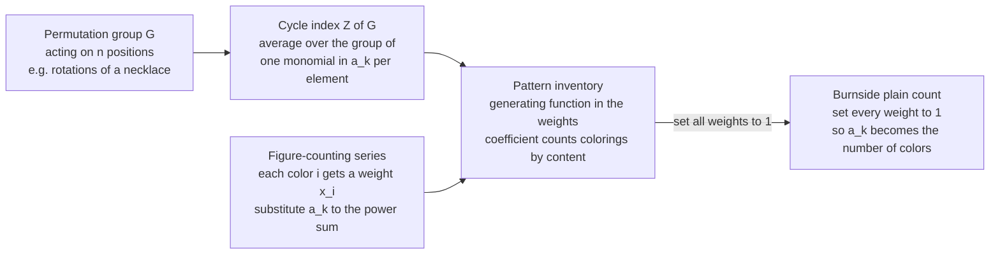

# 💠 Pólya Enumeration Theory

> [!abstract] TL;DR
> Pólya enumeration theory is **Burnside's lemma upgraded from a headcount to a full inventory**. Where Burnside tells you *how many* distinct objects exist up to a symmetry group, Pólya's theorem tells you *how many of each type* — packaging the entire breakdown into a single **generating function**. Its two moving parts are the **cycle index** $Z(G)$ — a polynomial that records the cycle structure of every element of the symmetry group $G$ — and the **substitution rule**: replace each variable $a_k$ in $Z(G)$ by the color-counting series $\sum_i x_i^k$, and out falls the **pattern inventory**, whose coefficient of $x_1^{e_1}\cdots x_m^{e_m}$ counts the distinct colorings that use exactly $e_i$ beads of color $i$. Setting every color weight to $1$ collapses the inventory back to Burnside's plain count. It is how chemists counted molecular isomers (Pólya's original 1937 motivation) and how mathematicians enumerate unlabeled graphs, necklaces, and Boolean functions by content.

---

## Intuition

**Analogy — the necklace inventory.** Burnside's lemma answers *"how many genuinely different necklaces can I make from $n$ beads in $k$ colors, if rotating the necklace doesn't create a new one?"* — a single number. But a bead shop owner wants more: *"of those distinct necklaces, how many use exactly $2$ red beads and $4$ blue beads?"* You could dump every possible necklace on the table, spin each to its canonical position, throw away duplicates, and then **sort the survivors into bins by color composition**. That sorting is the *pattern inventory*, and Pólya's theory computes the whole set of bins at once — without ever laying out a single necklace.

Technically, Pólya's theory is **symmetry-aware counting with full bookkeeping**. Burnside averages a plain fixed-point count over the group; Pólya averages a *weighted* fixed-point count in which every color carries its own formal marker. The averaging machinery is identical — the difference is that Pólya refuses to forget *which* colors were used, so the answer arrives as a generating function tracking content rather than a lone integer. Burnside is the special case you recover by erasing the labels at the very end.

---

## How It Works

### Core Mechanics

Pólya's theorem is a three-step pipeline: **describe the symmetry → substitute the colors → read off the inventory.**

1. **Model the objects as colorings.** You are coloring $n$ *positions* (necklace beads, cube faces, graph-vertex-pairs) with colors drawn from a palette. Two colorings are "the same" if a symmetry in a **permutation group** $G$ (acting on the positions) maps one to the other. The distinct objects are the **orbits** of $G$ acting on all $k^n$ colorings.

2. **Build the cycle index $Z(G)$ — the key object.** Every permutation $g \in G$ decomposes into disjoint cycles. Let $c_k(g)$ be the number of $k$-cycles of $g$. Record $g$ as the monomial $a_1^{c_1(g)} a_2^{c_2(g)} \cdots a_n^{c_n(g)}$ in formal variables $a_1,\dots,a_n$, then **average over the group**:
$$
Z(G) \;=\; \frac{1}{|G|}\sum_{g \in G} a_1^{c_1(g)}\,a_2^{c_2(g)}\cdots a_n^{c_n(g)}.
$$
The cycle index is a fingerprint of the group's *action* — it forgets everything except how each element chops the positions into cycles. For the cyclic group $C_n$ (necklace rotations) it has the clean closed form $Z(C_n) = \frac{1}{n}\sum_{d\mid n}\varphi(d)\,a_d^{\,n/d}$.

3. **Substitute the figure-counting series (Pólya's Enumeration Theorem).** Give color $i$ a formal weight $x_i$. The **figure-counting series** is $\sum_i x_i$. Pólya's theorem says: replace every variable $a_k$ in the cycle index by the $k$-th *power sum* of the weights,
$$
a_k \;\longmapsto\; x_1^{k} + x_2^{k} + \cdots + x_m^{k},
$$
and the result is the **pattern inventory** — a generating function whose coefficient of $x_1^{e_1}\cdots x_m^{e_m}$ is the number of *distinct* colorings (orbits) using exactly $e_i$ positions of color $i$. Why the power sum? A $k$-cycle forces all $k$ of its positions to share one color, contributing $x_i^k$ if that color is $i$ — the substitution encodes "a cycle must be monochromatic."

4. **Recover Burnside by erasing weights.** Set every $x_i = 1$. Then $a_k \mapsto \underbrace{1+\cdots+1}_{m} = m$ (the number of colors), and the inventory collapses to
$$
Z(G)\big|_{a_k = m} \;=\; \frac{1}{|G|}\sum_{g\in G} m^{\,c(g)} \;=\; \frac{1}{|G|}\sum_{g\in G}\bigl|\text{colorings fixed by }g\bigr|,
$$
which is **exactly Burnside's lemma** — the plain count of distinct colorings, because $m^{c(g)}$ (with $c(g)$ the total number of cycles) is the number of colorings a $k$-cycle-respecting $g$ leaves unchanged. Pólya is Burnside carrying receipts.

### Flow / Architecture



---

## Key Concepts

### Secondary Level
- **The upgrade over Burnside.** Burnside's lemma counts *how many* distinct symmetric objects exist. Pólya's theory counts *how many of each kind* — a distribution, not a single number.
- **Necklace, the running example.** A necklace of $n$ beads is a coloring of $n$ positions arranged in a circle; two are the same if one is a rotation of the other. A *bracelet* also allows flipping (reflections).
- **Content / composition.** The "type" of a coloring is just how many beads of each color it uses — e.g. "$2$ red, $4$ blue." Pólya sorts distinct objects by content.
- **A cycle must be one color.** If a symmetry sends bead $1 \to 3 \to 5 \to 1$ (a $3$-cycle), a coloring can only be *unchanged* by that symmetry if beads $1,3,5$ all share a color. This single fact drives the whole theory.

### Undergraduate Level
- **Cycle index $Z(G)$.** The polynomial $\frac{1}{|G|}\sum_g \prod_k a_k^{c_k(g)}$. For rotations, $Z(C_n)=\frac1n\sum_{d\mid n}\varphi(d)\,a_d^{n/d}$; the dihedral (bracelet) group adds reflection terms — for odd $n$ each reflection contributes $a_1 a_2^{(n-1)/2}$, and for even $n$ half the reflections give $a_1^2 a_2^{(n-2)/2}$ and half give $a_2^{n/2}$.
- **Pólya substitution.** $a_k \mapsto \sum_i x_i^k$ (the $k$-th power sum of color weights). Two colors with weights $b,w$ give $a_k \mapsto b^k + w^k$; the coefficient of $b^{j}w^{n-j}$ in the resulting inventory is the number of distinct colorings with exactly $j$ black beads.
- **Burnside as the $x_i = 1$ specialization.** Setting all weights to $1$ turns the inventory into $\frac{1}{|G|}\sum_g k^{c(g)}$, the Cauchy–Frobenius (Burnside) orbit count. Thus Pólya *contains* Burnside as its "plain" evaluation, and Burnside is the *weighted count with all weights equal*.
- **Orbit–stabilizer under the hood.** Both theorems descend from the orbit–stabilizer relation: the number of orbits equals the average number of fixed points. See [[Mathematics/10_Abstract_Algebra/Cosets_and_Lagrange_Theorem|Lagrange's theorem]] for the $|G| = |\text{orbit}|\cdot|\text{stabilizer}|$ backbone.
- **Figure-counting series in general.** If the "figures" placed at each position themselves have a generating series $f(x) = \sum_r f_r x^r$ (e.g. figures of "size" $r$), substituting $a_k \mapsto f(x^k)$ counts configurations by total size — the general Pólya statement, of which coloring is the case $f(x)=\sum_i x_i$.

### Graduate Level
- **Redfield–Pólya provenance.** J. H. Redfield published the core theorem in 1927; Pólya rediscovered and vastly extended it in 1937 with applications to chemistry and graphs, which is why it is often the **Redfield–Pólya theorem**. Pólya's motivating problem was **counting chemical isomers**.
- **de Bruijn's generalization — symmetry on colors too.** Classical Pólya lets a group $G$ permute *positions*. de Bruijn's extension allows a second group $H$ to permute the *colors* simultaneously, counting orbits of the product action. This handles questions like "necklaces where swapping black $\leftrightarrow$ white is also considered the same," and self-complementary structures.
- **Connection to symmetric functions.** The substitution $a_k \mapsto p_k = \sum_i x_i^k$ (the power-sum symmetric polynomial) means $Z(G)$ evaluated on power sums is a **symmetric function**; expressing it in the monomial or Schur basis links Pólya theory to the ring of symmetric functions and to representation theory of $S_n$ (the sibling *Young tableaux and symmetric functions* material).
- **Unlabeled graphs — Redfield–Pólya on the pair group.** Counting graphs on $n$ vertices up to isomorphism is Pólya applied to the group induced by $S_n$ acting on the $\binom{n}{2}$ *edge slots* (the "pair group" $S_n^{(2)}$). The cycle index of the pair group, substituted with $1 + x$ (edge absent/present), yields the generating function for unlabeled graphs by number of edges — Harary's classic result.
- **Weighted Burnside is Pólya.** Formally, Pólya's theorem is the *weighted* Cauchy–Frobenius lemma: $\sum_{\text{orbits}} w(\text{orbit}) = \frac{1}{|G|}\sum_g \sum_{x \text{ fixed by } g} w(x)$, valid whenever the weight $w$ is constant on orbits. Choosing $w$ = the monomial in color counts gives exactly the pattern inventory.
- **Computational structure.** The cycle index has one monomial per *conjugacy class* (elements of the same cycle type coincide), so $|G|$ can be summarized by its cycle-type distribution — but for large or unstructured $G$ that distribution can still explode, and computing it is the practical bottleneck.

---

## Python Demo

This demo builds Pólya's machine end to end and **checks it against brute force**. It (a) constructs the **cycle index** of the cyclic group $C_n$ (necklace rotations) and the dihedral group $D_n$ (bracelet rotations + reflections); (b) applies **Pólya's theorem** by substituting the two-color series $a_k \mapsto b^k + 1$ to get the **pattern inventory** — the count of distinct colorings broken down by number of black beads — and confirms that summing the inventory equals the plain **Burnside** count $\frac1{|G|}\sum_g 2^{c(g)}$; and (c) **verifies every inventory** against an exhaustive orbit enumeration bucketed by color content. The figure shows the length-$8$ necklace inventory by black-bead count (with brute-force dots on top) and the total necklace-vs-bracelet counts as $n$ grows.

```python
# Polya Enumeration Theory: cycle index + Polya's theorem, verified by brute force.
# (a) CYCLE INDEX of a symmetry group: cyclic C_n (necklace rotations)
#     and dihedral D_n (bracelet rotations + reflections).
# (b) POLYA's THEOREM: substitute the 2-color series a_k -> b^k + 1.
#       - summing the inventory (equivalently b=1) recovers BURNSIDE's plain count,
#       - keeping the marker b gives the PATTERN INVENTORY by color content.
# (c) VERIFY every inventory against brute-force orbit enumeration by black-bead count.

from fractions import Fraction
from collections import Counter
from math import gcd
from itertools import product as iproduct
import numpy as np
import matplotlib.pyplot as plt

# ---------- cycle types of each group as dict{cycle_length: number_of_cycles} ----------
def cyclic_cycletypes(n):
    """The n rotations. Rotation by d splits n positions into gcd(n,d) cycles."""
    types = []
    for d in range(n):
        c = gcd(n, d)                 # gcd(n,0)=n -> the identity has n fixed points
        types.append({n // c: c})
    return types

def dihedral_cycletypes(n):
    """Rotations plus n reflections -> the bracelet group D_n."""
    types = cyclic_cycletypes(n)
    if n % 2 == 1:                     # odd: each axis fixes 1 bead, swaps the rest
        t = {1: 1}
        if n > 1:
            t[2] = (n - 1) // 2
        types += [dict(t) for _ in range(n)]
    else:                              # even: half through beads, half through gaps
        for _ in range(n // 2):
            t = {1: 2}
            if n > 2:
                t[2] = (n - 2) // 2
            types.append(t)
        for _ in range(n // 2):
            types.append({2: n // 2})
    return types

def cycle_index_string(types):
    """Pretty-print Z(G) = (1/|G|) * sum of monomials a_k^c, grouping equal terms."""
    agg = Counter()
    for ct in types:
        mono = " ".join(f"a{k}^{c}" for k, c in sorted(ct.items()) if c)
        agg[mono or "1"] += 1
    body = " + ".join((f"{m}*" if m > 1 else "") + mono for mono, m in agg.items())
    return f"(1/{len(types)}) [ {body} ]"

# ---------- POLYA substitution for 2 colors: a_k -> b^k + 1 (white weight fixed to 1) ----------
def fpoly_mul(p, q):
    out = [Fraction(0)] * (len(p) + len(q) - 1)
    for i, a in enumerate(p):
        for j, bb in enumerate(q):
            out[i + j] += a * bb
    return out

def pattern_inventory_2color(types, n):
    """Coefficient of b^j = number of DISTINCT 2-colorings with exactly j black beads."""
    total = [Fraction(0)] * (n + 1)
    for ct in types:
        term = [Fraction(1)]                       # the polynomial "1"
        for k, cnt in ct.items():
            factor = [Fraction(0)] * (k + 1)
            factor[0] = factor[k] = Fraction(1)     # the polynomial (b^k + 1)
            for _ in range(cnt):
                term = fpoly_mul(term, factor)
        term += [Fraction(0)] * (n + 1 - len(term))
        for i in range(n + 1):
            total[i] += term[i]
    inv = [t / len(types) for t in total]
    assert all(x.denominator == 1 for x in inv), "pattern inventory must be integers"
    return [int(x) for x in inv]

# ---------- brute force: enumerate orbits, bucket by number of black beads ----------
def brute_force_by_content(n, dihedral):
    def rots(t):
        return [tuple(t[(i + r) % n] for i in range(n)) for r in range(n)]
    def orbit(t):
        s = rots(t)
        if dihedral:
            s += rots(t[::-1])
        return s
    seen, counts = set(), [0] * (n + 1)
    for c in iproduct((0, 1), repeat=n):
        canon = min(orbit(c))
        if canon not in seen:
            seen.add(canon)
            counts[sum(c)] += 1
    return counts

# ---------- (a) show two cycle indices ----------
print("Cycle index Z(C_6) =", cycle_index_string(cyclic_cycletypes(6)))
print("Cycle index Z(D_6) =", cycle_index_string(dihedral_cycletypes(6)))
print()

# ---------- (b)+(c) verify Polya inventory == brute force, and inventory-sum == Burnside ----------
for n in range(1, 11):
    for name, types, dih in [("necklace", cyclic_cycletypes(n), False),
                             ("bracelet", dihedral_cycletypes(n), True)]:
        assert pattern_inventory_2color(types, n) == brute_force_by_content(n, dih), \
            f"inventory mismatch at n={n} {name}"
    ct = cyclic_cycletypes(n)
    total_neck = sum(pattern_inventory_2color(ct, n))
    burnside   = sum(Fraction(2) ** sum(t.values()) for t in ct) / n   # (1/n) sum 2^c(g)
    assert total_neck == burnside                                      # Polya at b=1 == Burnside
    print(f"n={n:2d}:  2-color necklaces = {total_neck:3d}   (Burnside 1/n sum 2^c(g) = {int(burnside)})")

# ---------- inventory of length-N necklaces by number of black beads ----------
N = 8
inv_neck = pattern_inventory_2color(cyclic_cycletypes(N), N)
bru_neck = brute_force_by_content(N, False)
print(f"\nLength-{N} necklaces by #black beads: {inv_neck}  (sum = {sum(inv_neck)})")

# ---------- plots ----------
fig, ax = plt.subplots(1, 2, figsize=(13, 4.8))

j = np.arange(N + 1)
ax[0].bar(j, inv_neck, color="#2563eb", label="Polya pattern inventory")
ax[0].plot(j, bru_neck, "o", ms=7, color="#dc2626", label="brute-force orbits")
ax[0].set(title=f"Distinct 2-color necklaces of length {N}\nbroken down by number of black beads",
          xlabel="number of black beads  j", ylabel="distinct necklaces")
ax[0].set_xticks(j); ax[0].legend()

ns = np.arange(1, 13)
neck = [sum(pattern_inventory_2color(cyclic_cycletypes(n), n)) for n in ns]
brac = [sum(pattern_inventory_2color(dihedral_cycletypes(n), n)) for n in ns]
w = 0.4
ax[1].bar(ns - w / 2, neck, w, color="#059669", label="necklaces  C_n  (rotations)")
ax[1].bar(ns + w / 2, brac, w, color="#7c3aed", label="bracelets  D_n  (with reflections)")
ax[1].set(title="Total 2-color necklaces vs bracelets\n(total = Polya inventory summed = Burnside)",
          xlabel="length  n", ylabel="distinct colorings")
ax[1].set_xticks(ns); ax[1].legend()

fig.suptitle("Polya enumeration: cycle index + color series -> pattern inventory (brute-force verified)",
             fontsize=12)
plt.tight_layout()
plt.savefig("polya_enumeration.png", dpi=120)
print("\nSaved polya_enumeration.png")
```

**What you see:** the console prints $Z(C_6)=\frac16[a_1^6 + a_2^3 + 2a_3^2 + 2a_6]$ (and the reflection-augmented $Z(D_6)$), then a table of two-color necklace counts $2,3,4,6,8,14,20,36,\dots$ where each row's Pólya total agrees with the independent Burnside evaluation $\frac1n\sum_g 2^{c(g)}$ — and **every** `assert` passes, meaning the pattern inventory matches exhaustive orbit enumeration bin-by-bin for all $n \le 10$, for both necklaces and bracelets. The length-$8$ necklace inventory reads $[1,1,4,7,10,7,4,1,1]$ (summing to $36$): one all-white, one with a single black bead, four distinct ways to place two black beads, and so on. The left panel draws that symmetric bell of counts with brute-force dots landing exactly on the bars; the right panel shows bracelets always at or below necklaces because the extra reflection symmetry fuses more colorings into each orbit.

---

## Real-World Applications

> **Example — counting chemical isomers (Pólya's original motivation).** A substituted molecule is a rigid skeleton whose sites can carry different atoms or groups; two labelings are the *same compound* if a symmetry of the skeleton maps one to the other. Pólya modeled the skeleton's rotation group, built its cycle index, and substituted a figure series over the possible substituents — the pattern inventory then counts distinct isomers **by molecular formula** (how many carbons, how many chlorines, and so on). His 1937 paper enumerated isomers of benzene derivatives and alcohols this way, and the method remains the backbone of computational isomer enumeration.

- **Necklaces, bracelets, and cyclic codes.** Counting binary strings up to rotation (and reflection) enumerates necklaces/bracelets, which model cyclic error-correcting codes, periodic sequences, and the distinct color patterns on rotationally symmetric tiles and beadwork.
- **Unlabeled graph enumeration (Redfield–Pólya).** The number of graphs on $n$ vertices up to isomorphism — and the refined counts *by number of edges* — come from the cycle index of the pair group acting on vertex-pairs, substituted with the two-symbol "edge present / absent" series. The same machine counts unlabeled trees, tournaments, and multigraphs.
- **Boolean / switching-function enumeration.** Digital designers count the distinct Boolean functions of $n$ inputs up to permutation of the inputs (and negation) — the number of essentially different logic circuits — via Pólya on the group acting on the $2^n$ rows of the truth table. de Bruijn's color-symmetry extension handles input negation.
- **Combinatorial chemistry and crystallography.** Enumerating distinct arrangements of ligands around a coordination center, or distinct decorations of a crystal's symmetry orbit, uses the relevant point-group cycle index — see molecular symmetry and stereochemistry.
- **Music and design.** Distinct rhythms on a cyclic beat grid, distinct colorings of a symmetric ornament, and distinct dice/domino face-decorations are all "colorings modulo a symmetry group," directly enumerated by content with Pólya's theorem.

---

## Common Pitfalls

- **Wrong group or wrong action.** The single most common error is enumerating the wrong symmetry. Necklaces use the *cyclic* group $C_n$ (rotations only); bracelets need the *dihedral* group $D_n$ (rotations **and** reflections). A cube's faces are permuted by the rotation group of order $24$, not by all $48$ symmetries unless you also allow mirror images. The cycle index must come from the group **acting on the right set** (faces vs vertices vs edges give different cycle indices for the same solid).
- **Cycle-index bookkeeping mistakes.** $c_k(g)$ counts $k$-*cycles*, and the exponent sum $\sum_k k\,c_k(g)$ must equal $n$ for every element (all positions accounted for). Forgetting the fixed points of a reflection (they are $1$-cycles, contributing $a_1$), or mis-splitting an even reflection into its two axis types, silently corrupts $Z(G)$. Always sanity-check that each monomial's degrees sum to $n$ and that the coefficients sum to $|G|$ before dividing.
- **Confusing the plain count with the weighted inventory.** Burnside gives *one number*; Pólya gives a *polynomial*. If a problem asks "how many use exactly two red beads," you need the inventory (keep the weights) — evaluating at all weights $=1$ throws that information away. Conversely, if you only need the total, don't do the extra symbolic work.
- **Substituting the figure series incorrectly.** The rule is $a_k \mapsto \sum_i x_i^{\,k}$ (the $k$-th **power sum**), **not** $a_k \mapsto (\sum_i x_i)^k$. A $k$-cycle demands one color for all $k$ of its positions, which is $x_i^k$ — using the $k$-th power of the whole series would (wrongly) let a single cycle be multicolored.
- **Computational blowup for big groups.** Summing over $|G|$ elements is fatal when the group is huge (e.g. $S_n$ acting on $\binom{n}{2}$ edge slots has $n!$ elements). Exploit that the cycle index has only one term per **conjugacy class / cycle type**, and use the closed forms ($Z(C_n)$ via Euler's totient, $Z(S_n)$ via its recurrence) instead of naive enumeration — otherwise the sum, not the mathematics, is the wall you hit.
- **Assuming you can just divide by $|G|$.** The tempting shortcut "total colorings $k^n$ divided by $|G|$" is wrong whenever some colorings have nontrivial stabilizers (e.g. a monochromatic necklace is fixed by *every* rotation). Orbits have different sizes, so you must average fixed points, not divide blindly — the very reason Burnside and Pólya exist.

---

## Related Concepts

- [[Mathematics/10_Abstract_Algebra/Groups_and_Subgroups|Groups and Subgroups]] — the symmetry group $G$ and its permutation action are the raw material; the cycle index is a fingerprint of that group's action on the positions.
- [[Mathematics/10_Abstract_Algebra/Cosets_and_Lagrange_Theorem|Cosets and Lagrange's Theorem]] — the orbit–stabilizer relation $|G| = |\text{orbit}|\cdot|\text{stabilizer}|$ underlies both Burnside's and Pólya's averaging of fixed points.
- [[Combinatorics/02_Advanced_Counting/Generating_Functions|Generating Functions]] — the pattern inventory *is* a generating function; substituting the color/figure series into $Z(G)$ is generating-function bookkeeping applied to symmetry.
- [[Combinatorics/03_Graph_and_Extremal_Combinatorics/Enumerative_Graph_Theory|Enumerative Graph Theory]] — counting *unlabeled* graphs up to isomorphism is Pólya applied to the pair group, the symmetry-aware sequel to that note's easy *labeled* counts.
- [[Combinatorics/01_Foundations_of_Counting/Permutations_and_Combinations|Permutations and Combinations]] — the cycle structure of permutations, and multiset counts by content, are the primitives Pólya's theory assembles.
- [[Combinatorics/02_Advanced_Counting/Integer_Partitions|Integer Partitions]] — cycle types are integer partitions of $n$, and the pattern inventory's exponents are compositions of $n$ into color counts.
- [[Combinatorics/01_Foundations_of_Counting/Combinatorics_Overview|Combinatorics Overview]] — the vault map situating Pólya theory within enumeration.
- [[Mathematics/04_Discrete_Mathematics/Combinatorics|Combinatorics (Discrete Math)]] — the counting principles (multiplication, inclusion–exclusion, bijections) that Pólya theory specializes to symmetric objects.
- [[Mathematics/04_Discrete_Mathematics/Generating_Functions_and_Recurrences|Generating Functions and Recurrences]] — closed forms like $Z(C_n)$ (Euler totient) and $Z(S_n)$ (a recurrence) are generating-function identities.
- [[Mathematics/04_Discrete_Mathematics/Graph_Theory|Graph Theory]] — provides the graph objects whose isomorphism classes Redfield–Pólya enumerates.
- [[Chemistry/04_Organic_Chemistry/Stereochemistry_and_Chirality|Stereochemistry and Chirality]] — distinct isomers up to molecular symmetry are exactly the orbits Pólya counts; chirality is why reflections (dihedral vs cyclic) change the answer.
- [[Chemistry/02_Physical_Chemistry/Molecular_Spectroscopy_and_Symmetry|Molecular Spectroscopy and Symmetry]] — molecular point groups supply the concrete permutation actions whose cycle indices enumerate substitution isomers.
- [[Physics/15_Mathematical_Physics/Lie_Groups_and_Lie_Algebras|Lie Groups and Lie Algebras]] — the continuous-symmetry counterpart; Pólya theory is the *finite* symmetry-counting cousin of the group-theoretic language used throughout physics.

*Sibling notes in this section (Algebraic and Bijective Combinatorics), referenced here in prose: **Group Actions and Burnside's Lemma** (the plain orbit-count that Pólya refines into an inventory), and **Young Tableaux and Symmetric Functions** (the symmetric-function ring in which the power-sum substitution $a_k \mapsto p_k$ naturally lives).*

---

## Review Questions

1. **(Secondary)** You make necklaces of $4$ beads using two colors, and rotations count as the same. Compute the cycle index $Z(C_4)$ by hand (list the $4$ rotations and their cycle structures), then use Pólya's substitution $a_k \mapsto b^k + w^k$ to find how many distinct necklaces use exactly $2$ black and $2$ white beads. Verify by drawing them.
2. **(Undergraduate — scenario)** A colleague computes "the number of distinct $6$-bead, $3$-color necklaces" by taking $3^6 = 729$ and dividing by $6$ (the number of rotations), getting a non-integer and concluding they made an arithmetic slip. Explain *why the divide-by-$|G|$ approach is fundamentally wrong*, then show how Burnside (equivalently Pólya with all weights $=1$) gives the correct integer, and identify which colorings broke the naive division.
3. **(Graduate — trade-off)** You must count unlabeled simple graphs on $n$ vertices *by number of edges*. This is Pólya on the pair group $S_n^{(2)}$ acting on the $\binom{n}{2}$ edge slots, substituting $1 + x$. Discuss the computational trade-off: the group has $n!$ elements, yet the cycle index has only one monomial per cycle type. How does grouping by conjugacy class (and using the closed-form cycle-type distribution) rescue the computation, and where does de Bruijn's color-symmetry generalization enter if you also want to identify a graph with its edge-complement?

---

## Sources

- [Pólya, G. & Read, R. C. — *Combinatorial Enumeration of Groups, Graphs, and Chemical Compounds* (Springer, 1987)](https://link.springer.com/book/10.1007/978-1-4612-4664-0) — the English translation of Pólya's landmark 1937 paper with Read's commentary; the definitive primary source, including the chemical-isomer origin.
- [Stanley, R. P. — *Enumerative Combinatorics*, Vol. 2 (Cambridge)](https://math.mit.edu/~rstan/ec/) — cycle indices, the exponential formula, and the symmetric-function view of Pólya theory.
- [van Lint, J. H. & Wilson, R. M. — *A Course in Combinatorics* (2nd ed., Cambridge)](https://www.cambridge.org/9780521006019) — a clean, self-contained chapter on Burnside, the cycle index, and Pólya's theorem with worked necklace and graph examples.
- [Harary, F. & Palmer, E. M. — *Graphical Enumeration* (Academic Press, 1973)](https://www.sciencedirect.com/book/9780123242457/graphical-enumeration) — the Redfield–Pólya theory of counting unlabeled graphs, trees, and digraphs via the pair group.
- [Bóna, M. — *A Walk Through Combinatorics* (World Scientific)](https://www.worldscientific.com/worldscibooks/10.1142/8027) — accessible treatment of Burnside → Pólya with the necklace/coloring motivation used above.

---

#combinatorics #polya-enumeration #cycle-index #symmetry #generating-functions
