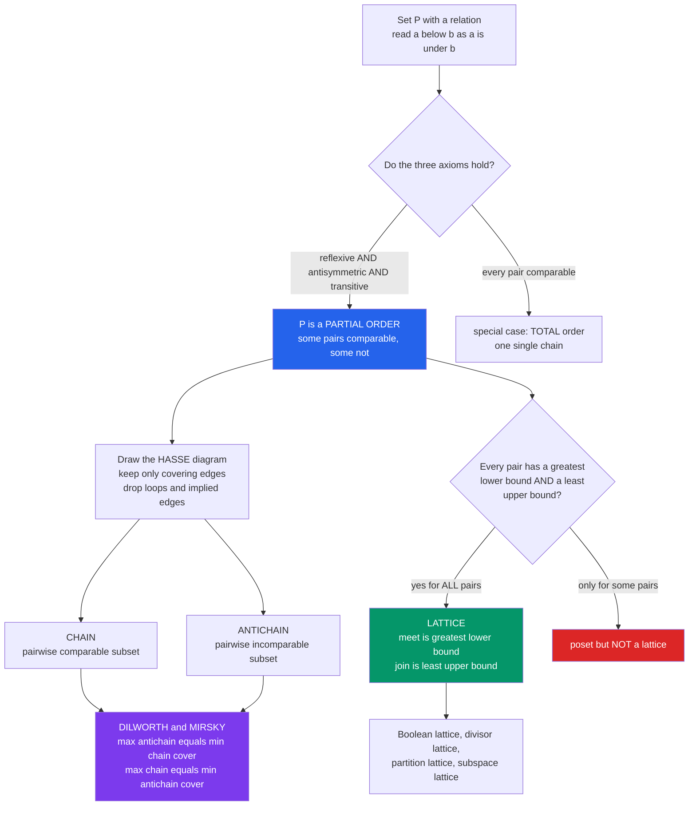

# 🪜 Posets and Lattices

> [!abstract] TL;DR
> A **partially ordered set (poset)** is a set with a "this-sits-below-that" relation that is **reflexive, antisymmetric, and transitive** — but where *not every pair is comparable*. It captures hierarchy, dependency, and containment, drawn compactly as a **Hasse diagram** of covering relations. Two dual min–max gems govern it: **Dilworth's theorem** (the largest *antichain* of pairwise-incomparable elements equals the fewest *chains* needed to cover the poset) and **Mirsky's theorem** (the longest *chain* equals the fewest antichains needed to cover it). When *every* pair also has a greatest lower bound (**meet** $\wedge$) and least upper bound (**join** $\vee$), the poset upgrades to a **lattice** — the arena for Boolean algebras, divisor structures, and [[Combinatorics/01_Foundations_of_Counting/Inclusion_Exclusion_Principle|Möbius inversion]].

---

## Intuition

**Analogy — some things are clearly ordered, most things are only *partly* ordered.** The number $3$ is unambiguously less than $5$; every pair of numbers on the line has a definite winner. But most real relationships are only **partial**: *this cooking step must come before that one*, yet "chop the onions" and "boil the water" have no required order — do them in either order, or at once. *This folder contains that file*, yet two overlapping folders may contain neither each other. *This commit is an ancestor of that one*, yet two branches diverge with no ancestry between them.

A **partially ordered set** captures exactly this "some pairs comparable, some not" texture. Draw it as a **Hasse diagram** — a picture of *what sits directly above what*, with the redundant "implied" edges erased. A vertical thread of mutually comparable elements is a **chain** (a to-do list you must follow in order); a horizontal spray of mutually *incomparable* elements is an **antichain** (tasks with no ordering, freely parallelizable). Posets are the mathematics of hierarchy, dependency, and containment — the skeleton beneath scheduling, logic, version control, causality, and much of combinatorics. Add the guarantee that any two elements have a unique "nearest common floor" and "nearest common ceiling" and you get a **lattice**, the shape of Boolean logic and of divisibility itself.

---

## How It Works

### Core Mechanics

1. **The three axioms.** A relation $\le$ on a set $P$ is a **partial order** when for all $a,b,c$:
   - **Reflexive:** $a \le a$.
   - **Antisymmetric:** if $a \le b$ and $b \le a$ then $a = b$ (no two distinct elements sit on top of each other).
   - **Transitive:** if $a \le b$ and $b \le c$ then $a \le c$.
   The pair $(P, \le)$ is a **poset**. If additionally *every* pair is comparable ($a \le b$ or $b \le a$), it is a **total order** (a **chain**). Canonical examples: **divisibility** ($a \mid b$), **subset containment** ($A \subseteq B$, the *Boolean lattice*), **refinement** of set partitions, and the **dominance** order on integer partitions.
2. **Comparability.** Two elements are **comparable** if one is $\le$ the other; otherwise **incomparable** (written $a \parallel b$). The whole point of *partial* order is that incomparable pairs exist — this is what separates a poset from a line.
3. **Covering and the Hasse diagram.** $a$ is **covered by** $b$ (written $a \lessdot b$) if $a < b$ and *nothing lies strictly between* them. The **Hasse diagram** draws only these covering edges, placing higher elements above lower ones. Reflexive loops and transitively-implied edges are **omitted** — they are recoverable, so drawing them would only add clutter.
4. **Chains and antichains.** A **chain** is a subset that is totally ordered (pairwise comparable). An **antichain** is a subset that is pairwise *incomparable*. The **height** of a poset is its longest chain; the **width** is its largest antichain. Special elements: **maximal** (nothing above), **minimal** (nothing below), and, if unique, **top** $\hat 1$ and **bottom** $\hat 0$.
5. **Dilworth's theorem (min–max, width side).** In any finite poset, the size of the **largest antichain** equals the **minimum number of chains** needed to partition (cover) the poset. Fewer chains cannot cover an antichain, because two elements of one antichain can never share a chain — Dilworth says that obvious lower bound is *always* achievable.
6. **Mirsky's theorem (the dual, height side).** The size of the **longest chain** equals the **minimum number of antichains** needed to cover the poset. Mirsky's cover is *constructive*: group elements by **height/rank** (length of the longest chain ending at each), and each rank level is automatically an antichain.
7. **Lattices.** A poset is a **lattice** when *every* pair $a,b$ has a **meet** $a \wedge b$ (greatest lower bound) and a **join** $a \vee b$ (least upper bound). In the divisor lattice, $\wedge = \gcd$ and $\vee = \operatorname{lcm}$; in the Boolean lattice, $\wedge = \cap$ and $\vee = \cup$. A **distributive** lattice obeys $a \wedge (b \vee c) = (a \wedge b)\vee(a\wedge c)$ (Boolean and divisor lattices qualify); **modular** is the weaker law satisfied by the **subspace lattice** of a vector space.
8. **Ideals, filters, linear extensions.** An **order ideal** (downset) is closed downward; a **filter** (upset) is closed upward — they are order-dual. A **linear extension** is a total order refining the partial order — exactly a **topological sort** of the covering DAG. Counting linear extensions is a deep enumerative problem (and #P-hard in general).

### Flow / Architecture



---

## Key Concepts

### Secondary Level
- **Partial vs total order.** On a number line everything is comparable — a *total* order. In a family tree, or a to-do list with only *some* required orderings, many pairs are simply unrelated. That is a **partial** order.
- **Hasse diagram.** A tidy picture of "what is directly above what." You leave out the arrows you can already infer: no self-loops, and no edge from a grandparent straight to a grandchild.
- **Chain vs antichain.** A **chain** is a stack of things you *can* line up (each below the next). An **antichain** is a bunch of things *none* of which is above any other — think of tasks you could all do in parallel.
- **Divisibility example.** Order the divisors of $12$ by "divides." Then $2$ and $3$ are incomparable ($2 \nmid 3$, $3 \nmid 2$) — an antichain — while $1,2,4,12$ form a chain.

### Undergraduate Level
- **The axioms and their bite.** Antisymmetry forbids genuine two-way ties; transitivity lets the Hasse diagram omit implied edges. Drop antisymmetry and you get a **preorder** (quotient it to recover a poset).
- **Dilworth's theorem.** width $=$ minimum chain cover. Proved elegantly via **König's theorem** on a bipartite graph (Fulkerson's argument) — it is the order-theoretic sibling of bipartite matching's min–max duality (see *Matching Theory and Hall's Theorem* below).
- **Mirsky's theorem.** height $=$ minimum antichain cover, with the rank-level decomposition as an explicit witness. Dilworth and Mirsky are dual: swap "chain" and "antichain."
- **Lattice operations.** meet $=$ greatest lower bound, join $=$ least upper bound. **Boolean lattice** $2^{[n]}$ (subsets under $\subseteq$, $\wedge=\cap$, $\vee=\cup$); **divisor lattice** $D_n$ ($\wedge=\gcd$, $\vee=\operatorname{lcm}$); **partition lattice** $\Pi_n$ (set partitions under refinement). Every finite lattice has a top $\hat 1$ and bottom $\hat 0$.
- **Order ideals & linear extensions.** A **linear extension** is a topological sort; the number of them, $e(P)$, is a fundamental invariant. **Sperner's theorem** — the largest antichain of the Boolean lattice $2^{[n]}$ has size $\binom{n}{\lfloor n/2\rfloor}$ — is the flagship extremal fact about posets.

### Graduate Level
- **Distributive vs modular lattices.** Birkhoff's representation theorem: every finite **distributive** lattice is (isomorphic to) the lattice of order ideals $J(P)$ of some poset $P$ — a perfect dictionary between finite distributive lattices and finite posets. **Modular** but non-distributive lattices arise as **subspace lattices** of vector spaces (the diamond $M_3$ and pentagon $N_5$ are the forbidden sublattices distinguishing the classes).
- **The incidence algebra and Möbius functions.** Over a locally finite poset, functions $f(a,b)$ (nonzero only when $a\le b$) form the **incidence algebra** under convolution. The **zeta function** $\zeta$ and its inverse the **Möbius function** $\mu$ power **Möbius inversion** — the vast generalization of [[Combinatorics/01_Foundations_of_Counting/Inclusion_Exclusion_Principle|inclusion–exclusion]] (which is exactly the Boolean-lattice case) and of classical number-theoretic Möbius inversion (the divisor lattice case). This is the doorway to the *next* note in this section.
- **Symmetric-chain decompositions & the LYM inequality.** The Boolean lattice admits a partition into symmetric chains, giving a slick proof of **Sperner** and its generalizations (Dilworth's theorem realized concretely). The **LYM (Lubell–Yamamoto–Meshalkin) inequality** sharpens it.
- **Young's lattice & tableaux.** Ordering integer partitions by inclusion of Young diagrams yields **Young's lattice**; its saturated chains from $\hat 0$ correspond to **standard Young tableaux**, tying order theory to the representation theory of the symmetric group (see *Young Tableaux and Symmetric Functions* below).
- **Poset as a category.** A poset is precisely a **thin category** — at most one morphism between any two objects. Then **meets are products/limits** and **joins are coproducts/colimits**, so [[Category_Theory/03_Universal_Constructions/Limits_and_Colimits|limits and colimits]] specialize to $\wedge$ and $\vee$, and a Galois connection is an adjunction. Order duality is the [[Category_Theory/01_Foundations/Duality_and_the_Opposite_Category|opposite category]].

---

## Python Demo

We take the cleanest teaching example — the **divisibility poset of the divisors of $12$**, i.e. $\{1,2,3,4,6,12\}$ ordered by $a \le b \iff a \mid b$. This is the product of a length-3 chain (powers of $2$) and a length-2 chain (powers of $3$), so it is a genuine **lattice** ($\wedge=\gcd$, $\vee=\operatorname{lcm}$) with width $2$ and height $4$. The code (a) builds the poset, extracts the **Hasse (covering) edges**, brute-forces the **maximum antichain** (width), computes the **minimum chain cover** via Fulkerson/König **bipartite matching** on the comparability relation, and **verifies Dilworth** (the two numbers must match); (b) confirms the lattice property by closure under $\gcd/\operatorname{lcm}$, then **verifies Mirsky's dual** via the rank-level antichain cover. The plot shows the Hasse diagram twice: left, the Dilworth **chain decomposition** with the max antichain ringed in red; right, the Mirsky **antichain levels** colored by rank.

```python
# Posets, chains & Dilworth on the DIVISIBILITY poset of the divisors of 12.
#   elements 1,2,3,4,6,12 ordered by  a <= b  iff  a divides b.
# (a) build the poset + Hasse diagram; max antichain (width) by brute force;
#     min chain cover via Fulkerson/Konig bipartite matching -> VERIFY DILWORTH.
# (b) show it is a LATTICE (meet=gcd, join=lcm stay inside P);
#     VERIFY MIRSKY (dual): longest chain == minimum antichain cover (rank levels).
from itertools import combinations
from math import gcd
import matplotlib.pyplot as plt

P = [1, 2, 3, 4, 6, 12]
idx = {v: i for i, v in enumerate(P)}
n = len(P)

def leq(a, b):                              # the partial order: a <= b  iff  a | b
    return b % a == 0

# ---- strict comparability and covering (Hasse) relations ----
strict = [(a, b) for a in P for b in P if a != b and leq(a, b)]
def is_cover(a, b):                         # a covered by b: a<b and nothing between
    if a == b or not leq(a, b):
        return False
    return not any(a != k != b and leq(a, k) and leq(k, b) for k in P)
hasse = [(a, b) for a in P for b in P if is_cover(a, b)]

# ---- (a1) WIDTH: brute-force the largest pairwise-incomparable subset ----
def is_antichain(S):
    return all(not leq(a, b) and not leq(b, a) for a, b in combinations(S, 2))
antichains = [set(S) for r in range(1, n + 1)
              for S in combinations(P, r) if is_antichain(S)]
max_antichain = max(antichains, key=len)
width = len(max_antichain)

# ---- (a2) MIN CHAIN COVER via Fulkerson: n - max_matching(comparability graph) ----
# bipartite graph: left i -> right j  iff  P[i] < P[j] strictly.
adj = {i: [idx[b] for (a, b) in strict if a == P[i]] for i in range(n)}
def max_matching():
    match_r = [-1] * n
    def aug(u, seen):
        for v in adj[u]:
            if not seen[v]:
                seen[v] = True
                if match_r[v] == -1 or aug(match_r[v], seen):
                    match_r[v] = u
                    return True
        return False
    for u in range(n):
        aug(u, [False] * n)
    return match_r
match_r = max_matching()
m = sum(1 for u in match_r if u != -1)
min_chain_cover = n - m

# rebuild the chains from the matching (u -> successor v means "same chain")
succ = {P[u]: P[v] for v, u in enumerate(match_r) if u != -1}
starts = [x for x in P if x not in succ.values()]
chains = []
for s in starts:
    ch, x = [s], s
    while x in succ:
        x = succ[x]; ch.append(x)
    chains.append(ch)

print("Divisibility poset of the divisors of 12")
print("  Hasse (covering) edges:", hasse)
print(f"  max antichain   = {sorted(max_antichain)}   (WIDTH  = {width})")
print(f"  min chain cover = {min_chain_cover} chains: {chains}")
print(f"  DILWORTH: width {width} == min chain cover {min_chain_cover}  -> "
      f"{width == min_chain_cover}")

# ---- (b) LATTICE check: meet=gcd, join=lcm, both closed inside P ----
def lcm(a, b): return a * b // gcd(a, b)
is_lattice = all(gcd(a, b) in P and lcm(a, b) in P for a in P for b in P)
print(f"\n  meet(4,6)=gcd={gcd(4,6)}, join(4,6)=lcm={lcm(4,6)} ; "
      f"closed under gcd/lcm -> LATTICE: {is_lattice}")

# ---- MIRSKY (dual): longest chain == min antichain cover (rank levels) ----
height = {}
for x in sorted(P):                         # longest chain ending at x
    below = [height[y] for y in P if y != x and leq(y, x)]
    height[x] = 1 + (max(below) if below else 0)
max_chain_len = max(height.values())
levels = {}
for x, h in height.items():
    levels.setdefault(h, []).append(x)
print(f"  MIRSKY: longest chain {max_chain_len} == antichain cover {len(levels)} "
      f"levels {dict(sorted(levels.items()))}  -> {max_chain_len == len(levels)}")

# ---- Hasse diagram layout (bottom = minimum, top = maximum) ----
pos = {1: (0, 0), 2: (-1, 1), 3: (1, 1), 4: (-1, 2), 6: (1, 2), 12: (0, 3)}
palette = ["#2563eb", "#059669", "#f59e0b", "#7c3aed"]
chain_color = {v: palette[i % len(palette)] for i, ch in enumerate(chains) for v in ch}
level_color = {v: palette[(height[v] - 1) % len(palette)] for v in P}

def draw(ax, color_of, title, ring=None):
    for a, b in hasse:                      # covering edges only (implied edges omitted)
        (x1, y1), (x2, y2) = pos[a], pos[b]
        ax.plot([x1, x2], [y1, y2], color="#94a3b8", lw=1.6, zorder=1)
    for v in P:
        x, y = pos[v]
        ax.scatter([x], [y], s=780, color=color_of(v), edgecolors="k", zorder=3)
        ax.text(x, y, str(v), ha="center", va="center",
                color="w", fontweight="bold", zorder=4)
        if ring and v in ring:              # highlight the maximum antichain
            ax.scatter([x], [y], s=1650, facecolors="none",
                       edgecolors="#dc2626", linewidths=2.6, zorder=2)
    ax.set_title(title); ax.axis("off")
    ax.set_xlim(-2, 2); ax.set_ylim(-0.6, 3.6)

fig, ax = plt.subplots(1, 2, figsize=(12, 6))
draw(ax[0], lambda v: chain_color[v],
     f"DILWORTH: {min_chain_cover} chains cover P = width {width}\n"
     f"red ring = max antichain {sorted(max_antichain)}", ring=max_antichain)
draw(ax[1], lambda v: level_color[v],
     f"MIRSKY: {len(levels)} antichain levels = longest chain {max_chain_len}\n"
     f"each colour = one rank-level antichain")
fig.suptitle("Divisibility poset of the divisors of 12 - a distributive lattice",
             fontweight="bold")
plt.tight_layout()
plt.savefig("posets_dilworth_mirsky_demo.png", dpi=120)
plt.show()
```

**What you see.** The console prints width $=2$ and a **min chain cover of $2$** (e.g. $1\!\mid\!2\!\mid\!4\!\mid\!12$ and $3\!\mid\!6$) — **Dilworth verified**, the antichain $\{2,3\}$ and the two-chain cover meeting exactly. It confirms closure under $\gcd/\operatorname{lcm}$, so the poset is a **lattice**, and reports the **Mirsky** dual: longest chain $=4$ equals the $4$ rank-level antichains $\{1\},\{2,3\},\{4,6\},\{12\}$. The left panel colors the two Dilworth chains and rings the maximum antichain in red; the right panel colors the four Mirsky levels — one clean picture of both min–max theorems on the same lattice.

---

## Real-World Applications

> **Example — build systems and task schedulers (`make`, Bazel, Airflow, CI pipelines).** A build graph is a poset of tasks under the "must-run-before" relation. A valid execution order is a **linear extension** (a [[DSA/07_Graphs/Topological_Sort|topological sort]]) of that poset; **antichains** are the sets of tasks with no dependency between them, so the **width** is the maximum parallelism a scheduler can ever exploit, and **Dilworth** says the minimum number of sequential worker-lanes needed to cover all tasks equals that width. Schedulers implicitly compute chain covers to pack work onto cores.

- **Distributed systems and causality.** Lamport's **happens-before** relation makes events a poset; concurrent events are **incomparable** — an antichain — while a causal history is a chain. Vector clocks encode this partial order exactly, and a **consistent global snapshot** is an order ideal (downset) of the event poset.
- **Version control (Git).** Commits form a poset under ancestry; the DAG *is* the Hasse diagram of covering edges. Merges compute a **join**-like lowest common ancestor; diverged branches are incomparable elements.
- **Databases and query optimization.** Functional-dependency closures and the lattice of attribute sets guide normalization; **concept lattices** (Formal Concept Analysis) organize objects and attributes as a Galois lattice for data mining and ontology building.
- **Type systems and program analysis.** Subtyping is a partial order; **abstract interpretation** runs a fixed-point iteration over a lattice of abstract values, using **join** to merge control-flow branches — the meet/join structure is what makes static analysis converge.
- **Access control and security.** The Bell–LaPadula model classifies data on a **lattice** of security levels; "no read up, no write down" is enforced by lattice meets and joins over clearances.
- **Scheduling on machines.** Minimum chain cover of a task poset lower-bounds the number of processors for a dependency-respecting schedule — a direct industrial use of Dilworth.

---

## Common Pitfalls

- **Confusing partial order with total order.** In a poset, "$a$ is not $\le b$" does **not** imply "$b \le a$" — they may be **incomparable**. Reasoning as if every pair has a definite order (as on the number line) silently assumes totality and breaks on any real dependency graph or containment hierarchy.
- **Drawing transitive edges in a Hasse diagram.** The Hasse diagram shows **only covering relations**; the implied edges (grandparent to grandchild) and reflexive loops are deliberately omitted because they are recoverable by transitivity. Adding them turns the diagram into an unreadable comparability graph and can even hide which relations are *covers*.
- **Swapping chain and antichain.** A **chain** is pairwise *comparable* (a totally ordered stack); an **antichain** is pairwise *incomparable* (a flat parallel spread). Dilworth pairs *antichains with chains* and Mirsky pairs *chains with antichains* — mix them up and the min–max statements read backwards.
- **Assuming every poset is a lattice.** A lattice needs a meet **and** a join for **every** pair. Two incomparable elements with two different minimal upper bounds (and thus *no* least upper bound) form a poset that is **not** a lattice — the classic "N" and diamond-with-a-gap shapes. Bounds must be *unique* to count.
- **Forgetting meet/join must lie *inside* the set.** $\gcd$ and $\operatorname{lcm}$ of divisors of $12$ stay within the divisors of $12$, so it is a lattice; but a subset of a lattice that is not closed under $\wedge,\vee$ (a *sub-poset* but not a *sublattice*) can fail to have the bounds even though the parent does.
- **Reading incomparability as equality or as "unknown."** $a \parallel b$ is a genuine third state, distinct from $a=b$ and from $a<b$. In causality and version control this is *concurrency* — a first-class fact, not missing information.

---

## Related Concepts

- [[Combinatorics/01_Foundations_of_Counting/Combinatorics_Overview|Combinatorics Overview]] — places order theory within the algebraic/bijective branch of combinatorics, alongside enumeration and design.
- [[Combinatorics/01_Foundations_of_Counting/Inclusion_Exclusion_Principle|Inclusion–Exclusion Principle]] — the Boolean-lattice special case of **Möbius inversion**; posets are the general setting that unifies inclusion–exclusion with number-theoretic Möbius inversion.
- [[Combinatorics/03_Graph_and_Extremal_Combinatorics/Extremal_Combinatorics|Extremal Combinatorics]] — home of **Sperner's theorem** (largest antichain in the Boolean lattice) and LYM, the extremal face of poset width.
- [[Combinatorics/02_Advanced_Counting/Stirling_and_Bell_Numbers|Stirling and Bell Numbers]] — set partitions ordered by refinement form the **partition lattice** $\Pi_n$; Bell numbers count its elements.
- [[Combinatorics/02_Advanced_Counting/Integer_Partitions|Integer Partitions]] — the **dominance order** and inclusion of Young diagrams (**Young's lattice**) turn partitions into rich posets.
- [[Mathematics/04_Discrete_Mathematics/Set_Theory_and_Relations|Set Theory and Relations]] — a partial order *is* a special relation; reflexivity, antisymmetry, and transitivity are defined here.
- [[Mathematics/04_Discrete_Mathematics/Logic_and_Proof_Techniques|Logic and Proof Techniques]] — well-ordering and induction generalize to posets (Noetherian induction), and the axioms are proved with these tools.
- [[Mathematics/04_Discrete_Mathematics/Number_Theory_Elementary|Elementary Number Theory]] — the **divisor lattice** with $\gcd$/$\operatorname{lcm}$ as meet/join is the arithmetic exemplar used in the demo.
- [[Logic_and_Critical_Thinking/01_Foundations_of_Logic/Logical_Connectives_and_Boolean_Algebra|Logical Connectives and Boolean Algebra]] — a Boolean algebra is a complemented distributive lattice; $\wedge,\vee$ are logical AND/OR.
- [[DSA/07_Graphs/Topological_Sort|Topological Sort]] — a linear extension of a poset; the covering DAG is exactly what topological sort orders.
- [[Distributed_Systems_Theory/01_Foundations_and_Models/Logical_Clocks_and_Happens_Before|Logical Clocks and Happens-Before]] — the happens-before partial order of events; concurrent events form antichains.
- [[Distributed_Systems_Theory/01_Foundations_and_Models/Vector_Clocks_and_Causality|Vector Clocks and Causality]] — vector clocks encode the causal poset precisely, detecting comparability vs concurrency.
- [[Category_Theory/01_Foundations/Examples_of_Categories|Examples of Categories]] — a poset is a **thin category**; morphisms are the order relations.
- [[Category_Theory/03_Universal_Constructions/Limits_and_Colimits|Limits and Colimits]] — in a poset-as-category, **meet = product/limit** and **join = coproduct/colimit**.
- [[Category_Theory/01_Foundations/Duality_and_the_Opposite_Category|Duality and the Opposite Category]] — order duality (Dilworth↔Mirsky, ideals↔filters, $\wedge$↔$\vee$) is the opposite poset.

*Siblings to be written in this Algebraic & Bijective Combinatorics section (prose references): **Möbius Inversion and Incidence Algebras** (the zeta/Möbius functions this note foreshadows — posets are their native habitat), **Extremal Set Theory** (Sperner, LYM, and Erdős–Ko–Rado in depth), **Matching Theory and Hall's Theorem** (Dilworth's theorem is proved through its König/bipartite-matching duality), and **Young Tableaux and Symmetric Functions** (saturated chains in Young's lattice are standard Young tableaux).*

---

## Review Questions

1. **(Secondary)** Order the divisors of $12$ by "divides." List one **chain** of length $4$ and one **antichain** of size $2$. Explain in words why $4$ and $6$ are *incomparable* even though both are "bigger" than $2$, and why a Hasse diagram of this poset does **not** draw an edge directly from $1$ to $12$.
2. **(Undergraduate)** State **Dilworth's theorem** and **Mirsky's theorem** and explain precisely how they are dual. For the poset of divisors of $12$, exhibit a minimum chain cover and a minimum antichain cover, and confirm each matches the corresponding width/height. Then argue why a *lower* bound in each theorem (an antichain forces $\ge$ that many chains; a chain forces $\ge$ that many antichains) is easy, while achieving equality is the substantive content.
3. **(Graduate)** Prove that the divisor poset of any $n$ is a **distributive lattice**, and use **Birkhoff's representation theorem** to describe it as $J(P)$ for an explicit poset $P$ of prime-power "coordinates." Separately, sketch how **Dilworth's theorem** follows from **König's theorem** (Fulkerson's bipartite-matching argument), and explain why viewing the poset as a thin **category** makes meets and joins into limits and colimits, and order-duality into the opposite category.

---

## Sources

- [Stanley, R. P. — *Enumerative Combinatorics, Volume 1* (2nd ed., Cambridge), Ch. 3 "Partially Ordered Sets"](https://www.cambridge.org/core/books/enumerative-combinatorics/0126A97AB7D64EF9DEEC26F4C99C9757)
- [Davey, B. A. & Priestley, H. A. — *Introduction to Lattices and Order* (2nd ed., Cambridge)](https://www.cambridge.org/core/books/introduction-to-lattices-and-order/946458CB6638AF86D85BA00F5787F4F1)
- [Trotter, W. T. — *Combinatorics and Partially Ordered Sets: Dimension Theory* (Johns Hopkins University Press)](https://www.press.jhu.edu/books/title/1867/combinatorics-and-partially-ordered-sets)
- [van Lint, J. H. & Wilson, R. M. — *A Course in Combinatorics* (2nd ed., Cambridge), chapters on posets, Dilworth, and Möbius inversion](https://www.cambridge.org/9780521006019)
- [Dilworth, R. P. (1950) — "A Decomposition Theorem for Partially Ordered Sets," *Annals of Mathematics* 51(1)](https://www.jstor.org/stable/1969503)

---

#combinatorics #posets #lattices #hasse-diagrams #order-theory
