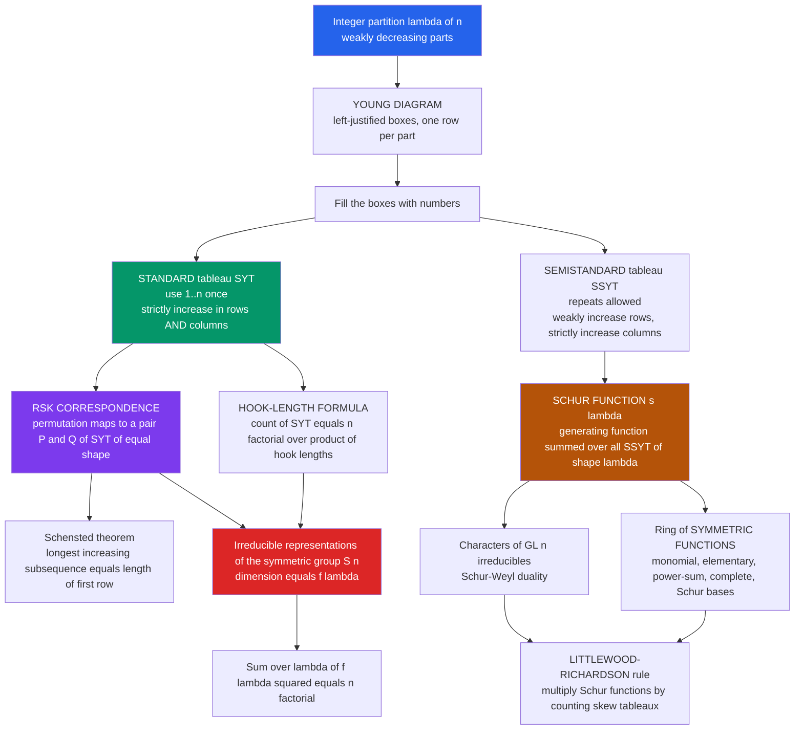

# 🔲 Young Tableaux and Symmetric Functions

> [!abstract] TL;DR
> A **Young tableau** is a staircase-shaped grid — the diagram of an integer partition $\lambda$ — with its cells filled by numbers that **increase** as you move right and down. These humble filled boxes are one of the deepest hubs in mathematics: the **hook-length formula** counts them instantly, the **RSK correspondence** turns them into a bijection with permutations, **Schur functions** package them into a basis of the ring of symmetric functions, and through all of this they *simultaneously* index the irreducible representations of the symmetric group $S_n$, describe how $GL_n$ representations decompose, and connect combinatorics to algebra, geometry, and even random-matrix physics.

---

## Intuition

**Analogy:** Draw a left-justified staircase of boxes — say 3 boxes on top, 2 below, 1 below that. Now fill every box with a number so that the numbers **increase left-to-right along each row and top-to-bottom down each column**. That filled staircase is a **Young tableau**. It looks like a child's number puzzle, yet these boxes are one of the deepest objects in all of mathematics.

Here is the astonishing part: those same filled boxes secretly do four completely different jobs at once. They **count** arrangements (how many valid fillings of a shape are there?). They **encode the symmetries** of $n$ objects — every irreducible way the symmetric group $S_n$ can act is labelled by one of these staircase shapes, and its dimension is exactly the number of fillings. They **describe how matrices multiply** — expanding products of matrix representations of $GL_n$ is bookkeeping over tableaux. And they **link combinatorics to algebra, geometry, and physics** through a single generating function called a Schur function. Few objects so simple to draw carry so much hidden structure. Young tableaux are a crossroads where many rivers of mathematics meet: integer partitions flow in from counting, group representations flow in from algebra, Schubert varieties flow in from geometry, and longest-increasing-subsequence statistics flow in from probability and computer science — and they all pass through the same little grid of boxes.

---

## How It Works

### Core Mechanics

1. **Start with a partition; draw its Young diagram.** A partition $\lambda = (\lambda_1 \ge \lambda_2 \ge \cdots \ge \lambda_\ell)$ of $n$ becomes a **Young diagram** (or **Ferrers shape**): $\lambda_1$ boxes in the top row, $\lambda_2$ in the next, left-justified. The shape *is* the partition, drawn. This is the geometric bridge back to [[Integer_Partitions]], where these same diagrams count unordered sums.

2. **Fill the boxes: two flavours of tableau.**
   - A **Standard Young Tableau (SYT)** of shape $\lambda \vdash n$ uses each of $1, 2, \dots, n$ exactly once, arranged to **strictly increase along every row and down every column**. It is a "growth order": a way to build the shape one box at a time, always adding a legal corner.
   - A **Semistandard Young Tableau (SSYT)** allows repeated entries from an alphabet $\{1,2,\dots,m\}$, arranged to **weakly increase along rows** (repeats allowed) but **strictly increase down columns** (no repeats in a column). The multiset of entries is its **content** or **weight**.

3. **Count SYT instantly: the hook-length formula.** For a cell $c$ of the diagram, its **hook** is the cell itself, all cells to its right in the same row (the *arm*), and all cells below it in the same column (the *leg*). The **hook length** $h(c)$ is the number of cells in that hook, i.e. $\text{arm} + \text{leg} + 1$. The **Frame–Robinson–Thrall hook-length formula** then gives the number of standard Young tableaux of shape $\lambda$:
   $$f^{\lambda} \;=\; \frac{n!}{\prod_{c \in \lambda} h(c)}.$$
   No enumeration needed — a single product of the numbers you write into the boxes.

4. **RSK: tableaux are secretly permutations.** The **Robinson–Schensted–Knuth correspondence** is a bijection
   $$w \;\longleftrightarrow\; (P, Q)$$
   between a permutation $w$ of $\{1,\dots,n\}$ and a **pair of standard Young tableaux of the same shape**. You build $P$ (the *insertion* tableau) by inserting the values of $w$ one at a time using row-bumping, and $Q$ (the *recording* tableau) by noting where each new box appeared. Schensted's theorem is the jewel: the length of the **longest increasing subsequence** of $w$ equals the length of the **first row** of $P$ (and the longest *decreasing* subsequence equals the number of rows) — see [[LCS_and_LIS]].

5. **Package tableaux into symmetric functions.** A **symmetric function** is a formal power series in variables $x_1, x_2, \dots$ that is unchanged under permuting the variables. They form a ring with several natural bases: **monomial** $m_\lambda$, **elementary** $e_\lambda$, **power-sum** $p_\lambda$, **complete homogeneous** $h_\lambda$, and — the star of the show — the **Schur functions** $s_\lambda$. The Schur function is a *generating function over SSYT*:
   $$s_\lambda(x_1, x_2, \dots) \;=\; \sum_{T \,\in\, \text{SSYT}(\lambda)} x^{\text{content}(T)},$$
   summing $x_1^{a_1} x_2^{a_2}\cdots$ over all semistandard fillings, where $a_i$ counts the $i$'s in $T$.

6. **Why anyone cares: representation theory.** Partitions of $n$ index the **irreducible representations of the symmetric group** $S_n$, and the dimension of the irreducible labelled by $\lambda$ is exactly $f^\lambda$ — the SYT count. Summing dimensions squared recovers the group order via a bijection you can literally *see* through RSK:
   $$\sum_{\lambda \vdash n} \left(f^{\lambda}\right)^2 \;=\; n!.$$
   Meanwhile the Schur functions $s_\lambda$ are the **characters of the irreducible polynomial representations of $GL_n$**, and **Schur–Weyl duality** ties the two stories together on the tensor space $(\mathbb{C}^m)^{\otimes n}$. Multiplying two Schur functions, $s_\mu \cdot s_\nu = \sum_\lambda c^{\lambda}_{\mu\nu}\, s_\lambda$, is governed by the **Littlewood–Richardson rule**, a purely combinatorial recipe for the coefficients $c^\lambda_{\mu\nu}$ by counting certain skew tableaux.

### Flow / Architecture



---

## Key Concepts

### Secondary (school-level)
- **Young diagram = a partition, drawn.** Rows of boxes, longest on top, left-justified. The shape of the staircase records the numbers $\lambda_1 \ge \lambda_2 \ge \cdots$.
- **A standard tableau is an increasing filling.** Put $1, 2, \dots, n$ into the boxes so numbers grow to the right and downward. Each such filling is one "valid puzzle solution".
- **You can count fillings without listing them.** The hook-length formula turns a counting problem that looks like it needs brute force into a single division: $n!$ over the product of the hook numbers.

### Undergraduate (discrete math / algebra)
- **Standard vs. semistandard.** SYT: entries $1..n$ once, **strict** in rows and columns. SSYT: entries from $\{1..m\}$ with repeats, **weakly** increasing rows but **strictly** increasing columns. This one asymmetry (weak rows, strict columns) is the whole grammar of the subject.
- **Hook length precisely.** For cell $c$: $h(c) = (\text{cells strictly to the right in its row}) + (\text{cells strictly below in its column}) + 1$. The $+1$ is the cell itself. Then $f^\lambda = n!/\prod_c h(c)$ (Frame–Robinson–Thrall, 1954).
- **RSK bijection.** Row-insertion (Schensted bumping) sends a permutation $w \in S_n$ to a pair $(P,Q)$ of SYT of the same shape; the map is a bijection, giving $\sum_{\lambda\vdash n}(f^\lambda)^2 = n!$ by pure counting. Restricting to involutions ($w = w^{-1}$) forces $P = Q$, so the number of involutions in $S_n$ is $\sum_\lambda f^\lambda$.
- **Schur functions as SSYT generators.** $s_\lambda = \sum_{T \in \text{SSYT}(\lambda)} x^{\text{content}(T)}$. Special shapes recover familiar bases: a single row gives the complete homogeneous $h_n$, a single column gives the elementary $e_n$.

### Graduate (representation theory / symmetric function theory)
- **The ring $\Lambda$ of symmetric functions.** A graded ring with $\mathbb{Z}$-bases $\{m_\lambda\}, \{e_\lambda\}, \{h_\lambda\}, \{p_\lambda\}, \{s_\lambda\}$. The Schur functions are **orthonormal** under the Hall inner product $\langle s_\lambda, s_\mu\rangle = \delta_{\lambda\mu}$, and the **Jacobi–Trudi identity** writes $s_\lambda = \det(h_{\lambda_i - i + j})$ as a determinant of complete-homogeneous functions — a bridge to [[Matrices_and_Determinants]].
- **Frobenius characteristic map.** An isometry between the representation ring of $\bigoplus_n S_n$ and $\Lambda$ sends the irreducible $S^\lambda$ (Specht module) to the Schur function $s_\lambda$; irreducible characters of $S_n$ become the transition coefficients between $\{s_\lambda\}$ and $\{p_\mu\}$. Representation-theoretic statements become symmetric-function identities and vice versa.
- **Schur–Weyl duality.** On $(\mathbb{C}^m)^{\otimes n}$ the commuting actions of $S_n$ (permuting tensor factors) and $GL_m$ (diagonal action) decompose the space as $\bigoplus_{\lambda} S^\lambda \otimes V^{GL}_\lambda$, so the *same* partitions label both groups' irreducibles simultaneously — the deep reason tableaux serve two masters.
- **Littlewood–Richardson coefficients $c^\lambda_{\mu\nu}$.** The structure constants of Schur multiplication, equal to the number of LR skew tableaux of shape $\lambda/\mu$ and content $\nu$. They also compute Schubert-calculus intersection numbers in Grassmannians and tensor-product multiplicities for $GL_n$ — one integer, three meanings (algebra, geometry, representation theory).
- **Probabilistic frontier.** Under the **Plancherel measure** $\mathbb{P}(\lambda) = (f^\lambda)^2 / n!$, a random partition of $n$ has a limit shape (Vershik–Kerov / Logan–Shepp), and the rescaled longest-increasing-subsequence length of a random permutation converges to the **Tracy–Widom** distribution of the largest eigenvalue of a random Hermitian matrix (Baik–Deift–Johansson) — tableaux link combinatorics to random-matrix theory and the TASEP.

---

## Python Demo

```python
# Young tableaux and the HOOK-LENGTH FORMULA.
# (a) For a partition shape lambda, ENUMERATE all standard Young tableaux (SYT)
#     by legal-corner filling, and VERIFY the count against the hook-length
#     formula  f^lambda = n! / (product of hook lengths).
# (b) Verify the representation-theory identity  sum over lambda of (f^lambda)^2 = n!
#     for several n, and confirm it *bijectively* via the RSK correspondence
#     (every permutation maps to a pair (P, Q) of SYT of the same shape).
# Visualize: a Young diagram with its hook lengths, and the f^lambda bar chart.
import numpy as np
import matplotlib.pyplot as plt
from math import factorial
import itertools

# ------------------------------------------------------------------
# Partitions of n (as weakly decreasing tuples).
# ------------------------------------------------------------------
def partitions(n, max_part=None):
    if max_part is None:
        max_part = n
    if n == 0:
        yield ()
        return
    for first in range(min(n, max_part), 0, -1):
        for rest in partitions(n - first, first):
            yield (first,) + rest

# ------------------------------------------------------------------
# Hook lengths of every cell of shape lambda.
#   arm(i,j) = cells strictly to the right in row i
#   leg(i,j) = cells strictly below in column j
#   hook     = arm + leg + 1
# ------------------------------------------------------------------
def hook_lengths(lam):
    H = {}
    for i, row_len in enumerate(lam):
        for j in range(row_len):
            arm = row_len - (j + 1)
            leg = sum(1 for k in range(i + 1, len(lam)) if lam[k] > j)
            H[(i, j)] = arm + leg + 1
    return H

def hook_length_count(lam):
    n = sum(lam)
    prod = 1
    for h in hook_lengths(lam).values():
        prod *= h
    return factorial(n) // prod

# ------------------------------------------------------------------
# (a) ENUMERATE SYT of shape lambda by placing 1,2,...,n into legal
#     corners (a cell is addable once its left and top neighbours are
#     filled). This visits each SYT exactly once -> a true enumeration.
# ------------------------------------------------------------------
def enumerate_syt(lam):
    cells = [(i, j) for i, r in enumerate(lam) for j in range(r)]
    n = len(cells)
    tableaux = []

    def addable(filled, i, j):
        if (i, j) in filled:
            return False
        left_ok = (j == 0) or ((i, j - 1) in filled)
        top_ok = (i == 0) or ((i - 1, j) in filled)
        return left_ok and top_ok

    def backtrack(filled, assign, value):
        if value > n:
            tableaux.append(dict(assign))
            return
        for (i, j) in cells:
            if addable(filled, i, j):
                filled.add((i, j)); assign[(i, j)] = value
                backtrack(filled, assign, value + 1)
                filled.discard((i, j)); del assign[(i, j)]

    backtrack(set(), {}, 1)
    return tableaux

# Verify enumeration == hook-length formula for every shape up to n = 7.
for n in range(1, 8):
    for lam in partitions(n):
        enumerated = len(enumerate_syt(lam))
        formula = hook_length_count(lam)
        assert enumerated == formula, (lam, enumerated, formula)
print("Hook-length formula matches brute-force SYT enumeration for all lambda, n = 1..7  OK")

# ------------------------------------------------------------------
# (b1) sum over lambda of (f^lambda)^2 = n!
# ------------------------------------------------------------------
for n in range(1, 11):
    s = sum(hook_length_count(lam) ** 2 for lam in partitions(n))
    assert s == factorial(n), (n, s, factorial(n))
print("Identity  sum (f^lambda)^2 = n!  verified for n = 1..10  OK")

# ------------------------------------------------------------------
# (b2) RSK: row-insertion bijection  permutation <-> (P, Q) of SYT.
#      Confirm each permutation of {1..n} yields SYT P, Q of equal shape,
#      and that the shapes are distributed exactly as (f^lambda)^2.
# ------------------------------------------------------------------
import bisect

def rsk(perm):
    P, Q = [], []            # lists of rows (each row is a sorted list)
    for step, x in enumerate(perm, start=1):
        val, r = x, 0
        while True:
            if r == len(P):          # start a brand-new row
                P.append([val]); Q.append([step]); break
            row = P[r]
            pos = bisect.bisect_left(row, val)   # leftmost entry > val
            if pos == len(row):      # val is largest: append, box recorded
                row.append(val); Q[r].append(step); break
            row[pos], val = val, row[pos]        # bump the entry, carry it down
            r += 1
    return tuple(len(r) for r in P), P, Q

def is_syt(T):
    for row in T:                                # strictly increasing rows
        if any(row[j] >= row[j + 1] for j in range(len(row) - 1)):
            return False
    for i in range(len(T) - 1):                  # strictly increasing columns
        for j in range(len(T[i + 1])):
            if T[i][j] >= T[i + 1][j]:
                return False
    return True

for n in range(1, 8):
    shape_pairs = {}
    for perm in itertools.permutations(range(1, n + 1)):
        shapeP, P, Q = rsk(perm)
        shapeQ = tuple(len(r) for r in Q)
        assert shapeP == shapeQ and is_syt(P) and is_syt(Q)
        shape_pairs[shapeP] = shape_pairs.get(shapeP, 0) + 1
    # number of (P,Q) pairs with a given shape lambda must equal (f^lambda)^2
    for lam, cnt in shape_pairs.items():
        assert cnt == hook_length_count(lam) ** 2, (lam, cnt)
print("RSK bijection verified: #permutations of shape lambda = (f^lambda)^2, n = 1..7  OK")

# ------------------------------------------------------------------
# VISUALIZATION
# ------------------------------------------------------------------
fig, (ax1, ax2) = plt.subplots(1, 2, figsize=(14, 6))

# Panel 1: Young diagram of lambda = (4,3,1) with hook lengths inside each box.
lam = (4, 3, 1)
H = hook_lengths(lam)
n = sum(lam)
for (i, j), h in H.items():
    ax1.add_patch(plt.Rectangle((j, -i), 1, 1, fill=False, edgecolor="#111", lw=1.6))
    ax1.text(j + 0.5, -i + 0.5, str(h), ha="center", va="center",
             fontsize=18, color="#2563eb", fontweight="bold")
prod = int(np.prod(list(H.values())))
fcount = factorial(n) // prod
ax1.set_xlim(-0.5, lam[0] + 0.5)
ax1.set_ylim(-len(lam) - 0.5, 1.5)
ax1.set_aspect("equal"); ax1.axis("off")
ax1.set_title(f"Young diagram of lambda = {lam}, hook lengths shown\n"
              f"f^lambda = {n}! / {prod} = {fcount} standard tableaux",
              fontsize=12)

# Panel 2: f^lambda across all partitions of n = 6, annotated with sum of squares.
n2 = 6
lams = list(partitions(n2))
fs = [hook_length_count(l) for l in lams]
labels = ["+".join(map(str, l)) for l in lams]
bars = ax2.bar(range(len(lams)), fs, color="#059669")
for b, f in zip(bars, fs):
    ax2.text(b.get_x() + b.get_width() / 2, f + 0.15, str(f),
             ha="center", va="bottom", fontsize=10)
ax2.set_xticks(range(len(lams)))
ax2.set_xticklabels(labels, rotation=45, ha="right", fontsize=9)
ax2.set_ylabel("f^lambda  =  #SYT of shape lambda")
ax2.set_title(f"Dimensions of the irreducibles of S_{n2}\n"
              f"sum of (f^lambda)^2 = {sum(f*f for f in fs)} = {n2}!",
              fontsize=12)

plt.tight_layout()
plt.savefig("young_tableaux.png", dpi=120)
print("Saved young_tableaux.png")
```

Running it prints that the hook-length formula agrees with an honest enumeration of every standard tableau for all shapes up to $n=7$, that $\sum_\lambda (f^\lambda)^2 = n!$ holds through $n=10$, and that the RSK insertion algorithm actually realizes that identity as a bijection (permutations of a given shape number exactly $(f^\lambda)^2$). The figure shows the diagram of $\lambda=(4,3,1)$ with the hook length written in every box — their product $96$ divides $8!=40320$ to give $f^\lambda = 420$ — beside a bar chart of the $S_6$ irreducible dimensions whose squares sum to $720 = 6!$.

---

## Real-World Applications

> **Example — longest increasing subsequences and patience sorting.** The card game / algorithm **patience sorting** deals a permutation into piles under a greedy rule; the number of piles equals the length of the **longest increasing subsequence (LIS)**, and the pile structure is exactly the first row of the RSK insertion tableau $P$ (Schensted's theorem). This is not a curiosity: it is the fastest known $O(n\log n)$ LIS algorithm, a staple of competitive programming, and the same insertion appears in bioinformatics for sequence alignment and in stable-sorting analysis (see [[LCS_and_LIS]]).

- **Representation theory and quantum mechanics.** Physicists label multi-particle states and couple angular momenta using Young tableaux: SSYT enumerate the weight multiplicities of $GL_n$ / $SU(n)$ irreducibles, and Littlewood–Richardson coefficients give the multiplicities in tensor products of particle multiplets (quark model, $SU(3)$ flavour). Slater determinants for fermions are the single-column ($e_n$) case of Schur functions.
- **Random matrices and interacting particle systems.** The Plancherel measure $(f^\lambda)^2/n!$ links tableau statistics to the **Tracy–Widom** law governing the largest eigenvalue of random Hermitian matrices; the same distribution controls the fluctuation of the **TASEP** (totally asymmetric simple exclusion process) and of last-passage percolation, making RSK a foundational tool in modern probability.
- **Algebraic geometry / Schubert calculus.** Intersection numbers of Schubert varieties in a Grassmannian are Littlewood–Richardson coefficients; classical enumerative-geometry questions ("how many lines meet four given lines?") reduce to multiplying Schur functions, i.e. to counting skew tableaux.
- **Symbolic computation and physics software.** Computer-algebra systems (SageMath, Symmetrica, LiE) represent symmetric functions in the Schur basis because products, plethysms, and character computations become tableau combinatorics — efficient, exact, and integer-valued.

---

## Common Pitfalls

- **Standard vs. semistandard confusion.** SYT use each label $1..n$ *exactly once* with *strict* increase in both directions; SSYT allow *repeats* with *weak* row increase. Enumerating SSYT with the strict-row rule (or SYT with repeats) computes the wrong object entirely — the first counts dimensions of $S_n$ irreducibles, the second computes Schur-polynomial monomials.
- **Row/column strictness asymmetry.** For SSYT the rule is **weakly increasing along rows, strictly increasing down columns** — not symmetric. Swapping the two (strict rows, weak columns) breaks the Schur-function identity and the entire representation-theory dictionary. Memorize: *rows relax, columns are strict.*
- **Hook-length definition errors.** The hook of a cell is arm + leg + **1**; forgetting the cell itself (dropping the $+1$) or counting cells *above/left* instead of *below/right* silently corrupts the product. The leg counts cells **strictly below in the same column**, which depends on how far the lower rows extend — not simply the number of rows beneath.
- **Treating a partition as one single thing.** A partition $\lambda$ wears three hats at once: it is a *shape* (Young diagram), a *label* for an irreducible representation of $S_n$, and an *index* for a Schur function $s_\lambda$. Conflating "the diagram" with "the representation" leads to nonsense like adding diagrams; the correct translations are dimension $= f^\lambda$ and character $\leftrightarrow$ Schur-to-power-sum transition.
- **The algebra–combinatorics translation gap.** Multiplying Schur functions is *not* multiplying diagrams cell-by-cell; it is the Littlewood–Richardson rule, whose coefficients are non-negative but genuinely combinatorial (counting LR skew tableaux with a lattice-word condition). Assuming naive term-by-term multiplication, or that $s_\mu s_\nu = s_{\mu+\nu}$, is a classic error.
- **RSK output is a *pair*.** RSK does not send a permutation to *one* tableau but to an ordered pair $(P,Q)$ of the same shape; both are needed for the bijection. Restricting to involutions ($P=Q$) or to specific classes changes which combinatorial objects you are counting.

*Planned sibling notes in this section (04 Algebraic and Bijective Combinatorics): **Bijective_Proofs_and_Combinatorial_Identities** (RSK is the crown jewel of the bijective method), **Group_Actions_and_Burnsides_Lemma** (the representation-theory backdrop for $S_n$ acting on tableaux and orbit counting), and **Posets_and_Lattices** (Young's lattice orders all partitions and makes SYT into saturated chains). Its immediate ancestor is **Integer_Partitions** — the diagrams filled here are the shapes counted there.*

---

## Related Concepts

- [[Integer_Partitions]] — direct parent: a Young diagram *is* a partition drawn as boxes; the shapes filled in this note are exactly the objects $p(n)$ counts, and both use Ferrers/Young diagrams and conjugation (transpose).
- [[Combinatorics]] — the discrete-math home for permutations, partitions, and the counting identities ($\sum (f^\lambda)^2 = n!$) that tableaux make bijective.
- [[Generating_Functions]] — Schur functions $s_\lambda$ are multivariate generating functions over semistandard tableaux; the whole symmetric-function ring is generating-function bookkeeping in infinitely many variables.
- [[Groups_and_Subgroups]] — partitions of $n$ index the conjugacy classes *and* the irreducible representations of the symmetric group $S_n$; this note is the combinatorial face of that group theory.
- [[LCS_and_LIS]] — Schensted's theorem makes the length of the longest increasing subsequence equal to the first-row length of the RSK insertion tableau; patience sorting is RSK in disguise.
- [[Matrices_and_Determinants]] — the Jacobi–Trudi identity expresses each Schur function as a determinant of complete-homogeneous functions, and Schur–Weyl duality connects tableaux to $GL_n$ matrix representations.
- [[Permutations_and_Combinations]] — RSK is a bijection *on permutations*; understanding permutation statistics (increasing/decreasing runs) is the entry point to the tableau correspondence.
- [[Catalan_Numbers]] — the number of SYT of a two-row rectangular shape $(k,k)$ is the Catalan number $C_k$, a clean instance of the hook-length formula meeting a famous sequence.
- [[The_Binomial_Theorem_and_Coefficients]] — a single-row shape has $f^\lambda = 1$ and hook lengths $n, n-1, \dots, 1$; two-row hook computations reproduce binomial and ballot-number identities.
- [[Combinatorics_Overview]] — the map note situating tableaux within the broader landscape of algebraic and enumerative combinatorics.

---

## Review Questions

1. **(Secondary)** Draw the Young diagram of $\lambda = (3,2)$ and list every standard Young tableau of this shape by hand. How many are there? Then compute the hook length of each of the five boxes and verify that $5!$ divided by the product of the hook lengths gives the same count.
2. **(Undergraduate)** State the difference between a standard and a semistandard Young tableau, being precise about which increases are strict and which are weak. Using RSK, explain why $\sum_{\lambda \vdash n} (f^\lambda)^2 = n!$, and describe what special property the pair $(P,Q)$ has when the input permutation is an involution.
3. **(Graduate)** Given partitions $\mu = (2,1)$ and $\nu = (2,1)$, describe how the Littlewood–Richardson rule computes the coefficients $c^\lambda_{\mu\nu}$ in $s_\mu \, s_\nu = \sum_\lambda c^\lambda_{\mu\nu}\, s_\lambda$. Explain the three distinct meanings these coefficients carry (Schur multiplication, $GL_n$ tensor-product multiplicities, and Grassmannian intersection numbers) and why Schur–Weyl duality forces the *same* partitions to label both $S_n$ and $GL_n$ irreducibles.

---

## Sources

- R. P. Stanley, *Enumerative Combinatorics, Volume 2*, Cambridge University Press, 1999 — Chapter 7 (symmetric functions, RSK, hook-length formula) and the appendix by S. Fomin.
- W. Fulton, *Young Tableaux: With Applications to Representation Theory and Geometry*, Cambridge University Press (LMS Student Texts 35), 1997.
- B. E. Sagan, *The Symmetric Group: Representations, Combinatorial Algorithms, and Symmetric Functions* (2nd ed.), Springer GTM 203, 2001.
- I. G. Macdonald, *Symmetric Functions and Hall Polynomials* (2nd ed.), Oxford University Press, 1995.
- J. B. Frame, G. de B. Robinson & R. M. Thrall, "The hook graphs of the symmetric group," *Canadian Journal of Mathematics* 6 (1954), 316–324.

---

#combinatorics #young-tableaux #symmetric-functions #rsk #representation-theory
