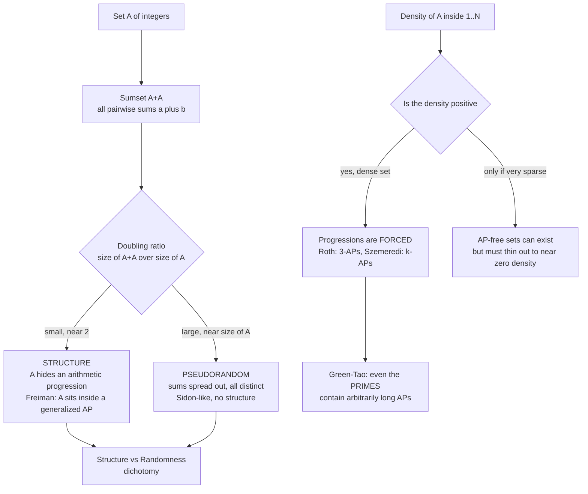

# ➕ Additive Combinatorics

> [!abstract] TL;DR
> Take a set of numbers and add every pair together. Does the result stay **small and tidy** — the way an arithmetic progression like $\{2,4,6,8\}$ barely grows when added to itself — or does it **blow up into chaos**? Additive combinatorics studies the arithmetic *structure* hidden in sets of integers: it proves that a **small sumset forces order** (Freiman's theorem: the set must look like an arithmetic progression) and that **density forces patterns** (Szemerédi's theorem: any positive-density set contains arbitrarily long progressions). Sitting at the crossroads of combinatorics and number theory, its tools cracked problems once thought impossible — most famously that the **primes contain arbitrarily long arithmetic progressions** (Green–Tao).

---

## Intuition

**Analogy:** Imagine a set of numbers on a ruler and a rule: add every pair together and mark all the sums. Start with an **arithmetic progression** $A = \{1,2,3,4,5\}$. Its sumset $A+A = \{2,3,\dots,10\}$ has just $9$ elements — only a hair more than the $5$ you started with. The sums *pile up* on top of each other because the gaps are all identical; the structure is so rigid that adding the set to itself barely enlarges it. Now take a **random-looking** set of five numbers like $\{1, 7, 12, 30, 71\}$. Almost every pairwise sum is different, so $A+A$ balloons to nearly $15$ distinct values — the maximum possible. The set has *spread out*; there is no pattern for the sums to collapse onto.

That single contrast is the beating heart of the field. A set of numbers is either **structured** (rigid, progression-like, small sumset) or **pseudorandom** (spread out, large sumset) — the **structure-versus-randomness dichotomy**. Additive combinatorics makes this precise in two directions: run it *backwards* (a small sumset must mean hidden arithmetic structure — Freiman) and run it *forwards* (enough numbers packed densely enough must contain arithmetic progressions, no matter how you arrange them — Roth, Szemerédi). It is combinatorics wearing the clothes of number theory, and its methods reach far enough to say something true about the prime numbers.

---

## How It Works

### Core Mechanics

1. **The sumset.** For sets of integers $A$ and $B$, the **sumset** is $A+B = \{a+b : a \in A,\ b \in B\}$. The self-sumset $A+A$ (write $2A$ for the *dilate* $\{2a\}$, which is different — a classic trap) is the central object. Its size is bounded: $|A+A|$ lies between $2|A|-1$ (minimum) and $\binom{|A|+1}{2}$ (maximum, all sums distinct).
2. **The doubling constant.** Define $K = |A+A| / |A|$. This single number *diagnoses* the set. $K \approx 2$ means minimal doubling — the extreme rigidity of an arithmetic progression. $K \approx |A|/2$ means maximal doubling — a **Sidon set**, where every pairwise sum is distinct, the signature of pseudorandomness.
3. **Small doubling ⇒ structure (Freiman's theorem).** If $|A+A| \le K|A|$, then $A$ is contained in a **generalized arithmetic progression** (a higher-dimensional grid $\{x_0 + \ell_1 x_1 + \dots + \ell_d x_d\}$) of bounded dimension $d(K)$ and size $\le C(K)\,|A|$. In plain terms: a set that refuses to grow *must* essentially be a progression. This is the inverse theorem — reasoning from the sumset back to the set.
4. **Density ⇒ patterns (Roth, Szemerédi).** Run it forwards. **Roth's theorem** (1953): any subset of $\{1,\dots,N\}$ with positive density contains a $3$-term arithmetic progression $\{x, x+d, x+2d\}$. **Szemerédi's theorem** (1975): positive density forces arithmetic progressions of *every* length $k$. Avoiding progressions entirely requires the set to be vanishingly sparse.
5. **The partition cousin (van der Waerden).** Colour $\{1,\dots,N\}$ with finitely many colours; for $N$ large enough one colour class contains a long progression. This is the Ramsey-flavoured ancestor of the density statements.
6. **The engines.** Two toolkits power the proofs: **Fourier analysis** (a set with no $3$-AP must have a large Fourier coefficient — a "density increment" — used in Roth's proof and generalized by **Gowers norms** for longer progressions) and the **Szemerédi regularity lemma** (any large graph decomposes into a bounded number of pieces that behave quasirandomly).

### Flow / Architecture



---

## Key Concepts

### Secondary (school level)
- **Sumset.** Add every pair of numbers in a set and collect the distinct results. A set of $5$ numbers has between $9$ and $15$ pairwise sums.
- **Arithmetic progressions barely grow.** $\{2,4,6,8,10\}$ added to itself gives only $\{4,6,\dots,20\}$ — nine values, almost no growth. Evenly spaced numbers are the *tidiest* possible.
- **Random sets explode.** Scattered numbers produce mostly-different sums, so the sumset nearly reaches its maximum size.
- **The big idea.** A set is either *structured* (a progression, small sumset) or *spread out* (random-like, big sumset). Structure and randomness are the two poles.

### Undergraduate
- **Doubling constant $K = |A+A|/|A|$.** Small $K$ (near $2$) signals structure; large $K$ (near $|A|/2$) signals a Sidon set. The whole theory is organised around this diagnostic.
- **Cauchy–Davenport inequality.** In $\mathbb{Z}/p\mathbb{Z}$ ($p$ prime), $|A+B| \ge \min(p,\ |A|+|B|-1)$ — sumsets in a prime field cannot be small unless they nearly fill the group. The prototype of a sumset lower bound.
- **Plünnecke–Ruzsa inequality.** Small doubling propagates: if $|A+A| \le K|A|$ then $|kA - \ell A| \le K^{k+\ell}|A|$ for all iterated sum/difference sets. One controlled step controls them all.
- **Roth's theorem.** Any $A \subseteq \{1,\dots,N\}$ with $|A| \ge \varepsilon N$ contains a $3$-term AP once $N$ is large. Proof idea: either $A$ is Fourier-uniform (behaves randomly and *has* the expected number of $3$-APs) or it has a large Fourier coefficient (correlates with a progression, giving a **density increment** on a sub-progression) — iterate.
- **Sidon sets.** Sets where all pairwise sums are distinct — the maximal-doubling extreme, of size about $\sqrt{N}$ inside $\{1,\dots,N\}$. The canonical "pseudorandom" additive object.
- **Van der Waerden's theorem.** The partition version: any finite colouring of the integers yields monochromatic progressions of any prescribed length.

### Graduate
- **Szemerédi's theorem.** Positive upper density $\Rightarrow$ arbitrarily long APs. A landmark with *four* independent proofs — Szemerédi's original combinatorial tour de force (which introduced the regularity lemma), Furstenberg's **ergodic-theoretic** proof (recurrence in dynamical systems), Gowers's **Fourier/higher-order** proof (which introduced Gowers uniformity norms and gave the first effective bounds), and hypergraph-regularity proofs.
- **Szemerédi regularity lemma.** Every large graph's vertex set partitions into a bounded number of parts that are pairwise $\varepsilon$-regular (edges behave quasirandomly between parts). A foundational structure-vs-randomness tool — though the bounds are tower-exponential (Gowers showed this is unavoidable).
- **Gowers norms $\|f\|_{U^k}$.** Higher-order Fourier analysis. The $U^2$ norm detects linear (single-frequency) structure; $U^k$ detects degree-$(k-1)$ polynomial structure needed to count $(k+1)$-term APs. The **inverse theorem for Gowers norms** (Green–Tao–Ziegler) says large $U^k$ norm implies correlation with a nilsequence — the deep engine behind quantitative Szemerédi.
- **Green–Tao theorem (2004).** The primes contain arbitrarily long arithmetic progressions. Not by proving the primes have positive density (they do not), but by a **transference principle**: the primes sit as a dense subset inside a pseudorandom "almost-primes" majorant, and a *relative* Szemerédi theorem applies.
- **Sum-product phenomenon (Erdős–Szemerédi).** A set cannot be structured for *both* addition and multiplication: $\max(|A+A|,\ |A\cdot A|) \ge |A|^{1+c}$. An AP has a tiny sumset but a huge product set; a geometric progression the reverse. Best known exponents (Rudnev, Shakan, and others) push $c$ toward $1/3$ and beyond over the reals.
- **Cauchy–Davenport's descendants.** The Freiman–Ruzsa framework, the polynomial method (Combinatorial Nullstellensatz), and Bohr sets (the "approximate subgroups" of $\mathbb{Z}/N\mathbb{Z}$) form the modern structural toolkit.
- **Modern frontier.** The **Kelley–Meka theorem (2023)** gave near-optimal bounds for $3$-AP-free sets: any $A \subseteq \{1,\dots,N\}$ avoiding $3$-APs has $|A| \le N \exp(-c(\log N)^{1/12})$ — a dramatic leap toward the conjectured behaviour and a signal that the Fourier-analytic program is still advancing.

---

## Python Demo

```python
# Additive combinatorics, made visible: sumsets and arithmetic progressions.
#   (a) SUMSET GROWTH -- an arithmetic progression has MINIMAL doubling
#       |A+A| = 2|A|-1, while random and geometric sets have near-MAXIMAL
#       doubling |A+A| ~ |A|(|A|+1)/2.  Structure keeps sumsets tiny.
#   (b) 3-AP DENSITY -- count 3-term arithmetic progressions in random subsets
#       of {1..N}.  Progressions become UNAVOIDABLE as density grows
#       (Roth / Szemeredi flavour): total avoidance needs a very sparse set.
import numpy as np
import matplotlib.pyplot as plt

rng = np.random.default_rng(42)


def sumset(A):
    """Distinct pairwise sums a+b (the sumset A+A)."""
    A = np.asarray(A, dtype=np.int64)
    return np.unique(np.add.outer(A, A).ravel())


def count_3aps(ind):
    """Number of non-trivial 3-term APs {x, mid, y} with x<mid<y inside a set.
    `ind` is a boolean indicator over {0,...,N-1}. Each 3-AP counted once."""
    idx = np.nonzero(ind)[0]
    i, j = np.triu_indices(len(idx), k=1)      # all endpoint pairs x < y
    s = idx[i] + idx[j]
    even = (s % 2 == 0)                         # midpoint integral <=> x+y even
    mids = s[even] // 2
    return int(np.count_nonzero(ind[mids]))     # midpoint also present?


# ---------- (a) sumset growth: structure keeps doubling minimal -------------
ns = np.arange(3, 22)
ap_dbl, geo_dbl, rnd_dbl = [], [], []
ap_size, geo_size, rnd_size = [], [], []
for n in ns:
    AP  = np.arange(n) * 3                       # arithmetic progression
    GEO = 2 ** np.arange(n)                       # geometric: powers of two (Sidon)
    RND = rng.choice(400 * n, size=n, replace=False)  # random, spread out
    ap_size.append(len(sumset(AP)));  ap_dbl.append(len(sumset(AP))  / n)
    geo_size.append(len(sumset(GEO))); geo_dbl.append(len(sumset(GEO)) / n)
    rnd_size.append(len(sumset(RND))); rnd_dbl.append(len(sumset(RND)) / n)

n0 = 16
print("Doubling constants |A+A|/|A| at |A| =", n0)
print(f"   arithmetic progression : {ap_dbl[list(ns).index(n0)]:.2f}   (minimal, ~2)")
print(f"   random set             : {rnd_dbl[list(ns).index(n0)]:.2f}   (near-maximal)")
print(f"   geometric (Sidon)      : {geo_dbl[list(ns).index(n0)]:.2f}   (maximal = (n+1)/2)")
print(f"   theoretical min = {(2*n0-1)/n0:.2f},  max = {(n0+1)/2:.2f}\n")

# ---------- (b) 3-AP density: progressions become unavoidable ---------------
N = 250
densities = np.linspace(0.02, 0.5, 13)
trials = 40
mean_counts = np.array([
    np.mean([count_3aps(rng.random(N) < p) for _ in range(trials)])
    for p in densities
])
# expected count = (number of 3-AP triples in {0..N-1}) * p^3
d = np.arange(1, (N - 1) // 2 + 1)
T = int(np.sum(N - 2 * d))                       # total 3-AP triples in the universe
expected = T * densities ** 3
print(f"Universe {{1..{N}}} contains {T} possible 3-APs.")
print(f"At density 0.02 -> ~{mean_counts[0]:.1f} 3-APs;  at density 0.50 -> ~{mean_counts[-1]:.0f} 3-APs.")
print("=> avoiding 3-APs entirely forces a VERY sparse set (Roth/Szemeredi).")

# ---------- plots -----------------------------------------------------------
fig, ax = plt.subplots(1, 3, figsize=(17, 5))

# Panel 0: doubling constants side by side at |A| = n0
labels = ["arithmetic\nprogression", "random\nset", "geometric\n(Sidon)"]
vals = [ap_dbl[list(ns).index(n0)], rnd_dbl[list(ns).index(n0)], geo_dbl[list(ns).index(n0)]]
colors = ["#059669", "#2563eb", "#dc2626"]
ax[0].bar(labels, vals, color=colors)
ax[0].axhline((2 * n0 - 1) / n0, ls="--", color="#059669", label="minimal doubling ~ 2")
ax[0].axhline((n0 + 1) / 2, ls="--", color="#dc2626", label="maximal doubling (n+1)/2")
ax[0].set_ylabel("doubling constant  |A+A| / |A|")
ax[0].set_title(f"Structure = small sumset\n(|A| = {n0})")
ax[0].legend(fontsize=8)

# Panel 1: |A+A| vs |A| -- AP linear, others quadratic
ax[1].plot(ns, ap_size,  "o-", color="#059669", label="AP:  |A+A| = 2|A|-1  (minimal)")
ax[1].plot(ns, rnd_size, "s-", color="#2563eb", label="random  (near-maximal)")
ax[1].plot(ns, geo_size, "^-", color="#dc2626", label="geometric/Sidon: |A|(|A|+1)/2")
ax[1].set_xlabel("|A|"); ax[1].set_ylabel("|A+A|")
ax[1].set_title("Sumset size: linear vs quadratic growth")
ax[1].legend(fontsize=8); ax[1].grid(alpha=0.3)

# Panel 2: 3-AP count vs density -- unavoidable as density grows
ax[2].plot(densities, mean_counts, "o-", color="#7c3aed", label="measured 3-AP count")
ax[2].plot(densities, expected, "--", color="#d97706", label="expected  T * density^3")
ax[2].set_xlabel("density of random subset of {1..N}")
ax[2].set_ylabel("number of 3-term APs")
ax[2].set_title("3-APs become unavoidable\nas density grows (Roth)")
ax[2].legend(fontsize=8); ax[2].grid(alpha=0.3)

plt.tight_layout()
plt.savefig("additive_combinatorics_demo.png", dpi=120)
plt.show()
```

Running it prints doubling constants near $2.0$ for the arithmetic progression but near $8.5$ for both the random and geometric sets at $|A|=16$ — the progression's sumset is *linear* in size while the others are *quadratic*, exactly the structure-versus-randomness split. The third panel shows the empirical $3$-AP count tracking the $T \cdot p^3$ curve: at density $0.02$ a random subset already carries a handful of progressions, and by density $0.5$ it is saturated with thousands. The visceral lesson of **Roth and Szemerédi** is that *total avoidance of progressions demands a set thinned almost to nothing* — density is destiny.

---

## Real-World Applications

> **Example:** **Explicit randomness extractors and expanders in theoretical computer science.** The sum-product phenomenon (a set cannot be simultaneously additively *and* multiplicatively structured) is the combinatorial core of the **Bourgain–Katz–Tao** estimates, which power explicit constructions of **randomness extractors** — algorithms that distil near-uniform bits from weak, biased sources — and of **expander graphs**. When you need provable pseudorandomness from a deterministic recipe rather than luck, additive combinatorics supplies the guarantee.

- **Property testing and the PCP theorem.** The Gowers norms formalise "how far is this function from linear/low-degree," which is precisely what linearity tests (the BLR test) and low-degree tests measure — the combinatorial spine of probabilistically checkable proofs and hardness-of-approximation results.
- **Number theory at scale.** The **Green–Tao theorem** on progressions of primes, progress on Goldbach- and Waring-type problems, and bounds on prime gaps all deploy sumset and transference machinery. See [[Mathematics/04_Discrete_Mathematics/Number_Theory_Elementary|Elementary Number Theory]].
- **Cryptography and pseudorandom generators.** The structure-vs-randomness dichotomy is exactly the distinguisher's dilemma: a generator's output must be *pseudorandom* (no exploitable additive structure) or an adversary detects the pattern. Sum-product bounds underpin some hash-function and extractor security arguments.
- **Coding theory and compressed sensing.** Sets with controlled sumsets and Sidon-set constructions yield error-correcting codes and sparse-recovery measurement matrices where distinct signals map to distinguishable sums.
- **Combinatorial number theory in data.** The regularity lemma justifies approximating a gigantic graph or dataset by a bounded number of quasirandom blocks — the theoretical license behind graph sampling and sketching.

---

## Common Pitfalls

- **Sumset vs. product set.** $A+A = \{a+b\}$ measures *additive* structure; $A\cdot A = \{ab\}$ measures *multiplicative* structure. The Erdős–Szemerédi sum-product theorem exists precisely because a set can be tidy for one and chaotic for the other — an arithmetic progression has a tiny sumset but an enormous product set, and vice versa for a geometric progression. Never conflate the two.
- **Sumset $A+A$ vs. dilate $2A$.** $A+A$ is the *set of pairwise sums*; $2A = \{2a : a\in A\}$ is the set doubled elementwise and always has $|2A| = |A|$. They are completely different objects, and $2A \subseteq A+A$ only in special cases. Mixing them silently breaks every doubling argument.
- **Misreading the doubling constant.** $K = |A+A|/|A|$ near $2$ means *structure* (progression-like); $K$ near $|A|/2$ means *randomness* (Sidon-like). The counterintuitive part: a *small* doubling constant signals *rigid order*, not disorder. Beginners often expect the opposite.
- **Density thresholds are asymptotic, not pointwise.** Roth and Szemerédi guarantee progressions once $N$ is *large enough* for a given density. A small dense set need not contain a long AP; the theorems are statements about the limit, and the required $N$ can be astronomically large (tower-exponential in Szemerédi's original proof).
- **Explicit AP-free sets are genuinely hard.** Behrend's construction gives $3$-AP-free subsets of size $N^{1 - o(1)}$ (surprisingly large!), but pinning the exact extremal density is a decades-old open problem only recently narrowed by Kelley–Meka. "Just avoid progressions greedily" produces far-from-optimal sets — do not assume the obvious construction is the best one.
- **Confusing the partition and density versions.** Van der Waerden (colour the integers, one colour class has a long AP) is *strictly weaker* than Szemerédi (the densest colour class alone must). Density implies partition, not the reverse.

---

## Related Concepts

- [[Combinatorics/01_Foundations_of_Counting/Combinatorics_Overview|Combinatorics Overview]] — situates additive combinatorics among enumeration, existence, and structure as the branch where counting meets the arithmetic of the integers.
- [[Mathematics/04_Discrete_Mathematics/Number_Theory_Elementary|Elementary Number Theory]] — the parent discipline: arithmetic progressions, primes, and modular structure ($\mathbb{Z}/p\mathbb{Z}$) are the raw material, and Green–Tao is a number-theoretic triumph.
- [[Mathematics/04_Discrete_Mathematics/Combinatorics|Combinatorics]] — the other parent; additive combinatorics is "arithmetic combinatorics," importing counting and extremal reasoning into the world of sums.
- [[Mathematics/04_Discrete_Mathematics/Graph_Theory|Graph Theory]] — the Szemerédi regularity lemma is a graph-theoretic statement, and many additive results (triangle removal, corners) are proved by translating sets into graphs.
- [[Signals_and_Systems/02_Fourier_Analysis/Fourier_Transform|Fourier Transform]] — the Fourier-analytic method drives Roth's theorem: a set with no $3$-AP must have a large Fourier coefficient, and Gowers norms are a higher-order generalisation of the same spectral idea.
- [[Combinatorics/01_Foundations_of_Counting/The_Pigeonhole_Principle|The Pigeonhole Principle]] — the density-increment engine behind Roth is pigeonhole in disguise: structure concentrated on a sub-progression must exceed the average somewhere.
- [[Combinatorics/02_Advanced_Counting/Generating_Functions|Generating Functions]] — sumsets are the *support* of a convolution of indicator generating functions; $|A+A|$ counts the nonzero coefficients of $(\sum_{a\in A} x^a)^2$.
- [[Information_Theory/06_Advanced_and_Applied_Information_Theory/Kolmogorov_Complexity_and_Algorithmic_Information|Kolmogorov Complexity]] — the sharpest formal face of "structure vs randomness": a structured set compresses (short description), a pseudorandom set does not, mirroring small-sumset vs Sidon-set behaviour.

*Siblings in this vault (prose references only):* additive combinatorics is the number-line twin of **Ramsey Theory** (van der Waerden and Schur are Ramsey statements about the integers), shares the "how large forces a pattern" instinct of **Extremal Combinatorics** (Turán-type thresholds), leans on **The Probabilistic Method** for pseudorandom majorants and Behrend-style constructions, and echoes the pattern-avoidance concerns of **Combinatorics on Words**.

---

## Review Questions

1. **(Secondary)** Take $A = \{1,3,5,7,9\}$ (an arithmetic progression) and $B = \{1,2,4,8,16\}$ (a geometric one). Compute both sumsets $A+A$ and $B+B$ and count their sizes. Which is smaller, and explain in words why the evenly spaced set produces so many *repeated* sums while the doubling set produces almost none.
2. **(Undergraduate)** Define the doubling constant $K = |A+A|/|A|$ and state its minimum and maximum possible values for a set of size $n$. Freiman's theorem says small $K$ forces $A$ to sit inside a generalized arithmetic progression. Given a set with $K = 2.1$, what would you *predict* about its structure, and how does this "inverse" reasoning differ from Roth's "forward" reasoning that density forces $3$-APs?
3. **(Graduate)** The primes have density zero in $\{1,\dots,N\}$, so Szemerédi's theorem does not apply to them directly. Explain the **transference principle** that lets Green and Tao nonetheless prove the primes contain arbitrarily long arithmetic progressions. What role does a pseudorandom "almost-primes" majorant play, and why is a *relative* Szemerédi theorem the crucial ingredient?

---

## Sources

- Terence Tao & Van Vu, *Additive Combinatorics* (Cambridge University Press, 2006) — the definitive graduate text; sumsets, Freiman, Plünnecke–Ruzsa, and Gowers norms.
- Ben Green, "Structure and Randomness in Combinatorial Number Theory" and related surveys — the clearest exposition of the structure-vs-randomness dichotomy.
- E. Szemerédi, "On sets of integers containing no $k$ elements in arithmetic progression," *Acta Arithmetica* 27 (1975) — the landmark density theorem.
- B. Green & T. Tao, "The primes contain arbitrarily long arithmetic progressions," *Annals of Mathematics* 167 (2008), 481–547.
- Z. Kelley & R. Meka, "Strong bounds for $3$-progressions" (2023) — the modern breakthrough on AP-free set density.

---

#combinatorics #additive-combinatorics #sumsets #arithmetic-progressions #structure-vs-randomness
