# 🔬 Analytic Combinatorics

> [!abstract] TL;DR
> **Analytic combinatorics** — the Flajolet–Sedgewick program — is a machine that turns a *description* of a combinatorial family into the *asymptotic growth rate* of its counting sequence, in two mechanical steps. First the **symbolic method** translates combinatorial constructions (sequence, set, cycle, union, product) directly into generating-function equations, with *no recurrences*. Then **singularity analysis** reads the coefficients' asymptotics straight off the complex plane: the **dominant singularity** — the point $\rho$ nearest the origin — fixes the exponential base $a_n \sim C\,\rho^{-n}$, and the *type* of that singularity (pole, square-root, log) fixes the polynomial correction $n^{\alpha}$. The fate of a counting sequence is written where its generating function first breaks.

---

## Intuition

**Analogy — the count's fate is written at the nearest singularity.** You have painstakingly counted something with a generating function, and the answer is a monstrous algebraic expression. You do not actually want that formula; you want a single practical fact: *when $n$ is large, roughly how big is the count?* Analytic combinatorics performs a stunning magic trick to answer this. It stops treating the generating function as a formal bookkeeping series and instead views it as a genuine **function of a complex variable** — a landscape over the complex plane. Somewhere on that landscape the function first *breaks*: it blows up to infinity (a pole), or develops a sharp square-root corner (a branch point), or a logarithmic crease. The **closest** such break to the origin, at distance $\rho$, is a beacon. Its **location** dictates the exponential growth rate — the count multiplies by roughly $1/\rho$ each step. Its **type** dictates the finer polynomial correction — a pole leaves a clean constant, a square-root leaves the universal $n^{-3/2}$ fingerprint of trees and paths.

The slogan is: *a function's coefficients grow at a rate governed by its nearest singularity.* You never expand the whole series. You locate one point in the complex plane, classify what happens there, and the entire tail of the counting sequence tumbles out. This is why the same $4^n/n^{3/2}$ growth appears for balanced parentheses, binary trees, and lattice paths — they all share a square-root singularity at $\rho = 1/4$. Intuition first: **counting is geography of the complex plane.**

---

## How It Works

### Core Mechanics

Analytic combinatorics is a two-stage pipeline — *symbolic* then *analytic* — and its power comes from each stage being almost entirely automatic.

1. **Specify the class.** Describe your combinatorial family $\mathcal{A}$ as a *construction* built from atoms using a small vocabulary: disjoint **union** $\mathcal{A}+\mathcal{B}$, Cartesian **product** $\mathcal{A}\times\mathcal{B}$, **sequence** $\mathrm{SEQ}(\mathcal{A})$ ("a list of any length"), **set** $\mathrm{SET}(\mathcal{A})$, **multiset** $\mathrm{MSET}$, and **cycle** $\mathrm{CYC}$. A binary tree, a permutation with marked cycles, a word avoiding a pattern — each is a short expression in this grammar.
2. **Translate mechanically (the symbolic method).** Each admissible construction has a *fixed* dictionary entry to an operation on generating functions. This is the heart of Flajolet–Sedgewick: you write the generating function *without ever setting up a recurrence*.

   | Construction | Unlabeled (OGF) | Labeled (EGF) |
   |---|---|---|
   | Union $\mathcal{A}+\mathcal{B}$ | $A(x)+B(x)$ | $A(x)+B(x)$ |
   | Product $\mathcal{A}\times\mathcal{B}$ | $A(x)\,B(x)$ | $A(x)\,B(x)$ |
   | Sequence $\mathrm{SEQ}(\mathcal{A})$ | $\dfrac{1}{1-A(x)}$ | $\dfrac{1}{1-A(x)}$ |
   | Set $\mathrm{SET}(\mathcal{A})$ | $\exp\!\big(\sum_{k\ge1}\tfrac{1}{k}A(x^k)\big)$ | $\exp\!\big(A(x)\big)$ |
   | Cycle $\mathrm{CYC}(\mathcal{A})$ | $\sum_{k\ge1}\tfrac{\phi(k)}{k}\log\tfrac{1}{1-A(x^k)}$ | $\log\dfrac{1}{1-A(x)}$ |

   Use **OGFs** $\sum a_n x^n$ for *unlabeled* structures and **EGFs** $\sum a_n \tfrac{x^n}{n!}$ for *labeled* ones — the labeled world is cleaner, where $\mathrm{SET}\to\exp$ and $\mathrm{CYC}\to\log$.
3. **Locate the dominant singularity.** Now read $A(x)$ as a complex-analytic function. Find $\rho$, the modulus of the singularity nearest the origin — equivalently the **radius of convergence** of the series. By Pringsheim's theorem, for a series with non-negative coefficients there is always a singularity *on the positive real axis* at $x=\rho$, so you only need to scan the positive reals.
4. **Classify the singularity type and transfer.** The **exponential growth rate** is $\rho^{-n}$ regardless of type — that is the *first principle of coefficient asymptotics*, $a_n \asymp \rho^{-n}$. The *subexponential* factor comes from **how** the function behaves as $x\to\rho$:
   - **Simple pole** (rational / meromorphic GF): $a_n \sim C\,\rho^{-n}$ — a pure constant, and the full sequence obeys a **linear recurrence** (denominator roots).
   - **Square-root branch** $\sqrt{1-x/\rho}$ (algebraic GFs — trees, paths): $a_n \sim C\,\rho^{-n} n^{-3/2}$.
   - **Logarithmic / general algebraic-log** $(1-x/\rho)^{-\alpha}\log^k$: $a_n \sim C\,\rho^{-n} n^{\alpha-1}(\log n)^k$.

   The **transfer theorems** of Flajolet & Odlyzko make this rigorous: if $A(x)$ behaves like $(1-x/\rho)^{-\alpha}$ near $\rho$, then $[x^n]A(x) \sim \dfrac{\rho^{-n}\,n^{\alpha-1}}{\Gamma(\alpha)}$. You transfer the *local* expansion at the singularity into a *global* statement about all coefficients.
5. **Handle the singularity-free case (saddle point).** If the GF is **entire** (no singularity — e.g. $e^x$, set partitions, involutions), the coefficients still grow, just factorially-fast. Here the **saddle-point method** estimates $a_n = \frac{1}{2\pi i}\oint A(x)\,x^{-n-1}\,dx$ by pushing the contour through the point where the integrand is stationary.

The master formula the whole subject orbits:
$$[x^n]\,A(x) \;\sim\; C \cdot \underbrace{\rho^{-n}}_{\text{location}} \cdot \underbrace{n^{\alpha-1}}_{\text{type}}.$$

### Flow / Architecture

```mermaid
graph LR
    C["Combinatorial class<br/>trees, words, paths, permutations<br/>with a size parameter n"]
    S["Symbolic method<br/>SEQ, SET, CYCLE, union, product<br/>translate MECHANICALLY"]
    G["Generating function<br/>OGF for unlabeled, EGF for labeled<br/>A of x = sum a_n x to the n"]
    P["View x as a COMPLEX variable<br/>find the DOMINANT singularity rho<br/>the point nearest the origin"]
    T["Classify the singularity TYPE<br/>pole, square-root branch, or log<br/>saddle point if the GF is entire"]
    R["Asymptotic coefficient growth<br/>a_n ~ C times rho to the minus n times n to the alpha<br/>location gives the base, type gives alpha"]
    C --> S --> G --> P --> T --> R
    R -.->|"analysis of algorithms"| D["Average-case cost of trees,<br/>paths and permutations<br/>links to DSA and Big-O"]
    style C fill:#2563eb,color:#fff
    style G fill:#059669,color:#fff
    style P fill:#7c3aed,color:#fff
    style T fill:#d97706,color:#fff
    style R fill:#dc2626,color:#fff
```



---

## Key Concepts

### Secondary — the big idea
- A **generating function** hangs a whole counting sequence on one power series. Analytic combinatorics asks a simpler question about it: *how fast do the numbers grow?*
- Growth has two pieces: an **exponential base** (the count roughly multiplies by a fixed factor each step, like $2^n$ or $4^n$) and a slower **polynomial correction** (like $\times n^{-3/2}$ or a constant).
- The magic: both pieces can be read off from *one special point* where the generating function misbehaves — you do not need the whole formula.
- Example to remember: balanced parentheses, binary trees, and Dyck paths all grow like $4^n/n^{3/2}$ — because they secretly share the same special point at $x=1/4$.

### Undergraduate — the machinery
- **The symbolic method.** Combinatorial constructions map *mechanically* to GF operations: union $\to$ sum, product $\to$ product, $\mathrm{SEQ}(\mathcal{A})\to\frac{1}{1-A}$, and (for labeled EGFs) $\mathrm{SET}\to\exp$, $\mathrm{CYC}\to\log$. You build the generating function directly from the specification.
- **Radius of convergence = dominant singularity.** For a non-negative counting sequence, the series $\sum a_n x^n$ converges up to $x=\rho$, where $\rho$ is the nearest singularity; **Pringsheim** guarantees one sits on the positive real axis.
- **First principle:** the exponential growth rate is *always* $\rho^{-n}$. Compute $\rho$, invert it, done — the base of the growth is settled before you even look at the singularity type.
- **Meromorphic asymptotics.** A **rational** GF $P(x)/Q(x)$ has poles at the roots of $Q$; the smallest-modulus root $\rho$ gives $a_n\sim C\rho^{-n}$ and the sequence satisfies a **linear recurrence** with characteristic polynomial $Q$. This is exactly the partial-fractions story of Fibonacci-type sequences, now read as "poles $\Rightarrow$ geometric growth."
- **Square-root singularities are the tree signature.** Any GF satisfying a quadratic like $y = 1 + xy^2$ (binary trees, Dyck paths) has a $\sqrt{1-x/\rho}$ singularity, forcing the universal $n^{-3/2}$ subexponential factor.

### Graduate — the theory
- **Transfer theorems (Flajolet–Odlyzko, 1990).** If $A(x)\sim (1-x/\rho)^{-\alpha}$ as $x\to\rho$ in a *Delta-domain* (a slit region around $\rho$ avoiding the singularity), then $[x^n]A(x)\sim \frac{\rho^{-n} n^{\alpha-1}}{\Gamma(\alpha)}$. The theorem *transfers* a local singular expansion into a coefficient asymptotic, with full big-$O$ error control — the rigorous backbone that replaces hand-waving Darboux/Tauberian arguments.
- **Singularity analysis catalog.** The exponent $\alpha$ dictates everything: $\alpha=1$ (simple pole) $\to$ constant; $\alpha=1/2$ ($\to$ $n^{-1/2}$); $\alpha=-1/2$ (square-root, $\to n^{-3/2}$); logarithmic factors $(1-x/\rho)^{-\alpha}(\log\frac{1}{1-x/\rho})^k$ contribute $(\log n)^k$. Algebraic GFs are handled by the **Newton–Puiseux** expansion at $\rho$.
- **The saddle-point method.** For **entire** functions and rapidly growing sequences (integer partitions $p_n$, set partitions / Bell numbers $B_n$, involutions), there is no singularity to exploit; instead evaluate Cauchy's integral $a_n=\frac{1}{2\pi i}\oint A(x)x^{-n-1}dx$ by steepest descent through the saddle where $\frac{d}{dx}[\log A(x)-(n+1)\log x]=0$. This yields, e.g., the Hardy–Ramanujan $p_n\sim\frac{1}{4n\sqrt3}e^{\pi\sqrt{2n/3}}$.
- **Limit laws & random structures.** Attach a *second* variable $u$ marking a statistic (number of parts, tree height, number of cycles) to get a **bivariate** GF $A(x,u)$. Perturbing the singularity in $u$ yields **limit laws** — most commonly a **Gaussian** (via the *quasi-powers theorem*, Hwang), sometimes Poisson or stable laws. Analytic combinatorics thus computes not just averages but full *distributions* of parameters of random combinatorial objects.
- **Multivariate & algebraic-differential frontiers.** Analytic combinatorics in several variables (ACSV, Pemantle–Wilson) handles GFs of several variables via complex geometry; D-finite and algebraic GFs (Chomsky–Schützenberger, context-free languages) fall under systematic singularity machinery.

---

## Python Demo

```python
# Singularity  ->  growth rate.
# We ILLUSTRATE the master theorem of coefficient asymptotics:
#       [x^n] f(x)  ~  C * rho^{-n} * n^{alpha}
# where rho is the distance to the DOMINANT (nearest) singularity of f, so the
# EXPONENTIAL growth rate is 1/rho, and the SUBEXPONENTIAL exponent alpha is set
# by the singularity TYPE:
#       simple pole        -> alpha = 0     (correction factor = constant)
#       square-root branch  -> alpha = -3/2  (universal tree / path signature)
#
# Case 1 (POLE):        f(x) = 1/(1-2x),  dominant singularity at rho = 1/2  -> 2^n
# Case 2 (SQUARE-ROOT): Catalan GF (1-sqrt(1-4x))/(2x),  rho = 1/4          -> 4^n / n^{3/2}

import numpy as np
import matplotlib.pyplot as plt

N = 60
n = np.arange(N)

# ---- Case 1: a POLE.  1/(1-2x) has a simple pole at rho = 1/2 ----
# The recurrence hidden in the denominator (1 - 2x) is a_n = 2 a_{n-1}.
pole = np.empty(N); pole[0] = 1.0
for k in range(1, N):
    pole[k] = 2.0 * pole[k-1]                       # == 2^n exactly
rho_pole = 0.5
growth_pole = 1.0 / rho_pole                        # = 2

# ---- Case 2: a SQUARE-ROOT branch point.  Catalan GF, singularity at rho = 1/4 ----
# The GF equation C = 1 + x*C^2 gives the convolution recurrence -> the coefficients.
cat = np.empty(N); cat[0] = 1.0
for k in range(N-1):
    cat[k+1] = sum(cat[i] * cat[k-i] for i in range(k+1))
rho_cat = 0.25
growth_cat = 1.0 / rho_cat                          # = 4

# ---- 1) LOCATION test: recover the growth rate 1/rho from consecutive ratios ----
ratio_pole = pole[-1] / pole[-2]
ratio_cat  = cat[-1]  / cat[-2]
print("Growth rate  1/rho :   pole ->", growth_pole, " recovered:", round(ratio_pole, 6))
print("Growth rate  1/rho :   Catalan ->", growth_cat, " recovered:", round(ratio_cat, 6))

# ---- 2) TYPE test: strip the exponential; what polynomial correction remains? ----
pole_norm = pole / growth_pole**n                   # POLE  -> should flatten to a CONSTANT
cat_norm  = cat  / growth_cat**n                    # SQRT  -> should decay like n^{-3/2}

# For the square-root case, multiply back n^{3/2}: it must converge to 1/sqrt(pi).
nn = np.arange(1, N)
cat_scaled = (cat[1:] / growth_cat**nn) * nn**1.5
print("Catalan  coeff/4^n * n^{3/2}  ->", round(cat_scaled[-1], 5),
      "  target 1/sqrt(pi) =", round(1/np.sqrt(np.pi), 5))

# ---- plots ----
fig, ax = plt.subplots(1, 3, figsize=(16, 4.6))

# Panel 1: log(coeff) vs n.  Slope of the line = log(growth rate) = -log(rho).
ax[0].semilogy(n, pole, "o-", ms=3, color="#2563eb", label="1/(1-2x): pole at 1/2")
ax[0].semilogy(n, cat,  "s-", ms=3, color="#dc2626", label="Catalan GF: sqrt-branch at 1/4")
ax[0].semilogy(n, growth_pole**n, "--", color="#2563eb", alpha=.4, label="reference 2^n")
ax[0].semilogy(n, growth_cat**n,  "--", color="#dc2626", alpha=.4, label="reference 4^n")
ax[0].set(title="log(coeff) vs n:\nslope = log(growth rate) = -log(rho)",
          xlabel="n", ylabel="coefficient (log scale)")
ax[0].legend(fontsize=8)

# Panel 2: coeff / growth^n  reveals the polynomial factor set by the TYPE.
ax[1].plot(n, pole_norm, "o-", ms=3, color="#2563eb", label="pole  ->  CONSTANT")
ax[1].plot(n, cat_norm,  "s-", ms=3, color="#dc2626", label="sqrt-branch  ->  decays ~ n^{-3/2}")
ax[1].set(title="coeff / growth^n:\nexponential stripped, TYPE remains",
          xlabel="n", ylabel="coeff / growth^n")
ax[1].legend(fontsize=8)

# Panel 3: confirm the exact n^{-3/2} law and its constant for the square-root case.
ax[2].plot(nn, cat_scaled, "s-", ms=3, color="#dc2626", label="Catalan: coeff/4^n * n^{3/2}")
ax[2].axhline(1/np.sqrt(np.pi), ls="--", color="black", label="limit 1/sqrt(pi)")
ax[2].set(title="Square-root singularity => n^{-3/2}\nnormalized value -> 1/sqrt(pi)",
          xlabel="n", ylabel="coeff / 4^n * n^{3/2}")
ax[2].set_ylim(0, 0.7)
ax[2].legend(fontsize=8)

plt.tight_layout()
plt.savefig("analytic_combinatorics.png", dpi=120)
print("Saved figure: analytic_combinatorics.png")
```

**Expected console output:**

```
Growth rate  1/rho :   pole -> 2.0  recovered: 2.0
Growth rate  1/rho :   Catalan -> 4.0  recovered: 3.79661   (-> 4 as n grows)
Catalan  coeff/4^n * n^{3/2}  -> 0.56163   target 1/sqrt(pi) = 0.56419
```

The demo makes the two-stage thesis physical. **Location:** the consecutive-coefficient ratio converges to $1/\rho$ — exactly $2$ for the pole at $\rho=1/2$, and climbing to $4$ for the branch point at $\rho=1/4$ (the Catalan ratio $\tfrac{2(2n+1)}{n+2}\to4$). **Type:** after dividing out the exponential, the *pole* case flattens to a constant (Panel 2, blue) while the *square-root* case decays, and rescaling by $n^{3/2}$ (Panel 3) pins the survivor to $1/\sqrt{\pi}$ — precisely the $C\,\rho^{-n}n^{-3/2}$ predicted by singularity analysis.

---

## Real-World Applications

> **Example — the analysis of algorithms.** Knuth's and Sedgewick–Flajolet's *analysis of algorithms* is analytic combinatorics applied to running-time counts. The average number of comparisons in **Quicksort**, the average path length in a random **binary search tree**, the expected depth of a **trie** or the size of a **hash table**'s longest chain — each is the coefficient of a generating function whose dominant singularity delivers the asymptotic cost. The $n^{-3/2}$-flavored constants that decorate BST analyses come straight from square-root singularities.

- **Random combinatorial structures.** Physicists and probabilists use singularity perturbation to derive **limit laws** (usually Gaussian) for parameters of huge random objects — the number of parts of a random integer partition, the number of connected components of a random mapping, the height of a random tree. This underpins the theory of random graphs and the Galton–Watson / random-tree models.
- **Bioinformatics & pattern statistics.** Counting DNA/RNA words that avoid or contain a motif reduces to a rational generating function (Guibas–Odlyzko correlation polynomials); the dominant pole gives the exponential rate at which valid sequences proliferate — feeding significance tests for motif occurrence.
- **Information theory & coding.** The number of binary strings avoiding a forbidden substring is a rational GF; its dominant pole is the **capacity** of the corresponding constrained channel (e.g. run-length-limited codes on magnetic and optical media).
- **Statistical mechanics.** Lattice-animal, polymer, and self-avoiding-walk enumerations are attacked by locating the dominant singularity of a (often only conjecturally algebraic) generating function; the singularity's location is the *connective constant* and its exponent a *critical exponent*.
- **Symbolic computation.** Computer-algebra systems (the `combstruct` and `gfun` packages that grew out of Flajolet's INRIA group) automate the whole pipeline: specification $\to$ GF $\to$ asymptotics, with no human recurrence-solving.

---

## Common Pitfalls

- **Not finding the *dominant* singularity.** Asymptotics are governed by the singularity of *smallest modulus*. A GF can have many singularities; picking a farther one gives the wrong (too-small) growth base. Always scan outward from the origin and stop at the **first** break — and remember Pringsheim: for non-negative coefficients one always sits on the positive real axis, so scan the positive reals.
- **Multiple singularities on the circle $|x|=\rho$.** When several singularities tie for nearest (periodic classes — e.g. GFs in $x^2$, bipartite structures), their contributions *interfere*, producing oscillating or period-dependent asymptotics. Ignoring the co-dominant ones yields a wrong or only-average estimate.
- **Reading only the location, not the type.** The location $\rho$ fixes the exponential base but says nothing about the polynomial factor. A *pole*, a *square-root* branch, and a *logarithmic* singularity at the *same* $\rho$ give constant, $n^{-3/2}$, and $(n\log^2 n)^{-1}$ corrections respectively. Meromorphic (rational) $\Rightarrow$ pure exponential; **algebraic** $\Rightarrow$ half-integer $n^{\alpha}$ powers; **logarithmic** $\Rightarrow$ $\log n$ factors. You must classify, not just locate.
- **Using singularity analysis on an *entire* function.** Fast-growing sequences (partitions, Bell numbers, involutions) come from GFs with **no singularity** — their radius of convergence is infinite, so "the nearest singularity" does not exist. Here singularity analysis is inapplicable; you must switch to the **saddle-point method** and evaluate Cauchy's integral by steepest descent.
- **Forgetting the OGF/EGF distinction.** Labeled structures (permutations, set partitions, labeled trees) require **EGFs**; using an OGF specification silently counts the wrong objects, and the singularity you then analyze belongs to the wrong function.
- **Trusting a local expansion without a transfer theorem.** "$A(x)\sim(1-x/\rho)^{-\alpha}$ near $\rho$, therefore $a_n\sim\dots$" is only valid inside a **Delta-domain** where the function is analytic apart from $\rho$. Applying the transfer without verifying analytic continuation (or with other singularities intruding) gives an unjustified — sometimes wrong — asymptotic.

---

## Related Concepts

- [[Generating_Functions_and_Recurrences]] — the discrete-math foundation: this note takes those OGFs/EGFs and reads their *asymptotics* off the complex plane rather than solving for exact coefficients.
- [[Laurent_Series_and_Singularities]] — the classification of poles, essential singularities, and branch points is *exactly* the "type" half of singularity analysis; a pole's Laurent principal part becomes the coefficient asymptotic.
- [[Residue_Theorem_and_Applications]] — Cauchy's coefficient formula $a_n=\frac{1}{2\pi i}\oint A(x)x^{-n-1}dx$ is a residue/contour integral; meromorphic asymptotics *are* residue sums, and the saddle-point method deforms this very contour.
- [[Complex_Numbers_and_Functions]] — the whole subject hinges on promoting the formal variable $x$ to a genuine complex variable and studying the function's analytic landscape.
- [[Sequences_and_Series]] — the radius of convergence of a power series *is* the modulus of the dominant singularity; asymptotics of coefficients is the analytic-calculus substrate underneath.
- [[Big_O_Notation]] — analytic combinatorics is the machine that *produces* the average-case big-$O$ (and the constants) for algorithm running times.
- [[Master_Theorem]] — both estimate growth of counting/cost sequences; the Master Theorem handles divide-and-conquer recurrences, while singularity analysis handles the far larger class expressible as generating functions.
- [[Mathematics/04_Discrete_Mathematics/Combinatorics|Combinatorics (Discrete Math)]] — the exact-counting groundwork (binomials, inclusion–exclusion) whose astronomically large answers analytic combinatorics turns into clean growth laws.

*Sibling notes in this section (referenced in prose; this section-opener links only Glob-verified files): Generating_Functions, Asymptotic_Enumeration, Catalan_Numbers, Integer_Partitions, and Random_Discrete_Structures.*

---

## Review Questions

1. **(Secondary)** A counting sequence's generating function first "breaks" (blows up) at $x=\tfrac13$ and nowhere closer to the origin. Roughly by what factor does the count multiply at each step as $n$ grows, and why does that single point tell you the exponential growth rate without expanding the whole series?
2. **(Undergraduate — scenario)** You have two generating functions with the *same* dominant singularity at $\rho=\tfrac14$: one is a rational function $P(x)/Q(x)$ with a simple pole there, the other is algebraic with a $\sqrt{1-4x}$ factor. Both give exponential growth $4^n$. How do their coefficient asymptotics differ, and which combinatorial families (trees/paths vs. linear-recurrence sequences) would you expect each to describe?
3. **(Graduate — trade-off)** The exponential generating function for **involutions** is $e^{x+x^2/2}$, which is *entire* (no singularity), whereas the OGF for **binary trees** has a square-root singularity at $x=\tfrac14$. Explain why singularity analysis succeeds for the second but fails for the first, which method you must use instead for involutions, and what feature of the integrand $A(x)x^{-n-1}$ that method exploits.

---

## Sources

- Philippe Flajolet & Robert Sedgewick, *Analytic Combinatorics* (Cambridge University Press, 2009; [free PDF](https://algo.inria.fr/flajolet/Publications/book.pdf)) — the definitive text; Part A the symbolic method, Part B singularity analysis and saddle point.
- Herbert S. Wilf, *generatingfunctionology* (3rd ed.; [free PDF](https://www2.math.upenn.edu/~wilf/DownldGF.html)) — the gentle on-ramp to generating functions and asymptotics from coefficients.
- Robert Sedgewick & Philippe Flajolet, *An Introduction to the Analysis of Algorithms* (2nd ed., Addison-Wesley, 2013) — analytic combinatorics aimed squarely at algorithm running-time analysis.
- Andrew M. Odlyzko, "Asymptotic Enumeration Methods," in *Handbook of Combinatorics* (Elsevier, 1995; [free PDF](https://www-users.cse.umn.edu/~odlyzko/doc/asymptotic.enum.pdf)) — the authoritative survey of singularity analysis, saddle point, and Tauberian methods.
- Philippe Flajolet & Andrew Odlyzko, "Singularity Analysis of Generating Functions," *SIAM J. Discrete Math.* 3(2), 1990 — the original transfer theorems.

---

#combinatorics #analytic-combinatorics #generating-functions #singularity-analysis #asymptotics
