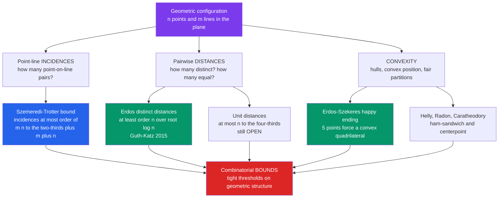

# 📐 Combinatorial Geometry

> [!abstract] TL;DR
> **Combinatorial (discrete) geometry** studies the *combinatorics of geometric configurations* — how finitely many points, lines, and convex shapes can be arranged, and what those arrangements **force** about incidences, distances, and convex position. Its landmark results are astonishingly deep for how simply they are posed: the **Szemerédi–Trotter theorem** caps how many point–line incidences a configuration can have; the **Erdős distinct-distances problem** (near-resolved by **Guth–Katz** in 2015) shows $n$ points must span at least $\sim n/\sqrt{\log n}$ different distances; and the **Erdős–Szekeres "Happy Ending" theorem** proves that any $5$ points in general position hide a convex quadrilateral. It is where counting meets space.

---

## Intuition

**Analogy — scatter dots on a page and start asking innocent questions.** Throw $n$ dots onto a sheet of paper. How many *distinct distances* between pairs of dots must appear — can you cleverly place them so almost every pair is the *same* distance apart, or are many different distances unavoidable? How many pairs can sit at *exactly* the same distance? If you draw straight lines through them, how many dots can a single line skewer, and how many "dot-on-line" coincidences can the whole picture contain? Can you always slice the cloud fairly in two with a single straight cut?

Every one of these questions sounds like a doodle a bored student might scribble — and yet the honest answers took the sharpest minds of the twentieth century *decades* to pin down. **Combinatorial geometry** is the discipline of those questions: it counts and bounds the discrete features (incidences, equal distances, convex sub-configurations, fair partitions) of geometric arrangements. Unlike classical geometry, which measures a single fixed shape, it asks *how the combinatorics scales* as the number of objects grows — and the answers connect grids, algebra, and even machine-learning theory. Erdős posed many of these problems in the 1930s–40s; several stayed open until this century.

---

## How It Works

### Core Mechanics

The subject runs on a repeatable recipe: **fix a class of geometric objects, choose a discrete quantity to count, then find matching upper and lower bounds on that count.**

1. **Choose the configuration.** Usually a finite set of $n$ **points** in the plane $\mathbb{R}^2$ (or $\mathbb{R}^d$), sometimes together with a set of $m$ **lines**, circles, or hyperplanes. The objects are the "atoms" of the problem.
2. **Choose the combinatorial quantity.** The classics are: **incidences** (how many point–line pairs $(p,\ell)$ with $p \in \ell$), **distinct distances** (how many different values in the multiset of pairwise distances), **unit distances** (how many pairs at distance exactly $1$), **convex position** (how many points form a convex polygon), and **partitions** (can a cut split the set fairly).
3. **Prove a lower bound by construction.** Exhibit *one* clever configuration — very often a **$\sqrt{n} \times \sqrt{n}$ integer grid** — that realizes many incidences, or few distinct distances. The grid is the recurring extremal example: it is *maximally structured*, so it maximizes coincidences and minimizes variety.
4. **Prove a matching upper bound.** Show *no* configuration can do better. The historic tools are the **crossing-number inequality** (which yields Szemerédi–Trotter in three lines) and, since 2010, the **polynomial method** — encode the points as zeros of a low-degree polynomial and let algebra constrain the geometry (this is how Guth–Katz cracked distinct distances and how Dvir settled the finite-field Kakeya problem).

The tension throughout is **structure versus randomness**: highly structured sets (grids, lattices) are extremal for coincidence-type quantities, while random sets are extremal for variety-type quantities. Most theorems are the precise statement of "you cannot beat the grid" or "you cannot beat random."

### Flow / Architecture



---

## Key Concepts

### Secondary Level
- **Convex hull and convex position** — stretch a rubber band around a cloud of nails; it clings to the outermost points. A set of points is **in convex position** when *every* point is a corner of that hull (no point is trapped inside). This is the geometric object the whole field is built on.
- **Distinct distances, felt directly** — scatter dots and measure every pairwise distance. A random splatter gives almost all *different* distances; a neat square grid reuses the same few distances over and over. The **grid minimizes variety** — a first taste of "structure kills diversity."
- **The Happy Ending problem** — Erdős and Szekeres proved that **any $5$ points in general position** (no three on a line) must contain $4$ that form a **convex quadrilateral**. Esther Klein posed it; George Szekeres solved it and married her — hence Erdős's nickname.
- **General position** — the standing assumption that no three points are collinear and no special coincidences occur, so counts are not distorted by lucky alignments.

### Undergraduate Level
- **Szemerédi–Trotter theorem (1983)** — the crown jewel of incidence geometry: $n$ points and $m$ lines in the plane have at most $O\!\big((mn)^{2/3} + m + n\big)$ incidences, and a $\sqrt{n}\times\sqrt{n}$ grid shows the bound is **tight**. It is proved cleanly from the **crossing-number inequality** of graph drawing.
- **Erdős distinct-distances & unit-distances problems** — among $n$ points, the *minimum* number of distinct distances is $\ge \Omega(n/\sqrt{\log n})$ (Guth–Katz, essentially matching the grid), while the *maximum* number of **unit distances** (pairs exactly $1$ apart) is somewhere between $n^{1+c/\log\log n}$ and $O(n^{4/3})$ — the upper side is a Szemerédi–Trotter corollary and the true answer is still **open**.
- **Erdős–Szekeres theorem** — the general Happy Ending: for every $n$ there is a finite $g(n)$ such that any $g(n)$ points in general position contain $n$ in convex position. The conjectured exact value $g(n)=2^{n-2}+1$ was verified asymptotically only recently.
- **The convexity trio — Helly, Radon, Carathéodory** — **Radon:** any $d+2$ points in $\mathbb{R}^d$ split into two sets whose convex hulls intersect. **Helly:** if every $d+1$ of a family of convex sets share a point, then *all* of them do. **Carathéodory:** any point in the convex hull of a set is already in the hull of at most $d+1$ of its points. Together they are the algebra of "how convex sets overlap."
- **Arrangements of lines** — $m$ lines carve the plane into $O(m^2)$ cells, edges, and vertices; the **zone theorem** bounds the complexity a single line can touch. Arrangements are the data structure computational geometry actually manipulates.

### Graduate Level
- **The polynomial method** — the modern revolution. **Guth–Katz (2015)** nearly resolved distinct distances using **polynomial partitioning** (divide space by the zero set of a well-chosen polynomial) and ideas from the **polynomial ham-sandwich theorem**; **Dvir (2008)** settled the **finite-field Kakeya conjecture** in a two-page algebraic argument. Algebra now routinely bounds geometry.
- **Ham-sandwich & centerpoint theorems** — the **ham-sandwich theorem** says $d$ finite point sets in $\mathbb{R}^d$ can be *simultaneously* bisected by a single hyperplane; the **centerpoint theorem** guarantees a point so central that every halfspace through it holds at least $\tfrac{n}{d+1}$ of the points. These power *fair-division* and *median* algorithms.
- **Epsilon-nets & VC dimension** — for a range space of bounded **VC dimension**, a random sample of size $O(\tfrac{d}{\varepsilon}\log\tfrac{1}{\varepsilon})$ is an **$\varepsilon$-net** hitting every "heavy" range. This is *literally* the same combinatorial dimension that governs **PAC learning** sample complexity — a direct bridge from discrete geometry to statistical learning theory.
- **Crossing numbers, $k$-sets, and cuttings** — the **crossing-number inequality** ($cr(G) \ge \Omega(e^3/n^2)$ for dense graphs) yields Szemerédi–Trotter; the **$k$-set problem** (how many ways a line can split off exactly $k$ points) and **cutting lemmas** (partition space so each cell meets few objects) are the still-active frontier.

---

## Python Demo

The cleanest window into the field is the **Erdős distinct-distances problem**. We place $n$ points two ways — as a perfect $\sqrt{n}\times\sqrt{n}$ **grid** and as a **random** splatter in the same box — and count how many *distinct* pairwise distances each produces. The grid, being maximally structured, reuses distances heavily and lands near Erdős's conjectured minimum $\sim n/\sqrt{\log n}$; the random cloud has essentially *all* $\binom{n}{2}$ pairwise distances different. A scaling sweep confirms the grid's distinct-distance count grows far more slowly, hugging the Erdős lower-bound shape.

```python
# Erdős distinct-distances problem, made visible.
# A sqrt(n) x sqrt(n) GRID minimizes the number of distinct pairwise distances
# (near n / sqrt(log n)); RANDOM points realize almost all C(n,2) of them.
import numpy as np
import matplotlib.pyplot as plt
from math import comb

rng = np.random.default_rng(42)

def distinct_distances(points, decimals=9):
    """Count DISTINCT pairwise (squared) distances among the points."""
    diff = points[:, None, :] - points[None, :, :]        # all displacement vectors
    d2 = np.sum(diff * diff, axis=-1)                      # squared distances
    iu = np.triu_indices(len(points), k=1)                # unordered pairs i < j
    return np.unique(np.round(d2[iu], decimals)).size

def grid_points(k):
    xs, ys = np.meshgrid(np.arange(k), np.arange(k))
    return np.column_stack([xs.ravel(), ys.ravel()]).astype(float)

# ---------- fixed-n comparison: grid vs random ----------
k = 15
n = k * k                                                  # 225 points
G = grid_points(k)
R = rng.random((n, 2)) * (k - 1)                           # same bounding box
dG, dR = distinct_distances(G), distinct_distances(R)
print(f"n = {n} points   (C(n,2) = {comb(n, 2)} pairs)")
print(f"  grid   distinct distances: {dG}")
print(f"  random distinct distances: {dR}")

# ---------- scaling sweep: distinct distances vs n ----------
ks = np.arange(3, 21)
n_vals, grid_counts, rand_counts = [], [], []
for kk in ks:
    nn = kk * kk
    n_vals.append(nn)
    grid_counts.append(distinct_distances(grid_points(kk)))
    rand_counts.append(np.mean([distinct_distances(rng.random((nn, 2)) * (kk - 1))
                                for _ in range(3)]))
n_vals = np.array(n_vals, float)
grid_counts = np.array(grid_counts, float)
rand_counts = np.array(rand_counts, float)

ref = n_vals / np.sqrt(np.log(n_vals))                     # Erdős lower-bound SHAPE
ref *= grid_counts[-1] / ref[-1]                           # scaled to align with grid
allpairs = n_vals * (n_vals - 1) / 2                        # C(n,2)

# ---------- plot ----------
fig, ax = plt.subplots(1, 3, figsize=(16, 5))

ax[0].scatter(G[:, 0], G[:, 1], s=25, color="#7c3aed")
ax[0].set_title(f"{k}x{k} GRID\n{dG} distinct distances (MINIMIZES variety)")
ax[0].set_aspect("equal"); ax[0].grid(alpha=0.3)

ax[1].scatter(R[:, 0], R[:, 1], s=25, color="#dc2626")
ax[1].set_title(f"{n} RANDOM points\n{dR} distinct distances (nearly all pairs differ)")
ax[1].set_aspect("equal"); ax[1].grid(alpha=0.3)

ax[2].loglog(n_vals, allpairs, ":", color="gray", label="C(n,2)  all pairs distinct")
ax[2].loglog(n_vals, rand_counts, "o-", color="#dc2626", label="random points")
ax[2].loglog(n_vals, grid_counts, "s-", color="#7c3aed", label="grid points")
ax[2].loglog(n_vals, ref, "--", color="#059669", label="Erdos shape  n / root(log n)")
ax[2].set_xlabel("n points"); ax[2].set_ylabel("distinct distances")
ax[2].set_title("Grids MINIMIZE distinct distances")
ax[2].legend(); ax[2].grid(alpha=0.3, which="both")

plt.tight_layout()
plt.savefig("combinatorial_geometry_distinct_distances.png", dpi=120)
plt.show()
```

**What you see:** the left panel is the structured grid, whose handful of distinct distances (purple squares in panel three) grows slowly and tracks the green $n/\sqrt{\log n}$ curve — exactly the Erdős lower bound the grid is conjectured to achieve. The middle panel is the random cloud, whose distinct-distance count (red) sits essentially on the gray $\binom{n}{2}$ ceiling: almost every pair is a different distance. The log-log sweep makes the gap unmistakable — *the same number of points can span wildly different amounts of distance-variety depending purely on how you arrange them.* That gap, and proving the grid cannot be beaten, is the entire distinct-distances problem.

---

## Real-World Applications

> **Example — collision detection in physics engines and games.** Real-time engines wrap moving objects in **convex hulls** and test overlap with algorithms (GJK, separating-axis) whose correctness rests on **Carathéodory's** and the separating-hyperplane theorems from convex combinatorial geometry. Broad-phase culling then uses **arrangements** and spatial partitions to avoid checking every pair — the combinatorial complexity of those arrangements is exactly what discrete geometry bounds.

- **Computational geometry & GIS** — convex hulls, range searching, Voronoi/Delaunay structures, and line-arrangement queries are the workhorses of mapping, CAD, and spatial databases; their running times are governed by the incidence and cell-complexity bounds proved here.
- **Machine-learning generalization** — **VC dimension** and **$\varepsilon$-nets** originated as combinatorial-geometry tools and became the backbone of **PAC learning**: a hypothesis class of low VC dimension needs few samples to generalize, and $\varepsilon$-net theorems quantify exactly how few.
- **Sensor networks & wireless coverage** — modeling coverage as **unit-disk graphs** and choosing minimal "guarding" sets are $\varepsilon$-net and Helly-type problems; centerpoint theorems inform robust aggregation.
- **Robotics & motion planning** — a robot's free space is an **arrangement** of geometric constraints; planning a path is navigating the cells of that arrangement, whose count discrete geometry bounds.
- **Fair division & data summarization** — the **ham-sandwich** and **centerpoint** theorems underpin balanced partitioning, coresets, and median-of-medians style guarantees in large-scale data processing.

---

## Common Pitfalls

- **Dropping the general-position assumption.** Most theorems silently assume *no three points collinear* and *no ties among distances*. A single degeneracy — three grid points on a line, or four cocircular points — can break an incidence count, create phantom convex polygons, or make a "distinct" distance secretly repeat. Always state and enforce general position (or handle degeneracies explicitly with symbolic perturbation).
- **Confusing worst-case bounds with typical behavior.** Szemerédi–Trotter is a *worst-case* ceiling realized by a contrived grid; a random configuration has far fewer incidences. Likewise the grid is *extremal* for distinct distances, not representative. Reasoning "random ≈ extremal" is wrong in both directions — structure and randomness optimize *opposite* quantities.
- **Assuming planar results carry to higher dimensions.** Szemerédi–Trotter is a *planar* theorem; incidence bounds in $\mathbb{R}^3$ (Guth–Katz) look completely different. **Helly's number** is $d+1$, **Radon's** is $d+2$, and $\varepsilon$-net sizes scale with the **VC dimension** — every one of these is dimension-dependent. Copying a 2D constant into $\mathbb{R}^d$ silently corrupts the bound.
- **Floating-point distance collisions.** Counting "distinct distances" naively with floats can either merge distances that differ (too-coarse rounding) or split equal grid distances that should coincide (round-off). Prefer *exact integer squared distances* on lattices, and round consistently otherwise — the demo squares and rounds deliberately.
- **Reading asymptotic problems as solved.** The **unit-distances** problem and the exact **Erdős–Szekeres** value remain *open*; "distinct distances" is only *near*-resolved (a $\sqrt{\log n}$ gap persists). Quoting the grid's behavior as a proven exact answer overstates what is known.

*These convexity, incidence, and partition tools are the geometric cousins of ideas developed in the sibling notes on **Extremal Combinatorics** (thresholds forcing a substructure), **Ramsey Theory** (order forced by sheer size — the Happy Ending theorem is a Ramsey-type result), **The Probabilistic Method** (random point sets as extremal lower-bound constructions), and **Additive Combinatorics** (the finite-field Kakeya and sum-set analogues that share the polynomial method).*

---

## Related Concepts

- [[Combinatorics/01_Foundations_of_Counting/Combinatorics_Overview|Combinatorics Overview]] — places combinatorial geometry as the "combinatorics of space," a peer of enumerative, extremal, and probabilistic combinatorics.
- [[Combinatorics/01_Foundations_of_Counting/The_Pigeonhole_Principle|The Pigeonhole Principle]] — the humblest forcing tool behind many geometric arguments (e.g. among enough points two must fall in the same cell, forcing a close pair or a repeated distance).
- [[Mathematics/04_Discrete_Mathematics/Combinatorics|Combinatorics (Discrete Mathematics)]] — the seed note whose counting machinery (binomial coefficients, double counting) supplies the bookkeeping for incidence and convex-position counts.
- [[Mathematics/04_Discrete_Mathematics/Graph_Theory|Graph Theory]] — the crossing-number inequality that proves Szemerédi–Trotter is a graph-drawing result; incidences are naturally modeled as bipartite point–line graphs.
- [[DSA/15_Computational_Geometry/Convex_Hull|Convex Hull]] — the algorithmic realization of convex position; hulls, and the orientation test behind them, are the computational core of this theory.
- [[DSA/15_Computational_Geometry/Line_and_Polygon_Algorithms|Line and Polygon Algorithms]] — segment intersection, sweep lines, and polygon tests are how line arrangements are actually built and queried.
- [[DSA/15_Computational_Geometry/Geometry_Fundamentals|Geometry Fundamentals]] — the orientation/cross-product primitives that every incidence and convexity predicate reduces to.
- [[Computer_Graphics/06_Animation_and_Simulation/Rigid_Body_Physics|Rigid Body Physics]] — collision detection wraps bodies in convex hulls and separates them with hyperplanes, applying Carathéodory/separation results in real time.
- [[AI-ML/01_Classical_ML/Supervised/SVM|Support Vector Machines]] — margin-maximizing classifiers whose statistical foundation is VC dimension, the very combinatorial dimension that governs $\varepsilon$-nets in discrete geometry.

---

## Review Questions

1. **(Secondary)** Place $9$ points as a $3\times 3$ grid and, separately, as $9$ random dots. Without computing exactly, explain *why* the grid will have far fewer distinct pairwise distances than the random set. What everyday principle ("structure reduces variety") does this illustrate, and why does the grid reuse distances so heavily?
2. **(Undergraduate)** State the Szemerédi–Trotter theorem. For $n$ points and $n$ lines, what does it give as the maximum number of incidences, and why is a $\sqrt{n}\times\sqrt{n}$ grid (with a suitable family of lines) the configuration that shows the bound is tight? Contrast this worst case with the incidence count you would expect from *random* points and lines.
3. **(Graduate)** The Guth–Katz theorem lower-bounds distinct distances by $\Omega(n/\log n)$ using the *polynomial method* (polynomial partitioning plus a polynomial ham-sandwich cut). Sketch, at a high level, why encoding a point set as the zero set of a low-degree polynomial constrains its geometric behavior, and connect this to how Dvir's algebraic argument resolved the finite-field Kakeya problem. Separately, explain the bridge from $\varepsilon$-nets and VC dimension to PAC-learning sample complexity — why is the *same* combinatorial dimension controlling both?

---

## Sources

- [Matoušek, J. — *Lectures on Discrete Geometry* (Springer GTM 212)](https://link.springer.com/book/10.1007/978-1-4613-0039-7)
- [Pach, J. & Agarwal, P. K. — *Combinatorial Geometry* (Wiley-Interscience)](https://onlinelibrary.wiley.com/doi/book/10.1002/9781118033203)
- [Brass, P., Moser, W. & Pach, J. — *Research Problems in Discrete Geometry* (Springer)](https://link.springer.com/book/10.1007/0-387-29929-7)
- [Guth, L. & Katz, N. H. — *On the Erdős distinct distances problem in the plane* (Annals of Math., 2015; arXiv:1011.4105)](https://arxiv.org/abs/1011.4105)
- [Dvir, Z. — *On the size of Kakeya sets in finite fields* (J. AMS, 2009; arXiv:0803.2336)](https://arxiv.org/abs/0803.2336)

---

#combinatorics #combinatorial-geometry #discrete-geometry #incidences #erdos-problems
