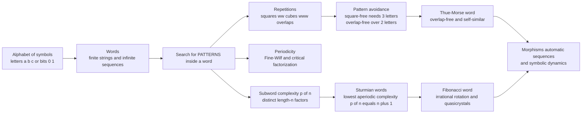

# 🔤 Combinatorics on Words

> [!abstract] TL;DR
> **Combinatorics on words is the mathematics of the hidden patterns, repetitions, and structure inside strings of symbols.** Its founding shock: you *can* write an infinitely long sequence over just three letters that never repeats *any* block twice in a row — no `aa`, no `abab`, no repetition anywhere. Axel Thue proved this "square-free" word exists a century ago, and the field it launched now underpins text-search algorithms, DNA analysis, data compression, quasicrystals, and symbolic dynamics.

---

## Intuition

**Analogy — the impossible non-repeating song.** Imagine you must sing an *endless* melody, but with one brutal rule: **you may never sing the same phrase twice in a row.** Not two identical notes back-to-back (`aa`), not a repeated two-note phrase (`abab`), not a repeated ten-note phrase — *no* immediately-repeated block, however long, anywhere in the infinite song. With only two notes this is hopeless; sooner or later you are cornered into a repeat. But add a *third* note and — astonishingly — you can sing forever. Thue built exactly such a **square-free** word over three letters in 1906. It sounds impossible, yet the structure is real, explicit, and unending.

That single counter-intuitive fact is the seed of the whole field. **Combinatorics on words** treats a string — a finite word or an infinite sequence over a fixed alphabet — as a mathematical object in its own right, and asks: *what patterns must appear, which can be avoided, how much variety can a sequence contain, and what deep order hides inside apparently simple strings?* The answers turn out to be the mathematics under text algorithms, bioinformatics, compression, music analysis, and the atomic geometry of quasicrystals.

---

## How It Works

### Core Mechanics

1. **The raw material.** Fix a finite **alphabet** $A$ (letters like $\{a,b,c\}$ or bits $\{0,1\}$). A **word** is a string over $A$ — either **finite** (length $n$) or an **infinite** sequence $w = w_0 w_1 w_2 \dots$. A **factor** (or **subword**) is a *contiguous* block $w_i w_{i+1}\dots w_j$. This is the key distinction from a **subsequence**, which may skip positions.
2. **Repetitions.** A **square** is a factor of the form $uu$ (like `abab`); a **cube** is $uuu$; an **overlap** is a factor $axaxa$ with $a$ a single letter — equivalently a factor of length $2p+1$ and period $p$, a repetition of exponent just above $2$. These are the "repetitions" the field hunts for or forbids.
3. **Pattern avoidance — Thue's theorems.** Thue proved two landmark facts: **overlap-free** infinite words exist over a **2-letter** alphabet (the Thue-Morse word), and **square-free** infinite words exist over a **3-letter** alphabet. Crucially, *binary square-free words do not exist* — every binary word of length $\ge 4$ contains a square. Avoidance has an alphabet-size price.
4. **The Thue-Morse word.** Define $t_n$ = parity of the number of $1$-bits in $n$: $\;0110100110010110\dots$ It is the fixed point of the **morphism** $0\mapsto 01,\; 1\mapsto 10$, it is **overlap-free** (hence cube-free), and it is profoundly **self-similar**. It reappears across number theory, chess (the sequence that forces drawn games), fair division, and physics.
5. **Periodicity.** A word has **period** $p$ if $w_i = w_{i+p}$ everywhere defined; the smallest such $p$ is the **primitive period**. The **Fine-Wilf theorem** says a word of length $\ge p+q-\gcd(p,q)$ that has *both* periods $p$ and $q$ must also have period $\gcd(p,q)$ — two coinciding rhythms fuse into a finer one. The **critical factorization theorem** links a word's global period to a local repetition at one clever cut point.
6. **Subword (factor) complexity.** $p(n)$ = the number of *distinct* factors of length $n$. This one function measures a sequence's richness: $w$ is **eventually periodic $\iff$ $p(n)$ is bounded** (Morse-Hedlund). The lowest complexity an *aperiodic* word can have is $p(n)=n+1$ — these are the **Sturmian words**.
7. **Sturmian words and the Fibonacci word.** The **Fibonacci word** (fixed point of $a\mapsto ab,\; b\mapsto a$) is Sturmian: $p(n)=n+1$, the minimum for a non-periodic sequence. Sturmian words are exactly the **cutting sequences of a line of irrational slope** across a grid — the symbolic shadow of an **irrational rotation**, tied to **continued fractions** and to the one-dimensional geometry of **quasicrystals**.
8. **Morphisms and automatic sequences.** Words generated by iterating a substitution (a **morphism**) include the Thue-Morse and Fibonacci words. When the morphism is uniform of length $k$, the fixed point is **$k$-automatic** — its $n$-th symbol is computable by a finite automaton reading the base-$k$ digits of $n$, tying the field directly to automata theory.

### Flow / Architecture



---

## Key Concepts

### Secondary (school level)
- **Word, alphabet, factor.** A word is a string of symbols; a factor is a *contiguous* chunk of it. `bcd` is a factor of `abcde`; `ace` is only a subsequence.
- **A square is a doubled block.** `abab` (which is `ab` twice) is a square; `abcacb` has no doubled block.
- **The three-letter miracle.** Over two letters you cannot avoid squares forever, but over three letters you can build an endless word with no doubled block anywhere — Thue's result.

### Undergraduate
- **Overlap-free vs square-free vs cube-free.** An **overlap** is a factor of length $2p+1$ with period $p$ (exponent $>2$). Overlap-free $\Rightarrow$ cube-free, and cube-free $\Rightarrow$... nothing about squares. Thue-Morse is **overlap-free but not square-free** (it contains `00`, `11`, `0101`).
- **Subword complexity $p(n)$ and the Morse-Hedlund theorem.** $p(n)$ counts distinct length-$n$ factors. A sequence is **eventually periodic iff $p(n)$ is bounded iff $p(n) \le n$ for some $n$**. So unbounded-but-minimal complexity, $p(n)=n+1$, is the sharp threshold of aperiodicity.
- **Sturmian words = $p(n)=n+1$.** The **Fibonacci word** is the canonical example; Sturmian words are the balanced binary sequences arising as cutting sequences of irrational-slope lines.
- **Morphisms.** A morphism sends letters to words and extends by concatenation. Iterating a **prolongable** morphism yields an infinite **fixed point** (Thue-Morse, Fibonacci).
- **Fine-Wilf theorem.** Two periods $p, q$ on a long-enough word force the period $\gcd(p,q)$ — the pigeon-hole of rhythms.

### Graduate
- **Critical factorization theorem.** Every word has a factorization point where the *local* period equals the *global* primitive period — a bridge between local repetition and global structure, and a tool behind fast string matching.
- **Automatic sequences and Cobham's theorem.** Fixed points of uniform morphisms are $k$-automatic; **Cobham's theorem** says a sequence automatic in two multiplicatively independent bases is eventually periodic — a rigidity result linking words to number theory and logic.
- **Symbolic dynamics.** Infinite words are **orbits** of a shift map; the closure of the orbit is a **subshift**, and $p(n)$ is exactly the exponential growth data of its **topological entropy**. Sturmian subshifts are the minimal, zero-entropy, aperiodic systems — coding **irrational rotations** of the circle.
- **Repetition thresholds and Dejean's theorem.** For each alphabet size $k$ there is a sharp **repetition threshold** — the least exponent avoidable over $k$ letters — conjectured by Dejean and fully proved only around 2009.
- **Burrows-Wheeler transform.** The BWT reversibly permutes a word by sorting its rotations, clustering equal symbols; it is the combinatorial engine inside `bzip2` and the FM-index that powers modern DNA aligners.

---

## Python Demo

```python
# Combinatorics on words: pattern-hunting in the two most famous infinite words.
#   (a) Build the THUE-MORSE word and VERIFY it is overlap-free (hence cube-free),
#       while showing it still contains SQUARES (it is not square-free).
#   (b) Build the FIBONACCI word and compute its SUBWORD COMPLEXITY p(n),
#       confirming p(n) = n + 1 (Sturmian: the minimal complexity of any
#       aperiodic word) and contrasting it with Thue-Morse and a random word.
import numpy as np
import matplotlib.pyplot as plt

# ---------------------------------------------------------------------------
# (a) THUE-MORSE via bit-parity, cross-checked against the morphism 0->01,1->10
# ---------------------------------------------------------------------------
def thue_morse_parity(N):
    """t_n = parity of the number of 1-bits in n."""
    n = np.arange(N, dtype=np.uint64)
    bits = np.zeros(N, dtype=np.uint64)
    while n.any():
        bits += n & 1
        n >>= 1
    return (bits & 1).astype(np.int8)

def thue_morse_morphism(min_len):
    """Fixed point of the substitution 0 -> 01, 1 -> 10."""
    s = "0"
    while len(s) < min_len:
        s = "".join("01" if c == "0" else "10" for c in s)
    return s

TM = "".join(str(b) for b in thue_morse_parity(1 << 13))   # 8192 symbols
assert TM[:64] == thue_morse_morphism(64)[:64]             # two definitions agree
print("Thue-Morse prefix :", TM[:32], "...")

# ---- Repetition detection via periods -------------------------------------
# A factor of length L has period p  <=>  s[i : i+L-p] == s[i+p : i+L].
#   square  : L = 2p     (uu)
#   cube    : L = 3p     (uuu)
#   overlap : L = 2p+1   (a x a x a)  -- repetition of exponent just above 2
def find_factor_with_period(s, L, p, limit):
    for i in range(0, limit - L + 1):
        if s[i:i + L - p] == s[i + p:i + L]:
            return i
    return -1

def first_square(s, limit):
    for p in range(1, limit // 2):
        i = find_factor_with_period(s, 2 * p, p, limit)
        if i >= 0:
            return s[i:i + 2 * p]
    return None

def first_overlap(s, limit):
    for p in range(1, (limit - 1) // 2):
        i = find_factor_with_period(s, 2 * p + 1, p, limit)
        if i >= 0:
            return s[i:i + 2 * p + 1]
    return None

CHECK = 600  # scan a long finite prefix (the property is about the infinite word)
sq  = first_square(TM, CHECK)
ov  = first_overlap(TM, CHECK)
print(f"Thue-Morse contains a SQUARE   : {sq!r}  -> NOT square-free")
print(f"Thue-Morse contains an OVERLAP : {ov}   -> overlap-free (hence cube-free)")

# ---------------------------------------------------------------------------
# (b) FIBONACCI word and SUBWORD COMPLEXITY p(n)
# ---------------------------------------------------------------------------
def fibonacci_word(min_len):
    """Fixed point of the substitution a -> ab, b -> a  (encoded as 0/1)."""
    s = "0"                                   # a=0, b=1
    while len(s) < min_len:
        s = "".join("01" if c == "0" else "0" for c in s)
    return s

FIB = fibonacci_word(6000)
print("Fibonacci prefix  :", FIB[:32], "...")

def subword_complexity(s, nmax):
    """p(n) = number of distinct length-n factors, for n = 1..nmax."""
    return np.array([len({s[i:i + n] for i in range(len(s) - n + 1)})
                     for n in range(1, nmax + 1)])

rng  = np.random.default_rng(0)
RAND = "".join(rng.integers(0, 2, size=len(TM)).astype(str))

NMAX = 20
ns   = np.arange(1, NMAX + 1)
p_tm  = subword_complexity(TM,   NMAX)
p_fib = subword_complexity(FIB,  NMAX)
p_rnd = subword_complexity(RAND, NMAX)

print("\n n :  p_Fib   n+1   p_ThueMorse   p_Random")
for n, a, b, c in zip(ns, p_fib, p_tm, p_rnd):
    print(f"{n:2d} : {a:5d}  {n+1:4d}   {b:8d}   {c:9d}")
assert np.array_equal(p_fib, ns + 1), "Fibonacci word must be Sturmian: p(n)=n+1"
print("\nVerified: Fibonacci word is Sturmian  ->  p(n) = n + 1 for all n.")

# ---------------------------------------------------------------------------
# Visualisation: the three sequences + their subword-complexity curves
# ---------------------------------------------------------------------------
def strip(ax, s, title, cmap):
    row = np.array([int(c) for c in s[:128]]).reshape(1, -1)
    ax.imshow(row, aspect="auto", cmap=cmap, interpolation="nearest")
    ax.set_title(title, fontsize=10, loc="left")
    ax.set_yticks([]); ax.set_xticks([0, 64, 127])

fig = plt.figure(figsize=(12, 7))
gs  = fig.add_gridspec(3, 2, width_ratios=[1.15, 1.0], hspace=0.55, wspace=0.25)
strip(fig.add_subplot(gs[0, 0]), TM,   "Thue-Morse  (first 128 symbols)", "binary")
strip(fig.add_subplot(gs[1, 0]), FIB,  "Fibonacci   (first 128 symbols)", "cividis")
strip(fig.add_subplot(gs[2, 0]), RAND, "Random      (first 128 symbols)", "magma")

axC = fig.add_subplot(gs[:, 1])
axC.semilogy(ns, p_rnd, "o-",  color="crimson",  label="Random  ~ 2^n (then saturates)")
axC.semilogy(ns, p_tm,  "s-",  color="teal",     label="Thue-Morse  (linear, ~ 3n-4n)")
axC.semilogy(ns, p_fib, "^-",  color="navy",     label="Fibonacci  p(n) = n+1")
axC.semilogy(ns, ns + 1, "--", color="gray",     label="theory  n + 1")
axC.set_xlabel("factor length n"); axC.set_ylabel("subword complexity p(n)  [log]")
axC.set_title("Subword complexity: aperiodic order vs randomness", fontsize=11)
axC.grid(True, which="both", alpha=0.3); axC.legend(fontsize=8, loc="lower right")

fig.suptitle("Combinatorics on Words: Thue-Morse, Fibonacci (Sturmian), and Random",
             fontsize=13, weight="bold")
fig.savefig("combinatorics_on_words.png", dpi=130, bbox_inches="tight")
print("\nSaved figure -> combinatorics_on_words.png")
```

**What the output shows.** The Thue-Morse checker finds a square (e.g. `00`) yet *no* overlap in a 600-symbol prefix — it is overlap-free but not square-free, exactly Thue's theorem. The complexity table confirms $p(n)=n+1$ for the Fibonacci word (Sturmian, minimal aperiodic complexity), while Thue-Morse grows only *linearly* and the random word's complexity climbs like $2^n$ until it saturates near the sequence length. On the log-scale plot the three regimes — flat-linear (Sturmian), linear (automatic), exponential (random) — are unmistakable, making "how much order a sequence hides" literally visible.

---

## Real-World Applications

- **String algorithms and text search.** Periodicity lemmas (Fine-Wilf, the critical factorization theorem) are the theoretical backbone of fast pattern-matching. They justify the shift rules in Knuth-Morris-Pratt and the constant-space two-way matching algorithm of Crochemore-Perrin.
- **Bioinformatics.** DNA and protein sequences are words over $\{A,C,G,T\}$ and the 20 amino acids. Detecting **tandem repeats** (squares/higher powers), computing subword complexity, and indexing genomes with the **Burrows-Wheeler transform + FM-index** (the core of aligners like BWA and Bowtie) are word-combinatorics in production.
- **Data compression.** The BWT clusters repeated context (`bzip2`), and repetition structure is what dictionary coders such as Lempel-Ziv exploit; subword complexity bounds how compressible a sequence can be.
- **Quasicrystals and physics.** Sturmian and Fibonacci words model **one-dimensional quasicrystals** — aperiodic-but-ordered atomic arrangements whose sharp diffraction patterns (Shechtman's Nobel-winning discovery) mirror the $n+1$ complexity of an irrational cutting sequence.
- **Music and DNA pattern analysis.** Motif detection, repetition, and self-similarity in melodies or gene sequences are studied with factor complexity and morphic-word models; the Thue-Morse sequence itself has been used to generate maximally non-repetitive rhythms.
- **Symbolic dynamics and coding.** Constrained channels (e.g. run-length-limited codes on disks) are subshifts of finite type; the admissible codewords are exactly the factors of a word language.

---

## Common Pitfalls

- **Factor (subword) vs subsequence.** A **factor** is *contiguous*; a **subsequence** may skip positions. `ac` is a subsequence of `abc` but *not* a factor. Subword complexity counts factors — mixing the two silently changes every count and theorem.
- **Period vs primitive period.** A word can have *many* periods; the **primitive** (smallest) one is what "the period" usually means. `abababab` has periods 2, 4, 6, 8 — but primitive period 2. Fine-Wilf is about how multiple periods collapse to $\gcd$.
- **Square-free needs $\ge 3$ letters.** A recurring beginner error is trying to build an infinite **binary** square-free word — impossible; every binary word of length $\ge 4$ contains a square. Binary can only reach **overlap-free** (Thue-Morse). Three letters are required to kill all squares.
- **Overlap-free is stronger than cube-free is stronger than square-free-fails.** Order the notions correctly: overlap-free $\Rightarrow$ cube-free, but overlap-free words (Thue-Morse) still contain squares. Do not assume "no cubes" means "no squares."
- **Reading complexity off too short a prefix.** $p(n)$ is a property of the *infinite* word. A finite prefix undercounts factors once $n$ approaches its length; always generate a prefix far longer than the largest $n$ you probe.
- **Thinking low complexity means "simple."** $p(n)=n+1$ (Sturmian) is the *lowest possible* for an aperiodic word, yet such words are never eventually periodic and encode irrational rotations — minimal complexity, maximal subtlety.

---

## Related Concepts

- [[Combinatorics/01_Foundations_of_Counting/Combinatorics_Overview|Combinatorics Overview]] — words sit in the *additive, analytic and geometric* branch; this note is the field-guide entry point that places it alongside enumerative and extremal combinatorics.
- [[DSA/13_Strings/String_Matching_Overview|String Matching Overview]] — periodicity and critical-factorization results from word combinatorics are precisely what make KMP-style and two-way matching correct and fast.
- [[DSA/13_Strings/Suffix_Tree|Suffix Trees]] — the data structure that indexes *all factors* of a word; counting distinct-depth nodes recovers the subword complexity $p(n)$.
- [[Theory_of_Computation/01_Automata_and_Regular_Languages/Finite_Automata_DFA_and_NFA|Finite Automata]] — automatic sequences (Thue-Morse, Fibonacci) are exactly those whose $n$-th symbol a finite automaton computes from the base-$k$ digits of $n$.
- [[Theory_of_Computation/01_Automata_and_Regular_Languages/Regular_Expressions_and_Kleenes_Theorem|Regular Expressions and Kleene's Theorem]] — the set of factors of a morphic word forms a language, connecting pattern avoidance to formal-language theory.
- [[Mathematics/04_Discrete_Mathematics/Number_Theory_Elementary|Elementary Number Theory]] — Sturmian words are cutting sequences of irrational slopes; their structure is governed by **continued fractions** and $\gcd$ (Fine-Wilf).
- [[Mathematics/04_Discrete_Mathematics/Combinatorics|Combinatorics (Discrete Mathematics)]] — the discrete-math home of the counting and pigeonhole arguments that repetition and periodicity proofs lean on.
- [[Information_Theory/06_Advanced_and_Applied_Information_Theory/Kolmogorov_Complexity_and_Algorithmic_Information|Kolmogorov Complexity]] — subword complexity is a computable cousin of algorithmic complexity: both measure how much genuine "information" a sequence carries.
- [[Information_Theory/02_Source_Coding_and_Compression/Universal_Compression_and_Lempel_Ziv|Universal Compression and Lempel-Ziv]] — compressors turn a word's repetition structure into short codes; low-complexity words compress hard, random words do not.
- [[Systems_Thinking_and_Complexity/02_Complexity_and_Emergence/Fractals_and_Self_Similarity|Fractals and Self-Similarity]] — the Thue-Morse and Fibonacci words are self-similar fixed points of substitutions, the one-dimensional symbolic analogue of fractal geometry.

This note lives in the *Additive, Analytic and Geometric Combinatorics* section, alongside its siblings **Additive Combinatorics** (sumsets and arithmetic structure), **Analytic Combinatorics** (asymptotics of factor counts), **Ramsey Theory** (unavoidable patterns — pattern *avoidance* here is its mirror image), and **Combinatorics in Computer Science** (where words meet algorithms).

---

## Review Questions

1. **(Secondary)** Explain why the string `abcacbabcbac` avoids squares, then explain in one sentence why no matter how cleverly you continue an *infinite binary* word you can never keep avoiding squares — but with a third letter you can. What is the name of the word Thue built to do exactly that?
2. **(Undergraduate)** The Thue-Morse word is *overlap-free* yet contains the square `00`. Precisely define **overlap**, **square**, and **cube** in terms of a factor's length and period, and place the three avoidance properties in order of strength. Which one does the Fibonacci word's minimal complexity $p(n)=n+1$ *not* directly tell you about?
3. **(Graduate)** Given a mystery infinite sequence over $\{0,1\}$, you compute its subword complexity and find $p(n)=n+1$ for all $n$. What can you conclude about (a) its periodicity, (b) its topological entropy as a subshift, and (c) the geometric object it codes? Contrast this with a sequence for which $p(n)$ is bounded, and with one for which $p(n)$ grows like $2^n$ — and say which of the three you would expect from a well-compressed file versus true random noise.

---

## Sources

- M. Lothaire, *Combinatorics on Words*, Cambridge University Press (Encyclopedia of Mathematics and Its Applications, 1983; reissued 1997) — the canonical reference for the whole field.
- J.-P. Allouche and J. Shallit, *Automatic Sequences: Theory, Applications, Generalizations*, Cambridge University Press, 2003 — Thue-Morse, morphisms, automatic sequences, subword complexity.
- A. Thue, "Über unendliche Zeichenreihen" (1906) and "Über die gegenseitige Lage gleicher Teile gewisser Zeichenreihen" (1912) — the founding papers on square-free and overlap-free words.
- J. Berstel and J. Karhumäki, "Combinatorics on Words — A Tutorial," *Bulletin of the EATCS* 79 (2003) — a compact modern survey.
- M. Morse and G. A. Hedlund, "Symbolic Dynamics II: Sturmian Trajectories," *American Journal of Mathematics* 62 (1940) — the complexity-vs-periodicity theorem and Sturmian words.

---

#combinatorics #words #thue-morse #sturmian #symbolic-dynamics
