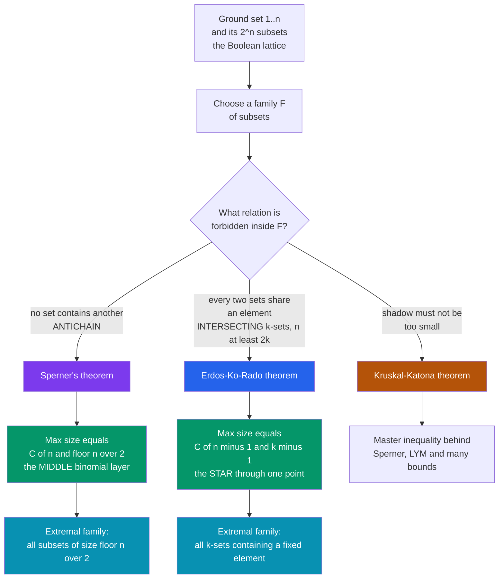

# 🌻 Extremal Set Theory

> [!abstract] TL;DR
> Extremal set theory asks *how large a family of subsets of $\{1,\dots,n\}$ can be while avoiding a forbidden relationship between its members* — and answers with breathtaking exactness. **Sperner's theorem:** the biggest **antichain** (no set contains another) is exactly the middle binomial layer, $\binom{n}{\lfloor n/2\rfloor}$. **Erdős–Ko–Rado:** for $n\ge 2k$, the biggest **intersecting** family of $k$-sets is exactly $\binom{n-1}{k-1}$ — all $k$-sets through one fixed element (the "star"). Same paradigm, sharp thresholds, and a handful of universal proof tricks (shifting, symmetric chains, entropy) that reach from coding theory to machine learning.

---

## Intuition

**Analogy — committees from ten people.** You have a club of $10$ members and you want to form as many committees as possible under a rule. **Rule A:** *no committee may be contained in another* — you cannot have both $\{$Ann, Bo$\}$ and $\{$Ann, Bo, Cy$\}$, because the first sits inside the second. How many committees can you pick? **Rule B:** *every two committees must share at least one member* — no two committees may be completely disjoint. Now how many?

These feel like open-ended puzzles, yet each has an *exact* optimal answer with an *exact* optimal shape. For Rule A the winner is: take every committee of the single most popular size — for $10$ people, all committees of size $5$, giving $\binom{10}{5}=252$ of them (**Sperner's theorem**: the biggest antichain is the middle layer). For Rule B the winner is: fix one member, say Ann, and take *every* committee that includes her (**Erdős–Ko–Rado**: the biggest intersecting family is the "star" through one person). Extremal set theory is the discipline that pins down these maxima — it never asks "how many families are there?" but "**how big can one family be before the forbidden pattern is unavoidable?**", and the answers land precisely on binomial coefficients.

---

## How It Works

### Core Mechanics

Every problem here follows a single template — the same three moves as extremal graph theory, but the host universe is the **power set** of $[n]=\{1,\dots,n\}$ rather than graphs on $n$ vertices.

1. **Fix the host and forbid a relation.** The host is the family of all subsets of $[n]$, ordered by inclusion — the **Boolean lattice** $2^{[n]}$. Forbid one relationship among the members of a chosen family $\mathcal{F}$: "no member contains another" (antichain), or "every two members intersect" (intersecting), or "no member's *shadow* is too small," and so on.
2. **Name the extremal quantity and guess the extremizer.** Maximize $|\mathcal{F}|$ subject to the constraint. The extremizer is almost always one of two canonical shapes: a **layer** $\binom{[n]}{k}$ (all $k$-subsets), or a **star** $\{A : x\in A\}$ (all sets through a fixed point $x$).
3. **Prove both directions.** A **construction** shows the guessed family is legal and large (lower bound). A **forcing argument** shows *nothing* bigger can obey the rule (upper bound). Only when they meet is the threshold exact — and often the extremizer is *unique*.

**The flagship theorems.**

- **Sperner (1928).** The largest antichain in $2^{[n]}$ has size $\binom{n}{\lfloor n/2\rfloor}$ — the widest binomial layer. Proof engines: the **LYM inequality** $\sum_{A\in\mathcal{F}} \binom{n}{|A|}^{-1} \le 1$ (a weighted count over maximal chains), or a **symmetric chain decomposition** partitioning $2^{[n]}$ into $\binom{n}{\lfloor n/2\rfloor}$ chains so any antichain hits each chain once.
- **Erdős–Ko–Rado (1961).** For $n\ge 2k$, the largest intersecting family of $k$-subsets has size $\binom{n-1}{k-1}$, achieved *uniquely* (for $n>2k$) by a star. Katona's slick proof uses **cyclic permutations**; the general workhorse is **shifting/compression**, which pushes any family toward a star without shrinking it or breaking the constraint.
- **Kruskal–Katona (1963–68).** Bounds the **shadow** $\partial\mathcal{F}$ (all $(k{-}1)$-subsets contained in some member): a $k$-uniform family of a given size has a shadow at least as large as that of the first $|\mathcal{F}|$ sets in *colex* order. This is the master inequality from which Sperner and much else follow.
- **Sunflower lemma (Erdős–Rado, 1960).** A **sunflower** with $p$ petals is $p$ sets sharing a common "core," pairwise intersecting *only* in that core. Any family of more than $k!\,(p-1)^k$ distinct $k$-sets must contain a $p$-petal sunflower — a forced-structure result, recently sharpened to roughly $(\log k)^k (p-1)^k$ by Alweiss–Lovett–Wu–Zhang (2019).
- **Sauer–Shelah (1972).** If a family of subsets of $[n]$ **shatters** no set of size $d+1$ (i.e. has **VC dimension** $< d+1$), then $|\mathcal{F}| \le \sum_{i=0}^{d}\binom{n}{i}$ — a polynomial cap that is the combinatorial backbone of statistical learning theory.

The two unifying techniques are **shifting/compression** (deform the family toward a canonical extremizer, monotonically) and **chain/entropy counting** (bound size by summing over maximal chains or by the entropy of a random member). This field is the set-system twin of extremal graph theory, and it borders Ramsey theory (patterns forced by size) and the probabilistic method (random families giving lower bounds).

### Flow / Architecture



---

## Key Concepts

### Secondary Level
- **Antichain (the committee puzzle, Rule A)** — a family in which no set is contained in another. Among $10$ people the largest such family is *every* $5$-member committee: $\binom{10}{5}=252$. Picking all committees of *one* size can never create a containment, and the middle size is the most numerous.
- **Intersecting family (Rule B)** — a family in which every two sets overlap. The safest way to guarantee overlap is to force one fixed person into *every* committee (the **star**); no disjoint pair can then exist.
- **Binomial bell curve** — the layer sizes $\binom{n}{0},\binom{n}{1},\dots,\binom{n}{n}$ form a symmetric hump (a row of Pascal's triangle) peaking in the middle. That peak *is* the Sperner maximum.

### Undergraduate Level
- **Sperner's theorem** — largest antichain in $2^{[n]}$ equals $\binom{n}{\lfloor n/2\rfloor}$. Two standard proofs: **symmetric chain decomposition** (partition the cube into $\binom{n}{\lfloor n/2\rfloor}$ inclusion-chains; an antichain meets each at most once) and the **LYM inequality**.
- **LYM inequality** — for any antichain $\mathcal{F}$, $\sum_{A\in\mathcal{F}}\binom{n}{|A|}^{-1}\le 1$. Since each term is at least $\binom{n}{\lfloor n/2\rfloor}^{-1}$, this *implies* Sperner and is strictly stronger (it also characterizes equality).
- **Erdős–Ko–Rado theorem** — for $n\ge 2k$, largest intersecting $k$-uniform family is $\binom{n-1}{k-1}$; unique (the star) for $n>2k$. The **$n\ge 2k$ threshold is essential**: when $n<2k$ every two $k$-sets already intersect, so the whole layer $\binom{n}{k}$ is trivially intersecting and the bound breaks.
- **Shadows and Kruskal–Katona** — the shadow $\partial\mathcal{F}$ of a $k$-uniform family; the theorem gives the minimum shadow size via colex-initial segments. Immediately yields Sperner and the normalized-matching property of the cube.
- **Shifting / compression** — the workhorse operator $S_{ij}$ that replaces element $j$ by a smaller $i$ in each set when legal. It preserves size and the intersecting property while pushing the family toward a star, collapsing hard problems into easy canonical ones.

### Graduate Level
- **Symmetric chain decompositions, normalized matching, Dilworth** — the Boolean lattice is a **symmetric chain order**; Dilworth's theorem ($\text{max antichain} = \text{min chain cover}$) makes Sperner a corollary. These structural facts drive LYM-type inequalities across ranked posets.
- **$t$-intersecting and cross-intersecting families** — require every two sets to share $\ge t$ elements, or two families to pairwise cross-intersect. The **Ahlswede–Khachatrian complete intersection theorem** (1997) fully resolves the $t$-intersecting maximum for all $n,k,t$, generalizing EKR.
- **Sunflower lemma and modern bounds** — Erdős–Rado's $k!\,(p-1)^k$ threshold; the 2019 **Alweiss–Lovett–Wu–Zhang** breakthrough to $(\log k)^{k}(p-1)^k$ (further polished toward the conjectured $C^k$). Sunflowers underpin **Razborov's monotone circuit lower bounds** for the clique function.
- **Sauer–Shelah, VC dimension, shattering** — a set family shatters $S$ if it realizes all $2^{|S|}$ traces on $S$; bounded VC dimension forces polynomial growth $|\mathcal{F}|\le\sum_{i\le d}\binom{n}{i}$. This is the bridge to **PAC learning** and generalization bounds — sample complexity scales with VC dimension.
- **Frankl's union-closed conjecture** — a union-closed family on $n$ elements has some element in at least half its members. Long open; the 2022 Gilmer/Sawin–Chase entropy-method progress (element frequency $\ge 0.38\ldots$) is a landmark use of the **entropy method** in extremal set theory.

---

## Python Demo

Two experiments make the extremizers concrete. **(a) Sperner:** for the Boolean lattice on $[n]$ we compute the *true* largest antichain by exact search (maximum independent set in the containment graph) for small $n$ and check it equals the middle binomial layer $\binom{n}{\lfloor n/2\rfloor}$; then we plot the layer sizes $\binom{n}{k}$ to see the bell curve peaking exactly at the answer. **(b) Erdős–Ko–Rado:** for $k$-subsets of $[n]$ with $n\ge 2k$ we compute the *true* largest intersecting family (maximum independent set in the disjointness / Kneser graph) and verify it equals the star size $\binom{n-1}{k-1}$, comparing against the whole layer $\binom{n}{k}$.

```python
# Extremal set theory made empirical: Sperner + Erdos-Ko-Rado.
# (a) SPERNER  -> largest ANTICHAIN in the Boolean lattice = C(n, floor(n/2)).
# (b) EKR      -> largest INTERSECTING family of k-sets (n >= 2k) = C(n-1, k-1).
# Both maxima are found EXACTLY via maximum-independent-set search on the
# relevant conflict graph, then checked against the closed-form binomial value.
import math
from itertools import combinations
import numpy as np
import matplotlib.pyplot as plt


def max_independent_set(adj):
    """Exact max independent set size via branch & bound on bitmask graph.
    adj[v] = bitmask of neighbours of vertex v.  Fine for the small,
    structured conflict graphs used here (<= ~40 vertices)."""
    n = len(adj)
    best = 0

    def bb(cands, size):
        nonlocal best
        if size + bin(cands).count("1") <= best:   # popcount upper bound: prune
            return
        if cands == 0:
            best = max(best, size)
            return
        v = (cands & -cands).bit_length() - 1       # lowest-index candidate
        bb(cands & ~adj[v] & ~(1 << v), size + 1)   # branch: include v
        bb(cands & ~(1 << v), size)                 # branch: exclude v

    bb((1 << n) - 1, 0)
    return best


# ---------- (a) SPERNER: largest antichain = C(n, floor(n/2)) ----------
print("SPERNER  (largest antichain in the Boolean lattice)")
print(" n :  brute-force max antichain   C(n, floor(n/2))   match?")
for n in (2, 3, 4, 5):
    subsets = [frozenset(s) for r in range(n + 1)
               for s in combinations(range(n), r)]
    m = len(subsets)
    # conflict graph: sets i, j are adjacent iff one CONTAINS the other
    adj = [0] * m
    for i in range(m):
        for j in range(m):
            if i != j and (subsets[i] <= subsets[j] or subsets[j] <= subsets[i]):
                adj[i] |= (1 << j)
    brute = max_independent_set(adj)
    middle = math.comb(n, n // 2)
    assert brute == middle
    print(f"{n:2d} :        {brute:4d}                  {middle:4d}          {brute == middle}")


# ---------- (b) ERDOS-KO-RADO: largest intersecting k-family = C(n-1, k-1) ----
print("\nERDOS-KO-RADO  (largest intersecting family of k-subsets, n >= 2k)")
print(" (n, k):  brute-force max intersecting   star C(n-1,k-1)   whole layer C(n,k)")
ekr_cases = [(5, 2), (6, 2), (6, 3), (7, 3), (8, 3)]
ekr_rows = []
for n, k in ekr_cases:
    ksets = [frozenset(s) for s in combinations(range(n), k)]
    m = len(ksets)
    # conflict graph: k-sets i, j are adjacent iff they are DISJOINT (Kneser graph)
    adj = [0] * m
    for i in range(m):
        for j in range(i + 1, m):
            if not (ksets[i] & ksets[j]):
                adj[i] |= (1 << j)
                adj[j] |= (1 << i)
    brute = max_independent_set(adj)
    star = math.comb(n - 1, k - 1)
    layer = math.comb(n, k)
    assert brute == star
    ekr_rows.append((n, k, brute, star, layer))
    print(f" ({n},{k}):          {brute:4d}                    {star:4d}              {layer:4d}")


# ---------- plots ----------
fig, ax = plt.subplots(1, 2, figsize=(13, 5))

# (a) Sperner bell curve of layer sizes; the middle layer IS the max antichain
N = 12
ks = np.arange(N + 1)
layer_sizes = np.array([math.comb(N, k) for k in ks])
mid = N // 2
colors = ["#c4b5fd"] * (N + 1)
colors[mid] = "#7c3aed"
ax[0].bar(ks, layer_sizes, color=colors, edgecolor="white")
ax[0].axhline(layer_sizes[mid], color="#7c3aed", ls="--", lw=1)
ax[0].annotate(f"middle layer = largest antichain\nC({N},{mid}) = {layer_sizes[mid]}",
               (mid, layer_sizes[mid]), textcoords="offset points",
               xytext=(-10, 12), color="#7c3aed", ha="center")
ax[0].set_xlabel("layer k  (subset size)")
ax[0].set_ylabel(f"number of k-subsets  C({N}, k)")
ax[0].set_title(f"Sperner: antichain peaks at the middle layer (n = {N})")
ax[0].grid(alpha=0.3, axis="y")

# (b) EKR: max intersecting family (= star) vs whole layer, per (n, k)
labels = [f"({n},{k})" for (n, k, *_ ) in ekr_rows]
x = np.arange(len(ekr_rows))
w = 0.38
star_vals = [r[3] for r in ekr_rows]
layer_vals = [r[4] for r in ekr_rows]
ax[1].bar(x - w / 2, layer_vals, w, color="#cbd5e1", label="whole layer C(n,k)")
ax[1].bar(x + w / 2, star_vals, w, color="#2563eb",
          label="max intersecting = star C(n-1,k-1)")
ax[1].set_xticks(x)
ax[1].set_xticklabels(labels)
ax[1].set_xlabel("(n, k)   with n >= 2k")
ax[1].set_ylabel("family size")
ax[1].set_title("Erdos-Ko-Rado: the star is the biggest intersecting family")
ax[1].legend()
ax[1].grid(alpha=0.3, axis="y")

plt.tight_layout()
plt.savefig("extremal_set_theory_demo.png", dpi=120)
plt.show()
```

**What you see:** the console prints confirm that brute-force search over *all* families lands exactly on the closed forms — the largest antichain equals $\binom{n}{\lfloor n/2\rfloor}$ for every tested $n$, and the largest intersecting $k$-family equals the star $\binom{n-1}{k-1}$ for every tested $(n,k)$ with $n\ge 2k$. The left panel is Sperner in one picture: the binomial bell curve, with its single tallest bar (the middle layer, highlighted) being the exact antichain maximum. The right panel is EKR: the blue star bars sit well below the full layer (gray) yet are provably the largest any intersecting family can be — fixing one element is optimal.

---

## Real-World Applications

> **Example — VC dimension and machine learning generalization.** The **Sauer–Shelah lemma** is extremal set theory: a hypothesis class of VC dimension $d$ can realize at most $\sum_{i\le d}\binom{n}{i}=O(n^d)$ distinct labelings of $n$ points — a polynomial, not exponential, "growth function." That polynomial cap is *exactly* what lets uniform-convergence bounds prove a finite-VC class is PAC-learnable with sample complexity $\tilde{O}(d/\varepsilon)$. Learning theory's central quantitative guarantee rests on a shattering bound about set systems.

- **Coding theory and combinatorial designs** — error-correcting codes are extremal set systems maximizing codewords under a distance (forbidden "too-close") constraint; **cover-free** and **constant-weight** codes, and EKR-type intersecting codes, give bounds on group testing, superimposed codes, and frameproof/traitor-tracing schemes.
- **Circuit complexity lower bounds** — Razborov's celebrated **monotone circuit lower bound** for the clique function is built on the **sunflower lemma**: approximating gates while "plucking" sunflowers forces super-polynomial size. Extremal set theory supplies the combinatorial core of complexity theory's hardness proofs.
- **Database theory and hashing** — functional-dependency families, minimal keys, and **perfect hash families** are antichain/cover-free structures; Sperner-type bounds cap how many distinct keys or hash functions a schema needs, and shadow bounds control minimal-transversal enumeration.
- **Cryptography and secret sharing** — access structures in **secret-sharing** schemes are monotone families whose minimal qualified sets form an antichain; cover-free families yield non-adaptive traitor tracing and anti-collusion fingerprinting.
- **Distributed computing and fault tolerance** — quorum systems are intersecting families (every two quorums must overlap to serialize), so EKR-style bounds govern the minimum quorum size and load in replicated data stores.

---

## Common Pitfalls

- **Antichain vs chain (Sperner vs Dilworth/Mirsky).** An *antichain* has **no** comparable pair (Sperner bounds its size by the middle layer); a *chain* is **all** comparable. Confusing them inverts the whole problem — the largest chain in $2^{[n]}$ has length $n+1$, nothing to do with $\binom{n}{\lfloor n/2\rfloor}$.
- **Misstating the intersecting condition.** "Intersecting" means every *pair* shares $\ge 1$ element — **not** that all sets share a *common* element (that stronger property is exactly the star). The star is *one* optimal intersecting family; the theorem is that *no* intersecting family, common-element or not, can beat it.
- **Forgetting the $n\ge 2k$ threshold in EKR.** The bound $\binom{n-1}{k-1}$ holds only when $n\ge 2k$. If $n<2k$, any two $k$-sets already overlap (they cannot fit disjointly in $[n]$), so the *entire* layer $\binom{n}{k}$ is intersecting and the star is far from maximal. Quoting EKR outside its regime gives nonsense.
- **Confusing LYM with Sperner.** Sperner is the *cardinality* bound $|\mathcal{F}|\le\binom{n}{\lfloor n/2\rfloor}$; the **LYM inequality** $\sum_A\binom{n}{|A|}^{-1}\le 1$ is a strictly stronger *weighted* statement that implies Sperner and pins down the equality cases. Using "Sperner" to justify a step that actually needs LYM (e.g. mixed-size antichains) is a silent gap.
- **Assuming the extremizer is unique or obvious.** For $n>2k$ the EKR star is unique, but at the boundary $n=2k$ there are *many* maximum intersecting families (take one of each complementary pair), and $t$-intersecting optima (Ahlswede–Khachatrian) are *not* always stars. Guessing "it must be a star" without checking the regime derails the argument.

---

## Related Concepts

- [[Combinatorics/01_Foundations_of_Counting/Combinatorics_Overview|Combinatorics Overview]] — places extremal set theory within the existence-and-bounds branch alongside enumerative and probabilistic combinatorics.
- [[Combinatorics/01_Foundations_of_Counting/The_Binomial_Theorem_and_Coefficients|The Binomial Theorem and Coefficients]] — every extremal answer here is a binomial coefficient; $\binom{n}{\lfloor n/2\rfloor}$ (Sperner) and $\binom{n-1}{k-1}$ (EKR) live on Pascal's triangle.
- [[Combinatorics/01_Foundations_of_Counting/Permutations_and_Combinations|Permutations and Combinations]] — Katona's EKR proof counts $k$-sets appearing as arcs of a cyclic *permutation*; layers are just $\binom{n}{k}$ combinations.
- [[Combinatorics/01_Foundations_of_Counting/The_Pigeonhole_Principle|The Pigeonhole Principle]] — the humblest forcing tool; the sunflower lemma and many upper bounds reduce to a pigeonhole/double-count over cores or chains.
- [[Combinatorics/03_Graph_and_Extremal_Combinatorics/Combinatorial_Designs|Combinatorial Designs]] — designs are extremal set systems meeting equality in packing/covering bounds; intersecting families and $t$-designs share the same arithmetic.
- [[Mathematics/04_Discrete_Mathematics/Set_Theory_and_Relations|Set Theory and Relations]] — the partial order of inclusion (the Boolean lattice) and the notions of antichain, chain, and shadow are the arena of this whole subject.
- [[Mathematics/04_Discrete_Mathematics/Combinatorics|Combinatorics (Discrete Mathematics)]] — the seed note whose set-counting ideas this note deepens into extremal territory.
- [[Mathematics/04_Discrete_Mathematics/Graph_Theory|Graph Theory]] — Sperner and EKR maxima are computed here as independent sets in the containment and Kneser graphs; the disjointness graph of $k$-sets *is* the Kneser graph.
- [[Theory_of_Computation/05_Advanced_Complexity/Circuit_Complexity|Circuit Complexity]] — Razborov's monotone lower bounds for clique are powered by the sunflower lemma, a direct import from extremal set theory.
- [[Information_Theory/01_Foundations_of_Information_Theory/Entropy_and_Information_Content|Entropy and Information Content]] — the entropy method bounds family sizes (and drove recent union-closed-sets progress) by measuring the entropy of a random member.
- [[Information_Theory/03_Channel_Coding_and_Reliable_Communication/Error_Correcting_Codes_Fundamentals|Error-Correcting Codes Fundamentals]] — codes are extremal set systems maximizing codewords under a forbidden-distance constraint; EKR and Kruskal–Katona bound constant-weight codes.
- [[Statistical_Mechanics_and_Machine_Learning/06_Inference_Information_and_Frontiers/Statistical_Mechanics_of_Generalization_and_Scaling_Laws|Statistical Mechanics of Generalization and Scaling Laws]] — VC dimension, the Sauer–Shelah growth function, and generalization bounds are the learning-theory face of shattering.

*Sibling notes in this vault (prose references):* **Extremal Combinatorics** (the graph-side twin — Turán/Mantel thresholds, same avoid-vs-force template), **Posets and Lattices** (the Boolean lattice, chains, antichains, and Dilworth that underlie Sperner), **Ramsey Theory** (structure forced by sheer size rather than density — the complementary "force" viewpoint), and **The Probabilistic Method** (random set families supply extremal *lower* bounds and existence proofs).

---

## Review Questions

1. **(Secondary)** From a club of $10$ people, explain why choosing *every* $5$-member committee gives an antichain (no committee inside another) and why it is larger than choosing all committees of any other single size. Separately, describe an intersecting family of committees of size $252$ built from a fixed member, and say why no two of them can be disjoint.
2. **(Undergraduate)** State Sperner's theorem and the Erdős–Ko–Rado theorem precisely, including the $n\ge 2k$ hypothesis. For $n=8,k=3$, compute the EKR maximum $\binom{n-1}{k-1}$ and compare it to the whole layer $\binom{n}{k}$. Then explain what goes wrong if you try to apply EKR with $n=5,k=3$, and give the actual maximum intersecting family in that case.
3. **(Graduate)** Show how the **LYM inequality** implies Sperner's theorem and why it is strictly stronger. Then sketch how the **shifting/compression** operator reduces the proof of Erdős–Ko–Rado to a statement about stars, and connect the **Sauer–Shelah lemma** to PAC learning: why does bounding the growth function by $\sum_{i\le d}\binom{n}{i}$ (a set-system extremal bound) yield finite sample complexity for a VC-dimension-$d$ class?

---

## Sources

- [Bollobás, B. — *Combinatorics: Set Systems, Hypergraphs, Families of Vectors, and Combinatorial Probability* (Cambridge, 1986)](https://www.cambridge.org/9780521337038)
- [Anderson, I. — *Combinatorics of Finite Sets* (Dover reprint, 2002)](https://store.doverpublications.com/products/9780486422572)
- [Frankl, P. — "The shifting technique in extremal set theory" (Surveys in Combinatorics 1987, Cambridge)](https://www.cambridge.org/core/books/surveys-in-combinatorics-1987)
- [van Lint, J. H. & Wilson, R. M. — *A Course in Combinatorics* (2nd ed., Cambridge, 2001)](https://www.cambridge.org/9780521006019)
- [Alweiss, Lovett, Wu & Zhang — "Improved bounds for the sunflower lemma" (Annals of Mathematics, 2021)](https://annals.math.princeton.edu/2021/194-3/p05)

---

#combinatorics #extremal-set-theory #sperners-theorem #erdos-ko-rado #antichains
