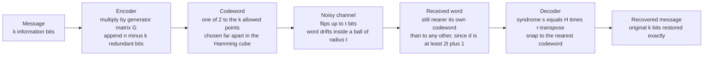

# 📡 Combinatorial Coding Theory

> [!abstract] TL;DR
> **Coding theory** is the combinatorics of packing **codewords** as far apart as possible in the discrete **Hamming cube** $\{0,1\}^n$. A code is a chosen subset $\mathcal{C}$ of the $2^n$ binary strings, and its single most important number is the **minimum distance** $d = \min_{u \ne v}\, d_H(u,v)$: if every pair of allowed words differs in at least $d$ positions, then the radius-$t$ balls around them are disjoint for $t = \lfloor (d-1)/2 \rfloor$, so any error pattern of weight $\le t$ still lands nearest its own codeword and is corrected. A code is summarized by its parameters $[n, k, d]$ — length, dimension (it carries $k$ information bits, $2^k$ codewords), and distance — and coding theory is the study of the **rate-distance tradeoff** $R = k/n$ versus $d$, fenced in by the **Singleton**, **Hamming (sphere-packing)**, and **Gilbert-Varshamov** bounds. This is the *constructive, combinatorial* companion to Shannon's channel view: where information theory says good codes *must exist*, combinatorial coding theory *builds them* out of finite fields, polynomials, and combinatorial designs — the Hamming, Reed-Solomon, BCH, and Golay codes that run your phone, QR reader, hard drive, and deep-space probe.

---

## Intuition

**Analogy — a dictionary robust to typos.** You need to send a message across a noisy channel, and along the way random bits get flipped. How can the receiver recover exactly what you meant? The trick is the same one that lets you read a page riddled with typos: choose your allowed words to be so **far apart** that no small handful of errors can turn one into another. A single scrambled letter in *"combinatorics"* still clearly is not *"combinatorial"* — the two words are simply too different for one typo to bridge. If, on the other hand, your dictionary contained both *"cat"* and *"bat"*, a single-letter error would be fatally ambiguous. The whole art is to design a vocabulary of codewords that are mutually distant, then decode any received garble by snapping it to the *nearest* legal word.

Now make "far apart" precise. In a length-$n$ binary world, the natural notion of distance between two strings is the **Hamming distance**: the number of positions where they disagree. All $2^n$ strings form the corners of an $n$-dimensional **hypercube**, and a code is just a chosen set of corners. Surround each chosen corner by a ball of radius $t$ — all strings reachable by flipping at most $t$ bits. If these balls never overlap, then any received word inside a ball has an *unambiguous* nearest codeword, and up to $t$ errors are corrected flawlessly. So designing a good code is exactly a **sphere-packing problem**: cram as many non-overlapping balls of a given radius into the hypercube as possible. Push the balls apart (large $d$) and you correct more errors but fit fewer codewords (low rate); pack them tight (high rate) and you correct less. Coding theory is the beautiful, rigid geometry of this tradeoff — a discrete cousin of stacking oranges, and the reason your DVD survives a scratch and Voyager's whisper survives four billion miles of static.

---

## How It Works

### Core Mechanics

1. **Encode with structured redundancy.** A message is $k$ information bits. The encoder maps it to a longer $n$-bit **codeword** by appending $n-k$ carefully computed **redundant** (parity) bits. Only $2^k$ of the $2^n$ possible strings are legal codewords — the code $\mathcal{C}$ is that chosen subset. The **rate** $R = k/n$ measures how much of the transmission is genuine payload.

2. **Spread the codewords far apart in Hamming space.** The **Hamming distance** $d_H(u,v)$ counts disagreeing positions; the **minimum distance** $d = \min_{u\ne v \in \mathcal{C}} d_H(u,v)$ is the closest any two distinct codewords come. Geometrically, codewords are lattice points and $d$ is the smallest gap between them.

3. **Errors move a word inside a ball.** The noisy channel flips some bits, so the received word $r$ sits at Hamming distance $= (\text{number of errors})$ from the true codeword — it has drifted into the **ball** $B_t(c)$ of radius $t$ around $c$.

4. **Decode to the nearest codeword.** If $d \ge 2t + 1$, the radius-$t$ balls around distinct codewords are **disjoint**, so $r$ lies in exactly one ball and its center is the unique nearest codeword. Thus the code **corrects** $t = \lfloor (d-1)/2 \rfloor$ errors and **detects** up to $d-1$ errors. This $d \mapsto t$ relation is the heartbeat of the subject.

5. **Linearity makes it efficient.** A **linear code** is a $k$-dimensional subspace of $\mathbb{F}_q^n$: codewords are $c = mG$ for a $k \times n$ **generator matrix** $G$, and legality is checked by a $(n-k) \times n$ **parity-check matrix** $H$ with $Hc^\top = 0$. For linearity, minimum distance equals the **minimum weight** of any nonzero codeword. Decoding becomes **syndrome decoding**: compute $s = Hr^\top$; if $s = 0$ the word is clean, otherwise $s$ equals the column(s) of $H$ indexed by the error positions, reading out *where* the error is.

6. **Bounds fence the tradeoff.** You cannot maximize rate and distance simultaneously. The **Singleton** bound ($d \le n-k+1$) and the **Hamming / sphere-packing** bound (the disjoint balls must fit inside the cube) cap how good a code can be; the **Gilbert-Varshamov** bound *guarantees* codes at least a certain quality exist. Coding theory navigates this triangle.

### Flow / Architecture



---

## Key Concepts

### Secondary (high-school level)
- **A code is a dictionary of far-apart words.** Pick codewords so that no small number of bit flips can turn one into another; then decode any garbled word to the closest legal one.
- **Hamming distance** = number of positions where two equal-length strings differ. `10110` vs `10011` differ in 2 places, so their distance is 2.
- **Repetition code — the simplest idea.** Send each bit three times: `0 -> 000`, `1 -> 111`. If one copy flips (`010`), **majority vote** recovers the original. This corrects one error but wastes two-thirds of the channel (rate $1/3$).
- **Parity bit — the simplest detector.** Append one bit making the total number of `1`s even. Any single flip makes it odd, so you *detect* one error (but cannot fix it). Detection is cheap; correction costs more.
- **The core tension:** more redundancy = more error protection but less real data per message.

### Undergraduate
- **Parameters $[n, k, d]$:** length $n$, dimension $k$ (so $2^k$ codewords carrying $k$ bits), minimum distance $d$; **rate** $R = k/n$.
- **Distance $\to$ capability:** a code with minimum distance $d$ **detects** $d-1$ errors and **corrects** $t = \lfloor (d-1)/2 \rfloor$ errors. Correcting $t$ errors requires $d \ge 2t+1$.
- **Sphere-packing picture:** codewords are ball centers; correcting $t$ errors means the radius-$t$ balls are disjoint. A ball of radius $t$ in $\{0,1\}^n$ contains $\sum_{i=0}^{t}\binom{n}{i}$ points.
- **Linear codes:** a subspace of $\mathbb{F}_2^n$ (or $\mathbb{F}_q^n$) generated by $G$; validity checked by $H$ with $HG^\top = 0$. Minimum distance = minimum nonzero **weight**. Encoding and syndrome decoding are matrix multiplications.
- **Hamming codes** $[2^m - 1,\ 2^m - 1 - m,\ 3]$ — e.g. $[7,4,3]$ — are single-error-correcting and **perfect**: the radius-1 balls tile the cube with no gaps or overlaps.
- **Singleton bound:** $d \le n - k + 1$; codes meeting it are **MDS** (Reed-Solomon is the flagship).
- **Hamming (sphere-packing) bound:** $2^k \sum_{i=0}^{t}\binom{n}{i} \le 2^n$; codes meeting it are **perfect**.
- **Gilbert-Varshamov bound:** a code of length $n$, distance $d$, size $\ge 2^n / \sum_{i=0}^{d-1}\binom{n}{i}$ is *guaranteed to exist* — a greedy/probabilistic **existence** result, not a construction.

### Graduate
- **Reed-Solomon codes.** Codewords are evaluations of degree-$<k$ polynomials over $\mathbb{F}_q$ at $n \le q$ points. Two distinct low-degree polynomials agree in $< k$ places, so $d = n-k+1$ exactly — **MDS**, meeting Singleton with equality. Decoded by Berlekamp-Massey / Berlekamp-Welch; **list-decoded** beyond half the distance by Guruswami-Sudan.
- **BCH and Reed-Muller.** **BCH** codes use consecutive roots of unity in an extension field to *design* a guaranteed distance (BCH bound). **Reed-Muller** $RM(r,m)$ codes come from multivariate polynomials of degree $\le r$; $RM(1,m)$ is a **Hadamard code** with huge distance, low rate — used by Mariner 9.
- **The Golay codes.** The binary $[23,12,7]$ Golay code is **perfect** (radius-3 balls tile $\{0,1\}^{23}$), corrects 3 errors, and its supports of weight-7 codewords form the **Steiner system** $S(4,7,23)$; its extended $[24,12,8]$ version underlies the **Leech lattice** and the sporadic **Mathieu groups** $M_{24}$ — the densest bridge from coding theory to combinatorial designs and finite group theory.
- **Duality and weight enumerators.** Every linear code $\mathcal{C}$ has a **dual** $\mathcal{C}^\perp = \{x : x\cdot c = 0\ \forall c\}$. The **MacWilliams identity** determines the weight enumerator of $\mathcal{C}^\perp$ from that of $\mathcal{C}$ — a purely combinatorial transform (a $q$-analog of a Krawtchouk expansion) with no channel content.
- **Further bounds.** **Plotkin bound** (strong for $d$ close to $n/2$), **Elias-Bassalygo**, **linear-programming (Delsarte)** bound — the tightest known asymptotic upper limit, from LP duality on the association scheme of the Hamming cube.
- **Beating Gilbert-Varshamov.** For decades GV was the best known achievable rate-distance curve. **Algebraic-geometry (Goppa) codes** from curves with many points over $\mathbb{F}_q$ (**Tsfasman-Vladut-Zink**, 1982) *exceed* the GV bound for $q \ge 49$ — a landmark connecting coding theory to arithmetic geometry.
- **Modern & structural.** **LDPC** and **expander codes** achieve near-capacity with sparse parity-check matrices and linear-time decoding; **lattices** (Leech, Barnes-Wall) are the real-valued analog of sphere-packing codes; **finite geometry** (projective planes, Fano) generates parity-check structures directly.

---

## Python Demo

```python
# Error-correcting codes as SPHERE PACKING in the Hamming cube:
#   (a) Build the HAMMING(7,4) code [n=7, k=4, d=3]: encode 4-bit messages -> 7-bit codewords,
#       show the minimum Hamming DISTANCE is 3 (so t = 1 error corrected), inject a single
#       bit-flip, and DECODE by SYNDROME to recover the message -- verified over ALL 16 x 7 cases.
#   (b) The SPHERE-PACKING / HAMMING bound: for fixed length n, plot the max achievable RATE
#       vs minimum DISTANCE -- packing balls of radius t in the hypercube -- against the
#       Singleton and Gilbert-Varshamov bounds, with real codes marked in the feasible band.
import numpy as np
import matplotlib.pyplot as plt
from itertools import product
from math import comb, log2

# ============================================================
# (a) HAMMING(7,4): a linear code as a sphere packing in {0,1}^7
# ============================================================
# Systematic generator  G = [ I4 | P ] (4x7);  parity-check  H = [ P^T | I3 ] (3x7).
P = np.array([[0, 1, 1],
              [1, 0, 1],
              [1, 1, 0],
              [1, 1, 1]], dtype=int)
G = np.hstack([np.eye(4, dtype=int), P])            # 4 x 7 generator
H = np.hstack([P.T, np.eye(3, dtype=int)])          # 3 x 7 parity-check

encode    = lambda m: (m @ G) % 2                   # message (4 bits) -> codeword (7 bits)
syndrome  = lambda r: (H @ r) % 2                   # received (7) -> syndrome (3)

# Map each nonzero syndrome to the single-bit error position it names (= a column of H)
synd_to_pos = {}
for j in range(7):
    e = np.zeros(7, dtype=int); e[j] = 1
    synd_to_pos[tuple(syndrome(e))] = j

def decode(r):
    s = tuple(syndrome(r)); r = r.copy()
    if s != (0, 0, 0):                              # nonzero syndrome -> flip the indicated bit
        r[synd_to_pos[s]] ^= 1
    return r[:4]                                    # systematic form: first 4 bits are the message

# --- All 16 codewords; minimum distance = min nonzero WEIGHT (true for linear codes) ---
messages  = [np.array(m) for m in product([0, 1], repeat=4)]
codewords = np.array([encode(m) for m in messages])
weights   = codewords.sum(axis=1)
d_min     = int(min((codewords[i] ^ codewords[j]).sum()
                     for i in range(16) for j in range(i + 1, 16)))
t = (d_min - 1) // 2

print("=== Hamming(7,4) : parameters [n=7, k=4, d=%d] ===" % d_min)
print("minimum distance d =", d_min, "  ->  corrects t = floor((d-1)/2) =", t, "error")
print("rate R = k/n =", 4/7)

# --- Verify correction of EVERY single-bit error on EVERY codeword ---
recover_grid = np.zeros((16, 7), dtype=int)
for mi, m in enumerate(messages):
    c = encode(m)
    for pos in range(7):
        r = c.copy(); r[pos] ^= 1                   # inject one bit-flip
        recover_grid[mi, pos] = int(np.array_equal(decode(r), m))
print("corrects ALL", recover_grid.size, "single-bit error cases:", bool(recover_grid.all()))

# --- One concrete round-trip ---
m = np.array([1, 0, 1, 1]); c = encode(m)
r = c.copy(); r[2] ^= 1
s = syndrome(r)
print("\nmessage %s -> codeword %s" % (m.tolist(), c.tolist()))
print("received (bit 2 flipped): %s ; syndrome %s -> error at position %d"
      % (r.tolist(), s.tolist(), synd_to_pos[tuple(s)]))
print("decoded message: %s  recovered = %s" % (decode(r).tolist(), np.array_equal(decode(r), m)))

# ============================================================
# (b) SPHERE-PACKING / HAMMING BOUND: rate vs distance for length n
# ============================================================
ball = lambda n, radius: sum(comb(n, i) for i in range(max(radius, 0) + 1))  # |B(radius)| in n-cube

n = 15
d_vals = np.arange(1, n + 1)
R_ham, R_sing, R_gv = [], [], []
for d in d_vals:
    tt = (d - 1) // 2
    R_ham.append(max(0.0, 1 - log2(ball(n, tt))      / n))   # Hamming / sphere-packing (upper)
    R_sing.append(max(0.0, 1 - (d - 1)               / n))   # Singleton (upper)
    R_gv.append(max(0.0, 1 - log2(ball(n, d - 1))    / n))   # Gilbert-Varshamov (lower / existence)

# Real binary codes of length 15 -- must lie BELOW Hamming, ABOVE Gilbert-Varshamov
known = {"Rep [15,1,15]": (15, 1/15), "BCH [15,5,7]": (7, 5/15),
         "BCH [15,7,5]": (5, 7/15),   "Hamming [15,11,3]": (3, 11/15)}

# ---------------- Visualization ----------------
fig, ax = plt.subplots(2, 2, figsize=(14, 11))

# (1) codeword weight enumerator -> min nonzero weight = d = 3
wc = np.bincount(weights, minlength=8)
bars = ax[0, 0].bar(range(8), wc, color="#2563eb"); bars[0].set_color("#94a3b8")
ax[0, 0].axvline(d_min, color="#dc2626", ls="--", lw=2)
ax[0, 0].text(d_min + 0.15, wc.max() * 0.75, "d = %d" % d_min, color="#dc2626", fontsize=12)
ax[0, 0].set_title("Hamming(7,4) weight enumerator\nmin nonzero weight = minimum distance d = 3")
ax[0, 0].set_xlabel("codeword Hamming weight"); ax[0, 0].set_ylabel("number of codewords")

# (2) each single-error position has a UNIQUE syndrome -> correctable
synd_dec = []
for j in range(7):
    e = np.zeros(7, dtype=int); e[j] = 1; s = syndrome(e)
    synd_dec.append(int(s[0] * 4 + s[1] * 2 + s[2]))
ax[0, 1].bar(range(7), synd_dec, color="#7c3aed")
for j, val in enumerate(synd_dec):
    ax[0, 1].text(j, val + 0.12, str(val), ha="center", fontsize=10)
ax[0, 1].set_title("Syndrome s = H . r-transpose names the flipped bit\n7 distinct nonzero syndromes -> t = 1 correctable")
ax[0, 1].set_xlabel("error position (flipped bit)"); ax[0, 1].set_ylabel("syndrome as decimal 1..7")
ax[0, 1].set_yticks(range(0, 8))

# (3) verification heatmap: every single-error on every codeword recovered
ax[1, 0].imshow(recover_grid, cmap="Greens", vmin=0, vmax=1, aspect="auto")
ax[1, 0].set_title("Syndrome decoding recovers ALL %d single-error cases\nall green = corrected" % recover_grid.size)
ax[1, 0].set_xlabel("flipped bit position (0..6)"); ax[1, 0].set_ylabel("message index (0..15)")

# (4) sphere-packing bounds: rate vs minimum distance
ax[1, 1].plot(d_vals, R_ham,  "o-", color="#dc2626", label="Hamming / sphere-packing (upper)")
ax[1, 1].plot(d_vals, R_sing, "s--", color="#f59e0b", label="Singleton (upper)")
ax[1, 1].plot(d_vals, R_gv,   "^-", color="#059669", label="Gilbert-Varshamov (lower)")
ax[1, 1].fill_between(d_vals, R_gv, R_ham, where=(np.array(R_ham) >= np.array(R_gv)),
                      color="#bfdbfe", alpha=0.5, label="feasible band")
for name, (d, R) in known.items():
    ax[1, 1].scatter([d], [R], s=90, color="#111827", zorder=5)
    ax[1, 1].annotate(name, (d, R), textcoords="offset points", xytext=(6, 6), fontsize=8)
ax[1, 1].set_title("Rate vs distance bounds, length n = %d\npacking balls of radius t in the Hamming cube" % n)
ax[1, 1].set_xlabel("minimum distance d"); ax[1, 1].set_ylabel("rate R = k/n")
ax[1, 1].legend(fontsize=8, loc="upper right"); ax[1, 1].set_ylim(0, 1.05)

plt.tight_layout()
plt.savefig("combinatorial_coding_theory.png", dpi=120)
print("\nSaved figure: combinatorial_coding_theory.png")
```

**Expected console output:**

```
=== Hamming(7,4) : parameters [n=7, k=4, d=3] ===
minimum distance d = 3   ->  corrects t = floor((d-1)/2) = 1 error
rate R = k/n = 0.5714285714285714
corrects ALL 112 single-bit error cases: True

message [1, 0, 1, 1] -> codeword [1, 0, 1, 1, 0, 0, 1]
received (bit 2 flipped): [1, 0, 0, 1, 0, 0, 1] ; syndrome [1, 1, 0] -> error at position 2
decoded message: [1, 0, 1, 1]  recovered = True

Saved figure: combinatorial_coding_theory.png
```

The demo does more than *use* a code — it exhibits the geometry. Panel (1) plots the **weight enumerator** $1 + 7z^3 + 7z^4 + z^7$: the smallest nonzero weight is $3$, which *is* the minimum distance because the code is linear. Panel (2) shows the seven single-bit errors mapping to seven **distinct nonzero syndromes** (the nonzero columns of $H$), which is exactly why every single error is correctable. Panel (3) confirms it exhaustively — all $16 \times 7 = 112$ single-error cases recover. Panel (4) draws the **rate-distance tradeoff**: real codes (Hamming, BCH, repetition) all sit inside the band between the Gilbert-Varshamov *existence* floor and the Hamming *sphere-packing* ceiling.

---

## Real-World Applications

> **Example — Reed-Solomon in QR codes and optical discs.** A **QR code** is a Reed-Solomon code over $\mathbb{F}_{256}$ laid out in two dimensions. Because RS is **MDS** ($d = n-k+1$), it wrings the maximum possible error correction from every redundant byte — which is why a QR code still scans with a logo pasted over its center or a coffee stain across a corner (its highest setting tolerates ~30% of the symbols being destroyed). The *same* algebra corrects scratches on **CDs, DVDs, and Blu-ray**: audio and video are interleaved through Reed-Solomon (CIRC on CDs) so that a physical gouge, which damages many *consecutive* bits, is spread across many codewords and stays within each one's correction budget. Maximizing minimum distance is literally a combinatorial packing problem, and RS solves it optimally.

- **Deep-space communication.** The **Voyager** probes used a concatenated scheme: a **Golay** code (and later Reed-Solomon + convolutional inner codes) let a 20-watt transmitter send images from beyond Neptune. The Reed-Muller / Hadamard code flew on **Mariner 9** to Mars — low rate but enormous distance for an extremely noisy link.
- **Computer memory (ECC RAM).** Server DIMMs add **Hamming SECDED** check bits ($[72,64]$-style) to correct single-bit flips from cosmic rays and detect doubles — Hamming(7,4)'s idea scaled up, protecting every 64-bit word.
- **RAID and distributed storage.** **RAID-6** and cloud erasure coding (e.g. Reed-Solomon $[14,10]$ in HDFS/Ceph) reconstruct data after whole disks fail; the number of tolerable failures is exactly the code's distance minus one.
- **Wireless and networking.** **5G, Wi-Fi 6, and 10GBASE-T** use **LDPC** codes; deep-space and 4G used **turbo** codes — modern sparse-graph codes approaching Shannon capacity with practical decoders.
- **Cryptography.** The **McEliece cryptosystem** hides a fast-decodable Goppa code as a random-looking linear code; decoding a *generic* linear code is NP-hard, making McEliece a leading **post-quantum** (code-based) public-key scheme. Codes also structure **secret-sharing** and **authentication** schemes.

---

## Common Pitfalls

- **Confusing minimum distance with correction capability.** A code of distance $d$ does **not** correct $d$ errors — it corrects only $t = \lfloor (d-1)/2 \rfloor$ and merely *detects* up to $d-1$. To correct $t$ errors you must design $d \ge 2t+1$. (A distance-4 code corrects 1 and detects 3; it cannot correct 2.)
- **Forgetting the rate-distance tradeoff.** You cannot push rate $R = k/n$ and distance $d$ both to their maxima — the Singleton and sphere-packing bounds forbid it. A distance-heavy code (repetition, Hadamard) has tiny rate; a high-rate code (Hamming) corrects little. Always state *which* you are optimizing.
- **Assuming a code must be linear.** Minimum distance = minimum weight, syndrome decoding, and generator/parity-check matrices are conveniences of **linear** codes only. **Nonlinear** codes exist and can beat linear ones — e.g. the nonlinear **Nordstrom-Robinson** and Kerdock/Preparata codes exceed comparable linear parameters. Do not assume every optimal code is a subspace.
- **Treating the bounds as constructions.** The **Singleton** and **Hamming** bounds are *upper* limits (a code cannot be better); **Gilbert-Varshamov** is an *existence* floor (a code at least this good exists) but gives no algorithm to build it. None of them hands you a code — they say *necessary* conditions and *guarantees*, not recipes. A parameter triple $[n,k,d]$ obeying every bound may still have **no** code (bounds are necessary, not sufficient), while beating GV required the deep Tsfasman-Vladut-Zink construction.
- **Believing perfect codes are common.** Codes meeting the sphere-packing bound (balls tiling the cube exactly) are *extraordinarily rare*: over $\mathbb{F}_2$ the only nontrivial ones are the Hamming codes, the $[23,12,7]$ binary Golay code, the $[11,6,5]$ ternary Golay, and the repetition codes. Do not expect a perfect code at arbitrary parameters.
- **Ignoring the decoding-radius boundary.** Nearest-codeword decoding is only unambiguous *inside* the radius-$t$ balls. With $t+1$ or more errors the received word may fall closer to a wrong codeword and be **miscorrected** — silently returning confident garbage. Detection-only modes exist precisely to avoid this in high-noise regimes.

---

## Related Concepts

- [[Combinatorial_Designs]] — codes and designs are two faces of one coin: the Fano plane yields the $[7,4]$ Hamming code, Hadamard designs give Reed-Muller codes, and the Steiner system $S(5,8,24)$ underlies the extended Golay code. Maximizing minimum distance *is* an extremal design problem.
- [[The_Binomial_Theorem_and_Coefficients]] — the volume of a Hamming ball, $\sum_{i=0}^{t}\binom{n}{i}$, is the binomial sum at the heart of the sphere-packing and Gilbert-Varshamov bounds.
- [[The_Pigeonhole_Principle]] — the Singleton and Hamming bounds are sophisticated "there is not enough room" arguments: too many codewords cannot all be far apart in a finite cube.
- [[Extremal_Combinatorics]] — finding the largest code with given length and distance, $A_q(n,d)$, is a canonical extremal problem, tackled by the linear-programming (Delsarte) bound on the Hamming association scheme.
- [[The_Probabilistic_Method]] — the Gilbert-Varshamov existence bound is a classic random/greedy argument: a good code *must* exist because a random one avoids all forbidden overlaps with positive probability.
- [[Combinatorics_Overview]] — situates coding theory among the algebraic and extremal branches of combinatorics, alongside designs and finite geometry.
- [[Information_Theory/03_Channel_Coding_and_Reliable_Communication/Error_Correcting_Codes_Fundamentals|Error-Correcting Codes Fundamentals]] — the Shannon/channel companion to this note: capacity, BER curves, and coding gain, where here the focus is the combinatorial geometry of distance.
- [[Information_Theory/03_Channel_Coding_and_Reliable_Communication/Linear_Block_Codes_and_Reed_Solomon|Linear Block Codes and Reed-Solomon]] — generator/parity-check machinery and the MDS Reed-Solomon codes, from the information-theoretic side.
- [[Information_Theory/03_Channel_Coding_and_Reliable_Communication/Channel_Capacity_and_the_Noisy_Channel_Theorem|Channel Capacity and the Noisy-Channel Theorem]] — Shannon's theorem *proves* good codes exist up to capacity; this note is the constructive answer to that promise.
- [[Information_Theory/03_Channel_Coding_and_Reliable_Communication/Modern_Codes_LDPC_and_Turbo|Modern Codes: LDPC and Turbo]] — sparse-graph codes that approach capacity, the practical successors to the algebraic codes here.
- [[Mathematics/10_Abstract_Algebra/Fields_and_Field_Extensions|Fields and Field Extensions]] — finite fields $\mathbb{F}_q$ are the arithmetic of Reed-Solomon, BCH, and Goppa codes; extension fields supply the roots that define BCH distance.
- [[Mathematics/10_Abstract_Algebra/Polynomial_Rings_and_Factorization|Polynomial Rings and Factorization]] — cyclic codes are ideals in $\mathbb{F}_q[x]/(x^n-1)$; a code is generated by a divisor polynomial, and RS codewords are polynomial evaluations.
- [[Mathematics/10_Abstract_Algebra/Groups_and_Subgroups|Groups and Subgroups]] — a linear code is a subgroup of $\mathbb{F}_q^n$; automorphism groups of the Golay code are the sporadic Mathieu groups.
- [[Mathematics/03_Linear_Algebra/Matrices_and_Determinants|Matrices and Determinants]] — generator matrix $G$, parity-check matrix $H$, and the syndrome $Hr^\top$ live entirely in linear algebra over finite fields.
- [[Mathematics/03_Linear_Algebra/Vectors_and_Vector_Spaces|Vectors and Vector Spaces]] — a linear $[n,k]$ code *is* a $k$-dimensional subspace of $\mathbb{F}_q^n$; dimension = information bits, and the dual code is the orthogonal complement.
- [[Mathematics/04_Discrete_Mathematics/Combinatorics|Combinatorics (Discrete Mathematics)]] — the counting toolkit (subsets, ball volumes, double counting) underpinning every bound in coding theory.
- [[Cryptography/05_Advanced_Cryptography/Post_Quantum_Cryptography|Post-Quantum Cryptography]] — the McEliece / Classic McEliece scheme rests on the hardness of decoding a random linear code, turning coding theory into a quantum-resistant cryptosystem.
- [[Cryptography/01_Mathematical_Foundations/Groups_Rings_Fields_for_Cryptography|Groups, Rings, Fields for Cryptography]] — the same finite-field foundations power both algebraic codes and code-based cryptography.

*Sibling notes referenced in prose (this section links only Glob-verified files): Combinatorics_in_Computer_Science, Additive_Combinatorics, and Extremal_Set_Theory.*

---

## Review Questions

1. **(Secondary)** The triple-repetition code sends each bit three times (`0 -> 000`, `1 -> 111`) and decodes by majority vote. What is its minimum Hamming distance, how many errors can it correct, and what is its rate? Explain in plain words why sending each bit *five* times corrects more errors but wastes more of the channel.
2. **(Undergraduate)** A binary linear code has parameters $[n,k,d] = [15, 11, 3]$. (a) How many errors does it correct, and how many does it detect? (b) Verify it satisfies the Hamming (sphere-packing) bound $2^k \sum_{i=0}^{t}\binom{n}{i} \le 2^n$ with equality — what does equality tell you about this code? (c) Given a $3 \times 15$ parity-check matrix whose columns are the 15 nonzero 4-bit patterns, describe exactly how syndrome decoding locates a single-bit error.
3. **(Graduate)** Reed-Solomon codes meet the Singleton bound $d = n-k+1$ with equality (they are MDS). (a) Using the fact that two distinct polynomials of degree $< k$ agree in at most $k-1$ points, prove $d \ge n-k+1$. (b) Explain why no binary ($q=2$) code can be MDS except trivial ones, and why Reed-Solomon therefore lives over large fields $\mathbb{F}_q$. (c) The Golay code $[23,12,7]$ is perfect and its weight-7 words form the Steiner system $S(4,7,23)$. What does "perfect" mean geometrically here, and how does this exhibit the deep link between codes and combinatorial designs?

---

## Sources

- [F. J. MacWilliams & N. J. A. Sloane — *The Theory of Error-Correcting Codes* (North-Holland, 1977)](https://www.elsevier.com/books/the-theory-of-error-correcting-codes/macwilliams/978-0-444-85193-2)
- [J. H. van Lint — *Introduction to Coding Theory*, 3rd ed. (Springer GTM 86, 1999)](https://link.springer.com/book/10.1007/978-3-642-58575-3)
- [Ron M. Roth — *Introduction to Coding Theory* (Cambridge University Press, 2006)](https://www.cambridge.org/core/books/introduction-to-coding-theory/8B03B62B62CE5FC8C81D2AAC4C0522EB)
- [W. Cary Huffman & Vera Pless — *Fundamentals of Error-Correcting Codes* (Cambridge University Press, 2003)](https://www.cambridge.org/core/books/fundamentals-of-errorcorrecting-codes/8CFF13B8B2F17F3E6C61A6DAA2E5D3B4)
- [M. A. Tsfasman, S. G. Vladut & Th. Zink — "Modular curves, Shimura curves, and Goppa codes better than the Varshamov-Gilbert bound," *Math. Nachr.* 109 (1982)](https://onlinelibrary.wiley.com/doi/10.1002/mana.19821090103)

---

#combinatorics #coding-theory #error-correcting-codes #hamming-distance #sphere-packing
