# 🎯 Combinatorial Game Theory

> [!abstract] TL;DR
> **Combinatorial game theory (CGT)** studies two-player games of *pure logic* — perfect information, no dice, no hidden cards, no simultaneous moves, players alternating until one cannot move and (in **normal play**) *loses*. Unlike the strategic/economic game theory of Nash and payoffs, here every position has a **determined winner** and CGT computes the winning strategy with astonishing economy. For **impartial** games (both players have the same moves — the archetype is **Nim**), the **Sprague–Grundy theorem** collapses *every* position to a single number, its **Grundy value** (a "nimber") computed by the **mex** rule, and — the miracle — a game that splits into independent components has Grundy value equal to the **XOR** of the components' values. **Bouton's** 1901 result falls out instantly: a Nim position is a loss for the player to move exactly when the **nim-sum (XOR) of the pile sizes is zero**. Conway later extended the theory to **partizan** games (Left and Right have different moves — Hackenbush, Domineering), where positions become **surreal numbers** with an arithmetic of their own.

---

## Intuition

**Analogy — winning is arithmetic, not psychology.** Picture a game with no luck and nothing hidden: Nim (piles of stones, remove any number from one pile), or tic-tac-toe, or chess. Both players see the entire board at all times; there is no bluff to call, no card to hope for, no coin to flip. In such a **perfect-information** game there is nowhere to hide — and a remarkable fact follows: from any position, *one specific player already has a guaranteed winning strategy that no amount of cleverness by the opponent can defeat*. The only question is **who**, and **which move**. Combinatorial game theory answers both, and it does so not with intuition or search-the-whole-tree brute force, but with a piece of pocket arithmetic.

The magic trick is this. Give every position a single whole number — its **Grundy value**. If that number is **zero**, the player *about to move* is doomed: everything they touch hands the win to the opponent. If it is nonzero, the mover is winning and there is a move that drives the number to zero, passing the "hot potato" back. Now the shocking part: when a complicated game breaks into **independent sub-games** played side by side — three separate Nim piles, several disconnected Hackenbush strings — you do **not** analyze the tangled whole. You compute each part's little number and **XOR them together**. Winning becomes a bitwise arithmetic fact. Pure logic, no bluffing: CGT is the mathematics of a game that has already, secretly, been decided.

---

## How It Works

### Core Mechanics

CGT applies to games meeting strict rules: **two players**, moving **alternately**, with **perfect information** and **no chance**, only finitely many positions, and the game always **terminates**. There are two axes that classify such a game:

1. **Impartial vs partizan.** In an **impartial** game the set of legal moves from a position depends only on the position, *not on whose turn it is* — both players can make exactly the same moves (Nim, subtraction games, Sprouts, Nimber-based puzzles). In a **partizan** game the two players have *different* moves — in **Hackenbush**, Left may only cut bLue edges and Right only Red; in **Domineering**, Left places vertical dominoes and Right horizontal.
2. **Normal vs misère play.** Under **normal play** the player who *makes the last move wins* (equivalently: the player who cannot move loses). Under **misère play** the last player to move *loses*. Nearly all of the clean theory below is for **normal play**; misère theory is vastly harder.

The engine of the impartial theory is the labeling of positions:

3. **P-positions and N-positions.** A position is a **P-position** if the **P**revious player (the one who just moved *into* it) can force a win — equivalently, the player *about to move has no good move*, so it is a **loss for the mover**. It is an **N-position** if the **N**ext player (the one about to move) can force a win. The recursive definitions:
   - A position with **no moves** is a **P-position** (the mover, unable to move, loses under normal play).
   - A position is an **N-position** if **some** move leads to a **P-position** (drive the opponent into a loss).
   - A position is a **P-position** if **every** move leads to an **N-position** (whatever you do, you hand the opponent a win).

4. **The Grundy value and the mex rule.** We can do better than a binary P/N label. Assign each position a **Grundy value** (a **nimber**) by the **minimum excludant**:
   $$ G(\text{position}) = \operatorname{mex}\,\{\,G(\text{successor}) : \text{successor reachable in one move}\,\} $$
   where **mex** of a set of non-negative integers is the *smallest non-negative integer not in the set* (mex of the empty set is 0). Then **P-positions are exactly those with $G = 0$**, and $G = 0$ recovers the P/N labeling as a special case. The value $g$ means the position is *equivalent to a single Nim pile of size $g$*.

5. **Nim and Bouton's theorem.** In a single Nim pile of size $n$ you may move to any of $0, 1, \dots, n-1$, so $G(n) = \operatorname{mex}\{0,\dots,n-1\} = n$: a pile *is* its own Grundy value. For a whole Nim game of several piles, **Bouton's theorem (1901)** says the position is a **P-position (loss for the mover) if and only if the nim-sum — the bitwise XOR of all pile sizes — is zero**. The winning move from any nonzero nim-sum: find a pile you can *shrink* so that the total XOR becomes zero.

6. **The Sprague–Grundy theorem (the fundamental theorem).** Two independent results, discovered by Sprague (1935) and Grundy (1939):
   - **Every** impartial normal-play position is equivalent to a single Nim pile — namely the pile of size $G(\text{position})$. Nim is *universal* for impartial games.
   - The Grundy value of a **sum of independent games** (players may move in exactly one component per turn) is the **XOR of the components' Grundy values**:
     $$ G(A + B + \cdots) = G(A) \oplus G(B) \oplus \cdots $$
   Together: solve each piece separately, then XOR. Bouton's theorem is the special case where each piece is one Nim pile with $G = n$.

7. **Partizan games and surreal numbers (Conway).** When Left and Right have *different* moves, a single nimber is not enough. Conway represented a game as $\{\mathcal{L} \mid \mathcal{R}\}$ — the sets of positions Left and Right can move to — and discovered these objects form the **surreal numbers**, a vast ordered field containing the reals, the ordinals, and infinitesimals. Simple positions behave like *numbers* (whoever is "ahead" wins by that margin); "hot" positions where both players are eager to move are analyzed by **temperature theory** and **thermography**, which measure how urgent a component is and guide play in a sum of many hot games.

### Flow / Architecture

```mermaid
graph LR
    G["Impartial game<br/>same moves for both players<br/>perfect information, no chance, alternating"]
    Pos["Label every position P or N<br/>P: mover has NO good move, mover LOSES<br/>N: mover can move to a P-position and win"]
    Mex["Grundy value G of a position<br/>G equals mex of successors Grundy values<br/>mex is the smallest missing non-negative integer"]
    Nim["G equals 0 means P-position<br/>G greater than 0 means N-position<br/>position is equivalent to a Nim pile of size G"]
    Sum["Sum of INDEPENDENT games<br/>Sprague-Grundy theorem<br/>G of the sum equals XOR of component values"]
    Win["Winning strategy<br/>move to make the total XOR equal 0<br/>hand the opponent a P-position"]
    G --> Pos --> Mex --> Nim --> Sum --> Win
    Win -.->|"partizan games differ"| Surr["Left and Right have DIFFERENT moves<br/>positions become surreal numbers<br/>temperature and thermography"]
    style G fill:#2563eb,color:#fff
    style Mex fill:#7c3aed,color:#fff
    style Nim fill:#059669,color:#fff
    style Sum fill:#d97706,color:#fff
    style Win fill:#dc2626,color:#fff
    style Surr fill:#0891b2,color:#fff
```



---

## Key Concepts

### Secondary — the big idea
- These are games of **pure logic**: two players, taking turns, seeing everything, with no dice and no hidden information. Nim, tic-tac-toe, and chess all qualify.
- In such a game, **one player already has a guaranteed winning strategy** — the outcome is decided in advance; the theory finds *who* wins and *how*.
- **Losing positions** are the ones where, whatever you do, you hand your opponent a win. In **Nim**, you are in a losing position exactly when the piles are "balanced" — their **XOR is zero**.
- The winning idea in Nim: always move to *re-balance* the piles (make the XOR zero again) and let your opponent be the one forced to unbalance them.

### Undergraduate — the machinery
- **P-positions vs N-positions.** A **P**-position is a loss for the player to move (the *previous* player wins); an **N**-position is a win for the *next* player to move. Compute them bottom-up: no-move positions are P; a position is N if *some* move reaches a P, and P if *every* move reaches an N.
- **The mex rule.** The **Grundy value** $G(\text{pos}) = \operatorname{mex}\{G(\text{successors})\}$, where **mex** = minimum excludant = smallest non-negative integer missing from the set. $G = 0 \iff$ P-position.
- **Nim and Bouton.** A single pile of size $n$ has $G(n) = n$. Multi-pile Nim is a **P-position iff the nim-sum (XOR of pile sizes) is 0** — Bouton's 1901 theorem. The optimal move XORs some pile down to restore total XOR = 0.
- **Sprague–Grundy theorem.** *Every* impartial normal-play game is equivalent to one Nim pile, and $G(A + B) = G(A) \oplus G(B)$ for a **sum of independent games**. This reduces any tangle of independent impartial games to bitwise XOR.
- **Subtraction games.** From a heap of $n$ you may remove any amount in a fixed set $S$. For $S = \{1,2,3\}$, $G(n) = n \bmod 4$; P-positions are the multiples of 4. Grundy sequences of subtraction games are eventually **periodic**.
- **Impartial vs partizan; normal vs misère.** Sprague–Grundy applies to **impartial, normal-play** games only. Partizan games need Conway's richer theory; misère play breaks the clean XOR structure.

### Graduate — the theory
- **Nimbers as a field.** The Grundy values form the **nimbers** $\mathrm{On}_2$ — the ordinals under **nim-addition** (XOR) and **nim-multiplication**, an algebraically closed field of characteristic 2 (Conway). "Adding" games is XOR; nimber multiplication solves product-like impartial games (e.g. **Wythoff-style** and turning games).
- **Wythoff's game.** Two piles; a move removes any amount from one pile *or the same amount from both*. Its P-positions are the **Beatty pairs** $(\lfloor n\varphi \rfloor, \lfloor n\varphi^2 \rfloor)$ built from the **golden ratio** $\varphi$ — a beautiful bridge from CGT to number theory and continued fractions.
- **Conway's theory of partizan games.** A game is $G = \{\mathcal{L} \mid \mathcal{R}\}$. The **outcome** depends on four classes (positive = Left wins, negative = Right, zero = second player, fuzzy/confused-with-0 = first player). Games form a **partially ordered abelian group** under disjunctive sum; the *numbers* embed as the **surreal numbers**, a proper-class-sized real-closed field containing $\mathbb{R}$, the ordinals, and infinitesimals like $\uparrow$ (up) and $*$ (star).
- **Temperature and thermography.** In a sum of "hot" partizan games (both players want to move — Go endgames, Domineering), **thermography** computes each component's **temperature** (its urgency); optimal play follows the **hottest** component first ("thermostrat"), and the **mean value** plus temperature predicts the score. This is the mathematics behind expert **Go endgame** analysis (Berlekamp).
- **Misère theory.** Under misère play, Sprague–Grundy fails; the right algebraic object is the **misère quotient** (a commutative monoid), which can be enormous or infinite even for simple games — an active research frontier (Plambeck, Siegel).
- **Computational complexity.** Deciding the winner of *generalized* board games is typically hard: generalized **Geography**, **Hex**, **Go**, and **Amazons** are **PSPACE-hard** or **EXPTIME-complete**, placing CGT squarely against the theory of computation. Nim's XOR test is a rare polynomial-time (indeed near-instant) oracle — most games have no such shortcut.

---

## Python Demo

```python
# Nim & Sprague-Grundy from first principles.
# (a) NIM: Grundy value of a pile = its size; Bouton's theorem says a position
#     is a LOSS for the mover exactly when the nim-sum (XOR of piles) is 0.
#     We VERIFY this against a brute-force game-tree solver, then compute the
#     optimal move (drive the total XOR to 0).
# (b) SPRAGUE-GRUNDY: compute Grundy values of a subtraction game via the MEX
#     rule, and confirm the fundamental theorem  G(sum) = XOR of components.

import numpy as np
import matplotlib.pyplot as plt
from functools import lru_cache

# mex = minimum excludant: the smallest non-negative integer NOT in a set.
def mex(s):
    m = 0
    while m in s:
        m += 1
    return m

# ============================================================== PART (a) NIM
# Grundy value of a SINGLE pile of size n: from n you can move to 0..n-1,
# so G(n) = mex{G(0..n-1)} = n.  A pile IS its own Grundy value.
@lru_cache(maxsize=None)
def grundy_pile(n):
    if n == 0:
        return 0
    return mex({grundy_pile(k) for k in range(n)})

# Brute-force WIN/LOSS of a full multi-pile position via the game tree.
# Mover WINS (N-position) iff SOME move lands opponent in a LOSS (P-position).
@lru_cache(maxsize=None)
def nim_is_win(piles):
    piles = tuple(sorted(piles))
    if all(p == 0 for p in piles):
        return False                       # no move -> mover loses (P-position)
    for i, p in enumerate(piles):
        for take in range(1, p + 1):       # remove 'take' tokens from pile i
            nxt = list(piles); nxt[i] = p - take
            if not nim_is_win(tuple(nxt)):  # opponent forced into a loss
                return True
    return False

def nim_sum(piles):
    x = 0
    for p in piles:
        x ^= p
    return x

# --- Verify Bouton: P-positions are EXACTLY the nim-sum-zero positions ---
checked, mismatch = 0, 0
for a in range(6):
    for b in range(6):
        for c in range(6):
            brute_win = nim_is_win((a, b, c))    # True if mover wins
            xor_win = nim_sum((a, b, c)) != 0    # Bouton's theorem
            checked += 1
            mismatch += (brute_win != xor_win)
print("Nim 3-pile positions checked:", checked, " mismatches:", mismatch)
print("=> Bouton's theorem holds:  WIN  <=>  nim-sum (XOR) != 0")
print("Grundy of single piles 0..7:", [grundy_pile(n) for n in range(8)])

# --- Optimal move: shrink one pile so the opponent faces nim-sum 0 ---
def optimal_nim_move(piles):
    x = nim_sum(piles)
    if x == 0:
        return None                        # P-position: no winning move exists
    for i, p in enumerate(piles):
        target = p ^ x                     # desired new size of pile i
        if target < p:                     # legal only if we REMOVE tokens
            nxt = list(piles); nxt[i] = target
            return i, p - target, tuple(nxt)
    return None

demo = (3, 4, 5)
print("Position", demo, " nim-sum =", nim_sum(demo),
      " -> optimal:", optimal_nim_move(demo), " (new nim-sum = 0)")

# =============================================== PART (b) SPRAGUE-GRUNDY / XOR
# Subtraction game S = {1,2,3}: from a heap of n, remove 1, 2, or 3 tokens.
S = (1, 2, 3)

@lru_cache(maxsize=None)
def grundy_sub(n):
    succ = {grundy_sub(n - t) for t in S if n - t >= 0}
    return mex(succ)                       # here the mex rule gives G(n) = n mod 4

Nmax = 24
gv = np.array([grundy_sub(n) for n in range(Nmax + 1)])
print("Subtraction-game Grundy values (period 4):")
print(gv)

# The Sprague-Grundy theorem: directly compute the Grundy value of the COMPOUND
# two-heap game (either heap may be reduced) and compare to XOR of components.
@lru_cache(maxsize=None)
def grundy_two_heaps(a, b):
    succ = set()
    for t in S:
        if a - t >= 0: succ.add(grundy_two_heaps(a - t, b))
        if b - t >= 0: succ.add(grundy_two_heaps(a, b - t))
    return mex(succ)

violations = 0
for a in range(Nmax + 1):
    for b in range(Nmax + 1):
        if grundy_two_heaps(a, b) != (grundy_sub(a) ^ grundy_sub(b)):
            violations += 1
print("Compound-game checks:", (Nmax + 1) ** 2,
      " violations of G(sum) = XOR:", violations)

# ------------------------------------------------------------------ PLOTS
M = 9
nim2 = np.array([[1 if (a ^ b) != 0 else 0 for b in range(M)] for a in range(M)])
G2 = np.array([[gv[a] ^ gv[b] for b in range(Nmax + 1)] for a in range(Nmax + 1)])

fig, ax = plt.subplots(1, 3, figsize=(16, 4.8))

# Panel 1: 2-pile Nim -- P (loss) vs N (win) positions; P sits on nim-sum 0.
ax[0].imshow(nim2, origin="lower", cmap="RdYlGn", aspect="equal")
ax[0].set(title="2-pile Nim: green N (mover wins),\nred P (mover loses) = nim-sum 0",
          xlabel="pile b", ylabel="pile a")
for a in range(M):
    ax[0].text(a, a, "P", ha="center", va="center", fontsize=8)

# Panel 2: subtraction-game Grundy values -- period 4, P-positions at G = 0.
ax[1].bar(range(Nmax + 1), gv, color="#2563eb")
ax[1].set(title="Subtraction game S = 1,2,3\nGrundy G(n) = n mod 4  (P-positions: G = 0)",
          xlabel="heap size n", ylabel="Grundy value G(n)")

# Panel 3: compound game Grundy = XOR of components; dark cells (G = 0) are P.
im2 = ax[2].imshow(G2, origin="lower", cmap="viridis", aspect="equal")
ax[2].set(title="Two-heap sum: G(a,b) = G(a) XOR G(b)\ndark cells G = 0 are P-positions",
          xlabel="heap b", ylabel="heap a")
fig.colorbar(im2, ax=ax[2], fraction=0.046, label="Grundy value")

plt.tight_layout()
plt.savefig("combinatorial_game_theory.png", dpi=120)
print("Saved figure: combinatorial_game_theory.png")
```

**Expected console output:**

```
Nim 3-pile positions checked: 216  mismatches: 0
=> Bouton's theorem holds:  WIN  <=>  nim-sum (XOR) != 0
Grundy of single piles 0..7: [0, 1, 2, 3, 4, 5, 6, 7]
Position (3, 4, 5)  nim-sum = 2  -> optimal: (0, 2, (1, 4, 5))  (new nim-sum = 0)
Subtraction-game Grundy values (period 4):
[0 1 2 3 0 1 2 3 0 1 2 3 0 1 2 3 0 1 2 3 0 1 2 3 0]
Compound-game checks: 625  violations of G(sum) = XOR: 0
```

The two experiments make the theory tangible. In **Part (a)**, a brute-force game-tree solver labels all 216 three-pile positions as win/loss, and *every single one* matches the one-line nim-sum test — Bouton's theorem confirmed with zero mismatches; the optimal move from $(3,4,5)$ removes 2 from the first pile to reach $(1,4,5)$ with nim-sum 0. In **Part (b)**, the **mex** rule generates the subtraction game's Grundy values (the clean period-4 pattern $0,1,2,3,\dots$), and the compound two-heap game's Grundy value equals the **XOR** of its parts in all 625 cases — the Sprague–Grundy theorem, verified by direct computation rather than assumed. The XOR heatmap (Panel 3) shows the P-positions as the dark $G = 0$ cells scattered on a bitwise-arithmetic lattice.

---

## Real-World Applications

> **Example — Berlekamp's Go endgames.** The clearest triumph of CGT beyond puzzles is the **endgame of Go**. A late Go board fragments into many small, nearly independent regions — precisely a *sum of games*. Elwyn Berlekamp applied partizan CGT and **thermography** to compute each region's **temperature** and prove *optimal* endgame play, at times beating professional players in constructed positions and settling the exact last-point margin. The disjunctive-sum-plus-temperature machinery is exactly the "solve the parts, then combine" philosophy of Sprague–Grundy carried into partizan territory.

- **Competitive programming and interviews.** "Game" problems (Nim variants, stone-removal, coin games, staircase Nim, Green Hackenbush on trees) are a staple. The winning template is *compute Grundy values by the mex rule, XOR the components* — a direct, memoized dynamic-programming computation. Recognizing a problem as an impartial-game sum turns an exponential search into a linear XOR.
- **Combinatorics and number theory.** **Wythoff's game** ties CGT to the **golden ratio** and **Beatty sequences**; nim-arithmetic gives the **nimbers** a field structure of characteristic 2 used to analyze coin-turning and Mock-Turtles games. CGT is a living source of surprising identities.
- **Computational complexity theory.** Generalized versions of real games are canonical hard problems: **Generalized Geography** and **Hex** are **PSPACE-complete**, **Go** and **Checkers**/**Amazons** are **EXPTIME**- or **PSPACE**-hard. These games are the standard vehicles for proving lower bounds and for building the theory of alternation and two-player complexity classes.
- **Cryptography and coding-theory flavor.** The bitwise (XOR / GF(2)) structure of nim-addition is the same $\mathbb{F}_2$ algebra that underlies linear codes and parity schemes; nim-values give a clean combinatorial model of XOR reasoning.
- **AI and game-tree search.** CGT explains *why* certain endgames decompose and can be solved exactly, informing move-ordering and decomposition heuristics that complement heuristic minimax/alpha-beta search in engines for Go, Amazons, and Domineering.

---

## Common Pitfalls

- **Confusing CGT with strategic/economic game theory.** This is *combinatorial* game theory: sequential, deterministic, perfect-information, win/lose. It is **not** the Nash-equilibrium theory of simultaneous moves, payoffs, mixed strategies, and hidden information. There is no "expected payoff" and no randomization — one player simply *wins*. Do not import Nash reasoning here (and vice versa).
- **Applying Sprague–Grundy to partizan games.** The single-nimber/XOR theory works **only for impartial games** (both players have identical moves). In **Hackenbush** or **Domineering**, Left and Right differ; you need Conway's surreal-number/temperature theory, not a Grundy value. Trying to XOR partizan positions gives nonsense.
- **Forgetting normal vs misère play.** Sprague–Grundy and Bouton assume **normal play** (last to move *wins*). Under **misère** play (last to move *loses*), the nim-sum rule changes (misère Nim: play as normal until the move that would leave all piles of size ≤ 1) and general misère theory is far harder — a common source of wrong "just XOR it" answers.
- **XOR-ing games that are not independent.** The theorem $G(A+B) = G(A) \oplus G(B)$ holds only for a **disjunctive sum of independent components**, where a turn moves in *exactly one* component and the components never interact. If a move can affect two piles at once (e.g. Wythoff's simultaneous-both-piles move), the game is *not* a disjunctive sum of ordinary piles and its Grundy value must be computed directly — its P-positions are *not* the XOR-zero ones.
- **Misreading a P-position.** A **P-position** is a **loss for the player about to move** ($G = 0$). It is easy to invert this and think "$G = 0$ means I'm winning." Remember: $G = 0$ means you are *stuck handing wins away*; you *want to move your opponent into* $G = 0$.
- **Assuming Grundy sequences are simple.** Subtraction games are eventually periodic, but many impartial games (e.g. **octal games** like Grundy's Game) have Grundy sequences with **no known pattern** — periodicity is not guaranteed, and computing values may be genuinely hard.

---

## Related Concepts

- [[Extensive_Form_and_Game_Trees]] — the strategic-game-theory notion of a sequential game tree; CGT studies the *same* alternating-move trees but with pure win/lose outcomes and no payoffs, and finds exact winners instead of Nash equilibria.
- [[Minimax_Theorem]] — minimax evaluates game trees for zero-sum *scored* games; CGT's P/N labeling is minimax with the values collapsed to win/lose, and Grundy values are a far more compact summary than a full minimax search.
- [[Nash_Equilibrium]] — the central solution concept of *classical* game theory (simultaneous moves, payoffs, mixed strategies); this note deliberately contrasts with it — CGT has determined winners, not equilibria.
- [[Backward_Induction]] — solving a finite perfect-information game by working back from terminal positions is exactly how P/N labels and Grundy values are computed bottom-up.
- [[Bit_Manipulation]] — the **nim-sum** is a bitwise **XOR**; Bouton's theorem and the Sprague–Grundy sum rule are pure XOR arithmetic, making CGT a showcase application of bit tricks.
- [[Memoization_vs_Tabulation]] — Grundy values are computed by memoized recursion over positions (the mex rule as dynamic programming), the standard implementation in competitive programming.
- [[Space_Complexity_and_PSPACE]] — generalized two-player games (Geography, Hex, Go) are canonical **PSPACE**-hard/complete problems, tying CGT to the complexity of alternating computation.
- [[Number_Theory_Elementary]] — Wythoff's game P-positions are golden-ratio Beatty sequences, and nim-arithmetic builds a field of characteristic 2 over the ordinals.
- [[Combinatorics_Overview]] — the parent map of this vault: CGT is the applications-and-frontiers face of combinatorics where counting, structure, and decision meet.
- [[Mathematics/04_Discrete_Mathematics/Combinatorics|Combinatorics (Discrete Math)]] — the discrete-math groundwork of counting and recursion that CGT's position-labeling and mex recursion build upon.

*Sibling notes in this section (referenced in prose; this note links only Glob-verified files): **Combinatorics_in_Computer_Science** (games as a source of hard problems and XOR algorithms), **Combinatorial_Optimization_and_Polytopes** (the optimization-flavored counterpart to game-decision problems), and **The_Reach_and_Future_of_Combinatorics** (CGT as a frontier bridging combinatorics, algebra, and complexity).*

---

## Review Questions

1. **(Secondary)** In a game of Nim with piles of sizes 3, 5, and 6, is the player *about to move* winning or losing, and what is the reasoning (compute the nim-sum)? If they are winning, describe in words what kind of move keeps them winning.
2. **(Undergraduate — scenario)** You are handed an unfamiliar impartial, normal-play game that splits into three independent sub-games with Grundy values 2, 5, and 6. Is the position a win or a loss for the mover, and if a win, what target Grundy value must your move create in one of the components? Explain how the Sprague–Grundy theorem lets you answer without ever building the full game tree of the combined game.
3. **(Graduate — trade-off)** The nim-sum test decides Nim in essentially constant time, yet deciding the winner of generalized **Go** or **Hex** is PSPACE-hard. Explain *why* Nim admits such a shortcut (what structural property makes Sprague–Grundy applicable), what breaks that structure for Go/Hex, and how the situation changes further when you switch Nim from normal to **misère** play.

---

## Sources

- Elwyn R. Berlekamp, John H. Conway & Richard K. Guy, *Winning Ways for Your Mathematical Plays* (2nd ed., A K Peters, 2001–2004) — the foundational four-volume treatise on impartial and partizan games, Nim, Hackenbush, and temperature theory.
- John H. Conway, *On Numbers and Games* (2nd ed., A K Peters, 2001) — the origin of surreal numbers and the $\{\mathcal{L}\mid\mathcal{R}\}$ theory of partizan games.
- Charles L. Bouton, "Nim, a Game with a Complete Mathematical Theory," *Annals of Mathematics* 3 (1901), 35–39 — the original nim-sum (XOR) theorem.
- Aaron N. Siegel, *Combinatorial Game Theory* (Graduate Studies in Mathematics 146, AMS, 2013) — the modern rigorous graduate text covering nimbers, surreal numbers, temperature, and misère quotients.
- Thomas S. Ferguson, *Game Theory* (UCLA lecture notes; [free PDF](https://www.math.ucla.edu/~tom/Game_Theory/comb.pdf)) — Part I gives a clean, self-contained treatment of Nim, the Sprague–Grundy theory, and subtraction games.

---

#combinatorics #combinatorial-game-theory #nim #sprague-grundy #impartial-games
