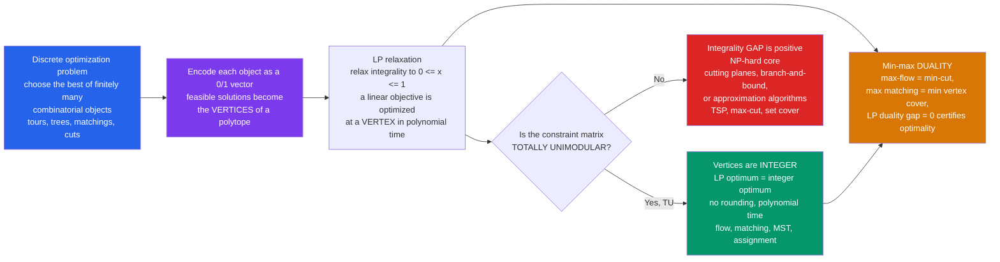

# 🧊 Combinatorial Optimization and Polytopes

> [!abstract] TL;DR
> **Combinatorial optimization** is the art of finding the single best object among a *finite but astronomically large* set of discrete structures — the shortest route, the cheapest spanning tree, the biggest matching, the tightest cut. The **polyhedral viewpoint** is the master idea that tames it: encode each discrete solution as a 0/1 vector, and the feasible solutions become the **vertices of a polytope**. A linear objective is then optimized at a *corner*, so the discrete search becomes **linear programming**. The miracle is that for many classic problems the constraint matrix is **totally unimodular**, forcing every LP vertex to be *integer* — the relaxation solves the discrete problem exactly, in polynomial time, with **no rounding**. And the optimum comes paired with a certificate: a **min-max duality theorem** (max-flow = min-cut, max matching = min vertex cover) whose gap is provably zero. Where total unimodularity fails, you enter the **NP-hard** wild — TSP, max-cut, set cover — and trade exactness for cutting planes, branch-and-bound, or approximation.

---

## Intuition

**Analogy — the best answer is a corner you can climb to.** Imagine you must find the cheapest way to connect every city on a map with roads, or the shortest tour that visits them all. The number of possible road networks or tours is *finite* but grows explosively — checking each one is hopeless past a handful of cities. The brute-force instinct is to enumerate; combinatorial optimization offers a wholly different move. Picture *every* valid discrete choice as a single point in a high-dimensional space — a network becomes a point, a tour becomes a point. Astonishingly, these scattered discrete points turn out to be the **corners of a single geometric solid**, a many-faceted crystal called a **polytope**. Cost becomes a *direction* in that space, and the cheapest solution is simply the corner furthest along that direction.

Now the magic: to find the best corner you never visit them all. Geometry guarantees the optimum sits at a **vertex**, and you can *slide along the edges* of the crystal — always downhill in cost — until no neighboring corner is better. Many "impossible" discrete searches collapse into tractable geometry the instant you see the discrete choices as vertices of a polytope. And the deepest cases hide a second gift: the best corner comes with a matching *lower bound* built from an entirely different combinatorial object (a cut, a cover), and the two meet exactly — a **min equals max** that certifies you have truly found the optimum. Intuition first: **discrete optimization is the geometry of corners.**

---

## How It Works

### Core Mechanics

1. **Discrete objects become 0/1 vectors.** A matching, spanning tree, tour, or cut on a graph with edge set $E$ is encoded by its **indicator vector** $x \in \{0,1\}^{E}$ ($x_e = 1$ if edge $e$ is used). Every feasible object is one lattice point; the objective $\sum_e c_e x_e$ is *linear*.
2. **Wrap the points in a polytope.** Take the **convex hull** of all feasible indicator vectors — that is the problem's **polytope** (the *matching polytope*, the *spanning-tree/base polytope*, the *TSP polytope*). Its **vertices are exactly the feasible discrete objects**. Because a linear function on a polytope always attains its optimum at a vertex, *optimizing over the discrete set is optimizing over the polytope*.
3. **The LP relaxation.** We rarely know the hull's facets explicitly, so we *relax*: drop $x_e \in \{0,1\}$ to $0 \le x_e \le 1$ plus the "easy" combinatorial constraints (degree bounds, cut inequalities). This is a **linear program**, solvable in polynomial time by the [[Simplex_Method|simplex]] or [[Interior_Point_Methods|interior-point]] methods. The relaxation's optimum is a *lower bound* (for minimization) on the true integer optimum.
4. **When is the relaxation tight? Total unimodularity.** A matrix $A$ is **totally unimodular (TU)** if every square submatrix has determinant in $\{-1, 0, +1\}$. **Theorem (Hoffman–Kruskal):** if $A$ is TU and $b$ is integer, then *every vertex of $\{x : Ax \le b,\ x \ge 0\}$ is integer*. So the LP relaxation's optimal vertex is automatically integral — no rounding, exact answer, polynomial time. **Network/incidence matrices are TU**, which is precisely why *shortest paths, max-flow, min-cost flow, bipartite matching, and MST* are all polynomial.
5. **Min-max duality certifies the answer.** Every LP has a **dual** LP; **strong duality** says their optima are equal (**zero duality gap**). Specialized to combinatorial problems this yields the crown-jewel theorems: **max-flow = min-cut**, **König's** max matching = min vertex cover, **Menger's** disjoint paths = min separator, **Dilworth's** chain/antichain theorem. The dual optimum is a *certificate* — a small object proving no better solution exists.
6. **Greedy and matroids.** Some problems need no LP at all: the **greedy algorithm** is provably optimal *exactly* on a **matroid** (MST via Kruskal is the graphic matroid; the base polytope's tight description makes greedy exact). Matroids and their generalization **submodular functions** delineate the boundary of "easy."
7. **Beyond TU: the NP-hard frontier.** For **TSP, max-cut, set cover, knapsack**, the polytope has *exponentially many facets* and no compact TU description; the LP relaxation leaves an **integrality gap**. Here you *tighten* the relaxation with **cutting planes** (adding valid facet inequalities — subtour-elimination, comb inequalities), branch-and-bound to integer solutions, or accept an **approximation** whose ratio is bounded by the gap.

### Flow / Architecture



---

## Key Concepts

### Secondary — the big idea
- A **combinatorial optimization problem** picks the best out of a huge but finite list of discrete choices: the cheapest set of roads connecting all towns, the fastest route, the largest set of non-clashing pairings.
- You cannot check every option — there are too many. The trick: turn each option into a *point*, and all the points become the **corners of a geometric shape**.
- The best option is always a **corner**, and you can walk from corner to neighboring corner, always improving, until you reach the top. That is far faster than listing everything.
- Some problems are "easy" (a corner-walk always lands on a whole-number answer) and some are "hard" (you may only get *close* to the best) — a distinction with a precise geometric cause.

### Undergraduate — the machinery
- **Indicator vectors and polytopes.** Each feasible structure $S$ is $\chi_S \in \{0,1\}^E$; the **polytope** is $\operatorname{conv}\{\chi_S\}$, whose vertices are the structures. Linear objective $\Rightarrow$ optimum at a vertex — the theoretical basis of LP-based combinatorial optimization.
- **LP relaxation and integrality.** Replace $x \in \{0,1\}$ by $0 \le x \le 1$. The LP optimum $\le$ integer optimum (for max); the **integrality gap** measures the slack. If the polytope's *natural* LP description has only integer vertices, the relaxation is **exact**.
- **Total unimodularity (TU).** Every square submatrix has $\det \in \{-1,0,1\}$. **Incidence matrices of directed graphs** and **interval / consecutive-ones matrices** are TU. TU + integer RHS $\Rightarrow$ integral polytope $\Rightarrow$ the LP *solves* the integer program. This single property explains why flows, shortest paths, bipartite matching, and transportation are all polynomial-time.
- **LP duality = min-max theorems.** [[LP_Duality|Strong duality]] with zero gap specializes to **max-flow min-cut** and König's theorem. The dual variables are *prices/potentials*; complementary slackness pins down which constraints are tight at the optimum.
- **Greedy and matroids.** Kruskal's [[Minimum_Spanning_Tree|MST]] greedy is optimal because forests form a **matroid**; the *matroid* is precisely the structure on which greedy is guaranteed optimal (Rado–Edmonds theorem).

### Graduate — the theory
- **Polyhedral combinatorics.** Give a combinatorial polytope an *explicit* inequality description (its **facets**) and you can optimize over it by LP. **Edmonds' matching polytope theorem**: the perfect-matching polytope of a general graph is exactly $\{x \ge 0 : x(\delta(v)) = 1,\ x(\delta(S)) \ge 1 \text{ for odd } |S|\}$ — the **blossom inequalities** are the missing facets beyond the TU bipartite case. This is the polyhedral proof that general matching is polynomial even though its constraint matrix is *not* TU.
- **The ellipsoid method and separation = optimization.** **Grötschel–Lovász–Schrijver:** you can optimize a linear function over a polytope in polynomial time **iff** you can solve its **separation problem** (given $x$, find a violated facet or assert none) in polynomial time. This is why exponentially many facets (TSP subtour constraints) can still be handled — you *separate* on demand rather than list them.
- **Cutting planes and branch-and-cut.** **Gomory cuts** and **Chvátal–Gomory closures** iteratively tighten the relaxation toward the integer hull; modern **branch-and-cut** (the engine of CPLEX/Gurobi) drives exact TSP solutions to thousands of cities.
- **Integrality gaps and approximation.** For NP-hard problems the LP (or SDP) relaxation's **integrality gap** bounds achievable approximation. **LP rounding** (deterministic, randomized, iterative), the **primal-dual schema**, and **SDP relaxations** (Goemans–Williamson $0.878$ max-cut) are the systematic techniques; the **Unique Games Conjecture** predicts many of these gaps are *optimal*.
- **Matroids, submodularity, and the greedy frontier.** **Matroid intersection** and **submodular function minimization** are polynomial; **matroid union** and **polymatroids** generalize flows. **Submodular maximization** is NP-hard but $(1-1/e)$-approximable by greedy — the modern boundary between tractable and intractable combinatorial optimization.

---

## Python Demo

```python
# Combinatorial optimization as GEOMETRY: the optimum lives at a VERTEX of a
# polytope, and for TOTALLY UNIMODULAR systems every vertex is INTEGER, so the
# LP relaxation already solves the discrete problem (no rounding). Strong LP
# DUALITY then certifies the answer with a zero gap (a min-max theorem).
#
#   (1) verify TOTAL UNIMODULARITY of a constraint matrix  -> integral vertices
#   (2) solve a tiny 2-var LP by VERTEX ENUMERATION; the optimum is an INTEGER
#       vertex; verify STRONG DUALITY (primal optimum == dual optimum, gap = 0).
#       Plot the polytope, its integer vertices, and the optimum.
#   (3) ASSIGNMENT / Birkhoff polytope: its vertices are PERMUTATION matrices
#       (Birkhoff-von Neumann, a consequence of TU) -> the assignment LP optimum
#       is automatically a 0/1 permutation, no rounding needed.

import itertools
import numpy as np
import matplotlib.pyplot as plt

# ---------- (1) TOTAL UNIMODULARITY test ------------------------------------
def is_totally_unimodular(A):
    A = np.asarray(A, dtype=float)
    m, n = A.shape
    for k in range(1, min(m, n) + 1):
        for rows in itertools.combinations(range(m), k):
            for cols in itertools.combinations(range(n), k):
                d = round(np.linalg.det(A[np.ix_(rows, cols)]))
                if d not in (-1, 0, 1):
                    return False, (rows, cols, d)
    return True, None

# constraint matrix of   max  c . x   s.t.  A x <= b,  x >= 0
A = np.array([[1, 1],    # x1 + x2 <= 3   (an interval / consecutive-ones matrix)
              [1, 0],    # x1      <= 2
              [0, 1]])   #      x2 <= 2
b = np.array([3, 2, 2])
c = np.array([1, 2])     # maximize x1 + 2 x2

tu, cert = is_totally_unimodular(A)
print("Constraint matrix A is totally unimodular:", tu,
      " => every LP vertex is INTEGER when b is integer.")

# ---------- (2) solve the 2D LP by VERTEX ENUMERATION -----------------------
# full inequality system  G z <= h  (the 3 constraints plus x1>=0, x2>=0)
G = np.vstack([A, [-1, 0], [0, -1]])
h = np.concatenate([b, [0, 0]])

def feasible(z, tol=1e-9):
    return np.all(G @ z <= h + tol)

# every vertex is the intersection of two tight constraints
verts = []
for i, j in itertools.combinations(range(G.shape[0]), 2):
    M = G[[i, j]]
    if abs(np.linalg.det(M)) < 1e-9:
        continue
    z = np.linalg.solve(M, h[[i, j]])
    if feasible(z):
        verts.append(tuple(np.round(z, 9)))
verts = np.array(sorted(set(verts)))

obj = verts @ c
k = int(np.argmax(obj))
x_star, p_star = verts[k], obj[k]
print("Feasible vertices (all INTEGER):", [tuple(map(int, v)) for v in verts])
print(f"Primal optimum  x* = {tuple(map(int, x_star))}   value = {p_star:.0f}")

# ---------- dual LP:  min b . y   s.t.  A^T y >= c,  y >= 0 ------------------
# optimal dual certificate (from complementary slackness at x* = (1, 2)):  y* = (1, 0, 1)
y_star = np.array([1.0, 0.0, 1.0])
dual_ok = np.all(A.T @ y_star >= c - 1e-9) and np.all(y_star >= -1e-9)
d_star = b @ y_star
print(f"Dual   optimum  y* = {tuple(y_star)}   feasible = {dual_ok}   value = {d_star:.0f}")
print(f"DUALITY GAP = primal - dual = {p_star - d_star:.0f}   (strong duality: min = max)")

# ---------- (3) ASSIGNMENT: Birkhoff polytope vertices are PERMUTATIONS ------
# tiny 3x3 cost matrix; minimize total assignment cost over permutation matrices.
C = np.array([[9, 2, 7],
              [6, 4, 3],
              [5, 8, 1]])
n = C.shape[0]
best_perm, best_cost = None, np.inf
for perm in itertools.permutations(range(n)):
    cost = sum(C[i, perm[i]] for i in range(n))
    if cost < best_cost:
        best_cost, best_perm = cost, perm
X = np.zeros((n, n), dtype=int)          # the optimal LP vertex as a 0/1 matrix
for i, j in enumerate(best_perm):
    X[i, j] = 1
print("\nAssignment LP optimum is a PERMUTATION MATRIX (integral, no rounding):")
print(X, "  cost =", best_cost)

# ---------- plot the 2D polytope + integer vertices + optimum + zero gap -----
ctr = verts.mean(axis=0)
poly = verts[np.argsort(np.arctan2(verts[:, 1] - ctr[1], verts[:, 0] - ctr[0]))]

fig, ax = plt.subplots(figsize=(7.4, 6.8))
ax.fill(poly[:, 0], poly[:, 1], color="#bfdbfe", alpha=0.7, zorder=1,
        label="feasible polytope   A x <= b,  x >= 0")
ax.plot(np.append(poly[:, 0], poly[0, 0]),
        np.append(poly[:, 1], poly[0, 1]), color="#2563eb", lw=2, zorder=2)

# integer lattice points inside the polytope
for xi in range(0, 4):
    for yi in range(0, 4):
        if feasible(np.array([xi, yi])):
            ax.scatter(xi, yi, s=16, color="#64748b", zorder=3)

# level lines of the objective  c . x = const  (the sliding hyperplane)
for val in [2, 4, 5]:
    xs = np.array([-0.5, 3.5])
    ax.plot(xs, (val - c[0] * xs) / c[1], ls="--", color="#f59e0b", alpha=0.6, zorder=2)
ax.annotate("objective c = (1, 2)", xy=(0.35, 2.75), color="#b45309", fontweight="bold")

ax.scatter(verts[:, 0], verts[:, 1], s=130, color="#2563eb", edgecolors="k",
           zorder=4, label="vertices  (all INTEGER, by total unimodularity)")
ax.scatter([x_star[0]], [x_star[1]], s=340, color="#dc2626", edgecolors="k",
           zorder=5, label=f"optimum x* = {tuple(map(int, x_star))},  value = {p_star:.0f}")

ax.set_title("Combinatorial optimum lives at an INTEGER VERTEX\n"
             f"primal {p_star:.0f}  =  dual {d_star:.0f}   ->   duality gap = 0",
             fontweight="bold")
ax.set_xlabel("x1"); ax.set_ylabel("x2")
ax.set_xlim(-0.6, 3.6); ax.set_ylim(-0.6, 3.2)
ax.legend(loc="upper right", fontsize=8); ax.grid(alpha=0.25)
plt.tight_layout()
plt.savefig("combinatorial_optimization_polytope.png", dpi=120)
plt.show()
```

**Expected console output:**

```
Constraint matrix A is totally unimodular: True  => every LP vertex is INTEGER when b is integer.
Feasible vertices (all INTEGER): [(0, 0), (0, 2), (1, 2), (2, 0), (2, 1)]
Primal optimum  x* = (1, 2)   value = 5
Dual   optimum  y* = (1.0, 0.0, 1.0)   feasible = True   value = 5
DUALITY GAP = primal - dual = 0   (strong duality: min = max)

Assignment LP optimum is a PERMUTATION MATRIX (integral, no rounding):
[[0 1 0]
 [1 0 0]
 [0 0 1]]  cost = 9
```

The demo makes the whole thesis concrete. **Total unimodularity** is verified by brute-force determinant check — so, by Hoffman–Kruskal, every vertex of the feasible polygon is a lattice point, which the enumeration confirms: all five vertices $(0,0),(0,2),(1,2),(2,0),(2,1)$ are integer with **no rounding required**. The linear objective slides until it hits the corner $(1,2)$ with value $5$, and the **dual** LP attains the *same* value $5$ at $y^\*=(1,0,1)$ — the **duality gap is exactly zero**, the numerical face of every combinatorial min-max theorem. Part (3) shows the same integrality for **assignment**: the Birkhoff polytope's vertices are permutation matrices (Birkhoff–von Neumann), so the cost-minimizing LP vertex is automatically the 0/1 permutation $\{0{\to}1, 1{\to}0, 2{\to}2\}$ of cost $9$ — the relaxation *is* the exact combinatorial answer.

---

## Real-World Applications

> **Example — airline crew scheduling and vehicle routing (branch-and-cut in production).** Assigning crews to flights or trucks to delivery routes is a giant **set-partitioning / TSP-with-side-constraints** problem. Solvers like **Gurobi** and **CPLEX** model it as an integer program, solve the **LP relaxation** to get a bound, then **separate cutting planes** (subtour-elimination, comb, clique inequalities) and **branch** — the exact polyhedral machinery above. When the underlying structure is a network (shift-connection graphs), the relaxation is *near-integral* and huge instances solve fast; when it is not, the integrality gap is what the cuts fight to close.

- **Network flow and logistics.** Max-flow / min-cost-flow route packets, oil, and freight; because the node-arc incidence matrix is **totally unimodular**, the LP gives an integer flow directly — the reason [[Network_Flow|flow]] is the workhorse of operations research.
- **Matching markets.** Ride-hailing dispatch, ad-impression allocation, kidney-exchange, and residency matching solve **assignment / matching LPs**; bipartite cases are TU (exact and fast), general matching uses Edmonds' blossom facets.
- **Chip design and register allocation.** VLSI placement, routing, and compiler register allocation are cut / coloring / matching problems attacked by LP/SDP relaxation plus rounding.
- **Telecom and network design.** Minimum spanning / Steiner trees, survivable-network design, and frequency assignment are combinatorial optimization over graph polytopes; Steiner-tree cutting planes power backbone planning.
- **Machine learning.** MAP inference in graphical models is an integer LP over the **marginal polytope**; its LP relaxation (the **local polytope**) and submodular energy minimization (graph cuts) drive image segmentation and structured prediction — linking to [[Integer_Programming|integer programming]] and [[Convex_Sets|convex relaxation]].
- **Portfolio and resource allocation with indivisibility.** Capital budgeting, knapsack, and facility location are NP-hard IPs where the LP relaxation's integrality gap bounds the achievable approximation.

---

## Common Pitfalls

- **Confusing the LP optimum with the integer optimum.** The relaxation gives a *bound*, not the answer, unless the polytope is integral. For a general integer program the gap can be large; **rounding an LP solution can be arbitrarily bad or even infeasible**. Only when the matrix is TU (or the polytope is otherwise known to be integral) is "solve the LP" the same as "solve the problem."
- **Assuming total unimodularity when it does not hold.** TU is a *strong* property: **directed-graph incidence and interval matrices are TU, but general 0/1 constraint matrices are not** (odd cycles, general matching, set cover break it). Check it (every square submatrix's determinant in $\{-1,0,1\}$) rather than assume it; a single $\det = 2$ submatrix can create a fractional vertex like $\tfrac12$ in odd-cycle matching.
- **Believing the natural LP has all the facets.** The polytope's *true* description may need **exponentially many** inequalities (subtour-elimination for TSP, blossom inequalities for matching). Optimizing over the *naive* relaxation gives a weak bound; you must add cutting planes / use separation. Exponential facet count is normal, not a bug.
- **Enumerating vertices to "solve" it.** A combinatorial polytope can have **exponentially or super-exponentially many vertices** (the $n$-permutation Birkhoff polytope has $n!$ of them). Vertex enumeration only works for toy instances — the whole point of the polyhedral method is to reach the optimal vertex *without* listing them, via simplex/interior-point plus separation.
- **Rounding vs. exact when the problem is NP-hard.** For max-cut, set cover, or TSP there is *no* polynomial exact algorithm unless P = NP; insisting on exactness on large instances can run forever. Know when to switch to **approximation with a proven ratio** (greedy set-cover $H_n$, Goemans–Williamson $0.878$ max-cut) — and know that the **integrality gap** lower-bounds what any LP-rounding scheme can achieve.
- **Ignoring the dual certificate.** Reporting a solution without its dual bound means you cannot *prove* optimality (or the approximation ratio). The min-max / duality partner is not a curiosity — it is the certificate that makes the answer trustworthy and the branch-and-bound tree prunable.
- **Weak modeling.** Two IP formulations of the *same* problem can have wildly different LP relaxations; a "tighter" formulation (closer to the integer hull) can turn an intractable model into an easy one. Formulation strength, not solver choice, is often the deciding factor.

---

## Related Concepts

- [[Integer_Programming]] — the general form ("optimize a linear objective over integer points of a polyhedron"); combinatorial optimization is its structured, graph-flavored subclass where the polytope often has special (TU, matroid) structure.
- [[LP_Duality]] — strong duality with zero gap *is* the abstract engine behind every combinatorial min-max theorem (max-flow min-cut, König, Menger, Dilworth).
- [[Duality_Theory]] — the broader convex-duality frame (Lagrangian, weak/strong duality) in which LP and combinatorial min-max sit.
- [[Convex_Sets]] — polytopes are bounded convex sets; "optimum at a vertex" and the separation-equals-optimization principle are convex-geometry facts.
- [[Simplex_Method]] — the classic vertex-hopping LP algorithm: it literally walks the edges of the polytope to the optimal corner described here.
- [[Network_Flow]] — the flagship TU problem; max-flow / min-cost-flow LPs have integral optima and underlie bipartite matching, shortest paths, and assignment.
- [[Minimum_Spanning_Tree]] — the greedy/matroid archetype: forests form a matroid, so Kruskal's greedy is exact and the base polytope is integral.
- [[Bipartite_Matching]] — the canonical TU polytope; König's theorem is its LP-duality min-max, and the assignment problem is its weighted version.
- [[Dijkstra]] — shortest paths are a TU (network) LP; distances are dual potentials, and the algorithm is a combinatorial primal-dual method.
- [[Greedy_Fundamentals]] — greedy is provably optimal exactly on matroids; this note explains *why* (the base-polytope / exchange structure) and where it fails.
- [[Graph_Theory]] — supplies the objects (trees, cuts, matchings, tours) that become polytope vertices.
- [[Combinatorics]] — the discrete-mathematics groundwork of counting and structure that combinatorial optimization *optimizes* over.
- [[NP_Completeness_and_the_Cook_Levin_Theorem]] — draws the line between TU-tractable problems and the NP-hard core (TSP, max-cut, set cover) where the integrality gap opens.
- [[Approximation_Algorithms_and_Inapproximability]] — when exact optimization is NP-hard, integrality gaps of LP/SDP relaxations bound the best achievable approximation ratio.
- [[P_versus_NP]] — the polyhedral divide (polynomial separation ⇔ polynomial optimization) is one concrete lens on which combinatorial problems are efficiently solvable.

*Siblings in this Combinatorics vault (prose references): **Matching Theory and Hall's Theorem** — König's min-max is the bipartite matching polytope's LP duality, and Edmonds' blossom inequalities are the missing facets for general matching; **Enumerative Graph Theory** — counts the very objects (spanning trees via Matrix-Tree, matchings via permanents) whose convex hulls form these polytopes; **Combinatorics in Computer Science** — where these polyhedral algorithms become the routing, scheduling, and allocation engines of real systems; **Posets and Lattices** — Dilworth's and Mirsky's chain/antichain theorems are order-theoretic min-max results provable by LP duality and network flow.*

---

## Review Questions

1. **(Secondary)** You must connect five towns with the cheapest possible set of roads so all towns are linked. There are hundreds of possible road networks. Explain, using the "corners of a shape" picture, why you do not need to examine every network to find the cheapest one, and what "walking along an edge to a better corner" means.
2. **(Undergraduate — scenario)** You model an assignment problem (workers to jobs) as a 0/1 program, but your boss says "integer programming is NP-hard, this will be slow." Explain why *this particular* integer program is actually solved exactly by its **LP relaxation** in polynomial time. What property of the constraint matrix guarantees the LP's optimal vertex is a permutation matrix, and how would the story change if the graph were **non-bipartite** (general matching)?
3. **(Graduate — trade-off)** The TSP polytope requires **exponentially many** subtour-elimination and comb inequalities, yet TSP with tens of thousands of cities is solved to optimality in practice. Reconcile this with the exponential facet count using the **separation = optimization** (Grötschel–Lovász–Schrijver) principle. Then contrast: for **max-cut**, why does *no* polynomial-size LP or even the natural SDP close the integrality gap, and what does the Goemans–Williamson $0.878$ result (and the Unique Games Conjecture) say about the best you can hope for?

---

## Sources

- Alexander Schrijver, *Combinatorial Optimization: Polyhedra and Efficiency* (Springer, 2003) — the definitive three-volume reference on polytopes, total unimodularity, matching, flows, and min-max theorems.
- Bernhard Korte & Jens Vygen, *Combinatorial Optimization: Theory and Algorithms* (6th ed., Springer, 2018) — the standard modern graduate textbook; LP, TU, matroids, matching, approximation.
- Christos Papadimitriou & Kenneth Steiglitz, *Combinatorial Optimization: Algorithms and Complexity* (Dover, 1998) — classic unified treatment of LP duality, network flows, and NP-hardness.
- William Cook, William Cunningham, William Pulleyblank & Alexander Schrijver, *Combinatorial Optimization* (Wiley, 1998) — polyhedral methods, matching, matroids, and the ellipsoid/separation viewpoint.
- Jon Lee, *A First Course in Combinatorial Optimization* (Cambridge, 2004) — accessible polyhedral and matroid-centered introduction.

---

#combinatorics #combinatorial-optimization #polytopes #linear-programming #duality
