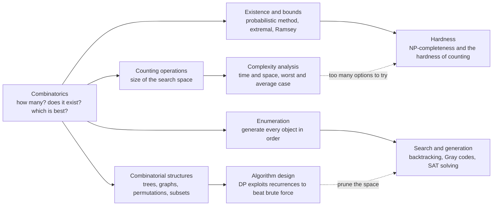

# 💻 Combinatorics in Computer Science

> [!abstract] TL;DR
> Every time an algorithm asks *how many ways?*, *does a valid arrangement exist?*, or *which of these exponentially many options is best?*, it is doing combinatorics. Counting the operations a program performs is **complexity analysis**; the trees, graphs, permutations, and subsets it manipulates are **combinatorial structures**; proving a search space is too big to brute-force is **intractability**; and generating candidate solutions is **enumeration**. Theoretical computer science is, to a first approximation, combinatorics asked with a stopwatch and a memory budget — this note opens the *Applications and Frontiers* section by mapping that deep intertwining before the vault zooms into optimization, coding, games, and random structures.

---

## Intuition

**Analogy — the locksmith and the safe-cracker.** A locksmith who forgets the combination has two ways forward. The naive way is to *try every dial setting*: with 3 dials of 100 positions that is a million attempts, and adding one more dial multiplies the work by another hundred. The clever way is to *reason about the structure* — notice that the third dial only matters once the first two are close, prune whole ranges that click wrong, and reuse partial progress. The first locksmith is running **brute force** and paying the full combinatorial price; the second is exploiting **combinatorial structure** to pay far less. Computer science is the systematic study of when you are forced to be the first locksmith and when you are allowed to be the second.

The moment you translate this into machines, the question sharpens: *how many settings are there* decides whether the safe can be opened before lunch or before the Sun dies. Counting the size of the space is not a side calculation — it is the entire feasibility verdict. That is why counting, the oldest subject in combinatorics, sits underneath the youngest questions in computing.

---

## How It Works

Combinatorics feeds computer science through four channels, and almost every classical result in the theory of computing lives in one of them. **Counting** the operations an algorithm performs turns a program into a growth rate — this is complexity analysis. **Structures** studied by combinatorics (trees, graphs, permutations, subsets, lattice paths) are exactly the data structures and objects algorithms manipulate, and their *recurrences* become dynamic programs. **Existence** results — the probabilistic method, extremal and Ramsey bounds — become both randomized algorithms and lower bounds that say "no fast method can exist." **Enumeration** — generating every object in a well-defined order — powers search, backtracking, and combinatorial generation.

### Core Mechanics

1. **Counting operations gives complexity.** Add up how many times the inner loop runs as a function of input size `n`, and you get the time complexity — a sum, a product, or a recurrence solved by the Master Theorem. The *analysis of algorithms* pioneered by Knuth and given generating-function machinery by Flajolet and Sedgewick is nothing but careful combinatorial counting of steps, both worst-case and average-case.
2. **Recurrences become dynamic programming.** A combinatorial recurrence like Pascal's rule `paths(i,j) = paths(i-1,j) + paths(i,j-1)` says the count of a big object is built from counts of smaller overlapping subproblems. Storing those subproblem answers once — dynamic programming — replaces an exponential re-enumeration with a polynomial table. The recurrence is the combinatorics; the table is the computer science.
3. **Combinatorial explosion becomes intractability.** When the search space grows like `2^n` or `n!` and no structure lets you prune it, brute force is hopeless. Complexity theory formalizes this: **NP-complete** decision problems (SAT, TSP, clique, graph coloring) are combinatorial questions where verifying a solution is easy but finding one appears to require searching exponentially many candidates.
4. **Counting is even harder than deciding.** Asking *how many* solutions exist — not just whether one does — defines the class **#P**. Counting the permanent of a 0/1 matrix, or the number of satisfying assignments of a formula, is #P-hard: believed strictly harder than the corresponding NP decision problem.
5. **Existence proofs become algorithms and lower bounds.** The probabilistic method — "a random object has the property with positive probability, so one exists" — is constructive in disguise: it often yields a randomized algorithm. Extremal and Ramsey-style counting arguments, run in reverse, prove *lower bounds* in communication complexity and circuit complexity: some functions simply need many bits or many gates.
6. **Enumeration drives search.** Generating all subsets (Gray codes flip one bit at a time), all permutations, or all spanning trees systematically is combinatorial generation; backtracking prunes that enumeration as it goes, and SAT solvers are industrial-strength pruned enumerators.

### Flow — combinatorics feeding computer science



---

## Key Concepts

The bridge between the two fields is worth crossing at three altitudes.

### Secondary Level
- **Counting steps as work** — a loop from `1` to `n` does `n` operations; two nested loops do `n^2`; halving the range each step does about `log n`. Counting operations is the first act of algorithm analysis.
- **The search space** — a password of length `L` over an alphabet of size `A` has `A^L` possibilities; a lock, a lineup, a seating chart each have a countable number of arrangements. That count decides whether "just try them all" is a plan or a joke.
- **Combinations in code** — "choose `k` of `n` items" appears everywhere from lottery odds to test-case selection, and it is the same `C(n, k)` from the counting rules.

### Undergraduate Level
- **Big-O from combinatorial sums** — worst-case running time is a sum over the operations performed; closed forms like `1 + 2 + ... + n = n(n+1)/2` give the familiar `O(n^2)`, and the Master Theorem solves divide-and-conquer recurrences.
- **Dynamic programming as memoized recurrences** — counting lattice paths, subsets summing to a target, or edit distances all reduce to a combinatorial recurrence whose overlapping subproblems are cached, turning exponential enumeration into polynomial work.
- **Backtracking as pruned enumeration** — systematically generate candidates (subsets, permutations, colorings) and abandon a branch the instant it violates a constraint; the pruning is what separates it from blind brute force.
- **NP-completeness** — SAT, 3-coloring, Hamiltonian cycle, subset-sum, and TSP are combinatorial decision problems all interreducible in polynomial time; a fast algorithm for any one would solve them all.
- **Average-case analysis** — the *expected* number of operations, computed by linearity of expectation over indicator variables (expected records in a permutation, expected comparisons in randomized quicksort `~ 2n ln n`).

### Graduate Level
- **Analytic combinatorics in algorithm analysis** — the symbolic method turns a data-structure specification into a generating function whose singularities give precise average-case asymptotics; Flajolet and Sedgewick systematized this for hashing, tries, and random trees.
- **#P and the hardness of counting** — Valiant's theorem that computing the permanent is #P-complete; counting can be intractable even when the underlying decision or search is easy, with consequences for approximate counting and sampling.
- **The probabilistic method meets derandomization** — existence proofs (Ramsey lower bounds, expander graphs) become randomized algorithms, then get derandomized via conditional expectations, pairwise independence, and the Lovász Local Lemma (Moser-Tardos gives a constructive algorithm).
- **Extremal ideas as lower bounds** — Ramsey and extremal set theory underlie communication-complexity lower bounds (fooling sets, rectangle bounds) and circuit lower bounds; combinatorics tells you what *cannot* be computed cheaply.
- **Combinatorial optimization** — matching, flows, matroids, and the polyhedral structure of the LP relaxation explain why some combinatorial problems are in P (bipartite matching, MST) while superficially similar ones are NP-hard (foreshadowing the next note on optimization and polytopes).

---

## Python Demo

Two experiments make the theme concrete. **(a)** *Counting bounds feasibility*: plot how the search-space size (`n!`, `2^n`, and the central binomial `C(2n, n)` counting monotone grid paths) races past any realistic compute budget — then, for the *same* grid-path problem, compare the number of operations a brute-force enumeration must perform against a dynamic program that exploits Pascal's recurrence, showing the DP does exponentially fewer operations while getting the identical count. **(b)** *Average-case counting*: the expected number of left-to-right maxima (records) in a random permutation of `n` elements is exactly the harmonic number `H_n = Σ 1/k` — a combinatorial average-case result (the same analysis that bounds how often a running maximum updates). We simulate it and overlay the exact formula.

```python
# Combinatorics in CS: counting bounds feasibility, recurrences beat brute force,
# and expected counts give average-case analysis.
import math
import numpy as np
import matplotlib.pyplot as plt

# ---------- (a1) search-space explosion vs a compute budget ----------
ns   = np.arange(1, 21)
fact = np.array([math.factorial(n) for n in ns], dtype=float)   # n! arrangements
pow2 = np.array([2.0 ** n for n in ns])                         # 2^n subsets
cbin = np.array([math.comb(2 * n, n) for n in ns], dtype=float) # C(2n,n) grid paths
budget = 6e10   # ~1 minute at 1 GHz: our "feasible computation" ceiling

# ---------- (a2) brute force vs DP on the SAME problem: monotone grid paths ----------
# Pascal recurrence: paths(i, j) = paths(i-1, j) + paths(i, j-1); answer = C(2n, n).
grid_ns   = np.arange(1, 16)
brute_ops = np.array([math.comb(2 * n, n) for n in grid_ns], dtype=float)  # visit every path
dp_ops    = np.array([(n + 1) ** 2 for n in grid_ns], dtype=float)         # fill (n+1)x(n+1) table

def count_paths_dp(n):
    dp = [[1] * (n + 1) for _ in range(n + 1)]
    for i in range(1, n + 1):
        for j in range(1, n + 1):
            dp[i][j] = dp[i - 1][j] + dp[i][j - 1]   # the combinatorial recurrence
    return dp[n][n]

assert count_paths_dp(6) == math.comb(12, 6)   # DP result == closed form
print(f"6x6 grid paths: DP={count_paths_dp(6)}  ==  C(12,6)={math.comb(12, 6)}")
print(f"n=15 grid: brute force ~ {brute_ops[-1]:.3e} path-visits, "
      f"DP ~ {int(dp_ops[-1])} additions")

# ---------- (b) average-case count: expected records = harmonic number H_n ----------
rng    = np.random.default_rng(0)
sizes  = [2, 5, 10, 20, 50, 100, 200, 500]
trials = 4000
emp = []
for n in sizes:
    total = 0
    for _ in range(trials):
        perm = rng.permutation(n)
        running_max, records = -1, 0
        for x in perm:
            if x > running_max:          # a new left-to-right maximum (a "record")
                running_max, records = x, records + 1
        total += records
    emp.append(total / trials)
Hn = [sum(1.0 / k for k in range(1, n + 1)) for n in sizes]   # exact expectation
print("expected records  (empirical vs H_n):")
for n, e, h in zip(sizes, emp, Hn):
    print(f"  n={n:4d}   sim={e:6.3f}   H_n={h:6.3f}")

# ---------- plots ----------
fig, (ax1, ax2, ax3) = plt.subplots(1, 3, figsize=(16, 4.6))

ax1.semilogy(ns, fact, 'o-', label="n!  arrangements")
ax1.semilogy(ns, pow2, 's-', label="2^n  subsets")
ax1.semilogy(ns, cbin, '^-', label="C(2n, n)  grid paths")
ax1.axhline(budget, color='red', ls='--', label="~1 min at 1 GHz")
ax1.set_xlabel("problem size n"); ax1.set_ylabel("search-space size (log)")
ax1.set_title("Counting bounds feasibility")
ax1.legend(fontsize=8); ax1.grid(True, which='both', alpha=0.3)

ax2.semilogy(grid_ns, brute_ops, 'o-', color='crimson',  label="brute force: visit every path  C(2n, n)")
ax2.semilogy(grid_ns, dp_ops,    's-', color='seagreen', label="DP recurrence: (n+1)^2 additions")
ax2.set_xlabel("grid size n"); ax2.set_ylabel("operations (log)")
ax2.set_title("Same count, exponentially fewer ops")
ax2.legend(fontsize=8); ax2.grid(True, which='both', alpha=0.3)

ax3.semilogx(sizes, emp, 'o', color='navy',   label="empirical mean over 4000 perms")
ax3.semilogx(sizes, Hn,  '-', color='orange', label="exact  E = H_n = sum 1/k")
ax3.set_xlabel("permutation size n"); ax3.set_ylabel("expected number of records")
ax3.set_title("Average-case count matches formula")
ax3.legend(fontsize=8); ax3.grid(True, which='both', alpha=0.3)

plt.tight_layout(); plt.show()
```

**What you see:** Panel 1 — all three space-size curves punch through the red compute-budget line by modest `n`, the visual statement of "you cannot try them all." Panel 2 — for the *identical* path-counting problem, the crimson brute-force curve explodes exponentially while the green DP curve creeps up as a gentle parabola, yet both return the same `C(2n, n)`; the combinatorial recurrence bought an exponential speedup for free. Panel 3 — the simulated expected record count hugs the exact harmonic-number curve `H_n ≈ ln n`, a clean example of average-case analysis done by counting in expectation rather than by worst case.

---

## Real-World Applications

- **Query optimizers (databases)** — a join over `k` tables has a number of possible join orders that grows like the Catalan-scaled `(k-1)!`; PostgreSQL and other planners use dynamic programming (System-R style) and, past a threshold, genetic/heuristic search precisely because the combinatorial space of plans is too large to enumerate.
- **SAT and constraint solvers** — hardware verification, package dependency resolution (`apt`, `conda`), and scheduling reduce to SAT, the canonical NP-complete combinatorial problem; modern CDCL solvers are pruned enumeration engines that tame worst-case exponential search on real instances.
- **Cryptography** — key-space size, password entropy, and the birthday bound behind hash collisions are pure counting arguments; the security of a cipher is a claim that a combinatorial search space is too vast to sweep. See how counting sets the attack cost in symmetric primitives.
- **Bioinformatics** — counting sequence alignments and RNA secondary structures (Catalan-like recurrences) and computing them by dynamic programming (Needleman-Wunsch, Nussinov folding) is combinatorics-on-strings at production scale.
- **Compilers and program analysis** — register allocation is graph coloring (NP-complete), instruction scheduling is combinatorial, and the number of control-flow paths through a function grows exponentially, forcing summarization instead of enumeration.
- **Machine learning** — model selection, feature-subset search (`2^d` subsets), and combinatorial structure in attention and routing all confront the same explosion; approximate counting and sampling (a #P-flavored task) underlie probabilistic inference.

---

## Common Pitfalls

- **Underestimating combinatorial explosion** — "it works on my 10-element test" hides that the space is `2^n` or `n!`; a solution that enumerates the space is not slow, it is *impossible* past small `n`. Always compute the size of the search space before choosing brute force.
- **Confusing counting with constructing** — an existence proof (pigeonhole, probabilistic method) tells you an object exists but hands you no algorithm to build it, and a counting formula tells you *how many* solutions exist without producing one. Extracting an actual object can be far harder than counting or proving existence.
- **Reasoning only about the worst case** — an algorithm can be exponential in the worst case yet fast on average (SAT solvers, quicksort, the simplex method). Average-case combinatorial analysis, computed via expected counts, often explains why "intractable" methods work in practice — but do not let a good average lull you when adversarial inputs are possible.
- **Assuming counting is as easy as deciding** — even when checking or finding a single solution is polynomial, counting *all* solutions can be #P-hard (the permanent versus the determinant is the classic gap). "Just count them" is sometimes strictly harder than the decision problem it sits on top of.
- **Ignoring symmetry when sizing the space** — treating symmetric configurations as distinct inflates both search-space estimates and generated candidates; dividing out the symmetry group (Burnside) can shrink an enumeration by orders of magnitude.

---

## Related Concepts

- [[Combinatorics/01_Foundations_of_Counting/Combinatorics_Overview|Combinatorics Overview]] — the field this note applies; its four themes (count without listing, bijections, existence, extremal bounds) map one-to-one onto the four CS channels above.
- [[Combinatorics/02_Advanced_Counting/Recurrence_Relations_and_Counting|Recurrence Relations and Counting]] — the combinatorial recurrences that become dynamic programs; Pascal's rule is the demo's engine.
- [[Combinatorics/02_Advanced_Counting/Generating_Functions|Generating Functions]] — the algebraic machinery Flajolet and Sedgewick use to extract average-case asymptotics from data-structure specifications.
- [[Combinatorics/02_Advanced_Counting/Catalan_Numbers|Catalan Numbers]] — count binary trees, parenthesizations, and lattice paths that recur throughout algorithms and query planning.
- [[Combinatorics/03_Graph_and_Extremal_Combinatorics/The_Probabilistic_Method|The Probabilistic Method]] — existence proofs that become randomized algorithms and complexity lower bounds.
- [[DSA/10_Dynamic_Programming/DP_Patterns|Dynamic Programming Patterns]] — the algorithmic realization of combinatorial recurrences that beat brute-force enumeration.
- [[DSA/09_Recursion_Backtracking/Backtracking|Backtracking]] — pruned enumeration of a combinatorial search space, the workhorse of constraint search.
- [[DSA/00_Complexity_Analysis/Big_O_Notation|Big-O Notation]] — the language for the counted operation totals that combinatorial analysis produces.
- [[DSA/00_Complexity_Analysis/Time_Complexity_Classes|Time Complexity Classes]] — where `2^n` and `n!` growth land you on the tractable/intractable map.
- [[DSA/12_Competitive_Programming/Combinatorics|Combinatorics for Competitive Programming]] — the hands-on toolkit: `nCr mod p`, factorial precomputation, and counting DP under contest limits.
- [[Theory_of_Computation/04_Complexity_Theory/NP_Completeness_and_the_Cook_Levin_Theorem|NP-Completeness and the Cook-Levin Theorem]] — where combinatorial explosion is formalized as intractability via SAT.
- [[Theory_of_Computation/04_Complexity_Theory/Reductions_and_NP_Complete_Problems|Reductions and NP-Complete Problems]] — how clique, TSP, coloring, and subset-sum are shown to be the same combinatorial difficulty.
- [[Theory_of_Computation/04_Complexity_Theory/P_versus_NP|P versus NP]] — the central question of whether clever combinatorial structure can always replace brute-force search.
- [[Theory_of_Computation/06_Frontiers_of_Computation/Counting_Complexity_and_Equilibria|Counting Complexity and Equilibria]] — the class #P and why counting solutions can be strictly harder than finding one.
- [[Mathematics/04_Discrete_Mathematics/Generating_Functions_and_Recurrences|Generating Functions and Recurrences]] — the discrete-math foundation for solving the recurrences that drive algorithm analysis.
- [[Information_Theory/01_Foundations_of_Information_Theory/Information_Theory_Overview|Information Theory Overview]] — counting "typical" sequences (the asymptotic equipartition property) links entropy to combinatorial enumeration and coding bounds.
- [[Cryptography/02_Symmetric_Cryptography/Hash_Functions|Hash Functions]] — the birthday bound and key-space size are counting arguments that set the cost of brute-force attacks.

This section, *Applications and Frontiers*, continues from here into companion notes: *Combinatorial Optimization and Polytopes* (matching, flows, and the LP/polyhedral view of when combinatorial problems are tractable), *Combinatorial Coding Theory* (error-correcting codes as extremal designs), *Combinatorial Game Theory* (Sprague-Grundy and the arithmetic of positions), *Random Discrete Structures* (random graphs, thresholds, and the second-moment method), and *Analytic Combinatorics* (singularity analysis for precise asymptotics) — each deepening one channel sketched above.

---

## Review Questions

**Secondary**
1. A brute-force program checks every subset of `n` items, and each check takes one microsecond. Roughly how long does it run for `n = 20`, `n = 40`, and `n = 60`? Use `2^n` and explain, in one sentence, why adding just 20 items to the input can turn a one-second job into one that outlasts a human lifetime.

**Undergraduate**
2. The number of monotone paths across an `n x n` grid is `C(2n, n)`, which grows exponentially, yet a dynamic program computes it in `O(n^2)` time. Explain precisely which combinatorial recurrence the DP exploits, why overlapping subproblems make caching pay off, and why the DP's *output* (the count) is exactly the exponential number the brute force would have enumerated one path at a time.

**Graduate**
3. The permanent and the determinant of an `n x n` matrix have nearly identical formulas — a signed sum over permutations for the determinant, an unsigned sum for the permanent — yet the determinant is computable in `O(n^3)` while computing the permanent is #P-complete (Valiant). Explain what the sign does that makes Gaussian elimination possible, why removing it collapses the problem into "counting" rather than "computing," and what this gap says about the relationship between decision, search, and counting complexity. Connect your answer to why efficient *approximate* counting for the permanent (Jerrum-Sinclair-Vigoda) was a major result.

---

## Sources

- [Cormen, Leiserson, Rivest & Stein — *Introduction to Algorithms* (4th ed., MIT Press)](https://mitpress.mit.edu/9780262046305/introduction-to-algorithms/)
- [Graham, Knuth & Patashnik — *Concrete Mathematics* (2nd ed., Addison-Wesley)](https://www-cs-faculty.stanford.edu/~knuth/gkp.html)
- [Flajolet, P. & Sedgewick, R. — *Analytic Combinatorics* (free PDF, Cambridge)](https://algo.inria.fr/flajolet/Publications/book.pdf)
- [Arora, S. & Barak, B. — *Computational Complexity: A Modern Approach* (Cambridge)](https://theory.cs.princeton.edu/complexity/)
- [Valiant, L. — "The Complexity of Computing the Permanent" (Theoretical Computer Science, 1979)](https://www.sciencedirect.com/science/article/pii/0304397579900446)

---

#combinatorics #computer-science #algorithms #complexity #counting
