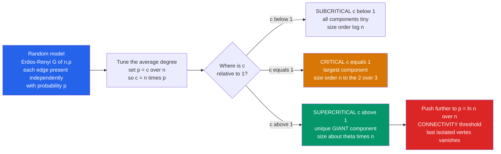

# 🕸️ Random Discrete Structures

> [!abstract] TL;DR
> **Random discrete structures** is the study of combinatorial objects — graphs, permutations, trees, partitions, maps — built by *pure chance*, and the astonishing discovery that chance produces **sharp, universal laws**. The canonical object is the **Erdős–Rényi random graph** $G(n,p)$: put $n$ vertices down and connect each pair independently with probability $p$. As the average degree $c = np$ climbs past the critical value $c = 1$, the graph undergoes a **phase transition** — below it every connected piece is microscopic ($O(\log n)$), above it a single **giant component** of size $\sim\theta n$ abruptly crystallizes. Nearly every graph property (containing a triangle, being connected, being colorable) has a razor-sharp **threshold** $p^\ast$ across which the property flips from *almost never* to *almost surely*. The lesson: large random objects are not messy — they are **concentrated**, and almost all of them look astonishingly alike.

---

## Intuition

**Analogy — the crowd that suddenly becomes one web.** Picture a room of a thousand strangers. You start introducing pairs at random — one handshake at a time. For a long while nothing dramatic happens: you get scattered little cliques, a trio here, a pair there, isolated islands of acquaintance. Then, at a *precise* moment — when the average person has made about **one** connection — something startling occurs. The islands stop being islands. In a sudden rush the little clusters fuse, and a single **giant web** appears that engulfs a constant fraction of the entire room. Add a few more handshakes and almost everyone is reachable from almost everyone else.

That abrupt fusing is not sociology and it is not physics — it is a theorem. It is the birth of the **giant component** in a random graph, and it happens at a sharp, predictable threshold ($c = 1$ average connections per person). This is the signature phenomenon of the whole field: even structures assembled by *nothing but coin flips* obey stunningly sharp, universal laws. Ask "does a huge random graph contain a triangle?" or "is it connected?" and the answer is almost never "sometimes" — it is "**almost surely yes**" above a threshold and "**almost surely no**" a hair below it. Chance, at scale, is not chaos. It is order with a knife-edge.

---

## How It Works

### Core Mechanics

The field rests on defining a **probability distribution over combinatorial objects** and then asking what a *typical* draw looks like as the size $n \to \infty$.

1. **The model.** The **Erdős–Rényi** graph comes in two nearly-equivalent flavors. In $G(n,p)$ each of the $\binom{n}{2}$ possible edges is included **independently** with probability $p$ — the number of edges is random, $\text{Binomial}\big(\binom{n}{2}, p\big)$. In $G(n,m)$ a graph is chosen **uniformly at random** from all graphs with exactly $m$ edges. For $m \approx p\binom{n}{2}$ the two behave identically for almost every question, but $G(n,p)$'s independence makes the algebra vastly easier.

2. **Tune one knob: the average degree.** Set $p = c/n$, so the expected degree of any vertex is $c = np$. Everything interesting is organized by $c$. Locally, a vertex's neighborhood looks like a **branching process** (a Galton–Watson tree) whose offspring count is $\text{Poisson}(c)$ — each new vertex spawns on average $c$ further neighbors.

3. **The phase transition at $c = 1$ (the *double jump*).** A branching process with mean offspring $c$ dies out with probability $1$ when $c \le 1$ and survives with positive probability when $c > 1$. Transplanted to the graph, this gives Erdős and Rényi's 1960 landmark:
   - **Subcritical $c < 1$:** every component is a tiny tree-like blob of size $O(\log n)$. No component holds a positive fraction of the vertices.
   - **Critical $c = 1$:** the largest component swells to size $\Theta(n^{2/3})$ — a fractal, scaling-window regime studied intensely (the Aldous continuum).
   - **Supercritical $c > 1$:** a **unique giant component** appears, containing $\sim\theta n$ vertices, where $\theta$ is the positive root of $\theta = 1 - e^{-c\theta}$ (the survival probability of the branching process). Everything else stays $O(\log n)$.

4. **Thresholds for every monotone property.** Almost any "increasing" property (adding edges only helps) has a **threshold function** $p^\ast(n)$: if $p \gg p^\ast$ the property holds *with high probability* (whp), if $p \ll p^\ast$ it fails whp. Examples: a **triangle** appears around $p^\ast = 1/n$; a fixed subgraph $H$ appears around $p^\ast = n^{-1/m(H)}$ (governed by $H$'s densest subgraph); the graph becomes **connected** and simultaneously loses its last isolated vertex at the sharp threshold $p^\ast = \ln n / n$.

5. **Two moments locate the threshold.** To prove a substructure count $X$ (triangles, say) crosses from absent to present, you use the **first- and second-moment methods** — the workhorses of the probabilistic method. If $\mathbb{E}[X] \to 0$ then $X = 0$ whp (Markov). If $\mathbb{E}[X] \to \infty$ *and* $\mathrm{Var}[X] = o(\mathbb{E}[X]^2)$, then $X > 0$ whp (Chebyshev). The gap between these is exactly why a large mean alone is not enough.

6. **Concentration = typical is almost-sure.** The reason random graphs have "laws" at all is **concentration of measure**: functions that change little when one edge or one vertex is toggled (via **Azuma–Hoeffding** martingale inequalities, Talagrand's inequality) barely deviate from their mean. The chromatic number, the size of the giant, the independence number — all cluster in a tiny window. This underlies the **0–1 law**: for first-order graph properties, the limiting probability is either $0$ or $1$, never in between.

### Flow / Architecture



---

## Key Concepts

### Secondary (school level)
- **Random doesn't mean shapeless.** If you connect people at random, the result is not a formless mess — at a specific tipping point almost every version of the network suddenly grows one huge connected web. Chance produces sharp, repeatable patterns.
- **A tipping point at one connection each.** The magic number is an average of **one** connection per person. Below it: scattered small groups. Above it: one dominant group swallowing a big slice of everyone.
- **Almost-certain answers.** For a giant random network, questions like "is it all connected?" usually have an almost-certain yes or an almost-certain no — rarely a "maybe." The size of the network decides which.

### Undergraduate
- **The two models $G(n,p)$ and $G(n,m)$.** Independent-edge vs fixed-edge-count; asymptotically interchangeable when $m \approx p\binom{n}{2}$, but $G(n,p)$'s independence is what makes expectations factor.
- **The giant-component equation $\theta = 1 - e^{-c\theta}$.** Derived from the survival probability of a $\text{Poisson}(c)$ branching process; $\theta = 0$ is the only root for $c \le 1$, and a positive root splits off exactly at $c = 1$.
- **Subgraph thresholds via the first moment.** Expected number of triangles is $\binom{n}{3}p^3 \sim (np)^3/6$; this tends to $0$ for $p \ll 1/n$ and to $\infty$ for $p \gg 1/n$, pinpointing $p^\ast = 1/n$. The general rule $p^\ast = n^{-1/m(H)}$ uses the **maximum edge density** $m(H) = \max_{H'\subseteq H}\frac{e(H')}{v(H')}$.
- **Connectivity and isolated vertices.** The expected number of isolated vertices is $n(1-p)^{n-1} \approx n\,e^{-np}$; at $p = (\ln n + c)/n$ this converges to $e^{-c}$, and the number of isolated vertices is asymptotically **Poisson** — the last isolated vertex disappears exactly when the graph becomes connected.
- **Whp / almost-surely language.** "With high probability" means probability $\to 1$ as $n \to \infty$; nearly every theorem in the field is a whp statement about *typical* structure, not a worst-case guarantee.

### Graduate
- **The critical window and scaling limit.** Near $c = 1$, writing $p = \frac1n(1 + \lambda n^{-1/3})$, the largest components have size $\Theta(n^{2/3})$ and their rescaled sizes converge to **Aldous's multiplicative coalescent** / the excursions of Brownian motion with parabolic drift — the modern probabilistic heart of the double jump.
- **Second-moment method and sharp vs coarse thresholds.** Friedgut–Kalai and Bourgain's sharp-threshold theory distinguishes properties with a *coarse* threshold (subgraph containment) from those with a *sharp* one (connectivity, $k$-colorability), using discrete Fourier analysis and hypercontractivity.
- **Concentration machinery.** The **Azuma–Hoeffding** vertex/edge-exposure martingales prove the chromatic number $\chi(G(n,1/2))$ is concentrated in an interval of width $O(\sqrt{n}/\log n)$; **Talagrand's inequality** sharpens control of Lipschitz-with-certification functionals.
- **Random permutations and the RSK connection.** A uniform random permutation of $[n]$ has $\sim \ln n$ cycles (the cycle counts are asymptotically independent Poissons — the *Chinese restaurant* / Ewens picture), and its **longest increasing subsequence** has length $\sim 2\sqrt{n}$ with fluctuations following the **Tracy–Widom** distribution, decoded through the **Robinson–Schensted–Knuth** correspondence — the deepest bridge from combinatorics to random-matrix theory.
- **Beyond $G(n,p)$.** Random regular graphs (configuration model), random trees (Galton–Watson, Aldous's Continuum Random Tree), random planar maps (Brownian map), preferential-attachment and inhomogeneous models producing **power-law / scale-free** degrees — each with its own threshold phenomenology, all descendants of the Erdős–Rényi template.

---

## Python Demo

```python
# Random Discrete Structures: the GIANT-COMPONENT phase transition in G(n,p).
#
# (a) Erdos-Renyi G(n,p) with p = c/n.  As the average degree c grows, we measure
#     the fraction of vertices in the LARGEST connected component.
#         c < 1  -> every component is tiny, O(log n): largest fraction -> 0
#         c = 1  -> critical: largest component ~ n^(2/3), fraction still -> 0
#         c > 1  -> a UNIQUE GIANT component of size ~ theta*n suddenly appears,
#                   where theta solves the branching-process fixed point
#                       theta = 1 - exp(-c * theta).
#     The plot shows the SHARP jump at c = 1.
#
# (b) CONNECTIVITY threshold at p = ln(n)/n.  We plot P(graph is connected)
#     against a, where p = a * ln(n)/n, revealing a sharp 0 -> 1 transition at a = 1.
import numpy as np
import matplotlib.pyplot as plt

rng = np.random.default_rng(42)

# ---- union-find on a random edge list; returns array of component sizes ----
def component_sizes(n, u, v):
    parent = np.arange(n)
    def find(x):
        root = x
        while parent[root] != root:
            root = parent[root]
        while parent[x] != root:            # path compression
            parent[x], x = root, parent[x]
        return root
    for a, b in zip(u.tolist(), v.tolist()):
        if a == b:
            continue
        ra, rb = find(a), find(b)
        if ra != rb:
            parent[ra] = rb
    roots = np.fromiter((find(i) for i in range(n)), dtype=int, count=n)
    return np.bincount(roots)               # size of each component (0 for non-roots)

# ---- sample G(n,p): draw #edges ~ Binomial(C(n,2), p), then random endpoints ----
def sample_gnp(n, p, rng):
    max_edges = n * (n - 1) // 2
    m = int(rng.binomial(max_edges, p))
    u = rng.integers(0, n, size=m)
    v = rng.integers(0, n, size=m)
    return u, v

# ---- theoretical giant fraction: fixed point of theta = 1 - exp(-c*theta) ----
def giant_theory(c, iters=300):
    if c <= 1.0:
        return 0.0
    t = 0.5
    for _ in range(iters):
        t = 1.0 - np.exp(-c * t)
    return t

# =============== (a) GIANT COMPONENT vs average degree c ===============
n_a = 4000
cs = np.linspace(0.0, 4.0, 41)
frac = np.empty_like(cs)
for i, c in enumerate(cs):
    u, v = sample_gnp(n_a, c / n_a, rng)
    frac[i] = component_sizes(n_a, u, v).max() / n_a
theory = np.array([giant_theory(c) for c in cs])

print("=== (a) giant component (n = %d) ===" % n_a)
for c, f, t in list(zip(cs, frac, theory))[::5]:
    print(f"  c = {c:4.1f}   largest-comp fraction = {f:5.3f}   theory theta = {t:5.3f}")

# =============== (b) CONNECTIVITY threshold at p = ln(n)/n ===============
n_b = 150
a_vals = np.linspace(0.2, 2.2, 21)
p_connected = np.empty_like(a_vals)
trials = 160
for j, a in enumerate(a_vals):
    p = a * np.log(n_b) / n_b
    hits = 0
    for _ in range(trials):
        u, v = sample_gnp(n_b, p, rng)
        sizes = component_sizes(n_b, u, v)
        if np.count_nonzero(sizes) == 1:    # a single component covers all n vertices
            hits += 1
    p_connected[j] = hits / trials

print("\n=== (b) connectivity threshold (n = %d, p = a*ln n / n) ===" % n_b)
for a, pc in list(zip(a_vals, p_connected))[::4]:
    print(f"  a = {a:4.2f}   P(connected) = {pc:5.3f}")

# =============== plots ===============
fig, (ax1, ax2) = plt.subplots(1, 2, figsize=(13, 5))

ax1.plot(cs, frac, "o-", color="#2563eb", lw=2, ms=4,
         label="simulated  largest-component fraction")
ax1.plot(cs, theory, "--", color="#dc2626", lw=2,
         label=r"theory  $\theta = 1 - e^{-c\theta}$")
ax1.axvline(1.0, color="#059669", ls=":", lw=2, label="critical  c = 1")
ax1.set_xlabel("average degree  c = n p")
ax1.set_ylabel("fraction of vertices in the giant component")
ax1.set_title("Giant-component phase transition in G(n,p)\n"
              "tiny below c=1, a giant suddenly appears above")
ax1.set_ylim(-0.03, 1.03); ax1.legend(); ax1.grid(alpha=0.3)

ax2.plot(a_vals, p_connected, "s-", color="#7c3aed", lw=2, ms=4,
         label="simulated  P(connected)")
ax2.axvline(1.0, color="#dc2626", ls=":", lw=2, label="threshold  p = ln n / n")
ax2.set_xlabel(r"a   where   p = a $\cdot$ ln n / n")
ax2.set_ylabel("probability the graph is connected")
ax2.set_title("Connectivity threshold\nsharp 0 -> 1 jump at a = 1")
ax2.set_ylim(-0.03, 1.03); ax2.legend(); ax2.grid(alpha=0.3)

plt.tight_layout()
plt.savefig("random_discrete_structures.png", dpi=120)
plt.show()
```

**What you see.** The left panel is the double jump made visible: the largest-component fraction hugs zero while $c < 1$, then peels sharply off the axis at $c = 1$ and races up to track the theoretical survival probability $\theta$ that solves $\theta = 1 - e^{-c\theta}$. The right panel shows the connectivity threshold as a clean **0–1 step**: multiply the critical density $\ln n / n$ by anything below $1$ and the graph is almost never connected; multiply by anything above $1$ and it almost always is. Both plots are the same message — a random discrete structure changes its global character *suddenly*, at a mathematically exact location, not gradually.

---

## Real-World Applications

> **Example — the epidemic threshold.** An outbreak on a contact network is a **percolation** process, and it inherits the giant-component transition exactly. If the effective reproduction number $R_0$ (the average number of secondary infections, precisely the branching-process mean $c$) is below $1$, the infection dies out in small local clusters; cross $R_0 = 1$ and a **giant epidemic** reaching a constant fraction of the population becomes possible. The entire logic of "flatten the curve / push $R_0$ below one" is the subcritical-to-supercritical transition of a random graph. The vaccination fraction needed for herd immunity is the fraction of vertices you must delete to knock the giant component back below threshold.

- **Network robustness and attack tolerance.** Deleting random edges/nodes is inverse percolation: a network stays globally connected only while it remains supercritical, so the **percolation threshold** predicts how much random failure (or targeted attack) a power grid, the Internet backbone, or a supply chain can absorb before it shatters into fragments.
- **Phase transitions in computation (SAT).** Random $k$-SAT formulas exhibit a sharp **satisfiability threshold** in the clause-to-variable ratio: below it almost all formulas are satisfiable, above it almost none are, and the *hardest* instances for solvers cluster right at the threshold — a random-structure phase transition governing algorithmic difficulty.
- **Randomized algorithms and data structures.** Hashing (balls into bins), random load balancing, cuckoo hashing's feasibility, and the analysis of union-find all depend on typical random-graph structure — e.g., cuckoo hashing works precisely while its associated random graph stays below the giant-component threshold.
- **Coding theory.** Low-density parity-check (LDPC) and expander codes are analyzed as sparse random bipartite graphs; their decoding thresholds are giant-component / percolation transitions on the Tanner graph.
- **Community detection and null models.** $G(n,p)$ (and its degree-corrected cousin, the configuration model) is the **null model** against which real-world clustering, modularity, and small-world structure are measured — you only trust a detected community if it is unlikely under the random-graph baseline.

---

## Common Pitfalls

- **Believing the transition is gradual.** The giant component and connectivity are **threshold** phenomena: for large $n$ the change from "absent" to "present" happens in a vanishingly thin window of $p$. Reasoning as if the largest component grows smoothly with $p$ — rather than snapping on at $c = 1$ — misreads the entire subject. The sharpness *increases* with $n$.
- **Confusing expectation with concentration.** $\mathbb{E}[X] \to \infty$ does **not** prove the structure $X$ counts actually appears; a highly skewed $X$ can have a huge mean yet be $0$ almost always (a lottery has enormous expected payoff and pays nothing almost surely). You must control the **variance** (second moment) before upgrading "large mean" to "present whp."
- **Treating $G(n,p)$ and $G(n,m)$ as interchangeable for delicate questions.** They agree for most monotone properties when $m \approx p\binom{n}{2}$, but $G(n,m)$ has a *fixed* edge count (no independence), which matters for exact-count statistics, conditioning arguments, and small-window critical behavior. Assuming independence in $G(n,m)$ is a silent error.
- **Using only the first moment for thresholds.** The first moment gives the *upper* side (property absent when $\mathbb{E}[X]\to 0$) for free, but proving the property *appears* below the mean's blow-up needs the **second-moment method** — and it can fail when the object has a rare, high-multiplicity "clumped" contribution (e.g. structures anchored on a single dense subgraph). Skipping the variance check is the classic threshold blunder.
- **Extrapolating asymptotics to finite $n$.** All the clean laws are $n \to \infty$ statements. For the modest graphs you actually simulate, **finite-size effects** smear the transition into a visible ramp, the critical window has real width $\sim n^{2/3}$, and constants matter. A "sharp" jump at $c=1$ in theory is a soft S-curve at $n = 10^3$ — do not mistake the blur for the physics being wrong.

---

## Related Concepts

- [[Combinatorics/01_Foundations_of_Counting/Combinatorics_Overview|Combinatorics Overview]] — situates random structures as the probabilistic wing of combinatorics, complementing exact enumeration with typical-object analysis.
- [[Mathematics/06_Probability_and_Statistics/Probability_Theory|Probability Theory]] — supplies the sample spaces, independence, and limit notions ("with high probability") the whole field is phrased in.
- [[Mathematics/06_Probability_and_Statistics/Random_Variables|Random Variables]] — expectation, variance, and the first/second-moment calculations that pin down every threshold.
- [[Mathematics/06_Probability_and_Statistics/Common_Probability_Distributions|Common Probability Distributions]] — the Binomial/Poisson laws governing edge counts, degrees, and isolated-vertex counts that drive the transitions.
- [[Mathematics/04_Discrete_Mathematics/Graph_Theory|Graph Theory]] — components, connectivity, cliques, and colorings are the properties whose thresholds we compute.
- [[Mathematics/04_Discrete_Mathematics/Combinatorics|Combinatorics (Discrete Mathematics)]] — the counting toolkit ($\binom{n}{k}$, subgraph counts) underlying the moment computations.
- [[Combinatorics/04_Algebraic_and_Bijective_Combinatorics/Young_Tableaux_and_Symmetric_Functions|Young Tableaux and Symmetric Functions]] — the RSK correspondence links random permutations' longest increasing subsequence to Tracy–Widom fluctuations.
- [[Systems_Thinking_and_Complexity/03_Networks_and_Connectivity/Small_World_and_Scale_Free_Networks|Small-World and Scale-Free Networks]] — real networks are measured against $G(n,p)$ as the null model; their power-law degrees are the departure from Erdős–Rényi.
- [[Systems_Thinking_and_Complexity/03_Networks_and_Connectivity/Network_Science_Fundamentals|Network Science Fundamentals]] — the empirical/algorithmic study of the networks whose theoretical baseline is the random graph.
- [[Systems_Thinking_and_Complexity/02_Complexity_and_Emergence/Criticality_and_Phase_Transitions|Criticality and Phase Transitions]] — the giant-component emergence is a textbook second-order phase transition with critical exponents.
- [[Systems_Thinking_and_Complexity/03_Networks_and_Connectivity/Network_Dynamics_and_Contagion|Network Dynamics and Contagion]] — epidemics and information cascades are percolation on graphs, inheriting the $c = 1$ threshold.
- [[Systems_Thinking_and_Complexity/03_Networks_and_Connectivity/Resilience_and_Robustness|Resilience and Robustness]] — network fragmentation under random/targeted removal is inverse percolation across the same transition.
- [[Statistical_Mechanics_and_Machine_Learning/05_Phase_Transitions_and_Learning_Dynamics/Phase_Transitions_in_Learning_and_Inference|Phase Transitions in Learning and Inference]] — the physics of percolation and spin glasses shares the exact mathematics of random-graph thresholds.
- [[Complexity_Economics/03_Networks_Interaction_and_Contagion/Cascades_Contagion_and_Financial_Crises|Cascades, Contagion and Financial Crises]] — systemic risk in financial networks is a giant-component / cascade transition on a random interaction graph.

*Siblings in this vault (referenced in prose): the **Probabilistic Method** supplies the first- and second-moment machinery that proves these thresholds; **Analytic Combinatorics** and **Asymptotic Enumeration** deliver the singularity-based growth laws whose probabilistic counterpart is the random-structure limit theorem; and **Enumerative Graph Theory** counts the labeled graphs that $G(n,m)$ samples uniformly.*

---

## Review Questions

1. **(Secondary)** You keep adding random friendships one at a time to a large group of strangers. Describe what happens to the "biggest circle of mutual reachability" as the average number of friends per person passes one. Why is the change sudden rather than gradual, and why does the size of the group make the jump *sharper*?
2. **(Undergraduate — scenario)** In $G(n,p)$ with $p = c/n$, you want to know whether a **triangle** exists. Compute the expected number of triangles and use it to locate the threshold. Then explain why $\mathbb{E}[\text{triangles}] \to \infty$ is *not by itself* enough to conclude a triangle appears whp, and what additional quantity you must bound.
3. **(Graduate — trade-off)** Contrast the **coarse** threshold for containing a fixed subgraph $H$ (width comparable to the threshold itself) with the **sharp** threshold for connectivity at $p = \ln n / n$ (width $o(1/n)$). Why is connectivity governed by the disappearance of isolated vertices, why is that count asymptotically Poisson, and how does this Poisson picture explain the sharpness? Where would the giant-component result at $c = 1$ sit on the coarse/sharp spectrum, and what makes its **critical window** of width $n^{-1/3}$ special?

---

## Sources

- [Béla Bollobás, *Random Graphs* (2nd ed., Cambridge University Press, 2001)](https://doi.org/10.1017/CBO9780511814068) — the canonical rigorous monograph on $G(n,p)$, thresholds, and the giant component.
- [Svante Janson, Tomasz Łuczak & Andrzej Ruciński, *Random Graphs* (Wiley, 2000)](https://onlinelibrary.wiley.com/doi/book/10.1002/9781118032718) — modern treatment centered on the second-moment method, concentration, and the critical window.
- [Paul Erdős & Alfréd Rényi, "On the evolution of random graphs," *Publ. Math. Inst. Hungar. Acad. Sci.* 5 (1960), 17–61](https://www.renyi.hu/~p_erdos/1960-10.pdf) — the founding paper that discovered the phase transition and the double jump.
- [Noga Alon & Joel Spencer, *The Probabilistic Method* (4th ed., Wiley, 2016)](https://onlinelibrary.wiley.com/doi/book/10.1002/9781119061966) — first/second-moment methods, martingale concentration, and thresholds in $G(n,p)$.
- [Alan Frieze & Michał Karoński, *Introduction to Random Graphs* (Cambridge University Press, 2015; [free PDF](https://www.math.cmu.edu/~af1p/BOOK.pdf))](https://www.math.cmu.edu/~af1p/BOOK.pdf) — accessible modern textbook covering components, connectivity, and subgraph thresholds.

---

#combinatorics #random-graphs #phase-transitions #erdos-renyi #giant-component
