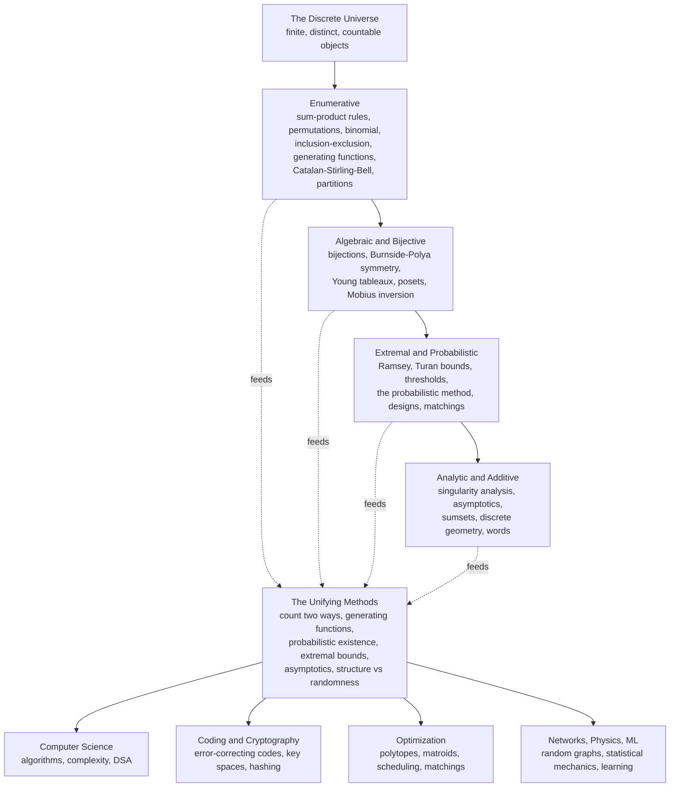

# 🧭 The Reach and Future of Combinatorics

> [!abstract] TL;DR
> Combinatorics — once dismissed as a grab-bag of clever puzzles about handshakes, necklaces, and chessboards — turned out to be **the native mathematics of the computational age**. Its handful of great methods (*count two ways via bijection, encode with generating functions, prove existence probabilistically, bound the extremes, and read growth from asymptotics*) unify its branches — **enumerative, algebraic and bijective, extremal and probabilistic, analytic and geometric** — and feed directly into algorithms, coding, cryptography, optimization, networks, statistical physics, and machine learning. It is the mathematics of a world made of **distinct, countable things**, and as computation and data pervade every science that world only grows. Yet the field stays humble: exact counting is often **#P-hard**, probabilistic proofs establish existence *without construction*, many bounds leave exponential **gaps**, and Erdős-style problems that a child can state (What is `R(5, 5)`? How dense before an arithmetic progression is forced?) have resisted a century of assault. That mix of elementary questions and bottomless depth is exactly what keeps combinatorics young.

---

## Intuition

**Analogy — the "recreational" mathematics that quietly ate the world.** For centuries combinatorics was the toy department of mathematics. Euler amused himself with the seven bridges of Königsberg; Victorian schoolmasters posed the fifteen schoolgirls problem; card players computed poker odds. Serious mathematicians studied *continuous* things — curves, flows, fields — and looked down on counting party handshakes and arranging rooks on a chessboard as mere puzzle-mongering. It was, they thought, mathematics for a rainy afternoon, not for the foundations of anything.

Then the world went *digital*. A computer is a machine that manipulates **distinct, countable states**. An algorithm is a walk through a **finite space of possibilities**. A message is a **string of discrete symbols**; an error-correcting code is a cleverly spread-out **set of such strings**; a cryptographic key is one point in an **astronomically large but countable space**; a neural network's forward pass is a **finite sequence of discrete operations**. Every one of those "rainy-afternoon puzzles" — how many arrangements, how spread out can a set be, when must a pattern appear — became a load-bearing question in engineering and science. The counting of handshakes became the counting of *hash collisions*; the arranging of rooks became the design of *experiments and codes*; Euler's bridges became the *routing of the internet*. Combinatorics is the mathematics of the discrete, and our world — made of bits, packets, tokens, and nodes — is discrete to its core. The toy department turned out to be the engine room.

---

## How It Works

This capstone does not introduce a new technique; it **steps back and looks at the whole map**. Combinatorics is best understood not as one subject but as a **federation of branches bound together by a shared set of master methods**, all pointed at the same kind of object: the finite, discrete structure.

### The branches, synthesized

- **Enumerative combinatorics** is the ground floor: exact counts. It starts from [[Combinatorics/01_Foundations_of_Counting/The_Sum_and_Product_Rules|the sum and product rules]], climbs through [[Combinatorics/01_Foundations_of_Counting/Permutations_and_Combinations|permutations and combinations]], [[Combinatorics/01_Foundations_of_Counting/The_Binomial_Theorem_and_Coefficients|the binomial theorem]], [[Combinatorics/01_Foundations_of_Counting/Inclusion_Exclusion_Principle|inclusion–exclusion]], [[Combinatorics/02_Advanced_Counting/Compositions_and_Multisets|compositions and multisets]], and matures into [[Combinatorics/02_Advanced_Counting/Generating_Functions|generating functions]] and [[Combinatorics/02_Advanced_Counting/Recurrence_Relations_and_Counting|recurrence relations]], with the [[Combinatorics/02_Advanced_Counting/Catalan_Numbers|Catalan]], [[Combinatorics/02_Advanced_Counting/Stirling_and_Bell_Numbers|Stirling and Bell]] numbers and [[Combinatorics/02_Advanced_Counting/Integer_Partitions|integer partitions]] as its recurring cast.
- **Algebraic and bijective combinatorics** asks *why* the counts are what they are. It proves identities by exhibiting [[Combinatorics/04_Algebraic_and_Bijective_Combinatorics/Bijective_Proofs_and_Combinatorial_Identities|explicit bijections]], counts *up to symmetry* with [[Combinatorics/04_Algebraic_and_Bijective_Combinatorics/Group_Actions_and_Burnsides_Lemma|Burnside's lemma]] and [[Combinatorics/04_Algebraic_and_Bijective_Combinatorics/Polya_Enumeration_Theory|Pólya enumeration]], and studies the algebraic scaffolding of [[Combinatorics/04_Algebraic_and_Bijective_Combinatorics/Young_Tableaux_and_Symmetric_Functions|Young tableaux and symmetric functions]], [[Combinatorics/04_Algebraic_and_Bijective_Combinatorics/Posets_and_Lattices|posets and lattices]], and [[Combinatorics/04_Algebraic_and_Bijective_Combinatorics/Mobius_Inversion_and_Incidence_Algebras|Möbius inversion]].
- **Extremal and probabilistic combinatorics** flips the question from "how many?" to "**what must exist, and how large can a structure get before a pattern is unavoidable?**" This is the home of [[Combinatorics/03_Graph_and_Extremal_Combinatorics/Ramsey_Theory|Ramsey theory]] ("complete disorder is impossible"), [[Combinatorics/03_Graph_and_Extremal_Combinatorics/Extremal_Combinatorics|extremal graph and set theory]], [[Combinatorics/03_Graph_and_Extremal_Combinatorics/Matching_Theory_and_Halls_Theorem|matching theory]], [[Combinatorics/03_Graph_and_Extremal_Combinatorics/Combinatorial_Designs|combinatorial designs]], and the crown jewel — [[Combinatorics/03_Graph_and_Extremal_Combinatorics/The_Probabilistic_Method|the probabilistic method]], which proves an object exists by showing a *random* one works with positive probability.
- **Analytic, additive, and geometric combinatorics** zooms out. [[Combinatorics/05_Additive_Analytic_and_Geometric/Analytic_Combinatorics|Analytic combinatorics]] and [[Combinatorics/05_Additive_Analytic_and_Geometric/Asymptotic_Enumeration|asymptotic enumeration]] read *growth rates* off the singularities of a generating function; [[Combinatorics/05_Additive_Analytic_and_Geometric/Additive_Combinatorics|additive combinatorics]] studies sumsets and arithmetic progressions; [[Combinatorics/05_Additive_Analytic_and_Geometric/Combinatorial_Geometry|combinatorial geometry]] counts incidences and lattice points. Words, extremal set theory, and random structures round out the frontier.
- **Applications** draw on all of the above at once — the subject of the whole next section.

### The unifying methods

Beneath the branches sit five moves that a combinatorialist reaches for again and again:

1. **Count two ways / bijection** — if you count the same set by two arguments, the answers must agree; if you biject two sets, they have equal size. The most *explanatory* proofs in the field.
2. **Generating functions** — the "algebra of counting": pack a sequence into a power series and let calculus and algebra do the combinatorics.
3. **The probabilistic method** — existence by averaging. If the expected number of bad structures is below one, a bad-free structure exists.
4. **Extremal bounds and thresholds** — Turán-, Ramsey-, and Szemerédi-type theorems pin down the tipping point at which structure becomes unavoidable.
5. **Asymptotic analysis** — since counts explode, the *rate* of growth (`n!`, `2^n`, `c^n / n^{3/2}`) is often what matters, and analytic combinatorics extracts it mechanically.

Presiding over all of them is a single deep dichotomy — **structure versus randomness**: every large discrete object is either highly *structured* (and therefore describable) or essentially *random* (and therefore governed by probabilistic laws), and much of modern combinatorics is the art of decomposing objects into a structured part plus a pseudorandom part.

### The map of the field



The vertical spine reads as *deepening*, not as a strict prerequisite chain; the dashed arrows show every branch pouring into a shared method-pool that then irrigates the applied sciences.

---

## Key Concepts

The same synthesis, viewed at three altitudes.

### Undergraduate — the great methods as one toolkit

- **The two counting rules and their corrections.** Everything descends from *add for* `or`, *multiply for* `and`, patched by inclusion–exclusion for overlaps and by dividing out symmetry for indistinguishable arrangements.
- **Bijection as proof.** `|A| = |B|` is most convincingly shown by a rule that pairs each element of `A` with exactly one of `B`. Catalan numbers counting *both* balanced parentheses *and* binary trees *and* triangulations is one bijection wearing many costumes.
- **Generating functions as bookkeeping.** A recurrence becomes an algebraic equation once you sum the sequence into a power series; partial fractions then hand back a closed form.
- **The pigeonhole principle.** The humblest existence tool — [[Combinatorics/01_Foundations_of_Counting/The_Pigeonhole_Principle|`n+1` items in `n` boxes force a repeat]] — and the seed of Ramsey theory.

### Graduate — existence, extremes, and asymptotics

- **The probabilistic method.** First- and second-moment arguments, the Lovász Local Lemma, and the alteration method prove that objects exist (Ramsey lower bounds, high-girth high-chromatic graphs) *without building them*.
- **Extremal thresholds.** Turán's theorem (max edges avoiding `K_{r+1}`), Erdős–Ko–Rado (largest intersecting family), Sperner's theorem (largest antichain), and the *threshold phenomena* of random structures where a property appears abruptly.
- **Analytic combinatorics.** The symbolic method turns a combinatorial specification into a generating function *automatically*; **singularity analysis** then reads the asymptotic growth off the dominant singularity — the machine that produces the ubiquitous `c^n n^{-3/2}` law for trees and paths.
- **Algebraic combinatorics.** Symmetric functions, the RSK correspondence, matroids, and Möbius inversion over posets connect counting to representation theory and algebraic geometry.

### Research — the living frontier

- **Additive combinatorics and the polynomial method.** Szemerédi's regularity lemma, the Green–Tao theorem (arbitrarily long arithmetic progressions in the primes), and the **polynomial method** (cap-set problem, Kakeya over finite fields) reframe combinatorics through Fourier analysis and algebra.
- **Structure versus randomness.** The organizing philosophy behind regularity, hypergraph containers, and pseudorandomness — decompose, then handle the structured and random parts separately.
- **Flag algebras and computer-assisted extremal proofs.** Razborov's flag algebras turn asymptotic extremal bounds into semidefinite programs a computer solves.
- **Combinatorics of computation.** The interface with complexity theory: exact counting is `#P`-hard, yet approximate counting via Markov-chain Monte Carlo is often tractable — a discipline of its own.
- **Machines that discover.** SAT solvers settling cases (the Boolean Pythagorean triples, `R(4, 5)`), formal-proof assistants verifying combinatorial theorems, and experimental-mathematics pipelines that *conjecture* identities from data.

---

## Python Demo

A **synthesizing dashboard** — four panels, each the signature of one branch of the vault. **(1)** the combinatorial explosion (`n!`, `2^n`, Catalan) that forces us to count rather than list; **(2)** a row of [[Combinatorics/01_Foundations_of_Counting/The_Binomial_Theorem_and_Coefficients|Pascal's triangle]] flattening into the Gaussian bell curve (de Moivre–Laplace) — a bridge from discrete counting to continuous probability; **(3)** the [[Combinatorics/03_Graph_and_Extremal_Combinatorics/The_Probabilistic_Method|random-graph]] giant-component **phase transition** at mean degree 1, the archetypal extremal threshold; and **(4)** Stirling's law taming the explosion, the founding result of [[Combinatorics/05_Additive_Analytic_and_Geometric/Asymptotic_Enumeration|asymptotic enumeration]]. Four ideas, one figure.

```python
# A gallery of combinatorics: explosion, Gaussian limit, phase transition, asymptotics.
import numpy as np
import matplotlib.pyplot as plt
from math import comb, factorial, lgamma, pi

rng = np.random.default_rng(42)
fig, axes = plt.subplots(2, 2, figsize=(14, 10))

# ---- (1) Combinatorial explosion: n!, 2^n, Catalan numbers ----
ns = np.arange(1, 26)
fact    = np.array([float(factorial(int(n)))              for n in ns])
pow2    = 2.0 ** ns
catalan = np.array([comb(2*int(n), int(n)) / (int(n)+1)   for n in ns])
ax = axes[0, 0]
ax.semilogy(ns, fact,    'o-', label="n! (permutations)")
ax.semilogy(ns, pow2,    's-', label="2^n (subsets)")
ax.semilogy(ns, catalan, '^-', label="C_n (Catalan: trees, paths)")
ax.axhline(8e9, color='gray', ls=':', label="~ world population")
ax.set_xlabel("n"); ax.set_ylabel("count [log scale]")
ax.set_title("1. Combinatorial explosion: why we count, not list")
ax.legend(); ax.grid(True, which='both', alpha=0.3)

# ---- (2) Pascal's triangle row -> Gaussian (de Moivre-Laplace) ----
N   = 60
row = np.array([comb(N, k) for k in range(N + 1)], dtype=float)
pmf = row / row.sum()                    # Binomial(N, 1/2) probabilities
ks  = np.arange(N + 1)
mu, sigma = N / 2.0, np.sqrt(N / 4.0)
gauss = np.exp(-(ks - mu) ** 2 / (2 * sigma ** 2)) / (sigma * np.sqrt(2 * pi))
ax = axes[0, 1]
ax.bar(ks, pmf, width=0.9, alpha=0.5, label="C(N,k) / 2^N  (Pascal row, N=60)")
ax.plot(ks, gauss, 'r-', lw=2, label="Gaussian limit")
ax.set_xlabel("k"); ax.set_ylabel("probability")
ax.set_title("2. Pascal's triangle flattens into the bell curve")
ax.legend(); ax.grid(True, alpha=0.3)

# ---- (3) Erdos-Renyi giant-component phase transition (union-find) ----
def largest_component_fraction(n, m, rng):
    parent = np.arange(n)
    def find(x):
        root = x
        while parent[root] != root:
            root = parent[root]
        while parent[x] != root:            # path compression
            parent[x], x = root, parent[x]
        return root
    eu = rng.integers(0, n, size=m)
    ev = rng.integers(0, n, size=m)
    for u, v in zip(eu, ev):
        ru, rv = find(int(u)), find(int(v))
        if ru != rv:
            parent[ru] = rv
    roots = np.array([find(i) for i in range(n)])
    _, counts = np.unique(roots, return_counts=True)
    return counts.max() / n

n = 2000
avg_deg = np.linspace(0, 3, 31)
frac = [np.mean([largest_component_fraction(n, int(c * n / 2), rng)
                 for _ in range(3)]) for c in avg_deg]
ax = axes[1, 0]
ax.plot(avg_deg, frac, 'o-', color='darkgreen')
ax.axvline(1.0, color='red', ls='--', label="threshold: mean degree = 1")
ax.set_xlabel("average degree  c = 2m / n")
ax.set_ylabel("largest component / n")
ax.set_title("3. Random graph G(n,p): the giant-component transition")
ax.legend(); ax.grid(True, alpha=0.3)

# ---- (4) Stirling's law tames the explosion ----
ns4          = np.arange(2, 31)
log_fact     = np.array([lgamma(int(n) + 1) for n in ns4])
log_stirling = 0.5 * np.log(2 * pi * ns4) + ns4 * np.log(ns4) - ns4
rel_err      = np.abs(log_fact - log_stirling) / log_fact
ax = axes[1, 1]
ax.loglog(ns4, rel_err, 'o-', color='purple')
ax.set_xlabel("n [log]"); ax.set_ylabel("relative error of log(n!) [log]")
ax.set_title("4. Stirling's asymptotic: error shrinks like 1 / n")
ax.grid(True, which='both', alpha=0.3)

plt.tight_layout()
plt.show()

# A one-line sanity check tying panels 1 and 2 together:
print("Sum of Pascal row 60 =", int(row.sum()), " equals 2^60 =", 2**60,
      "->", int(row.sum()) == 2**60)
```

**What you see.** Panel 1: every curve rockets off even a logarithmic axis — enumeration is hopeless, so we *reason out* the number. Panel 2: the jagged discrete histogram of binomial coefficients is indistinguishable from a smooth Gaussian — counting *becomes* continuous probability in the limit (the bridge combinatorics builds to statistics). Panel 3: below mean degree 1 the largest chunk of the random graph is a negligible fraction of `n`; above it a **giant component** snaps into existence — a sharp threshold, the extremal-combinatorics signature. Panel 4: Stirling's approximation for `log(n!)` is already accurate to a fraction of a percent and improves like `1/n` — asymptotics domesticate the explosion of panel 1. The `print` confirms the whole of Pascal's row sums to `2^60`, closing the loop between panels 1 and 2.

---

## Real-World Applications

- **Computer science and algorithms.** The size of a search space is a combinatorial count, and it decides whether brute force is viable; recurrences drive dynamic programming; [[DSA/09_Recursion_Backtracking/Backtracking|backtracking]] is disciplined enumeration; [[DSA/10_Dynamic_Programming/DP_Patterns|counting DP]] evaluates combinatorial recurrences efficiently; and [[DSA/12_Competitive_Programming/Combinatorics|competitive-programming combinatorics]] (`nCr mod p`, Catalan, Stirling) is a staple. The deep tie is to complexity: exact counting sits in `#P`, studied in [[Theory_of_Computation/06_Frontiers_of_Computation/Counting_Complexity_and_Equilibria|counting complexity]], while [[Theory_of_Computation/04_Complexity_Theory/NP_Completeness_and_the_Cook_Levin_Theorem|NP-completeness]] is a statement about combinatorial search.
- **Coding theory and cryptography.** Error-correcting codes are extremal combinatorial designs — sets of codewords packed to maximize minimum distance — as developed in [[Information_Theory/03_Channel_Coding_and_Reliable_Communication/Error_Correcting_Codes_Fundamentals|error-correcting codes]] and [[Information_Theory/01_Foundations_of_Information_Theory/Information_Theory_Overview|information theory]]. Key-space sizes, password entropy, and the birthday bound behind [[Cryptography/02_Symmetric_Cryptography/Hash_Functions|hash collisions]] are pure counting, and the hardness that cryptography rests on is catalogued in [[Cryptography/01_Mathematical_Foundations/Computational_Hardness_Assumptions|computational hardness assumptions]].
- **Optimization and operations research.** Scheduling, routing, and assignment problems are searches over combinatorial sets; matroids and polytopes are the structures that make some tractable and expose why others are NP-hard; [[Combinatorics/03_Graph_and_Extremal_Combinatorics/Matching_Theory_and_Halls_Theorem|matching theory]] underlies assignment and market-clearing, and the strategic version appears in [[Game_Theory/06_Evolutionary_Computational/Algorithmic_Game_Theory|algorithmic game theory]].
- **Networks.** Random-graph models, degree-sequence enumeration, and the giant-component and small-world thresholds are combinatorial phase transitions — the mathematics behind [[Systems_Thinking_and_Complexity/03_Networks_and_Connectivity/Network_Science_Fundamentals|network science]] and [[Systems_Thinking_and_Complexity/03_Networks_and_Connectivity/Small_World_and_Scale_Free_Networks|scale-free networks]].
- **Statistical physics.** The number of microstates consistent with a macrostate is a combinatorial count, and Boltzmann's entropy `S = k ln W` is the logarithm of that count; the Ising model, lattice gases, and [[Statistical_Mechanics_and_Machine_Learning/05_Phase_Transitions_and_Learning_Dynamics/Spin_Glasses_and_the_Energy_Landscape_of_Networks|spin glasses]] are enumeration problems in disguise, and their phase transitions mirror the random-graph threshold above.
- **Biology and chemistry.** Counting sequence alignments, RNA secondary structures (Catalan-like recurrences), phylogenetic trees, and distinct molecular isomers via Pólya enumeration under molecular symmetry.
- **Machine learning and data.** Model-counting and partition-function estimation are `#P`-hard combinatorial sums approximated by sampling; combinatorial structure underlies attention patterns, graph neural networks, and the sample-complexity (VC-dimension) bounds that count the ways a hypothesis class can label data.

---

## Common Pitfalls

Combinatorics is refreshingly honest about what it cannot yet do. The field's hardest lessons are structural, not careless slips:

- **Counting is genuinely hard — often #P-hard.** Deciding whether a solution *exists* can be easy while *counting* solutions is intractable: counting perfect matchings (the permanent), proper colorings, or satisfying assignments are all `#P`-hard. A clean closed form is the exception, not the rule, and its absence is frequently a theorem, not a failure of cleverness.
- **Existence without construction.** The [[Combinatorics/03_Graph_and_Extremal_Combinatorics/The_Probabilistic_Method|probabilistic method]] and the [[Combinatorics/01_Foundations_of_Counting/The_Pigeonhole_Principle|pigeonhole principle]] prove that an object *must* exist while handing you no recipe to build it. Ramsey graphs, high-girth high-chromatic graphs, and good codes are all "known to exist" yet explicit constructions lag far behind — *derandomization* is a whole research program born of this gap.
- **Bounds with exponential gaps.** For many quantities we know only an upper and a lower bound that are exponentially far apart. Diagonal Ramsey numbers are the poster child: `R(k, k)` is pinned only between roughly `√2^k` and `4^k`, and closing even the constant in the exponent is a celebrated open problem.
- **Elementary to state, brutal to solve.** Erdős built a career on problems a schoolchild can understand and no one can crack: exact small Ramsey numbers (`R(5, 5)` is unknown), the Erdős–Szekeres conjecture, the union-closed sets conjecture, sunflower bounds. Simplicity of statement is no guide to difficulty.
- **Asymptotics mislead for small `n`.** Stirling's formula and singularity-analysis estimates are superb as `n → ∞` but can be badly wrong for the small cases you actually compute; always keep exact counts when `n` is tiny (as panel 4 above quietly warns).
- **The map is not the territory.** Two branches may count "the same" objects with utterly different machinery, and a result proved in one language (say, symmetric functions) can be invisible in another (say, generating functions). Fluency means *translating between the methods*, not mastering one and forcing every problem into it.

---

## Related Concepts

**The whole Combinatorics vault, synthesized here**

- **Foundations of counting** — [[Combinatorics/01_Foundations_of_Counting/Combinatorics_Overview|Combinatorics Overview]] (the vault's entry point), [[Combinatorics/01_Foundations_of_Counting/The_Sum_and_Product_Rules|The Sum and Product Rules]], [[Combinatorics/01_Foundations_of_Counting/Permutations_and_Combinations|Permutations and Combinations]], [[Combinatorics/01_Foundations_of_Counting/The_Binomial_Theorem_and_Coefficients|The Binomial Theorem and Coefficients]], [[Combinatorics/01_Foundations_of_Counting/Inclusion_Exclusion_Principle|Inclusion–Exclusion]], and [[Combinatorics/01_Foundations_of_Counting/The_Pigeonhole_Principle|The Pigeonhole Principle]] — the addition/multiplication core and its first existence tool.
- **Advanced counting** — [[Combinatorics/02_Advanced_Counting/Generating_Functions|Generating Functions]], [[Combinatorics/02_Advanced_Counting/Recurrence_Relations_and_Counting|Recurrence Relations and Counting]], [[Combinatorics/02_Advanced_Counting/Catalan_Numbers|Catalan Numbers]], [[Combinatorics/02_Advanced_Counting/Stirling_and_Bell_Numbers|Stirling and Bell Numbers]], [[Combinatorics/02_Advanced_Counting/Integer_Partitions|Integer Partitions]], and [[Combinatorics/02_Advanced_Counting/Compositions_and_Multisets|Compositions and Multisets]] — the enumerative engine and its special-number menagerie.
- **Graph, extremal, and probabilistic** — [[Combinatorics/03_Graph_and_Extremal_Combinatorics/Enumerative_Graph_Theory|Enumerative Graph Theory]], [[Combinatorics/03_Graph_and_Extremal_Combinatorics/Extremal_Combinatorics|Extremal Combinatorics]], [[Combinatorics/03_Graph_and_Extremal_Combinatorics/Ramsey_Theory|Ramsey Theory]], [[Combinatorics/03_Graph_and_Extremal_Combinatorics/The_Probabilistic_Method|The Probabilistic Method]], [[Combinatorics/03_Graph_and_Extremal_Combinatorics/Matching_Theory_and_Halls_Theorem|Matching Theory and Hall's Theorem]], and [[Combinatorics/03_Graph_and_Extremal_Combinatorics/Combinatorial_Designs|Combinatorial Designs]] — the existence-and-bounds heart of the field.
- **Algebraic and bijective** — [[Combinatorics/04_Algebraic_and_Bijective_Combinatorics/Bijective_Proofs_and_Combinatorial_Identities|Bijective Proofs and Combinatorial Identities]], [[Combinatorics/04_Algebraic_and_Bijective_Combinatorics/Group_Actions_and_Burnsides_Lemma|Group Actions and Burnside's Lemma]], [[Combinatorics/04_Algebraic_and_Bijective_Combinatorics/Polya_Enumeration_Theory|Pólya Enumeration Theory]], [[Combinatorics/04_Algebraic_and_Bijective_Combinatorics/Young_Tableaux_and_Symmetric_Functions|Young Tableaux and Symmetric Functions]], [[Combinatorics/04_Algebraic_and_Bijective_Combinatorics/Posets_and_Lattices|Posets and Lattices]], and [[Combinatorics/04_Algebraic_and_Bijective_Combinatorics/Mobius_Inversion_and_Incidence_Algebras|Möbius Inversion and Incidence Algebras]] — the "why" behind the counts.
- **Additive, analytic, and geometric** — [[Combinatorics/05_Additive_Analytic_and_Geometric/Analytic_Combinatorics|Analytic Combinatorics]], [[Combinatorics/05_Additive_Analytic_and_Geometric/Asymptotic_Enumeration|Asymptotic Enumeration]], [[Combinatorics/05_Additive_Analytic_and_Geometric/Additive_Combinatorics|Additive Combinatorics]], and [[Combinatorics/05_Additive_Analytic_and_Geometric/Combinatorial_Geometry|Combinatorial Geometry]] — the growth-rate and structure-vs-randomness frontier.

*Planned companions in this Applications-and-Frontiers section — Combinatorics in Computer Science, Combinatorial Optimization and Polytopes, Combinatorial Coding Theory, Combinatorial Game Theory, Extremal Set Theory, Combinatorics on Words, and Random Discrete Structures — will slot in beside this capstone as they are written.*

**Cross-vault connections**

- [[Mathematics/04_Discrete_Mathematics/Combinatorics|Combinatorics (Discrete Mathematics)]] — the seed note this whole vault expands, and [[Mathematics/04_Discrete_Mathematics/Graph_Theory|Graph Theory]] and [[Mathematics/04_Discrete_Mathematics/Generating_Functions_and_Recurrences|Generating Functions and Recurrences]] its nearest algebraic neighbors.
- [[Theory_of_Computation/06_Frontiers_of_Computation/Counting_Complexity_and_Equilibria|Counting Complexity and Equilibria]] and [[Theory_of_Computation/04_Complexity_Theory/NP_Completeness_and_the_Cook_Levin_Theorem|NP-Completeness]] — where combinatorial counting meets the `#P` and NP hardness barriers named above.
- [[Information_Theory/01_Foundations_of_Information_Theory/Information_Theory_Overview|Information Theory]] and [[Information_Theory/03_Channel_Coding_and_Reliable_Communication/Error_Correcting_Codes_Fundamentals|Error-Correcting Codes]] — coding theory as extremal combinatorics of high-distance sets.
- [[Cryptography/01_Mathematical_Foundations/Computational_Hardness_Assumptions|Computational Hardness Assumptions]] and [[Cryptography/02_Symmetric_Cryptography/Hash_Functions|Hash Functions]] — key spaces and the birthday bound as counting.
- [[Systems_Thinking_and_Complexity/03_Networks_and_Connectivity/Network_Science_Fundamentals|Network Science]] and [[Systems_Thinking_and_Complexity/03_Networks_and_Connectivity/Small_World_and_Scale_Free_Networks|Small-World and Scale-Free Networks]] — random-graph thresholds in the wild.
- [[Statistical_Mechanics_and_Machine_Learning/05_Phase_Transitions_and_Learning_Dynamics/Spin_Glasses_and_the_Energy_Landscape_of_Networks|Spin Glasses]] — microstate counting and combinatorial phase transitions in physics and ML.
- [[Game_Theory/06_Evolutionary_Computational/Algorithmic_Game_Theory|Algorithmic Game Theory]] — combinatorial optimization meeting strategic incentives.

---

## Review Questions

**Undergraduate**
1. Name the five "master methods" of combinatorics (bijection, generating functions, the probabilistic method, extremal bounds, asymptotic analysis) and, for each, give one concrete result from this vault where it is the decisive tool. Then explain in one sentence why *counting two ways* is considered the most *explanatory* kind of proof.

**Graduate**
2. Panel 3 of the demo shows a giant component appearing in `G(n, p)` at mean degree 1, and panel 2 shows binomial coefficients converging to a Gaussian. Explain why *both* are instances of the same broad idea — a **sharp threshold / limit law for a random discrete structure** — and connect the phase transition to the extremal-combinatorics notion that structure becomes *unavoidable* past a critical density. What role does the second-moment method play in proving such thresholds?

**Research / Frontier**
3. Diagonal Ramsey numbers are known only to satisfy roughly `√2^k < R(k, k) < 4^k`, a gap that has barely moved in decades. (a) Sketch how the probabilistic method delivers the lower bound and why it is *non-constructive*. (b) Explain what "closing the gap" would require, and why the difficulty is emblematic of the field's honest reckoning that *existence proofs do not construct* and *counting is hard*. (c) Comment on how computer-assisted methods — SAT solvers, flag algebras, and the polynomial method — have and have not changed this landscape.

---

## Sources

- [Stanley, R. P. — *Enumerative Combinatorics*, Vols. 1 and 2 (Cambridge)](https://math.mit.edu/~rstan/ec/) — the definitive reference for the enumerative and algebraic branches.
- [van Lint, J. H. & Wilson, R. M. — *A Course in Combinatorics* (2nd ed., Cambridge)](https://www.cambridge.org/9780521006019) — a broad survey spanning designs, codes, extremal, and algebraic combinatorics.
- [Graham, Knuth & Patashnik — *Concrete Mathematics* (2nd ed., Addison-Wesley)](https://www-cs-faculty.stanford.edu/~knuth/gkp.html) — the CS-facing bridge from counting to algorithms.
- [Flajolet, P. & Sedgewick, R. — *Analytic Combinatorics* (free PDF, Cambridge)](https://algo.inria.fr/flajolet/Publications/book.pdf) — the definitive text on generating functions, singularity analysis, and asymptotics.
- [Alon, N. & Spencer, J. — *The Probabilistic Method* (4th ed., Wiley)](https://onlinelibrary.wiley.com/doi/book/10.1002/9781119061966) — the modern probabilistic and extremal frontier, including thresholds and the Local Lemma.

---

#combinatorics #synthesis #open-problems #discrete-mathematics #capstone
