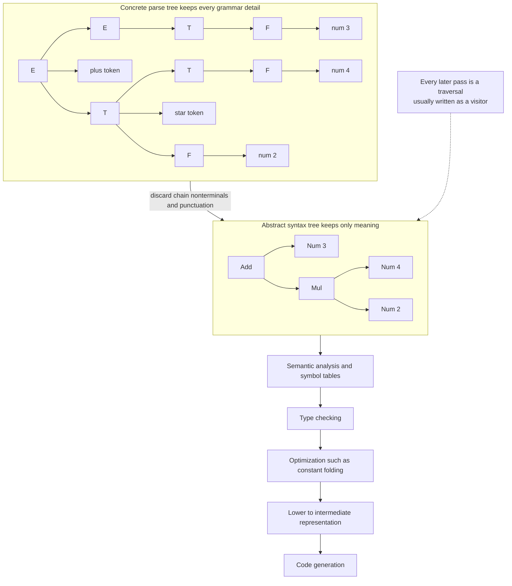

# 🌳 Abstract Syntax Trees and Parser Design

> [!abstract] TL;DR
> An **Abstract Syntax Tree (AST)** is the compact, meaning-only tree that parsing produces and that every later compiler phase — type checking, optimization, code generation, pretty-printing — actually reads and rewrites. Unlike the **concrete parse tree**, which mirrors the grammar detail-for-detail (every nonterminal, every parenthesis, every semicolon), the AST throws away syntactic noise and keeps just the essential structure, so the tree you walk is `Add(3, Mul(4, 2))` rather than a thicket of `E → E + T → …`. The **visitor pattern** is the dominant way to write those walks: one stable node hierarchy, many passes bolted on as visitors.

---

## Intuition

**Analogy:** A **full parse tree** is a court stenographer's transcript. The stenographer is contractually obligated to record *everything* — every "um," every comma, every time a lawyer says "the aforementioned party of the first part" instead of "him." The transcript is faithful to the letter, but nobody reasons about the case by reading it start to finish; it is too cluttered with mechanics.

An **Abstract Syntax Tree** is the clean case summary a paralegal writes afterward. It drops the "ums," collapses the boilerplate, and keeps only what changes the meaning: *who did what to whom*. Where the transcript wrote `( 3 + 4 )` with the parentheses spelled out as tokens, the summary just records the fact those parentheses encoded — that the addition happens first — as tree *shape*: `Add(3, 4)`. Every downstream reader (the judge, the appeals lawyer, the compiler's optimizer) works from the summary, never the raw transcript.

That is the whole move: the grammar's job is to *recognize* the input faithfully; the AST's job is to *represent* it usefully. The AST is the data structure the rest of the compiler lives inside.

---

## How It Works

### From concrete parse tree to abstract syntax tree

Parsing (see [[Parsing_and_Derivations]]) recovers the hidden hierarchical structure of a flat token stream according to a [[Context_Free_Grammars_and_Languages|context-free grammar]]. Two different trees describe that structure:

1. **Concrete Syntax Tree (CST) / parse tree.** A literal drawing of the derivation. Every grammar nonterminal used (`E`, `T`, `F`) becomes an internal node, and every terminal — including punctuation like parentheses, commas, and semicolons — becomes a leaf. The CST is a perfect record of *how the grammar generated the string*. It is bulky by design: a grammar written to encode operator precedence with a `E → T`, `T → F` chain produces long spindly branches even for trivial input.

2. **Abstract Syntax Tree (AST).** A distillation. Redundant "chain" nonterminals are collapsed, punctuation that only *guided* parsing is discarded (the precedence it encoded now lives in the tree's shape), and each remaining node is labeled by the language *construct* it represents — `BinOp`, `Call`, `If`, `While`, `VarDecl` — not by a grammar symbol. The AST is smaller, uniform, and semantically direct.

The AST is what compilers actually manipulate. You never run type inference over "did we take the `T → T * F` production"; you run it over "this is a multiplication of two typed subexpressions."

### The AST as the central intermediate representation

Once built, the AST is the **interface between phases**. Each pass is a traversal that reads the tree and either annotates it, rewrites it, or lowers it toward a flatter intermediate representation:

- **Semantic analysis** walks the AST to build symbol tables and resolve names (the future `Semantic_Analysis_and_Symbol_Tables` sibling note).
- **Type checking** walks it to attach and verify types (the future `Type_Checking_and_Type_Systems` sibling note).
- **Optimization** rewrites subtrees — constant folding turns `Add(3, 4)` into `Num(7)` before any code is emitted.
- **Code generation** lowers the AST into an `Intermediate_Representation` (three-address code, SSA) and then to machine code.

Because these passes are numerous and change often while the node types stay relatively stable, the **visitor pattern** is the standard tool for writing them: define the node hierarchy once, then express each pass as a separate visitor object that supplies one method per node type.



### Building the AST during parsing

The tree is not built after parsing — it is built *by* parsing through **semantic actions**:

- In **hand-written recursive descent** (the future `Top_Down_and_Recursive_Descent_Parsing` sibling note), each grammar function `return`s the node it just constructed; `parseExpr` glues the sub-results from `parseTerm` into a `BinOp` and hands it up the call stack. This is why recursive descent is so popular for real front ends — building the AST is just structured return values.
- In **bottom-up LR parsing** (the future `Bottom_Up_and_LR_Parsing` sibling note), each grammar rule carries an action that fires on **reduce**, popping the children's AST nodes off the parser's value stack and pushing the freshly built parent. Tools like yacc/bison and ANTLR embed these actions in the grammar file.

Either way the principle is identical: *recognition drives construction*.

---

## Key Concepts

### Secondary (intuition-level)
- **AST = the clean summary, parse tree = the full transcript.** The AST keeps the structure that matters and drops the punctuation that was only there to guide parsing.
- **Precedence becomes shape.** `2 + 3 * 4` and `(2 + 3) * 4` differ only in *where the tree branches*; the parentheses themselves never appear in the AST.
- **One tree, many passes.** The same AST is read by the type checker, the optimizer, and the code generator — build it once, reuse it everywhere.

### Undergraduate (mechanism-level)
- **CST vs AST design.** A CST is fixed by the grammar; an AST is a *design decision*. You choose node types (`BinOp`, `Call`, `If`, `While`, `Decl`), which fields they carry, and how much you collapse.
- **Source location tracking.** Good AST nodes carry `(line, column, span)` so that later phases can point errors at the exact source text; discarding this is a classic beginner mistake.
- **Semantic actions.** The AST is assembled during parsing — via return values in recursive descent, via reduce actions on the LR value stack.
- **The visitor pattern & double dispatch.** `node.accept(visitor)` calls back `visitor.visit_BinOp(node)`; the *pair* (node type, visitor type) selects the behavior. This lets you add a new pass (a new visitor) without touching the node classes.
- **Desugaring.** Rewriting rich surface syntax into a small core: `for` loops become `while`, `a += b` becomes `a = a + b`, string interpolation becomes concatenation calls. Fewer node types means fewer cases in every downstream pass.

### Graduate (design-tradeoff-level)
- **The expression problem.** The visitor pattern makes *adding operations* cheap but *adding node types* expensive (every visitor must grow a new method). Functional languages invert the tradeoff: an AST is an algebraic data type and each pass is a `match` over its variants (see [[Scala_Pattern_Matching]] and [[Enums_and_Pattern_Matching]]), making new operations cheap but new variants force-edit every match. Neither side gets both cheaply without extra machinery (open recursion, tagless-final, type classes).
- **Lossless CST vs lean AST — the tooling split.** Compilers want a lean AST; IDE tooling (formatters, refactoring, linters) wants a **lossless** tree that preserves whitespace, comments, and trivia so it can round-trip source exactly. Microsoft's **Roslyn** and **tree-sitter** keep full-fidelity concrete syntax trees for this reason; a formatter must reproduce byte-for-byte what it did not change.
- **Immutable vs mutable ASTs.** Mutable trees let a pass rewrite in place (cheap, but aliasing hazards and hard to parallelize). Immutable trees (Roslyn-style) make each transformation return a *new* tree sharing unchanged subtrees — safer, structural-sharing-friendly, and the basis for incremental reparse.
- **Error-tolerant & incremental parsing.** IDEs must parse *broken* code on every keystroke. **tree-sitter** reparses only the edited region and inserts explicit `ERROR` nodes so the rest of the tree stays usable — the AST is a live view, not a one-shot artifact.
- **Parser design spectrum.** Hand-written recursive descent (control, good errors) vs parser generators (declarative, powerful) vs **parser combinators** (small parsers composed as functions/values) vs **PEG / packrat parsing** (ordered choice removes CFG ambiguity by fiat; memoization buys linear time at the cost of memory). Each choice shapes how, and how easily, the AST gets built.

---

## Python Demo

Pure standard library (`dataclasses`) for the AST and visitors, plus `matplotlib` to draw the tree. The demo defines a tiny language, builds an AST, runs **three visitors over the one tree** (pretty-printer, evaluator, node-counter), performs a **constant-folding transformation**, and **visualizes** both the original and folded trees.

```python
"""
Abstract Syntax Trees + the Visitor pattern, end to end.

Language (tiny): a program is a list of statements; a statement is an
assignment `name = expr`; an expression is a number, a variable, or a
binary operation (+ - * /).

We show:
  1. AST node classes as dataclasses.
  2. The visitor pattern via double dispatch (node.accept(visitor)).
  3. Three independent passes over ONE tree: pretty-print, evaluate, count.
  4. A constant-folding transformation that rewrites Num(3)+Num(4) -> Num(7).
  5. matplotlib visualization of the AST before and after folding.
"""

from __future__ import annotations
from dataclasses import dataclass, field
from typing import List
import matplotlib.pyplot as plt


# ---------------------------------------------------------------------------
# 1. AST node definitions.  Each node knows how to `accept` a visitor.
# ---------------------------------------------------------------------------
class Node:
    def accept(self, visitor):
        # Double dispatch: dispatch on the *runtime type* of self,
        # picking the visitor method named after this class.
        return getattr(visitor, "visit_" + type(self).__name__)(self)


@dataclass
class Num(Node):
    value: float


@dataclass
class Var(Node):
    name: str


@dataclass
class BinOp(Node):
    op: str
    left: Node
    right: Node


@dataclass
class Assign(Node):
    name: str
    value: Node


@dataclass
class Program(Node):
    stmts: List[Node] = field(default_factory=list)


# ---------------------------------------------------------------------------
# 2. Build an AST by hand for:
#        x = 3 + 4 * 2
#        y = x - 5
#    Note the tree ALREADY encodes precedence: 4*2 is nested under the +.
# ---------------------------------------------------------------------------
program = Program([
    Assign("x", BinOp("+", Num(3), BinOp("*", Num(4), Num(2)))),
    Assign("y", BinOp("-", Var("x"), Num(5))),
])


# ---------------------------------------------------------------------------
# 3a. Visitor #1: pretty-printer (unparse the AST back to source text).
# ---------------------------------------------------------------------------
class PrettyPrinter:
    def visit_Num(self, n):   return _fmt(n.value)
    def visit_Var(self, n):   return n.name
    def visit_BinOp(self, n): return f"({n.left.accept(self)} {n.op} {n.right.accept(self)})"
    def visit_Assign(self, n): return f"{n.name} = {n.value.accept(self)}"
    def visit_Program(self, n): return "\n".join(s.accept(self) for s in n.stmts)


# 3b. Visitor #2: evaluator (interpret the AST with an environment).
class Evaluator:
    def __init__(self):
        self.env = {}
    def visit_Num(self, n):  return n.value
    def visit_Var(self, n):  return self.env[n.name]
    def visit_BinOp(self, n):
        a, b = n.left.accept(self), n.right.accept(self)
        return {"+": a + b, "-": a - b, "*": a * b, "/": a / b}[n.op]
    def visit_Assign(self, n):
        self.env[n.name] = n.value.accept(self)
        return self.env[n.name]
    def visit_Program(self, n):
        last = None
        for s in n.stmts:
            last = s.accept(self)
        return last


# 3c. Visitor #3: node counter (a trivial static-analysis pass).
class NodeCounter:
    def __init__(self):
        self.count = 0
    def _tick(self):        self.count += 1
    def visit_Num(self, n):  self._tick()
    def visit_Var(self, n):  self._tick()
    def visit_BinOp(self, n):
        self._tick(); n.left.accept(self); n.right.accept(self)
    def visit_Assign(self, n):
        self._tick(); n.value.accept(self)
    def visit_Program(self, n):
        self._tick()
        for s in n.stmts:
            s.accept(self)


# ---------------------------------------------------------------------------
# 4. A transforming visitor: constant folding.  Returns a NEW tree
#    (immutable style) with Num op Num subtrees collapsed to a single Num.
# ---------------------------------------------------------------------------
class ConstantFolder:
    def visit_Num(self, n):  return n
    def visit_Var(self, n):  return n
    def visit_BinOp(self, n):
        left  = n.left.accept(self)
        right = n.right.accept(self)
        if isinstance(left, Num) and isinstance(right, Num):
            folded = {"+": left.value + right.value,
                      "-": left.value - right.value,
                      "*": left.value * right.value,
                      "/": left.value / right.value}[n.op]
            return Num(folded)          # rewrite the subtree
        return BinOp(n.op, left, right) # rebuild with folded children
    def visit_Assign(self, n):  return Assign(n.name, n.value.accept(self))
    def visit_Program(self, n): return Program([s.accept(self) for s in n.stmts])


def _fmt(v):
    return str(int(v)) if float(v).is_integer() else str(v)


# ---------------------------------------------------------------------------
# 5. matplotlib visualization: draw an AST as a labeled tree.
# ---------------------------------------------------------------------------
def children(n):
    if isinstance(n, BinOp):   return [n.left, n.right]
    if isinstance(n, Assign):  return [n.value]
    if isinstance(n, Program): return list(n.stmts)
    return []

def label(n):
    if isinstance(n, Num):     return f"Num\n{_fmt(n.value)}"
    if isinstance(n, Var):     return f"Var\n{n.name}"
    if isinstance(n, BinOp):   return f"BinOp\n{n.op}"
    if isinstance(n, Assign):  return f"Assign\n{n.name}"
    if isinstance(n, Program): return "Program"
    return "?"

def _layout(node, depth, pos, xcursor):
    kids = children(node)
    if not kids:
        x = xcursor[0]; xcursor[0] += 1
    else:
        for k in kids:
            _layout(k, depth + 1, pos, xcursor)
        x = sum(pos[id(k)][0] for k in kids) / len(kids)
    pos[id(node)] = (x, -depth)
    return pos

def draw_ast(root, ax, title):
    pos = _layout(root, 0, {}, [0])
    stack = [root]
    while stack:                      # draw edges first
        n = stack.pop()
        for k in children(n):
            x0, y0 = pos[id(n)]; x1, y1 = pos[id(k)]
            ax.plot([x0, x1], [y0, y1], "-", color="0.6", zorder=1)
            stack.append(k)
    stack = [root]
    while stack:                      # then draw labeled nodes
        n = stack.pop()
        x, y = pos[id(n)]
        ax.text(x, y, label(n), ha="center", va="center", fontsize=8,
                bbox=dict(boxstyle="round,pad=0.3", fc="#dbeafe", ec="#2563eb"),
                zorder=2)
        stack.extend(children(n))
    ax.set_title(title, fontsize=10)
    ax.axis("off")


if __name__ == "__main__":
    pp = PrettyPrinter()
    print("Source (unparsed from the AST):")
    print(program.accept(pp))

    ev = Evaluator()
    program.accept(ev)
    print("\nEvaluator environment:", ev.env)

    nc = NodeCounter()
    program.accept(nc)
    print("Total AST nodes:", nc.count)

    folded = program.accept(ConstantFolder())
    print("\nAfter constant folding:")
    print(folded.accept(PrettyPrinter()))   # x = 11 ; y = (x - 5)

    fig, (ax1, ax2) = plt.subplots(1, 2, figsize=(11, 5))
    draw_ast(program, ax1, "Original AST")
    draw_ast(folded,  ax2, "After constant folding: 3 + 4*2 -> 11")
    plt.tight_layout()
    plt.savefig("ast_demo.png", dpi=120)
    print("\nSaved ast_demo.png")
```

**What to notice:** the AST is built *once* and three unrelated passes (`PrettyPrinter`, `Evaluator`, `NodeCounter`) each traverse it without knowing about one another — the essence of the visitor pattern. `ConstantFolder` shows an AST-to-AST rewrite: it returns a fresh tree where `3 + 4 * 2` collapses to `11`, exactly what a real optimizer does before code generation.

---

## Real-World Applications

> **Roslyn (.NET Compiler Platform).** Roslyn exposes C# and VB syntax as **full-fidelity, immutable** syntax trees: every whitespace, comment, and token is preserved so tools can round-trip source exactly. Analyzers, code fixes, and refactorings are all written against this tree, which is why Visual Studio's "extract method" or "rename symbol" can rewrite code without disturbing the surrounding formatting.

> **tree-sitter.** A parser generator built for editors: it produces a concrete syntax tree, **reparses incrementally** on each edit, and recovers from syntax errors by inserting explicit `ERROR` nodes. GitHub uses it for semantic code navigation and highlighting; Neovim uses it for structural syntax highlighting — both need a usable tree even while you are mid-keystroke.

> **Babel and TypeScript.** Transpilers parse JavaScript/TypeScript into an AST, run plugin passes that rewrite the tree (desugaring JSX, down-leveling `async/await`, stripping types), then unparse the AST back to JavaScript. Every Babel plugin is essentially a visitor over the AST.

> **Clang / LLVM.** Clang builds a rich C/C++ AST used by the compiler, `clang-tidy` linters, and `clang-format`, then lowers it to LLVM IR — a textbook example of the AST as the interface between the language front end and the optimizer/back end.

---

## Common Pitfalls

- **Confusing the parse tree with the AST.** Trying to run semantic analysis over the concrete tree drowns you in grammar bookkeeping (`E → T → F`) that carries no meaning. Collapse to an AST first; that is what the AST is *for*.
- **Discarding source locations.** If nodes do not carry `(line, column, span)`, your compiler cannot produce "error on line 42, column 7." Attach location info at construction time — you cannot reliably reconstruct it later.
- **An AST too close to the grammar.** Leaving in redundant chain nonterminals or wrapper nodes forces every downstream pass to skip over noise. Design node types around *language constructs*, not grammar productions.
- **Not desugaring early.** Keeping `for`, `while`, `do-while`, list comprehensions, and `+=` all as distinct nodes multiplies the cases in every pass. Lower them to a small core language once, up front.
- **Mutating a shared AST during a pass.** In-place rewrites plus node aliasing lead to spooky action at a distance and defeat structural sharing. Prefer transformations that return new subtrees (as `ConstantFolder` does above) unless you have measured that in-place is necessary.
- **A lean compiler AST doubling as IDE tooling AST.** A formatter needs comments and whitespace the compiler happily threw away. Do not force one tree to serve both; use a lossless concrete tree for tooling and derive the lean AST from it.
- **Visitor "expression problem" surprise.** Adding a new node type means editing *every* existing visitor. If node types churn more than operations, an algebraic-data-type + pattern-matching design may fit better than classic visitors.

---

## Related Concepts

- [[Parsing_and_Derivations]] — the parse-tree/derivation machinery whose output the AST distills; top-down vs bottom-up parsing both build ASTs via semantic actions.
- [[Context_Free_Grammars_and_Languages]] — the grammar formalism that defines the concrete tree; the AST is what you keep after discarding the grammar's scaffolding.
- [[Applications_of_Context_Free_Grammars]] — situates parsing and AST construction inside the broader use of CFGs in compilers and tooling.
- [[Tree_Traversals]] — the DFS pre/in/post-order walks that every AST visitor is a specialization of.
- [[Binary_Tree_Fundamentals]] — the underlying rooted-tree data structure; an AST is a labeled, variable-arity tree with the same traversal mechanics.
- [[Behavioral_Patterns]] — covers the Visitor pattern and double dispatch, the dominant technique for writing AST passes.
- [[Scala_Pattern_Matching]] — the functional alternative to visitors; ASTs as sealed types walked by `match`, illustrating the expression problem's other side.
- [[Enums_and_Pattern_Matching]] — Rust's algebraic-enum + `match` approach to representing and traversing ASTs.

Not-yet-written Compilers siblings this note anticipates: `Top_Down_and_Recursive_Descent_Parsing`, `Bottom_Up_and_LR_Parsing`, `Semantic_Analysis_and_Symbol_Tables`, `Type_Checking_and_Type_Systems`, and `Intermediate_Representations`.

---

## Review Questions

1. **(Conceptual)** Give a concrete expression whose *concrete parse tree* and *abstract syntax tree* differ in the number of nodes, and explain which pieces of information the AST safely discards and where that discarded information "goes."
2. **(Scenario)** You are building the tree layer for an IDE that must format code (preserving comments and blank lines), rename symbols across files, and also feed a compiler back end. Would you use one tree or two? Justify your choice in terms of lossless CST vs lean AST and immutability.
3. **(Trade-off)** Your language team adds new *operations* over the AST every sprint (new linters, new optimizations) but changes the set of *node types* only rarely. Do you favor the visitor pattern or algebraic-data-types with pattern matching, and why? Now flip the assumption — node types churn weekly — and re-answer.

---

## Sources

- Aho, Lam, Sethi, Ullman. *Compilers: Principles, Techniques, and Tools* (2nd ed., "The Dragon Book"), ch. 2 & 5 — syntax trees and syntax-directed translation.
- Appel, A. *Modern Compiler Implementation in ML*, ch. 4 — abstract syntax and the visitor/pattern-matching duality.
- Gamma, Helm, Johnson, Vlissides. *Design Patterns* — the Visitor pattern and double dispatch.
- Ford, B. ["Parsing Expression Grammars: A Recognition-Based Syntactic Foundation" (POPL 2004)](https://bford.info/pub/lang/peg.pdf) — PEG and packrat parsing.
- [tree-sitter documentation](https://tree-sitter.github.io/tree-sitter/) — incremental, error-tolerant concrete syntax trees.
- [Roslyn (.NET Compiler Platform) syntax trees](https://learn.microsoft.com/en-us/dotnet/csharp/roslyn-sdk/work-with-syntax) — full-fidelity, immutable syntax trees.

---

#compilers #abstract-syntax-tree #ast #visitor-pattern #parser-design
