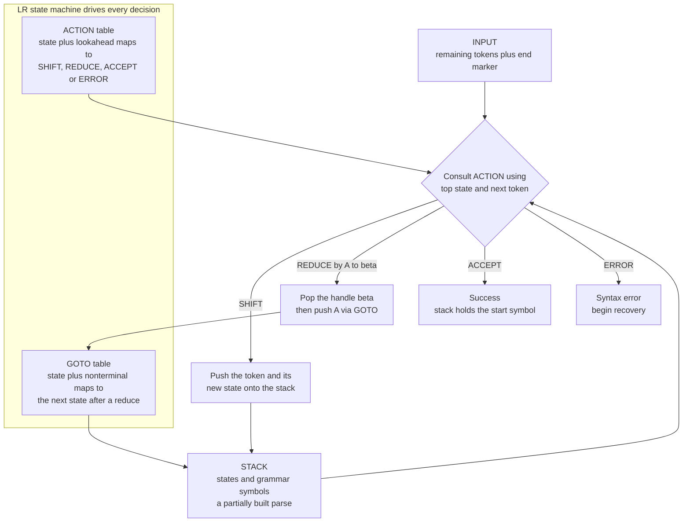

# 🏗️ Bottom-Up and LR Parsing

> [!abstract] TL;DR
> Bottom-up parsing builds the parse tree from the tokens (leaves) up to the start symbol (root) by repeatedly recognizing right-hand sides and **reducing** them to nonterminals — the reverse of a rightmost derivation. Its dominant industrial form is **LR parsing**: a table-driven shift-reduce machine (a deterministic pushdown automaton) that handles a strictly larger grammar class than top-down LL parsing, and whose LALR(1) variant powers `yacc`/`bison`.

---

## Intuition

**Analogy:** Bottom-up parsing assembles the tree like **building with LEGO from the individual bricks up**. You shift tokens onto a workbench (a **stack**) one at a time, and the moment the top few pieces match a grammar rule's shape, you **snap them together (reduce)** into a bigger sub-assembly. You keep shifting and snapping until everything on the workbench collapses into a single finished "program" block.

Technically: the workbench is a **stack of grammar symbols**, "snapping pieces together" is **reducing a handle** (a right-hand side of a production) to its left-hand nonterminal, and "finished" means the stack holds only the grammar's **start symbol** while the input is exhausted. Because you recognize the *rightmost* reducible piece and replace it, the whole run is exactly a **rightmost derivation played backwards**.

Contrast this with the sibling note **Top_Down_and_Recursive_Descent_Parsing**, which starts from the root and *predicts* its way down to the leaves. Bottom-up defers commitment: it accumulates concrete evidence on the stack before deciding what rule was used.

---

## How It Works

### The bottom-up idea

A context-free grammar (see **Context_Free_Grammars_for_Parsing** and [[Context_Free_Grammars_and_Languages]]) generates strings via **derivations** — repeatedly rewriting a nonterminal by one of its productions. Bottom-up parsing runs a derivation **in reverse**:

1. Start with the raw input tokens.
2. Find a **handle** — a substring on top of the stack that exactly matches the right-hand side of some production *and* occurs at the correct point of a rightmost derivation.
3. **Reduce** it: pop the handle, push the left-hand nonterminal.
4. Repeat until only the start symbol remains. If you ever get stuck, the input is not in the language.

Each reduction corresponds to one derivation step, taken in the opposite order — this is why LR is described as producing a **rightmost derivation in reverse** (see [[Parsing_and_Derivations]]).

### Shift-reduce parsing (the mechanism)

A shift-reduce parser keeps a **stack** of partially-parsed symbols and reads input left-to-right. At every step it makes exactly one of four moves:

- **SHIFT** — push the next input token onto the stack.
- **REDUCE** — the top of the stack is a handle `β` for a production `A -> β`; pop `β`, push `A`.
- **ACCEPT** — the stack is the start symbol and input is empty.
- **ERROR** — no legal move; trigger recovery.

The engine is a **pushdown automaton** (the stack is its unbounded memory — see [[Pushdown_Automata]] and [[Stack]]). The only hard question is *shift vs reduce*, and that is exactly what LR tables answer deterministically.

### LR parsing (making the decision deterministic)

**LR** = scan **L**eft-to-right, produce a **R**ightmost derivation in reverse, with `k` tokens of lookahead (usually `k = 1`). Instead of guessing, an LR parser precomputes a **DFA of viable prefixes** whose states are sets of **LR(0) items** (productions with a dot marking how far we have matched, e.g. `E -> E · + T`).

- **Closure** of an item set: if the dot sits before a nonterminal `B`, add every `B -> · γ` item, recursively.
- **GOTO(I, X)**: from item set `I`, advance the dot over symbol `X` and take the closure — this is the DFA transition.
- The **canonical collection** of item sets is the DFA. From it we build two tables:
  - **ACTION[state, terminal]** → shift/reduce/accept/error.
  - **GOTO[state, nonterminal]** → next state after a reduce.

The stack actually stores **states** (not just symbols); the current state plus one lookahead token indexes ACTION, giving a deterministic decision with **no backtracking**.



### The LR family (power vs table size)

| Method | Lookahead | Power | Table cost |
|--------|-----------|-------|------------|
| **LR(0)** | none | weakest; many conflicts | small |
| **SLR(1)** | FOLLOW sets | more grammars | small |
| **LALR(1)** | merged LR(1) states | practical sweet spot | small |
| **Canonical LR(1)** | full LR(1) items | strongest deterministic | very large |

**LALR(1)** merges LR(1) states that share the same LR(0) core, keeping tables compact while handling almost every real programming-language grammar — which is why it is what `yacc`/`bison` generate.

Crucially, LR handles a **strictly larger** class than LL (top-down): it accepts **left-recursive** grammars naturally (a virtue for left-associative operators), whereas recursive descent must first eliminate left recursion. That extra power is the theoretical case *for* LR — see **Top_Down_and_Recursive_Descent_Parsing** for the counter-argument.

---

## Key Concepts

### 🟢 Secondary (explain to a junior dev)
- **Bottom-up = leaves-to-root.** Collect tokens, snap matching groups into bigger pieces, stop when one root piece remains.
- **Two moves only:** SHIFT (bring a token in) and REDUCE (collapse a matched rule). Everything else is bookkeeping.
- **Stack is the workbench.** The parse lives on a stack; a match at the *top* is what triggers a reduce.

### 🔵 Undergraduate (needs CS background)
- **Handle & viable prefix:** the handle is the substring you may safely reduce; the set of stack contents that could still lead to a valid parse forms the *viable prefixes*, which are recognized by the LR DFA.
- **LR(0) items, closure, GOTO, canonical collection:** the machinery that turns a grammar into ACTION/GOTO tables.
- **SLR vs LALR(1) vs canonical LR(1):** increasing power and table size; LALR(1) is the industrial default.
- **LR ⊃ LL:** LR is more expressive and eats left recursion directly.
- **Conflicts:** shift-reduce (e.g. dangling-else) and reduce-reduce; resolved by precedence/associativity declarations or grammar refactoring.

### 🔴 Graduate (system-level thinking)
- **LR ≡ DPDA:** the LR(1) languages are exactly the **deterministic** context-free languages; nondeterministic CFLs need more.
- **General CFG parsing:** **GLR** (Tomita) forks parallel stacks at conflicts to handle ambiguous grammars like C++; **Earley's algorithm** parses *any* CFG in `O(n³)` (`O(n²)` unambiguous, `O(n)` many practical grammars).
- **CYK connection:** the CYK dynamic-programming recognizer also parses any CFG in `O(n³)` but requires **Chomsky Normal Form** first (see [[Chomsky_Normal_Form_and_Grammar_Transformations]]).
- **Error recovery:** panic-mode (skip to a synchronizing token), phrase-level repair, and error productions; a known weakness of generated LR parsers relative to hand-written descent.
- **The theory-vs-practice tension:** LR is provably more powerful and fully table-generated, yet most modern production compilers (GCC, Clang, and hand-written Rust/Go front ends) use **recursive descent** for better error messages, easier context-sensitive hacks, and simpler debugging.

---

## Python Demo

A pure-Python shift-reduce parser for the classic expression grammar, tracing every SHIFT/REDUCE against an explicit stack and visualizing both the stack depth over time and the parse tree built bottom-up.

```python
"""
Shift-reduce (bottom-up / LR-style) parser for a tiny expression grammar.

Grammar:
    E -> E + T | T
    T -> T * F | F
    F -> id

We keep an EXPLICIT stack of symbols. At each step we either
  SHIFT  the next input token onto the stack, or
  REDUCE when the top of the stack matches a production's right-hand side (a HANDLE).

This mirrors what an SLR/LALR(1) table-driven LR parser does; here the shift-vs-reduce
choice is made by a small hand-coded rule set with one-token lookahead, so you can watch
the mechanism without first constructing the full DFA of LR items.

Pure standard library + matplotlib (numpy optional, not required).
"""

from dataclasses import dataclass, field
from typing import List, Optional
import matplotlib.pyplot as plt


@dataclass
class Node:
    """Parse-tree node. Terminals have no children; nonterminals collect their handle."""
    symbol: str
    children: list = field(default_factory=list)


def symbols(stack: List[Node]) -> List[str]:
    return [n.symbol for n in stack]


# Reduction rules, checked LONGEST/most-specific first.
# (rhs symbols, lhs nonterminal, allowed lookahead or None for "any", printable label)
REDUCTIONS = [
    (["T", "*", "F"], "T", None,       "REDUCE  T -> T * F"),
    (["E", "+", "T"], "E", {"+", "$"}, "REDUCE  E -> E + T"),
    (["id"],          "F", None,       "REDUCE  F -> id"),
    (["F"],           "T", None,       "REDUCE  T -> F"),
    (["T"],           "E", {"+", "$"}, "REDUCE  E -> T"),
]


def try_reduce(stack: List[Node], lookahead: str):
    """Return (rhs_len, lhs, label) for the first matching handle, else None."""
    top = symbols(stack)
    for rhs, lhs, look_ok, label in REDUCTIONS:
        n = len(rhs)
        if top[-n:] == rhs and (look_ok is None or lookahead in look_ok):
            return n, lhs, label
    return None


def shift_reduce_parse(tokens):
    """Parse a token list (end marker added automatically).
    Returns (trace_rows, stack_depths, parse_tree_root)."""
    input_buf = list(tokens) + ["$"]
    stack: List[Node] = []
    trace = []      # (stack_before, input_before, action)
    depths = []     # stack depth AFTER each step -> grow/collapse curve

    while True:
        lookahead = input_buf[0]
        stack_str = " ".join(symbols(stack)) if stack else "."
        input_str = " ".join(input_buf)
        red = try_reduce(stack, lookahead)

        if red is not None:                     # REDUCE
            n, lhs, label = red
            children = stack[-n:]
            del stack[-n:]
            stack.append(Node(lhs, children))
            trace.append((stack_str, input_str, label))
        elif lookahead != "$":                  # SHIFT
            tok = input_buf.pop(0)
            stack.append(Node(tok))
            trace.append((stack_str, input_str, f"SHIFT   {tok}"))
        elif len(stack) == 1 and stack[0].symbol == "E":   # ACCEPT
            trace.append((stack_str, input_str, "ACCEPT"))
            depths.append(len(stack))
            break
        else:                                   # ERROR
            trace.append((stack_str, input_str, "ERROR"))
            depths.append(len(stack))
            break
        depths.append(len(stack))

    return trace, depths, (stack[0] if stack else None)


def print_trace(trace):
    print(f"{'STACK':<16} {'INPUT':<18} ACTION")
    print("-" * 55)
    for s, i, a in trace:
        print(f"{s:<16} {i:<18} {a}")


def draw_parse_tree(ax, root):
    pos, counter = {}, [0]

    def layout(node, depth):
        if not node.children:
            x = counter[0]; counter[0] += 1
            pos[id(node)] = (x, -depth)
            return x
        xs = [layout(c, depth + 1) for c in node.children]
        x = sum(xs) / len(xs)
        pos[id(node)] = (x, -depth)
        return x

    layout(root, 0)

    def walk(node, acc):
        acc.append(node)
        for c in node.children:
            walk(c, acc)
        return acc

    nodes = walk(root, [])
    for node in nodes:                          # edges first
        x, y = pos[id(node)]
        for c in node.children:
            cx, cy = pos[id(c)]
            ax.plot([x, cx], [y, cy], color="0.6", zorder=1)
    for node in nodes:                          # then labelled nodes
        x, y = pos[id(node)]
        leaf = not node.children
        ax.scatter([x], [y], s=700, zorder=2,
                   color="#ffd27f" if leaf else "#9ec9ff",
                   edgecolors="black")
        ax.text(x, y, node.symbol, ha="center", va="center",
                fontsize=10, fontweight="bold", zorder=3)
    ax.set_title("Parse tree built BOTTOM-UP for  id + id * id")
    ax.axis("off")


def draw_depth(ax, depths):
    steps = range(1, len(depths) + 1)
    ax.step(steps, depths, where="mid", color="#2c7fb8")
    ax.scatter(steps, depths, color="#2c7fb8", zorder=3)
    ax.set_xlabel("parser step")
    ax.set_ylabel("stack depth")
    ax.set_title("Stack depth: grows on SHIFT, collapses on REDUCE")
    ax.grid(True, alpha=0.3)


if __name__ == "__main__":
    tokens = ["id", "+", "id", "*", "id"]
    trace, depths, root = shift_reduce_parse(tokens)
    print_trace(trace)

    print("\nShift-reduce CONFLICT (dangling-else), conceptually:")
    print("  Grammar:  S -> if E then S | if E then S else S | other")
    print("  Stack top: if E then S        Lookahead: else")
    print("    SHIFT  -> 'else' binds to the INNER if   (bison's default)")
    print("    REDUCE -> close inner if; 'else' binds to the OUTER if")
    print("  Both parses are legal => the grammar is ambiguous here.")

    fig, (ax1, ax2) = plt.subplots(1, 2, figsize=(12, 5))
    draw_depth(ax1, depths)
    draw_parse_tree(ax2, root)
    fig.tight_layout()
    fig.savefig("shift_reduce_parse.png", dpi=120)
    plt.show()
```

**Expected trace** (note how `*` forces a SHIFT over the `E -> E + T` reduce, giving `*` higher precedence):

```
STACK            INPUT              ACTION
-------------------------------------------------------
.                id + id * id $     SHIFT   id
id               + id * id $        REDUCE  F -> id
F                + id * id $        REDUCE  T -> F
T                + id * id $        REDUCE  E -> T
E                + id * id $        SHIFT   +
E +              id * id $          SHIFT   id
E + id           * id $             REDUCE  F -> id
E + F            * id $             REDUCE  T -> F
E + T            * id $             SHIFT   *
E + T *          id $               SHIFT   id
E + T * id       $                  REDUCE  F -> id
E + T * F        $                  REDUCE  T -> T * F
E + T            $                  REDUCE  E -> E + T
E                $                  ACCEPT
```

The **shift-reduce conflict** printout illustrates the dangling-else: with `if E then S` on the stack and `else` next, the parser can either shift (bind `else` to the nearest `if`, which is what `bison` does by default and emits a warning) or reduce (bind it to the outer `if`). Precedence/associativity declarations, or refactoring to a "matched vs unmatched statement" grammar, remove the ambiguity.

---

## Real-World Applications

> **Example — GNU Bison / Yacc.** `bison` reads a `.y` file of grammar rules with attached C semantic actions, computes the **LALR(1)** ACTION/GOTO tables, and emits a table-driven parser. On each **reduce**, the rule's action runs — this is where you construct an **abstract syntax tree** (see **Abstract_Syntax_Trees_and_Parser_Design**): typically `$$ = make_binop($1, $3)`. Decades of Unix language tooling (early C compilers, `awk`, PostgreSQL's SQL grammar, Ruby's parser `parse.y`, Bash) run on generated LR parsers.

- **PostgreSQL** parses SQL with a large Bison LALR(1) grammar; ambiguities are tamed with `%left`/`%right`/`%prec` precedence declarations.
- **GLR mode** (`%glr-parser` in Bison, and Elkhound/Tree-sitter-style engines) parses **naturally ambiguous** languages such as C++ by exploring parallel stacks.
- **Earley parsers** (e.g. Python's `lark` in `earley` mode, NLTK) power natural-language and general-CFG use cases where writing an unambiguous grammar is impractical.
- **The counter-trend:** GCC and Clang both **abandoned** generated parsers for **hand-written recursive descent** to get better diagnostics and easier context-sensitive parsing — a live example of the theory-vs-practice tension (see **Compiler_Toolchains_and_LLVM** and **Top_Down_and_Recursive_Descent_Parsing**).

---

## Common Pitfalls

- **Assuming LR always beats hand-written parsers.** LR wins on *grammar coverage*, but generated parsers historically give poor error messages and are hard to extend for context-sensitive rules — which is exactly why Clang/GCC use recursive descent.
- **Ignoring shift-reduce warnings from bison.** A shift-reduce conflict is silently resolved in favor of *shift*; that default is right for dangling-else but wrong elsewhere. Reduce-reduce conflicts almost always signal a genuine grammar bug — never ignore them.
- **Fixing conflicts by piling on precedence declarations.** `%prec` hacks can mask a structurally ambiguous grammar. Often the correct fix is to *restructure* the grammar (e.g. stratify by precedence level, or split matched/unmatched statements).
- **Confusing LR(0) items with lookahead behavior.** LR(0) states have no lookahead; SLR uses FOLLOW sets, LALR uses merged LR(1) lookaheads. Merging can introduce reduce-reduce conflicts that full canonical LR(1) would not have.
- **Building the AST in the wrong reduce order.** Semantic actions fire *bottom-up* as handles reduce; a left-associative operator emerges correctly only if the grammar is left-recursive (`E -> E + T`), not right-recursive.
- **Forgetting the end-marker `$`.** Without an explicit end-of-input token the parser cannot distinguish "reduce the start symbol" from "expect more input," and ACCEPT never fires.

---

## Related Concepts

Verified links in this vault:

- [[Pushdown_Automata]] — an LR parser is precisely a **deterministic** PDA; the stack is its memory and ACTION/GOTO encode its transition function.
- [[Parsing_and_Derivations]] — LR produces a **rightmost derivation in reverse**; this note formalizes derivations and parse trees.
- [[Context_Free_Grammars_and_Languages]] — the grammar formalism every parser consumes; LR handles the deterministic CFLs.
- [[Chomsky_Normal_Form_and_Grammar_Transformations]] — CNF is the precondition for the CYK general parser, the DP cousin of Earley.
- [[Applications_of_Context_Free_Grammars]] — parsing programming languages is the headline application of CFGs.
- [[Stack]] — the core data structure driving every shift-reduce move.

Planned sibling notes in this Compilers section (reference only until created): **Top_Down_and_Recursive_Descent_Parsing** (the LL/predictive counterpart and the theory-vs-practice foil), **Context_Free_Grammars_for_Parsing** (grammar design for parseability), **Abstract_Syntax_Trees_and_Parser_Design** (building ASTs in reduce actions), and **Compiler_Toolchains_and_LLVM** (where parsers sit in the pipeline).

---

## Review Questions

1. **Conceptual.** Explain why an LR parser is said to construct a *rightmost derivation in reverse*, and describe exactly what a "handle" is. Why must the parser reduce the handle at the top of the stack rather than any matching substring lower down?
2. **Scenario.** You write a grammar for arithmetic with `+` and `*`, and `bison` reports a shift-reduce conflict when the stack is `E * E` and the lookahead is `+`. What does each resolution (shift vs reduce) mean for associativity/precedence, and how would you declare precedence to make `*` bind tighter than `+` and both left-associate?
3. **Trade-off.** LALR(1) is strictly more powerful than LL(1) and its tables are auto-generated, yet Clang and GCC both use hand-written recursive descent. Give two concrete engineering reasons the industry moved *away* from generated LR parsers, and one class of grammar (e.g. ambiguous C++ constructs) where a generalized method like GLR or Earley is still the right tool.

---

## Sources

- Aho, Lam, Sethi & Ullman — *Compilers: Principles, Techniques, and Tools* (2nd ed., "Dragon Book"), Chapter 4 (Syntax Analysis). <https://suif.stanford.edu/dragonbook/>
- Knuth, D. E. (1965). *On the Translation of Languages from Left to Right.* Information and Control, 8(6). <https://doi.org/10.1016/S0019-9958(65)90426-2>
- Earley, J. (1970). *An Efficient Context-Free Parsing Algorithm.* Communications of the ACM, 13(2). <https://doi.org/10.1145/362007.362035>
- GNU Bison Manual — LALR(1) parser generation, conflicts, and precedence. <https://www.gnu.org/software/bison/manual/>
- Grune, D. & Jacobs, C. J. H. — *Parsing Techniques: A Practical Guide* (2nd ed.). <https://dickgrune.com/Books/PTAPG_2nd_Edition/>

---

#compilers #lr-parsing #bottom-up-parsing #shift-reduce #yacc
