# ⚙️ Compilers Overview

> [!abstract] TL;DR
> A **compiler** is a program that translates source code written in one language into another — usually a high-level language down to machine code or an intermediate form — **while preserving meaning**. It does this not in one leap but in a disciplined **pipeline of phases**: *lexing* (characters → tokens), *parsing* (tokens → a syntax tree via a grammar), *semantic analysis* (type checking, name/scope resolution), *IR generation*, *optimization*, and *code generation* to a target. The field's master architectural idea is the **front end / middle end / back end split**: a language-specific front end and a target-specific back end, decoupled by a shared **intermediate representation** — turning an M-languages × N-targets problem into just M + N components. This note opens the whole Compilers vault and maps the road ahead.

---

## Intuition

**Analogy — a meticulous translator who works in stages.** Imagine translating a book from English into Japanese. A careless translator swaps words one at a time and produces gibberish. A *good* translator works in disciplined passes:

1. First they read the raw ink on the page and group letters into **words** — figuring out where one word ends and the next begins. *(This is lexing: characters into tokens.)*
2. Then they arrange the words into **grammatical sentences**, working out which phrase modifies which, what is the subject and what is the object. *(This is parsing: tokens into a structured tree.)*
3. Next they check that the sentences actually **make sense** — that a pronoun refers to a real noun, that a verb agrees with its subject, that nothing contradicts what came before. *(This is semantic analysis: types, scopes, names.)*
4. Then they **rewrite for economy** — cutting redundant phrases, choosing tighter wording that means exactly the same thing. *(This is optimization.)*
5. Finally they produce the polished **target-language edition** the reader will actually hold. *(This is code generation.)*

A compiler is exactly this translator, and the reason it works in stages is the same reason the human does: each stage has a single, well-defined job, and passing a clean structured artifact to the next stage is far more reliable than trying to do everything at once. The genius of compiler architecture is that the *middle* stages — the ones about meaning and economy — can be shared no matter what the source language is or what machine the reader owns.

---

## How It Works

### Core Mechanics

A compiler transforms a program through a sequence of representations, each closer to the machine and further from the human. The classic phases:

**1. Lexical analysis (scanning).** The **lexer** reads the flat stream of characters and groups them into **tokens** — the atoms of the language, such as the identifier `count`, the number `42`, the keyword `while`, or the operator `+`. Whitespace and comments are discarded. This is a **regular-language** problem: tokens are described by regular expressions and recognized by a finite automaton, which is why lexers are blazingly fast and simple. *(Vault sibling: `Lexical_Analysis_and_Tokenization`.)*

**2. Syntax analysis (parsing).** The **parser** consumes tokens and builds a tree that reflects the program's grammatical structure — a **parse tree** or, more usefully, an **abstract syntax tree (AST)** that strips away noise like parentheses and keeps only meaning. The rules are a **context-free grammar (CFG)**, and recognizing them requires a **pushdown automaton** — a machine with a stack — because nested structure (balanced braces, operator precedence) is provably beyond a finite automaton. *(Vault siblings: `Context_Free_Grammars_for_Parsing`, `Top_Down_and_Recursive_Descent_Parsing`.)*

**3. Semantic analysis.** Syntax says the program is *well-formed*; semantics says it is *meaningful*. This phase walks the AST to perform **type checking** (is `"hello" + 3` legal?), **name/scope resolution** (does this variable exist here, and which declaration does it bind to?), and constraint checks (is `break` inside a loop?). It builds and consults a **symbol table** that records every declared name, its type, and its scope. *(Vault siblings: `Semantic_Analysis_and_Symbol_Tables`, `Type_Checking_and_Type_Systems`.)*

**4. Intermediate representation (IR) generation.** The type-checked AST is **lowered** into an **intermediate representation** — a machine-independent, instruction-like form (three-address code, static single assignment / SSA, or LLVM IR). The IR is the pivot of the whole design: it is far simpler to analyze and transform than source, and it is not tied to any target. *(Vault sibling: `Intermediate_Representations`.)*

**5. Optimization.** Transformations that make the IR faster or smaller *without changing its meaning*: **constant folding** (`3 * 4` → `12`), **dead-code elimination**, **common-subexpression elimination**, **function inlining**, **loop-invariant code motion**, and register-pressure-aware scheduling. Optimizations are classified as **local** (within a basic block), **global** (across a whole function, via data-flow analysis), or **interprocedural**. *(Vault sibling: `Local_and_Global_Optimizations`.)*

**6. Code generation.** The back end turns optimized IR into concrete **target instructions**: **instruction selection** (which machine ops implement this IR?), **register allocation** (map unlimited virtual registers onto a finite physical set, a graph-coloring problem), and **instruction scheduling** (order ops to hide latency and feed the pipeline). The output is assembly or machine code for a specific **ISA**. *(Vault siblings: `Code_Generation_and_Instruction_Selection`; see [[RISCV_ISA_Fundamentals]] and [[ISA_Design_RISC_vs_CISC]] for the targets.)*

**The front end / middle end / back end split — the key architectural insight.** These phases group into three tiers:

- **Front end** — *language-specific.* Lexing, parsing, semantic analysis. It knows everything about Rust or C or Swift and nothing about x86 or ARM.
- **Middle end** — *target- and language-independent.* IR-level optimization. It knows only the IR.
- **Back end** — *target-specific.* Code generation for one ISA. It knows everything about ARM64 and nothing about your source language.

Because the front end and back end communicate *only* through the IR, you can support **M source languages and N target machines with just M + N components** instead of M × N monolithic compilers. This is precisely how [[JVM_Execution_Model|the JVM]] lets Java, Kotlin, and Scala all compile to one bytecode, and how **LLVM** lets Clang, Rust, and Swift all share one optimizer and dozens of back ends.

**Compiler vs interpreter vs JIT — a spectrum, not a binary.** These are three points on a continuum of *when* translation happens:

| | Compiler (AOT) | Interpreter | JIT |
|---|---|---|---|
| **When** | Ahead of time, before running | While running, no separate output | At run time, hot code only |
| **Output** | Native machine code / object file | None — executes the AST or bytecode directly | Native code cached in memory |
| **Speed of *startup*** | Slow build, fast run | Instant start, slow run | Fast start, warms up to fast run |
| **Runtime info** | None available | Full, but re-interpreted each time | Full — can specialize on observed types/values |
| **Examples** | GCC, Clang, Rust, Go | CPython, Ruby MRI, Bash | JVM HotSpot, V8, PyPy, .NET CLR |

A pure **compiler** does all its work ahead of time (AOT) and emits native code. An **interpreter** skips the code-generation and optimization back end entirely, walking the AST (**tree-walking**) or a compact **bytecode** on a **virtual machine**. A **JIT** blends both: it starts by interpreting bytecode, profiles which code is *hot*, then compiles those paths to native code at run time — often *beating* an AOT compiler because it can specialize on runtime types and values the AOT compiler could only guess at. *(Vault siblings: `Interpreters_and_Tree_Walking`, `Bytecode_and_Virtual_Machines`, `Just_In_Time_Compilation`.)*

**The deep connection to theory of computation.** Compiler construction is where the **Chomsky hierarchy becomes engineering practice**. Lexing is a **regular-language** problem solved by [[Finite_Automata_DFA_and_NFA|finite automata]] and [[Regular_Expressions_and_Kleenes_Theorem|regular expressions]]. Parsing is a **context-free** problem solved by [[Pushdown_Automata|pushdown automata]] and [[Context_Free_Grammars_and_Languages|context-free grammars]] — the exact reason a regex *cannot* parse nested HTML but a parser can (see [[Parsing_and_Derivations]]). The two most fundamental phases of every compiler are direct applications of the first two rungs of the ladder in [[Theory_of_Computation_Overview]].

### Flow / Architecture

```mermaid
graph LR
    subgraph FE["FRONT END - language specific"]
        SRC["Source code<br/>high-level text"]
        LEX["Lexical analysis<br/>scanner<br/>chars to tokens"]
        PAR["Syntax analysis<br/>parser<br/>tokens to AST"]
        SEM["Semantic analysis<br/>types, scopes, names<br/>symbol table"]
        SRC --> LEX --> PAR --> SEM
    end
    subgraph ME["MIDDLE END - target and language independent"]
        IRGEN["IR generation<br/>lower AST to IR"]
        OPT["Optimizer<br/>constant folding<br/>dead-code elimination<br/>inlining"]
        IRGEN --> OPT
    end
    subgraph BE["BACK END - target machine specific"]
        CG["Code generation<br/>instruction selection"]
        RA["Register allocation<br/>and scheduling"]
        TGT["Target code<br/>assembly or machine code"]
        CG --> RA --> TGT
    end
    SEM -->|"typed AST"| IRGEN
    OPT -->|"optimized IR"| CG
```



*The IR in the MIDDLE END is the decoupling seam: swap the front end to add a new source language, swap the back end to add a new target CPU, and reuse the entire optimizer. That is the M + N economy.*

---

## Key Concepts

**Secondary (intuitive, no CS background needed)**
- **Source vs target** — the language you write in versus the language the machine runs; a compiler bridges them.
- **Translate, don't just copy** — the output must *mean the same thing* as the input, but in a different form.
- **Stages / passes** — the translation happens in ordered steps, each with one job, handing a cleaner artifact to the next.
- **Compile vs run** — a compiled program is translated *once*, then run many times; an interpreted program is re-translated every run.

**Undergraduate (a first compilers or PL course)**
- **Token, lexeme, and the regular-expression lexer** — the atoms of syntax and the finite automaton that recognizes them.
- **Context-free grammar, parse tree vs AST, recursive-descent and LR parsing** — how nested structure and operator precedence are recovered from a flat token stream.
- **Symbol tables, scopes, and static type checking** — resolving names and rejecting ill-typed programs before they run.
- **Intermediate representation (three-address code, SSA)** — the language-neutral middle form and why it exists.
- **Classic optimizations** — constant folding/propagation, dead-code elimination, common-subexpression elimination, inlining.
- **Front/middle/back end decomposition** — the M + N argument and portable-compiler design.

**Graduate (advanced compilation)**
- **SSA form and data-flow analysis** — dominators, phi-nodes, and the lattice-theoretic framework behind global optimization.
- **Register allocation as graph coloring** and **instruction scheduling** under pipeline/hazard constraints (ties to [[ISA_Design_RISC_vs_CISC]]).
- **Advanced parsing** — LALR table construction, GLR/Earley for ambiguous grammars, and parser-generator theory.
- **JIT and adaptive optimization** — tiered compilation, speculative type specialization, deoptimization, and profile-guided recompilation (HotSpot, V8, PyPy's meta-tracing).
- **Polyhedral and loop optimization, auto-vectorization, and alias analysis** — extracting parallelism and locality for modern CPUs and GPUs.
- **Formally verified compilation** — CompCert-style machine-checked proofs that optimization preserves semantics; the ultimate answer to "does the translation *really* preserve meaning?"

---

## Python Demo

```python
# A TINY end-to-end compiler for arithmetic expressions.
# It walks the classic front-end -> back-end pipeline on the input "3 + 4 * 2":
#   1. LEXER   : regex rules turn the character stream into TOKENS
#   2. PARSER  : recursive descent turns tokens into an AST (honoring * over +)
#   3. CODEGEN : a post-order walk of the AST emits stack-machine BYTECODE
#   4. VM      : a 4-instruction stack machine runs the bytecode to check the answer
# We then VISUALIZE the AST as a tree and the phases flowing into one another.
# Pure standard library (re, dataclasses) + matplotlib.

import re
from dataclasses import dataclass
from typing import List, Union
import matplotlib.pyplot as plt

# ---------------------------------------------------------------------------
# PHASE 1 - LEXICAL ANALYSIS: characters -> tokens, driven by regex rules.
# This is a REGULAR-language problem: each token is a regular expression.
# ---------------------------------------------------------------------------
TOKEN_SPEC = [
    ("NUMBER", r"\d+"),
    ("PLUS",   r"\+"),
    ("MINUS",  r"-"),
    ("STAR",   r"\*"),
    ("SLASH",  r"/"),
    ("LPAREN", r"\("),
    ("RPAREN", r"\)"),
    ("WS",     r"\s+"),
]
MASTER_RE = re.compile("|".join(f"(?P<{name}>{pat})" for name, pat in TOKEN_SPEC))

@dataclass
class Token:
    kind: str
    text: str

def lex(source: str) -> List[Token]:
    tokens = []
    for m in MASTER_RE.finditer(source):
        kind = m.lastgroup
        if kind == "WS":
            continue                       # skip whitespace
        tokens.append(Token(kind, m.group()))
    tokens.append(Token("EOF", ""))        # sentinel simplifies the parser
    return tokens

# ---------------------------------------------------------------------------
# AST node types (dataclasses) -- the structured output of the front end.
# ---------------------------------------------------------------------------
@dataclass
class Num:
    value: int

@dataclass
class BinOp:
    op: str
    left: "Node"
    right: "Node"

Node = Union[Num, BinOp]

# ---------------------------------------------------------------------------
# PHASE 2 - SYNTAX ANALYSIS: tokens -> AST via recursive descent.
# This is a CONTEXT-FREE problem needing a stack (here, the call stack).
# Grammar (the level structure encodes precedence: * / bind tighter than + -):
#   expr   := term  (('+' | '-') term)*
#   term   := factor (('*' | '/') factor)*
#   factor := NUMBER | '(' expr ')'
# ---------------------------------------------------------------------------
class Parser:
    def __init__(self, tokens: List[Token]):
        self.tokens = tokens
        self.pos = 0

    def peek(self) -> Token:
        return self.tokens[self.pos]

    def eat(self, kind: str) -> Token:
        tok = self.tokens[self.pos]
        if tok.kind != kind:
            raise SyntaxError(f"expected {kind}, got {tok.kind!r}")
        self.pos += 1
        return tok

    def parse(self) -> Node:
        node = self.expr()
        self.eat("EOF")
        return node

    def expr(self) -> Node:
        node = self.term()
        while self.peek().kind in ("PLUS", "MINUS"):
            op = self.eat(self.peek().kind).text
            node = BinOp(op, node, self.term())
        return node

    def term(self) -> Node:
        node = self.factor()
        while self.peek().kind in ("STAR", "SLASH"):
            op = self.eat(self.peek().kind).text
            node = BinOp(op, node, self.factor())
        return node

    def factor(self) -> Node:
        tok = self.peek()
        if tok.kind == "NUMBER":
            self.eat("NUMBER")
            return Num(int(tok.text))
        if tok.kind == "LPAREN":
            self.eat("LPAREN")
            node = self.expr()
            self.eat("RPAREN")
            return node
        raise SyntaxError(f"unexpected token {tok.kind!r}")

# ---------------------------------------------------------------------------
# PHASE 3 - CODE GENERATION: AST -> stack-machine bytecode (post-order walk).
#   Num       -> PUSH n
#   BinOp op  -> <gen left> <gen right> <ADD|SUB|MUL|DIV>
# ---------------------------------------------------------------------------
OPCODES = {"+": "ADD", "-": "SUB", "*": "MUL", "/": "DIV"}

def codegen(node: Node, out: List[str]) -> List[str]:
    if isinstance(node, Num):
        out.append(f"PUSH {node.value}")
    else:
        codegen(node.left, out)
        codegen(node.right, out)
        out.append(OPCODES[node.op])
    return out

# ---------------------------------------------------------------------------
# A 4-instruction STACK VM to prove the bytecode computes the right answer.
# ---------------------------------------------------------------------------
def run(bytecode: List[str]) -> int:
    stack = []
    for instr in bytecode:
        parts = instr.split()
        if parts[0] == "PUSH":
            stack.append(int(parts[1]))
        else:
            b = stack.pop(); a = stack.pop()
            stack.append({"ADD": a + b, "SUB": a - b,
                          "MUL": a * b, "DIV": a // b}[parts[0]])
    return stack.pop()

# ---------------------------------------------------------------------------
# DRIVE THE PIPELINE on "3 + 4 * 2".
# ---------------------------------------------------------------------------
SOURCE = "3 + 4 * 2"
tokens = lex(SOURCE)
ast = Parser(tokens).parse()
bytecode = codegen(ast, [])
result = run(bytecode)

print(f"SOURCE : {SOURCE}\n")
print("TOKENS :", " ".join(f"{t.kind}:{t.text}" for t in tokens if t.kind != "EOF"))

def show(node, indent=1):
    pad = "  " * indent
    if isinstance(node, Num):
        print(f"{pad}Num {node.value}")
    else:
        print(f"{pad}BinOp '{node.op}'")
        show(node.left, indent + 1)
        show(node.right, indent + 1)

print("\nAST    :")
show(ast)
print("\nBYTECODE (stack machine):")
for instr in bytecode:
    print(f"   {instr}")
print(f"\nVM RESULT: {result}   (3 + 4 * 2 = 11, precedence honored -- '*' bound tighter than '+')")

# ---------------------------------------------------------------------------
# VISUALIZE: left = phase pipeline flowing into each other; right = the AST tree.
# ---------------------------------------------------------------------------
def label(node):
    return str(node.value) if isinstance(node, Num) else node.op

def layout(node, depth, pos, counter):
    if isinstance(node, Num):
        x = counter[0]; counter[0] += 1
    else:
        lx = layout(node.left, depth + 1, pos, counter)
        rx = layout(node.right, depth + 1, pos, counter)
        x = (lx + rx) / 2.0
    pos[id(node)] = (x, -depth)
    return x

def draw_edges(node, pos, ax):
    if isinstance(node, BinOp):
        for child in (node.left, node.right):
            x0, y0 = pos[id(node)]
            x1, y1 = pos[id(child)]
            ax.plot([x0, x1], [y0, y1], "-", color="#888888", zorder=1)
            draw_edges(child, pos, ax)

def draw_nodes(node, pos, ax):
    x, y = pos[id(node)]
    is_leaf = isinstance(node, Num)
    ax.scatter([x], [y], s=1200,
               color="#cce3ff" if is_leaf else "#ffd8a8",
               edgecolors="black", zorder=2)
    ax.text(x, y, label(node), ha="center", va="center",
            fontsize=14, fontweight="bold", zorder=3)
    if isinstance(node, BinOp):
        draw_nodes(node.left, pos, ax)
        draw_nodes(node.right, pos, ax)

fig, (axp, axt) = plt.subplots(1, 2, figsize=(13, 6),
                               gridspec_kw={"width_ratios": [1, 1.3]})

# --- phase pipeline panel (phases flowing into each other) ---
phases = ['Source\n"3 + 4 * 2"', "Lexer\ntokens", "Parser\nAST",
          "Semantic\nchecks", "Codegen\nbytecode", "Stack VM\n= 11"]
for i, name in enumerate(phases):
    y = len(phases) - i
    axp.add_patch(plt.Rectangle((0.1, y - 0.32), 1.8, 0.64,
                  facecolor="#e7f0ff", edgecolor="black"))
    axp.text(1.0, y, name, ha="center", va="center", fontsize=10)
    if i < len(phases) - 1:
        axp.annotate("", xy=(1.0, y - 0.68), xytext=(1.0, y - 0.34),
                     arrowprops=dict(arrowstyle="->", lw=1.6))
axp.set_xlim(0, 2)
axp.set_ylim(0, len(phases) + 1)
axp.axis("off")
axp.set_title("The compiler pipeline\n(phases flow top to bottom)", fontsize=11)

# --- AST tree panel ---
pos = {}
layout(ast, 0, pos, [0])
draw_edges(ast, pos, axt)
draw_nodes(ast, pos, axt)
axt.axis("off")
axt.set_title("AST for 3 + 4 * 2\n(leaves = operands, internal nodes = operators)",
              fontsize=11)
axt.margins(0.18)

plt.tight_layout()
plt.savefig("tiny_compiler.png", dpi=130)
print("\nSaved pipeline + AST visualization to tiny_compiler.png")
```

Running it prints the **token stream** (`NUMBER:3 PLUS:+ NUMBER:4 STAR:* NUMBER:2`), the **AST** (`+` at the root with `3` on the left and the subtree `* → 4, 2` on the right — showing that the grammar's level structure correctly bound `*` tighter than `+`), the **bytecode** (`PUSH 3 / PUSH 4 / PUSH 2 / MUL / ADD`), and the VM's verification that it evaluates to **11** rather than the wrong answer 14. The saved figure shows the phase pipeline on the left flowing into the reconstructed AST on the right — a complete, if miniature, compiler.

---

## Real-World Applications

> **Example — LLVM, the reusable compiler that ate the industry.** LLVM is the front/middle/back end split taken to its logical extreme. Its language-agnostic **LLVM IR** sits in the middle; **Clang** (C/C++/Objective-C), **Rustc** (Rust), and the **Swift** compiler are all *front ends* that lower to that IR; and LLVM ships *back ends* for x86-64, ARM64, RISC-V, WebAssembly, and GPUs. The huge suite of IR-level optimizations is written *once* and reused by every language and every target. This is the M + N economy realized: adding Rust cost one front end, not one-compiler-per-CPU. See [[RISCV_ISA_Fundamentals]] for one such target and the toolchain sibling `Compiler_Toolchains_and_LLVM`.

Where compilers show up in practice:

- **Every native language.** GCC, Clang, the Rust and Go compilers, and Swift are ahead-of-time compilers producing native machine code. The Go compiler is famous for prioritizing *fast compilation* over maximal optimization — a deliberate design trade-off.
- **Managed runtimes and JITs.** The [[JVM_Execution_Model|JVM]] compiles Java/Kotlin/Scala to portable **bytecode**, then HotSpot **JIT-compiles** hot methods to native code with speculative optimization. V8 does the same for JavaScript, .NET's CLR for C#, and PyPy for Python via meta-tracing.
- **Databases.** Modern query engines (PostgreSQL with LLVM JIT, Apache Spark's Catalyst) *compile SQL query plans into native code* at run time to eliminate interpreter overhead in tight inner loops.
- **GPUs and ML.** CUDA's `nvcc`, and ML compilers like XLA, TVM, and Triton, compile high-level tensor programs into optimized GPU kernels — the same phases (parse, IR, optimize, codegen), just targeting massively parallel hardware.
- **Shaders, regex engines, and DSLs.** GPU shader compilers, the finite-automata compilation inside every regex library, and domain-specific-language toolchains are all built from the same phase machinery.
- **Transpilers.** TypeScript → JavaScript and Babel are compilers whose *target* is another high-level language rather than machine code — proof that "compiler" means *meaning-preserving translation*, not specifically "produces assembly."

---

## Common Pitfalls

- **"A compiler produces machine code."** Not necessarily. A compiler translates *any* language to *any* target while preserving meaning — TypeScript→JS transpilers and Java→bytecode compilers are compilers too. The defining property is meaning-preserving translation between languages, not the specific output.
- **Conflating parsing with lexing.** Lexing is a *regular*-language job (finite automaton, no memory of nesting); parsing is a *context-free* job (needs a stack). Trying to match nested brackets or balanced parentheses in the lexer is the classic beginner error — it is provably impossible with regular expressions alone (see [[Finite_Automata_DFA_and_NFA]] vs [[Pushdown_Automata]]).
- **Ignoring operator precedence and associativity in a hand-written parser.** A naive left-to-right parser computes `3 + 4 * 2` as `14`. Precedence must be *encoded in the grammar's level structure* (as `expr → term → factor` in the demo) or handled by a precedence-climbing algorithm.
- **Assuming interpreters are "just slow compilers."** They occupy a different point on the AOT↔JIT spectrum with different trade-offs: instant startup, no build step, trivial portability, and (for a JIT) access to *runtime* type information an AOT compiler never has. "Slower" is a per-workload judgment, not a law.
- **Believing optimizations are free and always safe.** Optimizations must *preserve observable behavior*, and getting that wrong causes some of the nastiest bugs in software (e.g., aggressive reordering around undefined behavior in C). "Optimization preserves meaning" is a proof obligation, not an assumption — the reason formally verified compilers like CompCert exist.
- **Treating the symbol table as an afterthought.** Scope and name resolution are where most semantic bugs hide (shadowing, forward references, closures capturing the wrong binding). The symbol table is core infrastructure, not bookkeeping.

---

## Related Concepts

- [[Theory_of_Computation_Overview]] — the theoretical parent: the Chomsky hierarchy that compilers turn into practice, rung by rung.
- [[Context_Free_Grammars_and_Languages]] — the formal grammars that define programming-language syntax and drive every parser.
- [[Pushdown_Automata]] — the stack machine that recognizes context-free languages; the abstract model behind parsing.
- [[Finite_Automata_DFA_and_NFA]] — the machine model behind the lexer; tokens are a regular language.
- [[Regular_Expressions_and_Kleenes_Theorem]] — the notation lexers use to specify tokens, equivalent in power to finite automata.
- [[Parsing_and_Derivations]] — how a grammar generates strings and how a parser reverses that to recover structure.
- [[Chomsky_Normal_Form_and_Grammar_Transformations]] — grammar normal forms and transformations relevant to parser construction (e.g., CYK).
- [[The_Halting_Problem_and_Undecidability]] — why no static analyzer or optimizer can perfectly decide every semantic property of a program.
- [[JVM_Execution_Model]] — a real bytecode + JIT architecture; the front/middle/back end split embodied in a virtual machine.
- [[JVM_Architecture]] — the class loader, verifier, and execution engine that run compiled bytecode.
- [[GraalVM_Native_Image]] — ahead-of-time compilation of JVM bytecode to a native executable; AOT vs JIT made concrete.
- [[Python_Internals]] — CPython's compile-to-bytecode-then-interpret model, a middle point on the spectrum.
- [[RISCV_ISA_Fundamentals]] — a clean back-end target: the instruction set a code generator emits.
- [[ISA_Design_RISC_vs_CISC]] — how target architecture shapes instruction selection and register allocation.
- [[Assembly_Programming]] — the human-readable form of the compiler's back-end output.
- [[ABI_and_Calling_Conventions]] — the runtime contract (stack layout, register usage) a code generator must obey.

---

## Vault Roadmap — the six sections

This note opens the **Compilers** vault, organized as a front-to-back journey through the pipeline:

1. **Foundations and Frontend** *(this section)* — what a compiler is, the phase pipeline, lexical analysis and tokenization, context-free grammars for parsing, and top-down / recursive-descent parsing.
2. **Semantic Analysis and Intermediate Representations** — symbol tables, scope and name resolution, type checking and type systems, and IR design (three-address code, SSA).
3. **Code Generation and Optimization** — instruction selection, register allocation, instruction scheduling, and local/global optimizations (data-flow analysis, DCE, inlining).
4. **Runtime Systems and Memory** — linkers and loaders, the runtime and the ABI, stack/heap layout, and garbage collection.
5. **Interpreters, Virtual Machines, and JIT** — tree-walking interpreters, bytecode and virtual machines, and just-in-time compilation with adaptive optimization.
6. **Advanced and Modern Compilers** — LLVM and reusable toolchains, polyhedral/loop optimization, WebAssembly, ML/GPU compilers, and formally verified compilation.

*(Sibling note names referenced in prose above — `Lexical_Analysis_and_Tokenization`, `Context_Free_Grammars_for_Parsing`, `Semantic_Analysis_and_Symbol_Tables`, `Intermediate_Representations`, `Code_Generation_and_Instruction_Selection`, `Just_In_Time_Compilation`, `Linkers_and_Loaders`, `Garbage_Collection`, and others — are forthcoming notes in these sections and are not yet linked.)*

---

## Review Questions

1. **(Conceptual)** Using the meticulous-translator analogy, explain why a compiler separates *lexing* from *parsing* and *parsing* from *semantic analysis*. For each boundary, name the one artifact that flows across it and why passing that clean artifact is more reliable than merging the two phases.
2. **(Scenario)** Your organization must support 4 source languages across 5 target CPUs. A junior engineer proposes writing one dedicated compiler per language–CPU pair. Explain, with the M × N versus M + N argument, how the front/middle/back end split with a shared IR reduces the work, and name a real system (LLVM or the JVM) that realizes this design.
3. **(Trade-off)** You are choosing an execution strategy for a new dynamic language: pure AOT compilation, a tree-walking interpreter, or a bytecode VM with a JIT. Contrast the three on startup latency, peak throughput, portability, and the ability to exploit *runtime* type information, and justify which you would pick for (a) a command-line utility and (b) a long-running server.

---

## Sources

- Aho, A., Lam, M., Sethi, R., Ullman, J. *Compilers: Principles, Techniques, and Tools*, 2nd ed. Pearson, 2006 — "the Dragon Book," the canonical compiler-construction reference.
- Cooper, K., Torczon, L. *Engineering a Compiler*, 3rd ed. Morgan Kaufmann, 2022 — a modern, IR- and optimization-focused treatment.
- Appel, A. *Modern Compiler Implementation in ML/Java/C*. Cambridge University Press — practical end-to-end compiler construction ("the Tiger books").
- Lattner, C., Adve, V. "LLVM: A Compilation Framework for Lifelong Program Analysis and Transformation." *CGO*, 2004 — the paper introducing LLVM's reusable IR-centric architecture.
- Nystrom, R. *Crafting Interpreters*. Genever Benning, 2021 — a hands-on build of a tree-walking interpreter and a bytecode VM with a compiler ([craftinginterpreters.com](https://craftinginterpreters.com)).

---

#compilers #compiler-design #compiler-pipeline #language-implementation #frontend-backend
