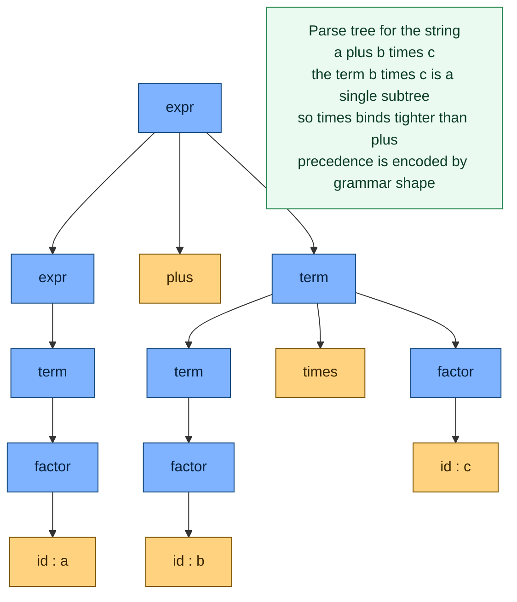

# 🌳 Context-Free Grammars for Parsing

> [!abstract] TL;DR
> A **context-free grammar (CFG)** is the formal rulebook that defines a programming language's **syntax** — a finite set of recursive production rules that a **parser** uses to mechanically decide whether a stream of tokens is well-formed and to recover its hidden tree structure. Regular expressions (which drive the lexer) provably cannot describe the **nested, recursive** structure of real code — balanced brackets, nested blocks, arbitrarily deep expressions — so parsing lives one rung higher on the Chomsky hierarchy, in the world of CFGs and their stack-based recognizers. The single most important craft in writing a grammar is making it **unambiguous**: by stratifying rules into precedence tiers (`expr → term → factor`) you bake operator precedence and associativity into the grammar's *shape*, so `a + b * c` has exactly one correct parse tree instead of two.

---

## Intuition

**Analogy:** A grammar is the sentence-structure rulebook of a language. Your grade-school teacher gave you rules like "a **sentence** is a **subject**, then a **verb**, then an **object**," and you could check any sentence against them and diagram its structure. A **context-free grammar** hands programming languages the same kind of rulebook, but with one superpower: a rule is allowed to *refer to itself*. "An **expression** is an **expression** plus a **term**." That single recursive twist is what lets a finite rulebook describe *infinitely* deep structure — `1 + 2 + 3 + ... ` or brackets nested a thousand levels down — and it is exactly what a **parser** mechanically follows to answer two questions at once: *is this code well-formed?* and *what is its tree shape?*

The word "context-free" means each rule fires **regardless of its neighbours**: the rule for **expression** is the same whether it appears at the top of a file or buried five function calls deep. That locality is what makes the rules mechanically applicable — and it is also the property that draws the line between what a grammar can enforce (nesting, precedence) and what it cannot (a variable must be declared before it is used).

---

## How It Works

### Core Mechanics

A CFG is formally a 4-tuple `G = (V, Σ, R, S)`:

1. **Terminals (`Σ`)** — the atomic symbols of the language. For a compiler these are the **tokens produced by the lexer** — `id`, `num`, `+`, `if`, `{` — not raw characters. The **lexical-analysis** stage (a *regular* language / finite automaton) runs first and hands the parser a clean token stream.
2. **Nonterminals (`V`)** — the syntactic categories you are defining: `expr`, `stmt`, `term`, `factor`, `block`. These are the "grammatical placeholders" that get expanded.
3. **Production rules (`R`)** — rewrites of the form `A → α`, where the left side is **exactly one nonterminal** and the right side is any string of terminals and nonterminals. The left side being a *single* nonterminal is precisely what makes the grammar context-free.
4. **Start symbol (`S`)** — the distinguished nonterminal every derivation begins from (`program` or `compilation_unit` in a real language).

Grammars are written in **BNF** (`expr ::= expr "+" term`) or its convenience-extended cousin **EBNF**, which adds regex-like operators for repetition `{ }`, optionality `[ ]`, and grouping — the notation used verbatim in language reference manuals for C, Java, Python, and SQL.

**Derivation → parse tree.** A **derivation** starts at `S` and repeatedly replaces one nonterminal with the right-hand side of one of its rules until only terminals remain. Drawing that derivation as a rooted tree gives the **parse tree**: the root is `S`, internal nodes are nonterminals, and the leaves read left-to-right spell the input. A **leftmost derivation** always expands the leftmost nonterminal next; a **rightmost derivation** the rightmost. Both can describe the *same* tree — the tree is the neutral structural object both directions converge on, and it *is* the syntactic meaning the later compiler stages walk.

**Why regular expressions are not enough.** Lexing is a *regular* problem, but programming languages have **nested, recursive** structure that regular languages provably cannot describe. The Pumping Lemma for regular languages proves that `{ aⁿbⁿ }` — and therefore balanced parentheses and matched `{ }` blocks — is *not* regular: a finite automaton has no way to count unboundedly deep nesting. You need the strictly greater power of a CFG, whose natural machine model is the **pushdown automaton** — a finite automaton plus a **stack**, and the stack is exactly the memory that "remembers" how deep the nesting currently is.

**Ambiguity — the central danger.** A grammar is **ambiguous** if some string has **two distinct parse trees**. For a compiler this is fatal, because the parse tree determines meaning: two trees for `a + b * c` mean two different computations. The two classic offenders are **operator precedence** (`a + b * c` — multiply first or add first?) and the **dangling else** (`if a then if b then x else y` — which `if` owns the `else`?). Ambiguity is almost always a property of *how the grammar is written*, not of the language, and the cure is to **stratify** the grammar into precedence tiers.

### Encoding precedence in the grammar's shape

The stratified expression grammar is the canonical example of turning grammar *structure* into semantics:

```
expr   → expr "+" term  | term        (low precedence, left-associative)
term   → term "*" factor | factor     (high precedence, left-associative)
factor → id | "(" expr ")"
```

Because a `+` can only join `term`s, and a `*` lives *inside* a `term`, the grammar forces `*` to bind tighter than `+` — precedence is now a structural fact, not an afterthought. The **left recursion** (`expr → expr + term`) makes `+` **left-associative**, so `a - b - c` groups as `(a - b) - c`. The parse tree below shows the payoff.



Reading the leaves left-to-right gives back `a + b * c`, and the tree's shape — with `b * c` sealed into one `term` subtree *before* it is added to `a` — is what tells the evaluator to multiply first. Swap to a flat ambiguous grammar `E → E + E | E * E | id` and this same string sprouts a *second*, wrong-precedence tree; the Python demo builds both.

---

## Key Concepts

### Secondary Level

**A grammar is a rulebook; a parser is the rule-checker.** The grammar lists what shapes are legal (`a statement is an if-condition then a block`); the parser reads your tokens and either builds the tree or reports a syntax error. Terminals are the words (tokens), nonterminals are the grammatical categories, productions are the rules, and the start symbol is where every check begins.

**Recursion is the whole point.** The rule "an expression is an expression plus a term" looks circular, but it is what lets one short rulebook accept `1`, `1 + 2`, `1 + 2 + 3`, and expressions a mile long. This recursion is why a grammar can describe things a search-and-replace or a regex never could.

**Ambiguity means "two readings," and that is a bug.** `a + b * c` has an obvious intended answer (`b * c` first). If the grammar does not *force* that reading, the parser is free to pick the other, and `2 + 3 * 4` could silently come out as `20` instead of `14`. A good grammar leaves exactly one legal tree per program.

### Undergraduate Level

**1. BNF, EBNF, and reading a language manual.** BNF writes rules as `nonterminal ::= alternatives`; EBNF adds `{...}` (zero-or-more), `[...]` (optional), and `(...)` (grouping) so grammars read like tidy patterns. The syntax appendix of the C, Java, or Python reference manual *is* a grammar in (E)BNF — learning to read it is learning to read the language's exact rules.

**2. Derivations and parse trees.** A derivation is the step-by-step rewriting `S ⇒ … ⇒ tokens`; the parse tree records only the structure, discarding the order. Leftmost vs rightmost derivations matter operationally: top-down parsers naturally trace a **leftmost** derivation, bottom-up parsers a **rightmost** derivation in reverse. A derivation is literally a *proof* that a string belongs to the language.

**3. Why regex cannot parse.** Lexing (splitting `x1 + 42` into tokens) is regular and finite-memory. Parsing needs unbounded memory to track nesting depth — the Pumping Lemma proves balanced brackets are non-regular, and the matching machine is a **pushdown automaton**, a finite control plus a stack. Trying to validate nested `{ }` or matched HTML tags with a pure regular expression is the single most common category error in this area.

**4. Removing ambiguity by stratification.** Start from the ambiguous `E → E + E | E * E | id`. Split it into one nonterminal per precedence level (`expr` for `+/-`, `term` for `*//`, `factor` for atoms and parenthesized sub-expressions). Each level can only combine things from the level below, so precedence becomes structural. Add **left recursion** for left-associativity (`expr → expr + term`) or **right recursion** for right-associativity (as with `**` exponentiation).

**5. The dangling else.** `if a then if b then s else t` is genuinely ambiguous. The universal fix is "`else` binds to the nearest unmatched `if`," expressed either by rewriting the grammar into *matched* and *unmatched* statement nonterminals, or — in an LR generator — by letting the default *shift-over-reduce* resolution do it (a convenience that quietly hides a real conflict, so document it).

**6. Left recursion and top-down parsers.** A rule `expr → expr + term` sends a hand-written recursive-descent parser into infinite recursion — `parse_expr()` calls `parse_expr()` with no progress. **Eliminate left recursion** by rewriting `A → A α | β` into `A → β A'` with `A' → α A' | ε`, or simply use a `while` loop over the repeated part. Bottom-up (LR) parsers, by contrast, *prefer* left recursion because it keeps their stack shallow.

**7. Grammar classes preview parser choice.** Not every CFG can be parsed by every method. **LL grammars** (Left-to-right scan, Leftmost derivation) are handled by top-down / recursive-descent parsers but forbid left recursion and demand left-factoring. **LR grammars** (Left-to-right, Rightmost derivation in reverse) are handled by bottom-up shift-reduce parsers, accept a strict superset of LL grammars, and swallow left recursion happily. This split is the through-line into the parsing notes: whichever grammar class you land in dictates which parser you can build.

### Graduate Level

**Chomsky hierarchy placement and the limits of syntax.** CFGs sit strictly above regular languages and strictly below context-sensitive languages: `regular ⊂ context-free ⊂ context-sensitive ⊂ recursively-enumerable`. Real programming languages are *mostly* context-free in syntax but have **non-context-free** aspects — a variable must be declared before use, actual and formal argument counts must agree, types must be compatible. These require counting or matching across unbounded distance (essentially the non-context-free `{ wcw }` or `{ aⁿbⁿcⁿ }` patterns), so they are deliberately *left out of the grammar* and enforced later during **semantic analysis** with a symbol table. Drawing the line at "context-free" is an engineering decision: it keeps the grammar parseable in linear time and pushes the hard, context-dependent checks into a separate phase.

**Deterministic CFLs, LL ⊂ LR, and unambiguity.** Knuth's theorem states that a language has an **LR(1)** grammar iff it is a **deterministic context-free language** — exactly the class recognized by a *deterministic* pushdown automaton. LR parsers are therefore "the most powerful *deterministic* parsers," and every LL(k) grammar is a strict subset of LR(k). An unambiguous grammar guarantees a single parse tree per string, but **deciding whether an arbitrary CFG is ambiguous is undecidable**, and some languages are **inherently ambiguous** (no unambiguous grammar exists) — mercifully, real programming-language grammars never are.

**Grammar engineering in practice.** Production grammars are living documents. You choose a parser technology (LALR(1) via yacc/Bison, hand-written recursive descent, PEG, or GLR), then *shape the grammar to fit it*: factoring precedence tiers, eliminating left recursion for LL tools, declaring `%left`/`%right` precedence for yacc, or ordering PEG alternatives longest-first. EBNF's repetition operators keep the written grammar compact even when the underlying parser needs the de-sugared recursive form. The reference-manual grammar and the actual parser grammar often diverge: the former optimizes for human readability, the latter for the parser generator.

**The linguistics connection.** CFGs were invented by Noam Chomsky in 1956 to model *natural* language — a "generative grammar" that produces all and only the grammatical sentences of a language. Programming-language syntax borrowed the machinery wholesale: phrase-structure rules in linguistics (`S → NP VP`) are mathematically identical CFG productions. The difference is that natural-language grammars are massively *ambiguous by nature* (so NLP uses probabilistic parsers that return the most likely tree), whereas we *engineer* programming grammars to be unambiguous so that one program has exactly one meaning.

---

## Python Demo

```python
"""
Context-Free Grammars for Parsing: AMBIGUITY and its resolution.

We take the single string  a + b * c  and show:

  Part A -- an AMBIGUOUS flat grammar  E -> E + E | E * E | id  admits TWO
            distinct parse trees for this string (add-first vs multiply-first),
            which EVALUATE TO DIFFERENT NUMBERS -- the reason ambiguity is a bug.

  Part B -- a STRATIFIED grammar
                expr   -> expr + term  | term
                term   -> term * factor| factor
                factor -> id | ( expr )
            parsed by recursive descent yields EXACTLY ONE tree, the correct
            (multiply-first) one -- precedence is encoded in the grammar's shape.

We then VISUALIZE all three parse trees with matplotlib. Pure stdlib + matplotlib.
"""
import matplotlib.pyplot as plt

# A parse tree is a nested tuple:  ('id', name)  or  ('op', symbol, left, right)
ENV = {"a": 2, "b": 3, "c": 4}


def evaluate(node):
    if node[0] == "id":
        return ENV[node[1]]
    _, op, left, right = node
    x, y = evaluate(left), evaluate(right)
    return {"+": x + y, "-": x - y, "*": x * y, "/": x / y}[op]


def to_str(node):
    if node[0] == "id":
        return node[1]
    _, op, left, right = node
    return f"({to_str(left)} {op} {to_str(right)})"


# ============================================================================
# PART A -- AMBIGUOUS grammar: enumerate EVERY parse tree of a token list under
#           E -> E op E | id.  Operands sit at even indices, operators at odd.
# ============================================================================
def all_parses(tokens):
    if len(tokens) == 1:                       # a single id is a leaf
        return [("id", tokens[0])]
    trees = []
    for i in range(1, len(tokens), 2):         # pick each operator as the root
        op = tokens[i]
        for left in all_parses(tokens[:i]):
            for right in all_parses(tokens[i + 1:]):
                trees.append(("op", op, left, right))
    return trees


tokens = ["a", "+", "b", "*", "c"]
ambiguous_trees = all_parses(tokens)
print("PART A -- ambiguous grammar  E -> E + E | E * E | id")
print(f"  string 'a + b * c' has {len(ambiguous_trees)} distinct parse trees:")
for t in ambiguous_trees:
    print(f"    {to_str(t):<17} = {evaluate(t)}")
# one tree means (a+b)*c = 20 (WRONG precedence), the other a+(b*c) = 14 (right)

wrong = next(t for t in ambiguous_trees if evaluate(t) == 20)   # add-first
right = next(t for t in ambiguous_trees if evaluate(t) == 14)   # multiply-first


# ============================================================================
# PART B -- STRATIFIED grammar parsed by recursive descent -> ONE tree only.
# ============================================================================
def tokenize(text):
    toks = []
    for ch in text:
        if ch.isspace():
            continue
        if ch.isalnum():
            toks.append(("id", ch))
        elif ch in "+-*/()":
            toks.append((ch, ch))
        else:
            raise ValueError(f"illegal character {ch!r}")
    toks.append(("eof", None))
    return toks


class RecursiveDescent:
    """One method per grammar rule; the call stack IS the parse tree."""
    def __init__(self, toks):
        self.toks, self.i = toks, 0

    def peek(self):
        return self.toks[self.i][0]

    def advance(self):
        tok = self.toks[self.i]
        self.i += 1
        return tok

    def parse(self):
        node = self.expr()
        assert self.peek() == "eof", "trailing input"
        return node

    def expr(self):                            # expr -> term (('+'|'-') term)*
        node = self.term()
        while self.peek() in ("+", "-"):
            op = self.advance()[0]
            node = ("op", op, node, self.term())
        return node

    def term(self):                            # term -> factor (('*'|'/') factor)*
        node = self.factor()
        while self.peek() in ("*", "/"):
            op = self.advance()[0]
            node = ("op", op, node, self.factor())
        return node

    def factor(self):                          # factor -> id | ( expr )
        tok = self.peek()
        if tok == "id":
            return ("id", self.advance()[1])
        if tok == "(":
            self.advance()
            node = self.expr()
            assert self.peek() == ")", "missing )"
            self.advance()
            return node
        raise ValueError(f"unexpected token {tok!r}")


stratified = RecursiveDescent(tokenize("a + b * c")).parse()
print("\nPART B -- stratified grammar (expr -> term -> factor), recursive descent")
print(f"  the ONE parse tree: {to_str(stratified)} = {evaluate(stratified)}")
print("  precedence is structural: * bound inside a term before + could apply")


# ============================================================================
# VISUALIZATION -- draw all three parse trees side by side.
# ============================================================================
def layout(node, depth, counter):
    if node[0] == "id":
        x = counter[0]
        counter[0] += 1
        return {"label": node[1], "x": x, "y": -depth, "kids": [], "leaf": True}
    _, op, left, right = node
    lk = layout(left, depth + 1, counter)
    rk = layout(right, depth + 1, counter)
    x = (lk["x"] + rk["x"]) / 2.0
    return {"label": op, "x": x, "y": -depth, "kids": [lk, rk], "leaf": False}


def gather(node, acc):
    acc.append(node)
    for k in node["kids"]:
        gather(k, acc)


def draw(ax, root, title, ok):
    nodes = []
    gather(root, nodes)
    for node in nodes:
        for k in node["kids"]:
            ax.plot([node["x"], k["x"]], [node["y"], k["y"]],
                    "-", color="#555", lw=1.4, zorder=1)
    for node in nodes:
        fc = "#a9dfbf" if node["leaf"] else "#f9e79f"
        ax.text(node["x"], node["y"], node["label"], ha="center", va="center",
                fontsize=13, fontweight="bold", zorder=2,
                bbox=dict(boxstyle="circle,pad=0.32",
                          facecolor=fc, edgecolor="#1c2833"))
    xs = [n["x"] for n in nodes]
    ys = [n["y"] for n in nodes]
    ax.set_xlim(min(xs) - 0.7, max(xs) + 0.7)
    ax.set_ylim(min(ys) - 0.4, 0.5)
    colour = "#1e8449" if ok else "#c0392b"
    ax.set_title(title, fontsize=10, color=colour)
    ax.axis("off")


fig, axes = plt.subplots(1, 3, figsize=(16, 5))
fig.suptitle("Same string  a + b * c  -- ambiguity vs a stratified grammar",
             fontsize=13, fontweight="bold")

draw(axes[0], layout(wrong, 0, [0]),
     f"AMBIGUOUS grammar, tree 1 (WRONG)\n{to_str(wrong)} = {evaluate(wrong)}",
     ok=False)
draw(axes[1], layout(right, 0, [0]),
     f"AMBIGUOUS grammar, tree 2 (correct)\n{to_str(right)} = {evaluate(right)}",
     ok=True)
draw(axes[2], layout(stratified, 0, [0]),
     f"STRATIFIED grammar: the ONLY tree\n{to_str(stratified)} = {evaluate(stratified)}",
     ok=True)

plt.tight_layout()
plt.savefig("cfg_ambiguity_parse_trees.png", dpi=120, bbox_inches="tight")
plt.show()
print("\nPlot saved: cfg_ambiguity_parse_trees.png")
```

**Expected output:**

```
PART A -- ambiguous grammar  E -> E + E | E * E | id
  string 'a + b * c' has 2 distinct parse trees:
    ((a + b) * c)     = 20
    (a + (b * c))     = 14

PART B -- stratified grammar (expr -> term -> factor), recursive descent
  the ONE parse tree: (a + (b * c)) = 14
  precedence is structural: * bound inside a term before + could apply

Plot saved: cfg_ambiguity_parse_trees.png
```

The demo makes the core lesson concrete. The **ambiguous** grammar `E → E + E | E * E | id` genuinely admits *two* parse trees for `a + b * c`, and because the tree *is* the meaning, they compute different answers (`20` vs `14`). The **stratified** grammar, parsed by a recursive-descent parser with one method per rule, produces exactly *one* tree — the correct multiply-first reading — because `*` can only combine `factor`s *inside* a `term` before that `term` is ever added. The three side-by-side plots show precedence emerging purely from grammar *shape*, not from any extra logic in the parser.

---

## Real-World Applications

> **Language reference manuals ship a CFG.** The C, Java, Python, Go, and SQL standards each contain a formal grammar in (E)BNF as an appendix — it *is* the authoritative definition of the language's syntax. When you look up "what does valid Python `match` statement syntax look like?", you are reading CFG productions. The grammar is the contract between the language designers and every compiler, IDE, and linter that consumes the language.

> **Parser generators consume grammars directly.** Tools like **yacc/GNU Bison** (LALR(1)), **ANTLR** (adaptive LL(*)), and Python's **lark** and **PLY** take a CFG plus precedence/associativity declarations and mechanically emit a working parser. Bison-generated parsers sit inside **PostgreSQL** (the SQL grammar), **Ruby MRI**, **Bash**, and **PHP**. The `%left '+' '-'` / `%left '*' '/'` precedence declarations in a Bison file are exactly the ambiguity-resolution mechanism from this note, applied to a flat expression grammar instead of stratifying it by hand.

> **CPython's grammar and its PEG parser.** Python's `Grammar/python.gram` file is a human-readable grammar; since 3.9 (PEP 617) CPython parses it with a PEG parser after the old LL(1) grammar became too contorted to express new syntax cleanly — a direct illustration of grammar *class* limiting what you can express and forcing a technology change.

> **tree-sitter in every modern editor.** GitHub, Neovim, and many editors use **tree-sitter**, a GLR-based incremental parser driven by a per-language CFG, to produce syntax trees for highlighting, folding, and navigation on every keystroke — tolerating the syntax errors that a half-typed program always contains.

> **Data and markup formats.** JSON, XML, YAML, and Protocol Buffers are all defined by context-free grammars because their nesting (objects inside arrays inside objects) is fundamentally non-regular. A validator for arbitrarily nested brackets *must* be a CFG-based parser, not a regular expression.

---

## Common Pitfalls

- **Trying to parse nested structure with a regular expression.** Balanced parentheses, matched `{ }` blocks, and matched HTML/XML tags are provably *not* regular — the Pumping Lemma forbids it. A regex can lex tokens but can never validate unbounded nesting; you need a CFG and a stack-based parser. This is the number-one category error.
- **Leaving the grammar ambiguous and hoping.** A flat `E → E op E` grammar silently lets the parser pick *whichever* tree it stumbles into, so `2 + 3 * 4` may come out `20`. Always stratify into precedence tiers, or declare `%left`/`%right` precedence in your generator. Ambiguity that "seems to work" is a bug waiting for a code path you did not test.
- **Left recursion in a hand-written top-down parser.** `expr → expr + term` makes `parse_expr()` call itself with zero progress, overflowing the stack. Recursive-descent and LL parsers *cannot* consume left recursion — rewrite it to `A → β A'` form or an iterative loop first. (Ironically, LR parsers *prefer* left recursion.)
- **Confusing an ambiguous grammar with an inherently ambiguous language.** Almost all ambiguity is fixable by rewriting the grammar; only a handful of exotic languages are *inherently* ambiguous. Before concluding a language is ambiguous, try to stratify or left-factor. And note: deciding ambiguity for an arbitrary CFG is *undecidable*, so tools can only warn about conflicts, not certify absence.
- **Expecting the grammar to enforce semantics.** "Variable declared before use," "argument count matches," and "types are compatible" are *not* context-free — they require unbounded matching across the program. Do not fight the grammar to express them; they belong to the **semantic-analysis** phase with a symbol table. Overloading the grammar with these checks is a losing battle.
- **The dangling else resolved by accident.** `if a then if b then s else t` is truly ambiguous. LR generators report a shift/reduce conflict and default to *shift* (bind `else` to the nearest `if`), which happens to be conventional — but relying on the silent default masks the ambiguity. Make the rule explicit in the grammar or a precedence declaration.

---

## Related Concepts

- [[Context_Free_Grammars_and_Languages]] — the formal theory this note applies: the 4-tuple definition, the Chomsky hierarchy, closure properties, and why CFGs sit above regular languages.
- [[Pushdown_Automata]] — the abstract machine that recognizes exactly the context-free languages; its stack is the memory a finite automaton lacks and every parser secretly uses.
- [[Parsing_and_Derivations]] — the algorithmic sequel: leftmost/rightmost derivations and the top-down (LL, recursive descent) vs bottom-up (LR, LALR) parsing families the grammar class selects.
- [[Non_Regular_Languages_and_the_Pumping_Lemma]] — the proof that `aⁿbⁿ` and balanced brackets are non-regular, which is precisely *why* parsing needs CFGs rather than regexes.
- [[Regular_Expressions_and_Kleenes_Theorem]] — the rung below: the regular languages that drive lexical analysis, one level less powerful than the CFGs that drive parsing.
- [[Chomsky_Normal_Form_and_Grammar_Transformations]] — grammar transformations (binarization, left-recursion elimination, left-factoring) that reshape a CFG to fit a particular parser or the CYK algorithm.
- [[Applications_of_Context_Free_Grammars]] — BNF/EBNF, compiler front ends, and data-format grammars covered in breadth.
- [[Phrase_Structure_Grammar]] — the linguistics twin: phrase-structure rules are mathematically identical CFG productions, the origin of the formalism.
- [[Syntactic_Theory_and_Generative_Grammar]] — Chomsky's generative grammar, where CFGs were born before compilers adopted them.

Within this Compilers vault, this note is the syntactic foundation between the companion notes on **Lexical Analysis and Tokenization** (the regular-language stage that produces the tokens used here as terminals), **Top-Down and Recursive Descent Parsing** and **Bottom-Up and LR Parsing** (which turn a grammar into a working parser), **Abstract Syntax Trees and Parser Design** (the condensed tree the parser emits), and **Semantic Analysis and Symbol Tables** (which enforces the non-context-free rules a grammar deliberately cannot).

---

## Review Questions

### Secondary

1. In your own words, what are the four ingredients of a context-free grammar (terminals, nonterminals, productions, start symbol), and where does the lexer fit relative to them?
2. Explain why the string `a + b * c` is a problem for a grammar that does not encode precedence. What are the two possible readings, and which one does everyday arithmetic intend?
3. A colleague wants to check that a config file has correctly matched `{ }` brackets to any depth using a regular expression. Explain in plain language why that cannot work.

### Undergraduate

1. Take the ambiguous grammar `E → E + E | E * E | id` and rewrite it into an unambiguous stratified grammar where `*` binds tighter than `+` and both are left-associative. Show how your grammar forces a single parse tree for `a + b * c`.
2. The grammar `expr → expr + term | term` cannot be parsed by recursive descent as written. Name the exact problem, rewrite the rule to remove it, and state whether the *original* left-recursive form is friendlier to an LL or an LR parser and why.
3. Give one concrete language feature that a CFG *cannot* enforce (e.g., "a variable must be declared before use"). Explain why it is beyond context-free power and which compiler phase handles it instead.

### Graduate

1. State the relationship LL(k) ⊂ LR(k) and connect it to Knuth's theorem about LR(1) grammars and deterministic context-free languages. Why are LR parsers described as "the most powerful *deterministic* parsers," and what does that imply about grammars that are context-free but not deterministic?
2. Deciding whether an arbitrary CFG is ambiguous is undecidable, and some languages are inherently ambiguous. Explain both facts and argue why they nonetheless rarely bite a programming-language designer in practice.
3. Real programming languages have non-context-free aspects (declaration-before-use, type agreement, argument-count matching). Explain why keeping the *syntax* strictly context-free — and pushing these constraints into semantic analysis — is a deliberate engineering choice rather than a limitation, referencing parseability and time complexity.

---

## Sources

- [Aho, A., Lam, M., Sethi, R., & Ullman, J. (2006). *Compilers: Principles, Techniques, and Tools* (2nd ed., "the Dragon Book"), Ch. 4 "Syntax Analysis."](https://www.pearson.com/en-us/subject-catalog/p/compilers-principles-techniques-and-tools/P200000003472/)
- [Hopcroft, J., Motwani, R., & Ullman, J. (2006). *Introduction to Automata Theory, Languages, and Computation* (3rd ed.), Ch. 5 "Context-Free Grammars and Languages."](https://www.pearson.com/en-us/subject-catalog/p/introduction-to-automata-theory-languages-and-computation/P200000003472)
- [Chomsky, N. (1956). "Three Models for the Description of Language." *IRE Transactions on Information Theory* 2(3), 113–124.](https://chomsky.info/wp-content/uploads/195609-.pdf)
- [Naur, P. (ed.) (1960). "Report on the Algorithmic Language ALGOL 60" — the origin of Backus–Naur Form (BNF).](https://www.masswerk.at/algol60/report.htm)
- [van Rossum, G. et al. (2020). PEP 617 — New PEG parser for CPython.](https://peps.python.org/pep-0617/)

---

#compilers #context-free-grammars #parsing #ambiguity #bnf
