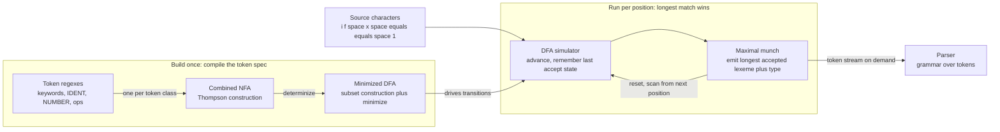

# 🔎 Lexical Analysis and Tokenization

> [!abstract] TL;DR
> **Lexical analysis** (scanning) is the compiler's **first phase**: it reads the raw stream of source *characters* and groups them into a stream of **tokens** — keywords, identifiers, literals, operators, and punctuation — each tagged with a **type**, its matched text (the **lexeme**), and a source **position**. Each token class is specified by a **regular expression**, so the lexer recognizes exactly a *regular language* — which is why a finite automaton (a compiled **DFA**) can do the job in a single linear pass. The critical disambiguation rule is **maximal munch** (longest match wins), so `==` beats `=` and `while` beats the identifier `whil`+`e`. Lexing strips whitespace and comments, reports illegal-character and unterminated-string errors, and hands the parser a clean, higher-abstraction token stream — turning character soup into labeled words.

---

## Intuition

**Analogy — reading before comprehension.** Before you can understand the *sentence* "if the door is locked, knock," your eye must first do something more primitive: it must recognize the individual **words**. Your visual system silently groups the stream of letters `i`, `f`, ` `, `t`, `h`, `e`, ... into chunks — "if", "the", "door" — and skips the blank spaces between them without a second thought. Only after that segmentation happens can grammar and meaning kick in.

A lexer is exactly that reading reflex for a compiler. Given the character soup `if(x==1)`, it does not yet care what the program *means*; it just groups letters into labeled chunks: the **keyword** `if`, a **left paren**, the **identifier** `x`, the **equality operator** `==`, the **integer literal** `1`, a **right paren**. It throws away the spaces, notes where each chunk started (for error messages), and passes a tidy sequence of `(type, text)` pairs onward. The **parser** — the "grammar" stage — then works with clean words instead of raw characters, which is a far easier job. Raising the abstraction from *characters* to *tokens* is the entire point of the lexer.

---

## How It Works

### The role of the lexer

The scanner has a small, sharply-defined set of jobs:

1. **Read raw characters and group them into tokens.** A token is a *category* — `IDENT`, `INT`, `IF`, `PLUS`, `LPAREN` — paired with the actual matched text.
2. **Classify** each token with a **type** and carry its **lexeme** (value). `count` is an `IDENT` whose lexeme is `"count"`; `42` is an `INT` whose lexeme is `"42"`.
3. **Strip whitespace and comments.** These matter for *separating* tokens but usually carry no syntactic meaning, so they are recognized and discarded (or attached as "trivia" in formatters).
4. **Track source positions** — line and column of every token — so later phases can report `error at line 12, col 5` instead of a useless offset.
5. **Raise the abstraction level for the parser.** The parser is defined over a *grammar of tokens*, not characters; lexing lets the grammar say `IF LPAREN expr RPAREN` instead of drowning in character-level rules.

### Tokens, lexemes, and patterns — three distinct things

These three are constantly confused, so pin them down:

- **Pattern** — the *rule* describing a class of strings, written as a **regular expression**. Example: `IDENT = [A-Za-z_][A-Za-z0-9_]*`.
- **Token (type)** — the *category name* the pattern defines: `IDENT`, `NUMBER`, `IF`.
- **Lexeme** — the *actual concrete string* matched from the source: the characters `count`, `42`, `"hello"`.

So "the lexeme `count` is an instance of the token type `IDENT`, which is defined by the pattern `[A-Za-z_][A-Za-z0-9_]*`."

### Regular expressions as the specification, and the regex → NFA → DFA pipeline

Because each token class is described by a regular expression, a lexer's job is to recognize a **regular language** — precisely the class that finite automata accept. This is the deep tie to automata theory (see [[Regular_Expressions_and_Kleenes_Theorem]] and [[Finite_Automata_DFA_and_NFA]]). A lexer generator turns the token spec into a fast table-driven scanner via a standard pipeline:

1. **Regexes → NFA (Thompson's construction).** Each token pattern compiles to a small NFA; the alternation of all token NFAs (with the accept states *labeled by token type*) forms one combined NFA.
2. **NFA → DFA (subset construction).** The combined NFA is determinized into a DFA whose states are sets of NFA states.
3. **DFA minimization.** The DFA is shrunk to its unique minimal form ([[Myhill_Nerode_and_DFA_Minimization]]), yielding a compact transition table.
4. **DFA simulation = the scanner.** At run time the lexer is just a DFA simulator: one array lookup per input character. This is how `lex`/`flex`/`re2c` produce scanners that run at hundreds of megabytes per second.

### Maximal munch (longest match) — the key disambiguation rule

At any position, several token patterns can match, and they can match *different lengths*. **Maximal munch** resolves this: **take the longest match.** This is why:

- `==` scans as one `EQ` token, not two `ASSIGN` tokens — the 2-character match beats the 1-character one.
- `<=` beats `<`, `>=` beats `>`, `!=` beats `!`.
- `iffy` scans as one identifier, *not* the keyword `if` followed by `fy` — the 4-character identifier match is longer than the 2-character keyword match.

When two patterns match the **same longest length**, the **rule order** breaks the tie (priority). Since keywords like `if`, `while`, `return` are *also* valid identifiers, the keyword rules are listed **before** the identifier rule so a bare `if` becomes the `IF` keyword — while maximal munch still keeps `iffy` a single identifier. (Note: length-based maximal munch already makes `==` beat `=` regardless of order; ordering only matters for equal-length ties, the keyword-vs-identifier case. Many hand-written lexers instead match one identifier and then look it up in a small **keyword hash set**.)

### Flow / Architecture



Read left to right: the token spec is compiled **once** into a minimized DFA. At run time the scanner feeds characters through that DFA, remembering the last position where it passed through an accept state; when the DFA can no longer advance, it **backs up to that last accept** (maximal munch), emits the token, and restarts from the next character. The parser pulls tokens **on demand**, one at a time.

---

## Key Concepts

### Secondary (plain-language takeaway)
- A lexer is the compiler's "reading" step: it turns a stream of characters into a stream of labeled **words** (tokens).
- Each token carries a **type** (`IDENT`, `NUMBER`, `IF`) and the **text** it matched (its lexeme), plus where it appeared.
- Spaces and comments are recognized only to separate tokens, then thrown away.
- The golden rule is **longest match**: grab as many characters as still form a valid token, so `==` is one token, not two.

### Undergraduate (the compilers-course core)
- **Token / lexeme / pattern** distinction; patterns written as **regular expressions**.
- **Regular language recognition**: the lexer accepts a regular language, hence a **finite automaton** suffices — the direct link to [[Finite_Automata_DFA_and_NFA]] and [[Regular_Expressions_and_Kleenes_Theorem]].
- The **regex → NFA → DFA → minimized DFA** pipeline used by `lex`/`flex`; the scanner as a **DFA table simulator** running in O(n) over the input length.
- **Maximal munch** (longest match) with **rule-order priority** for equal-length ties; keyword-vs-identifier disambiguation.
- **Bounded lookahead and backing up**: the DFA may read past the end of a token and must back up to the last accepting position (the classic `Fortran DO 5 I = 1,25` vs `DO5I = 1.25` ambiguity motivates lookahead).
- **Whitespace/comment stripping**, **position tracking**, and the **lazy token-stream interface** to the parser (see the parser side in [[Parsing_and_Derivations]] and grammars in [[Context_Free_Grammars_and_Languages]]).
- **Lexical errors**: illegal characters, unterminated strings/comments; error recovery (skip to a synchronizing character).

### Graduate (deeper structure and practical edges)
- **Tie-breaking semantics of generated scanners**: `flex` implements *longest match, then earliest rule*; this two-level rule is a specification the token spec author must reason about.
- **DFA table compression** (default transitions, equivalence-class remapping of the 256-byte alphabet) — how `flex`/`re2c` keep tables small and cache-friendly; lexing is frequently the **hottest phase** of a compiler, so this matters.
- **Context beyond regular**: some "lexical" tasks are *not* regular and need extra state — **Python indentation** requires an off-band stack emitting synthetic `INDENT`/`DEDENT` tokens; **automatic semicolon insertion** (Go, JavaScript) injects tokens the source never wrote; **nested comments** need a counter (a pushdown, not a DFA). These are "lexer hacks."
- The **lexer hack** proper: in C, `T * x;` is ambiguous (multiply vs pointer declaration) unless the lexer consults a symbol table to decide whether `T` is a `typedef` name — a feedback edge from later phases into the scanner.
- **Scannerless parsing** and **PEG**: dissolving the lexer/parser boundary; and **Unicode** identifiers (NFC normalization, `XID_Start`/`XID_Continue` classes) that push token patterns beyond ASCII.
- **Incremental / re-entrant lexing** for editors: re-lexing only the edited region to keep syntax highlighting responsive.

---

## Python Demo

```python
"""
A maximal-munch lexer for a small C-like language.
Stdlib `re` + `collections` for the algorithm; matplotlib for visualization.

Demonstrates:
  1. Token types defined as REGULAR EXPRESSIONS, in PRIORITY ORDER.
  2. Scanning by MAXIMAL MUNCH: at each position the LONGEST match wins;
     equal-length ties are broken by rule order (keywords before IDENT).
  3. Line/column tracking for error reporting.
  4. Skipping whitespace and comments.
  5. Error handling: illegal characters and unterminated strings.
  6. A concrete AMBIGUITY: why '==' must beat '=' (longest match) and why
     'iffy' stays one identifier instead of keyword 'if' + 'fy'.
  7. A matplotlib bar chart of the token-type distribution.
"""

import re
from collections import Counter, namedtuple
import matplotlib.pyplot as plt

Token = namedtuple("Token", ["type", "lexeme", "line", "col"])


class LexError(Exception):
    pass


# --- Token specification --------------------------------------------------
# ORDER is the tie-breaker for EQUAL-LENGTH (maximal-munch) matches.
# Keywords are listed BEFORE IDENT, so a bare "if" lexes as the IF keyword,
# yet "iffy" still lexes as ONE IDENT because its match is strictly LONGER.
# (Multi-char ops like '==' beat '=' purely by length, so their order is not
#  load-bearing under maximal munch -- it would only matter for a first-match
#  engine. We list them first anyway as good, portable style.)
TOKEN_SPEC = [
    ("COMMENT", r"//[^\n]*"),                 # line comment
    ("SPACE",   r"[ \t]+"),
    ("NEWLINE", r"\n"),
    ("FLOAT",   r"\d+\.\d+"),
    ("INT",     r"\d+"),
    ("STRING",  r'"(?:\\.|[^"\\\n])*"'),      # string literal with escapes
    ("EQ",      r"=="),
    ("NE",      r"!="),
    ("LE",      r"<="),
    ("GE",      r">="),
    ("IF",      r"if"),                        # keywords BEFORE identifiers
    ("ELSE",    r"else"),
    ("WHILE",   r"while"),
    ("RETURN",  r"return"),
    ("LET",     r"let"),
    ("ASSIGN",  r"="),
    ("LT",      r"<"),
    ("GT",      r">"),
    ("PLUS",    r"\+"),
    ("MINUS",   r"-"),
    ("STAR",    r"\*"),
    ("SLASH",   r"/"),
    ("LPAREN",  r"\("),
    ("RPAREN",  r"\)"),
    ("LBRACE",  r"\{"),
    ("RBRACE",  r"\}"),
    ("SEMI",    r";"),
    ("IDENT",   r"[A-Za-z_][A-Za-z0-9_]*"),   # identifiers AND keyword spellings
]

SKIP = {"COMMENT", "SPACE", "NEWLINE"}
COMPILED = [(name, re.compile(pat)) for name, pat in TOKEN_SPEC]
COMPILED_BY_NAME = {name: rx for name, rx in COMPILED}


def scan(src, longest=True):
    """Tokenize `src`. With longest=True this is a correct maximal-munch lexer;
    longest=False deliberately picks the SHORTEST match to expose the bug that
    maximal munch prevents (used only in the ambiguity demo)."""
    pos, line, col = 0, 1, 1
    out = []
    n = len(src)
    while pos < n:
        # A friendlier error than "illegal char" for a dangling quote.
        if src[pos] == '"' and not COMPILED_BY_NAME["STRING"].match(src, pos):
            raise LexError(f"unterminated string at line {line}, col {col}")

        best = None  # (length, name, lexeme)
        for name, rx in COMPILED:
            m = rx.match(src, pos)
            if not m:
                continue
            length = m.end() - pos
            if best is None:
                best = (length, name, m.group())
            elif longest and length > best[0]:     # strictly-greater => FIRST
                best = (length, name, m.group())    # longest rule wins the tie
            elif not longest and length < best[0]:  # pathological: shortest match
                best = (length, name, m.group())

        if best is None:
            raise LexError(f"illegal character {src[pos]!r} "
                           f"at line {line}, col {col}")

        length, name, lexeme = best
        if name not in SKIP:
            out.append(Token(name, lexeme, line, col))

        # Advance the cursor and the line/column counters.
        if "\n" in lexeme:
            line += lexeme.count("\n")
            col = length - lexeme.rfind("\n")   # cols reset after last newline
        else:
            col += length
        pos += length

    out.append(Token("EOF", "", line, col))
    return out


def types_of(src, longest=True):
    return [t.type for t in scan(src, longest) if t.type != "EOF"]


if __name__ == "__main__":
    program = (
        'let count = 0;\n'
        'while count < 10 {\n'
        '    count = count + 1;   // increment\n'
        '    if count == 5 {\n'
        '        return "half";\n'
        '    }\n'
        '}\n'
    )

    tokens = scan(program)
    print(f"{'TYPE':9}{'LEXEME':14}{'LINE':>5}{'COL':>4}")
    print("-" * 32)
    for t in tokens:
        print(f"{t.type:9}{t.lexeme[:12]!r:14}{t.line:>5}{t.col:>4}")

    print("\n--- Why maximal munch matters ---")
    print("x == y  maximal munch :", types_of("x == y", longest=True))
    print("x == y  shortest match:", types_of("x == y", longest=False))
    print("if iffy               :", types_of("if iffy"))  # -> ['IF', 'IDENT']

    print("\n--- Lexical error handling ---")
    for bad in ["let x = @;", 'msg = "oops']:
        try:
            scan(bad)
        except LexError as e:
            print(f"  {bad!r:16} -> LexError: {e}")

    # --- Visualize the token-type distribution of the sample program ---
    counts = Counter(t.type for t in tokens if t.type != "EOF")
    labels = [k for k, _ in counts.most_common()]
    heights = [counts[k] for k in labels]

    plt.figure(figsize=(9, 4))
    plt.bar(labels, heights, color="steelblue", edgecolor="black")
    plt.title("Token-type distribution for the sample program")
    plt.xlabel("token type")
    plt.ylabel("count")
    plt.xticks(rotation=45, ha="right")
    plt.tight_layout()
    plt.savefig("token_distribution.png", dpi=120)
    print("\nSaved token-type distribution -> token_distribution.png")

# Expected highlights:
#   x == y  maximal munch  -> ['IDENT', 'EQ', 'IDENT']         (correct)
#   x == y  shortest match -> ['IDENT', 'ASSIGN', 'ASSIGN', 'IDENT']  (WRONG)
#   if iffy                -> ['IF', 'IDENT']   (keyword vs longer identifier)
#   'let x = @;'  -> illegal character '@'
#   'msg = "oops' -> unterminated string
```

Running it prints the full token stream with line/column positions (whitespace and the `// increment` comment silently dropped), then the punchline: under **maximal munch** `x == y` is `IDENT EQ IDENT`, but a shortest-match scanner mangles it into `IDENT ASSIGN ASSIGN IDENT` — two bogus assignment tokens. It also shows `if iffy` correctly splitting into the `IF` keyword and the *longer* identifier `iffy`, the two error cases firing, and it saves a bar chart of how often each token type appears — a quick visual of a program's lexical shape.

---

## Real-World Applications

- **Every compiler and interpreter front-end.** GCC, Clang, the Go and Rust compilers, CPython, and V8 all begin with a scanner. Many production compilers **hand-write** the lexer (Clang, Go, `rustc`) rather than generate it — for raw speed, precise error messages, and easy handling of context-sensitive quirks — while others use `flex`/`re2c` to compile a spec into a DFA table.
- **`lex` / `flex` / `re2c` generators.** These take a `.l` token spec (regex → action pairs) and emit C that is literally a DFA-table simulator, the textbook regex → NFA → DFA pipeline turned into a tool.
- **Syntax highlighting, linters, and formatters.** Editors (VS Code's TextMate/Tree-sitter grammars) and tools like ESLint, `gofmt`, and Prettier **reuse a lexer** to color, check, and re-print code. Formatters preserve comments and whitespace as "trivia" attached to nearby tokens.
- **Language servers (LSP).** IDEs re-lex incrementally on each keystroke to keep highlighting and diagnostics live, exploiting the fact that lexing is a fast local pass.
- **Data and query languages.** SQL engines, JSON/YAML parsers, protocol buffers, and template engines all tokenize input before parsing; `RE2`-style automaton engines back many of them (see [[Applications_of_Finite_Automata]]).

---

## Common Pitfalls

- **Forgetting maximal munch.** A naive scanner that emits the *first* single-character token it can match turns `==` into `= =`, `<=` into `< =`, and `->` into `- >`. Always take the **longest** valid token, backing up to the last accepting position.
- **Keyword-vs-identifier ordering.** Because keywords match the identifier pattern too, listing the identifier rule first (or forgetting the keyword lookup) makes `if`, `while`, and `return` come out as plain identifiers. List keywords first, or match an identifier and then check a keyword set — but never let `whileX` become `while` + `X`.
- **Greedy string/comment patterns.** `".*"` with a dot that spans lines will swallow everything from the first quote to the *last* quote in the file. Constrain the body (`[^"\\\n]` plus explicit escapes) and handle unterminated literals with a real error, not a silent giant token.
- **Nested comments with a regex.** `/* ... /* ... */ ... */` is **not regular** — a single regex cannot count nesting depth. You need an explicit depth counter (a mini pushdown) in the lexer.
- **Significant whitespace done wrong.** Python-style indentation needs an **indent stack** that emits synthetic `INDENT`/`DEDENT` tokens; treating newlines and spaces as pure throwaway trivia loses the block structure entirely. Similarly, Go/JS **automatic semicolon insertion** must inject `SEMI` tokens the programmer never typed.
- **Dropping source positions.** If the lexer discards line/column, every downstream error becomes "syntax error somewhere." Track and attach positions to *every* token from the start.
- **Number/edge lexing.** `1.` vs `1.5` vs `1..5` (a range), `0x1F`, `1e10`, and a leading `-` (unary minus vs part of the literal) are classic maximal-munch traps that need careful pattern design.
- **Catastrophic backtracking in the spec.** Reusing a production regex engine with nested quantifiers can turn lexing into a ReDoS hazard; DFA-based scanners avoid this by construction (see [[Regular_Expressions_and_Kleenes_Theorem]]).

---

## Related Concepts

- [[Regular_Expressions_and_Kleenes_Theorem]] — token patterns *are* regular expressions; Kleene's theorem is why a finite automaton can recognize them.
- [[Finite_Automata_DFA_and_NFA]] — the scanner is a compiled, minimized **DFA** simulator; this is the machine side of the token spec.
- [[Myhill_Nerode_and_DFA_Minimization]] — how the scanner's DFA is shrunk to its minimal transition table for speed and small memory.
- [[Applications_of_Finite_Automata]] — lexing is the flagship application of finite automata alongside `grep`/`RE2` and protocol matching.
- [[Context_Free_Grammars_and_Languages]] — the *next* phase up: the parser consumes the token stream against a context-free grammar of tokens.
- [[Parsing_and_Derivations]] — how tokens are assembled into a parse tree; the lexer's consumer, often pulling tokens lazily/on demand.
- [[String_Matching_Overview]] — situates automaton-based scanning within the broader family of pattern-matching algorithms.
- [[Aho_Corasick]] — a DFA over a *set* of patterns; the same automaton idea a lexer uses across all token classes at once.
- [[KMP_Algorithm]] — a single-pattern finite automaton; a concrete, high-performance DFA relative to the multi-pattern scanner.

> Sibling Compilers notes still to be built cross-reference this one in prose: `Compilers_Overview` (where lexing sits in the phase pipeline), `Context_Free_Grammars_for_Parsing` and `Top_Down_and_Recursive_Descent_Parsing` (the parser that consumes the token stream), and `Compiler_Toolchains_and_LLVM` (hand-written vs generated scanners in production toolchains).

---

## Review Questions

1. **(Secondary / conceptual)** Explain the difference between a **token**, a **lexeme**, and a **pattern** using the identifier `total` as your running example. Why does the parser prefer to work with tokens instead of raw characters?
2. **(Undergraduate / scenario)** You are writing a lexer for a language with the operators `<`, `<=`, and `<<`. A test shows that `x <= y` is being scanned as `LT ASSIGN`. Which rule is being violated, and exactly how would you fix the scanner so `<=` is recognized as one token while `< =` (with a space) is still two? Then explain why the keyword `while` and the identifier `whileLoop` do not conflict.
3. **(Graduate / trade-off)** Python's indentation and Go's automatic semicolon insertion both require the lexer to emit tokens that are *not literally present* in the source. Explain why these tasks push the scanner beyond a pure regular-language DFA, what extra state each needs, and argue when you would **hand-write** a lexer versus generate one with `flex`/`re2c` given goals of raw throughput, error-message quality, and maintainability.

---

## Sources

- Aho, Lam, Sethi, Ullman. *Compilers: Principles, Techniques, and Tools* ("The Dragon Book"), 2nd ed. — Chapter 3, "Lexical Analysis" (tokens, patterns, regex → NFA → DFA, `lex`).
- Cooper & Torczon. *Engineering a Compiler*, 2nd ed. — Chapter 2, "Scanners" (maximal munch, table-driven DFA scanners, hand-coded lexers).
- Westley Weimer / GNU. *flex: The Fast Lexical Analyzer Generator — Manual*. — https://westes.github.io/flex/manual/ (longest-match then earliest-rule semantics, DFA tables).
- Russ Cox. "Regular Expression Matching Can Be Simple And Fast." — https://swtch.com/~rsc/regexp/regexp1.html (Thompson NFA construction and DFA simulation behind fast scanners).
- Rob Pike. "Lexical Scanning in Go." — https://go.dev/talks/2011/lex.slide (design of a fast, hand-written, concurrent lexer feeding a parser on demand).

---

#compilers #lexical-analysis #tokenization #regular-expressions #scanner
