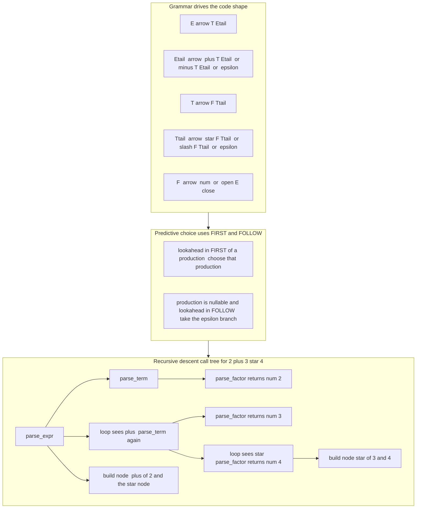

# 🌳 Top-Down and Recursive Descent Parsing

> [!abstract] TL;DR
> **Top-down parsing** builds the parse tree from the **root down**: it starts at the grammar's start symbol and, using a few tokens of **lookahead**, *predicts* which production to apply at each step until it derives the input string. Its most popular incarnation is **recursive descent**, where each grammar **nonterminal becomes a parsing function** and the function-call structure literally mirrors the grammar — hand-written, readable, and superb at producing precise error messages. The predictive engine that decides "which rule next?" is driven by **FIRST** and **FOLLOW** sets; the price of admission is that the grammar must be **LL(k)**: free of **left recursion** and (for LL(1)) free of overlapping alternatives. Despite parsing theory favoring the more powerful bottom-up LR family, hand-written recursive descent is what actually ships inside GCC, Clang, and most modern language front-ends.

---

## Intuition

**Analogy:** Imagine you are handed a thick technical book and told to *reconstruct its table of contents by drilling downward*. You start at the top with the overall goal — "this is a **Book**" — which the rules say expands into **Chapters**; each Chapter expands into **Sections**; each Section into **Paragraphs**; each Paragraph into **sentences** you can finally read off the page. You never guess wildly: at each level you glance at the next word on the page to decide *which* rule to follow. You are following the grammar's rules **downward**, and each rule becomes a step in your descent.

Recursive descent takes that image literally. The rule "a **program** is a list of **statements**" becomes a function `parse_program` that repeatedly calls `parse_statement`; the rule "a **statement** is an **expression** followed by a semicolon" becomes `parse_statement` calling `parse_expression`. The shape of your *code* becomes a photograph of the shape of your *grammar*. When the recursion bottoms out on the actual tokens, the chain of function calls you made *is* the parse tree — drawn top-down, root first.

---

## How It Works

### Core Mechanics

1. **Start at the start symbol.** Top-down parsing attempts to construct a *leftmost derivation*: begin with the goal nonterminal `E` and repeatedly replace the leftmost nonterminal by the right-hand side of one of its productions, aiming to match the input left to right.
2. **Predict, don't backtrack.** A naive top-down parser might try a production, fail, and backtrack. A **predictive** parser avoids this: it peeks at the next `k` tokens of **lookahead** and uses a decision table to pick the *unique* correct production. One-token lookahead — **LL(1)** — is the common case; the first `L` means scan **L**eft-to-right, the second `L` means produce a **L**eftmost derivation.
3. **One function per nonterminal (recursive descent).** Each nonterminal `A` becomes a function `parse_A`. Inside it, terminals are *matched-and-consumed*, and nonterminals are *called as sub-functions*. Alternatives (`A -> X | Y`) become a `switch`/`if` on the lookahead token; repetition (`A -> B*`) becomes a `while` loop. The call stack transparently plays the role of the pushdown stack a formal parser would use — see [[Pushdown_Automata]].
4. **FIRST and FOLLOW drive the prediction.** To choose between `A -> α` and `A -> β`, the parser asks: *does the current token belong to FIRST(α) or FIRST(β)?* If a production can vanish (derive ε), the token might instead belong to FOLLOW(A). These two sets are the entire machinery behind an LL(1) parse table.
5. **Build the AST while descending.** As each function returns, it constructs and returns its subtree, so the parser produces an Abstract Syntax Tree in the same downward sweep — no separate tree-building pass required.

**FIRST and FOLLOW, precisely.**
- `FIRST(X)` = the set of terminals that can appear as the *first* symbol of some string derived from `X` (plus ε if `X` can derive the empty string).
- `FOLLOW(A)` = the set of terminals that can appear *immediately to the right* of `A` in some sentential form (the end-marker `$` counts for the start symbol).
- **LL(1) condition:** for every nonterminal, the alternatives must have *disjoint* prediction sets. When two productions' FIRST sets overlap (or a nullable production's FIRST clashes with the nonterminal's FOLLOW), you get a **conflict** and the grammar is not LL(1).

### Left recursion and left factoring

Top-down parsers **loop forever on left recursion**. A rule like `expr -> expr + term` makes `parse_expr` call `parse_expr` as its very first act, with no token consumed — infinite descent. The fix is to **eliminate left recursion** by rewriting to right recursion plus iteration:

```
E  -> E + T | T          (left-recursive, BAD for top-down)

E  -> T E'               (rewritten)
E' -> + T E' | ε
```

In hand-written code the `E'` tail simply becomes a **`while` loop** inside `parse_expr`. **Left factoring** solves the sibling problem of a shared prefix (`stmt -> if C then S | if C then S else S`): factor the common `if C then S` out so a single token of lookahead suffices.

### Precedence, associativity, and Pratt parsing

Operator **precedence** is encoded by a *cascade* of functions — `parse_expr` (lowest precedence, `+ -`) calls `parse_term` (`* /`) calls `parse_factor` (atoms and parentheses). Because higher-precedence operators sit *deeper* in the call chain, they bind tighter automatically. **Left-associativity** falls out of using a **loop** (`while` over `+ -`) rather than right-recursion, so `a - b - c` groups as `(a - b) - c`. For languages with many precedence levels, **Pratt parsing** (a.k.a. **precedence climbing**) collapses that cascade into one loop driven by a table of binding powers — an elegant, compact alternative to a tower of functions.

### The recursive call tree mirrors the parse tree



---

## Key Concepts

**Secondary (intuitive level)**
- A top-down parser reads a grammar like a set of *fill-in-the-blanks* rules and works from the big goal down to the individual words.
- Recursive descent = "turn every grammar rule into a function that calls the other rules." The code looks like the grammar.
- It reads left to right and never has to un-read: with one peek at the next token it knows what to do.

**Undergraduate (mechanism level)**
- **LL(k) grammars:** the class parseable by predictive top-down parsing with `k`-token lookahead; **LL(1)** is the practical sweet spot.
- **FIRST / FOLLOW sets** and the **LL(1) parse table**: table-driven predictive parsing vs. hand-written recursive descent (same theory, different packaging).
- **Left-recursion elimination** and **left factoring** as mandatory grammar surgery before top-down parsing.
- **Precedence-by-cascade** and **left-associativity-by-loop**; the parser builds an AST during the descent.

**Graduate (systems / theory level)**
- LL vs. LR power: LL captures strictly *fewer* grammars than LR (deterministic CFLs); yet hand-written recursive descent dominates real compilers because of **error quality**, control over semantics, and freedom from tool build-steps.
- **Pratt / precedence-climbing** parsers, **parser combinators**, and **PEG** (Parsing Expression Grammars, with *ordered choice* and unlimited lookahead via memoized *packrat* parsing) as the modern top-down ecosystem.
- **Error recovery** theory: panic-mode with FOLLOW-based synchronizing tokens, phrase-level recovery, and producing multiple high-quality diagnostics from a single pass.
- Relationship to formal machines: a recursive-descent parser is a program realization of a **deterministic pushdown automaton** whose stack is the call stack — see [[Pushdown_Automata]] and [[Parsing_and_Derivations]].

---

## Python Demo

```python
# Recursive-descent parser for arithmetic with correct precedence & associativity.
# Grammar (left recursion already eliminated into loops):
#     expr   -> term  (('+' | '-') term)*        # lowest precedence, left-assoc
#     term   -> factor (('*' | '/') factor)*     # higher precedence, left-assoc
#     factor -> NUMBER | '(' expr ')'            # atoms
#
# We tokenize, parse into an AST (one function per nonterminal), evaluate it to
# confirm precedence is respected, compute FIRST/FOLLOW for the predictive form,
# and visualize the AST + FIRST/FOLLOW table with matplotlib.

import re
import matplotlib.pyplot as plt

# ---------- 1. Lexer ----------
def tokenize(src):
    tokens = []
    for m in re.finditer(r"\s*(?:(\d+)|([+\-*/()]))", src):
        num, sym = m.group(1), m.group(2)
        if num is not None:
            tokens.append(("num", int(num)))
        elif sym is not None:
            tokens.append((sym, sym))
    tokens.append(("$", None))  # end marker
    return tokens

# ---------- 2. AST node ----------
class Node:
    def __init__(self, label, children=None, value=None):
        self.label = label                 # operator symbol or number text
        self.children = children or []      # left/right for binary ops
        self.value = value                  # int payload for leaves

# ---------- 3. Recursive-descent parser (one function per nonterminal) ----------
class Parser:
    def __init__(self, tokens):
        self.tokens = tokens
        self.i = 0
        self.call_trace = []               # records the descent order

    def peek(self):    return self.tokens[self.i][0]
    def advance(self):
        tok = self.tokens[self.i]; self.i += 1; return tok

    def parse_expr(self):                  # expr -> term (('+'|'-') term)*
        self.call_trace.append("parse_expr")
        node = self.parse_term()
        while self.peek() in ("+", "-"):   # loop => LEFT associativity
            op = self.advance()[0]
            right = self.parse_term()
            node = Node(op, [node, right])
        return node

    def parse_term(self):                  # term -> factor (('*'|'/') factor)*
        self.call_trace.append("parse_term")
        node = self.parse_factor()
        while self.peek() in ("*", "/"):
            op = self.advance()[0]
            right = self.parse_factor()
            node = Node(op, [node, right])
        return node

    def parse_factor(self):                # factor -> NUMBER | '(' expr ')'
        self.call_trace.append("parse_factor")
        tok = self.peek()
        if tok == "num":
            val = self.advance()[1]
            return Node(str(val), value=val)
        if tok == "(":
            self.advance()                 # consume '('
            node = self.parse_expr()       # recurse back to the top rule
            if self.peek() != ")":
                raise SyntaxError("expected ')'")
            self.advance()                 # consume ')'
            return node
        raise SyntaxError(f"unexpected token {tok!r}")

# ---------- 4. Evaluate the AST (confirms precedence/associativity) ----------
def evaluate(n):
    if not n.children:                     # leaf number
        return n.value
    a, b = evaluate(n.children[0]), evaluate(n.children[1])
    return {"+": a + b, "-": a - b, "*": a * b, "/": a / b}[n.label]

def sexpr(n):                              # pretty-print AST as an s-expression
    if not n.children:
        return n.label
    return f"({n.label} {sexpr(n.children[0])} {sexpr(n.children[1])})"

# ---------- 5. FIRST / FOLLOW for the predictive (LL(1)) grammar form ----------
# E  -> T E'
# E' -> + T E' | - T E' | eps
# T  -> F T'
# T' -> * F T' | / F T' | eps
# F  -> ( E ) | num
GRAMMAR = {
    "E":  [["T", "E'"]],
    "E'": [["+", "T", "E'"], ["-", "T", "E'"], ["eps"]],
    "T":  [["F", "T'"]],
    "T'": [["*", "F", "T'"], ["/", "F", "T'"], ["eps"]],
    "F":  [["(", "E", ")"], ["num"]],
}
START = "E"
NONTERMS = set(GRAMMAR)

def is_nt(sym): return sym in NONTERMS

def compute_first():
    first = {nt: set() for nt in NONTERMS}
    changed = True
    while changed:
        changed = False
        for A, prods in GRAMMAR.items():
            for prod in prods:
                if prod == ["eps"]:
                    if "eps" not in first[A]:
                        first[A].add("eps"); changed = True
                    continue
                for sym in prod:
                    add = first[sym] - {"eps"} if is_nt(sym) else {sym}
                    if not add <= first[A]:
                        first[A] |= add; changed = True
                    if is_nt(sym) and "eps" in first[sym]:
                        continue          # nullable -> look at next symbol
                    break
    return first

def first_of_seq(seq, first):
    result = set()
    for sym in seq:
        add = first[sym] if is_nt(sym) else {sym}
        result |= (add - {"eps"})
        if not (is_nt(sym) and "eps" in first[sym]):
            return result
    result.add("eps")
    return result

def compute_follow(first):
    follow = {nt: set() for nt in NONTERMS}
    follow[START].add("$")
    changed = True
    while changed:
        changed = False
        for A, prods in GRAMMAR.items():
            for prod in prods:
                for idx, sym in enumerate(prod):
                    if not is_nt(sym):
                        continue
                    rest = prod[idx + 1:]
                    fr = first_of_seq(rest, first) if rest else {"eps"}
                    add = fr - {"eps"}
                    if "eps" in fr or not rest:
                        add |= follow[A]
                    if not add <= follow[sym]:
                        follow[sym] |= add; changed = True
    return follow

# ---------- 6. Run everything ----------
SRC = "2 + 3 * 4 - 1"
tokens = tokenize(SRC)
parser = Parser(tokens)
ast = parser.parse_expr()

print("input      :", SRC)
print("AST        :", sexpr(ast))              # (- (+ 2 (* 3 4)) 1)
print("evaluates  :", evaluate(ast))           # 13  (precedence respected)
print("call trace :", " -> ".join(parser.call_trace[:6]), "...")

first = compute_first()
follow = compute_follow(first)
print("\nFIRST / FOLLOW sets:")
for nt in ["E", "E'", "T", "T'", "F"]:
    print(f"  {nt:<3} FIRST={sorted(first[nt])}  FOLLOW={sorted(follow[nt])}")

# ---------- 7. Visualize AST + FIRST/FOLLOW ----------
def layout(node, depth, counter, pos):
    if not node.children:
        x = counter[0]; counter[0] += 1
        pos[id(node)] = (x, -depth); return x
    xs = [layout(c, depth + 1, counter, pos) for c in node.children]
    x = sum(xs) / len(xs); pos[id(node)] = (x, -depth); return x

def draw_edges(node, pos, ax):
    for c in node.children:
        (x0, y0), (x1, y1) = pos[id(node)], pos[id(c)]
        ax.plot([x0, x1], [y0, y1], "-", color="#888", zorder=1)
        draw_edges(c, pos, ax)

def draw_nodes(node, pos, ax):
    x, y = pos[id(node)]
    is_op = bool(node.children)
    ax.scatter([x], [y], s=1500, zorder=2,
               color="#ffd27f" if is_op else "#9ad0ec",
               edgecolors="#444", linewidths=1.2)
    ax.text(x, y, node.label, ha="center", va="center", fontsize=12, fontweight="bold")
    for c in node.children:
        draw_nodes(c, pos, ax)

pos, counter = {}, [0]
layout(ast, 0, counter, pos)

fig, (axl, axr) = plt.subplots(1, 2, figsize=(13, 5.5), gridspec_kw={"width_ratios": [1.4, 1]})
draw_edges(ast, pos, axl); draw_nodes(ast, pos, axl)
axl.set_title(f"AST for '{SRC}'  =  {evaluate(ast)}", fontsize=13)
axl.axis("off")

rows = [[nt, ", ".join(sorted(first[nt])), ", ".join(sorted(follow[nt]))]
        for nt in ["E", "E'", "T", "T'", "F"]]
axr.axis("off")
axr.set_title("Predictive-parsing decision sets", fontsize=13)
table = axr.table(cellText=rows, colLabels=["Nonterm", "FIRST", "FOLLOW"],
                  loc="center", cellLoc="left")
table.auto_set_font_size(False); table.set_fontsize(10); table.scale(1, 1.6)

plt.tight_layout()
plt.savefig("recursive_descent_demo.png", dpi=120)
print("\nSaved figure -> recursive_descent_demo.png")
```

**Expected console output:**

```
input      : 2 + 3 * 4 - 1
AST        : (- (+ 2 (* 3 4)) 1)
evaluates  : 13
call trace : parse_expr -> parse_term -> parse_factor -> parse_term -> parse_factor -> parse_factor ...

FIRST / FOLLOW sets:
  E   FIRST=['(', 'num']  FOLLOW=[')', '$']
  E'  FIRST=['+', '-', 'eps']  FOLLOW=[')', '$']
  T   FIRST=['(', 'num']  FOLLOW=[')', '+', '-', '$']
  T'  FIRST=['*', '/', 'eps']  FOLLOW=[')', '+', '-', '$']
  F   FIRST=['(', 'num']  FOLLOW=[')', '*', '+', '-', '/', '$']
```

The AST `(- (+ 2 (* 3 4)) 1)` proves precedence (`*` bound before `+`/`-`) and left-associativity (`... - 1` sits at the root), and evaluating it gives **13**, not the `16` you'd get from naive left-to-right evaluation. The FIRST/FOLLOW table shows *why the parser never had to backtrack*: at every choice point the alternatives' FIRST sets are disjoint, so one token of lookahead uniquely predicts the production — the grammar is LL(1).

---

## Real-World Applications

> **Example — Clang and GCC C/C++ front-ends.** Both flagship C/C++ compilers use **hand-written recursive-descent parsers**, not tool-generated LR tables. The reason is almost entirely *diagnostics and control*: recursive descent lets Clang emit famously precise, well-recovered error messages ("expected ';' after expression", with a caret and a fix-it), continue parsing past errors, and interleave semantic actions and context-sensitive hacks (C++'s notorious "is this a type or a variable?" disambiguation) that a rigid table-driven parser makes awkward. The theoretical extra power of LR simply isn't worth the loss of readability and error quality.

Other production top-down parsers: **Python's** old parser and its readable grammar, **Roslyn** (the C# compiler), the **V8/SpiderMonkey** JavaScript engines, **Go's** compiler, and countless DSLs built with **parser-combinator** libraries (Haskell's parsec, Rust's nom) or **PEG** tools (peg.js, pest). Pratt parsing powers the expression parsers inside many of these when operator precedence gets deep.

---

## Common Pitfalls

- **Left recursion = infinite loop.** Writing `expr -> expr '+' term` directly makes `parse_expr` call itself with no progress and blow the stack. Always *eliminate left recursion* (rewrite to a loop) before coding a top-down parser.
- **Un-factored common prefixes.** `stmt -> 'if' c 'then' s | 'if' c 'then' s 'else' s` cannot be decided with one token — the shared `if` prefix causes a FIRST/FIRST conflict. **Left-factor** it so a single lookahead suffices.
- **The dangling-else ambiguity.** Even after factoring, `if-then-else` is ambiguous; the standard fix is to bind `else` to the nearest `if` by structuring the recursive functions accordingly (a deliberate, documented choice, not an accident).
- **Forgetting nullable productions in FOLLOW.** If a production can derive ε, its prediction set must include FOLLOW, not just FIRST. Omitting this makes the parser reject valid empty constructs.
- **Precedence baked in wrong.** Putting `+` and `*` at the *same* function level, or using right-recursion where you meant left-associativity, silently produces the wrong AST — the parser succeeds but the *meaning* is wrong. Always evaluate a known expression (like `2 + 3 * 4 - 1 = 13`) as a regression check.
- **Swallowing errors instead of recovering.** A `raise` on the first bad token gives one diagnostic and quits. Production parsers use **panic-mode recovery** — skip tokens until a synchronizing token in FOLLOW appears — to report *many* errors per run.

---

## Related Concepts

- [[Parsing_and_Derivations]] — the umbrella note: top-down parsers trace a *leftmost* derivation, bottom-up parsers a reverse *rightmost* one; recursive descent is the top-down branch of that family.
- [[Context_Free_Grammars_and_Languages]] — the CFG formalism whose productions each become a parsing function; LL(k) is a subclass of CFGs, and left-recursion elimination / left factoring are grammar transformations.
- [[Pushdown_Automata]] — the formal machine a recursive-descent parser realizes; the program's call stack *is* the PDA stack.
- [[Recursion_Fundamentals]] — the recursion + call-stack mechanics that make "one function per nonterminal" work; each descent is a stack frame.
- [[Divide_and_Conquer]] — the same "break a big goal into sub-goals, solve, recombine" shape that recursive descent applies to grammar structure.

*Companion notes planned for this Compilers vault (not yet written): **Context_Free_Grammars_for_Parsing** (grammar engineering for parsers), **Bottom_Up_and_LR_Parsing** (the shift-reduce/LR counterpart with more grammar power but weaker error messages), **Abstract_Syntax_Trees_and_Parser_Design** (building and shaping the AST, Pratt parsing, parser combinators, PEG), and **Lexical_Analysis_and_Tokenization** (the token stream this parser consumes).*

---

## Review Questions

1. **(Secondary)** In recursive descent, what does each grammar nonterminal become in the code, and how do a grammar alternative (`A -> X | Y`) and a repetition (`A -> B*`) translate into that code?
2. **(Undergraduate)** Given `E -> E + T | T`, explain why a top-down parser loops forever, rewrite the grammar to make it LL(1), and describe how the rewrite turns into a `while` loop that yields *left*-associative parse trees.
3. **(Graduate)** LR parsers handle strictly more grammars than LL parsers, yet GCC and Clang ship hand-written recursive-descent parsers. Give three concrete engineering reasons this trade-off favors recursive descent in practice, and describe how FIRST/FOLLOW-based *panic-mode recovery* lets such a parser report multiple errors in one pass.

---

## Sources

- Aho, Lam, Sethi, Ullman — *Compilers: Principles, Techniques, and Tools* ("the Dragon Book"), 2nd ed., Ch. 4 (Syntax Analysis, LL parsing, FIRST/FOLLOW). [Pearson](https://www.pearson.com/en-us/subject-catalog/p/compilers-principles-techniques-and-tools/P200000003472)
- Terence Parr — *Language Implementation Patterns* (recursive-descent and predictive parsing patterns). [Pragmatic Bookshelf](https://pragprog.com/titles/tpdsl/language-implementation-patterns/)
- Vaughan Pratt — "Top Down Operator Precedence" (POPL 1973), the original Pratt-parsing paper. [ACM DL](https://dl.acm.org/doi/10.1145/512927.512931)
- Bryan Ford — "Parsing Expression Grammars: A Recognition-Based Syntactic Foundation" (POPL 2004). [ACM DL](https://dl.acm.org/doi/10.1145/964001.964011)
- Bob Nystrom — *Crafting Interpreters*, "Parsing Expressions" chapter (a modern hands-on recursive-descent walkthrough). [craftinginterpreters.com](https://craftinginterpreters.com/parsing-expressions.html)

---

#compilers #parsing #recursive-descent #ll-parsing #predictive-parsing
