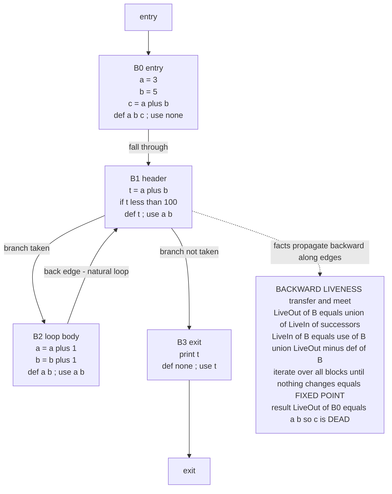

# 🕸️ Control Flow and Data Flow Analysis

> [!abstract] TL;DR
> **Control-flow analysis** carves a program's intermediate representation into **basic blocks** — maximal straight-line runs of instructions with one entry and one exit — and wires them together with edges for every possible branch, producing the **control-flow graph (CFG)**, the skeleton on which every later analysis runs. **Data-flow analysis** then answers, at *every* program point, questions like *which assignments could reach here?*, *which variables are still needed downstream?*, or *which expressions are already computed?* Each question is posed as a **transfer function** per block plus a **meet operator** (union or intersection) that combines facts where paths join, and is solved by **iterating to a fixed point** over a **lattice** of facts. The four classic analyses — **reaching definitions** (forward/may), **live variables** (backward/may, drives dead-code elimination and register allocation), **available expressions** (forward/must, drives common-subexpression elimination), and **very busy expressions** (backward/must) — are all instances of one **monotone data-flow framework**, whose grand generalization is **abstract interpretation**. The same machinery powers optimizers (GCC, LLVM), linters, bug finders, and security taint analyzers.

---

## Intuition

**Analogy — optimizing a city's road network.** Before you can improve traffic anywhere, you first draw a **map**: every intersection and every one-way street, showing which junctions can reach which. That map — junctions as nodes, permitted turns as arrows — *is* the **control-flow graph**. The basic blocks are the stretches of road between intersections where no car can enter or leave in the middle: once you're on the stretch you ride it to the end.

Only with the map in hand can you trace how **traffic — the values — actually flows** through it, and that is data-flow analysis. You ask concrete questions of every point on the map: *which cars (values) coming from upstream junctions could still be on this road?* (reaching definitions), *is anything downstream still waiting for the goods this truck is carrying, or is the truck empty and pointless?* (liveness — is this value still **needed**?), *has this exact delivery already been made on every route that leads here, so we needn't repeat it?* (available expressions). Where several roads merge into one, you must **combine** what could arrive from each — sometimes "anything from *any* incoming road might be here" (union / *may*), sometimes "only what's guaranteed on *every* incoming road" (intersection / *must*). And because the network has **loops** (a value can circle back), you can't compute the answer in a single pass: you keep re-propagating the traffic estimates around the map until they **stop changing** — the **fixed point**. That stable picture is exactly what tells you which streets are safe to close (dead code), which deliveries to reuse (common subexpressions), and which values to precompute (constant propagation).

---

## How It Works

### 1. Building the control-flow graph: basic blocks

The IR arrives as a flat list of instructions (three-address code, SSA, or LLVM IR — see the forthcoming sibling note `Intermediate_Representations`). Control-flow analysis partitions it into **basic blocks** using a two-step recipe that first finds **leaders** — the first instruction of each block:

1. **Identify leaders.** An instruction is a leader if it is (a) the very first instruction, (b) the **target** of any jump or branch, or (c) the instruction **immediately following** any jump or branch (the fall-through).
2. **Grow blocks.** Each leader starts a basic block that extends up to — but not including — the next leader. The result is a set of maximal straight-line sequences: **one entry (the leader), one exit (the terminator), no branching in between.** Control enters only at the top and leaves only at the bottom.
3. **Add edges.** Draw an edge from block `A` to block `B` whenever control can transfer from the end of `A` to the start of `B`: a conditional branch creates two out-edges, an unconditional jump one, a fall-through one. The result is the **CFG** — a directed graph (see [[Graph_Representation]]) with a distinguished entry and exit.

This CFG is the **skeleton for all flow analysis**. It is a directed graph, so the whole toolbox of [[Graph_Theory|graph theory]] applies: reachability, [[DFS|depth-first traversals]] to order the blocks, [[Strongly_Connected_Components|strongly connected components]] to spot loops, and [[Topological_Sort|topological / reverse-postorder]] to process forward analyses efficiently.

### 2. Data-flow analysis: transfer functions and the meet operator

A data-flow analysis attaches a **fact** (a set, a map, an abstract value) to the entry and exit of every block, written `IN[B]` and `OUT[B]`. Two ingredients define any analysis:

- **Transfer function** `f_B`: how a block *transforms* facts as control passes through it. For a forward analysis, `OUT[B] = f_B(IN[B])`; for a backward analysis, `IN[B] = f_B(OUT[B])`. Transfer functions are usually of the **gen/kill** shape: a block **generates** new facts and **kills** old ones, e.g. `OUT[B] = gen[B] ∪ (IN[B] − kill[B])`.
- **Meet operator** `⊓`: how facts from multiple incoming edges are **combined** where paths join. It is set **union** for *may* analyses ("is this true on *some* path?") and set **intersection** for *must* analyses ("is this true on *every* path?").

### 3. The four-way classification: forward/backward × may/must

Every classic analysis lands in one of four boxes, fixed by its **direction** and its **meet operator**:

| Analysis | Direction | May / Must | Meet | Question it answers | Optimization it enables |
|---|---|---|---|---|---|
| **Reaching definitions** | Forward | May | Union | Which assignments *might* reach this use? | use-def chains, constant propagation |
| **Available expressions** | Forward | Must | Intersection | Which expressions are *already* computed on all paths? | common-subexpression elimination |
| **Live variables** | Backward | May | Union | Will this variable be used before being overwritten? | dead-code elimination, register allocation |
| **Very busy (anticipated) expressions** | Backward | Must | Intersection | Is this expression *certain* to be evaluated ahead? | code hoisting, partial-redundancy elimination |

**Forward** analyses push facts along control-flow edges from entry to exit (`IN[B] = ⊓ OUT[predecessors]`). **Backward** analyses push facts against the edges from exit to entry (`OUT[B] = ⊓ IN[successors]`) — liveness is the canonical example: a variable is live at a point if some **future** path uses it before redefining it, so information flows from uses back toward definitions.

### 4. Live variables in detail (the workhorse)

A variable is **live** at a point if there is a path from that point to a **use** of the variable that does not first **redefine** it. The equations, at block granularity:

```
LiveOut[B] = ⋃ over successors S of  LiveIn[S]          (backward meet = union, a MAY analysis)
LiveIn[B]  = use[B]  ∪  ( LiveOut[B] − def[B] )          (transfer function)
```

where `use[B]` is the set of **upward-exposed uses** (variables read in `B` *before* any redefinition within `B`) and `def[B]` is the set of variables assigned in `B`. Liveness directly drives two heavyweight optimizations: **dead-code elimination** (an assignment whose target is *not live* immediately after it is provably useless and can be deleted) and **register allocation** — two variables whose live ranges never overlap can share a physical register, turning allocation into a graph-coloring problem over the **interference graph** (see the forthcoming sibling `Register_Allocation`).

### 5. The iterative fixed-point algorithm and why it terminates

Initialize every `IN`/`OUT` to the identity of the meet (∅ for *may*/union, the universal set for *must*/intersection), then **repeatedly apply the transfer functions** over all blocks until **nothing changes** — the **fixed point**. Termination is not luck; it is guaranteed by a theorem. The facts form a **lattice** of **finite height** (partial order — see [[Set_Theory_and_Relations|order relations]] — with meets and joins), the transfer functions are **monotone** (they never *un-learn* a fact: `x ⊑ y ⟹ f(x) ⊑ f(y)`), and each iteration moves the solution monotonically up (or down) the lattice. A monotone function climbing a finite-height lattice can only take finitely many steps before it stalls — that stall is the fixed point. This is the theory of **monotone data-flow frameworks** (Kildall, 1973). The naive round-robin sweep can be sharpened by the **worklist algorithm**: keep a queue of blocks whose input changed and re-process only *their* successors (forward) or predecessors (backward), avoiding wasted recomputation. Processing blocks in **reverse postorder** (from a [[DFS]] of the CFG) makes forward analyses converge in far fewer passes.

### 6. Dominance, loops, and the bridge to SSA

Richer analyses need CFG *structure*, not just edges. A block `D` **dominates** block `B` if every path from entry to `B` goes through `D`; the **dominator tree** captures this. A **back edge** is a CFG edge whose head dominates its tail, and it reveals a **natural loop** — the machinery loop optimizations depend on (the forthcoming sibling `Loop_Optimizations`). Dominance is also the foundation of **Static Single Assignment (SSA)** form (forthcoming sibling `Static_Single_Assignment_Form`): SSA gives every variable exactly one definition and inserts **φ-functions** at dominance frontiers where definitions merge. SSA makes **def-use chains explicit** and turns many data-flow analyses **sparse** — instead of propagating whole sets through every block, information flows directly along the (few) def-use edges, which is dramatically faster. Sparse conditional constant propagation (SCCP) is the classic payoff.

### Flow / Architecture



*Solid edges are the CFG — basic blocks joined by branch edges, including the `B2` back edge that makes the loop. The dashed edge points to the transfer/meet rules for backward **liveness**: facts flow against the arrows, re-propagated until the fixed point. That fixed point proves `LiveOut[B0] = {a, b}`, so `c = a + b` in `B0` is a **dead assignment**.*

---

## Key Concepts

**Secondary (intuitive, no CS background needed)**
- **Basic block** — a stretch of code with no branches in the middle: enter at the top, leave at the bottom, never jump into or out of the middle.
- **Control-flow graph** — the *map* of the program: blocks are junctions, branches are one-way streets.
- **Live variable** — a value still *needed* later. A variable that's assigned but never used again is carrying nothing — its assignment is **dead code** and can be deleted.
- **Run until it settles** — the analysis re-estimates the flow around the map over and over until the numbers stop changing.

**Undergraduate (a first compilers course)**
- **Leaders and block construction** — the branch-target / fall-through rule that cuts the instruction stream into basic blocks.
- **The four classic analyses** — reaching definitions, live variables, available expressions, very busy expressions.
- **Transfer function (gen/kill) and meet operator** — how a block transforms facts and how facts combine at merges (union vs intersection).
- **Forward vs backward, may vs must** — the two axes that classify every analysis and fix the meet operator and initialization.
- **Iterative fixed-point / worklist algorithm** — apply transfer functions until convergence; the worklist optimization re-processes only affected blocks.
- **Use-def and def-use chains** — the connections reaching-definitions builds, consumed by later optimizations.

**Graduate (program analysis)**
- **Monotone data-flow frameworks and lattices** — facts as a finite-height lattice, monotone transfer functions, guaranteed termination; Kildall's unification.
- **MOP vs fixed-point (MFP) solution** — the *meet-over-all-paths* ideal versus the computed solution; they coincide when transfer functions are **distributive**, and MFP is a safe over-approximation otherwise.
- **Dominators, back edges, natural loops** — the dominator tree, loop nesting, and reducibility that structure loop optimization and SSA construction.
- **SSA and sparse analysis** — φ-functions at dominance frontiers, explicit def-use edges, sparse conditional constant propagation.
- **Abstract interpretation** — Cousot & Cousot's unifying theory: sound static analysis by executing the program over an **abstract domain** (signs, intervals, congruences) connected to the concrete semantics by a **Galois connection**, with **widening/narrowing** to force convergence over infinite-height lattices.
- **Interprocedural analysis** — call graphs, context sensitivity (k-CFA), summary functions, and the soundness/precision/scalability trade-off; the boundary where undecidability (Rice's theorem, [[The_Halting_Problem_and_Undecidability]]) forces conservative approximation.

---

## Python Demo

```python
# CONTROL-FLOW + DATA-FLOW ANALYSIS from scratch, pure stdlib + matplotlib.
#
# We (1) build a CONTROL-FLOW GRAPH of basic blocks for a tiny program that
# contains a LOOP (so the analysis must iterate), then (2) run ITERATIVE
# LIVE-VARIABLE analysis (backward, may/union) to a FIXED POINT, printing the
# IN/OUT live sets per block on every sweep, (3) use the result to find a DEAD
# ASSIGNMENT, and (4) as a bonus run REACHING DEFINITIONS (forward, may/union)
# to contrast the two directions. Finally we VISUALIZE the annotated CFG and
# the iteration converging.
#
#   Program (3-address IR), partitioned into basic blocks:
#     B0 (entry):  a = 3 ; b = 5 ; c = a + b        # c is never used  -> DEAD
#     B1 (header): t = a + b ; if t < 100 goto B2 else B3
#     B2 (body):   a = a + 1 ; b = b + 1 ; goto B1  # back edge -> loop
#     B3 (exit):   print t

from dataclasses import dataclass, field
from typing import List, Set, Dict
import matplotlib.pyplot as plt

# --------------------------------------------------------------------------
# IR + CFG data structures
# --------------------------------------------------------------------------
@dataclass
class Stmt:
    text: str
    defs: Set[str]        # variables this statement assigns
    uses: Set[str]        # variables this statement reads

@dataclass
class Block:
    name: str
    stmts: List[Stmt]
    succ: List[str]
    use: Set[str] = field(default_factory=set)   # upward-exposed uses
    kill: Set[str] = field(default_factory=set)  # def[B]

def compute_use_def(b: Block) -> None:
    """use[B] = read-before-write in B ; def[B] = everything B writes."""
    seen_def: Set[str] = set()
    use: Set[str] = set()
    for s in b.stmts:
        for u in s.uses:
            if u not in seen_def:      # read before it is defined in this block
                use.add(u)
        seen_def |= s.defs
    b.use, b.kill = use, seen_def

# Build the CFG.
cfg: Dict[str, Block] = {
    "B0": Block("B0", [
        Stmt("a = 3",     {"a"}, set()),
        Stmt("b = 5",     {"b"}, set()),
        Stmt("c = a + b", {"c"}, {"a", "b"}),     # suspected dead assignment
    ], ["B1"]),
    "B1": Block("B1", [
        Stmt("t = a + b",  {"t"}, {"a", "b"}),
        Stmt("if t < 100", set(), {"t"}),
    ], ["B2", "B3"]),
    "B2": Block("B2", [
        Stmt("a = a + 1", {"a"}, {"a"}),
        Stmt("b = b + 1", {"b"}, {"b"}),
    ], ["B1"]),                                     # back edge -> B1
    "B3": Block("B3", [
        Stmt("print t", set(), {"t"}),
    ], []),
}
for b in cfg.values():
    compute_use_def(b)

# --------------------------------------------------------------------------
# (2) ITERATIVE LIVE-VARIABLE ANALYSIS  (backward, meet = union)
#     LiveOut[B] = U LiveIn[S] over successors S
#     LiveIn[B]  = use[B] U (LiveOut[B] - def[B])
# --------------------------------------------------------------------------
def liveness(cfg: Dict[str, Block]):
    live_in  = {n: set() for n in cfg}
    live_out = {n: set() for n in cfg}
    order = list(reversed(list(cfg)))   # process near-exit blocks first
    history = []                        # total live cardinality per sweep
    sweep = 0
    changed = True
    while changed:
        changed = False
        for n in order:
            b = cfg[n]
            new_out = set().union(*(live_in[s] for s in b.succ)) if b.succ else set()
            new_in = b.use | (new_out - b.kill)
            if new_out != live_out[n] or new_in != live_in[n]:
                changed = True
            live_out[n], live_in[n] = new_out, new_in
        sweep += 1
        total = sum(len(live_in[n]) + len(live_out[n]) for n in cfg)
        history.append(total)
        print(f"  -- sweep {sweep} --")
        for n in cfg:
            print(f"     {n}: IN={sorted(live_in[n]) or '{}'}  "
                  f"OUT={sorted(live_out[n]) or '{}'}")
    return live_in, live_out, history

print("LIVE-VARIABLE ANALYSIS (backward, iterating to a fixed point):")
live_in, live_out, history = liveness(cfg)
print(f"\nConverged after {len(history)} sweeps "
      f"(sweep {len(history)} produced no change).\n")

# --------------------------------------------------------------------------
# (3) DEAD-ASSIGNMENT DETECTION using the liveness result.
#     Walk each block backward from LiveOut; a defined var not live at that
#     point is a dead assignment.
# --------------------------------------------------------------------------
print("DEAD-CODE ELIMINATION candidates (defined but not live afterwards):")
found = False
for n, b in cfg.items():
    live = set(live_out[n])
    for s in reversed(b.stmts):
        for d in s.defs:
            if d not in live:
                print(f"   {n}: '{s.text}'  -> '{d}' is DEAD, assignment removable")
                found = True
        live = s.uses | (live - s.defs)
if not found:
    print("   none")

# --------------------------------------------------------------------------
# (4) BONUS - REACHING DEFINITIONS  (forward, meet = union) to show direction.
#     Definitions are labelled d0..dN; gen[B] = the surviving def of each var
#     in B, kill[B] = all other defs of any variable B redefines.
# --------------------------------------------------------------------------
defs_list = []                          # (id, var, block)
for n, b in cfg.items():
    for s in b.stmts:
        for d in s.defs:
            defs_list.append((f"d{len(defs_list)}", d, n))
by_var: Dict[str, Set[str]] = {}
for did, var, n in defs_list:
    by_var.setdefault(var, set()).add(did)

gen, kill = {}, {}
for n in cfg:
    survivor = {}                       # var -> id of its last def in this block
    for did, var, blk in defs_list:
        if blk == n:
            survivor[var] = did         # later statements overwrite earlier ones
    gen[n] = set(survivor.values())
    kill[n] = set().union(*(by_var[v] - {survivor[v]} for v in survivor)) \
              if survivor else set()

preds = {n: [p for p in cfg if n in cfg[p].succ] for n in cfg}
rd_in  = {n: set() for n in cfg}
rd_out = {n: set() for n in cfg}
changed = True
while changed:
    changed = False
    for n in cfg:
        new_in = set().union(*(rd_out[p] for p in preds[n])) if preds[n] else set()
        new_out = gen[n] | (new_in - kill[n])
        if new_in != rd_in[n] or new_out != rd_out[n]:
            changed = True
        rd_in[n], rd_out[n] = new_in, new_out

print("\nREACHING DEFINITIONS (forward) - defs that may reach each block's exit:")
label = {did: f"{did}:{var}@{blk}" for did, var, blk in defs_list}
for n in cfg:
    print(f"   {n}: OUT={sorted(label[d] for d in rd_out[n])}")

# --------------------------------------------------------------------------
# VISUALIZE: annotated CFG (left) + convergence of the iteration (right).
# --------------------------------------------------------------------------
pos = {"B0": (0.0, 3.0), "B1": (0.0, 2.0), "B2": (1.6, 1.5), "B3": (0.0, 0.7)}
fig, (axg, axc) = plt.subplots(1, 2, figsize=(13, 6),
                               gridspec_kw={"width_ratios": [1.25, 1.0]})

# edges (curved back edge B2 -> B1)
def arrow(a, b, rad=0.0, color="#555555"):
    axg.annotate("", xy=pos[b], xytext=pos[a],
                 arrowprops=dict(arrowstyle="-|>", color=color, lw=1.8,
                                 shrinkA=26, shrinkB=26,
                                 connectionstyle=f"arc3,rad={rad}"))
for a in cfg:
    for b in cfg[a].succ:
        is_back = (a, b) == ("B2", "B1")
        arrow(a, b, rad=0.45 if is_back else 0.0,
              color="#c92a2a" if is_back else "#555555")

for n, (x, y) in pos.items():
    body = "\n".join(s.text for s in cfg[n].stmts)
    txt = (f"{n}\n{body}\n"
           f"IN  live: {sorted(live_in[n]) or '-'}\n"
           f"OUT live: {sorted(live_out[n]) or '-'}")
    axg.text(x, y, txt, ha="center", va="center", fontsize=8.5, family="monospace",
             bbox=dict(boxstyle="round,pad=0.4",
                       facecolor="#fff3bf" if n == "B0" else "#e7f0ff",
                       edgecolor="black"))
axg.text(0.0, 3.75, "control edges = CFG   |   red = back edge (loop)",
         ha="center", fontsize=9, color="#333333")
axg.set_xlim(-1.1, 2.7); axg.set_ylim(0.2, 4.0); axg.axis("off")
axg.set_title("CFG annotated with LIVE sets\n(B0 highlighted: 'c' never reaches OUT -> dead)",
              fontsize=11)

axc.plot(range(1, len(history) + 1), history, "o-", color="#1c7ed6", lw=2)
axc.set_xlabel("iteration sweep"); axc.set_ylabel("total live-set cardinality")
axc.set_title("Iterating to a FIXED POINT\n(monotone increase, then flat = converged)",
              fontsize=11)
axc.set_xticks(range(1, len(history) + 1))
axc.grid(alpha=0.3)
axc.axhline(history[-1], ls="--", color="#c92a2a", alpha=0.6)
axc.annotate("fixed point\n(no change)", xy=(len(history), history[-1]),
             xytext=(max(1, len(history) - 0.9), history[-1] - 1.5),
             fontsize=9, color="#c92a2a",
             arrowprops=dict(arrowstyle="->", color="#c92a2a"))

plt.tight_layout()
plt.savefig("dataflow_analysis.png", dpi=130)
print("\nSaved annotated CFG + convergence plot to dataflow_analysis.png")
```

Running it prints each **sweep** of the backward liveness solver: after the first sweep the loop body `B2` has not yet seen the facts that circle back through the back edge, so its `OUT` set is incomplete; the **second** sweep propagates them and the sets stop changing — the **fixed point**, reached in a couple of passes precisely *because* of the loop. The solver reports `LiveOut[B0] = {a, b}`, and since `c` is assigned in `B0` but is *not* in the live set at that point, the dead-code pass flags **`c = a + b` as a removable dead assignment**. The bonus forward **reaching-definitions** pass shows the opposite direction: definitions flowing *downstream* along edges, with the union meet collecting every definition that *may* reach each block's exit. The figure shows the CFG annotated with each block's live sets (with `B0` highlighted) and the iteration count climbing monotonically before flattening at convergence.

---

## Real-World Applications

> **Example — LLVM's optimizer is data-flow analysis, industrialized.** LLVM builds every function's CFG of basic blocks in SSA form, then runs a pipeline of passes that are textbook data-flow analyses: `DCE`/`ADCE` (aggressive dead-code elimination) is liveness; `GVN` and `EarlyCSE` rest on available-expression reasoning; `SCCP` (sparse conditional constant propagation) is a lattice-based forward analysis over SSA; the register allocator consumes **live-interval** analysis to assign machine registers. Because LLVM works over a shared IR, these analyses are written *once* and reused by Clang, Rust, and Swift across every target — the M + N economy of [[Compilers_Overview|the compiler]] applied to *analysis*. GCC's `tree-ssa` and RTL passes do the same.

Where control- and data-flow analysis show up:

- **Classic optimization.** Dead-code elimination (liveness), common-subexpression elimination (available expressions), constant propagation and folding, loop-invariant code motion, partial-redundancy elimination — the whole optimization catalog (forthcoming siblings `Local_and_Global_Optimizations`, `Loop_Optimizations`) is driven by these analyses.
- **Register allocation.** Liveness computes live ranges; overlapping ranges form the **interference graph** that graph-coloring register allocation colors (forthcoming sibling `Register_Allocation`).
- **Security taint analysis.** Track whether *tainted* (attacker-controlled) data flows from a **source** (an HTTP parameter) to a dangerous **sink** (a SQL query) without sanitization — exactly a data-flow *may*-analysis. This underpins SAST tools that catch injection flaws; see [[SAST_Static_Analysis]] and [[SQL_and_NoSQL_Injection]].
- **Bug finders, linters, IDEs.** Uninitialized-variable warnings (a variable used while *no* definition reaches it — reaching definitions), unreachable-code and unused-variable lints, null-dereference checkers, and "jump to definition" all run the same machinery. Tools: Infer, CodeQL, clang-tidy, `go vet`.
- **Formal verification.** **Abstract interpretation** (interval/octagon domains) proves the *absence* of runtime errors — the Astrée analyzer verified Airbus flight-control code this way. The theory also underlies verified compilers (forthcoming sibling `Formal_Semantics_and_Verified_Compilers`).
- **JITs.** V8, HotSpot, and PyPy run lightweight data-flow analyses at runtime to justify speculative optimizations, and use liveness to know which values must survive across deoptimization points.
- **Interprocedural / whole-program.** Link-time optimization builds a **call graph** and propagates facts across function boundaries with context sensitivity (forthcoming sibling `Interprocedural_and_Link_Time_Optimization`).

---

## Common Pitfalls

- **Stopping before the fixed point.** With loops (back edges), a single pass is *wrong* — facts must circle the loop until they stabilize. The demo's second sweep exists only because the back edge feeds `B2`'s live set back through the loop. Iterate until *nothing* changes.
- **Wrong meet operator.** *May* analyses (reaching definitions, liveness) use **union** — "true on *some* path"; *must* analyses (available/very-busy expressions) use **intersection** — "true on *every* path." Swapping them silently produces unsound or uselessly imprecise results.
- **Wrong initialization.** *May* analyses start from ∅ (bottom); *must* analyses start from the **universal set** (top) so intersection can whittle it down. Initializing a must-analysis to ∅ collapses it to always-empty.
- **Confusing within-block and across-block liveness.** `use[B]` is only the **upward-exposed** uses — reads that happen *before* any redefinition in the block. A variable read then re-read after a local write is not upward-exposed. Getting `use`/`def` wrong at the block level corrupts the whole solution.
- **Non-monotone transfer functions.** Termination relies on monotonicity over a finite-height lattice. A transfer function that can *remove* previously established facts (non-monotone) may oscillate forever. Over **infinite-height** domains (e.g. integer intervals in abstract interpretation), even monotone functions may not terminate without **widening**.
- **Over-trusting precision — the soundness vs completeness wall.** By Rice's theorem ([[The_Halting_Problem_and_Undecidability]]), no analysis can be exactly precise for every nontrivial semantic property. Real analyses are deliberately **conservative** (over-approximate): a *may*-analysis that misses a real fact is a **bug**; one that reports a spurious fact is merely imprecise but **safe**. Pointers and aliasing force extra approximation — `*p = x` may write *any* variable `p` could point to.
- **Ignoring the CFG's structure.** Analyses that need dominators or loop nesting (SSA construction, loop-invariant motion) will be wrong or miss opportunities if built on raw edges without a dominator tree.

---

## Related Concepts

- [[Compilers_Overview]] — the parent: where control- and data-flow analysis sit in the front/middle/back-end pipeline (this note deepens the middle-end "optimization" phase).
- [[Graph_Representation]] — the CFG *is* a directed graph; adjacency structures store the blocks and edges every analysis walks.
- [[Graph_Theory]] — reachability, connectivity, and directed-graph theory that formalize the CFG.
- [[DFS]] — depth-first traversal orders the CFG (reverse postorder) for fast forward analyses and computes dominators and back edges.
- [[Topological_Sort]] — reverse-postorder processing that minimizes iteration count for acyclic forward analyses.
- [[Strongly_Connected_Components]] — SCCs in the CFG identify loops, the regions that force iteration to a fixed point.
- [[Set_Theory_and_Relations]] — partial orders and lattices, the order-theoretic foundation that guarantees the fixed-point algorithm terminates.
- [[The_Halting_Problem_and_Undecidability]] — Rice's theorem is *why* static analysis must be conservative and approximate rather than exact.
- [[Theory_of_Computation_Overview]] — the broader theory of what static analysis can and cannot decide about programs.
- [[SAST_Static_Analysis]] — security static analysis reuses this exact machinery (taint = data-flow) to find injection and other flaws.
- [[SQL_and_NoSQL_Injection]] — the archetypal taint-analysis target: data flowing from an untrusted source to a query sink.

*(Forthcoming Compilers siblings referenced in prose — `Intermediate_Representations`, `Static_Single_Assignment_Form`, `Local_and_Global_Optimizations`, `Loop_Optimizations`, `Register_Allocation`, `Interprocedural_and_Link_Time_Optimization`, and `Formal_Semantics_and_Verified_Compilers` — are not yet linked because those notes do not exist in the vault yet.)*

---

## Review Questions

1. **(Conceptual)** Explain, using the road-network analogy, why **liveness** is a *backward* analysis with a *union* meet while **available expressions** is a *forward* analysis with an *intersection* meet. What real-world question does each answer, and what breaks if you swap either the direction or the meet operator?
2. **(Scenario)** You are handed the CFG in the demo but with `B3` changed to `print c` instead of `print t`. Re-run live-variable analysis by hand: what are `LiveIn`/`LiveOut` for each block now, is `c = a + b` still dead, and does the presence of the loop still force a second iteration? Justify each set.
3. **(Trade-off)** A monotone data-flow analysis over a **finite-height** lattice is guaranteed to terminate, but an interval-domain abstract interpretation over the **infinite-height** lattice of integer ranges is not. Explain why the finiteness guarantee fails, how **widening** restores termination, and the precision cost you pay for it. Connect this to why no analyzer can be simultaneously sound, complete, and terminating for all programs.

---

## Sources

- Aho, A., Lam, M., Sethi, R., Ullman, J. *Compilers: Principles, Techniques, and Tools*, 2nd ed. Pearson, 2006 — Chapter 9, "Machine-Independent Optimizations," the canonical treatment of data-flow analysis and the iterative algorithm ("the Dragon Book").
- Cooper, K., Torczon, L. *Engineering a Compiler*, 3rd ed. Morgan Kaufmann, 2022 — Chapters 8–9 on data-flow analysis, SSA, and dominance, with a modern implementation focus.
- Kildall, G. "A Unified Approach to Global Program Optimization." *POPL*, 1973 — the paper that framed data-flow analysis as fixed-point iteration over lattices.
- Cousot, P., Cousot, R. "Abstract Interpretation: A Unified Lattice Model for Static Analysis of Programs by Construction or Approximation of Fixpoints." *POPL*, 1977 — the founding theory of sound static analysis.
- Nielson, F., Nielson, H. R., Hankin, C. *Principles of Program Analysis*. Springer, 1999/2005 — comprehensive treatment of data-flow analysis, abstract interpretation, and type/effect systems.
- LLVM Project. "LLVM Language Reference" and "Writing an LLVM Pass" — real-world data-flow passes over SSA IR ([llvm.org/docs](https://llvm.org/docs/)).

---

#compilers #control-flow-graph #data-flow-analysis #liveness #fixed-point
