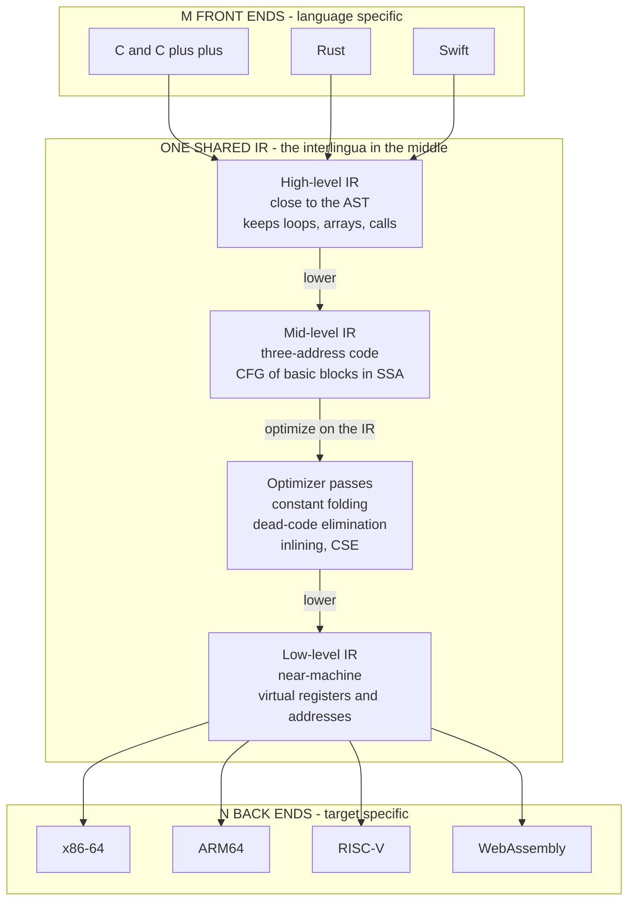

# 🔀 Intermediate Representations

> [!abstract] TL;DR
> An **intermediate representation (IR)** is the internal, machine-independent language a compiler uses **between** its language-specific *front end* and its target-specific *back end* — the neutral form where most analysis and optimization actually happen. Its reason to exist is the **M × N problem**: supporting *M* source languages on *N* target machines directly would need *M × N* whole compilers, but funneling everything through **one shared IR** needs only *M* front ends plus *N* back ends — an **M + N** economy, and the architectural insight behind the LLVM revolution. Real compilers use a **spectrum** of IRs — a *high-level* IR near the AST, a *mid-level* IR such as **three-address code** or a **control-flow graph** of simple operations (increasingly in **SSA** form), and a *low-level* IR near the machine — and **lower** a program progressively down that ladder, running reusable optimizations at the middle level. This note lives in the Semantic Analysis and IR section and is the pivot between the front end and everything after it.

---

## Intuition

**Analogy — the interlingua at a translation agency.** Imagine an agency that must translate every book among **10 languages**. The naive plan is to hire a specialist for every *ordered pair* — English→Japanese, Japanese→English, French→Arabic, and so on. That is `10 × 9 = 90` bilingual experts, and adding an eleventh language means hiring **20 more**. A smarter agency invents a single neutral **interlingua** in the middle: every language has **one** translator *into* the interlingua and **one** translator *out of* it. Now `10` languages need only `10 + 10 = 20` people, and an eleventh language costs just **2** — one in, one out. Even better, all the careful editing work — cutting redundancy, fixing awkward phrasing — is done **once**, on the interlingua, and every language pair benefits automatically.

A compiler's **intermediate representation is exactly that interlingua**: a simple, uniform code sitting between the *messy, human-oriented source language* and the *specific, unforgiving machine*. Each source language needs only a **front end** that lowers it *into* the IR; each target machine needs only a **back end** that translates the IR *out to* its instructions; and the expensive, reusable **optimizations live in the middle**, on the IR, where they are written once and pay off for every language and every chip.

---

## How It Works

### Core Mechanics

**1. Why an IR exists — the M × N problem.** A compiler front end knows everything about one *source language* (Rust, C, Swift) and nothing about any CPU. A back end knows everything about one *target machine* (x86-64, ARM64, RISC-V) and nothing about any source language. If these talked directly, every language–machine pair would be its own monolithic compiler: *M × N* of them. Insert a **shared IR** as the sole channel between front and back, and the count collapses to **M front ends + N back ends**. Adding a language costs *one* front end (reused across all targets); adding a chip costs *one* back end (reused across all languages). The IR **decouples language-specific concerns from machine-specific concerns**, and — crucially — it becomes the **single substrate where reusable optimizations live**. This is precisely the design that made **LLVM** an industry: Clang, Rustc, and Swiftc all lower to LLVM IR, and dozens of back ends and hundreds of optimization passes are shared by all of them.

**2. The spectrum of IR levels.** "IR" is not one thing but a **ladder of abstraction**, and real compilers use several rungs:

- **High-level IR (HIR)** — close to the AST. It still carries **source-language constructs**: structured loops, array accesses with bounds, method calls, type information. Good for language-specific analyses and high-level optimizations (e.g., devirtualization, some loop transforms) before detail is lost.
- **Mid-level IR (MIR)** — the classic optimization workhorse: a **linear list of simple operations** organized as a **control-flow graph (CFG)** of *basic blocks*. **Three-address code** and **SSA form** live here. Loops have been broken into conditional jumps; expressions have been flattened into elementary operations. This is where the bulk of **machine-independent optimization** happens.
- **Low-level IR (LIR)** — close to the target. Operations map nearly one-to-one onto machine instructions; addressing modes, stack frames, and (still-virtual) registers appear. This is the staging ground for **instruction selection** and **register allocation**.

**Lowering** is the act of progressively translating a program *down* this ladder — AST → HIR → MIR → LIR → machine code — each step throwing away abstraction and adding machine detail. You optimize *at the level where the relevant information still exists*: high-level facts (array bounds) before HIR is gone, classical scalar optimizations on MIR/SSA, and scheduling/register concerns on LIR.

**3. Three-address code (TAC) — the canonical mid-level form.** Three-address code is the textbook mid-level IR. Its defining rule: **each instruction has at most one operator and at most three operands** — usually one result and two sources, written `x = y op z`. Because a real expression like `a = b + c * d` has *nested* structure, TAC **flattens the tree by introducing unlimited compiler-generated temporaries** (`t1`, `t2`, …), one per interior computation:

```
t1 = c * d      # the multiply subtree becomes its own instruction
t2 = b + t1     # the add consumes the temporary, not a subtree
a  = t2         # the assignment copies the final temporary
```

The nested AST has become a **linear sequence** where every step does exactly one primitive operation — trivial to analyze, reorder, and translate. TAC is stored physically in a few flavors:

- **Quadruples** — a 4-field record `(op, arg1, arg2, result)`. Self-contained and easy to move around, so most optimizers use them.
- **Triples** — `(op, arg1, arg2)` with **no explicit result**; other instructions refer to a computation by its *position/index*. Saves space but makes reordering painful (indices shift).
- **Indirect triples** — triples plus a separate *list of pointers* giving execution order, so you can reorder by shuffling the pointer list without renumbering.

**4. Other IR forms.** The three-level spectrum is the mainstream, but IRs come in several shapes chosen to fit the language and the analysis:

- **Stack-based / bytecode IR** — operations implicitly consume and produce values on a stack (`push b; push c; push d; mul; add; store a`). Compact and easy to interpret, which is why **virtual machines** distribute it: JVM bytecode, CPython bytecode, WebAssembly.
- **Tree / DAG IRs** — keep expressions as trees or **directed acyclic graphs**; a DAG naturally shares identical subexpressions (the basis of common-subexpression elimination).
- **Continuation-passing style (CPS) and A-normal form (ANF)** — favored by *functional* compilers; they make control flow and the order of evaluation explicit and every intermediate value named, which is essentially the functional cousin of three-address code.
- **The control-flow graph (CFG)** — not an alternative but a *structuring* of the above: instructions grouped into **basic blocks** (straight-line runs with one entry and one exit) connected by edges for branches. Nearly all data-flow analysis and global optimization operate on the CFG.

**5. SSA — the modern dominant IR.** **Static Single Assignment** form is a mid-level IR discipline where **every variable is assigned exactly once**; a reassignment creates a fresh version (`x1`, `x2`, …). Where control-flow paths merge, special **φ (phi) functions** select the right incoming version. Single-assignment makes *def-use chains explicit and trivial to follow*, which is why SSA powers modern optimizers (constant propagation, value numbering, dead-code elimination) with far less bookkeeping. LLVM IR, the JVM's and V8's internal IRs, and GCC's GIMPLE are all SSA-based.

**6. LLVM IR — the canonical real-world IR.** LLVM IR is a **typed, SSA-based, target-independent** IR with three interchangeable forms: a human-readable *textual* form, a compact *bitcode* on disk, and an in-memory data structure. It looks like a well-specified assembly for an abstract machine with unlimited virtual registers. Around it sits a **reusable ecosystem**: a pass-based optimizer and a family of back ends. This realizes the **three-phase architecture** — front end → IR optimizer → back end — that lets any front end reach any target through one shared middle.

**7. IR design considerations.** Designing an IR is a set of tensions:

- **Retain enough information.** Keep the *types* and enough *source structure* to enable the optimizations you want; lose too much too early and you cannot recover it.
- **Easy to analyze and transform.** Uniformity (few instruction shapes, single assignment, explicit control flow) is worth more than expressiveness here.
- **Target-independence vs target-awareness.** A **fat, high-level IR** preserves rich semantics but is far from any machine; a **lean, low-level IR** is easy to code-generate but has thrown away high-level facts. Real compilers resolve this with **multiple levels**, lowering between them.
- **Multi-level IR — MLIR.** MLIR generalizes the whole idea: instead of one fixed IR, it provides a framework of coexisting **dialects** (from high-level tensor ops down to LLVM IR) in one representation, so domain-specific and general-purpose compilers can share infrastructure. This is the direction the field is heading.

### Flow / Architecture



*M front ends fan **into** one IR; N back ends fan **out** of it — so the cost is M + N, not M × N. Inside the seam, the program is **lowered** through IR levels, and the reusable optimizer runs on the mid-level IR where analysis is easiest.*

---

## Key Concepts

**Secondary (intuitive, no CS background needed)**
- **Neutral middle language** — the IR is a simple "in-between" code so many source languages and many machines can meet in one place.
- **Do the hard work once** — cleanup and optimization happen on the IR, so every language and chip benefits without redoing it.
- **Step down gradually** — a program is *lowered* from human-friendly toward machine-friendly in stages, not one leap.
- **One operation at a time** — a nested formula becomes a plain list of tiny steps, each doing a single thing.

**Undergraduate (a first compilers course)**
- **The M × N vs M + N argument** — why a shared IR decouples front ends from back ends and is the reusable-optimizer substrate.
- **Three-address code** — `x = y op z`, unlimited temporaries, and how nested expression trees **flatten** into a linear instruction list.
- **Quadruples, triples, indirect triples** — the physical encodings of TAC and their reordering trade-offs.
- **Basic blocks and the control-flow graph** — grouping instructions into a CFG; the structure every global optimization walks.
- **IR levels and lowering** — high-level vs mid-level vs low-level IR and the AST → IR → optimize → codegen phase order.
- **Stack/bytecode IRs** — compact distribution forms (JVM bytecode, WebAssembly) versus register/temporary-based IRs.

**Graduate (advanced compilation)**
- **SSA construction and φ-functions** — dominance frontiers, the Cytron et al. algorithm, and why single-assignment makes def-use analysis cheap.
- **IR design trade-offs** — how much type/source information to retain; fat high-level vs lean low-level IR; the case for multi-level lowering.
- **CPS and A-normal form** — functional-language IRs and their equivalence to three-address / SSA reasoning.
- **MLIR and dialects** — an extensible, multi-level IR framework generalizing LLVM for domain-specific compilers (ML, hardware, HLS).
- **Retargeting and portability** — LLVM bitcode and portable bytecode (JVM, WebAssembly) as *distribution* IRs, and the analysis/lowering that makes one IR serve many back ends.
- **Verified lowering** — proving that each lowering step (AST → IR → machine) preserves semantics, as in CompCert.

---

## Python Demo

```python
# LOWERING AN AST TO THREE-ADDRESS CODE (TAC).
# We build the AST for the assignment  a = b + c * d  and generate a linear
# sequence of three-address instructions, inventing a fresh TEMPORARY for every
# interior computation:
#       t1 = c * d      (the multiply subtree)
#       t2 = b + t1     (the add consumes the temp, not a subtree)
#       a  = t2         (final copy)
# This shows how a NESTED TREE flattens into a SIMPLE INSTRUCTION LIST.
# We print the TAC, the same code as QUADRUPLES and as STACK BYTECODE (two other
# IR styles), and VISUALIZE the tree-to-list lowering with matplotlib.
# Pure standard library (dataclasses) + matplotlib.

from dataclasses import dataclass, field
from typing import Union, List, Dict
import matplotlib.pyplot as plt

# ---------------------------------------------------------------------------
# AST node types -- the structured output of the front end.
# ---------------------------------------------------------------------------
@dataclass
class Var:
    name: str

@dataclass
class BinOp:
    op: str
    left: "Node"
    right: "Node"

@dataclass
class Assign:
    target: str
    value: "Node"

Node = Union[Var, BinOp, Assign]

# The AST for:  a = b + c * d   (with '*' binding tighter than '+')
AST = Assign("a", BinOp("+", Var("b"), BinOp("*", Var("c"), Var("d"))))

# ---------------------------------------------------------------------------
# TAC: a three-address instruction is (result, op, arg1, arg2).
# op '=' means a plain copy (arg2 unused).
# ---------------------------------------------------------------------------
@dataclass
class Instr:
    result: str
    op: str
    arg1: str
    arg2: str = ""

@dataclass
class TACGen:
    code: List[Instr] = field(default_factory=list)
    _n: int = 0
    node_to_idx: Dict[int, int] = field(default_factory=dict)  # for the picture

    def new_temp(self) -> str:
        self._n += 1
        return f"t{self._n}"

    # Post-order walk: emit children first, then the operation itself.
    def gen(self, node: Node) -> str:
        if isinstance(node, Var):
            return node.name                      # a leaf is already an operand
        if isinstance(node, BinOp):
            a = self.gen(node.left)               # flatten left subtree
            b = self.gen(node.right)              # flatten right subtree
            t = self.new_temp()                   # a fresh temporary for THIS op
            self.code.append(Instr(t, node.op, a, b))
            self.node_to_idx[id(node)] = len(self.code) - 1
            return t
        if isinstance(node, Assign):
            v = self.gen(node.value)
            self.code.append(Instr(node.target, "=", v))
            self.node_to_idx[id(node)] = len(self.code) - 1
            return node.target
        raise TypeError(node)

def fmt(instr: Instr) -> str:
    if instr.op == "=":
        return f"{instr.result} = {instr.arg1}"
    return f"{instr.result} = {instr.arg1} {instr.op} {instr.arg2}"

# ---------------------------------------------------------------------------
# Drive the lowering.
# ---------------------------------------------------------------------------
gen = TACGen()
gen.gen(AST)

print("SOURCE :  a = b + c * d\n")

def show_ast(node, indent=1):
    pad = "  " * indent
    if isinstance(node, Var):
        print(f"{pad}Var {node.name}")
    elif isinstance(node, BinOp):
        print(f"{pad}BinOp '{node.op}'")
        show_ast(node.left, indent + 1)
        show_ast(node.right, indent + 1)
    else:
        print(f"{pad}Assign '{node.target}' =")
        show_ast(node.value, indent + 1)

print("AST (nested tree):")
show_ast(AST)

print("\nTHREE-ADDRESS CODE (flattened linear list):")
for ins in gen.code:
    print(f"   {fmt(ins)}")

print("\nSAME CODE AS QUADRUPLES  (op, arg1, arg2, result):")
print(f"   {'#':>2} | {'op':^3} | {'arg1':^4} | {'arg2':^4} | result")
for i, ins in enumerate(gen.code):
    print(f"   {i:>2} | {ins.op:^3} | {ins.arg1:^4} | {ins.arg2:^4} | {ins.result}")

# ---------------------------------------------------------------------------
# A DIFFERENT IR STYLE for the same computation: stack bytecode (VM form).
# ---------------------------------------------------------------------------
def to_bytecode(node, out):
    if isinstance(node, Var):
        out.append(f"PUSH {node.name}")
    elif isinstance(node, BinOp):
        to_bytecode(node.left, out)
        to_bytecode(node.right, out)
        out.append({"+": "ADD", "-": "SUB", "*": "MUL", "/": "DIV"}[node.op])
    else:
        to_bytecode(node.value, out)
        out.append(f"STORE {node.target}")
    return out

print("\nSAME CODE AS STACK BYTECODE (an alternative IR for a VM):")
for op in to_bytecode(AST, []):
    print(f"   {op}")

# ---------------------------------------------------------------------------
# VISUALIZE the lowering: AST tree (left) flattened into the TAC list (right),
# with arrows from each interior node to the instruction it produced.
# ---------------------------------------------------------------------------
pos: Dict[int, tuple] = {}

def layout(node, depth, counter):
    if isinstance(node, Var):
        x = counter[0]; counter[0] += 1
    elif isinstance(node, BinOp):
        lx = layout(node.left, depth + 1, counter)
        rx = layout(node.right, depth + 1, counter)
        x = (lx + rx) / 2.0
    else:  # Assign has a single child
        x = layout(node.value, depth + 1, counter)
    pos[id(node)] = (x, -depth)
    return x

def node_label(node):
    if isinstance(node, Var):
        return node.name
    if isinstance(node, BinOp):
        return node.op
    return f"{node.target} ="

def draw_edges(node, ax):
    kids = []
    if isinstance(node, BinOp):
        kids = [node.left, node.right]
    elif isinstance(node, Assign):
        kids = [node.value]
    for k in kids:
        x0, y0 = pos[id(node)]; x1, y1 = pos[id(k)]
        ax.plot([x0, x1], [y0, y1], "-", color="#888888", zorder=1)
        draw_edges(k, ax)

def draw_nodes(node, ax):
    x, y = pos[id(node)]
    leaf = isinstance(node, Var)
    ax.scatter([x], [y], s=1300,
               color="#cce3ff" if leaf else "#ffd8a8",
               edgecolors="black", zorder=2)
    ax.text(x, y, node_label(node), ha="center", va="center",
            fontsize=13, fontweight="bold", zorder=3)
    for k in ([node.left, node.right] if isinstance(node, BinOp)
              else [node.value] if isinstance(node, Assign) else []):
        draw_nodes(k, ax)

fig, ax = plt.subplots(figsize=(13, 6))
layout(AST, 0, [0])
draw_edges(AST, ax)
draw_nodes(AST, ax)

# TAC instruction boxes on the right, stacked in execution order.
tac_x = max(x for x, _ in pos.values()) + 2.4
box_y = {}
for i, ins in enumerate(gen.code):
    y = -0.9 * i - 0.2
    box_y[i] = y
    ax.add_patch(plt.Rectangle((tac_x, y - 0.3), 3.6, 0.6,
                 facecolor="#e7f0ff", edgecolor="black", zorder=2))
    ax.text(tac_x + 1.8, y, fmt(ins), ha="center", va="center",
            fontsize=13, family="monospace", zorder=3)

# Arrows: each interior AST node -> the TAC instruction it lowered to.
for nid, idx in gen.node_to_idx.items():
    x0, y0 = pos[nid]
    ax.annotate("", xy=(tac_x, box_y[idx]), xytext=(x0, y0),
                arrowprops=dict(arrowstyle="->", color="#c0392b",
                                lw=1.4, alpha=0.7,
                                connectionstyle="arc3,rad=0.15"), zorder=1)

ax.text((0 + max(x for x, _ in pos.values())) / 2, 0.7,
        "AST: nested tree", ha="center", fontsize=12, fontweight="bold")
ax.text(tac_x + 1.8, 0.7, "TAC: flat list", ha="center",
        fontsize=12, fontweight="bold")
ax.set_title("Lowering  a = b + c * d  :  nested AST  ->  linear three-address code\n"
             "each interior node becomes one instruction with a fresh temporary",
             fontsize=12)
ax.axis("off")
ax.margins(0.15)
plt.tight_layout()
plt.savefig("ast_to_tac.png", dpi=130)
print("\nSaved AST-to-TAC lowering visualization to ast_to_tac.png")
```

Running it prints the nested **AST**, the flattened **three-address code** (`t1 = c * d` / `t2 = b + t1` / `a = t2`), the same program as a **quadruple table** and as **stack bytecode** (`PUSH b / PUSH c / PUSH d / MUL / ADD / STORE a`) — two contrasting IR styles for one computation — and saves a figure showing the tree on the left, the instruction list on the right, and red arrows tracing how **each interior node collapses into exactly one instruction with a fresh temporary**. That collapse is the essence of IR generation: *tree structure becomes linear, single-operation code that the optimizer and back end can chew on easily.*

---

## Real-World Applications

> **Example — LLVM IR, the interlingua that unified an industry.** LLVM is the M + N design taken to its limit. Its typed, SSA-based **LLVM IR** is the interlingua in the middle: **Clang** lowers C/C++/Objective-C into it, **Rustc** and the **Swift** compiler lower their languages into it, and downstream sit shared back ends for x86-64, ARM64, **RISC-V** (see [[RISCV_ISA_Fundamentals]]), and WebAssembly. The hundreds of optimization passes — inlining, GVN, loop transforms — are written **once against the IR** and reused by every language and every target. Adding Rust cost the ecosystem *one* front end, not one compiler per CPU. That is why "compile to LLVM IR" became the default way to bootstrap a serious new language.

Where IRs show up in practice:

- **The JVM and portable bytecode.** Java, Kotlin, and Scala compile to one **JVM bytecode** IR (see [[JVM_Execution_Model]] and [[Bytecode_and_JVM]]); HotSpot then builds its *own* SSA-based IR at run time to JIT hot methods. Bytecode doubles as a **distribution IR** — you ship the IR, not source or native code.
- **WebAssembly as a portable target.** Wasm is a stack-based, portable IR that many languages lower to and every browser executes; Rust and Go both target it (see [[Rust_WebAssembly]] and [[Go_WebAssembly]]). It is the interlingua idea applied to the web.
- **V8 and JavaScript.** V8 lowers JS through multiple IRs (Ignition bytecode, then TurboFan's "sea of nodes" SSA graph) to specialize hot code on observed types.
- **Databases and ML.** Query engines (PostgreSQL's LLVM JIT, Spark Catalyst) lower query plans into an IR and then native code; ML compilers (**XLA, TVM, MLIR-based toolchains**) lower tensor programs through *multiple* IR dialects down to GPU kernels — the multi-level IR idea in production.
- **GCC.** Uses two IRs in sequence: **GIMPLE** (a three-address, SSA-friendly mid-level IR) for machine-independent optimization, then **RTL** (a low-level IR) for code generation — a textbook high-then-low lowering pipeline.

---

## Common Pitfalls

- **Optimizing on the AST instead of the IR.** The AST is convenient but *shaped for parsing, not analysis* — control flow is implicit and expressions are deeply nested. Most classical optimizations (dead-code elimination, common-subexpression elimination, constant propagation) want a **CFG of simple, single-assignment instructions**. Lower to an IR first; do not bolt data-flow analysis onto the syntax tree.
- **Designing one IR to do everything.** A single "universal" IR is pulled apart by opposing forces: high-level facts (array bounds, types) argue for a *fat* IR, easy code generation argues for a *lean* one. The professional answer is **multiple levels with explicit lowering**, not one heroic representation.
- **Lowering too early and losing information.** Once you discard types or high-level loop structure, you cannot cheaply recover them, and whole classes of optimization become impossible. **Optimize at the level where the needed information still exists**, then lower.
- **Confusing three-address code with a fixed physical layout.** TAC is a *model* (`x = y op z` with temporaries); **quadruples, triples, and indirect triples** are different *encodings* with different reordering costs. Choosing triples and then trying to reorder instructions is painful because positional references shift.
- **Thinking SSA is free.** SSA makes analysis easy *after* construction, but building it (placing φ-functions via dominance frontiers) and destroying it (removing φ's before register allocation) are real, non-trivial passes. SSA is a discipline you pay to enter and exit, not a magic switch.
- **Treating bytecode as "already optimized."** A distribution IR like JVM bytecode or Wasm is a *portable interchange* format, not a peak-performance one; the heavy optimization still happens afterward in the JIT/AOT engine that consumes it.

---

## Related Concepts

- [[Compilers_Overview]] — the parent map: IR is the seam of the front/middle/back end split this note opens up.
- [[Theory_of_Computation_Overview]] — the AST that IR generation consumes comes from context-free parsing; the theoretical ladder behind the front end.
- [[JVM_Execution_Model]] — a real bytecode IR plus a JIT that builds its own SSA IR at run time; the M + N idea embodied in a VM.
- [[Bytecode_and_JVM]] — the JVM's stack-based distribution IR in detail, a concrete non-register IR form.
- [[ISA_Design_RISC_vs_CISC]] — the target whose shape the *low-level* IR is designed to reach; instruction selection lowers IR onto it.
- [[RISCV_ISA_Fundamentals]] — a clean back-end target: the instruction set the code generator emits after IR lowering.
- [[Assembly_Programming]] — the human-readable form of what the back end produces once the IR is fully lowered.
- [[ABI_and_Calling_Conventions]] — the runtime contract the low-level IR and code generator must honor (stack frames, register usage).
- [[Rust_WebAssembly]] — Rust lowering to WebAssembly, a portable IR/target in the wild.
- [[Go_WebAssembly]] — Go targeting the same portable Wasm IR; the interlingua idea on the web platform.

*(Forthcoming Compilers siblings referenced in prose above — `Semantic_Analysis_and_Symbol_Tables`, `Static_Single_Assignment_Form`, `Control_Flow_and_Data_Flow_Analysis`, `Code_Generation_and_Instruction_Selection`, `Local_and_Global_Optimizations`, `Loop_Optimizations`, `Bytecode_and_Virtual_Machines`, `Compiler_Toolchains_and_LLVM`, `WebAssembly_and_Portable_Targets`, and `The_Future_of_Compilers` — are not yet linked because their notes do not exist in the vault.)*

---

## Review Questions

1. **(Conceptual)** Using the translation-agency interlingua analogy, explain why a compiler inserts a shared IR between the front and back ends. Give the exact component count for supporting 4 source languages on 5 target machines *with* and *without* a shared IR, and state which concerns the IR decouples.
2. **(Scenario)** You are handed the AST for `x = (a - b) * (a - b)` and must emit three-address code. Write the TAC with temporaries, then explain (a) how a **DAG-based** IR could compute `a - b` only once, and (b) why you would perform that common-subexpression elimination on the *IR*, not on the AST or the final assembly.
3. **(Trade-off)** A team is designing a new compiler and debates a single "fat" high-level IR versus a single "lean" low-level IR. Argue why *neither extreme* is ideal, describe a **multi-level lowering** pipeline (name the levels and what optimization happens at each), and explain what MLIR-style dialects add on top of that idea.

---

## Sources

- Aho, A., Lam, M., Sethi, R., Ullman, J. *Compilers: Principles, Techniques, and Tools*, 2nd ed. Pearson, 2006 — the "Dragon Book," Ch. 6 on intermediate-code generation, three-address code, quadruples/triples.
- Cooper, K., Torczon, L. *Engineering a Compiler*, 3rd ed. Morgan Kaufmann, 2022 — Ch. 4–5 on IRs, the level spectrum, and SSA-centric design.
- Cytron, R., Ferrante, J., Rosen, B., Wegman, M., Zadeck, F. K. "Efficiently Computing Static Single Assignment Form and the Control Dependence Graph." *ACM TOPLAS*, 1991 — the foundational SSA-construction paper.
- Lattner, C., Adve, V. "LLVM: A Compilation Framework for Lifelong Program Analysis and Transformation." *CGO*, 2004 — the reusable, IR-centric M + N architecture; see also the [LLVM Language Reference](https://llvm.org/docs/LangRef.html).
- Lattner, C., et al. "MLIR: Scaling Compiler Infrastructure for Domain Specific Computation." *CGO*, 2021 — the multi-level, multi-dialect generalization of the IR idea ([mlir.llvm.org](https://mlir.llvm.org)).

---

#compilers #intermediate-representation #three-address-code #llvm-ir #ir-lowering
