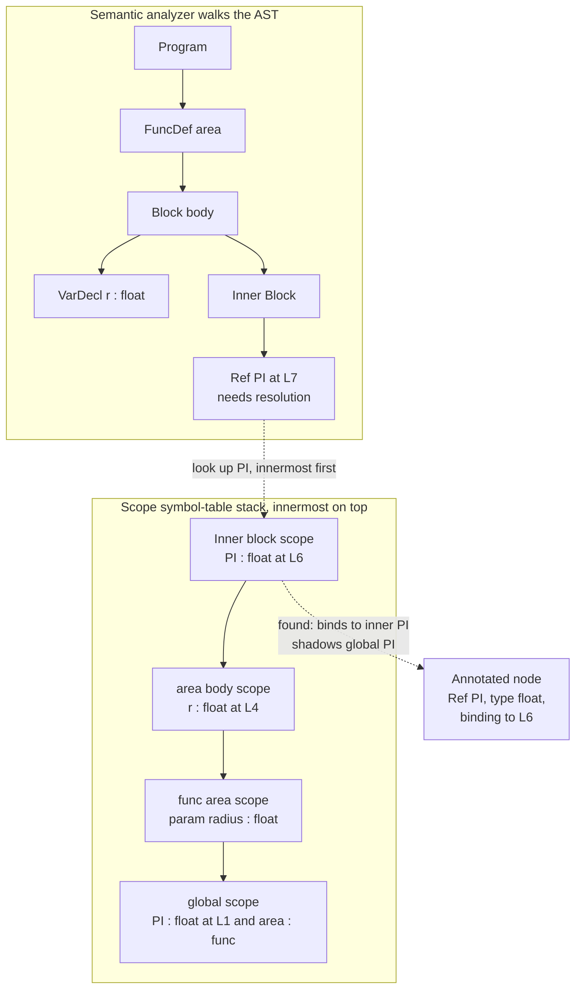

# 🧭 Semantic Analysis and Symbol Tables

> [!abstract] TL;DR
> **Semantic analysis** is the compiler phase after parsing that checks a program is not just grammatically well-formed but actually **meaningful**: every name is declared before use, every operation acts on compatible types, every call passes the right number of arguments. It does this by building a **symbol table** — a stack of nested "address books" mapping each name to its attributes (kind, type, scope, storage) — and walking the syntax tree to **resolve** each identifier to the declaration it refers to, producing a *decorated AST* ready for type checking and IR generation.

---

## Intuition

**Analogy:** Parsing is the grammar teacher who checks that a sentence has a valid subject-verb-object shape. "The number seven ate the color blue" passes that check — it is a perfectly grammatical sentence. But it is **nonsense**: numbers do not eat and colors are not food. Semantic analysis is the *meaning* teacher who catches exactly this. In code, `x = y + foo` is grammatically fine, but it is nonsense if `y` was never declared, if `foo` is a function rather than a value, or if `y` is a string and `foo` is a list.

To decide what each word *means*, you need to remember what every name was defined as, and that memory is **scoped** like a set of nested address books. Your street's directory knows your neighbors; your city's directory knows more; the national directory knows the rest. To look up "Alice" you check the innermost book first and only fall outward if she is not there. A compiler's **symbol table** is exactly that nested lookup, and the act of finding which "Alice" a name refers to is **name resolution**.

---

## How It Works

### Core Mechanics

Syntax is what a **context-free grammar** can express: parentheses balance, `if` has a `then`, an expression has valid shape. But a huge class of rules is **context-sensitive** — the validity of a token depends on what was declared *elsewhere* in the program:

- *declare-before-use* — a name must have a visible declaration,
- *type agreement* — you cannot add a string to a function,
- *arity* — a call must pass the number of arguments the callee expects,
- *return-type matching*, *break/continue only inside loops*, *no redeclaration in one scope*.

No context-free grammar can enforce these (the language "declare every variable before you use it" is not context-free — it is the compiler analogue of `a^n b^n c^n`, which sits above the context-free tier of the [[Theory_of_Computation_Overview|Chomsky hierarchy]] and is discussed in [[The_Limits_of_Computation]]). See [[Context_Free_Grammars_and_Languages]] for why CFGs stop exactly here. Semantic analysis is the phase that enforces these context-sensitive rules **on the AST**, using a symbol table as its memory.

**The pipeline.** The parser (see the sibling note `Context_Free_Grammars_for_Parsing` and `Abstract_Syntax_Trees_and_Parser_Design`) hands semantic analysis an untyped AST. Semantic analysis performs one or more traversals that:

1. **Build scopes.** Entering a function, block, class, or module pushes a new **symbol table**; leaving it pops back. Scopes nest, forming a stack along any active path and a tree overall.
2. **Insert declarations.** Each `VarDecl`, `FuncDecl`, parameter, or type definition inserts a **symbol** — a record of `{name, kind, type, storage, decl-location}` — into the current scope. Redeclaring the same name in the same scope is an error.
3. **Resolve references.** Each identifier *use* is looked up starting in the **innermost** scope and walking **outward** to enclosing scopes until a binding is found (or an "undeclared identifier" error is raised). When an inner declaration hides an outer one of the same name, the use resolves to the inner: this is **shadowing**.
4. **Annotate nodes.** The resolved binding (and, via type checking, the resolved type) is attached to the AST node. The result is a **decorated AST**.

**Symbol table implementation.** Each scope is typically a **hash table** from name to symbol (see [[Hash_Table_Fundamentals]] for the O(1) average lookup and [[Collision_Resolution]] for what happens when names collide). Scopes are chained by parent pointers, so resolution is "hash-probe the current table, else follow the parent link." A classic alternative is one global hash table whose buckets hold *scoped chains*, pushed and popped as scopes open and close.

**Lexical vs dynamic scoping.** Under **lexical (static) scoping** — used by C, Java, Python, Rust — a name resolves according to the *textual* nesting of scopes, decidable entirely at compile time. Under **dynamic scoping** (old Lisp, Bash) a name resolves along the *call chain* at run time. Semantic analysis as described here assumes lexical scoping, which is why resolution can be a compile-time tree walk.

**Two-pass resolution and forward references.** A function may call another function defined *later* in the file, or a method may reference a field declared below it. A single left-to-right pass would flag these as undeclared. The fix is **two passes**: pass one *hoists* all declarations of a scope into its symbol table; pass two walks the bodies and resolves references against the now-complete table. (Local variables inside a block usually keep strict declare-before-use ordering, so hoisting is scoped to declarations that a language says may be forward-referenced.)

**Attribute grammars.** The formal framework is Knuth's **attribute grammar**: each grammar symbol carries **attributes**, and each production has **semantic rules** computing them. **Synthesized** attributes flow *up* the tree (a node's type computed from its children — e.g., the type of `a + b`). **Inherited** attributes flow *down* (the enclosing scope passed into a subtree). Semantic analysis is **syntax-directed translation** — the practical realization of these rules, usually via the **visitor pattern** over the AST (see [[Tree_Traversals]] for the traversal machinery).

**Output.** A fully decorated AST: every name resolved to its declaration, every expression typed (type checking proper is delegated to the sibling notes `Type_Checking_and_Type_Systems` and `Type_Inference_and_Hindley_Milner`), every scope recorded. This annotated tree is the input to `Intermediate_Representations` and IR generation.

### Flow / Architecture



---

## Key Concepts

**Secondary (plain-language):**
- *Grammatical vs meaningful* — a sentence can be well-formed yet nonsense; semantic analysis catches the nonsense.
- *Declare before use* — you cannot refer to a name the program never introduced.
- *Scope* — the region of code where a name is visible; names in an inner region can hide names in an outer one (**shadowing**).

**Undergraduate:**
- *Symbol table* — a map from name to attributes `{kind, type, storage, scope, decl-site}`, implemented as a hash table per scope, chained by parent pointers.
- *Name resolution* — probe the innermost scope, walk outward until a binding is found; "not found anywhere" is an undeclared-identifier error.
- *Lexical vs dynamic scoping* — resolve by textual nesting (compile time) vs by call chain (run time).
- *Two-pass resolution* — hoist declarations first so bodies can forward-reference them.
- *The semantic checks* — no redeclaration in one scope, arity of calls, return-type match, `break`/`continue` only in loops, definite assignment, type compatibility (delegated to type checking).
- *Visitor pattern* — the standard way to run the analysis as an AST traversal, annotating nodes in place.

**Graduate:**
- *Attribute grammars* — synthesized (bottom-up) vs inherited (top-down) attributes; S-attributed and L-attributed definitions and their single-pass evaluability.
- *Namespaces* — separate type-vs-value namespaces (C lets `struct foo` and a variable `foo` coexist), label namespaces, module namespaces; qualified names.
- *Overload resolution and name mangling* — one source name maps to several symbols; the compiler picks by argument types and encodes the choice into a mangled linker symbol.
- *Modules, imports, cyclic dependencies* — resolving qualified names across compilation units; breaking or forbidding import cycles.
- *Definite assignment / reachability* — dataflow analyses layered onto semantic analysis (Java's "variable might not have been initialized").
- *Language design feedback* — scoping and declaration rules (block scoping, hoisting, closures) are language *design* decisions that this phase encodes.

---

## Python Demo

A pure-stdlib scoped symbol table plus a name-resolution pass over a tiny AST. It builds nested scopes (global → function → block), inserts declarations, resolves each identifier by searching innermost-to-outermost, detects **use-before-declaration**, **undeclared**, and **redeclaration** errors, and uses matplotlib to visualize the nested-scope structure and which declaration each use resolves to (including shadowing).

```python
# Scoped symbol table + name-resolution pass over an AST.
# Detects use-before-declaration, undeclared, and redeclaration errors,
# then visualizes nested scopes and how each use resolves (shadowing).
from dataclasses import dataclass, field
from typing import Optional, List, Tuple
import matplotlib.pyplot as plt
from matplotlib.patches import FancyBboxPatch

# ---------- AST node types ----------
@dataclass
class Node: pass
@dataclass
class Program(Node):   decls: list
@dataclass
class FuncDecl(Node):   name: str; params: list; ret: str; body: "Block"; line: int
@dataclass
class Block(Node):      stmts: list
@dataclass
class VarDecl(Node):    name: str; type: str; line: int; init: Optional[Node] = None
@dataclass
class Return(Node):     expr: Node; line: int
@dataclass
class ExprStmt(Node):   expr: Node; line: int
@dataclass
class Ref(Node):        name: str; line: int
@dataclass
class BinOp(Node):      op: str; left: Node; right: Node
@dataclass
class Num(Node):        value: float

# ---------- Symbol + Scope ----------
@dataclass
class Symbol:
    name: str; kind: str; type: str; scope: str; decl_line: int

class Scope:
    def __init__(self, name, parent=None):
        self.name = name
        self.parent = parent
        self.symbols = {}          # insertion-ordered name -> Symbol (a hash table)
        self.pending = set()       # names declared later in THIS block (for use-before-decl)
        self.children = []
        if parent is not None:
            parent.children.append(self)

# ---------- The semantic analyzer (a visitor) ----------
class SemanticAnalyzer:
    def __init__(self):
        self.global_scope = Scope("global")
        self.errors = []
        self.resolutions = []      # (name, use_line, decl_scope, decl_line, shadowed)

    def define(self, scope, sym):
        if sym.name in scope.symbols:                     # redeclaration check
            prev = scope.symbols[sym.name]
            self.errors.append(
                f"L{sym.decl_line}: redeclaration of '{sym.name}' in scope "
                f"'{scope.name}' (previously declared at L{prev.decl_line})")
        else:
            scope.symbols[sym.name] = sym

    def resolve(self, name, line, scope):
        s = scope
        while s is not None:
            if name in s.symbols:                         # found a binding
                sym = s.symbols[name]
                shadowed = self._is_shadowed(name, s)     # same name further out?
                self.resolutions.append((name, line, s.name, sym.decl_line, shadowed))
                return sym
            if name in s.pending:                          # declared later in same block
                self.errors.append(
                    f"L{line}: use of '{name}' before its declaration in scope '{s.name}'")
                return None
            s = s.parent
        self.errors.append(f"L{line}: undeclared identifier '{name}'")
        return None

    def _is_shadowed(self, name, decl_scope):
        outer = decl_scope.parent
        while outer is not None:
            if name in outer.symbols:
                return True
            outer = outer.parent
        return False

    # --- traversal ---
    def analyze(self, program):
        for d in program.decls:                            # pass 1: hoist top-level names
            if isinstance(d, FuncDecl):
                self.define(self.global_scope, Symbol(d.name, "func", d.ret, "global", d.line))
            elif isinstance(d, VarDecl):
                self.define(self.global_scope, Symbol(d.name, "var", d.type, "global", d.line))
        for d in program.decls:                            # pass 2: walk bodies
            if isinstance(d, FuncDecl):
                self.visit_func(d)
        return self

    def visit_func(self, fn):
        fscope = Scope(f"func {fn.name}", parent=self.global_scope)
        for pname, ptype in fn.params:
            self.define(fscope, Symbol(pname, "param", ptype, fscope.name, fn.line))
        self.visit_block(fn.body, fscope, f"{fn.name} body")

    def visit_block(self, block, parent, name):
        scope = Scope(name, parent=parent)
        scope.pending = {s.name for s in block.stmts if isinstance(s, VarDecl)}
        for stmt in block.stmts:
            if isinstance(stmt, VarDecl):
                if stmt.init is not None:
                    self.visit_expr(stmt.init, scope)      # resolve init before defining
                scope.pending.discard(stmt.name)
                self.define(scope, Symbol(stmt.name, "var", stmt.type, scope.name, stmt.line))
            elif isinstance(stmt, Block):
                self.visit_block(stmt, scope, "inner block")
            elif isinstance(stmt, (Return, ExprStmt)):
                self.visit_expr(stmt.expr, scope)

    def visit_expr(self, e, scope):
        if isinstance(e, Ref):
            self.resolve(e.name, e.line, scope)
        elif isinstance(e, BinOp):
            self.visit_expr(e.left, scope); self.visit_expr(e.right, scope)
        # Num: nothing to resolve

# ---------- Program A: valid, demonstrates nested scopes + shadowing ----------
prog_a = Program([
    VarDecl("PI", "float", 1),
    FuncDecl("area", [("radius", "float")], "float", Block([
        VarDecl("r", "float", 4,
                init=BinOp("*", BinOp("*", Ref("PI", 4), Ref("radius", 4)), Ref("radius", 4))),
        Block([                                             # inner block opens new scope
            VarDecl("PI", "float", 6),                      # <-- shadows global PI
            Return(Ref("PI", 7), 7),                        # resolves to inner PI, not global
        ]),
        Return(Ref("r", 8), 8),
    ]), line=3),
])

# ---------- Program B: three classic semantic errors ----------
prog_b = Program([
    FuncDecl("bad", [], "void", Block([
        ExprStmt(Ref("y", 2), 2),      # use-before-declaration (y declared at L4)
        VarDecl("z", "int", 3),
        VarDecl("y", "int", 4),
        VarDecl("z", "int", 5),        # redeclaration of z
        ExprStmt(Ref("w", 6), 6),      # undeclared identifier
    ]), line=1),
])

analyzer_a = SemanticAnalyzer().analyze(prog_a)
analyzer_b = SemanticAnalyzer().analyze(prog_b)

print("=== Program A resolutions (use -> declaration) ===")
for name, uline, dscope, dline, shadow in analyzer_a.resolutions:
    tag = "   [SHADOWS an outer declaration]" if shadow else ""
    print(f"  Ref {name:<7} @L{uline}  ->  {dscope} : '{name}' @L{dline}{tag}")
print("\n=== Program B semantic errors (recovered to find all) ===")
for err in analyzer_b.errors:
    print("  " + err)

# ---------- Visualization ----------
# Follow the deepest scope path for the nested-box picture.
path = []
sc = analyzer_a.global_scope
while sc is not None:
    path.append(sc)
    sc = sc.children[0] if sc.children else None

ROW = 0.42
def box_h(i):
    own = 0.7 + ROW * len(path[i].symbols) + 0.3
    if i + 1 < len(path):
        own += 0.2 + box_h(i + 1) + 0.25
    return own

fig, (axL, axR) = plt.subplots(1, 2, figsize=(13.5, 7.2),
                               gridspec_kw={"width_ratios": [1.35, 1]})
colors = ["#e8f0fe", "#dcedc8", "#ffe0b2", "#f8bbd0"]

def draw_box(i, x, top, w):
    h = box_h(i)
    axL.add_patch(FancyBboxPatch((x, top - h), w, h, boxstyle="round,pad=0.03",
                  linewidth=1.6, edgecolor="#37474f",
                  facecolor=colors[i % len(colors)]))
    axL.text(x + 0.15, top - 0.4, path[i].name, fontweight="bold", fontsize=11)
    yy = top - 0.85
    for sym in path[i].symbols.values():
        shadow = ""
        for j in range(i):
            if sym.name in path[j].symbols:
                shadow = f"   [shadows @L{path[j].symbols[sym.name].decl_line}]"
                break
        axL.text(x + 0.35, yy,
                 f"{sym.kind} {sym.name} : {sym.type}  @L{sym.decl_line}{shadow}",
                 fontsize=9.5, color=("#b71c1c" if shadow else "#212121"))
        yy -= ROW
    if i + 1 < len(path):
        draw_box(i + 1, x + 0.45, yy - 0.15, w - 0.9)

H = box_h(0)
draw_box(0, 0.3, H + 0.3, 7.2)
axL.set_xlim(0, 8.2); axL.set_ylim(0, H + 0.7); axL.axis("off")
axL.set_title("Nested scopes (symbol-table stack)\ninnermost = deepest box",
              fontsize=12, fontweight="bold")

# Right panel: each use and the declaration it resolves to.
axR.axis("off")
axR.set_title("Name resolution: use -> declaration", fontsize=12, fontweight="bold")
axR.text(0.02, 0.93, "identifier use            resolves to", fontsize=10,
         family="monospace", fontweight="bold")
y = 0.85
for name, uline, dscope, dline, shadow in analyzer_a.resolutions:
    line = f"Ref {name:<7}@L{uline}   ->   {dscope}: {name} @L{dline}"
    axR.text(0.02, y, line, fontsize=10, family="monospace",
             color=("#b71c1c" if shadow else "#1b5e20"))
    if shadow:
        axR.text(0.62, y, "SHADOWS outer PI", fontsize=9, family="monospace",
                 color="#b71c1c", fontweight="bold")
    y -= 0.09
axR.text(0.02, y - 0.03,
         "Innermost-first lookup makes L7's PI bind to the\ninner declaration (L6), hiding the global PI (L1).",
         fontsize=9.5, style="italic", color="#37474f")

plt.tight_layout()
plt.savefig("scope_resolution.png", dpi=120)  # optional
plt.show()
```

Console output:

```
=== Program A resolutions (use -> declaration) ===
  Ref PI      @L4  ->  global : 'PI' @L1
  Ref radius  @L4  ->  func area : 'radius' @L3
  Ref radius  @L4  ->  func area : 'radius' @L3
  Ref PI      @L7  ->  inner block : 'PI' @L6   [SHADOWS an outer declaration]
  Ref r       @L8  ->  area body : 'r' @L4

=== Program B semantic errors (recovered to find all) ===
  L2: use of 'y' before its declaration in scope 'bad body'
  L5: redeclaration of 'z' in scope 'bad body' (previously declared at L3)
  L6: undeclared identifier 'w'
```

The figure shows the four nested scopes as boxes-inside-boxes (global outermost, inner block innermost, with the shadowing `PI` flagged in red) and, on the right, exactly which declaration each identifier use binds to.

---

## Real-World Applications

> **Example — Clang's `Sema`.** Clang splits its front end cleanly: the `Parser` produces AST nodes and immediately hands each to `Sema` (semantic analysis), which owns the symbol tables (`DeclContext`/`Scope`), performs name lookup, overload resolution, and type checking, and attaches resolved `Decl` pointers to expression nodes. Only a fully `Sema`-checked AST reaches CodeGen. Its famous "did you mean ...?" diagnostics are typo-correction over the symbol table.

> **Example — Python's compiler.** CPython runs a **symbol-table pass** (`symtable`) before bytecode generation: it walks the AST to classify each name as local, global, nonlocal, or free, deciding whether a use loads from `LOAD_FAST`, `LOAD_DEREF`, or `LOAD_GLOBAL`. The `UnboundLocalError` you get for using a name before assigning it in a function is precisely a use-before-definition result of this scoped analysis.

> **Example — TypeScript / rustc.** Both run a distinct name-resolution phase (rustc's `resolve` maps every path to a `DefId` across modules, handling `use` imports and cyclic module graphs) before the type checker runs — a textbook two-phase "resolve then check" split.

---

## Common Pitfalls

- **Confusing use-before-declaration with undeclared.** If a name is declared *later in the same block*, using it early is a scoping error, not "undeclared." Track a per-scope set of pending declarations (as the demo does) so you emit the right message — and match the language's rule (Python treats any assignment in a function as making the name local, causing `UnboundLocalError`).
- **Forgetting to pop scopes.** If you push a scope on block entry but forget to pop on exit, later sibling code can wrongly resolve to inner names. Bind scope push/pop to enter/exit of the visitor method (RAII, `try/finally`, or a context manager).
- **Single-pass resolution breaking forward references.** Mutually recursive functions or fields referenced above their declaration need a hoisting pass first. A naive left-to-right walk reports spurious "undeclared" errors.
- **Collapsing separate namespaces.** In C, a type tag, a variable, a label, and a struct member can share a spelling. Storing them in one flat map produces false redeclaration errors; use per-namespace tables.
- **Stopping at the first error.** A compiler that aborts on error one has terrible ergonomics. Collect errors and recover (skip to a synchronizing point, insert a placeholder "error" symbol) so one compile reports many problems.
- **Leaking dynamic-scoping behavior.** Resolving a closure's free variables by the call chain rather than the defining scope is a classic bug; lexical scoping resolves them where the function is *written*.

---

## Related Concepts

- [[Context_Free_Grammars_and_Languages]] — defines exactly the syntactic rules a CFG can express; semantic analysis enforces the context-sensitive rules that lie beyond it.
- [[Theory_of_Computation_Overview]] — the Chomsky hierarchy places declare-before-use above the context-free tier, in the context-sensitive languages.
- [[The_Limits_of_Computation]] — why some correctness properties are undecidable, bounding what static semantic checks can guarantee.
- [[Hash_Table_Fundamentals]] — the symbol table's core data structure: O(1) average name lookup per scope.
- [[Collision_Resolution]] — how a symbol-table hash map handles two names hashing to the same bucket.
- [[Tree_Traversals]] — the visitor/traversal mechanics used to walk the AST and annotate nodes.

Not-yet-created Compilers siblings referenced above (in prose): `Abstract_Syntax_Trees_and_Parser_Design`, `Context_Free_Grammars_for_Parsing`, `Type_Checking_and_Type_Systems`, `Type_Inference_and_Hindley_Milner`, `Intermediate_Representations`, and `Runtime_Systems_and_the_ABI`.

---

## Review Questions

1. **(Secondary)** A parser accepts the line `total = price + 7`, yet the compiler still rejects the program. Give two different semantic reasons the compiler might reject it, and explain why the parser could not have caught them.
2. **(Undergraduate)** You are implementing name resolution with a stack of hash-table scopes. Describe the algorithm for resolving an identifier, and explain what "shadowing" is in terms of that algorithm. Why do mutually recursive functions force you into two passes rather than one?
3. **(Graduate)** Distinguish **synthesized** and **inherited** attributes in an attribute grammar, giving one example of each from semantic analysis. Then argue whether overload resolution (choosing among several functions with the same name by argument types) can be expressed as a purely local, single-pass syntax-directed rule, or whether it needs global information — and what that implies for name mangling at the linker.

---

## Sources

- Aho, Lam, Sethi, Ullman, *Compilers: Principles, Techniques, and Tools* (2nd ed., "Dragon Book"), Ch. 2.7 (symbol tables) and Ch. 6 (semantic checks). [Pearson](https://www.pearson.com/en-us/subject-catalog/p/compilers-principles-techniques-and-tools/P200000003472)
- Cooper & Torczon, *Engineering a Compiler* (2nd ed.), Ch. 4 "Context-Sensitive Analysis" (attribute grammars) and Ch. 5 (symbol tables & scope). [Elsevier](https://www.elsevier.com/books/engineering-a-compiler/cooper/978-0-12-088478-0)
- Donald E. Knuth, "Semantics of Context-Free Languages," *Mathematical Systems Theory* 2 (1968) — the original attribute-grammar paper. [Springer](https://link.springer.com/article/10.1007/BF01692511)
- Robert Nystrom, *Crafting Interpreters*, "Resolving and Binding." [craftinginterpreters.com](https://craftinginterpreters.com/resolving-and-binding.html)
- Andrew W. Appel, *Modern Compiler Implementation in Java*, Ch. 5 "Semantic Analysis." [Cambridge University Press](https://www.cs.princeton.edu/~appel/modern/java/)

---

#compilers #semantic-analysis #symbol-table #scoping #name-resolution
